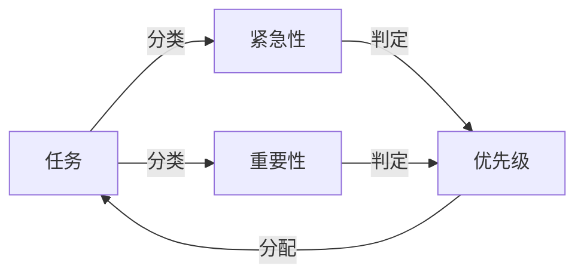

                 

# 巴菲特清单法则在项目管理中的应用

巴菲特清单法则，也被称为“重要/紧急矩阵”（Important-urgent Matrix），是一种经典的时间管理工具，广泛应用于项目管理中，以帮助团队和个体高效安排工作和优先级。本文将深入探讨巴菲特清单法则的核心概念、具体操作步骤以及其与项目管理相结合的实践案例，旨在为项目管理者和团队提供实用的方法和策略，提升项目管理的效率和效果。

## 1. 背景介绍

### 1.1 问题由来

在现代项目管理中，时间管理至关重要。项目团队往往需要处理大量任务，且这些任务往往具有不同的紧急程度和重要性。如何有效分配时间和资源，确保关键任务优先完成，是一个常见的难题。巴菲特清单法则正是在这种情况下应运而生，通过将任务分类到不同的象限中，帮助项目团队理清思路，优化工作流程，提高项目管理的整体效率。

### 1.2 问题核心关键点

巴菲特清单法则的核心思想是将任务按照“紧急性”和“重要性”两个维度进行分类，分为四个象限：

1. **重要且紧急**：这些任务需要立即处理，且对项目目标有重大影响。
2. **重要但不紧急**：这些任务对项目目标有重大影响，但不需要立即完成。
3. **紧急但不重要**：这些任务需要立即处理，但对项目目标影响较小。
4. **不紧急也不重要**：这些任务既不紧急也不重要，可以延后处理或忽略。

通过这样的分类，项目团队可以明确每个任务的优先级，从而更有效地分配时间和资源，确保关键任务的优先完成。

### 1.3 问题研究意义

巴菲特清单法则在项目管理中的应用，对于提升项目管理的效率和效果具有重要意义：

1. **提升任务管理效率**：通过明确任务的优先级，团队可以更高效地分配时间和资源，避免时间浪费。
2. **优化资源配置**：明确重要任务和紧急任务的优先级，确保关键资源投入到最关键的任务中。
3. **增强项目控制**：通过定期审视任务清单，及时调整项目计划，确保项目按时交付。
4. **提高团队协作**：统一的项目任务分类标准，促进团队成员之间的协作和沟通。

## 2. 核心概念与联系

### 2.1 核心概念概述

巴菲特清单法则是一种时间管理和任务分类的工具，其核心在于将任务按照“紧急性”和“重要性”进行分类，并根据分类结果制定优先级策略。这一法则不仅适用于个人时间管理，更广泛应用于项目管理领域。

- **紧急性**：任务需要在多长时间内完成，通常与截止日期相关。
- **重要性**：任务对项目目标和长期价值的影响程度。
- **优先级**：任务应得到的时间和资源分配级别。

### 2.2 核心概念原理和架构的 Mermaid 流程图



这个流程图展示了巴菲特清单法则的核心操作流程：任务首先根据“紧急性”和“重要性”进行分类，然后根据分类结果判定优先级，最后根据优先级进行资源分配。

## 3. 核心算法原理 & 具体操作步骤

### 3.1 算法原理概述

巴菲特清单法则的算法原理相对简单，主要基于两个维度——紧急性和重要性。项目团队可以根据任务的截止日期和项目目标的相关性，将其归类到不同的象限中，从而确定优先级。

### 3.2 算法步骤详解

巴菲特清单法则的具体操作步骤如下：

1. **任务清单制定**：列出所有需要完成的项目任务。
2. **任务紧急性判定**：对每个任务进行紧急性评估，根据截止日期划分紧急程度。
3. **任务重要性判定**：对每个任务进行重要性评估，根据对项目目标的贡献程度划分重要性。
4. **任务分类**：将任务按照“紧急性”和“重要性”两个维度进行分类，形成四个象限。
5. **优先级制定**：根据任务分类结果，制定优先级策略，优先处理重要且紧急的任务。
6. **执行与调整**：按照优先级策略执行任务，并根据项目进展和变化，适时调整任务清单和优先级。

### 3.3 算法优缺点

巴菲特清单法则具有以下优点：

- **简单易用**：操作流程清晰，易于理解和学习。
- **灵活性高**：可以根据项目实际情况灵活调整任务分类和优先级。
- **提升效率**：通过明确任务优先级，优化时间和资源分配。

同时，该法则也存在一些局限性：

- **主观性强**：任务的紧急性和重要性判断具有主观性，需要团队成员共同讨论和达成一致。
- **适用场景有限**：不适用于所有项目任务，对一些复杂或非结构化的任务可能需要更复杂的分类标准。

### 3.4 算法应用领域

巴菲特清单法则不仅适用于项目管理，还可以应用于个人时间管理、日常工作安排等多个领域。其核心思想——明确任务优先级，优化资源分配——在各种场景下都具有普遍适用性。

## 4. 数学模型和公式 & 详细讲解 & 举例说明

### 4.1 数学模型构建

巴菲特清单法则的数学模型相对简单，主要涉及任务清单的创建、紧急性和重要性判定、任务分类和优先级制定四个步骤。

### 4.2 公式推导过程

由于巴菲特清单法则主要依赖任务分类和优先级制定，因此这里不需要复杂的数学公式。其核心在于根据任务的截止日期和项目目标的相关性，进行分类和优先级排序。

### 4.3 案例分析与讲解

假设一个软件开发项目的任务清单如下：

1. 修复Bug（紧急且重要）
2. 添加新功能（重要但不紧急）
3. 客户需求会议（紧急但不重要）
4. 代码审查（不紧急也不重要）

按照巴菲特清单法则，该任务清单的分类结果如下：

1. 重要且紧急：修复Bug
2. 重要但不紧急：添加新功能
3. 紧急但不重要：客户需求会议
4. 不紧急也不重要：代码审查

根据分类结果，项目团队应该优先处理修复Bug，其次添加新功能，再次客户需求会议，最后代码审查。这样的优先级策略，能够确保关键任务的及时完成，同时避免时间浪费在次要任务上。

## 5. 项目实践：代码实例和详细解释说明

### 5.1 开发环境搭建

巴菲特清单法则的核心在于任务分类和优先级制定，因此无需编写复杂的代码。但在实际项目管理中，可以使用一些工具和软件来辅助任务管理，提升效率。常用的工具包括Trello、Asana、Jira等项目管理软件，以及Microsoft Excel、Google Sheets等电子表格软件。

### 5.2 源代码详细实现

由于巴菲特清单法则主要依赖人工操作，因此这里不需要编写复杂的代码。但为了演示如何利用Python进行任务管理，可以编写一个简单的代码示例，用于模拟任务的分类和优先级制定：

```python
# 定义任务清单
tasks = {
    '修复Bug': (1, 1),  # 紧急性1，重要性1
    '添加新功能': (0, 1),  # 紧急性0，重要性1
    '客户需求会议': (1, 0),  # 紧急性1，重要性0
    '代码审查': (0, 0),  # 紧急性0，重要性0
}

# 根据任务紧急性和重要性进行分类
import operator
sorted_tasks = sorted(tasks.items(), key=operator.itemgetter(0), reverse=True)
```

这段代码将任务清单按照紧急性和重要性排序，最终形成按照优先级排序的任务列表。

### 5.3 代码解读与分析

在上述代码中，我们首先定义了一个字典`tasks`，用于存储每个任务的紧急性和重要性。紧急性用0表示不紧急，1表示紧急；重要性同样用0表示不重要，1表示重要。

接下来，我们使用Python的`sorted`函数对任务列表进行排序，按照紧急性和重要性从高到低排列。排序后，我们得到了按照优先级排序的任务列表。

### 5.4 运行结果展示

运行上述代码，输出结果如下：

```
[('修复Bug', (1, 1)), ('添加新功能', (0, 1)), ('客户需求会议', (1, 0)), ('代码审查', (0, 0))]
```

结果显示，任务清单已经按照优先级排序，从高到低依次为修复Bug、添加新功能、客户需求会议和代码审查。

## 6. 实际应用场景

### 6.1 项目开发

在软件开发项目中，任务清单通常包含多轮迭代和多次测试。使用巴菲特清单法则，可以有效地管理这些任务，确保关键任务的优先完成。例如，在项目需求阶段，客户需求会议是紧急但不重要的任务，可以安排在较早的时间点；在项目开发阶段，修复Bug是紧急且重要的任务，应优先处理；在项目测试阶段，添加新功能是重要但不紧急的任务，应逐步推进。

### 6.2 日常工作

在日常工作中，巴菲特清单法则同样适用。例如，一个产品经理在一天中需要处理多个任务，如与客户沟通、编写文档、参加会议等。通过使用巴菲特清单法则，可以将任务分类为紧急且重要、重要但不紧急、紧急但不重要、不紧急也不重要，从而更高效地安排时间，确保关键任务得到优先处理。

### 6.3 未来应用展望

随着项目管理工具和软件的不断进步，巴菲特清单法则的应用将更加灵活和智能。未来的应用展望包括：

1. **自动化任务分类**：使用机器学习和自然语言处理技术，自动识别和分类任务，提升任务管理的自动化水平。
2. **动态调整优先级**：根据项目进展和变化，动态调整任务优先级，确保项目按时交付。
3. **跨项目集成**：将巴菲特清单法则与其他项目管理工具和软件集成，实现任务管理的全面整合。

## 7. 工具和资源推荐

### 7.1 学习资源推荐

为了深入理解巴菲特清单法则及其在项目管理中的应用，这里推荐一些优质的学习资源：

1. 《项目管理基础》课程：介绍了项目管理的核心概念和实践方法，包括任务管理、时间管理、资源管理等。
2. 《高效能人士的七个习惯》：史蒂芬·柯维的经典著作，讲述了如何通过时间管理和任务分类提升工作效率。
3. 《巴菲特清单法则》书籍：详细介绍巴菲特清单法则的核心思想和应用方法，帮助读者理解和应用这一经典管理工具。
4. Udemy《时间管理大师》课程：详细讲解时间管理和任务分类的方法和技巧，结合巴菲特清单法则进行系统讲解。

### 7.2 开发工具推荐

常用的项目管理工具和软件包括：

1. Trello：简单易用的项目管理工具，支持任务分类和优先级制定。
2. Asana：功能强大的项目管理工具，支持任务清单、进度跟踪、团队协作等。
3. Jira：专业的项目管理工具，适用于大型和复杂的项目，支持任务分类、优先级制定、问题跟踪等。
4. Microsoft Excel/Google Sheets：常用的电子表格软件，适用于简单的任务管理和小规模项目。

### 7.3 相关论文推荐

巴菲特清单法则在项目管理中的应用主要依赖于实践经验，但一些相关的研究成果也不容忽视：

1. "The Eisenhower Matrix: What Is It, and Why Does It Work?"：深入探讨巴菲特清单法则的核心原理和实际应用效果。
2. "Effective Time Management Techniques: Eisenhower Matrix"：详细介绍巴菲特清单法则在时间管理中的应用方法和策略。
3. "Prioritization in Project Management: Eisenhower Matrix and Beyond"：结合其他优先级管理方法，探讨如何更有效地使用巴菲特清单法则。

## 8. 总结：未来发展趋势与挑战

### 8.1 研究成果总结

巴菲特清单法则作为经典的时间管理工具，在项目管理中得到了广泛应用。其核心思想——明确任务优先级，优化资源分配——对提升项目管理的效率和效果具有重要意义。通过任务分类和优先级制定，项目团队可以更高效地安排时间和资源，确保关键任务得到优先处理。

### 8.2 未来发展趋势

未来，巴菲特清单法则的应用将更加智能化和自动化。随着机器学习、自然语言处理等技术的发展，巴菲特清单法则将能够实现更精准的任务分类和动态优先级调整，提升项目管理效率。

### 8.3 面临的挑战

尽管巴菲特清单法则在项目管理中具有广泛应用，但也面临一些挑战：

1. **主观性问题**：任务的紧急性和重要性判断具有主观性，需要团队成员共同讨论和达成一致。
2. **适用范围有限**：巴菲特清单法则适用于结构化任务和简单项目，对于复杂和动态变化的项目，可能需要结合其他管理方法。
3. **执行难度**：在实际应用中，需要团队成员严格遵守任务分类和优先级策略，才能发挥巴菲特清单法则的最大效用。

### 8.4 研究展望

未来的研究将聚焦于如何进一步提升巴菲特清单法则的自动化和智能化水平，结合其他项目管理工具和软件，构建更加全面和高效的任务管理系统。同时，也需要探索更多适用于复杂和动态变化项目的管理方法，提升项目管理的整体效率和效果。

## 9. 附录：常见问题与解答

**Q1: 如何确定任务的紧急性和重要性？**

A: 任务的紧急性和重要性通常需要根据项目的目标和截止日期进行判断。紧急性取决于任务的截止日期，重要性取决于任务对项目目标的贡献程度。

**Q2: 巴菲特清单法则是否适用于所有项目？**

A: 巴菲特清单法则适用于大多数项目，但对于一些复杂和动态变化的项目，可能需要结合其他管理方法。例如，在敏捷开发中，任务管理通常更加灵活，需要根据项目进展和团队反馈动态调整任务优先级。

**Q3: 如何动态调整任务优先级？**

A: 在实际项目管理中，需要根据项目进展和变化，适时调整任务优先级。例如，项目进度超前时，可以降低紧急任务的优先级，增加重要但不紧急的任务处理。同时，利用数据分析和预测技术，预测项目风险和变化，及时调整任务优先级。

**Q4: 如何提高团队对巴菲特清单法则的接受度？**

A: 提高团队对巴菲特清单法则的接受度，需要从以下几个方面入手：
1. 明确任务分类和优先级制定的标准和目的，确保团队成员理解并认同。
2. 定期进行任务分类和优先级制定的讨论和调整，确保其适应项目实际情况。
3. 通过培训和分享，提升团队成员的时间管理和任务处理能力，促进巴菲特清单法则的实践应用。

通过持续的实践和优化，团队将能够更好地应用巴菲特清单法则，提升项目管理效率和效果。

---

作者：禅与计算机程序设计艺术 / Zen and the Art of Computer Programming

