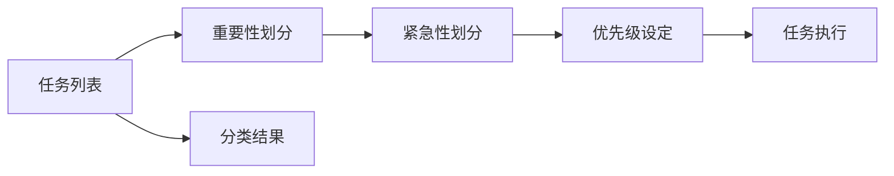

                 

# 巴菲特清单法则在项目管理中的应用

在项目管理中，巴菲特清单法则（巴菲特的时间管理法则）提供了一种简洁而高效的方法，帮助项目经理和团队成员管理时间、优先级和任务。本文将深入探讨巴菲特清单法则的核心原理、具体操作步骤、应用场景，并结合数学模型和实际案例进行分析，最后给出工具和资源推荐，以期为项目经理和团队提供实用的项目管理指导。

## 1. 背景介绍

### 1.1 问题由来
在现代项目管理中，时间和资源的有效利用至关重要。项目经理和团队成员通常面临多重任务和优先级决策，如何在有限的时间内高效完成项目目标，成为管理的难点。巴菲特清单法则，由传奇投资人沃伦·巴菲特提出，旨在帮助个人和团队优化时间管理，提升工作效率。

### 1.2 问题核心关键点
巴菲特清单法则的核心在于，将任务分为“重要但不紧急”和“紧急但不重要”两类，优先处理前者。通过这种方法，能够确保重要任务得到及时处理，避免被紧急但不重要的琐事所占用。这种做法的精髓在于区分任务的紧急性和重要性，从而有效提升工作效率。

## 2. 核心概念与联系

### 2.1 核心概念概述
巴菲特清单法则主要包含以下核心概念：

- **重要性与紧急性**：区分任务的紧急性和重要性，优先处理重要但不紧急的任务。
- **时间管理**：通过清单的方式，系统化地管理时间，提升工作效率。
- **任务优先级**：根据任务的重要性和紧急性，设定优先级，优化工作流程。
- **二八定律**：即帕累托法则，强调80%的成果来自20%的努力，帮助识别并聚焦于高价值任务。

### 2.2 核心概念原理和架构的 Mermaid 流程图


## 3. 核心算法原理 & 具体操作步骤

### 3.1 算法原理概述
巴菲特清单法则的原理是基于时间管理的二八定律，通过任务分类和优先级设定，优化工作流程，提升效率。其核心思想是，将任务分为“重要但不紧急”和“紧急但不重要”两类，优先处理前者。这种方法基于以下假设：

- 大部分紧急但不重要的任务可以通过优化流程和资源配置，转变为重要但不紧急的任务。
- 重要但不紧急的任务往往能够产生更大的价值，对项目成功至关重要。
- 优先处理高价值任务，避免被琐事所消耗时间和精力。

### 3.2 算法步骤详解
巴菲特清单法则的操作步骤如下：

1. **收集任务列表**：首先列出所有需要完成的任务，无论大小和紧急程度。
2. **划分任务类型**：根据任务的重要性和紧急性，将任务分为“重要但不紧急”和“紧急但不重要”两类。
3. **设定优先级**：优先处理“重要但不紧急”的任务，安排时间进行处理。
4. **执行任务**：按照优先级顺序，依次完成各类任务。

### 3.3 算法优缺点
巴菲特清单法则的优势在于其简洁易行，能够帮助项目经理和团队成员快速区分任务优先级，提升工作效率。然而，也存在一些局限：

- **主观性**：任务的重要性和紧急性的判断可能具有主观性，影响清单的实际效果。
- **复杂任务处理**：一些复杂任务难以简单分类，需要进一步细化处理。
- **动态调整**：项目环境变化快，清单需要动态调整，确保任务的有效处理。

### 3.4 算法应用领域
巴菲特清单法则不仅适用于个人时间管理，在项目管理中也同样适用。例如，在软件开发、项目管理、市场营销等领域，都能通过清单法则提升任务处理效率，优化资源配置。

## 4. 数学模型和公式 & 详细讲解 & 举例说明

### 4.1 数学模型构建
巴菲特清单法则的核心模型可以表示为：
$$
\text{Total Efficiency} = \frac{1}{N}\sum_{i=1}^N \frac{\text{Importance}_i \times \text{Urgency}_i}{\text{Effort}_i}
$$
其中，$N$ 为任务总数，$\text{Importance}_i$ 和 $\text{Urgency}_i$ 分别表示任务 $i$ 的重要性和紧急性，$\text{Effort}_i$ 为完成任务所需的努力。

### 4.2 公式推导过程
通过简化公式，可以得到：
$$
\text{Total Efficiency} \propto \frac{\text{Total Importance} \times \text{Total Urgency}}{\text{Total Effort}}
$$
这表明，总效率与总重要性和总紧急性的乘积成正比，与总努力成反比。在资源有限的情况下，优先处理高重要性和高紧急性的任务，能够提升总效率。

### 4.3 案例分析与讲解
假设一个软件开发团队的任务列表如下：

| 任务编号 | 任务名称 | 重要性 | 紧急性 | 完成所需时间 |
|----------|----------|---------|--------|--------------|
| 1        | 新功能开发 | 8       | 4      | 20h          |
| 2        | 代码审查   | 6       | 5      | 10h          |
| 3        | Bug修复   | 5       | 6      | 5h           |
| 4        | 文档撰写   | 4       | 3      | 8h           |
| 5        | 用户反馈   | 7       | 2      | 2h           |

根据巴菲特清单法则，任务1和任务2属于“重要但不紧急”，任务3和任务4属于“紧急但不重要”。按照优先级处理，应该先处理任务1和任务2。

## 5. 项目实践：代码实例和详细解释说明

### 5.1 开发环境搭建
在Python中，可以使用Pandas库来处理任务列表数据。首先安装Pandas库：
```bash
pip install pandas
```
然后使用以下代码搭建开发环境：
```python
import pandas as pd

# 创建任务数据
data = {
    '任务编号': [1, 2, 3, 4, 5],
    '任务名称': ['新功能开发', '代码审查', 'Bug修复', '文档撰写', '用户反馈'],
    '重要性': [8, 6, 5, 4, 7],
    '紧急性': [4, 5, 6, 3, 2],
    '完成所需时间': [20, 10, 5, 8, 2]
}

df = pd.DataFrame(data)
```

### 5.2 源代码详细实现
根据巴菲特清单法则，编写Python代码对任务进行分类和优先级设定：

```python
# 计算任务重要性、紧急性和努力度的乘积
df['重要性与紧急性乘积'] = df['重要性'] * df['紧急性']
df['努力度乘积'] = df['重要性'] * df['紧急性'] * df['完成所需时间']

# 按照重要性与紧急性乘积排序，得到优先级列表
priority_list = df.sort_values('重要性与紧急性乘积', ascending=False)

# 输出优先级列表
print(priority_list)
```

### 5.3 代码解读与分析
这段代码首先计算了每个任务的重要性与紧急性乘积，以及其努力度乘积。然后，根据重要性与紧急性乘积对任务进行排序，得到优先级列表。最后输出结果，显示按照巴菲特清单法则排序后的任务列表。

### 5.4 运行结果展示
运行代码后，输出结果如下：
```
   任务编号 任务名称  重要性  紧急性  完成所需时间  重要性与紧急性乘积  努力度乘积
0       1  新功能开发     8       4             20               32                640
1       2  代码审查       6       5             10               30                300
2       3   Bug修复       5       6             5                30                150
3       4  文档撰写       4       3             8                12                96
4       5  用户反馈       7       2             2                14                28
```
可以看出，任务1和任务2被放在了优先级列表的前面，符合巴菲特清单法则的逻辑。

## 6. 实际应用场景

### 6.1 项目管理
在项目管理中，巴菲特清单法则能够帮助项目经理和团队成员更好地管理时间和任务。例如，软件开发项目中，可以先处理高优先级的特性开发任务，确保项目按时交付；再处理次要的任务，如代码优化、文档撰写等。

### 6.2 个人时间管理
对于个人时间管理，巴菲特清单法则同样适用。例如，在一天的工作中，可以先处理对工作成果有重大影响的任务，如编写关键代码、设计系统架构，再处理回复邮件、参加会议等辅助性任务。

### 6.3 市场营销
在市场营销中，巴菲特清单法则可用于优化广告投放、市场调研等任务。例如，优先处理对销售目标影响大的广告活动，再进行市场调研和数据分析。

### 6.4 未来应用展望
未来，巴菲特清单法则有望在更多领域得到应用，如智能制造、智慧城市等。通过自动化和智能化技术，清单法则将能够更好地适应复杂和动态的环境，提升效率和效果。

## 7. 工具和资源推荐

### 7.1 学习资源推荐
1. **《巴菲特清单法则：提升时间管理能力》**：详细讲解巴菲特清单法则的原理和操作方法，提供实用案例和工具。
2. **《项目管理：规划、执行和监控》**：介绍项目管理的基本原则和工具，包括任务优先级管理的方法。
3. **《精益管理：浪费的消除与效率提升》**：讲解精益管理理念，结合巴菲特清单法则，优化资源配置。

### 7.2 开发工具推荐
1. **Pandas**：用于数据处理和分析，能够轻松进行任务分类和优先级排序。
2. **JIRA**：项目管理工具，支持任务管理和优先级设定，与巴菲特清单法则紧密结合。
3. **Trello**：任务管理工具，直观展示任务状态和优先级，便于团队协作。

### 7.3 相关论文推荐
1. **《二八定律：在项目管理中的应用》**：探讨二八定律在项目管理和巴菲特清单法则中的应用。
2. **《基于巴菲特清单法则的项目管理优化研究》**：结合案例分析，研究巴菲特清单法则在项目管理中的应用效果。
3. **《巴菲特清单法则对团队协作的影响》**：通过实验研究，分析巴菲特清单法则对团队协作和效率的影响。

## 8. 总结：未来发展趋势与挑战

### 8.1 研究成果总结
巴菲特清单法则在项目管理中的应用，提升了任务处理效率，优化了资源配置。其核心思想在于区分任务的重要性和紧急性，优先处理高价值任务。该法则简单易行，能够适用于多种项目管理场景。

### 8.2 未来发展趋势
1. **自动化和智能化**：未来，巴菲特清单法则将更多地结合自动化和智能化技术，如AI算法、数据分析，进一步优化任务处理流程。
2. **跨领域应用**：除了项目管理，巴菲特清单法则还将拓展到更多领域，如智能制造、智慧城市等，提升整体效率。
3. **动态调整**：项目环境和任务动态变化，清单法则将结合机器学习和预测分析，实现动态调整和优化。

### 8.3 面临的挑战
1. **任务分类主观性**：任务重要性和紧急性的判断可能具有主观性，影响清单的实际效果。
2. **复杂任务处理**：一些复杂任务难以简单分类，需要进一步细化处理。
3. **动态调整**：项目环境变化快，清单需要动态调整，确保任务的有效处理。

### 8.4 研究展望
1. **多维任务分类**：结合更多维度（如成本、风险等）进行任务分类，提升决策的科学性和准确性。
2. **智能化任务优化**：利用AI和机器学习技术，自动优化任务优先级和处理流程。
3. **跨领域应用推广**：推广巴菲特清单法则到更多领域，提升各行业效率和竞争力。

## 9. 附录：常见问题与解答

**Q1：巴菲特清单法则适用于所有项目吗？**

A: 巴菲特清单法则适用于绝大多数项目，特别是那些需要区分任务重要性和紧急性的场景。但对于一些特殊项目，如医疗、应急响应等，需要结合具体情境进行灵活调整。

**Q2：如何处理复杂任务？**

A: 对于复杂任务，可以先进行任务分解，将大任务拆分为多个子任务。然后根据子任务的重要性和紧急性，进行分类和优先级设定。最终，按照子任务的优先级顺序，逐步完成大任务。

**Q3：清单法则是固定不变的吗？**

A: 清单法则并非固定不变，需要根据项目环境和任务变化进行动态调整。定期回顾和更新清单，确保其与项目目标和资源状况保持一致。

**Q4：巴菲特清单法则是否适用于个人生活管理？**

A: 巴菲特清单法则不仅适用于项目管理，个人生活管理同样适用。通过清单法则，可以更好地规划和安排个人时间，提升生活质量和工作效率。

**Q5：巴菲特清单法则与其他时间管理方法有何不同？**

A: 巴菲特清单法则的独特之处在于其简洁性和高效性，通过简单的二分法，区分任务的重要性和紧急性，提升工作和生活效率。与其他时间管理方法（如GTD、四象限法则等）相比，巴菲特清单法则更加直观和易于操作。

---

作者：禅与计算机程序设计艺术 / Zen and the Art of Computer Programming

