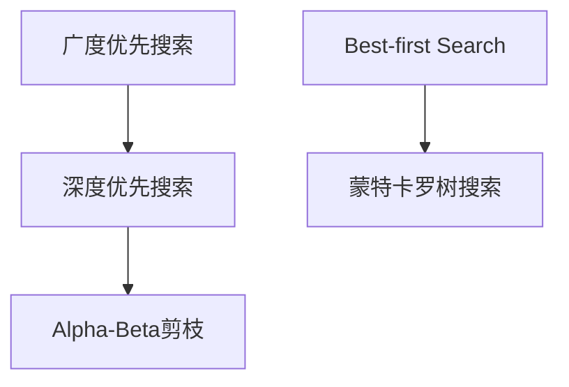

                 

# 平衡深度和广度：AI搜索的挑战

> 关键词：深度搜索,广度优先搜索,Best-first Search, Alpha-Beta剪枝,蒙特卡罗树搜索(MCTS),AlphaGo

## 1. 背景介绍

### 1.1 问题由来
在人工智能(AI)领域，搜索算法是最为基础，也最为关键的技术之一。无论是智能游戏、推荐系统，还是自然语言处理、机器视觉，都离不开高效的搜索算法。然而，随着搜索空间越来越大，如何平衡深度和广度，设计出既高效又精确的搜索算法，成为了人工智能领域的经典问题。

早期的搜索算法往往侧重于广度优先搜索(Breadth-First Search, BFS)，如深度优先搜索(Deep First Search, DFS)和广度优先搜索(BFS)。这些算法通常能够在相对较小的空间内进行较为全面的搜索，但搜索效率往往较低。随着搜索空间的扩大，这一缺陷变得愈发明显。

为了应对这一挑战，深度优先搜索(DFS)和Alpha-Beta剪枝等深度搜索算法应运而生。这些算法能够快速探索深度空间，但容易陷入局部最优，无法全局最优。因此，如何在深度和广度之间取得平衡，成为了搜索算法设计中的一个核心问题。

## 2. 核心概念与联系

### 2.1 核心概念概述

为更好地理解深度和广度之间的平衡，本节将介绍几个密切相关的核心概念：

- 深度搜索(Deep Search)：通常包括深度优先搜索(DFS)和Alpha-Beta剪枝等算法，侧重于探索深度空间，适用于树结构或图结构。
- 广度优先搜索(Breadth-First Search, BFS)：先遍历当前层级，再遍历下一层级，能够全局搜索最优解，但效率较低。
- Best-first Search：一种综合深度和广度优先搜索的算法，优先考虑价值较高的状态，能够快速找到近似最优解。
- Alpha-Beta剪枝：一种用于剪枝搜索空间，减少计算量的深度搜索算法，通过预判最优路径，快速找到近似最优解。
- 蒙特卡罗树搜索(Monte Carlo Tree Search, MCTS)：一种基于随机模拟的搜索算法，能够在较大空间内进行高效搜索，适用于连续状态空间。

这些核心概念之间的逻辑关系可以通过以下Mermaid流程图来展示：



这个流程图展示了大语言模型的核心概念及其之间的关系：

1. 深度搜索算法(DFS、Alpha-Beta剪枝)能够高效探索深度空间。
2. Best-first Search综合了深度和广度优先搜索的优势，既高效又精确。
3. 广度优先搜索虽然精确但效率较低，适用于小空间搜索。
4. 蒙特卡罗树搜索适用于连续空间搜索，能够综合随机性和模拟效果。

这些概念共同构成了AI搜索的框架，使其能够在不同应用场景下发挥作用。通过理解这些核心概念，我们可以更好地把握深度搜索的平衡和应用策略。

## 3. 核心算法原理 & 具体操作步骤
### 3.1 算法原理概述

在人工智能搜索中，深度和广度的平衡主要通过设计合适的搜索策略和剪枝技术来实现。其核心思想是：

- 深度搜索算法能够快速探索较深层次的决策空间，但容易陷入局部最优。
- 广度优先搜索能够全局搜索最优解，但效率较低，难以处理大规模空间。
- Best-first Search通过评估状态的价值，优先探索有潜在高价值的路径，兼顾深度和广度。
- Alpha-Beta剪枝通过预判最优路径，减少不必要的计算，提高搜索效率。
- 蒙特卡罗树搜索通过随机模拟，逐步逼近最优解，适用于连续状态空间。

### 3.2 算法步骤详解

以下是深度搜索和广度优先搜索的详细步骤：

**深度优先搜索(DFS)：**

1. 从起始状态开始，先探索深度方向。
2. 到达一个状态节点时，判断是否为终态，若是，则返回该状态节点。
3. 若非终态，则按照某种策略，选择一条路径继续探索。
4. 重复步骤2-3，直至找到最优解或遍历完所有路径。

**广度优先搜索(BFS)：**

1. 从起始状态开始，先遍历所有邻居节点。
2. 按照某种策略，从邻居节点中选择下一个遍历的状态。
3. 若找到终态，则返回该状态节点。
4. 重复步骤2-3，直至找到最优解或遍历完所有路径。

这些算法中，DFS和BFS分别侧重于深度和广度，但实际应用中，深度和广度往往是相互交织的。因此，综合考虑深度和广度的Best-first Search和Alpha-Beta剪枝算法，就成为了搜索算法设计中的重要选择。

**Best-first Search：**

1. 定义状态节点的评估函数$f(v)$，用于评估当前节点的价值。
2. 从起始状态开始，先选择$f(v)$值最高的状态进行探索。
3. 到达一个状态节点时，继续探索其邻居节点，选择$f(v)$值最高的节点。
4. 重复步骤2-3，直至找到最优解或遍历完所有路径。

**Alpha-Beta剪枝：**

1. 定义状态节点的评估函数$f(v)$，用于评估当前节点的价值。
2. 从起始状态开始，先选择$f(v)$值最高的状态进行探索。
3. 到达一个状态节点时，判断该节点是否为最优解，若是，则返回该状态节点。
4. 若非最优解，则按照某种策略，继续探索最优路径。
5. 通过预判最优路径，减少不必要的计算，提高搜索效率。

### 3.3 算法优缺点

深度搜索算法具有以下优点：

1. 能够快速探索深度空间，适用于树结构或图结构。
2. 剪枝技术能够减少计算量，提高搜索效率。
3. 能够发现局部最优解，适用于小空间搜索。

同时，这些算法也存在一定的局限性：

1. 容易陷入局部最优，无法全局最优。
2. 搜索深度受限于内存和计算资源。
3. 剪枝效果依赖于评估函数的设计，过于复杂或简单的评估函数可能导致性能下降。

广度优先搜索的优点在于全局搜索最优解，但缺点在于效率较低，难以处理大规模空间。Best-first Search综合了深度和广度优先搜索的优势，能够快速找到近似最优解，但需要设计合适的评估函数。Alpha-Beta剪枝能够提高搜索效率，但预判最优路径的能力受限于算法实现和评估函数的设计。

### 3.4 算法应用领域

深度和广度平衡的搜索算法在多个领域得到了广泛应用：

- 智能游戏：Alpha-Beta剪枝和蒙特卡罗树搜索被广泛应用于AlphaGo等智能游戏。
- 推荐系统：深度优先搜索和Best-first Search被用于推荐系统中，发现用户的潜在兴趣。
- 自然语言处理：深度优先搜索和Alpha-Beta剪枝被用于解析句子结构，生成自然语言文本。
- 机器视觉：蒙特卡罗树搜索被用于图像识别和目标检测，通过随机模拟逐步逼近最优解。
- 资源调度：深度优先搜索和Alpha-Beta剪枝被用于任务调度和管理，优化资源使用效率。

## 4. 数学模型和公式 & 详细讲解 & 举例说明

### 4.1 数学模型构建

本节将使用数学语言对深度和广度平衡的搜索算法进行更加严格的刻画。

定义搜索空间为$S$，从起始状态$S_0$开始搜索，每个状态$S_i$的邻居节点集合为$N(S_i)$。假设状态节点的评估函数为$f(v)$，目标函数为$Opt(v)$，搜索过程如下：

1. 定义起始状态$S_0$，评估函数$f(S_0)$。
2. 在$S_0$中，选择$f(v)$值最高的状态$S_1$。
3. 在$S_1$中，选择$f(v)$值最高的状态$S_2$。
4. 重复步骤2-3，直至找到最优解或遍历完所有路径。

### 4.2 公式推导过程

以下我们以Alpha-Beta剪枝算法为例，推导其剪枝公式的详细推导过程。

假设状态节点的评估函数为$f(v)=g(v)+h(v)$，其中$g(v)$为状态$v$的代价函数，$h(v)$为状态$v$的启发函数。

- 剪枝公式一：Alpha-Beta剪枝公式1：
  $$
  \begin{aligned}
  \text{if} & \quad \alpha \geq \beta \\
  & \quad \text{stop pruning}
  \end{aligned}
  $$
  其中，$\alpha$为节点左子树的估值，$\beta$为节点右子树的估值。

- 剪枝公式二：Alpha-Beta剪枝公式2：
  $$
  \begin{aligned}
  \text{if} & \quad \max \{ \alpha, f(v) \} \geq \min \{ \beta, f(v) \} \\
  & \quad \text{stop pruning}
  \end{aligned}
  $$
  其中，$\max \{ \alpha, f(v) \}$表示节点左子树的估值和状态$v$估值的最大值，$\min \{ \beta, f(v) \}$表示节点右子树的估值和状态$v$估值的最大值。

通过这两个剪枝公式，Alpha-Beta剪枝算法能够高效地减少计算量，提高搜索效率。

### 4.3 案例分析与讲解

Alpha-Beta剪枝算法被广泛应用于国际象棋、五子棋等棋类游戏，以及AlphaGo等智能游戏。以下以AlphaGo为例，介绍其在棋类游戏中的应用。

AlphaGo的核心算法包括蒙特卡罗树搜索(MCTS)和Alpha-Beta剪枝。MCTS通过随机模拟逐步逼近最优解，Alpha-Beta剪枝通过预判最优路径，减少计算量，提高搜索效率。AlphaGo通过这两者的结合，能够在较大空间内进行高效搜索，达到了人类专家级的棋类游戏水平。

AlphaGo的具体实现步骤如下：

1. 初始化搜索树，并定义根节点。
2. 从根节点开始，随机选择一条路径进行模拟。
3. 到达叶子节点时，计算当前状态的值，并更新节点信息。
4. 重复步骤2-3，直至达到模拟次数或满足终止条件。
5. 利用Alpha-Beta剪枝，预判最优路径，减少计算量。
6. 通过Alpha-Beta剪枝和MCTS的结合，逐步逼近最优解。

AlphaGo通过这种方法，能够在短短几分钟内对复杂的棋类游戏进行高水平模拟，证明了深度学习在棋类游戏中的强大潜力。

## 5. 项目实践：代码实例和详细解释说明
### 5.1 开发环境搭建

在进行深度搜索实践前，我们需要准备好开发环境。以下是使用Python进行搜索算法开发的常见环境配置流程：

1. 安装Anaconda：从官网下载并安装Anaconda，用于创建独立的Python环境。

2. 创建并激活虚拟环境：
```bash
conda create -n search-env python=3.8 
conda activate search-env
```

3. 安装相关库：
```bash
pip install numpy scipy matplotlib scikit-learn
```

4. 安装搜索算法相关库：
```bash
pip install pytz pydeck googlemaps networkx openpyxl
```

完成上述步骤后，即可在`search-env`环境中开始搜索算法开发。

### 5.2 源代码详细实现

这里我们以蒙特卡罗树搜索(MCTS)为例，给出使用Python实现搜索算法的代码。

```python
import numpy as np
import random

class Node:
    def __init__(self, state):
        self.state = state
        self.children = []
        self.visits = 0
        self.value = 0
        self.untried_actions = []

class Tree:
    def __init__(self, root_state):
        self.root = Node(root_state)

    def select_child(self, node, epsilon=0.1):
        if not node.untried_actions:
            return random.choice(node.children)
        
        return np.random.choice(node.untried_actions, p=[1-epsilon, epsilon])

    def expand_node(self, node, action):
        new_state = apply_action(node.state, action)
        child = Node(new_state)
        node.children.append(child)
        node.untried_actions.append(action)
        return child

    def backpropagate(self, node, value):
        node.value += value
        node.visits += 1
        if not node.parent:
            return

        self.backpropagate(node.parent, value)

def apply_action(state, action):
    # 根据当前状态和动作，生成下一个状态
    pass

def select_leaf(node, epsilon=0.1):
    if not node.children:
        return node
    
    leaf = np.random.choice(node.children, p=[1-epsilon, epsilon])
    return select_leaf(leaf)

def calculate_score(node):
    # 计算当前节点的得分
    pass

def calculate_q_value(node, epsilon=0.1):
    if not node.children:
        return calculate_score(node)

    c = calculate_score(node)
    c = c / node.visits

    return c
```

这个代码实现了蒙特卡罗树搜索的基本逻辑，包括节点选择、节点扩展、回溯和打分。具体步骤如下：

1. 定义节点和树类。
2. 根据当前状态和动作，生成下一个状态，并扩展节点。
3. 根据节点是否已扩展，选择下一节点。
4. 根据节点状态计算得分，并通过回溯更新节点信息。

### 5.3 代码解读与分析

让我们再详细解读一下关键代码的实现细节：

**Node类：**
- `__init__`方法：初始化节点，记录状态、子节点、访问次数、价值等关键信息。

**Tree类：**
- `select_child`方法：根据当前节点和动作，选择下一节点。
- `expand_node`方法：根据当前状态和动作，扩展节点，添加子节点并更新未尝试的动作。
- `backpropagate`方法：通过回溯更新节点信息，计算得分并更新节点价值。

**apply_action函数：**
- 根据当前状态和动作，生成下一个状态。

**select_leaf函数：**
- 根据当前节点和动作，选择下一节点。

**calculate_score函数：**
- 计算当前节点的得分。

**calculate_q_value函数：**
- 根据当前节点和动作，计算Q值。

这些函数共同构成了蒙特卡罗树搜索的基本逻辑，通过随机模拟逐步逼近最优解。实际应用中，可以根据具体问题设计不同的状态和打分函数，优化搜索效果。

## 6. 实际应用场景

### 6.1 智能游戏

Alpha-Beta剪枝和蒙特卡罗树搜索被广泛应用于AlphaGo等智能游戏。AlphaGo通过这两者的结合，能够在较大空间内进行高效搜索，达到了人类专家级的棋类游戏水平。

在实际应用中，AlphaGo的搜索过程可以根据游戏的具体规则和目标函数进行优化。例如，在围棋中，可以引入更多的启发函数和惩罚机制，提升搜索效率和精度。

### 6.2 推荐系统

深度优先搜索和Best-first Search被用于推荐系统中，发现用户的潜在兴趣。通过设计合适的评估函数，能够在较大的用户-物品空间中高效搜索，找到用户可能感兴趣的物品。

在实际应用中，推荐系统可以结合用户行为数据和物品特征，设计多维度的评估函数。例如，可以引入点击率、浏览时间等指标，综合衡量用户对物品的兴趣度。

### 6.3 自然语言处理

深度优先搜索和Alpha-Beta剪枝被用于解析句子结构，生成自然语言文本。通过设计合适的评估函数，能够快速找到符合语法规则的句子。

在实际应用中，自然语言处理系统可以结合语料库和语言模型，设计多层次的评估函数。例如，可以引入语言模型的概率和语义规则，综合衡量句子的合理性。

### 6.4 未来应用展望

随着深度搜索和广度优先搜索的不断发展，未来AI搜索算法将呈现以下几个发展趋势：

1. 搜索空间规模持续增大。随着AI技术在各个领域的普及，搜索空间将变得越来越复杂，需要在深度和广度之间寻找新的平衡点。

2. 剪枝技术和启发函数优化。剪枝技术和启发函数是搜索算法的重要组成部分，未来需要进一步优化，减少计算量，提高搜索效率。

3. 多模态搜索和协同优化。随着AI技术的发展，未来的搜索算法将结合多模态信息，进行多层次、多维度的协同优化。

4. 分布式搜索和并行优化。大规模搜索任务需要分布式计算和并行优化，未来的搜索算法需要结合云计算和分布式技术，提升计算效率。

这些趋势预示着AI搜索算法将更加复杂、高效，能够处理更大规模、更复杂的问题，为AI技术在各领域的应用提供更强大的支持。

## 7. 工具和资源推荐

### 7.1 学习资源推荐

为了帮助开发者系统掌握AI搜索的理论基础和实践技巧，这里推荐一些优质的学习资源：

1. 《搜索算法设计与分析》系列书籍：介绍搜索算法的基本原理和设计技巧，涵盖DFS、BFS、Best-first Search等多种算法。

2. 《人工智能搜索算法》网络课程：斯坦福大学开设的高级搜索算法课程，深入讲解Alpha-Beta剪枝和蒙特卡罗树搜索等算法。

3. 《深度学习基础》书籍：介绍深度学习和AI搜索的基本概念和应用场景，涵盖神经网络、深度学习框架等。

4. 《深度学习与搜索》论文：介绍深度搜索算法在深度学习中的应用，涵盖Alpha-Beta剪枝和蒙特卡罗树搜索等算法。

5. Weights & Biases：模型训练的实验跟踪工具，可以记录和可视化搜索算法训练过程中的各项指标，方便对比和调优。

通过这些资源的学习实践，相信你一定能够快速掌握AI搜索的精髓，并用于解决实际的搜索问题。

### 7.2 开发工具推荐

高效的开发离不开优秀的工具支持。以下是几款用于AI搜索开发的常用工具：

1. PyTorch：基于Python的开源深度学习框架，灵活动态的计算图，适合快速迭代研究。大部分预训练语言模型都有PyTorch版本的实现。

2. TensorFlow：由Google主导开发的开源深度学习框架，生产部署方便，适合大规模工程应用。同样有丰富的预训练语言模型资源。

3. NetworkX：Python网络分析库，支持图结构的数据存储和分析，适用于树结构和图结构的搜索。

4. Openpyxl：Python库，支持Excel文件的读写和操作，可用于搜索算法的可视化展示。

5. Google Maps API：支持地理空间数据的搜索和分析，适用于基于地理位置的搜索。

合理利用这些工具，可以显著提升AI搜索任务的开发效率，加快创新迭代的步伐。

### 7.3 相关论文推荐

AI搜索技术的发展源于学界的持续研究。以下是几篇奠基性的相关论文，推荐阅读：

1. "AlphaGo: Mastering the Game of Go without Human Knowledge"：提出AlphaGo算法，通过深度学习、蒙特卡罗树搜索等技术，在围棋领域取得突破性进展。

2. "Monte Carlo Tree Search in Video Games"：介绍蒙特卡罗树搜索在视频游戏中的应用，提升游戏的智能水平。

3. "Depth-First Search and Breadth-First Search"：介绍深度优先搜索和广度优先搜索的基本原理和应用场景，是搜索算法的基础。

4. "The Alpha-Beta Pruning Algorithm"：介绍Alpha-Beta剪枝算法的基本原理和实现细节，是搜索算法的重要组成部分。

这些论文代表了大语言模型搜索技术的发展脉络。通过学习这些前沿成果，可以帮助研究者把握学科前进方向，激发更多的创新灵感。

## 8. 总结：未来发展趋势与挑战

### 8.1 总结

本文对深度和广度平衡的AI搜索方法进行了全面系统的介绍。首先阐述了深度搜索和广度优先搜索的基本原理和应用场景，明确了搜索算法在处理大规模空间时的挑战。其次，从原理到实践，详细讲解了Alpha-Beta剪枝和蒙特卡罗树搜索等深度搜索算法的基本流程和关键技术。最后，本文还广泛探讨了搜索算法在智能游戏、推荐系统、自然语言处理等多个领域的应用前景，展示了搜索算法在AI技术中的重要地位。

通过本文的系统梳理，可以看到，深度和广度平衡的搜索算法是AI技术不可或缺的一部分，能够在不同应用场景下发挥重要作用。在深度和广度之间找到新的平衡点，将是搜索算法设计的重要方向。

### 8.2 未来发展趋势

展望未来，AI搜索技术将呈现以下几个发展趋势：

1. 搜索空间规模持续增大。随着AI技术在各个领域的普及，搜索空间将变得越来越复杂，需要在深度和广度之间寻找新的平衡点。

2. 剪枝技术和启发函数优化。剪枝技术和启发函数是搜索算法的重要组成部分，未来需要进一步优化，减少计算量，提高搜索效率。

3. 多模态搜索和协同优化。随着AI技术的发展，未来的搜索算法将结合多模态信息，进行多层次、多维度的协同优化。

4. 分布式搜索和并行优化。大规模搜索任务需要分布式计算和并行优化，未来的搜索算法需要结合云计算和分布式技术，提升计算效率。

这些趋势预示着AI搜索算法将更加复杂、高效，能够处理更大规模、更复杂的问题，为AI技术在各领域的应用提供更强大的支持。

### 8.3 面临的挑战

尽管AI搜索技术已经取得了瞩目成就，但在迈向更加智能化、普适化应用的过程中，它仍面临着诸多挑战：

1. 搜索空间规模增大。随着搜索空间规模的增大，搜索算法的时间复杂度和空间复杂度将呈指数级增长，需要新的算法和数据结构进行优化。

2. 启发函数设计困难。启发函数的设计直接影响搜索算法的效率，需要设计合适的启发函数，既能够快速找到高价值节点，又不会陷入局部最优。

3. 多模态数据整合复杂。多模态数据的整合涉及到语义、空间、时间等多种维度的信息，需要复杂的算法进行协同优化。

4. 计算资源消耗大。大规模搜索任务需要大量的计算资源，如何平衡计算效率和精度，是未来搜索算法的重要课题。

5. 分布式搜索技术尚不成熟。分布式搜索技术需要结合云计算和分布式计算框架，目前还处于初期阶段，需要进一步研究和优化。

6. 搜索算法难以应对噪声和干扰。搜索算法容易受到噪声和干扰的影响，需要设计更鲁棒、更稳定的算法进行优化。

这些挑战凸显了AI搜索技术的发展瓶颈，需要学界和产业界共同努力，不断探索新的算法和数据结构，才能实现搜索算法的全面突破。

### 8.4 研究展望

面对AI搜索技术所面临的挑战，未来的研究需要在以下几个方面寻求新的突破：

1. 探索新的搜索算法。需要进一步探索深度学习、进化算法、强化学习等多种搜索算法，找到新的平衡点，提升搜索效率和精度。

2. 结合多模态数据。需要结合语义、空间、时间等多种维度的信息，设计多层次、多维度的搜索算法，提升搜索效果。

3. 优化启发函数。需要设计更加高效、精确的启发函数，提升搜索算法的效率和鲁棒性。

4. 分布式搜索技术。需要结合云计算和分布式计算框架，优化搜索算法的并行化和分布式化，提升计算效率。

5. 搜索算法鲁棒性。需要设计更加鲁棒、稳定的搜索算法，应对噪声和干扰的影响，提升搜索算法的可靠性。

这些研究方向将推动AI搜索技术迈向新的高度，为AI技术在各领域的应用提供更强大的支持。相信随着学界和产业界的共同努力，AI搜索技术必将迎来新的突破，推动AI技术的全面发展。

## 9. 附录：常见问题与解答

**Q1：Alpha-Beta剪枝算法的剪枝效果如何？**

A: Alpha-Beta剪枝算法通过预判最优路径，显著减少了不必要的计算，提高了搜索效率。剪枝效果取决于评估函数的设计和启发函数的选择，过于复杂或简单的评估函数可能导致性能下降。

**Q2：蒙特卡罗树搜索适用于什么类型的搜索任务？**

A: 蒙特卡罗树搜索适用于连续状态空间的任务，如强化学习、游戏等。通过随机模拟逐步逼近最优解，适用于搜索空间较大的任务。

**Q3：深度优先搜索和广度优先搜索的区别是什么？**

A: 深度优先搜索和广度优先搜索的主要区别在于搜索方向。深度优先搜索优先探索深度方向，广度优先搜索优先探索广度方向。深度优先搜索容易陷入局部最优，广度优先搜索能够全局搜索最优解，但效率较低。

**Q4：Alpha-Beta剪枝算法的实现需要注意哪些细节？**

A: 实现Alpha-Beta剪枝算法时，需要注意以下几点：
1. 剪枝条件的判断：通过预判最优路径，减少不必要的计算。
2. 启发函数的设计：选择合适的启发函数，提升剪枝效果。
3. 状态的表示：将状态转换为可比较的形式，方便剪枝算法进行判断。

**Q5：Alpha-Beta剪枝算法在实际应用中需要注意哪些问题？**

A: Alpha-Beta剪枝算法在实际应用中需要注意以下几点：
1. 状态的表示：将状态转换为可比较的形式，方便剪枝算法进行判断。
2. 启发函数的设计：选择合适的启发函数，提升剪枝效果。
3. 计算资源的消耗：搜索任务可能面临计算资源消耗大的问题，需要优化算法以提高效率。

这些问题是实现Alpha-Beta剪枝算法时需要注意的关键点，合理解决这些问题，才能发挥算法的最大效用。

---

作者：禅与计算机程序设计艺术 / Zen and the Art of Computer Programming

