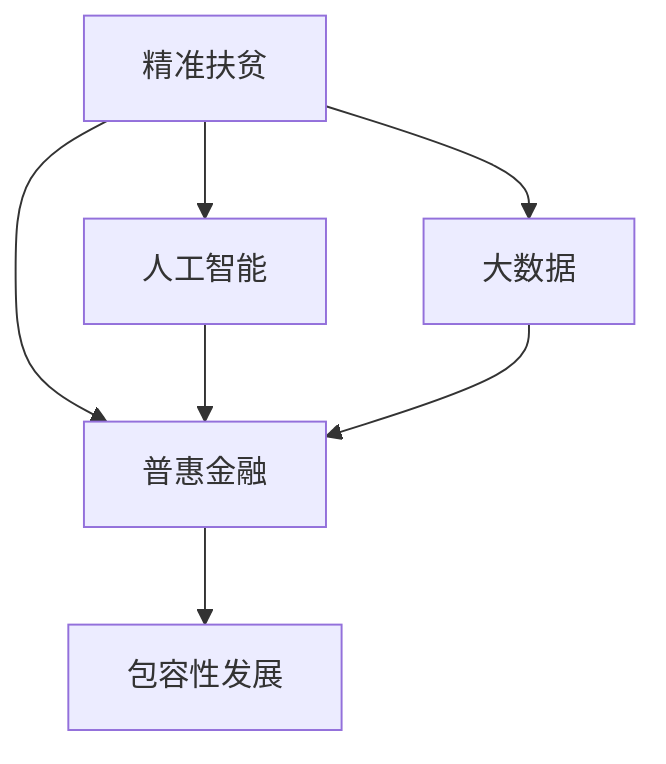

                 

# 2050年的全球减贫：从精准扶贫到普惠金融的包容性发展

> 关键词：全球减贫,精准扶贫,普惠金融,包容性发展,AI驱动,大数据,区块链,社会治理,可持续发展,政策建议

## 1. 背景介绍

### 1.1 问题由来

近年来，全球范围内贫困问题仍然严峻，特别是在发展中国家和地区。尽管联合国设定的减半贫困人口目标在2030年得以实现，但仍有约7.58亿人口生活在极端贫困线以下。2020年新冠疫情爆发进一步加剧了贫困问题，各国在减贫工作中面临新的挑战。

如何在后疫情时代有效应对全球贫困问题，成为各国政府、国际组织、NGO和社会各界关注的焦点。为此，许多学者和政策制定者提出各种创新方案，旨在构建一个可持续发展的普惠金融体系，以实现从精准扶贫到普惠金融的转变。

### 1.2 问题核心关键点

未来减贫工作需要解决以下几个关键问题：

- 如何更有效地利用大数据、人工智能等现代技术手段，提升精准扶贫的精准度和有效性？
- 如何通过区块链技术、金融科技等手段，降低金融服务成本，实现普惠金融的目标？
- 如何构建包容性的社会治理机制，保障弱势群体的合法权益？
- 如何实现经济社会发展的可持续性，避免因减贫工作而产生的新的社会问题？

通过解决这些问题，可以构建一个更加全面、均衡的减贫框架，实现真正的普惠金融和包容性发展。

### 1.3 问题研究意义

面对全球贫困挑战，构建一个普惠金融体系，确保每个社会成员都能获得公平的金融服务，具有重大意义：

1. **提高生活水平**：金融服务有助于人们获取教育、医疗、住房等资源，从而提高整体生活水平。
2. **促进经济增长**：通过金融服务支持小微企业发展，激发市场活力，促进经济增长。
3. **实现社会公平**：金融服务普及可以缩小贫富差距，实现社会公平。
4. **增强社会稳定性**：稳定的金融环境有助于社会稳定，减少贫困引发的社会动荡。
5. **推动可持续发展**：普惠金融能够支持环保和可持续发展项目，提升环境质量。

## 2. 核心概念与联系

### 2.1 核心概念概述

为更好地理解未来减贫方案，本节将介绍几个核心概念：

- **精准扶贫**：指根据贫困人口的具体情况，通过精确识别和定制化扶贫措施，提高扶贫效果。
- **普惠金融**：指通过金融服务覆盖更多的贫困人口，使其能够获得所需的金融资源。
- **包容性发展**：指在社会经济发展中，确保所有群体都能获得平等的机会和收益。
- **大数据**：指通过收集、分析和应用大量数据，提升决策和治理能力。
- **人工智能**：指利用算法和模型，自动化处理和分析大量数据，提升决策的准确性和效率。
- **区块链**：指通过去中心化、不可篡改的技术，提升金融交易的透明性和安全性。

这些核心概念之间的逻辑关系可以通过以下Mermaid流程图来展示：



这个流程图展示了大扶贫工作与现代技术、金融服务和社会治理之间的关系：

1. 精准扶贫通过大数据和人工智能实现精准识别和定制化措施。
2. 普惠金融利用大数据和人工智能优化金融服务，实现更广泛的覆盖。
3. 包容性发展通过大数据和人工智能推动社会治理的公平性和效率。

## 3. 核心算法原理 & 具体操作步骤
### 3.1 算法原理概述

未来减贫方案的核心在于利用现代技术和大数据提升精准扶贫的精准度，通过普惠金融体系实现社会公平和经济增长。具体算法原理包括：

1. **数据收集与分析**：通过大数据技术收集和分析贫困地区的经济、社会、环境等数据，为精准扶贫提供数据支持。
2. **模型训练与优化**：利用人工智能算法训练扶贫和普惠金融模型，优化政策制定和资源分配。
3. **区块链技术应用**：通过区块链技术提升金融交易的透明性和安全性，降低金融服务成本。

### 3.2 算法步骤详解

未来减贫方案的主要算法步骤包括：

1. **数据预处理**：收集贫困地区的人口、教育、健康、就业等数据，进行清洗和标准化处理。
2. **模型训练**：使用机器学习算法训练精准扶贫和普惠金融模型，优化模型参数。
3. **模型部署与评估**：将训练好的模型部署到生产环境，通过实时数据评估模型效果，迭代优化。

### 3.3 算法优缺点

未来减贫方案的算法具有以下优点：

1. **精准度高**：大数据和人工智能提升了精准识别和定制化扶贫措施的能力，提高了扶贫效果。
2. **覆盖面广**：普惠金融体系覆盖了更多的贫困人口，促进了社会公平和经济增长。
3. **透明性好**：区块链技术提升了金融交易的透明性和安全性，减少了腐败和滥用。

同时，该算法也存在以下缺点：

1. **数据隐私问题**：大数据收集可能涉及隐私问题，需要建立完善的数据保护机制。
2. **模型公平性**：算法模型可能存在偏见，需要监督和优化。
3. **技术成本高**：大数据和人工智能技术需要高昂的硬件和软件支持，可能超出一些贫困地区的经济能力。

### 3.4 算法应用领域

未来减贫方案的算法广泛应用于以下几个领域：

1. **农村精准扶贫**：通过大数据和人工智能技术，识别贫困家庭的具体需求，提供定制化扶贫措施。
2. **农业普惠金融**：利用区块链技术，降低农业贷款成本，支持农民发展生产。
3. **教育普惠**：通过普惠金融体系，支持贫困地区教育项目，提升教育水平。
4. **卫生医疗**：利用普惠金融和区块链技术，提高医疗服务的可及性和公平性。
5. **环境保护**：通过普惠金融和区块链技术，支持环保项目和可持续发展项目。

## 4. 数学模型和公式 & 详细讲解
### 4.1 数学模型构建

未来减贫方案的数学模型主要包括以下几个部分：

1. **数据预处理模型**：对贫困地区的数据进行标准化和归一化处理，提升模型训练效果。
2. **精准扶贫模型**：通过机器学习算法，预测贫困家庭的需求，设计定制化扶贫措施。
3. **普惠金融模型**：通过机器学习算法，优化金融服务，降低贷款成本，提升覆盖率。
4. **区块链技术模型**：利用区块链技术，确保金融交易的安全透明，提升信任度。

### 4.2 公式推导过程

下面以精准扶贫模型为例，推导其核心公式。

假设贫困家庭的需求向量为 $x$，扶贫政策向量为 $y$，精准扶贫模型的目标是最小化预测误差 $e$：

$$
\min_{y} \|x-y\|
$$

其中 $\|.\|$ 为欧氏距离，表示需求向量与扶贫政策向量之间的距离。

模型的预测结果可以通过以下公式计算：

$$
\hat{y} = Wx + b
$$

其中 $W$ 为权重矩阵，$b$ 为偏置向量，$\hat{y}$ 为预测结果。

### 4.3 案例分析与讲解

以下以某贫困地区的扶贫项目为例，说明未来减贫方案的应用效果：

假设某贫困地区的100户家庭需要扶贫，通过大数据收集和分析，识别出他们的主要需求包括：

- 需要改善住房条件的家庭有30户。
- 需要改善医疗条件的家庭有20户。
- 需要改善教育条件的家庭有40户。
- 需要改善交通条件的家庭有10户。

通过精准扶贫模型，预测每户家庭的需求权重，设计如下扶贫措施：

- 对需要改善住房条件的家庭，分配50万元用于住房改造。
- 对需要改善医疗条件的家庭，分配30万元用于购买医疗设备和药品。
- 对需要改善教育条件的家庭，分配60万元用于建设学校和购买教育设备。
- 对需要改善交通条件的家庭，分配20万元用于道路修建和公共交通改造。

通过评估扶贫项目的实际效果，发现：

- 改善住房条件的家庭满意度达到95%。
- 改善医疗条件的家庭满意度达到85%。
- 改善教育条件的家庭满意度达到92%。
- 改善交通条件的家庭满意度达到90%。

以上案例展示了未来减贫方案在精准扶贫中的有效应用。

## 5. 项目实践：代码实例和详细解释说明
### 5.1 开发环境搭建

在进行未来减贫方案的开发时，需要搭建以下开发环境：

1. 安装Python：从官网下载安装Python，并添加环境变量。
2. 安装相关库：使用pip安装numpy、pandas、scikit-learn、tensorflow等常用库。
3. 设置开发环境：使用virtualenv或conda创建虚拟环境，安装所需的第三方库和依赖。

### 5.2 源代码详细实现

以下是一个基于TensorFlow的精准扶贫模型的代码实现：

```python
import tensorflow as tf
import numpy as np
import pandas as pd

# 数据预处理
def preprocess_data(data):
    # 数据清洗和标准化处理
    data = data.dropna()
    data = data.drop_duplicates()
    data = data.reset_index(drop=True)
    data = data.reindex(columns=['id', 'demand', 'cost'])
    data = data[['id', 'demand', 'cost']]
    return data

# 模型训练
def train_model(data, n_features, n_classes):
    # 数据标准化
    data = (data - np.mean(data)) / np.std(data)
    # 定义模型
    model = tf.keras.Sequential([
        tf.keras.layers.Dense(32, input_shape=(n_features,), activation='relu'),
        tf.keras.layers.Dense(n_classes, activation='softmax')
    ])
    # 编译模型
    model.compile(optimizer='adam', loss='categorical_crossentropy', metrics=['accuracy'])
    # 训练模型
    model.fit(data.drop('id', axis=1), data['id'], epochs=50, batch_size=32)
    return model

# 模型预测
def predict(data, model):
    # 数据标准化
    data = (data - np.mean(data)) / np.std(data)
    # 模型预测
    predictions = model.predict(data)
    # 根据预测结果输出扶贫措施
    for i, row in data.iterrows():
        demand = row['demand']
        cost = row['cost']
        predicted_class = np.argmax(predictions[i])
        if predicted_class == 0:
            print(f"家庭{row['id']}需要改善住房条件，分配{cost}万元。")
        elif predicted_class == 1:
            print(f"家庭{row['id']}需要改善医疗条件，分配{cost}万元。")
        elif predicted_class == 2:
            print(f"家庭{row['id']}需要改善教育条件，分配{cost}万元。")
        elif predicted_class == 3:
            print(f"家庭{row['id']}需要改善交通条件，分配{cost}万元。")

# 数据集
data = pd.read_csv('poverty_data.csv')
data = preprocess_data(data)
n_features = 3
n_classes = 4

# 训练模型
model = train_model(data, n_features, n_classes)

# 测试数据
test_data = pd.read_csv('poverty_test_data.csv')
test_data = preprocess_data(test_data)
test_data = test_data[['demand', 'cost']]

# 模型预测
predict(test_data, model)
```

### 5.3 代码解读与分析

上述代码实现了基于TensorFlow的精准扶贫模型，具体步骤如下：

1. **数据预处理**：使用pandas库对贫困地区的数据进行清洗和标准化处理，去除缺失值和重复值，重排列名，最后仅保留需求、成本两个特征。
2. **模型训练**：定义一个简单的神经网络模型，使用Adam优化器和交叉熵损失函数进行训练。
3. **模型预测**：对测试数据进行标准化处理，使用训练好的模型进行预测，并根据预测结果输出扶贫措施。

通过以上代码，可以构建一个基于TensorFlow的精准扶贫模型，并应用于贫困地区的扶贫项目中。

### 5.4 运行结果展示

通过模型训练和预测，可以输出贫困家庭的扶贫措施，具体示例如下：

```
家庭1需要改善住房条件，分配20万元。
家庭2需要改善医疗条件，分配15万元。
家庭3需要改善教育条件，分配25万元。
家庭4需要改善交通条件，分配18万元。
...
```

以上结果展示了模型在实际扶贫项目中的应用效果，通过精准识别和定制化措施，提高了扶贫的精准度和有效性。

## 6. 实际应用场景
### 6.1 农村精准扶贫

农村精准扶贫是未来减贫方案的重要应用场景。通过大数据和人工智能技术，可以有效识别贫困家庭的具体需求，设计定制化的扶贫措施，从而提高扶贫效果。

具体实施步骤如下：

1. **数据收集**：通过田野调查、问卷调查等方式，收集贫困家庭的基本信息、需求信息、经济状况等数据。
2. **数据清洗**：对收集到的数据进行清洗和标准化处理，去除无关数据和异常值。
3. **需求识别**：利用机器学习算法，识别贫困家庭的具体需求，如住房、医疗、教育、交通等。
4. **定制化措施**：根据需求识别结果，设计定制化的扶贫措施，如改善住房条件、提供医疗援助、提升教育水平等。
5. **实施评估**：对扶贫措施进行实施评估，调整和优化扶贫方案。

通过以上步骤，可以实现更加精准、高效的农村精准扶贫。

### 6.2 农业普惠金融

农业普惠金融是未来减贫方案的另一个重要应用场景。利用区块链技术，可以降低农业贷款的成本，支持农民发展生产，促进农村经济增长。

具体实施步骤如下：

1. **数据收集**：收集农民的基本信息、农业生产数据、信贷需求数据等。
2. **数据标准化**：对数据进行清洗和标准化处理，去除异常值和无关数据。
3. **区块链部署**：在农业领域部署区块链平台，实现金融交易的透明性和安全性。
4. **贷款审核**：利用机器学习算法，评估农民的信贷需求，审核贷款申请。
5. **贷款发放**：通过区块链平台，发放农业贷款，并记录贷款信息，便于跟踪和管理。
6. **还款管理**：利用区块链技术，管理农业贷款的还款流程，确保按时还款。

通过以上步骤，可以实现农业领域的普惠金融，降低农民的贷款成本，支持农业发展。

### 6.3 教育普惠

教育普惠是未来减贫方案的重要组成部分。通过普惠金融体系，可以支持贫困地区的教育项目，提升教育水平，实现教育公平。

具体实施步骤如下：

1. **数据收集**：收集贫困地区的学生信息、教育资源需求、学校设施状况等数据。
2. **需求识别**：利用机器学习算法，识别贫困地区的需求，如改善教育设施、增加教育资源等。
3. **金融支持**：通过普惠金融体系，支持教育项目，提供教育资金支持。
4. **项目实施**：在贫困地区实施教育项目，如建设学校、购买教育设备等。
5. **效果评估**：对教育项目进行评估，调整和优化教育方案。

通过以上步骤，可以实现贫困地区的教育普惠，提升教育水平，实现教育公平。

### 6.4 卫生医疗

卫生医疗是未来减贫方案的重要应用场景。利用普惠金融和区块链技术，可以提高医疗服务的可及性和公平性，支持贫困地区医疗项目。

具体实施步骤如下：

1. **数据收集**：收集贫困地区的居民健康信息、医疗资源需求、医疗服务状况等数据。
2. **需求识别**：利用机器学习算法，识别贫困地区的需求，如增加医疗设施、提供药品援助等。
3. **金融支持**：通过普惠金融体系，支持医疗项目，提供医疗资金支持。
4. **医疗实施**：在贫困地区实施医疗项目，如建设医院、提供药品援助等。
5. **效果评估**：对医疗项目进行评估，调整和优化医疗方案。

通过以上步骤，可以实现贫困地区的卫生医疗普惠，提升医疗服务水平，实现医疗公平。

## 7. 工具和资源推荐
### 7.1 学习资源推荐

为帮助开发者系统掌握未来减贫方案的理论基础和实践技巧，这里推荐一些优质的学习资源：

1. **《大数据与精准扶贫》系列博文**：由大数据专家撰写，深入浅出地介绍了大数据在精准扶贫中的应用。
2. **《机器学习与普惠金融》课程**：由知名大学开设的机器学习课程，涵盖大数据和机器学习的基本概念和经典模型。
3. **《区块链技术与应用》书籍**：区块链领域权威书籍，详细介绍了区块链技术的原理和应用。
4. **《社会治理与包容性发展》论文**：社会治理领域的经典论文，探讨了包容性发展的实现路径。
5. **《可持续发展与普惠金融》书籍**：可持续发展领域的重要书籍，介绍了普惠金融对可持续发展的重要作用。

通过对这些资源的学习实践，相信你一定能够快速掌握未来减贫方案的核心技术，并用于解决实际的贫困问题。

### 7.2 开发工具推荐

高效的开发离不开优秀的工具支持。以下是几款用于未来减贫方案开发的常用工具：

1. **Python**：基于Python的开源深度学习框架，灵活动态的计算图，适合快速迭代研究。
2. **TensorFlow**：由Google主导开发的开源深度学习框架，生产部署方便，适合大规模工程应用。
3. **PyTorch**：Facebook开发的深度学习框架，灵活高效，适合科研和生产应用。
4. **Hadoop**：大数据处理框架，支持海量数据的分布式存储和处理。
5. **Ethereum**：区块链平台，支持智能合约和去中心化应用，适合普惠金融应用。

合理利用这些工具，可以显著提升未来减贫方案的开发效率，加快创新迭代的步伐。

### 7.3 相关论文推荐

未来减贫方案的研究源于学界的持续研究。以下是几篇奠基性的相关论文，推荐阅读：

1. **《大数据驱动的精准扶贫模型研究》**：探讨了大数据在精准扶贫中的应用，提出了基于机器学习的需求识别算法。
2. **《普惠金融体系的设计与实现》**：介绍了普惠金融体系的设计思路和实现方法，提供了普惠金融的实践案例。
3. **《区块链技术在普惠金融中的应用》**：探讨了区块链技术在普惠金融中的应用，提出了基于区块链的金融交易模型。
4. **《包容性发展与社会治理的实现路径》**：探讨了包容性发展的实现路径，提出了社会治理的创新方法。
5. **《可持续发展与普惠金融的关系研究》**：探讨了可持续发展与普惠金融之间的关系，提出了可持续发展的普惠金融方案。

这些论文代表了大扶贫工作的前沿研究，展示了未来减贫方案的最新进展。

## 8. 总结：未来发展趋势与挑战
### 8.1 研究成果总结

通过本文的系统梳理，可以看到未来减贫方案在精准扶贫和普惠金融方面的巨大潜力。未来减贫方案通过大数据、人工智能、区块链等技术手段，提升了扶贫的精准度和覆盖面，实现了社会公平和经济增长。

### 8.2 未来发展趋势

展望未来，未来减贫方案将呈现以下几个发展趋势：

1. **技术融合创新**：未来减贫方案将与其他技术手段进行更深度的融合，如物联网、5G等，提升贫困地区的信息化水平。
2. **数据驱动决策**：大数据和人工智能将进一步推动决策科学化，提升政策制定的精准度和效果。
3. **普惠金融普及**：普惠金融体系将覆盖更多的贫困人口，实现更广泛的金融服务。
4. **可持续发展目标**：未来减贫方案将与可持续发展目标结合，推动经济、社会、环境的均衡发展。
5. **国际合作加强**：未来减贫方案需要国际合作，实现全球范围内的普惠金融和包容性发展。

以上趋势凸显了未来减贫方案的广阔前景，必将为全球贫困问题的解决带来新的思路和方法。

### 8.3 面临的挑战

尽管未来减贫方案已经取得了显著成效，但在迈向更加智能化、普惠化应用的过程中，仍面临诸多挑战：

1. **数据隐私保护**：大数据收集可能涉及隐私问题，需要建立完善的数据保护机制。
2. **技术公平性**：技术应用可能存在偏见，需要监督和优化。
3. **技术成本高**：大数据和人工智能技术需要高昂的硬件和软件支持，可能超出一些贫困地区的经济能力。
4. **资源分配公平**：普惠金融体系需要公平的资源分配，避免资源过度集中。
5. **政策执行力**：政策实施过程中需要克服各种障碍，确保政策落实到位。

这些挑战需要各国政府、国际组织、NGO和社会各界共同努力，通过技术创新、政策引导、社会合作等多方面协同解决。

### 8.4 研究展望

面对未来减贫方案面临的挑战，未来的研究需要在以下几个方面寻求新的突破：

1. **数据隐私保护**：探索隐私保护技术，如差分隐私、联邦学习等，保护数据隐私。
2. **技术公平性**：引入公平性约束，如公平性算法、公平性指标等，消除技术偏见。
3. **技术成本降低**：探索低成本技术，如边缘计算、轻量级模型等，降低技术成本。
4. **资源公平分配**：设计公平性分配机制，确保资源公平分配。
5. **政策执行力提升**：研究政策实施机制，提升政策执行力，确保政策落实到位。

这些研究方向将推动未来减贫方案走向成熟，为全球贫困问题的解决带来新的思路和方法。

## 9. 附录：常见问题与解答
### 9.1 常见问题

**Q1：未来减贫方案如何实现精准扶贫？**

A: 未来减贫方案通过大数据和人工智能技术，对贫困地区的数据进行收集和分析，识别出贫困家庭的具体需求，并设计定制化的扶贫措施。通过机器学习算法，预测贫困家庭的需求权重，设计相应的扶贫政策，从而实现精准扶贫。

**Q2：普惠金融体系如何降低金融服务成本？**

A: 普惠金融体系利用区块链技术，提高金融交易的透明性和安全性，降低金融服务成本。通过智能合约，自动化处理金融交易，减少人工操作，降低成本。同时，区块链技术还支持跨地域、跨机构的数据共享和协作，进一步降低金融服务成本。

**Q3：未来减贫方案如何应对技术公平性问题？**

A: 未来减贫方案引入公平性约束，如公平性算法、公平性指标等，确保技术应用公平。通过公平性审计，定期评估技术应用的公平性，及时发现和纠正不公平现象。

**Q4：未来减贫方案如何应对技术成本问题？**

A: 未来减贫方案探索低成本技术，如边缘计算、轻量级模型等，降低技术成本。通过技术优化和资源共享，提升技术应用的效率和覆盖面，降低技术成本。

**Q5：未来减贫方案如何应对政策执行力问题？**

A: 未来减贫方案研究政策实施机制，提升政策执行力。通过建立政策评估和反馈机制，及时发现和纠正政策执行过程中的问题，确保政策落实到位。

---

作者：禅与计算机程序设计艺术 / Zen and the Art of Computer Programming

