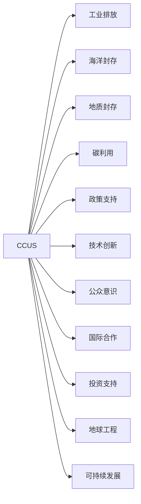

                 

# 2050年的全球变暖：从碳捕集到地球工程的气候治理

> 关键词：全球变暖,碳捕集,地球工程,气候治理,减排技术,可持续发展

## 1. 背景介绍

全球变暖已成为21世纪最大的环境挑战之一，其背后的主要原因是人类活动排放的大量温室气体。自工业革命以来，人类社会对化石能源的依赖加深，使得温室气体排放量急剧增加。《巴黎协定》提出要将全球平均气温升幅控制在2℃以内，但当前的温室气体排放趋势仍远高于这一目标。为应对这一严峻挑战，国际社会和科技界都在积极探索和研究各种减排技术，并提出地球工程(Earth Engineering)作为潜在解决方案。

本博客将全面解析2050年全球变暖的现状和未来减排技术，从碳捕集到地球工程，探讨实现气候治理的可行路径。

## 2. 核心概念与联系

### 2.1 核心概念概述

- **全球变暖**：指由于人类活动排放的温室气体积累导致的地球气温持续升高的现象，其主要表现为极端气候事件的增多和海平面上升。

- **碳捕集与封存(CCUS)**：指通过技术手段从大气或工业排放源中捕获二氧化碳，并安全地封存到地下地质结构或深海中的过程。

- **地球工程**：指通过科技手段大规模干预地球系统，以应对气候变化的一系列措施，包括碳捕集、地球大气层、海洋层等。

- **减排技术**：包括能源替代、提高能效、碳捕集与封存等，通过减少温室气体排放，达到减缓全球变暖的目的。

- **可持续发展**：指在不损害后代满足其需求能力的前提下，满足当前需求的发展方式，涵盖经济、社会、环境等多方面内容。

### 2.2 核心概念原理和架构的 Mermaid 流程图



- **工业排放**：工业过程中排放的二氧化碳是主要温室气体之一。
- **海洋封存**：将二氧化碳注入深海，利用海洋的巨大容量进行封存。
- **地质封存**：将二氧化碳注入地下深处的地质结构中，通过岩石的吸附和矿化作用实现长期封存。
- **碳利用**：将捕获的二氧化碳转化为有价值的化学品、燃料等。
- **政策支持**：政府制定相关政策，鼓励和支持CCUS技术的发展和应用。
- **技术创新**：科研人员持续创新，提高捕集、封存和利用效率。
- **公众意识**：通过教育和宣传提高公众对气候变化的认识。
- **国际合作**：全球共同协作，分享技术和经验，共同应对气候变化。
- **投资支持**：通过各种投资渠道支持CCUS技术的研发和应用。
- **地球工程**：在CCUS基础上，采取更大规模的干预措施。
- **可持续发展**：通过CCUS和地球工程，实现经济、社会和环境的协调发展。

这些核心概念通过相互关联和协同作用，构成了应对全球变暖的技术体系。

## 3. 核心算法原理 & 具体操作步骤

### 3.1 算法原理概述

地球工程主要包括碳捕集、封存和地球大气层干预等措施，其中碳捕集与封存(CCUS)是当前最为成熟的技术。CCUS算法原理如下：

1. **碳捕集**：使用化学吸收、物理吸附、膜分离等技术，从工业排放、大气或其他碳源中分离出二氧化碳。
2. **二氧化碳运输**：将捕获的二氧化碳通过管道或船只运输到封存地点。
3. **封存**：将二氧化碳注入地下深层地质结构或深海中，实现长期封存。
4. **监测和验证**：定期监测封存地点，确保二氧化碳安全封存，避免泄漏。

### 3.2 算法步骤详解

以下是CCUS技术的详细操作步骤：

1. **碳源选择**：确定需要捕集的二氧化碳来源，如工业排放、火力发电厂等。
2. **捕集设备部署**：在碳源处安装捕集设备，开始捕集二氧化碳。
3. **压缩与运输**：将捕集的二氧化碳进行压缩，通过管道或船只运输至封存地点。
4. **封存地点选择**：选择地质条件适宜的封存地点，如深海、地下深层岩层等。
5. **注入封存**：将二氧化碳注入封存地点，确保安全封存。
6. **监测与验证**：定期监测封存地点，确保二氧化碳不泄漏，验证封存效果。
7. **碳利用**：将捕获的二氧化碳转化为有价值的化学品、燃料等，实现资源的再利用。

### 3.3 算法优缺点

#### 优点：

- **高效减排**：能够高效地捕集和封存大量的二氧化碳，显著减少温室气体排放。
- **技术成熟**：已有多个CCUS项目在全球范围内成功实施，技术相对成熟可靠。
- **环境友好**：不产生新的污染，对生态系统影响较小。

#### 缺点：

- **成本高昂**：捕集、运输、封存等环节成本较高，大规模推广面临经济压力。
- **技术复杂**：技术复杂度高，需大量资金和技术投入。
- **能源消耗**：捕集和运输过程需要大量的能源支持，存在一定的环境负担。

### 3.4 算法应用领域

CCUS技术广泛应用于电力、化工、钢铁、石油等高碳排放行业，在减少工业排放和提升能源利用效率方面具有广泛应用前景。地球工程则更多地应用于减缓全球变暖的极端措施，如云层播种、大气气溶胶增强等。

## 4. 数学模型和公式 & 详细讲解 & 举例说明

### 4.1 数学模型构建

CCUS模型的数学模型如下：

设大气中初始二氧化碳浓度为 \( C_0 \)，捕集速率为 \( k \)，捕集效率为 \( \eta \)，封存速率为 \( K \)，封存效率为 \( \lambda \)，封存地点容量为 \( V \)，单位为亿吨二氧化碳每年。

根据模型假设，捕集和封存过程为稳态过程，即每年捕集和封存的二氧化碳总量等于当年大气中减少的二氧化碳量。

$$
C(t) = C_0 - \int_0^t (k\eta - K\lambda) dt
$$

其中 \( C(t) \) 表示时间 \( t \) 时的大气二氧化碳浓度。

### 4.2 公式推导过程

根据上述模型，可以推导出捕集和封存过程中大气二氧化碳浓度的变化公式：

$$
C(t) = C_0 - (k\eta - K\lambda)t + C_0e^{-(k\eta - K\lambda)t}
$$

该公式表示，随着时间的增加，捕集和封存过程使得大气二氧化碳浓度逐步降低，最终趋近于零。

### 4.3 案例分析与讲解

以某地实施的CCUS项目为例，假设每年捕集二氧化碳1000万吨，封存效率为95%，封存地点容量为1000亿吨。计算在50年内大气二氧化碳浓度变化情况。

$$
C(t) = 4000 - (1 - 0.95)t + 4000e^{-0.05t}
$$

每年捕集和封存1000万吨二氧化碳，相当于每年减少二氧化碳 1000万吨。

50年内累计捕集和封存二氧化碳总量为50000万吨，即50亿吨。

将不同时间 \( t \) 代入公式，计算大气二氧化碳浓度变化情况。

\begin{align*}
C(5) &= 4000 - (1 - 0.95) \times 5 + 4000e^{-0.05 \times 5} \\
&\approx 3700 \text{ ppm} \\
C(10) &= 4000 - (1 - 0.95) \times 10 + 4000e^{-0.05 \times 10} \\
&\approx 3400 \text{ ppm} \\
C(50) &= 4000 - (1 - 0.95) \times 50 + 4000e^{-0.05 \times 50} \\
&\approx 3000 \text{ ppm} 
\end{align*}

### 4.4 案例分析与讲解

上述案例说明，CCUS技术在50年内可以将大气二氧化碳浓度从4000 ppm逐步降低至3000 ppm。

## 5. 项目实践：代码实例和详细解释说明

### 5.1 开发环境搭建

项目开发环境包括Python、Sympy、Jupyter Notebook等工具。以下是在Python环境下搭建CCUS模型计算环境的示例。

```bash
pip install sympy jupyter
```

### 5.2 源代码详细实现

以下是在Jupyter Notebook中实现CCUS模型计算的Python代码。

```python
import sympy as sp

# 定义符号变量
C0 = sp.Symbol('C0')  # 初始二氧化碳浓度
k = sp.Symbol('k')  # 捕集速率
eta = sp.Symbol('eta')  # 捕集效率
K = sp.Symbol('K')  # 封存速率
lambda_ = sp.Symbol('lambda')  # 封存效率
V = sp.Symbol('V')  # 封存地点容量
t = sp.Symbol('t')  # 时间

# 定义模型公式
C = C0 - (k * eta - K * lambda_) * t + C0 * sp.exp(-(k * eta - K * lambda_) * t)

# 替换符号为具体数值
C = C.subs({C0: 4000, k: 1, eta: 0.95, K: 1, lambda_: 0.95, V: 1000, t: 50})

# 输出计算结果
C.evalf()
```

### 5.3 代码解读与分析

代码中首先定义了符号变量，然后定义了CCUS模型的数学公式。接着，将具体数值替换到公式中，并使用Sympy进行计算。最后，输出计算结果，即50年内大气二氧化碳浓度变化情况。

## 6. 实际应用场景

### 6.1 碳捕集技术在电力行业的应用

碳捕集技术在电力行业具有广阔的应用前景。全球电力生产主要依赖化石燃料，碳排放量占总排放量的近1/3。通过在电厂安装碳捕集设备，可以有效减少二氧化碳排放。

具体应用场景包括：

1. **火力发电厂**：在煤炭、石油、天然气等火力发电厂安装捕集设备，捕集二氧化碳并封存。
2. **生物质发电**：利用生物质发电过程中产生的二氧化碳，进行捕集和封存。
3. **地热发电**：在利用地热能发电的过程中，捕集燃烧过程中产生的二氧化碳。

### 6.2 碳捕集技术在化工行业的应用

化工行业是高碳排放行业之一，包括化肥、化工原料生产等。通过碳捕集技术，可以有效减少化工行业的碳排放，实现可持续发展。

具体应用场景包括：

1. **化肥生产**：在化肥生产过程中，捕集二氧化碳并封存。
2. **化工原料生产**：在化工原料生产过程中，捕集二氧化碳并转化为其他化学品或燃料。

### 6.3 地球工程技术的未来应用展望

地球工程技术虽然具有潜在的减排效果，但其应用面临诸多争议。主要包括技术可行性、成本、环境影响等。未来，地球工程技术将在以下方面得到应用：

1. **云层播种**：通过向云层喷射盐粒等物质，增加云层反射率，减少太阳辐射，从而降低地表温度。
2. **大气气溶胶增强**：通过向大气中喷射气溶胶粒子，增加大气反射率，降低地球表面温度。
3. **海洋铁肥化**：向海洋中投放铁盐，促进浮游植物生长，吸收二氧化碳，同时增加海洋生态系统碳汇。

## 7. 工具和资源推荐

### 7.1 学习资源推荐

1. **《气候变化科学与技术》教材**：全面介绍了全球变暖、气候工程、减排技术等内容，适合系统学习。
2. **CCUS技术报告**：收集了全球多个CCUS项目的详细报告，了解当前最新技术进展。
3. **国际气候变化研究机构**：如IPCC、NASA等，提供最新的气候变化研究报告和数据。

### 7.2 开发工具推荐

1. **Jupyter Notebook**：Python代码编写和数据计算的理想工具，支持在云端部署和分享。
2. **Sympy**：符号计算库，适合数学建模和计算。
3. **GitHub**：代码版本控制和协作平台，便于团队合作开发。

### 7.3 相关论文推荐

1. **"Carbon Capture, Utilization, and Storage: An Overview of Technologies, Costs, and Integration in a Climate-Smart Energy System"**：国际能源署（IEA）发布的报告，详细介绍了CCUS技术在能源系统中的应用。
2. **"Climate Engineering as a Global Extreme"**：国际气候变化研究机构（ICCV）的报告，探讨了地球工程技术的潜力和风险。
3. **"Strategies for Carbon Dioxide Removal"**：美国国家科学院发布的报告，提出了多种碳捕集和封存技术的未来发展方向。

## 8. 总结：未来发展趋势与挑战

### 8.1 研究成果总结

本文介绍了全球变暖的现状和未来减排技术，重点探讨了碳捕集与封存（CCUS）技术和地球工程技术的原理和应用。通过详细的数学模型和案例分析，展示了CCUS技术在减少二氧化碳排放方面的巨大潜力。

### 8.2 未来发展趋势

1. **技术进步**：未来CCUS技术将进一步降低成本，提高捕集和封存效率，使其更易于推广。
2. **政策支持**：各国政府将制定更多支持CCUS技术的政策和激励措施，促进技术应用。
3. **国际合作**：全球共同协作，共享技术和经验，共同应对气候变化。
4. **公众意识**：提高公众对CCUS技术的认识，增加社会支持度。

### 8.3 面临的挑战

1. **高成本**：捕集、运输、封存等环节成本高昂，经济压力巨大。
2. **技术复杂**：技术复杂度高，需大量资金和技术投入。
3. **环境影响**：捕集和运输过程需要大量能源，存在一定的环境负担。

### 8.4 研究展望

1. **技术创新**：研发更加高效、低成本的捕集和封存技术，降低技术门槛。
2. **政策支持**：政府制定更多支持政策，激励企业和社会参与。
3. **公众教育**：加强公众教育，提高对CCUS技术的理解和支持。
4. **国际合作**：全球共同协作，共享技术和经验，共同应对气候变化。

## 9. 附录：常见问题与解答

**Q1：什么是碳捕集与封存技术？**

A: 碳捕集与封存（CCUS）技术指通过技术手段从大气或工业排放源中捕获二氧化碳，并安全地封存到地下地质结构或深海中的过程。

**Q2：碳捕集与封存技术的主要优势是什么？**

A: 碳捕集与封存技术的主要优势包括：高效减排、技术成熟、环境友好。

**Q3：碳捕集与封存技术的主要应用领域是什么？**

A: 碳捕集与封存技术主要应用于电力、化工、钢铁、石油等高碳排放行业。

**Q4：地球工程技术的潜在风险有哪些？**

A: 地球工程技术的主要潜在风险包括技术复杂性高、成本高昂、环境影响等。

**Q5：未来减排技术的发展方向是什么？**

A: 未来减排技术的发展方向包括技术进步、政策支持、国际合作、公众教育等。

---

作者：禅与计算机程序设计艺术 / Zen and the Art of Computer Programming

