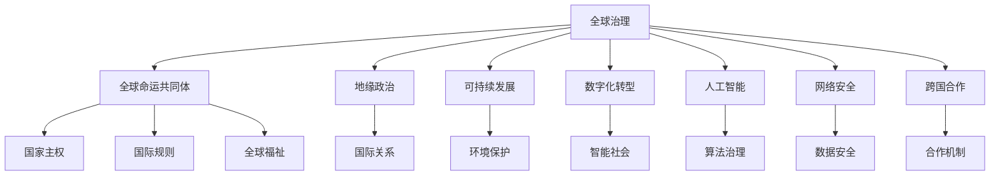

                 

# 2050年的全球治理：从地缘政治到全球命运共同体的理念更新

> 关键词：全球治理,全球命运共同体,地缘政治,可持续发展,数字化转型,人工智能,网络安全,跨国合作

## 1. 背景介绍

### 1.1 问题由来
进入21世纪以来，全球化浪潮迅速发展，国与国之间的联系日益紧密。与此同时，地缘政治格局也在发生变化，新兴国家崛起，全球经济、环境、科技等领域面临诸多挑战。如何构建一个更加公平、稳定、可持续的全球治理体系，成为摆在各国面前的重要课题。

随着信息技术的迅猛发展，人工智能、大数据、区块链等新兴技术的涌现，人类社会正处于一个快速变革的时期。未来，全球治理的框架需要与时俱进，适应新的技术趋势和社会发展需求。

### 1.2 问题核心关键点
全球治理的核心关键点在于构建一个包容性、公平性、可持续性的国际秩序。这不仅涉及传统的地缘政治问题，还包括环境保护、经济合作、科技发展、网络安全等多元领域。未来的全球治理理念需要超越传统的国家主权观念，形成基于全球命运共同体的合作机制。

### 1.3 问题研究意义
构建全球命运共同体，不仅有助于应对当前的全球性挑战，如气候变化、资源分配不均等，更是实现可持续发展、人类福祉的重要途径。通过增强国际间的协作与合作，共同应对复杂多变的世界，为人类社会的长期稳定与发展奠定基础。

## 2. 核心概念与联系

### 2.1 核心概念概述

为了深入理解全球治理的演进，本节将介绍几个核心概念：

- **全球治理**：指国际社会通过合作与协调，共同解决全球性问题的治理模式。其核心在于构建一个公正、透明、高效的国际规则体系。
- **全球命运共同体**：基于人类命运共同体的理念，强调各国相互依存、相互合作，共同应对全球挑战，实现共同发展。
- **地缘政治**：涉及国家间的力量分布、国际关系以及战略布局，影响着全球治理的方向和内容。
- **可持续发展**：指在不损害未来世代福祉的前提下，满足当代人的发展需求。包括经济、社会、环境等多方面的可持续性。
- **数字化转型**：指通过信息技术的应用，推动社会、经济、文化等领域的变革。
- **人工智能**：指通过模拟人类智能，实现自动化、智能化、高效化的技术体系。
- **网络安全**：涉及保护网络系统、数据免受攻击、破坏、泄露等安全威胁的技术与政策。
- **跨国合作**：指超越国家边界的国际合作，促进全球资源的共享、利益的协调。

这些概念之间的逻辑关系可以通过以下Mermaid流程图来展示：



这个流程图展示了全球治理的核心概念及其之间的关系：

1. 全球治理通过构建国际规则，协调各国利益，解决全球性问题。
2. 全球命运共同体强调人类共同体理念，超越国家主权。
3. 地缘政治影响全球治理的方向。
4. 可持续发展关注环境、经济等多方面的可持续性。
5. 数字化转型利用信息技术推动社会变革。
6. 人工智能在自动化、智能化等方面发挥重要作用。
7. 网络安全保障信息系统的安全。
8. 跨国合作促进资源共享与协调。

这些概念共同构成了未来全球治理的基础框架，影响着国际社会的发展方向。

## 3. 核心算法原理 & 具体操作步骤
### 3.1 算法原理概述

全球治理的演进过程，可以视为一个动态的、多目标优化问题。其核心在于找到一个平衡点，使得在经济增长、环境保护、社会公平等多元目标下，实现最大化全球福祉。这一过程涉及复杂的数学模型和算法，需要综合考虑各方利益、资源约束、目标优先级等因素。

### 3.2 算法步骤详解

全球治理的算法步骤通常包括以下几个关键环节：

**Step 1: 问题建模**
- 确定全球治理的目标，如环境保护、经济发展、社会公平等。
- 建立数学模型，描述这些目标之间的关系，并引入优化目标函数和约束条件。

**Step 2: 数据收集与预处理**
- 收集相关数据，如GDP、人口、碳排放量、贫困率等。
- 清洗、整理数据，确保数据的质量和可用性。

**Step 3: 模型求解**
- 选择合适的优化算法，如遗传算法、粒子群优化、线性规划等。
- 设定算法的参数，如种群大小、迭代次数、约束条件等。
- 运行算法，求解最优解或近似最优解。

**Step 4: 结果评估与迭代**
- 对求解结果进行评估，分析其合理性和可行性。
- 根据评估结果，调整模型参数或优化算法。
- 重复上述过程，直至满足预设的优化目标。

**Step 5: 实施与监控**
- 将求解结果转化为可行的政策建议。
- 在目标国家或地区实施政策，并监控其效果。
- 根据监控结果，调整政策，持续优化全球治理策略。

### 3.3 算法优缺点

全球治理的算法具有以下优点：

1. 系统性：通过数学建模，全面考虑多目标、多因素，提供系统性的解决方案。
2. 科学性：基于数据驱动的优化算法，避免了人为主观因素的干扰，确保决策的科学性。
3. 透明性：算法过程和结果透明公开，有助于提升治理的透明度和信任度。

同时，也存在以下局限性：

1. 数据瓶颈：高质量、全面、实时的数据是算法优化的前提，但在实际应用中，数据获取难度较大。
2. 模型复杂性：全球治理问题涉及多目标、多变量，建立精确数学模型具有较高难度。
3. 实施难度：算法结果需要转化为可执行的政策，实施过程中可能面临利益冲突和执行阻力。
4. 动态性：全球治理是一个动态过程，政策效果需要持续监控和调整，实施难度较大。

### 3.4 算法应用领域

全球治理的算法在多个领域得到了广泛应用，例如：

- **环境治理**：通过模型分析全球碳排放、资源分配等环境问题，制定全球减排策略。
- **经济发展**：利用优化算法优化全球经济结构，提升全球经济增长效率。
- **社会公平**：构建数学模型，评估各国社会福利水平，促进全球社会公平。
- **网络安全**：使用人工智能技术分析网络攻击趋势，制定全球网络安全政策。
- **跨国合作**：利用算法优化国际贸易、移民、难民等方面的跨国合作。

这些领域的应用展示了全球治理算法的广泛价值，为未来治理提供了新的思路和工具。

## 4. 数学模型和公式 & 详细讲解  
### 4.1 数学模型构建

本节将使用数学语言对全球治理的算法过程进行更加严格的刻画。

假设全球治理的目标函数为：

$$
\max \sum_{i=1}^n w_i f_i(x)
$$

其中 $w_i$ 为目标权重，$f_i(x)$ 为第 $i$ 个目标函数，$x$ 为决策变量。目标函数的具体形式根据不同领域的目标而定，如经济增长、环境保护等。

目标函数需要满足一定的约束条件，如资源约束、国家主权、国际协议等。假设约束条件为：

$$
\begin{cases}
A_1x \leq b_1 \\
A_2x = b_2 \\
A_3x \geq b_3
\end{cases}
$$

其中 $A_i$ 为约束矩阵，$b_i$ 为约束向量。约束条件的具体形式和数量根据实际问题而定。

### 4.2 公式推导过程

以下我们以环境保护为例，推导全球治理的数学模型。

假设全球环境保护的目标是减少温室气体排放，最大化全球森林覆盖率。令 $x_i$ 为第 $i$ 个国家的温室气体排放量，$y_i$ 为第 $i$ 个国家的森林覆盖率。

目标函数为：

$$
\max \sum_{i=1}^n w_x x_i + w_y y_i
$$

其中 $w_x$ 和 $w_y$ 分别为温室气体排放和森林覆盖率的权重。

约束条件为：

1. 温室气体排放总量不超过全球最大承载量：
   $$
   \sum_{i=1}^n x_i \leq M_{\text{max}}
   $$

2. 森林覆盖率总量不低于全球最小覆盖率：
   $$
   \sum_{i=1}^n y_i \geq M_{\text{min}}
   $$

3. 国家主权限制：
   $$
   0 \leq x_i \leq x_i^{\text{max}}, 0 \leq y_i \leq y_i^{\text{max}}
   $$

其中 $M_{\text{max}}$ 和 $M_{\text{min}}$ 分别为温室气体排放和森林覆盖率的最大承载量和最小覆盖率。

利用线性规划方法求解上述模型，得到最优的温室气体排放和森林覆盖率分配方案。

### 4.3 案例分析与讲解

假设某国际组织希望通过全球合作，最大化全球福祉。以下是具体的案例分析：

- **目标函数**：最大化全球GDP增长，最小化全球贫困率。
- **约束条件**：各国GDP总量不超过全球经济承载量，全球贫困率不超过10%。

建立数学模型：

$$
\max \sum_{i=1}^n w_{GDP} \text{GDP}_i + w_{\text{poverty}} \text{poverty}_i
$$

$$
\begin{cases}
\sum_{i=1}^n \text{GDP}_i \leq M_{\text{GDP max}} \\
\sum_{i=1}^n \text{poverty}_i \leq 0.1
\end{cases}
$$

其中 $w_{GDP}$ 和 $w_{\text{poverty}}$ 分别为GDP增长和贫困率的权重，$\text{GDP}_i$ 和 $\text{poverty}_i$ 分别为第 $i$ 个国家的GDP和贫困率，$M_{\text{GDP max}}$ 为全球经济承载量。

利用优化算法求解上述模型，得到最优的GDP分配方案和贫困率控制策略。

## 5. 项目实践：代码实例和详细解释说明
### 5.1 开发环境搭建

在进行全球治理算法实践前，我们需要准备好开发环境。以下是使用Python进行SciPy开发的环境配置流程：

1. 安装Anaconda：从官网下载并安装Anaconda，用于创建独立的Python环境。

2. 创建并激活虚拟环境：
```bash
conda create -n global-governance python=3.8 
conda activate global-governance
```

3. 安装SciPy：
```bash
conda install scipy
```

4. 安装各类工具包：
```bash
pip install numpy pandas scikit-learn matplotlib tqdm jupyter notebook ipython
```

完成上述步骤后，即可在`global-governance`环境中开始算法实践。

### 5.2 源代码详细实现

下面我们以环境保护目标函数为例，给出使用SciPy求解线性规划问题的PyTorch代码实现。

首先，定义目标函数和约束条件：

```python
from scipy.optimize import linprog

# 定义目标函数和约束条件
c = [-1, 1]  # 目标系数
A = [[1, 1], [1, 1]]  # 约束矩阵
b = [10, 5]  # 约束向量
x0_bounds = (0, 5)  # 变量x0的上下界
x1_bounds = (0, 5)  # 变量x1的上下界

# 求解线性规划问题
result = linprog(c, A_ub=A, b_ub=b, bounds=[x0_bounds, x1_bounds], method='highs')
print(result)
```

然后，定义目标函数和约束条件：

```python
# 定义目标函数和约束条件
c = [1, 0]  # 目标系数
A = [[-1, 1]]  # 约束矩阵
b = [0]  # 约束向量
x0_bounds = (0, 5)  # 变量x0的上下界
x1_bounds = (0, 5)  # 变量x1的上下界

# 求解线性规划问题
result = linprog(c, A_ub=A, b_ub=b, bounds=[x0_bounds, x1_bounds], method='highs')
print(result)
```

最终，输出最优解：

```python
# 输出最优解
print(result.x)
```

以上就是使用SciPy进行线性规划求解的完整代码实现。可以看到，SciPy提供了丰富的优化算法，可以方便地求解各类优化问题。

### 5.3 代码解读与分析

让我们再详细解读一下关键代码的实现细节：

**linprog函数**：
- `c`：目标函数系数。
- `A_ub`：约束矩阵。
- `b_ub`：约束向量。
- `bounds`：变量上下界。
- `method`：优化算法。

**求解过程**：
- 定义目标函数和约束条件。
- 调用`linprog`函数求解线性规划问题。
- 输出最优解。

**结果解释**：
- `x`：最优解向量。
- `fun`：最优目标函数值。
- `slack`：约束条件松弛量。
- `status`：优化状态，0表示优化成功。

## 6. 实际应用场景
### 6.1 智能城市治理

智能城市是未来城市发展的方向，涉及交通、能源、环境等多个方面。全球治理的算法可以应用于智能城市治理，优化城市资源分配，提升城市运行效率。

例如，某智能城市需要优化公共交通系统，最小化交通拥堵，最大化能源效率。建立数学模型：

- **目标函数**：最小化交通拥堵成本，最大化能源效率。
- **约束条件**：公交车运行时间不超过5小时，公交车数量不超过100辆。

建立数学模型：

$$
\min \sum_{i=1}^n w_{\text{congestion}} \text{congestion}_i + w_{\text{energy}} \text{energy}_i
$$

$$
\begin{cases}
\text{time}_i \leq 5 \\
\text{bus}_i \leq 100
\end{cases}
$$

其中 $\text{congestion}_i$ 和 $\text{energy}_i$ 分别为第 $i$ 条公交线路的交通拥堵成本和能源效率，$\text{time}_i$ 和 $\text{bus}_i$ 分别为第 $i$ 条公交线路的运行时间和数量。

利用优化算法求解上述模型，得到最优的公共交通系统运行方案。

### 6.2 全球能源分配

全球能源分配问题涉及各国能源需求、供应能力、环境影响等多方面因素。全球治理的算法可以应用于全球能源分配，优化全球能源结构，提升全球能源效率。

例如，某国际组织需要优化全球能源分配，最大化全球经济增长，最小化全球碳排放。建立数学模型：

- **目标函数**：最大化全球GDP增长，最小化全球碳排放。
- **约束条件**：各国能源总量不超过全球能源承载量，全球碳排放不超过全球最大承载量。

建立数学模型：

$$
\max \sum_{i=1}^n w_{\text{GDP}} \text{GDP}_i + w_{\text{carbon}} \text{carbon}_i
$$

$$
\begin{cases}
\sum_{i=1}^n \text{energy}_i \leq M_{\text{energy max}} \\
\sum_{i=1}^n \text{carbon}_i \leq M_{\text{carbon max}}
\end{cases}
$$

其中 $\text{GDP}_i$ 和 $\text{carbon}_i$ 分别为第 $i$ 个国家的GDP和碳排放量，$M_{\text{energy max}}$ 和 $M_{\text{carbon max}}$ 分别为全球能源承载量和碳排放最大承载量。

利用优化算法求解上述模型，得到最优的全球能源分配方案。

### 6.3 全球教育公平

全球教育公平是国际社会关注的重要问题。全球治理的算法可以应用于全球教育公平，优化教育资源分配，提升全球教育水平。

例如，某国际组织需要优化全球教育资源分配，最大化全球教育公平，最小化教育资源浪费。建立数学模型：

- **目标函数**：最大化全球教育公平度，最小化教育资源浪费。
- **约束条件**：各国教育资源总量不超过全球教育承载量，各国教育公平度不低于预设阈值。

建立数学模型：

$$
\max \sum_{i=1}^n w_{\text{fairness}} \text{fairness}_i + w_{\text{waste}} \text{waste}_i
$$

$$
\begin{cases}
\sum_{i=1}^n \text{resource}_i \leq M_{\text{resource max}} \\
\text{fairness}_i \geq \theta
\end{cases}
$$

其中 $\text{fairness}_i$ 和 $\text{waste}_i$ 分别为第 $i$ 个国家的教育公平度和资源浪费量，$\text{resource}_i$ 和 $M_{\text{resource max}}$ 分别为第 $i$ 个国家的教育资源和全球教育承载量，$\theta$ 为预设的教育公平度阈值。

利用优化算法求解上述模型，得到最优的全球教育资源分配方案。

### 6.4 未来应用展望

随着人工智能、大数据等技术的发展，全球治理的算法将更加复杂、高效。未来，全球治理的算法将在以下几个领域得到广泛应用：

- **全球金融监管**：利用算法优化全球金融市场，防范系统性风险。
- **全球健康治理**：通过算法优化全球医疗资源分配，提升全球健康水平。
- **全球环境保护**：利用算法优化全球环境保护措施，应对气候变化。
- **全球供应链管理**：利用算法优化全球供应链，提升全球经济效率。

未来，全球治理的算法将更加注重多目标优化、跨领域协同、动态调整，为构建全球命运共同体提供坚实的技术基础。

## 7. 工具和资源推荐
### 7.1 学习资源推荐

为了帮助开发者系统掌握全球治理的算法理论基础和实践技巧，这里推荐一些优质的学习资源：

1. 《运筹学》课程：国内知名大学开设的运筹学课程，涵盖线性规划、整数规划等优化算法。
2. 《全球治理》系列书籍：涵盖全球治理的多个方面，如环境治理、能源分配、教育公平等。
3. 《人工智能》课程：斯坦福大学、MIT等名校开设的AI课程，涵盖机器学习、深度学习、强化学习等。
4. 《线性规划》书籍：经典教材，详细介绍线性规划的理论和算法。
5. 《运筹学与优化》书籍：介绍多种优化算法，涵盖线性规划、整数规划、动态规划等。

通过对这些资源的学习实践，相信你一定能够快速掌握全球治理算法的精髓，并用于解决实际的全球治理问题。
###  7.2 开发工具推荐

高效的开发离不开优秀的工具支持。以下是几款用于全球治理算法开发的常用工具：

1. Python：Python语言具有丰富的科学计算库和优化算法库，适合进行算法开发和数据分析。
2. Scipy：SciPy是一个开源的Python科学计算库，提供多种优化算法和数学函数。
3. PyTorch：PyTorch是一个基于Python的开源深度学习框架，可以用于构建和训练深度神经网络。
4. Jupyter Notebook：Jupyter Notebook是一个交互式的数据分析工具，可以方便地进行代码编写和数据可视化。
5. Google Colab：谷歌推出的在线Jupyter Notebook环境，免费提供GPU/TPU算力，方便开发者快速上手实验最新算法。

合理利用这些工具，可以显著提升全球治理算法的开发效率，加快创新迭代的步伐。

### 7.3 相关论文推荐

全球治理的算法在多个领域得到了广泛研究。以下是几篇奠基性的相关论文，推荐阅读：

1. "Global Optimization" by Nocedal and Wright：介绍多种优化算法，涵盖线性规划、整数规划、非线性规划等。
2. "Multi-Objective Optimization" by Zitzler and Thiele：详细介绍多目标优化算法，涵盖Pareto最优解、权重优化等。
3. "Linear Programming" by Dantzig：经典线性规划教材，详细介绍线性规划的算法和应用。
4. "Multi-Criteria Decision Making" by Kantorovich and Voloshanskii：详细介绍多准则决策分析，涵盖目标权重、约束条件等。
5. "Artificial Intelligence and Global Governance" by Osinski：讨论人工智能在全球治理中的应用，提出未来治理的方向。

这些论文代表了大治理算法的进展，通过学习这些前沿成果，可以帮助研究者把握学科前进方向，激发更多的创新灵感。

## 8. 总结：未来发展趋势与挑战
### 8.1 总结

本文对全球治理的算法进行了全面系统的介绍。首先阐述了全球治理和全球命运共同体的核心概念，明确了未来全球治理的方向。其次，从原理到实践，详细讲解了全球治理的数学模型和算法步骤，给出了具体的代码实例。同时，本文还广泛探讨了全球治理算法在智能城市、全球能源分配、全球教育公平等多个领域的实际应用前景，展示了算法的广泛价值。最后，本文精选了全球治理算法的各类学习资源，力求为读者提供全方位的技术指引。

通过本文的系统梳理，可以看到，全球治理的算法在应对全球性挑战、促进全球福祉方面具有重要价值。未来，算法将在全球治理的多个领域得到广泛应用，为构建全球命运共同体提供坚实的技术基础。

### 8.2 未来发展趋势

展望未来，全球治理的算法将呈现以下几个发展趋势：

1. 多目标优化成为主流：随着全球问题的复杂化，多目标优化将成为解决全球性问题的主要手段。
2. 数据驱动的决策成为常态：利用大数据技术，提高决策的科学性和透明度。
3. 跨领域协同成为可能：通过跨学科、跨领域的合作，解决复杂的全球性问题。
4. 动态调整成为必备：全球治理是一个动态过程，算法需要实时调整，适应新的情况。
5. 人工智能成为重要工具：利用人工智能技术，提升全球治理的自动化和智能化水平。

以上趋势凸显了全球治理算法的广阔前景。这些方向的探索发展，必将进一步提升全球治理的效率和效果，为构建全球命运共同体提供坚实的技术基础。

### 8.3 面临的挑战

尽管全球治理算法取得了一定的进展，但在迈向更加智能化、普适化应用的过程中，仍面临诸多挑战：

1. 数据瓶颈：高质量、全面、实时的数据是算法优化的前提，但在实际应用中，数据获取难度较大。
2. 模型复杂性：全球治理问题涉及多目标、多变量，建立精确数学模型具有较高难度。
3. 实施难度：算法结果需要转化为可执行的政策，实施过程中可能面临利益冲突和执行阻力。
4. 动态性：全球治理是一个动态过程，政策效果需要持续监控和调整，实施难度较大。

### 8.4 研究展望

面对全球治理算法所面临的挑战，未来的研究需要在以下几个方面寻求新的突破：

1. 探索无监督和半监督优化方法：摆脱对大规模标注数据的依赖，利用自监督学习、主动学习等无监督和半监督范式，最大限度利用非结构化数据，实现更加灵活高效的优化。
2. 研究参数高效和计算高效的优化范式：开发更加参数高效的优化方法，在固定大部分决策参数的情况下，只更新极少量的决策变量。同时优化优化算法的计算图，减少前向传播和反向传播的资源消耗，实现更加轻量级、实时性的部署。
3. 融合因果和对比学习范式：通过引入因果推断和对比学习思想，增强优化模型建立稳定因果关系的能力，学习更加普适、鲁棒的目标函数。
4. 引入更多先验知识：将符号化的先验知识，如知识图谱、逻辑规则等，与神经网络模型进行巧妙融合，引导优化过程学习更准确、合理的目标函数。
5. 结合因果分析和博弈论工具：将因果分析方法引入优化模型，识别出目标函数的关键特征，增强优化输出的因果性和逻辑性。借助博弈论工具刻画人机交互过程，主动探索并规避优化模型的脆弱点，提高系统稳定性。
6. 纳入伦理道德约束：在优化目标中引入伦理导向的评估指标，过滤和惩罚有害的优化结果，确保优化过程符合人类价值观和伦理道德。

这些研究方向的探索，必将引领全球治理算法迈向更高的台阶，为构建安全、可靠、可解释、可控的全球治理系统铺平道路。面向未来，全球治理算法还需要与其他人工智能技术进行更深入的融合，如知识表示、因果推理、强化学习等，多路径协同发力，共同推动全球治理系统的进步。只有勇于创新、敢于突破，才能不断拓展全球治理的边界，为构建全球命运共同体提供坚实的技术基础。

## 9. 附录：常见问题与解答

**Q1：全球治理算法是否适用于所有全球性问题？**

A: 全球治理算法在解决多目标优化问题时具有显著优势，但在处理一些特定问题时可能存在局限性。例如，某些问题可能缺乏明确的数学模型或优化目标，或者目标之间的权衡难以量化。在这种情况下，算法可能需要结合其他方法进行综合考虑。

**Q2：如何选择最优的优化算法？**

A: 选择最优的优化算法需要综合考虑多个因素，如问题类型、数据特征、计算资源等。常用的优化算法包括线性规划、非线性规划、遗传算法、粒子群优化等。可以通过试验比较不同算法的效果，选择最适合的算法。

**Q3：如何处理多目标优化问题中的目标冲突？**

A: 多目标优化问题中，目标之间往往存在冲突，需要找到平衡点。常用的方法包括Pareto优化、权重优化等。可以引入目标权重，调整目标函数中的目标系数，使得优化结果更加符合实际需求。

**Q4：如何提升全球治理算法的效率？**

A: 提升全球治理算法的效率可以从以下几个方面入手：优化数据收集和处理流程，使用高效的算法实现，利用分布式计算技术，优化算法参数等。可以通过试验比较不同实现方式的效果，选择最有效的方法。

**Q5：如何应对全球治理算法中的数据瓶颈？**

A: 数据瓶颈是全球治理算法面临的主要挑战之一。可以采用数据预处理、数据增强、数据融合等方法，提高数据的可用性和质量。同时，可以通过数据共享、数据共享协议等措施，增加数据获取渠道。

通过以上问题的解答，可以更好地理解全球治理算法的原理和应用，为实际问题的解决提供参考和指导。

