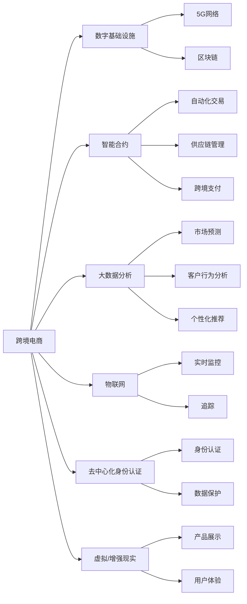

                 

# 2050年的全球贸易：从跨境电商到数字贸易的贸易数字化转型

## 1. 背景介绍

### 1.1 问题由来
随着数字技术的迅猛发展，全球贸易方式正在发生深刻的变革。传统的跨境电商模式面临效率低下、成本高昂的挑战，而数字化、智能化手段的应用，如区块链、物联网、大数据等，正在逐步改变这一局面。2050年，我们预计将迎来一场从跨境电商到数字贸易的全方位数字化转型，这将对全球经济结构、供应链管理、国际贸易政策等方面产生深远影响。本文将从多个角度探讨这一转型过程的核心概念、关键技术及其对全球贸易的潜在影响。

### 1.2 问题核心关键点
这一转型的关键点包括：
- **数字化基础设施的建设**：包括5G网络、区块链等技术，是支撑数字贸易的基础设施。
- **智能合约和去中心化应用（DApps）**：通过智能合约和DApps，实现自动化交易、供应链管理和跨境支付。
- **大数据和人工智能（AI）**：应用于数据分析、客户行为预测、自动化客户服务等方面。
- **物联网（IoT）**：实现供应链的实时监控和追踪，提升物流效率。
- **去中心化身份认证**：通过区块链技术实现去中心化身份认证，增强数据安全和隐私保护。
- **虚拟现实（VR）和增强现实（AR）**：用于展示产品、增强用户体验。

## 2. 核心概念与联系

### 2.1 核心概念概述

**跨境电商**：指通过互联网平台进行的国际贸易活动，跨越国界，涉及商品、服务或知识产权的交易。

**数字贸易**：指利用数字技术进行的贸易活动，包括在线市场、电子支付、供应链管理等，突破时间和空间的限制，实现高效、便捷的全球贸易。

**区块链**：一种分布式账本技术，去中心化、透明、不可篡改，应用于供应链管理、数字身份认证等领域。

**物联网**：通过传感器、设备等技术实现物与物的互联，用于实时监控和追踪商品状态，提升物流效率。

**大数据**：指通过技术手段收集、存储、分析和利用的海量数据，用于市场预测、客户分析、个性化推荐等。

**人工智能**：利用算法和大数据，实现自动化决策、智能客服、自动化测试等。

### 2.2 核心概念原理和架构的 Mermaid 流程图



这个流程图展示了跨境电商数字化转型的关键组件和它们之间的联系。其中，数字基础设施是整个转型的基础；智能合约、大数据、物联网等技术用于提升交易、供应链管理的效率；去中心化身份认证和虚拟/增强现实技术则用于增强用户体验和数据安全。

## 3. 核心算法原理 & 具体操作步骤

### 3.1 算法原理概述

数字贸易的数字化转型涉及多方面的技术和算法，主要包括区块链、大数据、人工智能、物联网等。这些技术通过不同的算法和机制，实现数据共享、自动化交易、实时监控等功能。

**区块链算法**：实现去中心化、透明、不可篡改的数据记录和交易验证。

**大数据算法**：通过统计、机器学习等算法，从海量数据中提取有价值的信息，用于市场预测、客户行为分析等。

**人工智能算法**：利用深度学习、强化学习等算法，实现自动化决策、智能客服、推荐系统等功能。

**物联网算法**：通过传感器、设备等技术，实现数据的实时收集和处理，用于供应链管理、物流追踪等。

### 3.2 算法步骤详解

**区块链**：
1. 构建分布式账本网络：选择适合的区块链平台，如Ethereum、Hyperledger等，建立分布式账本。
2. 设计智能合约：根据业务需求，设计智能合约，定义交易规则和执行逻辑。
3. 部署智能合约：将智能合约部署到区块链上，并测试其功能。
4. 集成业务系统：将智能合约集成到现有的业务系统中，实现自动化交易、供应链管理等。

**大数据**：
1. 数据收集：通过API、爬虫等手段，收集所需的数据。
2. 数据清洗：去除重复、错误数据，保证数据质量。
3. 数据分析：应用统计、机器学习等算法，分析数据，提取有价值的信息。
4. 数据可视化：将分析结果以图表等形式展示，便于决策。

**人工智能**：
1. 数据准备：收集和清洗所需的数据，准备模型训练。
2. 模型训练：选择适合的算法和模型，如神经网络、决策树等，进行模型训练。
3. 模型评估：在验证集上评估模型的性能，调整模型参数。
4. 模型部署：将训练好的模型部署到生产环境，实现自动化决策、智能客服等。

**物联网**：
1. 设备接入：将设备接入物联网平台，如ThingWorx、AWS IoT等。
2. 数据采集：通过传感器、设备等技术，收集实时数据。
3. 数据处理：对采集到的数据进行清洗、处理，转换为可用的格式。
4. 实时监控：通过物联网平台，实现对供应链、物流等环节的实时监控和追踪。

### 3.3 算法优缺点

**区块链**：
优点：去中心化、透明、不可篡改。
缺点：交易速度慢、成本高。

**大数据**：
优点：数据量巨大、分析结果准确。
缺点：数据隐私和安全问题。

**人工智能**：
优点：自动化决策、智能客服。
缺点：需要大量数据和计算资源，黑盒问题。

**物联网**：
优点：实时监控、物流效率高。
缺点：设备成本高，数据安全问题。

### 3.4 算法应用领域

**跨境电商**：
- 通过区块链技术实现去中心化交易，增强交易的透明度和安全性。
- 利用物联网技术实现供应链的实时监控和追踪，提高物流效率。
- 应用人工智能算法进行客户行为预测和个性化推荐。

**数字贸易**：
- 通过智能合约实现自动化交易，减少人力成本。
- 应用大数据和人工智能技术进行市场预测、客户分析，提高决策效率。
- 利用物联网技术实现供应链的实时监控，提升供应链管理效率。

## 4. 数学模型和公式 & 详细讲解

### 4.1 数学模型构建

**区块链**：
区块链通过分布式账本记录交易信息，交易的验证和执行通过智能合约实现。

**大数据**：
大数据模型通常使用统计学和机器学习算法，从海量数据中提取有价值的信息。

**人工智能**：
人工智能模型通常使用深度学习算法，通过大量数据训练，实现自动化决策和预测。

**物联网**：
物联网模型通常使用传感器和设备，实现数据的实时采集和处理。

### 4.2 公式推导过程

**区块链**：
智能合约的执行逻辑可以用伪代码表示：

```python
def execute_contract(event):
    # 检查交易是否合法
    if verify(event):
        # 执行合同条款
        execute(event)
```

**大数据**：
大数据分析可以使用统计学方法，如均值、方差、回归等，也可以使用机器学习方法，如分类、聚类等。

**人工智能**：
人工智能模型使用深度学习算法，如卷积神经网络（CNN）、循环神经网络（RNN）等，通过大量数据训练，实现自动化决策和预测。

**物联网**：
物联网模型的数据采集和处理可以用伪代码表示：

```python
def data_processing(sensor_data):
    # 数据清洗
    clean_data = clean(sensor_data)
    # 数据转换
    converted_data = convert(clean_data)
    # 实时监控
    monitor(converted_data)
```

### 4.3 案例分析与讲解

**跨境电商**：
假设某电商平台使用区块链技术进行交易，智能合约用于验证交易合法性。

**数字贸易**：
假设某企业使用大数据和人工智能技术进行市场预测和客户分析，以优化库存和销售策略。

**物联网**：
假设某物流公司使用物联网技术实现供应链的实时监控和追踪，提升物流效率。

## 5. 项目实践：代码实例和详细解释说明

### 5.1 开发环境搭建

1. 安装Python、Docker、Kubernetes等开发工具。
2. 搭建区块链网络，选择适合的区块链平台。
3. 搭建大数据集群，配置数据存储和分析工具。
4. 搭建人工智能模型训练环境，选择适合的深度学习框架。
5. 搭建物联网平台，连接设备并实现数据采集和处理。

### 5.2 源代码详细实现

**区块链**：
使用Ethereum平台搭建智能合约，并进行测试和部署。

```python
from eth import Contract
def verify(tx):
    # 验证交易是否合法
    ...
def execute(tx):
    # 执行交易
    ...
```

**大数据**：
使用Hadoop或Spark等大数据平台，进行数据收集和分析。

```python
from spark import SparkContext
def process_data():
    # 数据收集和清洗
    ...
def analyze_data():
    # 数据分析和可视化
    ...
```

**人工智能**：
使用TensorFlow或PyTorch等深度学习框架，进行模型训练和部署。

```python
import tensorflow as tf
model = tf.keras.Sequential()
model.add(tf.keras.layers.Dense(64, activation='relu'))
model.add(tf.keras.layers.Dense(1, activation='sigmoid'))
model.compile(optimizer='adam', loss='binary_crossentropy', metrics=['accuracy'])
model.fit(X_train, y_train, epochs=10, batch_size=32)
```

**物联网**：
使用ThingWorx或AWS IoT等物联网平台，实现设备连接和数据处理。

```python
from thingsworx import ThingWorx
def connect_thing():
    # 连接物联网设备
    ...
def monitor_thing():
    # 实时监控设备数据
    ...
```

### 5.3 代码解读与分析

**区块链**：
智能合约的验证和执行逻辑可以保证交易的透明性和安全性。

**大数据**：
大数据分析可以帮助企业做出更加科学的决策。

**人工智能**：
人工智能模型可以通过自动化决策提高效率。

**物联网**：
物联网技术可以实现供应链的实时监控和追踪。

### 5.4 运行结果展示

**区块链**：
智能合约的执行结果可以验证交易的合法性和安全性。

**大数据**：
大数据分析的结果可以指导企业的市场策略和库存管理。

**人工智能**：
人工智能模型的预测结果可以帮助企业优化决策。

**物联网**：
物联网设备的监控数据可以实时反映供应链的状态和效率。

## 6. 实际应用场景

### 6.1 智能供应链

智能供应链利用区块链、物联网和大数据分析技术，实现供应链的可视化、透明化和自动化管理。企业可以通过智能合约实现自动化交易，通过物联网技术实现实时监控和追踪，通过大数据分析进行市场预测和库存管理。

### 6.2 跨境支付

跨境支付利用区块链和智能合约技术，实现跨境支付的透明和安全性。通过智能合约自动验证交易，减少跨境支付的时间和成本。

### 6.3 客户行为分析

客户行为分析利用大数据和人工智能技术，分析客户的历史数据，预测客户行为，实现个性化推荐和精准营销。

### 6.4 未来应用展望

未来，随着数字技术的进一步发展，数字贸易将更加普及和智能化。区块链、大数据、人工智能、物联网等技术将深度融合，推动全球贸易向更加高效、透明、安全的方向发展。数字贸易的普及将带来新的商业模式和就业机会，对全球经济产生深远影响。

## 7. 工具和资源推荐

### 7.1 学习资源推荐

1. **《区块链技术与应用》**：深入介绍区块链的基本原理和应用场景。
2. **《大数据分析与应用》**：详细讲解大数据的采集、存储、分析和可视化。
3. **《人工智能原理与应用》**：介绍人工智能的基本算法和实现方法。
4. **《物联网技术与应用》**：讲解物联网的基本技术和应用场景。

### 7.2 开发工具推荐

1. **Python**：开源的编程语言，支持多种科学计算和数据分析库。
2. **Docker**：容器化技术，方便应用的部署和迁移。
3. **Kubernetes**：容器编排工具，实现应用的自动扩展和调度。
4. **Ethereum**：主流的区块链平台，支持智能合约的开发和部署。
5. **Spark**：大数据处理引擎，支持分布式数据处理。
6. **TensorFlow**：深度学习框架，支持大规模模型训练。
7. **AWS IoT**：物联网平台，支持设备的连接和管理。

### 7.3 相关论文推荐

1. **《区块链技术及其在供应链中的应用》**：介绍区块链在供应链中的应用案例。
2. **《大数据分析在市场预测中的应用》**：分析大数据在市场预测中的作用和应用方法。
3. **《人工智能在客户行为分析中的应用》**：介绍人工智能在客户行为分析中的应用。
4. **《物联网技术在物流中的应用》**：讲解物联网在物流中的应用案例。

## 8. 总结：未来发展趋势与挑战

### 8.1 研究成果总结

数字贸易的数字化转型正在逐步改变全球贸易方式。区块链、大数据、人工智能、物联网等技术的深度融合，将推动数字贸易向更加高效、透明、安全的方向发展。未来，数字贸易将成为全球贸易的主流模式，带来新的商业模式和就业机会。

### 8.2 未来发展趋势

1. **区块链的普及**：区块链将广泛应用于供应链管理、跨境支付等领域。
2. **大数据的广泛应用**：大数据将帮助企业实现市场预测、客户行为分析等。
3. **人工智能的深入应用**：人工智能将用于自动化决策、智能客服、推荐系统等。
4. **物联网的全面部署**：物联网将实现供应链的实时监控和追踪。
5. **5G技术的广泛应用**：5G技术将提升数字贸易的效率和可靠性。

### 8.3 面临的挑战

1. **技术标准和互操作性**：不同技术之间的标准和互操作性问题是数字化转型的重要挑战。
2. **数据隐私和安全**：数据隐私和安全问题是数字贸易的重要挑战。
3. **成本和投资回报**：数字化转型的初期投入较大，需要合理规划投资回报。
4. **法律和政策**：数字贸易需要相应的法律和政策支持，以确保安全和合规。

### 8.4 研究展望

未来，数字贸易的数字化转型将进一步深入，需要更多跨学科的合作和研究。区块链、大数据、人工智能、物联网等技术的深度融合，将推动数字贸易向更加高效、透明、安全的方向发展。

## 9. 附录：常见问题与解答

**Q1: 数字贸易和跨境电商有什么区别？**

A: 数字贸易是利用数字技术进行的贸易活动，包括在线市场、电子支付、供应链管理等，突破时间和空间的限制。跨境电商则是通过互联网平台进行的国际贸易活动，跨越国界，涉及商品、服务或知识产权的交易。

**Q2: 数字贸易的数字化转型面临哪些挑战？**

A: 数字贸易的数字化转型面临技术标准和互操作性、数据隐私和安全、成本和投资回报、法律和政策等方面的挑战。

**Q3: 数字贸易的未来发展趋势是什么？**

A: 数字贸易的未来发展趋势包括区块链的普及、大数据的广泛应用、人工智能的深入应用、物联网的全面部署、5G技术的广泛应用等。

---

作者：禅与计算机程序设计艺术 / Zen and the Art of Computer Programming

