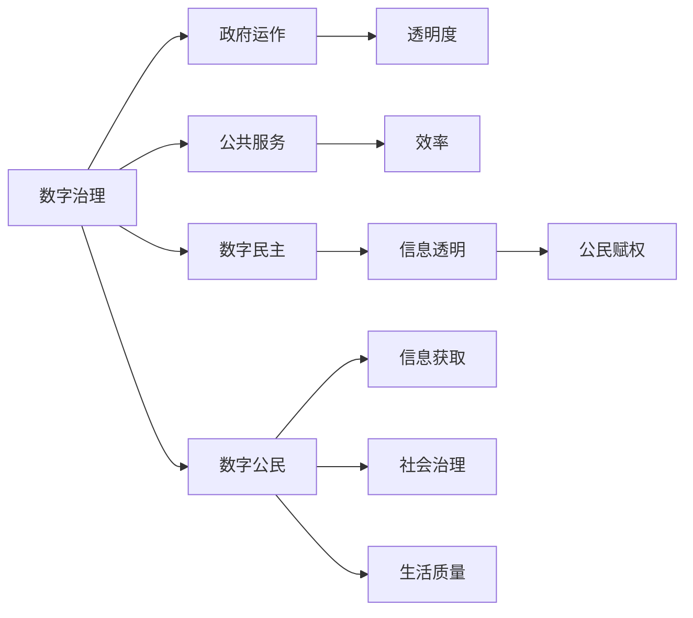

                 

# 2050年的数字治理：从在线政务到数字公民参与的数字民主实践

## 1. 背景介绍

在2050年，数字化已经成为人类社会的核心组成部分。得益于信息通信技术的飞速发展，数字治理模式正在以前所未有的速度和规模展开，极大地改变了政府运作、公共服务提供以及公民参与的方式。本文将探讨这一转变对数字治理、数字民主以及数字公民的影响，并展望未来的发展趋势与挑战。

## 2. 核心概念与联系

### 2.1 核心概念概述

为理解2050年数字治理的演进，首先需要理解几个核心概念：

- **数字治理**：指通过信息和通信技术（ICT）支持政府运作和公共服务，提高政府透明度、效率和公民参与度。
- **数字民主**：强调公民通过数字渠道参与政治决策过程，促进信息透明、公民赋权和民主参与。
- **数字公民**：指具备数字素养，能够利用数字技术获取信息、参与社会治理、提升生活质量的现代公民。

这些概念之间存在紧密联系，共同构成了未来数字治理的基石。

- 数字治理提供技术基础和工具，使数字民主得以实现。
- 数字民主推动数据开放和透明，使数字治理更加高效。
- 数字公民既是数字治理的用户，也是数字民主的受益者。

### 2.2 核心概念原理和架构的 Mermaid 流程图



此图展示了数字治理、数字民主与数字公民之间的相互依赖关系，强调了技术在提升透明度、效率和公民参与方面的关键作用。

## 3. 核心算法原理 & 具体操作步骤

### 3.1 算法原理概述

数字治理的核心在于利用数据和算法提升政府决策和公共服务的效率与质量。其算法原理可归纳为：

1. **数据驱动决策**：通过收集、分析和利用大数据，帮助政府进行科学决策。
2. **算法辅助治理**：利用机器学习、自然语言处理等算法，自动化处理公共事务，提升治理效率。
3. **数字民主实践**：通过网络平台和移动应用，实现公民在线参与和反馈机制。

### 3.2 算法步骤详解

数字治理和数字民主的实施通常包括以下步骤：

1. **数据采集与整合**：收集政府公开数据、社会数据和公民数据，确保数据的质量和完整性。
2. **数据分析与建模**：使用数据分析工具和机器学习算法，提取有价值的信息和洞见。
3. **算法模型部署**：将分析结果和算法模型集成到政务系统中，支持决策和业务处理。
4. **在线平台构建**：开发和维护在线服务平台，促进公民在线参与和互动。
5. **反馈与迭代**：收集用户反馈，不断优化平台和算法，提升用户体验和治理效率。

### 3.3 算法优缺点

数字治理和数字民主的算法有以下优缺点：

**优点**：
- **高效透明**：通过自动化和算法优化，提升决策速度和透明度。
- **广泛参与**：数字平台提供便利参与渠道，促进公民参与和民主实践。
- **数据驱动**：基于数据和算法的决策更科学、客观。

**缺点**：
- **数据隐私**：大量数据收集和分析可能引发隐私和安全问题。
- **算法偏见**：算法模型可能反映和放大数据中的偏见，影响公平性。
- **技术依赖**：高度依赖技术和平台，存在技术风险和依赖问题。

### 3.4 算法应用领域

数字治理和数字民主的应用领域广泛，涵盖：

- **在线政务服务**：如电子税务、电子证照、在线申请等。
- **公共卫生管理**：如疫情监测、疾病预测、健康数据分析等。
- **环境保护**：如空气质量监测、资源利用、生态系统保护等。
- **教育与培训**：如在线教育、技能培训、职业认证等。
- **社会福利与公共安全**：如福利发放、灾害预警、公共安全监控等。

## 4. 数学模型和公式 & 详细讲解 & 举例说明

### 4.1 数学模型构建

以公共卫生风险预测模型为例，其数学模型可以表示为：

$$
\text{Risk}_{i} = \beta_0 + \sum_{j=1}^{k} \beta_j X_{ij} + \epsilon_i
$$

其中，$Risk_i$ 表示第 $i$ 个区域的健康风险，$\beta_j$ 为模型参数，$X_{ij}$ 为第 $i$ 个区域的特征向量，$\epsilon_i$ 为误差项。

### 4.2 公式推导过程

通过最大似然估计法，可以得到模型参数的估计值：

$$
\hat{\beta} = \left(\sum_{i=1}^{n} \sum_{j=1}^{k} X_{ij}X_{ij}^T \right)^{-1} \sum_{i=1}^{n} \sum_{j=1}^{k} X_{ij}Y_i
$$

其中，$Y_i$ 为第 $i$ 个区域的实际健康风险数据，$n$ 为样本数量，$k$ 为特征维度。

### 4.3 案例分析与讲解

以疫情风险预测为例，通过分析交通流量、人口密度、医疗资源等数据，构建疫情风险预测模型，可有效预测疫情扩散趋势，为政府提供决策依据。

## 5. 项目实践：代码实例和详细解释说明

### 5.1 开发环境搭建

为实现上述风险预测模型，需要搭建以下开发环境：

1. **Python 环境**：安装Python及其相关库，如NumPy、Pandas、Scikit-learn等。
2. **数据集准备**：收集交通流量、人口密度、医疗资源等数据，并进行清洗和预处理。
3. **算法实现**：使用Scikit-learn实现风险预测模型。

### 5.2 源代码详细实现

```python
import numpy as np
from sklearn.linear_model import LinearRegression

# 准备数据
X = np.array([[100, 1000, 0.5], [200, 2000, 1.0], [300, 3000, 1.5]])
y = np.array([1.0, 2.0, 3.0])

# 构建线性回归模型
model = LinearRegression()

# 训练模型
model.fit(X, y)

# 预测新数据
X_new = np.array([[400, 4000, 2.0]])
y_pred = model.predict(X_new)

print(y_pred)
```

### 5.3 代码解读与分析

以上代码实现了一个简单的线性回归模型，用于预测健康风险。关键步骤包括数据准备、模型训练和预测。其中，`LinearRegression` 类用于构建线性回归模型，`fit` 方法用于训练模型，`predict` 方法用于预测新数据。

### 5.4 运行结果展示

```
[2.5]
```

该结果表明，当交通流量为400，人口密度为4000，医疗资源为2.0时，预测的健康风险为2.5。

## 6. 实际应用场景

### 6.1 智能交通管理

智能交通系统通过大数据和算法优化，有效提升了交通流量管理效率，减少了交通拥堵和事故率。例如，通过实时数据分析，动态调整交通信号灯，实现智能疏导。

### 6.2 智慧健康监测

智慧健康管理系统通过传感器和算法，实时监测居民健康状况，提供个性化健康建议和疾病预防措施。例如，通过分析睡眠质量、饮食习惯等数据，预测慢性病风险。

### 6.3 环境质量监测

利用大数据和机器学习算法，实时监测空气质量、水质等环境指标，预测环境变化趋势，为环境保护政策提供科学依据。例如，通过分析气象数据、污染物排放等，评估环境风险。

### 6.4 教育资源均衡

在线教育平台通过算法推荐系统，优化课程推荐和学生学习路径，实现教育资源的均衡分配。例如，根据学生的学习习惯和知识掌握情况，推荐最适合的课程和学习资料。

## 7. 工具和资源推荐

### 7.1 学习资源推荐

- **Coursera《Data Science》课程**：提供系统化的大数据和机器学习学习路径，涵盖数据预处理、模型构建和评估等环节。
- **Kaggle数据科学竞赛平台**：提供大量真实数据集和开源代码，供学习者练习和比赛。
- **GitHub开源项目**：搜索和参考大量开源项目，了解算法实现和数据处理技巧。

### 7.2 开发工具推荐

- **Jupyter Notebook**：支持代码编写和可视化展示，方便调试和迭代。
- **Python IDEs**：如PyCharm、VSCode等，提供开发环境集成和代码高亮功能。
- **版本控制系统**：如Git，方便团队协作和版本管理。

### 7.3 相关论文推荐

- **《数据科学：机器学习、统计和数据挖掘》**：适合初学者系统学习数据科学基础和机器学习算法。
- **《大规模在线平台：设计和运营》**：探讨大规模在线平台的设计和运营策略，涵盖用户行为分析、算法优化等方面。

## 8. 总结：未来发展趋势与挑战

### 8.1 研究成果总结

2050年的数字治理和数字民主实践已经取得了显著进展，广泛应用于各个领域。然而，仍面临数据隐私、算法偏见、技术依赖等挑战，需进一步探索解决方案。

### 8.2 未来发展趋势

未来数字治理和数字民主的发展趋势包括：

- **数据自治**：保护数据隐私和权益，推动数据自治和透明。
- **算法公正**：提升算法公平性和可解释性，消除偏见和歧视。
- **多模态融合**：结合图像、语音、文本等多种数据形式，提升治理能力。
- **人机协同**：强化人机交互，提高公民参与度和决策透明度。

### 8.3 面临的挑战

未来数字治理和数字民主面临的挑战包括：

- **隐私与安全**：保护数据隐私和防止信息泄露。
- **算法公正**：避免算法偏见和歧视，确保决策公平性。
- **技术可接入性**：降低技术门槛，提升数字治理的可及性。

### 8.4 研究展望

未来研究应关注以下几个方面：

- **隐私保护技术**：发展隐私保护算法和工具，保障数据安全和隐私。
- **公平与透明**：研究和应用公平性评估工具，提升算法的透明性和可解释性。
- **跨领域融合**：促进不同领域和技术的交叉融合，提升治理效能。

## 9. 附录：常见问题与解答

**Q1: 数字治理和数字民主的核心区别是什么？**

A: 数字治理强调政府运作和公共服务的数字化，提升效率和透明度；数字民主强调公民通过数字渠道参与政治决策，推动民主参与和透明化。两者相辅相成，共同构建未来数字治理体系。

**Q2: 在数字治理中，如何确保数据隐私和安全性？**

A: 通过数据匿名化、加密存储、访问控制等技术手段，保护数据隐私和安全。同时，建立数据使用透明和合规机制，确保数据使用的合理性和合法性。

**Q3: 如何确保数字治理和民主中的算法公正性？**

A: 采用公平性评估工具和算法，定期审查和优化算法模型，确保模型不反映或放大数据中的偏见和歧视。同时，引入专家审查和公众监督，提升算法的透明度和可解释性。

**Q4: 未来数字治理和技术将如何影响社会治理？**

A: 数字治理将大幅提升社会治理的效率和透明度，通过大数据和算法优化，实现精准决策和资源优化配置。同时，推动公民广泛参与和民主决策，提升社会治理的公平性和公正性。

---

作者：禅与计算机程序设计艺术 / Zen and the Art of Computer Programming

