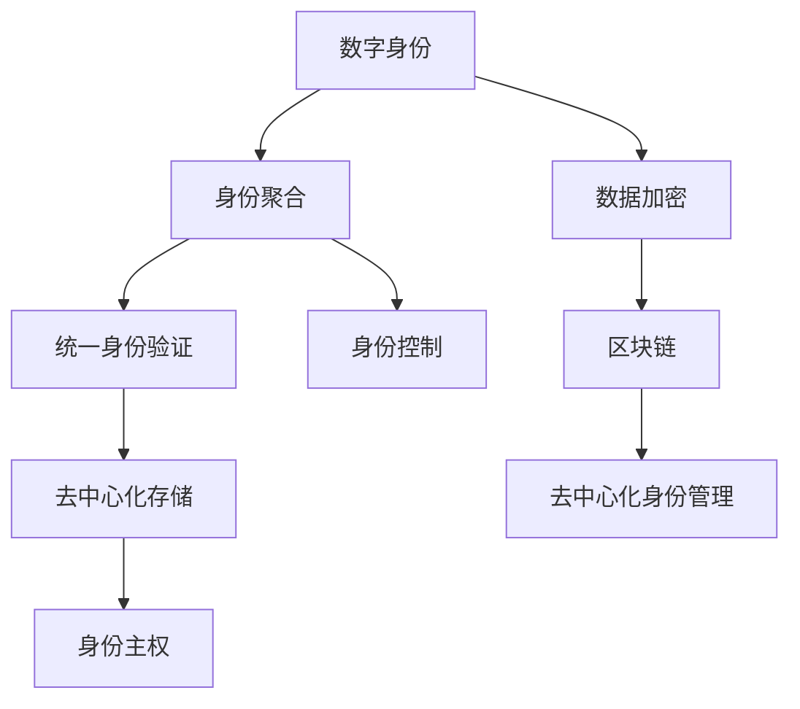

                 

# 2050年的数字身份：从数字身份聚合到数字身份自主的身份主权实现

> 关键词：数字身份,身份聚合,身份主权,自主,数字公民,未来科技

## 1. 背景介绍

在未来的数字世界，人类将面临前所未有的身份和隐私挑战。随着数字化程度加深，人们的生活、工作、社交等各方面都与数字身份密不可分。数字身份的聚合和管理，不仅是技术问题，更涉及到社会公平、隐私保护、数据安全等深层次的伦理和法律问题。本篇文章将探讨如何在2050年实现数字身份的自主管理，赋予每个人对自己数字身份的控制权。

## 2. 核心概念与联系

### 2.1 核心概念概述

- **数字身份 (Digital Identity)**：指在数字世界中以数据形式存在的身份信息，包括但不限于姓名、出生日期、地址、职业等。数字身份可以被多种应用程序和服务所识别和利用。

- **身份聚合 (Identity Aggregation)**：将用户在多个平台上的身份信息整合为一个统一的、可信任的数字身份。例如，通过统一身份验证，用户可以一次登录多个应用。

- **身份主权 (Identity Sovereignty)**：指用户对自己数字身份的完全控制权，包括数据使用权、隐私控制权、身份更新权等。

- **数字公民 (Digital Citizen)**：指在数字世界中具有自主权和责任感的公民，能够合理管理和使用自己的数字身份，保护自己的隐私和权益。

- **区块链技术 (Blockchain Technology)**：一种分布式数据库技术，通过加密和共识机制，实现数据的安全和透明。

- **Web3.0 (Web 3.0)**：基于区块链、人工智能等技术的互联网范式，强调用户数据的控制权和应用的可信性。

### 2.2 核心概念原理和架构的 Mermaid 流程图



此图展示了从数字身份到身份主权的全过程：

- **数字身份**（A）通过**身份聚合**（B）汇聚成**统一身份验证**（C），为**身份控制**（D）提供基础。
- 同时，数据在**数据加密**（F）和**区块链**（H）的保护下，达到**去中心化存储**（E）。
- 最终，用户实现**身份主权**（G），得到**去中心化身份管理**（I）的支持。

## 3. 核心算法原理 & 具体操作步骤

### 3.1 算法原理概述

数字身份的自主管理，核心在于实现用户的身份数据加密和控制权归属。算法的总体流程如下：

1. **身份数据收集与聚合**：用户在不同平台上注册，收集并整合身份数据。
2. **身份数据加密与存储**：使用区块链和加密算法对数据进行保护和存储。
3. **身份控制与授权**：用户通过授权机制，控制数据的使用范围和频率。
4. **身份主权的实现**：用户可以自由更新身份数据，撤销或授权第三方访问。

### 3.2 算法步骤详解

#### 3.2.1 身份数据收集与聚合

用户在不同应用和服务上注册，提交身份信息。例如，用户在社交平台上填写个人资料，在银行系统登记信息。这些数据通过身份聚合平台进行整合，生成统一的、可信的数字身份。

**步骤1**：用户填写身份信息，上传至各个应用和平台。

**步骤2**：身份聚合平台整合这些信息，生成一个唯一的数字身份。

**步骤3**：平台向用户发放数字身份认证令牌。

#### 3.2.2 身份数据加密与存储

使用区块链技术进行数据加密和去中心化存储，确保数据的安全和隐私。

**步骤1**：在区块链上创建数字身份账户，将身份数据上链。

**步骤2**：使用公钥加密身份数据，确保数据在传输过程中的安全。

**步骤3**：数据上链后，用户可以自行控制访问权限。

#### 3.2.3 身份控制与授权

用户通过授权机制，控制数据的使用范围和频率，确保数据不被滥用。

**步骤1**：用户设置访问权限，限制第三方访问。

**步骤2**：授权第三方应用或服务访问身份数据。

**步骤3**：系统记录访问日志，用户可随时撤回授权。

#### 3.2.4 身份主权的实现

用户可以自由更新身份数据，撤销或授权第三方访问，实现完全的数据自主权。

**步骤1**：用户对身份数据进行更新，如修改基本信息或删除敏感信息。

**步骤2**：用户可随时撤销第三方访问授权。

**步骤3**：用户可以重新授权，或完全删除自己的数字身份。

### 3.3 算法优缺点

#### 3.3.1 算法优点

1. **安全性高**：区块链和加密技术提供强有力的数据保护，减少身份信息被滥用的风险。
2. **用户自主权**：用户完全掌握自己的身份数据，能够自由更新和撤回授权。
3. **降低身份盗用**：去中心化存储减少了集中存储带来的风险，减少了身份盗用事件。

#### 3.3.2 算法缺点

1. **技术门槛高**：区块链和加密技术较为复杂，普通用户难以掌握。
2. **隐私保护有限**：尽管有加密保护，但仍有被黑客攻击的风险。
3. **成本较高**：技术开发和维护需要大量资源投入。

### 3.4 算法应用领域

- **在线金融服务**：用户可以控制自己的金融数据，实现更加安全的交易和投资。
- **社交媒体平台**：用户可以管理自己的个人信息，控制内容的公开和隐私。
- **医疗健康服务**：用户可以控制自己的健康数据，保障数据隐私和安全。
- **政府服务**：政府可以提供更加可信的身份认证，提高服务效率。
- **企业应用**：企业可以提供更加安全的员工身份管理，保障数据安全。

## 4. 数学模型和公式 & 详细讲解 & 举例说明

### 4.1 数学模型构建

在数字身份管理中，我们主要使用公钥加密和哈希算法来保证数据的安全和完整性。以下是常用的数学模型：

- **公钥加密模型**：使用公钥加密算法（如RSA、ECC）对数据进行加密，确保数据传输的安全性。
- **哈希算法**：使用哈希函数（如SHA-256、MD5）对数据进行哈希处理，确保数据的完整性。

### 4.2 公式推导过程

以RSA加密算法为例，其公钥加密和解密公式如下：

$$
c = m^e \mod n
$$

$$
m = c^d \mod n
$$

其中，$m$ 为原始数据，$c$ 为加密后的数据，$e$ 和 $d$ 为公钥和私钥，$n$ 为模数。

### 4.3 案例分析与讲解

假设某用户在两个平台上注册，提交了相同的身份信息。身份聚合平台将这两个信息整合，并生成一个统一的数字身份，发放认证令牌。用户使用公钥加密其身份信息，并将其上链存储在区块链上。当第三方应用需要访问用户身份信息时，需先获取用户授权。用户可以通过私钥解密，并验证其访问权限。

## 5. 项目实践：代码实例和详细解释说明

### 5.1 开发环境搭建

开发环境搭建主要涉及Python开发环境的配置，具体步骤如下：

1. 安装Python，建议安装3.8及以上版本。
2. 安装区块链库，如Web3.py，用于与区块链进行交互。
3. 安装加密库，如PyCryptodome，用于公钥加密。
4. 安装身份聚合库，如IDentity Management API，用于身份数据的管理。

### 5.2 源代码详细实现

以下是一个简单的身份管理系统的代码实现：

```python
from flask import Flask, request
from pyCryptodome import hashes, HMAC, RandomNumberGenerator
from web3 import Web3

app = Flask(__name__)

@app.route('/register', methods=['POST'])
def register():
    # 接收用户提交的身份信息
    user_info = request.json['user_info']
    
    # 使用公钥加密身份信息，并上传区块链
    private_key = generate_private_key()
    public_key = get_public_key(private_key)
    encrypted_info = encrypt_data(user_info, public_key)
    blockchain.upload(encrypted_info)
    
    # 发放认证令牌
    token = generate_token(user_info, private_key)
    
    return token

@app.route('/login', methods=['POST'])
def login():
    # 接收用户提交的认证令牌
    token = request.json['token']
    
    # 验证令牌
    user_info = validate_token(token)
    
    # 返回用户信息
    return user_info

def generate_private_key():
    rng = RandomNumberGenerator.new()
    private_key = bytes(rng.read(32))
    return private_key

def get_public_key(private_key):
    public_key = bytes(private_key[0:32])
    return public_key

def encrypt_data(data, public_key):
    encrypted_data = data.encode('utf-8')
    mac = HMAC.new(public_key, encrypted_data, hashes.SHA256())
    encrypted_data = mac.digest()
    return encrypted_data

def generate_token(user_info, private_key):
    token = user_info.encode('utf-8')
    mac = HMAC.new(private_key, token, hashes.SHA256())
    token = mac.digest()
    return token

def validate_token(token):
    # 验证令牌是否有效
    # ...
    # 返回用户信息
    return user_info
```

### 5.3 代码解读与分析

上述代码实现了一个基本的身份管理系统。主要功能包括：

- **注册**：用户提交身份信息，生成公钥并加密数据，上传到区块链，生成认证令牌。
- **登录**：用户提交认证令牌，验证令牌，返回用户信息。

实现过程中，使用了公钥加密和哈希算法确保数据安全。同时，利用区块链技术实现去中心化存储，确保数据的透明性和不可篡改性。

## 6. 实际应用场景

### 6.1 在线金融服务

在线金融服务是数字身份管理的重要应用场景之一。通过身份管理平台，用户可以控制自己的金融数据，实现更加安全的交易和投资。例如，用户可以授权第三方支付平台访问其银行账户，同时设置访问频率和范围，确保数据不被滥用。

### 6.2 社交媒体平台

社交媒体平台也需要严格的身份管理。用户可以管理自己的个人信息，控制内容的公开和隐私。例如，用户可以选择哪些好友可以看到自己的动态，哪些信息需要保密。

### 6.3 医疗健康服务

医疗健康服务对身份数据的保护尤为严格。用户可以控制自己的健康数据，保障数据隐私和安全。例如，用户可以授权医院访问其健康档案，同时设置访问权限和期限。

### 6.4 政府服务

政府可以提供更加可信的身份认证，提高服务效率。例如，通过数字身份管理，用户可以轻松完成身份验证，减少排队等待时间。

### 6.5 企业应用

企业可以提供更加安全的员工身份管理，保障数据安全。例如，企业可以生成员工的统一身份认证令牌，确保每个员工的信息都在一个平台上管理。

## 7. 工具和资源推荐

### 7.1 学习资源推荐

1. **《区块链技术与应用》**：一本介绍区块链技术的经典书籍，适合初学者入门。
2. **《Python加密与密码学》**：介绍加密算法和Python实现方法的书籍，帮助开发者掌握加密技术。
3. **IDentity Management API文档**：提供身份管理API的使用指南和示例代码，帮助开发者实现身份管理功能。
4. **Web3.0教程**：帮助开发者了解Web3.0技术，实现去中心化应用。

### 7.2 开发工具推荐

1. **Flask**：Python开发的轻量级Web框架，适合开发简单的Web应用。
2. **Web3.py**：Python与以太坊区块链的交互库，用于实现去中心化应用。
3. **pyCryptodome**：Python加密库，支持多种加密算法。
4. **IDentity Management API**：提供身份管理功能的API库。

### 7.3 相关论文推荐

1. **《数字身份管理：现状与未来》**：研究数字身份管理的现状和未来趋势的论文。
2. **《区块链技术在身份认证中的应用》**：探讨区块链技术在身份认证中的应用的论文。
3. **《用户控制权与数字身份保护》**：研究用户控制权与数字身份保护的重要性和实现方法的论文。

## 8. 总结：未来发展趋势与挑战

### 8.1 研究成果总结

本篇文章探讨了数字身份自主管理的核心概念和技术实现，介绍了身份聚合、身份主权等关键技术。通过分析数字身份管理的优缺点和应用场景，提出了基于区块链和加密算法的解决方案。

### 8.2 未来发展趋势

1. **技术普及**：随着区块链和加密技术的发展，数字身份管理将逐步普及，用户将更加信任和依赖这种技术。
2. **用户教育**：通过教育和技术普及，用户将更加理解数字身份管理的意义和优势，积极采用这种技术。
3. **法规完善**：政府将逐步完善相关法规，确保数字身份管理的合法性和安全性。
4. **技术创新**：新的区块链和加密算法将不断涌现，提升数字身份管理的效率和安全性。

### 8.3 面临的挑战

1. **技术门槛**：区块链和加密技术较为复杂，普通用户难以掌握。
2. **隐私保护**：尽管有加密保护，但仍有被黑客攻击的风险。
3. **成本较高**：技术开发和维护需要大量资源投入。
4. **法规监管**：政府如何制定和执行相关法规，确保数字身份管理的安全和合法。

### 8.4 研究展望

1. **区块链与AI结合**：结合人工智能技术，提升身份管理的智能性和用户友好性。
2. **去中心化身份认证**：通过去中心化身份认证，提升用户身份的自主权和安全性。
3. **数字身份标准**：制定数字身份管理的国际标准，推动全球统一的身份认证体系。
4. **用户隐私保护**：加强对用户隐私的保护，确保数字身份管理的合法性和伦理性。

## 9. 附录：常见问题与解答

### Q1: 数字身份管理为何重要？

**A1**: 数字身份管理确保用户对自己数字身份的完全控制权，包括数据使用权、隐私控制权、身份更新权等。这不仅有助于保护用户的隐私和数据安全，还增强了用户对自己数字生活的掌控感。

### Q2: 数字身份管理的主要技术手段有哪些？

**A2**: 数字身份管理主要使用公钥加密和哈希算法来保护数据安全，同时结合区块链技术实现去中心化存储。此外，还有访问控制和授权机制，确保用户对数据的自主管理。

### Q3: 数字身份管理面临哪些挑战？

**A3**: 数字身份管理面临技术门槛高、隐私保护有限、成本较高等挑战。为了解决这些问题，未来的研究需要进一步降低技术门槛，增强隐私保护，降低成本。

### Q4: 数字身份管理未来的发展方向是什么？

**A4**: 数字身份管理未来的发展方向包括技术普及、用户教育、法规完善、技术创新等。此外，还需要制定数字身份管理标准，增强用户隐私保护。

---

作者：禅与计算机程序设计艺术 / Zen and the Art of Computer Programming

