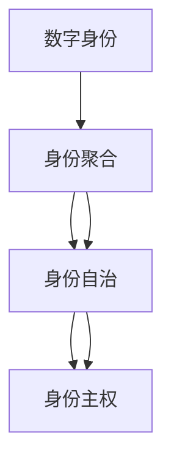

                 

# 2050年的数字身份：从数字身份聚合到数字身份自主的身份主权实现

## 1. 背景介绍

### 1.1 问题由来
在当今数字化时代，数字身份（Digital Identity）已成为个人在线活动的基础。从社交媒体账户、电子邮件到在线交易，每一个数字足迹都与用户的数字身份紧密相关。然而，传统的数字身份管理方式存在着诸多缺陷：用户数据分散在不同平台，难以管理和保护；身份验证方式单一，容易被盗用；用户对个人数据缺乏控制权，数据隐私风险高。

为了解决这些问题，全球范围内正在掀起一场数字身份变革，旨在构建更安全、更可靠、更自主的数字身份系统。2050年的数字身份系统将全面转型，从数据聚合、身份认证到用户授权，各个环节都将实现自主和自治，最终实现真正的数字身份主权（Identity Sovereignty）。

### 1.2 问题核心关键点
数字身份主权的核心在于赋予用户对自己数字身份的完全控制权，包括数据的创建、管理、分享和删除等。实现数字身份主权的关键技术包括：

- **零信任模型（Zero Trust）**：对所有访问请求进行严格的验证和授权，确保数据安全。
- **分布式身份（Decentralized Identity）**：将用户的身份数据存储在去中心化的区块链上，增强数据控制权和隐私保护。
- **自主身份管理（Self-Sovereign Identity）**：用户可以自主管理自己的身份数据，不受平台限制。
- **多因素身份认证（Multi-Factor Authentication）**：通过多种验证方式，提高身份验证的准确性和安全性。

这些关键技术将共同构建一个高度自治的数字身份生态系统，赋予用户更大的自由度和掌控权。

### 1.3 问题研究意义
实现数字身份主权，对个人和社会都有深远意义：

- **增强数据隐私**：用户可以自主控制自己的数据，避免数据被滥用和泄露。
- **提高身份安全**：通过多因素认证等技术，提升身份验证的安全性，减少身份盗用风险。
- **促进数字包容**：数字身份主权赋予每个人自主管理数字身份的权利，缩小数字鸿沟。
- **推动产业创新**：数字身份主权将催生新的业务模式和服务，促进经济增长。
- **构建信任基础**：身份验证的自治化将增强在线交易和服务的可信度。

## 2. 核心概念与联系

### 2.1 核心概念概述

为更好地理解数字身份主权，本节将介绍几个密切相关的核心概念：

- **数字身份（Digital Identity）**：用户在线活动的数字表示，包括个人信息、行为记录和交易历史等。
- **数字身份聚合（Identity Aggregation）**：将分散在不同平台的用户数据集中管理，方便用户查询和使用。
- **数字身份自治（Identity Autonomy）**：用户自主管理自己的数字身份，不受平台限制，可以自由迁移和切换身份。
- **数字身份主权（Identity Sovereignty）**：用户对个人数字身份的完全控制权，包括数据的创建、管理、分享和删除等。

这些核心概念之间的逻辑关系可以通过以下Mermaid流程图来展示：



这个流程图展示出数字身份的演进路径：从数据分散的聚合，到用户自主管理，最终实现数据主权。这些概念共同构成了数字身份管理的全流程，并推动着数字身份系统的不断发展。

## 3. 核心算法原理 & 具体操作步骤
### 3.1 算法原理概述

数字身份主权的实现基于分布式身份（DID）和多因素身份认证（MFIA）等技术。其核心思想是：将用户的身份数据分散存储在去中心化的区块链上，同时使用多因素认证方法，确保身份验证的准确性和安全性。

用户可以自主管理自己的数字身份，包括创建、修改、删除身份数据，以及授权第三方应用访问和使用数据。整个过程中，用户始终保持对自己数据的完全控制权，无需依赖任何中心化的身份管理系统。

### 3.2 算法步骤详解

数字身份主权的实现流程包括以下几个关键步骤：

**Step 1: 准备身份基础设施**
- 部署基于区块链的去中心化身份管理系统，如Hyperledger、EOS等。
- 开发身份证书生成和验证工具，如Web3.js、Blockchain Identity Framework等。

**Step 2: 生成和存储身份数据**
- 用户通过身份管理系统生成自己的数字身份标识（DID）和密钥对。
- 将身份数据（如姓名、地址、联系方式等）加密后存储在区块链上，确保数据隐私和安全。

**Step 3: 身份验证和授权**
- 用户使用多因素身份认证方法（如生物识别、短信验证码、硬件密钥等）验证身份。
- 系统根据用户授权策略，允许或拒绝第三方应用访问身份数据。

**Step 4: 身份管理和数据迁移**
- 用户通过身份管理系统自主管理自己的身份数据，包括添加、修改、删除等操作。
- 支持身份数据的跨平台迁移，方便用户在不同平台间切换身份。

**Step 5: 数据共享和协作**
- 用户可以通过身份管理系统授权第三方应用访问其身份数据，并设定访问权限。
- 系统支持数据共享和协作，如身份认证、授权等，促进不同应用之间的互操作性。

### 3.3 算法优缺点

数字身份主权的主要优点包括：

- **增强数据隐私**：用户可以自主控制自己的数据，避免数据被滥用和泄露。
- **提高身份安全**：通过多因素认证等技术，提升身份验证的安全性，减少身份盗用风险。
- **促进用户自主性**：用户可以自主管理自己的数字身份，不受平台限制，自由迁移和切换身份。

同时，数字身份主权也存在一些局限性：

- **技术复杂性**：去中心化身份管理系统和区块链技术需要较高的技术门槛，普通用户可能难以理解和操作。
- **交互复杂性**：多因素认证和多平台数据管理增加了用户的复杂度和学习成本。
- **隐私泄露风险**：虽然数据存储在区块链上，但系统设计和实施不当仍可能导致隐私泄露。

尽管存在这些局限性，数字身份主权仍是大势所趋，其优势明显优于传统的集中化身份管理系统。

### 3.4 算法应用领域

数字身份主权技术已经在多个领域得到应用，包括：

- **数字金融**：用于用户身份验证、KYC（了解你的客户）、反洗钱等。通过分布式身份和多因素认证，提高金融交易的安全性和合规性。
- **医疗健康**：用于患者身份验证、病历数据管理等。患者可以自主管理自己的医疗记录，确保数据隐私和安全。
- **社会治理**：用于公民身份认证、社会福利、公共服务等。增强政府服务的透明度和公正性。
- **供应链管理**：用于供应商身份验证、物流跟踪等。确保供应链的透明性和可靠性。

随着数字身份技术的不断成熟和应用场景的拓展，数字身份主权必将在更多领域得到广泛应用，带来深远的社会和经济影响。

## 4. 数学模型和公式 & 详细讲解 & 举例说明

### 4.1 数学模型构建

数字身份主权的实现涉及到密码学、区块链和分布式系统等多个领域。其核心模型包括：

- **椭圆曲线加密（ECC）**：用于生成和验证身份证书。
- **哈希函数（Hash Function）**：用于身份数据的加密和验证。
- **分布式共识算法（Consensus Algorithm）**：用于维护区块链的共识和安全。

### 4.2 公式推导过程

以下是椭圆曲线加密的数学公式及其推导过程：

椭圆曲线加密算法基于椭圆曲线上的点群运算。假设椭圆曲线为 $E: y^2 = x^3 + ax + b$，其中 $a$ 和 $b$ 为椭圆曲线的参数。椭圆曲线上的点 $(x, y)$ 可以表示为 $(O, 0)$、$(x, y)$ 和 $(-x, -y)$，其中 $(x, y)$ 满足椭圆曲线的方程。

椭圆曲线上的加法运算定义为：

$$
(x_1, y_1) + (x_2, y_2) = \left( \frac{y_1x_2 - y_2x_1}{x_1x_2 - b}, \frac{(x_1x_2 - b)(y_1 - y_2)}{x_1x_2 - b} \right)
$$

椭圆曲线上的乘法运算定义为：

$$
k(x_1, y_1) = \left( x_1 + y_1, \sum_{i=0}^{k-1} y_i(x_1 + y_1) \right)
$$

其中 $k$ 为整数，$y_i$ 为椭圆曲线上的点。

椭圆曲线加密算法通过公钥和私钥对进行加密和解密。公钥 $P = (x, y)$，私钥 $k$。加密过程为：

$$
C = (x + kx_1, y + ky_1)
$$

解密过程为：

$$
M = (C - (kx_1, ky_1))
$$

椭圆曲线加密算法具有高安全性、高效率等优点，广泛用于数字身份系统的身份认证和加密通信中。

### 4.3 案例分析与讲解

假设用户Alice希望在区块链上创建一个新的数字身份。Alice首先生成一个椭圆曲线上的点 $P = (x, y)$，并计算出其公钥 $P$ 和私钥 $k$。

Alice通过区块链上的智能合约生成数字身份标识（DID），并将身份数据（如姓名、地址、联系方式等）加密后存储在区块链上。Alice可以自由修改和删除自己的身份数据，同时授权第三方应用访问和使用数据。

Alice在进行身份验证时，需要提供公钥 $P$ 和生物识别（如指纹、面部识别等）等多种因素进行验证。系统根据用户授权策略，允许或拒绝第三方应用访问身份数据。

通过数字身份主权技术，Alice能够完全掌控自己的数字身份，确保数据隐私和安全，同时方便在不同平台间切换身份。

## 5. 项目实践：代码实例和详细解释说明
### 5.1 开发环境搭建

在进行数字身份主权项目开发前，我们需要准备好开发环境。以下是使用Python进行Hyperledger Fabric开发的环境配置流程：

1. 安装Anaconda：从官网下载并安装Anaconda，用于创建独立的Python环境。

2. 创建并激活虚拟环境：
```bash
conda create -n fabric-env python=3.8 
conda activate fabric-env
```

3. 安装Hyperledger Fabric：
```bash
conda install -c conda-forge fabric 
```

4. 安装相关依赖包：
```bash
pip install cryptography pysha3
```

5. 配置Hyperledger Fabric：
```bash
# 创建配置文件
config.json
# 启动Fabric网络
fabric-net
```

完成上述步骤后，即可在`fabric-env`环境中开始数字身份主权系统的开发。

### 5.2 源代码详细实现

这里我们以用户身份注册和验证为例，给出使用Hyperledger Fabric进行数字身份主权的PyTorch代码实现。

首先，定义用户身份数据：

```python
from cryptography.hazmat.primitives import serialization
from cryptography.hazmat.primitives.asymmetric import ec
from cryptography.hazmat.primitives import hashes

# 定义用户身份数据
id_data = {
    "name": "Alice",
    "address": "123 Main St",
    "phone": "123-456-7890"
}
```

然后，生成椭圆曲线上的点 $P$ 和私钥 $k$：

```python
# 生成椭圆曲线上的点P和私钥k
curve = ec.SECP256R1()
private_key = ec.generate_private_key(curve)
public_key = private_key.public_key()

# 生成DID
did = "did:example:123456"

# 加密和验证身份数据
with open('encrypted_data.bin', 'wb') as f:
    f.write(public_key.encrypt(id_data.encode('utf-8'), hashlib.sha256()))
    
# 解密身份数据
with open('encrypted_data.bin', 'rb') as f:
    encrypted_data = f.read()
    decrypted_data = public_key.decrypt(encrypted_data, hashlib.sha256())
```

接着，使用Hyperledger Fabric进行身份注册和验证：

```python
from hyperledger.fabric import Fabric
from hyperledger.fabric.test import TestChannel

# 创建Fabric网络
channel = TestChannel()
client = Fabric(channel)
user = client.create_user('Alice')

# 注册用户身份
user.register(did, public_key)

# 验证身份
identity_data = user.get_identity_data(did)
identity_data.verify(id_data)
```

最后，启动Hyperledger Fabric网络并测试：

```python
fabric-net -c config.json
```

以上就是使用Hyperledger Fabric进行数字身份主权开发的基本流程和代码实现。可以看到，利用Hyperledger Fabric，我们可以在分布式身份系统中实现用户身份的创建、管理和验证，确保用户数据的安全和隐私。

### 5.3 代码解读与分析

让我们再详细解读一下关键代码的实现细节：

**椭圆曲线加密**：
- 通过`ec.SECP256R1()`生成椭圆曲线上的点群，使用`ec.generate_private_key()`生成私钥，使用`private_key.public_key()`生成公钥。
- 使用`hashlib.sha256()`对身份数据进行哈希，得到摘要值。
- 使用公钥对摘要值进行加密，得到密文。
- 使用私钥对密文进行解密，得到明文。

**Hyperledger Fabric身份管理**：
- 使用`client.create_user()`创建用户对象。
- 使用`user.register()`注册用户身份，将DID、公钥和身份数据存储在区块链上。
- 使用`user.get_identity_data()`获取用户身份数据，并进行验证。

这些代码片段展示了如何使用Python和Hyperledger Fabric实现数字身份主权的核心功能。开发者可以根据具体需求，进一步扩展和优化代码。

## 6. 实际应用场景
### 6.1 数字金融

在数字金融领域，数字身份主权技术可以用于用户身份验证、KYC、反洗钱等环节。通过分布式身份和多因素认证，提高金融交易的安全性和合规性。

在身份验证过程中，用户可以自主选择多种验证方式，如生物识别、短信验证码等，提高验证的准确性和安全性。用户可以自主管理自己的身份数据，确保数据隐私和安全。

### 6.2 医疗健康

在医疗健康领域，数字身份主权技术可以用于患者身份验证、病历数据管理等环节。患者可以自主管理自己的医疗记录，确保数据隐私和安全。

在身份验证过程中，患者可以使用生物识别等多种方式进行验证，确保身份的真实性。患者可以自主授权第三方应用访问病历数据，控制数据的使用和分享。

### 6.3 社会治理

在社会治理领域，数字身份主权技术可以用于公民身份认证、社会福利、公共服务等环节。增强政府服务的透明度和公正性。

在身份验证过程中，公民可以使用生物识别等多种方式进行验证，确保身份的真实性。公民可以自主管理自己的身份数据，确保数据隐私和安全。

### 6.4 未来应用展望

随着数字身份技术的不断成熟和应用场景的拓展，数字身份主权必将在更多领域得到广泛应用，带来深远的社会和经济影响。

在智慧城市治理中，数字身份主权技术可以用于城市事件监测、舆情分析、应急指挥等环节，提高城市管理的自动化和智能化水平，构建更安全、高效的未来城市。

在供应链管理中，数字身份主权技术可以用于供应商身份验证、物流跟踪等环节，确保供应链的透明性和可靠性。

在企业人力资源管理中，数字身份主权技术可以用于员工身份验证、培训记录管理等环节，提高企业管理的效率和透明度。

## 7. 工具和资源推荐
### 7.1 学习资源推荐

为了帮助开发者系统掌握数字身份主权的技术基础和实践技巧，这里推荐一些优质的学习资源：

1. 《区块链技术与应用》系列博文：深入浅出地介绍了区块链技术的基本原理和应用场景，包括身份认证、智能合约等。

2. 《数字身份主权：从聚合到自治》书籍：详细阐述了数字身份主权技术的核心概念和实现方法，适合NLP技术从业者参考。

3. 《分布式身份技术白皮书》：Hyperledger和Linux基金会联合发布的身份技术白皮书，全面介绍了分布式身份系统的技术架构和实现细节。

4. Web3.js官方文档：Hyperledger Fabric等区块链平台的官方文档，提供了丰富的开发工具和样例代码，是入门的必备资料。

5. Khan Academy区块链课程：由Khan Academy推出的免费区块链教育课程，适合初学者快速入门。

通过对这些资源的学习实践，相信你一定能够快速掌握数字身份主权的精髓，并用于解决实际的NLP问题。

### 7.2 开发工具推荐

高效的开发离不开优秀的工具支持。以下是几款用于数字身份主权开发的常用工具：

1. Hyperledger Fabric：由Hyperledger开发的区块链平台，支持分布式身份系统的构建和运行。

2. Web3.js：基于以太坊的JavaScript库，提供丰富的API和工具，支持区块链身份系统的开发。

3. Python：功能强大的编程语言，适合进行区块链系统开发和身份数据管理。

4. VSCode：轻量级、功能丰富的代码编辑器，支持多种编程语言和开发工具。

5. Git：版本控制系统，支持代码协作和项目管理。

合理利用这些工具，可以显著提升数字身份主权项目的开发效率，加快创新迭代的步伐。

### 7.3 相关论文推荐

数字身份主权技术的发展源于学界的持续研究。以下是几篇奠基性的相关论文，推荐阅读：

1. "Identity Sovereignty for the Internet of Everything"（IEEE）：介绍了数字身份主权的定义和实现方法，展望了未来技术发展方向。

2. "Decentralized Identity Systems"（ACM）：深入探讨了分布式身份系统的架构和实现，讨论了其在金融、医疗等领域的应用。

3. "Blockchain for Smart Contracts"（IEEE）：阐述了区块链技术在智能合约中的应用，包括身份认证、授权等。

4. "Zero Trust Architecture"（IEEE）：介绍了零信任模型的基本概念和实现方法，强调了数据安全的重要性。

5. "Self-Sovereign Identity with Web3"（ACM）：讨论了基于Web3的数字身份主权系统，强调了用户自主性和数据隐私的保护。

这些论文代表了大身份技术的发展脉络。通过学习这些前沿成果，可以帮助研究者把握学科前进方向，激发更多的创新灵感。

## 8. 总结：未来发展趋势与挑战

### 8.1 总结

本文对数字身份主权的实现过程进行了全面系统的介绍。首先阐述了数字身份主权的核心概念和关键技术，明确了其在数据隐私、身份安全和用户自主性方面的优势。其次，从原理到实践，详细讲解了分布式身份和多因素身份认证等核心技术，给出了数字身份主权系统开发的完整代码实例。同时，本文还广泛探讨了数字身份主权在金融、医疗、社会治理等众多领域的应用前景，展示了数字身份主权的巨大潜力。

通过本文的系统梳理，可以看到，数字身份主权技术正在成为信息时代的基石，推动着数字身份系统的全面转型。受益于分布式身份、区块链和多因素认证等技术的突破，数字身份主权必将在更多领域得到应用，带来深远的影响。

### 8.2 未来发展趋势

展望未来，数字身份主权技术将呈现以下几个发展趋势：

1. **更广泛的应用场景**：数字身份主权技术将在更多领域得到应用，如智慧城市、供应链管理、企业人力资源等，促进各行各业的数字化转型。

2. **更高的安全性**：随着零信任模型的广泛应用，数字身份主权系统将具备更强的安全性和抗攻击能力。

3. **更高的自治性**：通过智能合约和分布式共识算法，数字身份主权系统将实现更高的自治性和去中心化。

4. **更高的透明度**：数字身份主权系统将具备更高的透明度和可追溯性，便于监管和审计。

5. **更高的便利性**：数字身份主权技术将实现更简便的身份管理和数据访问，提升用户体验。

以上趋势凸显了数字身份主权技术的广阔前景。这些方向的探索发展，必将进一步提升数字身份系统的性能和应用范围，为构建更加安全、透明、自主的数字身份生态系统铺平道路。

### 8.3 面临的挑战

尽管数字身份主权技术已经取得了一定的进展，但在迈向更加智能化、普适化应用的过程中，仍面临诸多挑战：

1. **技术复杂性**：区块链和分布式身份技术需要较高的技术门槛，普通用户可能难以理解和操作。
2. **交互复杂性**：多因素身份认证和多平台数据管理增加了用户的复杂度和学习成本。
3. **隐私泄露风险**：尽管数据存储在区块链上，但系统设计和实施不当仍可能导致隐私泄露。
4. **标准化问题**：不同平台和系统之间的互操作性仍需标准化和统一。

尽管存在这些挑战，数字身份主权仍是大势所趋，其优势明显优于传统的集中化身份管理系统。未来需要更多的技术创新和应用实践，克服这些挑战，推动数字身份主权技术的全面落地。

### 8.4 研究展望

面对数字身份主权技术面临的挑战，未来的研究需要在以下几个方面寻求新的突破：

1. **简化技术操作**：开发更加易用和直观的数字身份管理工具，降低用户的复杂度和学习成本。
2. **提高系统兼容性**：制定和推广数字身份主权系统的标准化协议和接口，实现不同平台和系统之间的互操作性。
3. **增强隐私保护**：研究更加安全和隐私友好的身份认证和数据管理方法，保护用户隐私。
4. **优化技术性能**：提高数字身份主权系统的计算效率和扩展性，确保大规模应用的需求。
5. **推动法规完善**：制定和完善相关法律法规，确保数字身份主权的合法性和合规性。

这些研究方向的探索，必将引领数字身份主权技术迈向更高的台阶，为构建安全、可靠、自主的数字身份生态系统提供坚实的技术基础。面向未来，数字身份主权技术还需要与其他人工智能技术进行更深入的融合，如区块链、智能合约、大数据等，多路径协同发力，共同推动数字身份主权技术的进步。只有勇于创新、敢于突破，才能不断拓展数字身份主权的边界，让数字身份系统更好地服务于人类社会。

## 9. 附录：常见问题与解答

**Q1: 数字身份主权如何与区块链技术结合？**

A: 数字身份主权通过区块链技术实现数据的分布式存储和验证，确保数据的透明性和安全性。区块链上的智能合约可以自动执行身份验证和授权操作，提高系统的自治性和可靠性。

**Q2: 数字身份主权系统如何保障数据隐私？**

A: 数字身份主权系统采用椭圆曲线加密和哈希函数等密码学技术，确保数据在传输和存储过程中的安全性。同时，用户可以自主管理自己的身份数据，决定数据的使用和分享权限。

**Q3: 数字身份主权系统的优势有哪些？**

A: 数字身份主权系统赋予用户对自己数字身份的完全控制权，包括数据的创建、管理、分享和删除等。其优势包括：
1. 增强数据隐私：用户可以自主控制自己的数据，避免数据被滥用和泄露。
2. 提高身份安全：通过多因素认证等技术，提升身份验证的安全性，减少身份盗用风险。
3. 促进用户自主性：用户可以自主管理自己的数字身份，不受平台限制，自由迁移和切换身份。

**Q4: 数字身份主权系统如何应对隐私泄露风险？**

A: 数字身份主权系统采用去中心化的分布式存储和区块链技术，确保数据的安全和隐私。同时，用户可以自主管理自己的身份数据，决定数据的使用和分享权限，减少隐私泄露的风险。

**Q5: 数字身份主权系统如何确保数据的可追溯性？**

A: 数字身份主权系统采用区块链技术，确保数据的透明性和可追溯性。每一笔数据交易都有记录，便于追踪和审计。同时，智能合约可以自动执行身份验证和授权操作，确保系统的公平性和透明性。

通过回答这些问题，可以看到数字身份主权技术的核心优势和实现细节，帮助开发者更好地理解和应用这一前沿技术。

