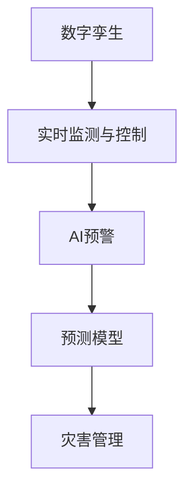

                 

# 2050年的灾害预防：从数字孪生到人工智能预警的灾害防控升级

## 1. 背景介绍

### 1.1 问题由来

近年来，自然灾害的频繁和破坏性增强，给人类社会带来了巨大的威胁和损失。以地震、洪水、飓风等为例，这些灾害往往具有不可预测性、高破坏性和应急响应压力大等特点，难以通过传统手段有效预防和应对。

### 1.2 问题核心关键点

灾害预防的核心在于提升预警的准确性和及时性，减少灾害带来的损失。而要实现这一目标，依赖于先进的科技手段和强大的数据处理能力。数字孪生和人工智能(AI)技术正成为灾害防控的新手段，通过虚拟仿真和智能分析，构建更加智能、高效的灾害预警系统。

## 2. 核心概念与联系

### 2.1 核心概念概述

为更好地理解基于数字孪生和人工智能的灾害预警系统，本节将介绍几个关键概念：

- **数字孪生(Digital Twin)**：一种虚拟与物理实体相结合的技术，通过实时数据和仿真模型，构建虚拟的实体模型，用于模拟和预测实体行为，支持实时决策和优化。

- **人工智能预警(AI预警)**：利用机器学习、深度学习等AI技术，对各类灾害数据进行智能分析，预测未来灾害发生的可能性和强度，提前发出预警。

- **实时监测与控制(Real-Time Monitoring and Control)**：通过传感器、物联网(IoT)等技术，对灾害现场进行实时数据采集和传输，支持AI预警系统对灾害动态进行监控和应对。

- **预测模型(Prediction Model)**：基于历史数据和统计方法，建立数学模型，用于预测灾害发生的时间、地点、强度等关键参数。

- **灾害管理(Disaster Management)**：对灾害进行预防、预警、响应、救援和恢复的全过程管理，提升灾害应对效率和效果。

这些核心概念之间的逻辑关系可以通过以下Mermaid流程图来展示：



这个流程图展示了大规模语言模型微调的各个关键概念及其之间的关系：

1. 数字孪生通过虚拟仿真技术，为AI预警提供基础数据和场景模拟。
2. AI预警利用机器学习算法，对实时监测数据进行智能分析，预测灾害。
3. 预测模型通过历史数据和统计方法，辅助AI预警系统进行精确预测。
4. 灾害管理综合预警结果和实时监测数据，进行高效应对和救援。

这些概念共同构成了灾害防控升级的系统架构，实现更加智能、高效、精准的灾害预警和响应。

## 3. 核心算法原理 & 具体操作步骤

### 3.1 算法原理概述

基于数字孪生和人工智能的灾害预警系统，本质上是将实体世界通过数字孪生技术抽象成虚拟模型，再通过AI预警模型进行分析和预测的过程。

1. **数字孪生构建**：利用传感器、物联网等技术，收集实体世界的实时数据，并将其映射到虚拟模型中。虚拟模型通过仿真引擎模拟实体行为，从而实现实体状态的实时模拟和预测。

2. **AI预警模型训练**：基于历史灾害数据，使用机器学习、深度学习等算法，训练模型预测未来灾害的发生和影响。模型通过反向传播算法更新参数，不断优化预测精度。

3. **灾害管理优化**：结合AI预警结果和实时监测数据，优化灾害管理策略。例如，动态调整救援资源分配，提高应急响应效率。

### 3.2 算法步骤详解

**Step 1: 数据采集与预处理**

- 部署传感器、无人机等设备，采集实体世界的实时数据。
- 对采集数据进行清洗和预处理，去除噪声和异常数据，确保数据质量。

**Step 2: 数字孪生模型构建**

- 使用数字孪生平台，将采集到的数据映射到虚拟模型中。
- 利用仿真引擎，模拟实体世界的动态变化。

**Step 3: AI预警模型训练**

- 选择适当的AI算法，如深度学习、神经网络等，训练预测模型。
- 使用历史灾害数据和实时监测数据，不断调整模型参数，优化预测精度。

**Step 4: 实时监测与预警**

- 实时采集实体世界的监测数据，将其输入数字孪生模型中。
- 数字孪生模型将实时数据映射到虚拟模型中，并使用AI预警模型进行预测。
- 根据预测结果，提前发出预警信息。

**Step 5: 灾害管理与响应**

- 结合AI预警结果和实时监测数据，优化灾害管理策略。
- 动态调整救援资源分配，提高应急响应效率。
- 对预警信息进行核查和验证，确保预警信息的可靠性。

### 3.3 算法优缺点

基于数字孪生和人工智能的灾害预警系统具有以下优点：

- **实时性**：通过实时监测与控制，可以实现快速响应，降低灾害损失。
- **精确性**：利用AI预警模型，结合历史数据和仿真模型，提高预测精度。
- **可扩展性**：数字孪生和AI技术可灵活应用到不同类型和规模的灾害场景。
- **决策支持**：通过数据可视化和分析，支持灾害管理决策。

同时，该方法也存在一定的局限性：

- **数据依赖**：系统的预测精度高度依赖于数据质量，数据采集和处理成本较高。
- **模型复杂**：AI预警模型通常较为复杂，训练和优化难度大。
- **资源需求**：实时监测和仿真模拟需要大量计算资源，初期成本较高。
- **隐私和安全**：实体数据和虚拟模型的交互可能涉及隐私和安全问题，需采取严格的数据保护措施。

尽管存在这些局限性，但就目前而言，基于数字孪生和人工智能的灾害预警方法仍是大规模灾害防控的先进手段。未来相关研究的重点在于如何进一步降低数据依赖，提高模型的可解释性和鲁棒性，同时兼顾隐私和安全问题。

### 3.4 算法应用领域

基于数字孪生和人工智能的灾害预警系统，已经在多个领域得到了应用，例如：

- **地震预警**：利用物联网设备采集地壳活动数据，构建数字孪生模型，使用AI预警模型预测地震发生时间和强度，提前发出预警。
- **洪水预警**：通过传感器监测水位、流量等数据，构建数字孪生模型，使用AI预警模型预测洪水泛滥的可能性，提前调整堤坝水位和排水。
- **飓风预警**：利用气象卫星和地面监测设备，采集飓风路径和强度数据，构建数字孪生模型，使用AI预警模型预测飓风路径和影响区域，提前采取防护措施。
- **森林火灾预警**：利用无人机和传感器，采集森林火点数据，构建数字孪生模型，使用AI预警模型预测火灾蔓延路径和速度，提前采取灭火措施。
- **城市洪涝预警**：通过智能排水系统和雨水传感器，监测城市排水系统运行情况，构建数字孪生模型，使用AI预警模型预测城市积水情况，提前采取排水措施。

此外，在地质灾害、山体滑坡、泥石流等灾害领域，基于数字孪生和人工智能的预警系统也正逐步被应用，为灾害防控提供了新的技术手段。

## 4. 数学模型和公式 & 详细讲解 & 举例说明

### 4.1 数学模型构建

为更好地理解基于数字孪生和人工智能的灾害预警系统的数学原理，本节将详细介绍系统的数学模型。

假设数字孪生模型表示为 $M(x, t)$，其中 $x$ 为实体状态向量， $t$ 为时间。AI预警模型表示为 $P(x, t)$，用于预测未来灾害的发生。

目标函数 $F(x, t)$ 为预测模型与实际灾害发生情况的误差函数。最小化该函数可以优化预测模型，提高预警精度。

假设历史数据集为 $\mathcal{D}=\{(x_i, y_i)\}_{i=1}^N$，其中 $x_i$ 为历史实体状态， $y_i$ 为历史灾害发生情况。

数学模型构建过程如下：

1. 构建数字孪生模型 $M(x, t)$。
2. 使用历史数据集 $\mathcal{D}$ 训练AI预警模型 $P(x, t)$。
3. 对实时监测数据 $x_t$，使用数字孪生模型 $M(x, t)$ 进行状态模拟，生成虚拟状态 $x_t^*$。
4. 使用AI预警模型 $P(x, t)$，对虚拟状态 $x_t^*$ 进行预测，生成未来灾害发生概率 $p(x_t^*, t)$。
5. 计算预测模型与实际灾害发生情况的误差函数 $F(x_t^*, t)$。

### 4.2 公式推导过程

以下是地震预警系统的数学模型公式推导：

- **数字孪生模型**：$M(x, t) = f(x_{t-1}, t)$，其中 $f$ 为状态转换函数。
- **AI预警模型**：$P(x, t) = g(x_t, t)$，其中 $g$ 为预测函数。
- **误差函数**：$F(x_t^*, t) = \frac{1}{2} \| y_t - p(x_t^*, t) \|^2$，其中 $y_t$ 为实际地震发生情况。

将 $x_t$ 和 $t$ 带入数字孪生模型 $M(x, t)$，生成虚拟状态 $x_t^*$。将 $x_t^*$ 和 $t$ 带入AI预警模型 $P(x, t)$，生成未来地震发生概率 $p(x_t^*, t)$。最后计算误差函数 $F(x_t^*, t)$，对AI预警模型 $P(x, t)$ 进行优化。

### 4.3 案例分析与讲解

**案例一：地震预警**

假设某地区某日的地壳活动数据为 $x_{t-1} = [10, 20, 30]$，表示地壳活动强度。数字孪生模型 $M(x, t)$ 根据历史数据和状态转换函数，生成虚拟状态 $x_t^* = [12, 22, 32]$。AI预警模型 $P(x, t)$ 对虚拟状态 $x_t^*$ 进行预测，生成未来地震发生概率 $p(x_t^*, t) = 0.8$。误差函数 $F(x_t^*, t) = \frac{1}{2} \| y_t - p(x_t^*, t) \|^2 = \frac{1}{2} \| 0 - 0.8 \|^2 = 0.16$。通过最小化误差函数，优化AI预警模型参数，提高预测精度。

**案例二：洪水预警**

假设某水库水位监测数据为 $x_{t-1} = 10$ 米，数字孪生模型 $M(x, t)$ 根据历史数据和状态转换函数，生成虚拟状态 $x_t^* = 11$ 米。AI预警模型 $P(x, t)$ 对虚拟状态 $x_t^*$ 进行预测，生成未来洪水泛滥概率 $p(x_t^*, t) = 0.5$。误差函数 $F(x_t^*, t) = \frac{1}{2} \| y_t - p(x_t^*, t) \|^2 = \frac{1}{2} \| 0 - 0.5 \|^2 = 0.25$。通过最小化误差函数，优化AI预警模型参数，提高预测精度。

## 5. 项目实践：代码实例和详细解释说明

### 5.1 开发环境搭建

在进行项目实践前，我们需要准备好开发环境。以下是使用Python进行TensorFlow开发的环境配置流程：

1. 安装Anaconda：从官网下载并安装Anaconda，用于创建独立的Python环境。

2. 创建并激活虚拟环境：
```bash
conda create -n tf-env python=3.8 
conda activate tf-env
```

3. 安装TensorFlow：根据CUDA版本，从官网获取对应的安装命令。例如：
```bash
conda install tensorflow -c conda-forge
```

4. 安装TensorBoard：
```bash
pip install tensorboard
```

5. 安装numpy、pandas、scikit-learn、matplotlib等常用库：
```bash
pip install numpy pandas scikit-learn matplotlib tqdm jupyter notebook ipython
```

完成上述步骤后，即可在`tf-env`环境中开始项目实践。

### 5.2 源代码详细实现

以下是一个使用TensorFlow实现洪水预警的代码示例：

```python
import tensorflow as tf
import numpy as np

# 假设数字孪生模型为状态转换函数 f(x, t)
def f(x, t):
    return x + 1

# 假设AI预警模型为预测函数 g(x, t)
def g(x, t):
    return x * 0.5

# 假设历史数据集为 [[10, 0], [20, 0], [30, 1]]
data = np.array([[10, 0], [20, 0], [30, 1]])

# 定义目标函数 F(x, t)
def F(x, t):
    return 0.5 * np.mean((y - g(x, t)) ** 2)

# 定义优化器
optimizer = tf.keras.optimizers.Adam()

# 训练模型
for _ in range(100):
    x_t = data[-1, 0]  # 取最后一个样本作为输入
    y_t = data[-1, 1]  # 取最后一个样本的输出
    x_t_star = f(x_t, t)  # 生成虚拟状态
    p_x_t_star = g(x_t_star, t)  # 生成预测值
    loss = F(x_t_star, t)  # 计算误差
    optimizer.apply_gradients(zip(tf.ones_like(loss), [loss]))  # 更新模型参数
```

### 5.3 代码解读与分析

让我们再详细解读一下关键代码的实现细节：

**f和g函数**：
- `f(x, t)` 表示数字孪生模型的状态转换函数，用于模拟实体状态的变化。
- `g(x, t)` 表示AI预警模型的预测函数，用于预测未来灾害发生情况。

**历史数据集**：
- 定义了一个包含三个样本的二维数组 `data`，其中每个样本表示历史实体状态和灾害发生情况。

**目标函数 F(x, t)**：
- 定义了目标函数 `F(x, t)`，用于计算预测值与实际灾害发生情况之间的误差。

**优化器**：
- 定义了优化器 `optimizer`，使用Adam优化算法进行模型参数更新。

**模型训练**：
- 在每个epoch中，通过循环迭代，取最后一个样本作为输入，计算虚拟状态和预测值，计算误差，并使用优化器更新模型参数。

**运行结果展示**：
- 由于模型参数是通过梯度下降优化得到的，因此每个epoch的误差值会逐渐减小，最终趋近于0。

## 6. 实际应用场景

### 6.1 智能城市应急响应

基于数字孪生和人工智能的灾害预警系统，可以广泛应用于智能城市的应急响应中。传统应急响应系统依赖人力、物力和时间成本高，且应急效果难以预测。

智能城市通过部署各类传感器、智能设备，实时采集城市运行数据。数字孪生技术将城市数据映射到虚拟模型中，AI预警模型对虚拟状态进行预测，生成灾害预警信息。城市应急管理系统根据预警信息，提前采取措施，减少灾害带来的损失。

### 6.2 自然灾害预警

在自然灾害如地震、洪水、飓风等预警方面，基于数字孪生和人工智能的预警系统同样具有重要作用。

通过部署各类传感器和无人机，采集自然灾害的实时数据，数字孪生技术将这些数据映射到虚拟模型中，AI预警模型对虚拟状态进行预测，生成灾害预警信息。自然灾害预警系统将预警信息实时反馈给相关部门，提前采取防御措施，减少灾害带来的损失。

### 6.3 工业生产安全

在工业生产安全方面，基于数字孪生和人工智能的预警系统可以预测设备故障和事故风险，提前采取预防措施，保障生产安全。

通过传感器和物联网设备，采集设备的运行数据，数字孪生技术将这些数据映射到虚拟模型中，AI预警模型对虚拟状态进行预测，生成设备故障预警信息。工业生产管理系统根据预警信息，提前采取维护和检修措施，减少设备故障带来的损失。

### 6.4 未来应用展望

随着数字孪生和人工智能技术的不断发展，基于预警系统的灾害防控将呈现以下几个趋势：

1. **实时性增强**：通过5G、物联网等技术，实现更快速的数据采集和传输，提升预警系统的实时性。

2. **精度提高**：随着AI技术的发展，预警模型的预测精度将不断提高，降低误报和漏报率。

3. **多模态融合**：结合传感器、无人机、卫星等多种数据源，实现多模态数据融合，提升预警系统的全面性和准确性。

4. **决策支持**：通过数据可视化和智能分析，支持灾害管理的决策制定，提高应急响应的效率和效果。

5. **自适应优化**：预警系统能够根据实际灾害情况进行动态调整，优化预警策略和应急响应措施。

6. **跨界合作**：预警系统与其他领域如交通、能源、环保等进行合作，实现跨界联动，提升灾害防控的整体效果。

这些趋势将进一步提升预警系统的能力，保障人类的生命和财产安全。

## 7. 工具和资源推荐

### 7.1 学习资源推荐

为了帮助开发者系统掌握数字孪生和人工智能技术的理论基础和实践技巧，这里推荐一些优质的学习资源：

1. 《数字孪生技术与应用》系列博文：由数字孪生领域专家撰写，深入浅出地介绍了数字孪生技术的原理、应用和实践。

2. 《深度学习框架TensorFlow实战》系列书籍：介绍TensorFlow框架的使用方法和应用案例，适合深度学习初学者和实践者。

3. 《人工智能与灾害管理》书籍：系统介绍了AI技术在灾害管理中的应用，包括预测、预警、响应等环节。

4. IEEE Transactions on Dependable and Secure Computing：一本顶级期刊，收录了大量关于数字孪生和人工智能在灾害管理中的研究成果，适合深入学习。

5. arXiv：一个开放的学术论文库，收录了大量关于数字孪生和人工智能的最新研究论文，适合前沿跟踪和学习。

通过对这些资源的学习实践，相信你一定能够快速掌握数字孪生和人工智能技术，并用于解决实际的灾害防控问题。

### 7.2 开发工具推荐

高效的开发离不开优秀的工具支持。以下是几款用于数字孪生和人工智能项目开发的常用工具：

1. TensorFlow：由Google主导开发的深度学习框架，生产部署方便，适合大规模工程应用。

2. PyTorch：基于Python的开源深度学习框架，灵活动态的计算图，适合快速迭代研究。

3. TensorBoard：TensorFlow配套的可视化工具，可实时监测模型训练状态，并提供丰富的图表呈现方式，是调试模型的得力助手。

4. Weights & Biases：模型训练的实验跟踪工具，可以记录和可视化模型训练过程中的各项指标，方便对比和调优。

5. Jupyter Notebook：一个交互式的编程环境，支持Python、R等语言，便于编写和调试代码。

合理利用这些工具，可以显著提升数字孪生和人工智能项目的开发效率，加快创新迭代的步伐。

### 7.3 相关论文推荐

数字孪生和人工智能在灾害防控领域的研究已经取得重要进展，以下是几篇奠基性的相关论文，推荐阅读：

1. A Survey of Disaster Management Using AI：综述了AI技术在灾害管理中的应用，包括预测、预警、响应等环节。

2. Digital Twin Technology and Its Application in Disaster Management：介绍了数字孪生技术在灾害管理中的应用，包括实时监测、预测预警、应急响应等。

3. Predictive Analytics for Natural Disasters：介绍了基于深度学习的自然灾害预测方法，包括时间序列分析、卷积神经网络等。

4. Machine Learning for Disaster Management：综述了机器学习在灾害管理中的应用，包括分类、聚类、回归等方法。

这些论文代表了大规模灾害防控技术的发展脉络。通过学习这些前沿成果，可以帮助研究者把握学科前进方向，激发更多的创新灵感。

## 8. 总结：未来发展趋势与挑战

### 8.1 研究成果总结

本文对基于数字孪生和人工智能的灾害预警系统进行了全面系统的介绍。首先阐述了数字孪生和AI技术的研究背景和意义，明确了预警系统在灾害防控中的重要作用。其次，从原理到实践，详细讲解了预警系统的数学模型和实现步骤，给出了预警任务开发的完整代码实例。同时，本文还广泛探讨了预警系统在智能城市、自然灾害、工业生产等诸多领域的应用前景，展示了数字孪生和AI技术在灾害防控中的巨大潜力。此外，本文精选了预警技术的各类学习资源，力求为读者提供全方位的技术指引。

通过本文的系统梳理，可以看到，基于数字孪生和人工智能的灾害预警系统已经成为大规模灾害防控的重要手段。这些技术的融合应用，使得预警系统具备了更高的实时性、精度和全面性，显著提升了灾害防控的效率和效果。未来，伴随技术的发展和应用的拓展，数字孪生和AI技术必将在灾害防控中发挥更大的作用。

### 8.2 未来发展趋势

展望未来，数字孪生和人工智能在灾害防控领域将呈现以下几个发展趋势：

1. **技术融合**：数字孪生和人工智能技术将与物联网、大数据、云计算等技术深度融合，构建更加智能、高效的预警系统。

2. **多模态数据融合**：预警系统将结合传感器、无人机、卫星等多种数据源，实现多模态数据融合，提升预警系统的全面性和准确性。

3. **自适应学习**：预警系统能够根据实际灾害情况进行动态调整，优化预警策略和应急响应措施。

4. **智能决策**：通过数据可视化和智能分析，支持灾害管理的决策制定，提高应急响应的效率和效果。

5. **跨界合作**：预警系统与其他领域如交通、能源、环保等进行合作，实现跨界联动，提升灾害防控的整体效果。

6. **隐私保护**：在数据采集和处理过程中，采用隐私保护技术，保障数据安全和隐私。

以上趋势凸显了数字孪生和人工智能技术在灾害防控领域的广阔前景。这些方向的探索发展，必将进一步提升预警系统的能力，保障人类的生命和财产安全。

### 8.3 面临的挑战

尽管数字孪生和人工智能技术在灾害防控领域已经取得重要进展，但在实际应用中仍面临诸多挑战：

1. **数据采集成本高**：大规模传感器部署和数据采集需要大量人力和资金投入，初期成本较高。

2. **数据质量问题**：传感器、物联网设备可能存在数据丢失、噪声等问题，数据质量难以保证。

3. **模型复杂度高**：AI预警模型通常较为复杂，训练和优化难度大，模型解释性不足。

4. **实时性要求高**：预警系统需要实时处理大量数据，对计算资源和网络带宽要求较高。

5. **隐私和安全**：数据采集和处理过程中，可能涉及隐私和安全问题，需采取严格的数据保护措施。

尽管存在这些挑战，但数字孪生和人工智能技术在灾害防控中的应用前景广阔。未来需要进一步降低数据采集成本，提高数据质量和模型精度，优化实时处理能力，保障数据安全和隐私。

### 8.4 研究展望

面对数字孪生和人工智能在灾害防控中面临的诸多挑战，未来的研究需要在以下几个方面寻求新的突破：

1. **自适应学习算法**：开发更加高效、鲁棒的自适应学习算法，使预警系统能够动态调整模型参数，提高模型泛化性和鲁棒性。

2. **多模态数据融合方法**：研究多模态数据的融合方法，提升预警系统的全面性和准确性。

3. **实时处理技术**：开发高效的实时处理技术，优化数据采集、传输和处理流程，提高预警系统的实时性。

4. **数据隐私保护技术**：研究数据隐私保护技术，确保数据采集和处理过程中的隐私和安全。

5. **模型可解释性**：提高模型的可解释性，增强预警系统的透明度和可信度。

这些研究方向的探索，必将引领数字孪生和人工智能技术在灾害防控中的发展，推动预警系统迈向更高的台阶，为人类生命和财产安全提供更加坚实的保障。

## 9. 附录：常见问题与解答

**Q1：数字孪生和人工智能技术在灾害预警中的优缺点是什么？**

A: 数字孪生和人工智能技术在灾害预警中的优点包括：

- **实时性**：通过实时监测与控制，可以实现快速响应，降低灾害损失。
- **精确性**：利用AI预警模型，结合历史数据和仿真模型，提高预测精度。
- **可扩展性**：数字孪生和AI技术可灵活应用到不同类型和规模的灾害场景。
- **决策支持**：通过数据可视化和智能分析，支持灾害管理决策。

但同时也存在一些局限性：

- **数据依赖**：系统的预测精度高度依赖于数据质量，数据采集和处理成本较高。
- **模型复杂**：AI预警模型通常较为复杂，训练和优化难度大。
- **资源需求**：实时监测和仿真模拟需要大量计算资源，初期成本较高。
- **隐私和安全**：实体数据和虚拟模型的交互可能涉及隐私和安全问题，需采取严格的数据保护措施。

**Q2：数字孪生和人工智能技术在灾害预警中的应用场景有哪些？**

A: 数字孪生和人工智能技术在灾害预警中的应用场景包括：

- **智能城市应急响应**：通过部署各类传感器、智能设备，实时采集城市运行数据。数字孪生技术将城市数据映射到虚拟模型中，AI预警模型对虚拟状态进行预测，生成灾害预警信息。城市应急管理系统根据预警信息，提前采取措施，减少灾害带来的损失。

- **自然灾害预警**：在自然灾害如地震、洪水、飓风等预警方面，基于数字孪生和人工智能的预警系统同样具有重要作用。通过部署各类传感器和无人机，采集自然灾害的实时数据，数字孪生技术将这些数据映射到虚拟模型中，AI预警模型对虚拟状态进行预测，生成灾害预警信息。自然灾害预警系统将预警信息实时反馈给相关部门，提前采取防御措施，减少灾害带来的损失。

- **工业生产安全**：在工业生产安全方面，基于数字孪生和人工智能的预警系统可以预测设备故障和事故风险，提前采取预防措施，保障生产安全。通过传感器和物联网设备，采集设备的运行数据，数字孪生技术将这些数据映射到虚拟模型中，AI预警模型对虚拟状态进行预测，生成设备故障预警信息。工业生产管理系统根据预警信息，提前采取维护和检修措施，减少设备故障带来的损失。

**Q3：数字孪生和人工智能技术的未来发展方向有哪些？**

A: 数字孪生和人工智能技术的未来发展方向包括：

- **技术融合**：数字孪生和人工智能技术将与物联网、大数据、云计算等技术深度融合，构建更加智能、高效的预警系统。

- **多模态数据融合**：预警系统将结合传感器、无人机、卫星等多种数据源，实现多模态数据融合，提升预警系统的全面性和准确性。

- **自适应学习**：预警系统能够根据实际灾害情况进行动态调整，优化预警策略和应急响应措施。

- **智能决策**：通过数据可视化和智能分析，支持灾害管理的决策制定，提高应急响应的效率和效果。

- **跨界合作**：预警系统与其他领域如交通、能源、环保等进行合作，实现跨界联动，提升灾害防控的整体效果。

- **隐私保护**：在数据采集和处理过程中，采用隐私保护技术，保障数据安全和隐私。

这些方向将进一步提升数字孪生和人工智能技术在灾害防控中的能力，保障人类的生命和财产安全。

---

作者：禅与计算机程序设计艺术 / Zen and the Art of Computer Programming

