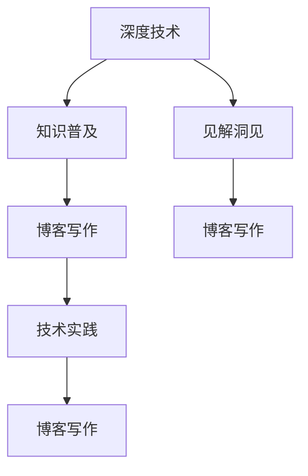

                 

# 建立专业博客：深度分享你的知识和见解

> 关键词：
- 专业博客
- 知识分享
- 见解洞见
- 技术博客
- 技术深度
- 博客写作
- 技术实践

## 1. 背景介绍

### 1.1 问题由来
在信息技术飞速发展的今天，博客已成为技术人员和爱好者们分享知识、交流心得的重要平台。特别是对于人工智能（AI）领域的技术专家而言，博客不仅是一个展示自我、塑造个人品牌的机会，更是一个向广大读者普及AI知识、激发技术讨论的重要渠道。然而，随着科技的日新月异，如何建立一个既专业又易于理解的技术博客，成为了许多作者面临的挑战。

### 1.2 问题核心关键点
建立专业博客的核心在于如何将复杂的AI知识，用逻辑清晰、结构紧凑的语言进行传递，让非技术背景的读者也能轻松理解。同时，需要展示作者对某一领域的深入见解和洞见，建立起自己的专业权威。为此，作者需要具备以下几方面的能力：

1. **技术理解力**：对AI的最新技术和研究进展有深刻理解。
2. **逻辑表达能力**：能够将复杂的概念和算法转化为易于理解的语言。
3. **实践应用能力**：能够将理论知识应用于实际项目中，提供详细的实现步骤和代码示例。
4. **批判性思维**：对现有技术进行评估，提出有建设性的观点和改进建议。
5. **持续学习**：保持对新技术和趋势的敏感度，不断更新博客内容。

### 1.3 问题研究意义
建立一个专业博客不仅有助于提升个人在AI领域的权威性，还能为读者提供有价值的知识资源，促进技术交流和创新。通过分享深度见解，博客作者可以影响更多人的思考和行动，推动AI技术的普及和发展。

## 2. 核心概念与联系

### 2.1 核心概念概述

在建立专业博客的过程中，需要涉及多个核心概念，这些概念之间相互关联，构成了博客内容的基础：

- **深度技术**：指对某一AI技术的深入理解和掌握。
- **知识普及**：以易于理解的语言向读者普及AI知识。
- **见解洞见**：基于深度技术理解，提出独特的观点和解决方案。
- **博客写作**：撰写结构合理、语言流畅的技术文章。
- **技术实践**：通过具体案例展示技术应用的细节和效果。

### 2.2 核心概念原理和架构的 Mermaid 流程图



## 3. 核心算法原理 & 具体操作步骤

### 3.1 算法原理概述

建立一个专业博客的算法原理可以归纳为以下几个步骤：

1. **确定目标受众**：明确博客面向的技术水平和兴趣，决定内容的深度和广度。
2. **规划内容框架**：确定博客的核心主题和分章节结构。
3. **收集和整理资料**：收集相关技术和研究论文，整理成易于理解的内容。
4. **撰写和编辑文章**：用清晰、流畅的语言撰写文章，并进行必要的编辑和润色。
5. **发布和维护博客**：选择合适的博客平台，定期更新和维护内容。

### 3.2 算法步骤详解

**Step 1: 确定目标受众**
- 分析读者的技术背景和兴趣点，确定博客内容的深度和广度。
- 通过调研和问卷调查，了解读者对AI技术的主要困惑和需求。
- 根据分析结果，设计符合读者需求的内容规划。

**Step 2: 规划内容框架**
- 确定博客的核心主题，如AI前沿技术、深度学习、机器学习等。
- 设计各章节的标题和小标题，形成清晰的结构。
- 确定每个章节的重点和子主题，明确每个部分的目标和内容。

**Step 3: 收集和整理资料**
- 搜集相关的技术论文、书籍、博客文章等资料。
- 对搜集到的资料进行整理和筛选，剔除过时或重复的内容。
- 对关键概念和技术进行深入研究，确保内容的准确性和权威性。

**Step 4: 撰写和编辑文章**
- 以读者易于理解的方式撰写文章，避免使用过于专业或复杂的术语。
- 使用图表、代码示例等辅助手段，帮助读者更好地理解技术原理。
- 反复校对文章，确保逻辑清晰、语法无误。

**Step 5: 发布和维护博客**
- 选择合适的博客平台，如Medium、知乎、GitHub Pages等。
- 设置博客的SEO（搜索引擎优化），提高文章在搜索引擎中的排名。
- 定期更新博客内容，跟踪最新的技术和研究成果。
- 鼓励读者留言和讨论，及时回应读者的问题和反馈。

### 3.3 算法优缺点

**优点**：
1. **易于理解**：通过简洁的语言和丰富的实例，使复杂的技术易于理解。
2. **权威性**：借助作者的技术背景和见解，提升博客的专业性和权威性。
3. **互动性强**：通过读者留言和讨论，增强文章的互动性和学习氛围。

**缺点**：
1. **时间成本高**：撰写高质量博客需要大量的时间和精力。
2. **技术要求高**：对作者的深度技术理解和表达能力要求较高。
3. **内容更新慢**：需要不断跟进最新的技术和研究进展，更新博客内容。

### 3.4 算法应用领域

建立一个专业博客可以应用于多个AI相关的领域，如：

- **AI前沿技术**：介绍最新的AI技术趋势和应用。
- **深度学习**：深入分析深度学习算法和模型。
- **机器学习**：探讨机器学习理论和实践技巧。
- **自然语言处理**：讲解自然语言处理技术和应用案例。
- **计算机视觉**：分享计算机视觉技术和图像处理技巧。
- **强化学习**：介绍强化学习算法及其在游戏、机器人等领域的应用。

## 4. 数学模型和公式 & 详细讲解 & 举例说明

### 4.1 数学模型构建

假设博客作者想要分享一篇关于深度学习中的卷积神经网络（CNN）的文章。可以构建如下数学模型：

1. **输入数据**：
   - $X$：输入数据，形状为$N \times H \times W \times C$，其中$N$表示样本数，$H$、$W$和$C$分别表示图像的高、宽和通道数。
2. **卷积层**：
   - $K$：卷积核大小，如$3 \times 3$。
   - $S$：步长，如$1$。
   - $P$：填充大小，如$1$。
   - $F$：滤波器数，如$16$。
   - $V$：卷积层的输出，形状为$N \times (H-K+2P) \times (W-K+2P) \times F$。

### 4.2 公式推导过程

卷积层的操作可以看作是对输入数据$X$进行卷积操作，其数学表达式为：

$$
V_{ij} = \sum_{m,n=0}^{K-1} \sum_{c=0}^{C-1} X_{i+m,j+n,c} \times K_{mn,c}
$$

其中$K_{mn,c}$是第$m$行第$n$列的第$c$个卷积核元素。

### 4.3 案例分析与讲解

假设有一个图像分类任务，输入数据为$N \times 64 \times 64 \times 3$的彩色图像。使用一个大小为$3 \times 3$、步长为$1$、填充为$1$、滤波器数为$16$的卷积层，则输出$V$的大小为$N \times 62 \times 62 \times 16$。

## 5. 项目实践：代码实例和详细解释说明

### 5.1 开发环境搭建

建立一个专业博客需要搭建合适的开发环境。这里推荐使用Python和Jupyter Notebook：

1. **安装Python**：
   - 下载并安装Python 3.x版本。
   - 配置环境变量，添加Python到系统路径。
2. **安装Jupyter Notebook**：
   - 使用pip安装Jupyter Notebook。
   - 启动Jupyter Notebook，创建新笔记本。

### 5.2 源代码详细实现

以下是一个使用TensorFlow实现CNN的简单示例：

```python
import tensorflow as tf

# 定义卷积层
def convolution_layer(input_data, kernel_size, strides, padding, num_filters):
    conv_layer = tf.layers.conv2d(
        inputs=input_data,
        filters=num_filters,
        kernel_size=kernel_size,
        strides=strides,
        padding=padding,
        activation=tf.nn.relu)
    return conv_layer

# 构建CNN模型
model = tf.keras.Sequential([
    convolution_layer(tf.keras.layers.Input((64, 64, 3)), (3, 3), (1, 1), 'same', 16),
    tf.keras.layers.Flatten(),
    tf.keras.layers.Dense(10, activation='softmax')
])

# 编译模型
model.compile(optimizer='adam', loss='categorical_crossentropy', metrics=['accuracy'])

# 训练模型
model.fit(train_images, train_labels, epochs=10, validation_data=(val_images, val_labels))
```

### 5.3 代码解读与分析

以上代码实现了CNN的基本结构。具体解释如下：

- **卷积层定义**：`convolution_layer`函数定义了一个卷积层，接受输入数据、卷积核大小、步长、填充和滤波器数，返回卷积层的输出。
- **模型构建**：`Sequential`模型顺序添加卷积层、扁平化层和全连接层。
- **模型编译**：使用`compile`方法编译模型，选择`adam`优化器和`categorical_crossentropy`损失函数。
- **模型训练**：使用`fit`方法训练模型，指定训练数据和验证数据。

## 6. 实际应用场景

### 6.1 图像识别

图像识别是深度学习的重要应用领域之一。一个高质量的博客文章可以详细介绍CNN在图像分类、目标检测、人脸识别等任务中的应用。

### 6.2 自然语言处理

NLP技术在搜索引擎、聊天机器人、文本生成等方面有着广泛应用。博客文章可以讲解RNN、LSTM、Transformer等模型在NLP任务中的表现和优化技巧。

### 6.3 计算机视觉

计算机视觉涉及图像处理、目标跟踪、物体检测等技术。博客文章可以分享最新的计算机视觉研究成果和应用案例，如图像生成、风格迁移等。

### 6.4 未来应用展望

未来，博客将不仅仅局限于技术分享，还将结合数据科学、机器学习、人工智能等多个领域，形成一个跨学科的知识平台。同时，博客将更加注重实用性和互动性，通过模拟实验、代码实现等形式，提高读者的动手能力。

## 7. 工具和资源推荐

### 7.1 学习资源推荐

1. **机器学习与深度学习**：由周志华、Ian Goodfellow等著名学者撰写的经典教材，如《机器学习》、《深度学习》。
2. **在线课程**：Coursera、edX等平台提供的机器学习和深度学习课程，如Andrew Ng的机器学习课程。
3. **技术博客**：TechCrunch、Medium等平台上的高质量技术博客，如Towards Data Science。
4. **开源项目**：GitHub上的开源机器学习和深度学习项目，如TensorFlow、PyTorch等。

### 7.2 开发工具推荐

1. **编程语言**：Python是AI领域的主流编程语言，易于学习和使用。
2. **深度学习框架**：TensorFlow、PyTorch、Keras等深度学习框架，提供了丰富的API和工具，方便开发者进行模型设计和训练。
3. **IDE**：Jupyter Notebook、PyCharm等IDE工具，提供强大的代码编辑和调试功能。
4. **代码版本控制**：Git和GitHub等版本控制系统，方便开发者进行代码管理和协作。

### 7.3 相关论文推荐

1. **卷积神经网络**：LeCun等人的《Convolutional Networks for Images, Patterns, and Sequences》。
2. **自然语言处理**：Sutskever等人的《Sequence to Sequence Learning with Neural Networks》。
3. **计算机视觉**：Fernando等人的《Delving Deep into Rectifiers: Surpassing Human-Level Performance on ImageNet Classification》。

## 8. 总结：未来发展趋势与挑战

### 8.1 总结

本文详细介绍了建立专业博客的算法原理和具体操作步骤。通过深入浅出的语言，分享了深度技术和知识普及之间的联系，强调了见解洞见的重要性，并提供了具体的博客写作和实践指导。

### 8.2 未来发展趋势

未来，博客将朝着以下方向发展：

1. **内容多样化**：博客将涵盖更多领域，如大数据、云计算、区块链等。
2. **互动性增强**：博客平台将提供更多的互动功能，如问答、投票等，增强读者的参与感。
3. **多媒体化**：博客将结合图像、视频等多媒体元素，提升内容的可读性和吸引力。
4. **智能化**：借助自然语言处理技术，博客将实现自动推荐和内容生成。

### 8.3 面临的挑战

1. **内容更新**：保持内容的时效性和前沿性是博客作者面临的主要挑战。
2. **质量控制**：确保博客内容的准确性和权威性，避免误导读者。
3. **技术门槛**：提升博客内容的专业性和深度，需要不断学习和积累。
4. **用户互动**：如何吸引并保持读者的兴趣，增加互动性。

### 8.4 研究展望

未来，博客作者需要在以下几个方面进行研究和创新：

1. **跨领域融合**：将机器学习、数据科学、自然语言处理等技术进行融合，拓展内容的广度和深度。
2. **个性化推荐**：通过推荐系统，为读者提供个性化的内容推荐。
3. **多媒体结合**：结合图像、视频等多媒体内容，提升博客的吸引力和可读性。
4. **互动性优化**：优化博客平台的互动功能，提高读者参与度。

## 9. 附录：常见问题与解答

**Q1：建立专业博客需要哪些技能？**

A: 建立一个专业博客需要以下技能：
1. **技术理解力**：对某一技术领域有深刻的理解。
2. **逻辑表达能力**：将复杂的技术概念用简洁的语言表达出来。
3. **实践应用能力**：通过具体案例展示技术的应用。
4. **批判性思维**：对现有技术进行评估和改进。
5. **持续学习能力**：跟上最新的技术和研究进展。

**Q2：如何提升博客内容的可读性？**

A: 提升博客内容的可读性可以从以下几个方面入手：
1. **简洁语言**：使用简洁、通俗的语言表达技术概念。
2. **图表和代码**：结合图表和代码示例，帮助读者更好地理解技术原理。
3. **分段和小标题**：将内容分成多个小节，使用小标题突出重点。
4. **案例分析**：通过实际案例展示技术的实际应用效果。

**Q3：如何选择博客平台？**

A: 选择博客平台需要考虑以下几个因素：
1. **平台用户量**：选择用户量较大的平台，增加博客的曝光率。
2. **平台功能**：选择功能丰富的平台，如编辑功能、评论互动等。
3. **平台开放性**：选择开放的平台，方便读者分享和讨论。

**Q4：如何确保博客内容的准确性？**

A: 确保博客内容的准确性可以从以下几个方面入手：
1. **引用权威来源**：引用知名学者和权威出版物的数据和观点。
2. **反复校对**：在发布前进行多次校对，确保逻辑清晰、语法无误。
3. **读者反馈**：鼓励读者留言和讨论，及时纠正错误和补充内容。

**Q5：如何保持博客内容的时效性？**

A: 保持博客内容的时效性需要以下措施：
1. **关注最新研究**：定期阅读最新的研究论文和技术博客。
2. **定期更新**：根据最新的研究进展，定期更新博客内容。
3. **关注行业动态**：了解行业的发展趋势和热门话题，及时加入相关内容。

---

作者：禅与计算机程序设计艺术 / Zen and the Art of Computer Programming

