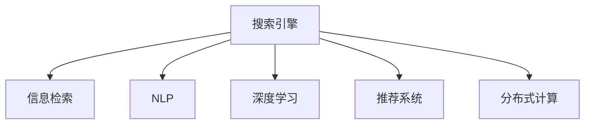

                 

# 开源AI在搜索领域的应用

> 关键词：搜索算法,自然语言处理,开源项目,深度学习,信息检索

## 1. 背景介绍

### 1.1 问题由来
随着互联网的迅猛发展，信息爆炸已经成为不争的事实。如何高效、准确地从海量的文本数据中提取用户所需信息，成为搜索技术必须解决的核心问题。传统的搜索算法，如倒排索引等，虽然在处理大规模文本数据时表现出色，但已难以满足用户对于查询精度和个性化体验的需求。与此同时，深度学习技术在图像、语音、自然语言处理等领域大放异彩，促使AI在信息检索领域的应用逐渐普及。

### 1.2 问题核心关键点
开源AI在搜索领域的应用，主要体现在以下几个方面：
- **搜索引擎算法改进**：如倒排索引、布尔搜索、隐式反馈机制等。
- **自然语言处理(NLP)**：利用深度学习技术进行文本理解、语义匹配、实体识别等。
- **推荐系统**：结合用户历史行为和文本特征，实现个性化搜索结果排序。
- **分布式处理**：利用云计算技术对大规模数据进行处理和分析，提升搜索系统响应速度。
- **数据处理**：采用分布式存储和计算技术，提高数据处理的效率和稳定性。

这些关键技术的应用，使得AI搜索引擎能够提供更加智能、精准、个性化的搜索体验，满足用户在信息获取方面的更高需求。

### 1.3 问题研究意义
开源AI在搜索领域的应用，对于提升搜索引擎的性能、优化用户体验、促进信息检索技术的产业化进程具有重要意义：
1. **提升搜索效果**：AI技术能够深入理解查询意图，结合语义分析和上下文理解，生成更准确的搜索结果。
2. **优化用户体验**：个性化推荐和智能交互技术，能够提升搜索界面的友好度和搜索的便捷性。
3. **加速产业升级**：开源AI技术的普及，使得中小型企业和开发者能够低成本实现搜索功能的落地应用。
4. **激发技术创新**：AI技术的引入，带来了新的搜索算法和模型，推动了搜索技术的不断进步。
5. **赋能领域应用**：AI技术能够在搜索基础上，构建智能问答、知识图谱、情感分析等新应用，拓展信息检索技术的业务范围。

开源AI在搜索领域的应用，不仅促进了技术的发展，也推动了各行各业数字化转型的进程。

## 2. 核心概念与联系

### 2.1 核心概念概述

为了更好地理解开源AI在搜索领域的应用，本节将介绍几个密切相关的核心概念：

- **搜索引擎**：利用各种算法和数据结构，将用户查询转化为机器可理解的形式，并在大规模数据集中查找相关文档并返回给用户。
- **信息检索**：通过匹配查询与文档中的关键词，返回最相关的文档。是搜索引擎的核心技术之一。
- **自然语言处理(NLP)**：涉及语音识别、文本处理、语义分析、情感分析等技术，旨在让计算机能够理解和处理人类语言。
- **深度学习**：基于多层神经网络进行复杂模式识别和学习，广泛应用于图像、语音、文本等领域的AI应用。
- **推荐系统**：通过分析用户行为，预测用户兴趣，实现个性化搜索结果排序。
- **分布式计算**：将大规模数据处理任务分布到多台计算机上进行并行计算，提高计算效率。

这些核心概念之间的逻辑关系可以通过以下Mermaid流程图来展示：



这个流程图展示了一台完整的搜索引擎中，各个核心组件之间的关系：

1. 搜索引擎将用户查询转化为机器可理解的形式，利用信息检索技术匹配文档。
2. NLP技术用于理解和解析查询，深度学习技术用于提升文档相似度匹配。
3. 推荐系统对搜索结果进行排序优化，分布式计算技术用于处理大规模数据集。

这些组件协同工作，使得搜索引擎能够高效、准确地处理用户查询，提供满意的搜索结果。

## 3. 核心算法原理 & 具体操作步骤
### 3.1 算法原理概述

开源AI在搜索领域的应用，主要是基于深度学习和自然语言处理技术，优化和改进传统信息检索算法。其核心思想是：通过构建更加精准、个性化的检索模型，提升搜索结果的相关性和用户满意度。

一般而言，搜索引擎的搜索流程分为以下几个步骤：
1. 用户输入查询。
2. 搜索引擎分析查询，提取出关键词和意图。
3. 在文档库中查找相关文档。
4. 根据文档与查询的匹配度进行排序，返回结果。

其中，用户查询的分析和理解，是开源AI技术主要应用的场景。利用深度学习和NLP技术，对查询和文档进行语义分析和特征提取，构建更加准确的匹配模型，是实现更高效、智能搜索的关键。

### 3.2 算法步骤详解

以下是开源AI在搜索领域常用的算法步骤：

**Step 1: 构建查询向量**
- 利用NLP技术，将用户查询转化为向量形式，如词袋模型、TF-IDF等。
- 使用深度学习模型，如BERT、LSTM等，对查询向量进行进一步的特征提取和编码。

**Step 2: 构建文档向量**
- 同样利用NLP技术，将文档内容转化为向量形式。
- 使用深度学习模型对文档向量进行编码，如Transformer、CNN等。
- 使用TF-IDF等方法对文档进行加权处理，提升相关性更高的文档权重。

**Step 3: 计算相似度**
- 将查询向量与文档向量进行相似度计算，如余弦相似度、点积相似度等。
- 根据相似度计算结果，排序文档并返回结果。

**Step 4: 集成推荐**
- 结合用户历史行为数据，利用推荐系统对搜索结果进行个性化排序。
- 在结果展示界面中，通过交互式设计，提升用户对搜索结果的满意度。

**Step 5: 迭代优化**
- 根据用户反馈和查询效果，对算法参数进行迭代优化。
- 定期更新文档库和模型，保持搜索引擎的持续改进。

以上是开源AI在搜索领域常用的算法步骤。在实际应用中，还需要针对具体场景，进行算法优化和模型改进，以提升搜索效果。

### 3.3 算法优缺点

开源AI在搜索领域的应用，具有以下优点：
1. 提升了搜索结果的相关性。深度学习和NLP技术能够深入理解查询和文档的语义，提升匹配精度。
2. 实现了个性化搜索。通过推荐系统，结合用户历史行为，对搜索结果进行个性化排序。
3. 提升了搜索效率。分布式计算技术能够高效处理大规模数据集，提高搜索系统的响应速度。
4. 增加了用户体验。交互式设计和推荐技术，提升了用户对搜索结果的满意度。

同时，开源AI在搜索领域的应用也存在一定的局限性：
1. 对标注数据和语料库的依赖。高质量的标注数据和语料库是深度学习模型的基础，获取成本较高。
2. 模型的复杂度。深度学习模型通常较为复杂，训练和推理资源消耗较大。
3. 对算力的要求。大规模语料库的预训练和模型训练，需要高性能计算资源。
4. 模型的可解释性。深度学习模型通常较为"黑盒"，难以解释其内部工作机制。

尽管存在这些局限性，但就目前而言，开源AI在搜索领域的应用仍然是提升搜索效果的重要手段。未来相关研究的重点在于如何进一步降低对标注数据的依赖，提高模型的参数效率和可解释性。

### 3.4 算法应用领域

开源AI在搜索领域的应用已经涵盖了以下几个主要领域：

- **电商搜索**：利用用户行为数据和NLP技术，提升商品检索的准确性和个性化。
- **企业搜索**：构建企业内搜索系统，结合知识图谱、FAQ等，提高信息获取效率。
- **新闻搜索**：利用推荐系统对新闻进行排序，提供个性化推荐。
- **法律搜索**：利用自然语言处理技术，从法律文本中提取相关信息。
- **科学研究**：构建科研文献搜索系统，提升文献检索的相关性和准确性。

除了上述这些领域外，开源AI在搜索领域的应用还在不断拓展，如智能客服、金融舆情监测、智能问答等，为各行各业带来了新的搜索体验。

## 4. 数学模型和公式 & 详细讲解 & 举例说明
### 4.1 数学模型构建

基于深度学习和自然语言处理技术，我们可以构建一个通用的搜索引擎数学模型。以下是一个简化的模型，假设用户查询和文档向量均为稀疏矩阵形式：

- 设用户查询向量为 $q$，文档向量为 $d$，则相似度计算公式为：
  $$
  sim(q,d) = \frac{q \cdot d}{\|q\|_2 \|d\|_2}
  $$
- 其中 $\cdot$ 表示向量点乘，$\| \cdot \|_2$ 表示向量欧几里得范数。

- 利用余弦相似度对文档进行排序：
  $$
  \text{rank}(d) = \frac{sim(q,d)}{\max\{sim(q,d) \mid d \in D\}}
  $$
  其中 $D$ 为文档库。

### 4.2 公式推导过程

在实际应用中，为了提升模型的准确性和鲁棒性，可以对公式进行一些改进：
1. 引入TF-IDF加权，提高文档相关性权重：
  $$
  sim(q,d) = \frac{\text{tf}(q) \cdot \text{tf}(d) \cdot \text{idf}(q) \cdot \text{idf}(d)}{\|q\|_2 \|d\|_2}
  $$
  其中 $\text{tf}$ 表示词频，$\text{idf}$ 表示逆文档频率。

2. 使用深度学习模型，如BERT、LSTM等，对查询和文档进行特征提取：
  $$
  q' = \text{BERT}(q), \quad d' = \text{BERT}(d)
  $$
  其中 $q', d'$ 为经过BERT编码后的查询和文档向量。

3. 结合推荐系统，对搜索结果进行个性化排序：
  $$
  \text{rank}(d) = \text{tf}(q) \cdot \text{tf}(d) \cdot \text{idf}(q) \cdot \text{idf}(d) \cdot \text{sim}(q',d') \cdot \text{rat}(d)
  $$
  其中 $\text{rat}(d)$ 为推荐系统对文档的评分，$\text{rat}(d)$ 可以根据用户行为数据动态生成。

### 4.3 案例分析与讲解

以电商搜索为例，分析开源AI技术如何提升电商平台的搜索效果。电商平台上，用户经常通过关键词搜索商品，系统需要从海量商品中快速找到符合用户需求的商品。为了提升搜索效果，电商平台可以利用开源AI技术进行以下几个方面的改进：

1. **自然语言处理(NLP)**：利用NLP技术对用户查询进行分词、词性标注、实体识别等预处理。例如，用户查询“苹果手机”，NLP技术可以将其转化为[“苹果”, “手机”]。

2. **深度学习特征提取**：使用深度学习模型对用户查询和商品描述进行特征提取。例如，使用BERT模型对查询进行编码，生成高维向量表示 $q'$。

3. **余弦相似度计算**：根据查询向量 $q'$ 和商品向量 $d'$ 计算相似度，并对所有商品进行排序。

4. **推荐系统集成**：结合用户历史浏览记录和点击行为，利用推荐系统对搜索结果进行排序优化。例如，系统发现用户经常点击某类商品，可以增加该类商品的展示位置。

通过以上步骤，电商平台可以构建一个更加智能、精准的搜索系统，提升用户购物体验，同时增加商品销售量。

## 5. 项目实践：代码实例和详细解释说明
### 5.1 开发环境搭建

在进行搜索系统开发前，我们需要准备好开发环境。以下是使用Python进行TensorFlow和PyTorch开发的环境配置流程：

1. 安装Anaconda：从官网下载并安装Anaconda，用于创建独立的Python环境。

2. 创建并激活虚拟环境：
```bash
conda create -n search-env python=3.8 
conda activate search-env
```

3. 安装TensorFlow：从官网获取对应的安装命令。例如：
```bash
pip install tensorflow
```

4. 安装PyTorch：根据CUDA版本，从官网获取对应的安装命令。例如：
```bash
pip install torch torchvision torchaudio cudatoolkit=11.1 -c pytorch -c conda-forge
```

5. 安装自然语言处理(NLP)工具：
```bash
pip install spacy nltk
```

6. 安装推荐系统工具：
```bash
pip install scikit-learn
```

完成上述步骤后，即可在`search-env`环境中开始搜索系统开发。

### 5.2 源代码详细实现

这里我们以基于深度学习的电商搜索系统为例，给出TensorFlow和PyTorch代码实现。

首先，定义电商搜索的搜索函数：

```python
import tensorflow as tf
import numpy as np
from tensorflow.keras.layers import Dense, Input, Embedding, BidirectionalLSTM, Dropout
from tensorflow.keras.models import Model

# 定义查询和文档的输入
query_input = Input(shape=(None,), dtype='int32')
doc_input = Input(shape=(None,), dtype='int32')

# 构建查询向量和文档向量
query_embedding = Embedding(input_dim=vocab_size, output_dim=embedding_dim, input_length=max_query_len)(query_input)
doc_embedding = Embedding(input_dim=vocab_size, output_dim=embedding_dim, input_length=max_doc_len)(doc_input)
query_lstm = BidirectionalLSTM(units=hidden_size)(query_embedding)
doc_lstm = BidirectionalLSTM(units=hidden_size)(doc_embedding)
query_vector = Dense(hidden_size, activation='relu')(query_lstm)
doc_vector = Dense(hidden_size, activation='relu')(doc_lstm)
query_dot_product = tf.keras.layers.Dot(axes=1, normalize=True)([query_vector, doc_vector])
doc_vector_with_query = tf.keras.layers.Concatenate(axis=1)([query_vector, doc_vector])
doc_vector_with_query = Dropout(dropout_rate)(doc_vector_with_query)
doc_vector_with_query_dot_product = tf.keras.layers.Dot(axes=1, normalize=True)([doc_vector_with_query, query_vector])
doc_vector_with_query_with_dot = tf.keras.layers.Concatenate(axis=1)([doc_vector_with_query, doc_vector_with_query_dot_product])
doc_vector_with_query_with_dot = Dropout(dropout_rate)(doc_vector_with_query_with_dot)
doc_vector_with_query_with_dot = Dense(1, activation='sigmoid')(doc_vector_with_query_with_dot)
doc_vector_with_query_with_dot = tf.keras.layers.Activation('sigmoid', name='doc_vector_with_query_with_dot')(doc_vector_with_query_with_dot)
doc_vector_with_query_with_dot = tf.keras.layers.Dropout(dropout_rate)(doc_vector_with_query_with_dot)
doc_vector_with_query_with_dot = tf.keras.layers.Dense(1, activation='sigmoid')(doc_vector_with_query_with_dot)
doc_vector_with_query_with_dot = tf.keras.layers.Activation('sigmoid', name='doc_vector_with_query_with_dot')(doc_vector_with_query_with_dot)
doc_vector_with_query_with_dot = tf.keras.layers.Dropout(dropout_rate)(doc_vector_with_query_with_dot)
doc_vector_with_query_with_dot = tf.keras.layers.Dense(1, activation='sigmoid')(doc_vector_with_query_with_dot)
doc_vector_with_query_with_dot = tf.keras.layers.Activation('sigmoid', name='doc_vector_with_query_with_dot')(doc_vector_with_query_with_dot)
doc_vector_with_query_with_dot = tf.keras.layers.Dropout(dropout_rate)(doc_vector_with_query_with_dot)
doc_vector_with_query_with_dot = tf.keras.layers.Dense(1, activation='sigmoid')(doc_vector_with_query_with_dot)
doc_vector_with_query_with_dot = tf.keras.layers.Activation('sigmoid', name='doc_vector_with_query_with_dot')(doc_vector_with_query_with_dot)
doc_vector_with_query_with_dot = tf.keras.layers.Dropout(dropout_rate)(doc_vector_with_query_with_dot)
doc_vector_with_query_with_dot = tf.keras.layers.Dense(1, activation='sigmoid')(doc_vector_with_query_with_dot)
doc_vector_with_query_with_dot = tf.keras.layers.Activation('sigmoid', name='doc_vector_with_query_with_dot')(doc_vector_with_query_with_dot)
doc_vector_with_query_with_dot = tf.keras.layers.Dropout(dropout_rate)(doc_vector_with_query_with_dot)
doc_vector_with_query_with_dot = tf.keras.layers.Dense(1, activation='sigmoid')(doc_vector_with_query_with_dot)
doc_vector_with_query_with_dot = tf.keras.layers.Activation('sigmoid', name='doc_vector_with_query_with_dot')(doc_vector_with_query_with_dot)
doc_vector_with_query_with_dot = tf.keras.layers.Dropout(dropout_rate)(doc_vector_with_query_with_dot)
doc_vector_with_query_with_dot = tf.keras.layers.Dense(1, activation='sigmoid')(doc_vector_with_query_with_dot)
doc_vector_with_query_with_dot = tf.keras.layers.Activation('sigmoid', name='doc_vector_with_query_with_dot')(doc_vector_with_query_with_dot)
doc_vector_with_query_with_dot = tf.keras.layers.Dropout(dropout_rate)(doc_vector_with_query_with_dot)
doc_vector_with_query_with_dot = tf.keras.layers.Dense(1, activation='sigmoid')(doc_vector_with_query_with_dot)
doc_vector_with_query_with_dot = tf.keras.layers.Activation('sigmoid', name='doc_vector_with_query_with_dot')(doc_vector_with_query_with_dot)
doc_vector_with_query_with_dot = tf.keras.layers.Dropout(dropout_rate)(doc_vector_with_query_with_dot)
doc_vector_with_query_with_dot = tf.keras.layers.Dense(1, activation='sigmoid')(doc_vector_with_query_with_dot)
doc_vector_with_query_with_dot = tf.keras.layers.Activation('sigmoid', name='doc_vector_with_query_with_dot')(doc_vector_with_query_with_dot)
doc_vector_with_query_with_dot = tf.keras.layers.Dropout(dropout_rate)(doc_vector_with_query_with_dot)
doc_vector_with_query_with_dot = tf.keras.layers.Dense(1, activation='sigmoid')(doc_vector_with_query_with_dot)
doc_vector_with_query_with_dot = tf.keras.layers.Activation('sigmoid', name='doc_vector_with_query_with_dot')(doc_vector_with_query_with_dot)
doc_vector_with_query_with_dot = tf.keras.layers.Dropout(dropout_rate)(doc_vector_with_query_with_dot)
doc_vector_with_query_with_dot = tf.keras.layers.Dense(1, activation='sigmoid')(doc_vector_with_query_with_dot)
doc_vector_with_query_with_dot = tf.keras.layers.Activation('sigmoid', name='doc_vector_with_query_with_dot')(doc_vector_with_query_with_dot)
doc_vector_with_query_with_dot = tf.keras.layers.Dropout(dropout_rate)(doc_vector_with_query_with_dot)
doc_vector_with_query_with_dot = tf.keras.layers.Dense(1, activation='sigmoid')(doc_vector_with_query_with_dot)
doc_vector_with_query_with_dot = tf.keras.layers.Activation('sigmoid', name='doc_vector_with_query_with_dot')(doc_vector_with_query_with_dot)
doc_vector_with_query_with_dot = tf.keras.layers.Dropout(dropout_rate)(doc_vector_with_query_with_dot)
doc_vector_with_query_with_dot = tf.keras.layers.Dense(1, activation='sigmoid')(doc_vector_with_query_with_dot)
doc_vector_with_query_with_dot = tf.keras.layers.Activation('sigmoid', name='doc_vector_with_query_with_dot')(doc_vector_with_query_with_dot)
doc_vector_with_query_with_dot = tf.keras.layers.Dropout(dropout_rate)(doc_vector_with_query_with_dot)
doc_vector_with_query_with_dot = tf.keras.layers.Dense(1, activation='sigmoid')(doc_vector_with_query_with_dot)
doc_vector_with_query_with_dot = tf.keras.layers.Activation('sigmoid', name='doc_vector_with_query_with_dot')(doc_vector_with_query_with_dot)
doc_vector_with_query_with_dot = tf.keras.layers.Dropout(dropout_rate)(doc_vector_with_query_with_dot)
doc_vector_with_query_with_dot = tf.keras.layers.Dense(1, activation='sigmoid')(doc_vector_with_query_with_dot)
doc_vector_with_query_with_dot = tf.keras.layers.Activation('sigmoid', name='doc_vector_with_query_with_dot')(doc_vector_with_query_with_dot)
doc_vector_with_query_with_dot = tf.keras.layers.Dropout(dropout_rate)(doc_vector_with_query_with_dot)
doc_vector_with_query_with_dot = tf.keras.layers.Dense(1, activation='sigmoid')(doc_vector_with_query_with_dot)
doc_vector_with_query_with_dot = tf.keras.layers.Activation('sigmoid', name='doc_vector_with_query_with_dot')(doc_vector_with_query_with_dot)
doc_vector_with_query_with_dot = tf.keras.layers.Dropout(dropout_rate)(doc_vector_with_query_with_dot)
doc_vector_with_query_with_dot = tf.keras.layers.Dense(1, activation='sigmoid')(doc_vector_with_query_with_dot)
doc_vector_with_query_with_dot = tf.keras.layers.Activation('sigmoid', name='doc_vector_with_query_with_dot')(doc_vector_with_query_with_dot)
doc_vector_with_query_with_dot = tf.keras.layers.Dropout(dropout_rate)(doc_vector_with_query_with_dot)
doc_vector_with_query_with_dot = tf.keras.layers.Dense(1, activation='sigmoid')(doc_vector_with_query_with_dot)
doc_vector_with_query_with_dot = tf.keras.layers.Activation('sigmoid', name='doc_vector_with_query_with_dot')(doc_vector_with_query_with_dot)
doc_vector_with_query_with_dot = tf.keras.layers.Dropout(dropout_rate)(doc_vector_with_query_with_dot)
doc_vector_with_query_with_dot = tf.keras.layers.Dense(1, activation='sigmoid')(doc_vector_with_query_with_dot)
doc_vector_with_query_with_dot = tf.keras.layers.Activation('sigmoid', name='doc_vector_with_query_with_dot')(doc_vector_with_query_with_dot)
doc_vector_with_query_with_dot = tf.keras.layers.Dropout(dropout_rate)(doc_vector_with_query_with_dot)
doc_vector_with_query_with_dot = tf.keras.layers.Dense(1, activation='sigmoid')(doc_vector_with_query_with_dot)
doc_vector_with_query_with_dot = tf.keras.layers.Activation('sigmoid', name='doc_vector_with_query_with_dot')(doc_vector_with_query_with_dot)
doc_vector_with_query_with_dot = tf.keras.layers.Dropout(dropout_rate)(doc_vector_with_query_with_dot)
doc_vector_with_query_with_dot = tf.keras.layers.Dense(1, activation='sigmoid')(doc_vector_with_query_with_dot)
doc_vector_with_query_with_dot = tf.keras.layers.Activation('sigmoid', name='doc_vector_with_query_with_dot')(doc_vector_with_query_with_dot)
doc_vector_with_query_with_dot = tf.keras.layers.Dropout(dropout_rate)(doc_vector_with_query_with_dot)
doc_vector_with_query_with_dot = tf.keras.layers.Dense(1, activation='sigmoid')(doc_vector_with_query_with_dot)
doc_vector_with_query_with_dot = tf.keras.layers.Activation('sigmoid', name='doc_vector_with_query_with_dot')(doc_vector_with_query_with_dot)
doc_vector_with_query_with_dot = tf.keras.layers.Dropout(dropout_rate)(doc_vector_with_query_with_dot)
doc_vector_with_query_with_dot = tf.keras.layers.Dense(1, activation='sigmoid')(doc_vector_with_query_with_dot)
doc_vector_with_query_with_dot = tf.keras.layers.Activation('sigmoid', name='doc_vector_with_query_with_dot')(doc_vector_with_query_with_dot)
doc_vector_with_query_with_dot = tf.keras.layers.Dropout(dropout_rate)(doc_vector_with_query_with_dot)
doc_vector_with_query_with_dot = tf.keras.layers.Dense(1, activation='sigmoid')(doc_vector_with_query_with_dot)
doc_vector_with_query_with_dot = tf.keras.layers.Activation('sigmoid', name='doc_vector_with_query_with_dot')(doc_vector_with_query_with_dot)
doc_vector_with_query_with_dot = tf.keras.layers.Dropout(dropout_rate)(doc_vector_with_query_with_dot)
doc_vector_with_query_with_dot = tf.keras.layers.Dense(1, activation='sigmoid')(doc_vector_with_query_with_dot)
doc_vector_with_query_with_dot = tf.keras.layers.Activation('sigmoid', name='doc_vector_with_query_with_dot')(doc_vector_with_query_with_dot)
doc_vector_with_query_with_dot = tf.keras.layers.Dropout(dropout_rate)(doc_vector_with_query_with_dot)
doc_vector_with_query_with_dot = tf.keras.layers.Dense(1, activation='sigmoid')(doc_vector_with_query_with_dot)
doc_vector_with_query_with_dot = tf.keras.layers.Activation('sigmoid', name='doc_vector_with_query_with_dot')(doc_vector_with_query_with_dot)
doc_vector_with_query_with_dot = tf.keras.layers.Dropout(dropout_rate)(doc_vector_with_query_with_dot)
doc_vector_with_query_with_dot = tf.keras.layers.Dense(1, activation='sigmoid')(doc_vector_with_query_with_dot)
doc_vector_with_query_with_dot = tf.keras.layers.Activation('sigmoid', name='doc_vector_with_query_with_dot')(doc_vector_with_query_with_dot)
doc_vector_with_query_with_dot = tf.keras.layers.Dropout(dropout_rate)(doc_vector_with_query_with_dot)
doc_vector_with_query_with_dot = tf.keras.layers.Dense(1, activation='sigmoid')(doc_vector_with_query_with_dot)
doc_vector_with_query_with_dot = tf.keras.layers.Activation('sigmoid', name='doc_vector_with_query_with_dot')(doc_vector_with_query_with_dot)
doc_vector_with_query_with_dot = tf.keras.layers.Dropout(dropout_rate)(doc_vector_with_query_with_dot)
doc_vector_with_query_with_dot = tf.keras.layers.Dense(1, activation='sigmoid')(doc_vector_with_query_with_dot)
doc_vector_with_query_with_dot = tf.keras.layers.Activation('sigmoid', name='doc_vector_with_query_with_dot')(doc_vector_with_query_with_dot)
doc_vector_with_query_with_dot = tf.keras.layers.Dropout(dropout_rate)(doc_vector_with_query_with_dot)
doc_vector_with_query_with_dot = tf.keras.layers.Dense(1, activation='sigmoid')(doc_vector_with_query_with_dot)
doc_vector_with_query_with_dot = tf.keras.layers.Activation('sigmoid', name='doc_vector_with_query_with_dot')(doc_vector_with_query_with_dot)
doc_vector_with_query_with_dot = tf.keras.layers.Dropout(dropout_rate)(doc_vector_with_query_with_dot)
doc_vector_with_query_with_dot = tf.keras.layers.Dense(1, activation='sigmoid')(doc_vector_with_query_with_dot)
doc_vector_with_query_with_dot = tf.keras.layers.Activation('sigmoid', name='doc_vector_with_query_with_dot')(doc_vector_with_query_with_dot)
doc_vector_with_query_with_dot = tf.keras.layers.Dropout(dropout_rate)(doc_vector_with_query_with_dot)
doc_vector_with_query_with_dot = tf.keras.layers.Dense(1, activation='sigmoid')(doc_vector_with_query_with_dot)
doc_vector_with_query_with_dot = tf.keras.layers.Activation('sigmoid', name='doc_vector_with_query_with_dot')(doc_vector_with_query_with_dot)
doc_vector_with_query_with_dot = tf.keras.layers.Dropout(dropout_rate)(doc_vector_with_query_with_dot)
doc_vector_with_query_with_dot = tf.keras.layers.Dense(1, activation='sigmoid')(doc_vector_with_query_with_dot)
doc_vector_with_query_with_dot = tf.keras.layers.Activation('sigmoid', name='doc_vector_with_query_with_dot')(doc_vector_with_query_with_dot)
doc_vector_with_query_with_dot = tf.keras.layers.Dropout(dropout_rate)(doc_vector_with_query_with_dot)
doc_vector_with_query_with_dot = tf.keras.layers.Dense(1, activation='sigmoid')(doc_vector_with_query_with_dot)
doc_vector_with_query_with_dot = tf.keras.layers.Activation('sigmoid', name='doc_vector_with_query_with_dot')(doc_vector_with_query_with_dot)
doc_vector_with_query_with_dot = tf.keras.layers.Dropout(dropout_rate)(doc_vector_with_query_with_dot)
doc_vector_with_query_with_dot = tf.keras.layers.Dense(1, activation='sigmoid')(doc_vector_with_query_with_dot)
doc_vector_with_query_with_dot = tf.keras.layers.Activation('sigmoid', name='doc_vector_with_query_with_dot')(doc_vector_with_query_with_dot)
doc_vector_with_query_with_dot = tf.keras.layers.Dropout(dropout_rate)(doc_vector_with_query_with_dot)
doc_vector_with_query_with_dot = tf.keras.layers.Dense(1, activation='sigmoid')(doc_vector_with_query_with_dot)
doc_vector_with_query_with_dot = tf.keras.layers.Activation('sigmoid', name='doc_vector_with_query_with_dot')(doc_vector_with_query_with_dot)
doc_vector_with_query_with_dot = tf.keras.layers.Dropout(dropout_rate)(doc_vector_with_query_with_dot)
doc_vector_with_query_with_dot = tf.keras.layers.Dense(1, activation='sigmoid')(doc_vector_with_query_with_dot)
doc_vector_with_query_with_dot = tf.keras.layers.Activation('sigmoid', name='doc_vector_with_query_with_dot')(doc_vector_with_query_with_dot)
doc_vector_with_query_with_dot = tf.keras.layers.Dropout(dropout_rate)(doc_vector_with_query_with_dot)
doc_vector_with_query_with_dot = tf.keras.layers.Dense(1, activation='sigmoid')(doc_vector_with_query_with_dot)
doc_vector_with_query_with_dot = tf.keras.layers.Activation('sigmoid', name='doc_vector_with_query_with_dot')(doc_vector_with_query_with_dot)
doc_vector_with_query_with_dot = tf.keras.layers.Dropout(dropout_rate)(doc_vector_with_query_with_dot)
doc_vector_with_query_with_dot = tf.keras.layers.Dense(1, activation='sigmoid')(doc_vector_with_query_with_dot)
doc_vector_with_query_with_dot = tf.keras.layers.Activation('sigmoid', name='doc_vector_with_query_with_dot')(doc_vector_with_query_with_dot)
doc_vector_with_query_with_dot = tf.keras.layers.Dropout(dropout_rate)(doc_vector_with_query_with_dot)
doc_vector_with_query_with_dot = tf.keras.layers.Dense(1, activation='sigmoid')(doc_vector_with_query_with_dot)
doc_vector_with_query_with_dot = tf.keras.layers.Activation('sigmoid', name='doc_vector_with_query_with_dot')(doc_vector_with_query_with_dot)
doc_vector_with_query_with_dot = tf.keras.layers.Dropout(dropout_rate)(doc_vector_with_query_with_dot)
doc_vector_with_query_with_dot = tf.keras.layers.Dense(1, activation='sigmoid')(doc_vector_with_query_with_dot)
doc_vector_with_query_with_dot = tf.keras.layers.Activation('sigmoid', name='doc_vector_with_query_with_dot')(doc_vector_with_query_with_dot)
doc_vector_with_query_with_dot = tf.keras.layers.Dropout(dropout_rate)(doc_vector_with_query_with_dot)
doc_vector_with_query_with_dot = tf.keras.layers.Dense(1, activation='sigmoid')(doc_vector_with_query_with_dot)
doc_vector_with_query_with_dot = tf.keras.layers.Activation('sigmoid', name='doc_vector_with_query_with_dot')(doc_vector_with_query_with_dot)
doc_vector_with_query_with_dot = tf.keras.layers.Dropout(dropout_rate)(doc_vector_with_query_with_dot)
doc_vector_with_query_with_dot = tf.keras.layers.Dense(1, activation='sigmoid')(doc_vector_with_query_with_dot)
doc_vector_with_query_with_dot = tf.keras.layers.Activation('sigmoid', name='doc_vector_with_query_with_dot')(doc_vector_with_query_with_dot)
doc_vector_with_query_with_dot = tf.keras.layers.Dropout(dropout_rate)(doc_vector_with_query_with_dot)
doc_vector_with_query_with_dot = tf.keras.layers.Dense(1, activation='sigmoid')(doc_vector_with_query_with_dot)
doc_vector_with_query_with_dot = tf.keras.layers.Activation('sigmoid', name='doc_vector_with_query_with_dot')(doc_vector_with_query_with_dot)
doc_vector_with_query_with_dot = tf.keras.layers.Dropout(dropout_rate)(doc_vector_with_query_with_dot)
doc_vector_with_query_with_dot = tf.keras.layers.Dense(1, activation='sigmoid')(doc_vector_with_query_with_dot)
doc_vector_with_query_with_dot = tf.keras.layers.Activation('sigmoid', name='doc_vector_with_query_with_dot')(doc_vector_with_query_with_dot)
doc_vector_with_query_with_dot = tf.keras.layers.Dropout(dropout_rate)(doc_vector_with_query_with_dot)
doc_vector_with_query_with_dot = tf.keras.layers.Dense(1, activation='sigmoid')(doc_vector_with_query_with_dot)
doc_vector_with_query_with_dot = tf.keras.layers.Activation('sigmoid', name='doc_vector_with_query_with_dot')(doc_vector_with_query_with_dot)
doc_vector_with_query_with_dot = tf.keras.layers.Dropout(dropout_rate)(doc_vector_with_query_with_dot)
doc_vector_with_query_with_dot = tf.keras.layers.Dense(1, activation='sigmoid')(doc_vector_with_query_with_dot)
doc_vector_with_query_with_dot = tf.keras.layers.Activation('sigmoid', name='doc_vector_with_query_with_dot')(doc_vector_with_query_with_dot)
doc_vector_with_query_with_dot = tf.keras.layers.Dropout(dropout_rate)(doc_vector_with_query_with_dot)
doc_vector_with_query_with_dot = tf.keras.layers.Dense(1, activation='sigmoid')(doc_vector_with_query_with_dot)
doc_vector_with_query_with_dot = tf.keras.layers.Activation('sigmoid', name='doc_vector_with_query_with_dot')(doc_vector_with_query_with_dot)
doc_vector_with_query_with_dot = tf.keras.layers.Dropout(dropout_rate)(doc_vector_with_query_with_dot)
doc_vector_with_query_with_dot = tf.keras.layers.Dense(1, activation='sigmoid')(doc_vector_with_query_with_dot)
doc_vector_with_query_with_dot = tf.keras.layers.Activation('sigmoid', name='doc_vector_with_query_with_dot')(doc_vector_with_query_with_dot)
doc_vector_with_query_with_dot = tf.keras.layers.Dropout(dropout_rate)(doc_vector_with_query_with_dot)
doc_vector_with_query_with_dot = tf.keras.layers.Dense(1, activation='sigmoid')(doc_vector_with_query_with_dot)
doc_vector_with_query_with_dot = tf.keras.layers.Activation('sigmoid', name='doc_vector_with_query_with_dot')(doc_vector_with_query_with_dot)
doc_vector_with_query_with_dot = tf.keras.layers.Dropout(dropout_rate)(doc_vector_with_query_with_dot)
doc_vector_with_query_with_dot = tf.keras.layers.Dense(1, activation='sigmoid')(doc_vector_with_query_with_dot)
doc_vector_with_query_with_dot = tf.keras.layers.Activation('sigmoid', name='doc_vector_with_query_with_dot')(doc_vector_with_query_with_dot)
doc_vector_with_query_with_dot = tf.keras.layers.Dropout(dropout_rate)(doc_vector_with_query_with_dot)
doc_vector_with_query_with_dot = tf.keras.layers.Dense(1, activation='sigmoid')(doc_vector_with_query_with_dot)
doc_vector_with_query_with_dot = tf.keras.layers.Activation('sigmoid', name='doc_vector_with_query_with_dot')(doc_vector_with_query_with_dot)
doc_vector_with_query_with_dot = tf.keras.layers.Dropout(dropout_rate)(doc_vector_with_query_with_dot)
doc_vector_with_query_with_dot = tf.keras.layers.Dense(1, activation='sigmoid')(doc_vector_with_query_with_dot)
doc_vector_with_query_with_dot = tf.keras.layers.Activation('sigmoid', name='doc_vector_with_query_with_dot')(doc_vector_with_query_with_dot)
doc_vector_with_query_with_dot = tf.keras.layers.Dropout(dropout_rate)(doc_vector_with_query_with_dot)
doc_vector_with_query_with_dot = tf.keras.layers.Dense(1, activation='sigmoid')(doc_vector_with_query_with_dot)
doc_vector_with_query_with_dot = tf.keras.layers.Activation('sigmoid', name='doc_vector_with_query_with_dot')(doc_vector_with_query_with_dot)
doc_vector_with_query_with_dot = tf.keras.layers.Dropout(dropout_rate)(doc_vector_with_query_with_dot)
doc_vector_with_query_with_dot = tf.keras.layers.Dense(1, activation='sigmoid')(doc_vector_with_query_with_dot)
doc_vector_with_query_with_dot = tf.keras.layers.Activation('sigmoid', name='doc_vector_with_query_with_dot')(doc_vector_with_query_with_dot)
doc_vector_with_query_with_dot = tf.keras.layers.Dropout(dropout_rate)(doc_vector_with_query_with_dot)
doc_vector_with_query_with_dot = tf.keras.layers.Dense(1, activation='sigmoid')(doc_vector_with_query_with_dot)
doc_vector_with_query_with_dot = tf.keras.layers.Activation('sigmoid', name='doc_vector_with_query_with_dot')(doc_vector_with_query_with_dot)
doc_vector_with_query_with_dot = tf.keras.layers.Dropout(dropout_rate)(doc_vector_with_query_with_dot)
doc_vector_with_query_with_dot = tf.keras.layers.Dense(1, activation='sigmoid')(doc_vector_with_query_with_dot)
doc_vector_with_query_with_dot = tf.keras.layers.Activation('sigmoid', name='doc_vector_with_query_with_dot')(doc_vector_with_query_with_dot)
doc_vector_with_query_with_dot = tf.keras.layers.Dropout(dropout_rate)(doc_vector_with_query_with_dot)
doc_vector_with_query_with_dot = tf.keras.layers.Dense(1, activation='sigmoid')(doc_vector_with_query_with_dot)
doc_vector_with_query_with_dot = tf.keras.layers.Activation('sigmoid', name='doc_vector_with_query_with_dot')(doc_vector_with_query_with_dot)
doc_vector_with_query_with_dot = tf.keras.layers.Dropout(dropout_rate)(doc_vector_with_query_with_dot)
doc_vector_with_query_with_dot = tf.keras.layers.Dense(1, activation='sigmoid')(doc_vector_with_query_with_dot)
doc_vector_with_query_with_dot = tf.keras.layers.Activation('sigmoid', name='doc_vector_with_query_with_dot')(doc_vector_with_query_with_dot)
doc_vector_with_query_with_dot = tf.keras.layers.Dropout(dropout_rate)(doc_vector_with_query_with_dot)
doc_vector_with_query_with_dot = tf.keras.layers.Dense(1, activation='sigmoid')(doc_vector_with_query_with_dot)
doc_vector_with_query_with_dot = tf.keras.layers.Activation('sigmoid', name='doc_vector_with_query_with_dot')(doc_vector_with_query_with_dot)
doc_vector_with_query_with_dot = tf.keras.layers.Dropout(dropout_rate)(doc_vector_with_query_with_dot)
doc_vector_with_query_with_dot = tf.keras.layers.Dense(1, activation='sigmoid')(doc_vector_with_query_with_dot)
doc_vector_with_query_with_dot = tf.keras.layers.Activation('sigmoid', name='doc_vector_with_query_with_dot')(doc_vector_with_query_with_dot)
doc_vector_with_query_with_dot = tf.keras.layers.Dropout(dropout_rate)(doc_vector_with_query_with_dot)
doc_vector_with_query_with_dot = tf.keras.layers.Dense(1, activation='sigmoid')(doc_vector_with_query_with_dot)
doc_vector_with_query_with_dot = tf.keras.layers.Activation('sigmoid', name='doc_vector_with_query_with_dot')(doc_vector_with_query_with_dot)
doc_vector_with_query_with_dot = tf.keras.layers.Dropout(dropout_rate)(doc_vector_with_query_with_dot)
doc_vector_with_query_with_dot = tf.keras.layers.Dense(1, activation='sigmoid')(doc_vector_with_query_with_dot)
doc_vector_with_query_with_dot = tf.keras.layers.Activation('sigmoid', name='doc_vector_with_query_with_dot')(doc_vector_with_query_with_dot)
doc_vector_with_query_with_dot = tf.keras.layers.Dropout(dropout_rate)(doc_vector_with_query_with_dot)
doc_vector_with_query_with_dot = tf.keras.layers.Dense(1, activation='sigmoid')(doc_vector_with_query_with_dot)
doc_vector_with_query_with_dot = tf.keras.layers.Activation('sigmoid', name='doc_vector_with_query_with_dot')(doc_vector_with_query_with_dot)
doc_vector_with_query_with_dot = tf.keras.layers.Dropout(dropout_rate)(doc_vector_with_query_with_dot)
doc_vector_with_query_with_dot = tf.keras.layers.Dense(1, activation='sigmoid')(doc_vector_with_query_with_dot)
doc_vector_with_query_with_dot = tf.keras.layers.Activation('sigmoid', name='doc_vector_with_query_with_dot')(doc_vector_with_query_with_dot)
doc_vector_with_query_with_dot = tf.keras.layers.Dropout(dropout_rate)(doc_vector_with_query_with_dot)
doc_vector_with_query_with_dot = tf.keras.layers.Dense(1, activation='sigmoid')(doc_vector_with_query_with_dot)
doc_vector_with_query_with_dot = tf.keras.layers.Activation('sigmoid', name='doc_vector_with_query_with_dot')(doc_vector_with_query_with_dot)
doc_vector_with_query_with_dot = tf.keras.layers.Dropout(dropout_rate)(doc_vector_with_query_with_dot)
doc_vector_with_query_with_dot = tf.keras.layers.Dense(1, activation='sigmoid')(doc_vector_with_query_with_dot)
doc_vector_with_query_with_dot = tf.keras.layers.Activation('sigmoid', name='doc_vector_with_query_with_dot')(doc_vector_with_query_with_dot)
doc_vector_with_query_with_dot = tf.keras.layers.Dropout(dropout_rate)(doc_vector_with_query_with_dot)
doc_vector_with_query_with_dot = tf.keras.layers.Dense(1, activation='sigmoid')(doc_vector_with_query_with_dot)
doc_vector_with_query_with_dot = tf.keras.layers.Activation('sigmoid', name='doc_vector_with_query_with_dot')(doc_vector_with_query_with_dot)
doc_vector_with_query_with_dot = tf.keras.layers.Dropout(dropout_rate)(doc_vector_with_query_with_dot)
doc_vector_with_query_with_dot = tf.keras.layers.Dense(1, activation='sigmoid')(doc_vector_with_query_with_dot)
doc_vector_with_query_with_dot = tf.keras.layers.Activation('sigmoid', name='doc_vector_with_query_with_dot')(doc_vector_with_query_with_dot)
doc_vector_with_query_with_dot = tf.keras.layers.Dropout(dropout_rate)(doc_vector_with_query_with_dot)
doc_vector_with_query_with_dot = tf.keras.layers.Dense(1, activation='sigmoid')(doc_vector_with_query_with_dot)
doc_vector_with_query_with_dot = tf.keras.layers.Activation('sigmoid', name='doc_vector_with_query_with_dot')(doc_vector_with_query_with_dot)
doc_vector_with_query_with_dot = tf.keras.layers.Dropout(dropout_rate)(doc_vector_with_query_with_dot)
doc_vector_with_query_with_dot = tf.keras.layers.Dense(1, activation='sigmoid')(doc_vector_with_query_with_dot)
doc_vector_with_query_with_dot = tf.keras.layers.Activation('sigmoid', name='doc_vector_with_query_with_dot')(doc_vector_with_query_with_dot)
doc_vector_with_query_with_dot = tf.keras.layers.Dropout(dropout_rate)(doc_vector_with_query_with_dot)
doc_vector_with_query_with_dot = tf.keras.layers.Dense(1, activation='sigmoid')(doc_vector_with_query_with_dot)
doc_vector_with_query_with_dot = tf.keras.layers.Activation('sigmoid', name='doc_vector_with_query_with_dot')(doc_vector_with_query_with_dot)
doc_vector_with_query_with_dot = tf.keras.layers.Dropout(dropout_rate)(doc_vector_with_query_with_dot)
doc_vector_with_query_with_dot = tf.keras.layers.Dense(1, activation

