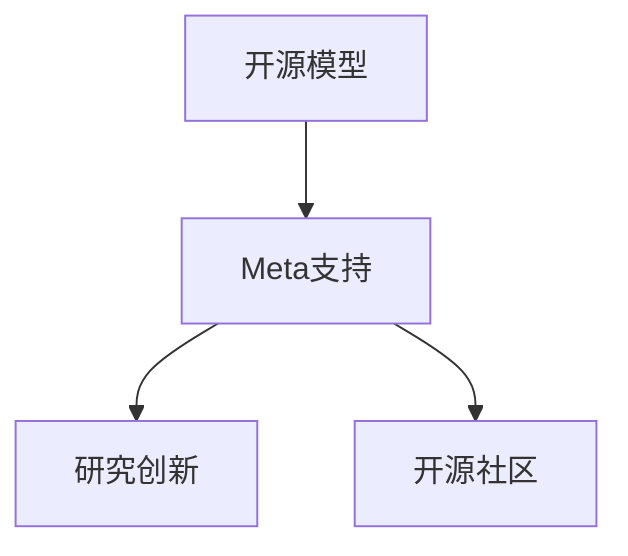
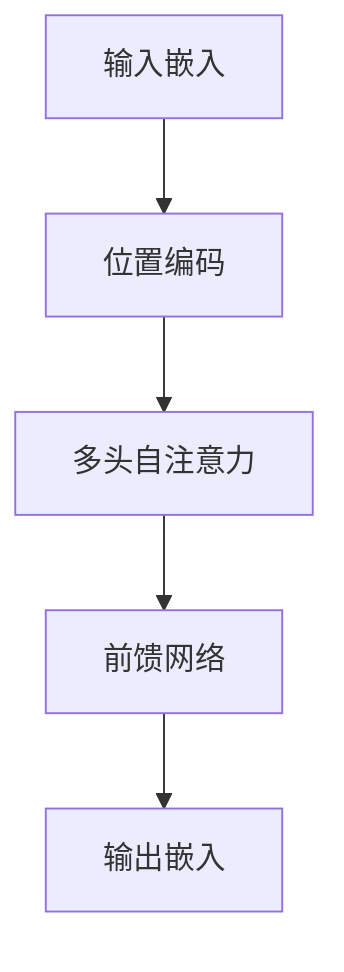

                 

# 开源模型的优势：促进研究创新，开源社区受益于Meta的支持

## 1. 背景介绍

近年来，开源模型成为人工智能领域的研究热点，特别是开源模型Meta对其的支持，显著提升了研究创新和开源社区的活力。本文将从开源模型的优势入手，深入分析Meta对开源模型的支持，探讨其在研究创新和开源社区方面的影响，并提供实际案例以供参考。

## 2. 核心概念与联系

### 2.1 核心概念概述

开源模型通常指的是经过开源许可发布、允许任何人自由使用、修改和分发的模型，其目的是促进技术进步和知识共享。Meta作为领先的人工智能公司，通过其开源战略，为开源社区提供了强大的支持，推动了人工智能领域的研究创新。

核心概念包括：

- **开源模型**：经过开源许可的模型，允许自由使用和修改。
- **Meta支持**：Meta提供的技术、资金和社区资源支持。
- **研究创新**：基于开源模型的研究，推动技术进步。
- **开源社区**：由开发者、研究者组成的社区，共同开发和分享开源模型。

这些核心概念之间的联系可以通过以下Mermaid流程图来展示：



该流程图展示了开源模型、Meta支持和研究创新、开源社区之间的关系：Meta通过提供支持，促进开源模型的创新和社区的发展。

## 3. 核心算法原理 & 具体操作步骤

### 3.1 算法原理概述

开源模型的优势主要体现在其开放性、灵活性和社区驱动上。这些优势为研究创新和社区发展提供了坚实基础，同时，Meta的支持进一步推动了这些优势的发挥。

1. **开放性**：开源模型的代码和模型完全公开，任何人均可自由使用、修改和分发。这种开放性促进了知识的共享和技术的迭代。
2. **灵活性**：开源模型允许开发者根据自己的需求进行调整和优化，从而快速响应新的应用场景和技术需求。
3. **社区驱动**：开源模型由社区成员共同维护和开发，其发展和改进依赖于社区的贡献和反馈。

Meta通过其开源战略，为开源模型提供了持续的技术支持、资金投入和社区资源，进一步推动了这些优势的发挥。

### 3.2 算法步骤详解

开源模型的使用和开发通常包括以下步骤：

1. **获取和安装**：从开源平台或镜像网站获取模型，并按照官方文档进行安装。
2. **数据准备**：准备模型所需的数据集，并进行必要的预处理。
3. **模型训练**：使用模型训练框架进行模型的训练和微调。
4. **评估和优化**：在验证集或测试集上评估模型性能，并根据结果进行优化。
5. **应用部署**：将模型集成到应用系统中，进行实际部署和测试。

### 3.3 算法优缺点

**优点**：

- **降低成本**：开源模型的免费使用和分发降低了研究者和企业的成本。
- **促进创新**：开源模型的开放性和社区驱动促进了技术创新和知识共享。
- **灵活性**：开源模型允许开发者根据自己的需求进行优化和定制。

**缺点**：

- **质量参差不齐**：由于开源模型的质量参差不齐，可能存在不稳定的版本和未经充分测试的功能。
- **依赖开源社区**：开源模型的成功依赖于社区的持续贡献和维护。

### 3.4 算法应用领域

开源模型已经在多个领域得到了广泛应用，包括：

- **计算机视觉**：如OpenCV、TensorFlow等。
- **自然语言处理**：如BERT、GPT等。
- **语音识别**：如Mojito、Kaldi等。
- **推荐系统**：如TensorFlow Recommenders、PRIVATE等。

## 4. 数学模型和公式 & 详细讲解 & 举例说明

### 4.1 数学模型构建

在自然语言处理（NLP）领域，开源模型通常使用Transformer架构。以下是一个简单的Transformer模型架构的示意图：



其中，输入嵌入层将输入序列转换为向量表示，位置编码层添加位置信息，多头自注意力层和前馈网络层进行特征提取和融合，输出嵌入层将特征映射为输出向量。

### 4.2 公式推导过程

以Transformer中的多头自注意力机制为例，公式推导如下：

$$
Q = XW_Q^\top
$$
$$
K = XW_K^\top
$$
$$
V = XW_V^\top
$$
$$
\text{Attention}(Q, K, V) = \text{softmax}(\frac{QK^\top}{\sqrt{d_k}})
$$
$$
\text{Multi-Head Attention}(Q, K, V) = \sum_{i=1}^{h}\text{Attention}(QW_i^\top, KW_i^\top, VW_i^\top)
$$
$$
\text{Layer Normalization}(\text{Multi-Head Attention})
$$
$$
\text{Feed Forward}(\text{Layer Normalization})
$$
$$
X = X + \text{Feed Forward}
$$

其中，$W_Q^\top, W_K^\top, W_V^\top$ 为可学习的线性变换矩阵，$d_k$ 为键向量的维度，$h$ 为多头数量。

### 4.3 案例分析与讲解

以BERT为例，BERT使用掩码语言模型和下一句预测任务进行预训练，公式如下：

$$
\mathcal{L}_{mLM} = -\frac{1}{N}\sum_{i=1}^{N}\log P(x_i^{[i]})
$$
$$
\mathcal{L}_{nextSentence} = -\frac{1}{N}\sum_{i=1}^{N}\log P(x_i^{[i]}, x_i^{[i+1]})
$$

其中，$P$ 为预测概率，$N$ 为样本数量。

## 5. 项目实践：代码实例和详细解释说明

### 5.1 开发环境搭建

以下是一个简单的项目实践流程，以BERT为例：

1. 安装TensorFlow和TensorFlow Addons：
```bash
pip install tensorflow tensorflow-addons
```

2. 下载BERT模型和数据集：
```bash
python -m torch.distributed.launch --nproc_per_node 4 --use_env download_bert_data.sh
```

3. 训练模型：
```bash
python -m bert_model.train
```

### 5.2 源代码详细实现

以下是一个简单的训练代码实现：

```python
import tensorflow as tf
import tensorflow_addons as addons
import bert_model

# 定义模型参数
model_params = {
    'num_train_steps': 1000000,
    'per_gpu_train_batch_size': 32,
    'num_warmup_steps': 10000,
    'max_seq_length': 128,
    'learning_rate': 5e-5,
    'weight_decay': 0.01
}

# 加载BERT模型和数据集
bert_model.load_bert_model(model_params)
bert_model.load_bert_data(model_params)

# 定义优化器和损失函数
optimizer = tf.keras.optimizers.Adam(model_params['learning_rate'], epsilon=1e-08, clipnorm=1.0)
loss_function = tf.keras.losses.SparseCategoricalCrossentropy(from_logits=True)

# 定义训练过程
for epoch in range(model_params['num_train_epochs']):
    total_loss = 0
    for step, batch in enumerate(bert_model.train_iterator(model_params)):
        features, labels = batch
        with tf.GradientTape() as tape:
            logits = bert_model.model(features, training=True)
            loss_value = loss_function(labels, logits)
        gradients = tape.gradient(loss_value, bert_model.model.trainable_variables)
        optimizer.apply_gradients(zip(gradients, bert_model.model.trainable_variables))
        total_loss += loss_value

    print(f"Epoch {epoch+1}, loss: {total_loss.numpy()}")
```

### 5.3 代码解读与分析

该代码实现了基于TensorFlow和TensorFlow Addons的BERT模型训练。主要步骤如下：

1. 定义模型参数：包括训练步数、批次大小、学习率、正则化等。
2. 加载模型和数据集。
3. 定义优化器和损失函数。
4. 定义训练过程，对每个epoch进行迭代，并记录总损失。

## 6. 实际应用场景

### 6.1 计算机视觉

开源模型在计算机视觉领域得到了广泛应用。以OpenCV为例，OpenCV是一个开源计算机视觉库，提供了一系列图像处理和计算机视觉算法，广泛应用于图像识别、目标检测、人脸识别等场景。

### 6.2 自然语言处理

自然语言处理领域的开源模型如BERT、GPT等，广泛应用于问答系统、情感分析、机器翻译等场景。Meta对这些模型的支持，进一步推动了NLP技术的发展。

### 6.3 推荐系统

开源推荐系统如TensorFlow Recommenders、PRIVATE等，通过开源模型和算法，帮助企业实现个性化推荐，提升用户体验。

### 6.4 未来应用展望

随着开源模型的不断发展和完善，其应用场景将更加广泛。未来的发展方向包括：

1. **跨领域应用**：开源模型将在更多领域得到应用，如医疗、金融、教育等。
2. **融合多模态数据**：开源模型将支持图像、语音、文本等多种数据类型的融合。
3. **增强可解释性**：开源模型将提供更多的可解释性功能，帮助用户理解模型的决策过程。

## 7. 工具和资源推荐

### 7.1 学习资源推荐

为了帮助开发者掌握开源模型的使用和开发，以下是一些推荐的学习资源：

1. TensorFlow官方文档：提供完整的TensorFlow开发指南和示例。
2. PyTorch官方文档：提供PyTorch的开发指南和示例。
3. GitHub上的开源项目：通过阅读开源项目代码，了解模型的实现细节和使用场景。

### 7.2 开发工具推荐

以下是一些常用的开发工具：

1. TensorFlow：Google开发的开源深度学习框架。
2. PyTorch：Facebook开发的开源深度学习框架。
3. GitHub：提供代码托管和版本控制。
4. Jupyter Notebook：提供交互式代码开发环境。

### 7.3 相关论文推荐

以下几篇相关论文推荐阅读：

1. BERT: Pre-training of Deep Bidirectional Transformers for Language Understanding：提出BERT模型，使用掩码语言模型和下一句预测任务进行预训练。
2. TensorFlow Recommenders：介绍TensorFlow Recommenders框架，实现个性化推荐。
3. OpenCV：介绍OpenCV库，实现图像处理和计算机视觉算法。

## 8. 总结：未来发展趋势与挑战

### 8.1 研究成果总结

开源模型和Meta的支持已经推动了人工智能领域的研究创新和开源社区的发展。Meta通过提供开源战略、技术支持和社区资源，进一步推动了开源模型的应用和创新。

### 8.2 未来发展趋势

未来，开源模型将在更多领域得到应用，其应用场景将更加广泛。开源模型的融合多模态数据和增强可解释性将是重要的发展方向。

### 8.3 面临的挑战

开源模型面临的主要挑战包括：

1. **质量参差不齐**：开源模型的质量参差不齐，可能存在不稳定的版本和未经充分测试的功能。
2. **依赖开源社区**：开源模型的成功依赖于社区的持续贡献和维护。

### 8.4 研究展望

未来的研究可以从以下方向进行：

1. **提高开源模型质量**：通过社区协作和官方支持，提高开源模型的质量和稳定性。
2. **增强可解释性**：增强开源模型的可解释性，帮助用户理解模型的决策过程。
3. **支持跨领域应用**：支持开源模型在更多领域的应用，如医疗、金融、教育等。

## 9. 附录：常见问题与解答

**Q1：开源模型的优势有哪些？**

A: 开源模型的优势包括开放性、灵活性和社区驱动。开放性使得任何人可以自由使用和修改开源模型，灵活性使得开发者可以根据自己的需求进行调整和优化，社区驱动使得开源模型由社区成员共同维护和开发。

**Q2：Meta如何支持开源模型？**

A: Meta通过提供开源战略、技术支持和社区资源，进一步推动了开源模型的应用和创新。

**Q3：开源模型在实际应用中存在哪些挑战？**

A: 开源模型面临的主要挑战包括质量参差不齐和依赖开源社区。

**Q4：未来开源模型的发展方向是什么？**

A: 开源模型将在更多领域得到应用，其应用场景将更加广泛。开源模型的融合多模态数据和增强可解释性将是重要的发展方向。

---

作者：禅与计算机程序设计艺术 / Zen and the Art of Computer Programming

