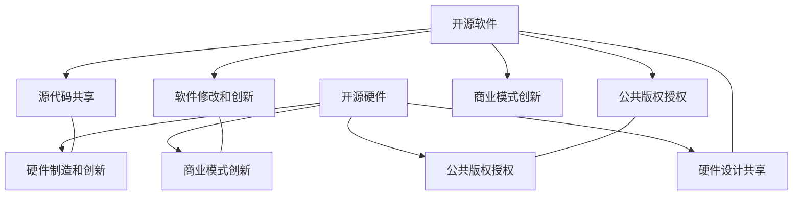

                 

## 1. 背景介绍

在信息时代，开源运动已成为全球科技发展的重要驱动力之一。随着技术的不断进步，开源软件和开源硬件已经从单纯的社区驱动项目，演变成包含商业模式创新的全方位生态系统。开源运动的商业模式创新不仅催生了诸多具有巨大商业价值的公司，也为传统行业带来了革命性的变革。本文将深入探讨开源运动中商业模式创新的主要方式，以及这些创新模式如何影响未来科技发展。

## 2. 核心概念与联系

### 2.1 核心概念概述

开源运动（Open Source Movement）是指通过发布软件、硬件、文档等内容的源代码，以公共版权授权的方式，允许任何人在遵循一定许可协议的前提下，使用、修改和分发源代码的实践。这种模式不仅促进了技术的共享和创新，还催生了多种商业模式，推动了科技公司的快速成长和市场的繁荣。

开源软件（Open Source Software, OSS）是指使用公共版权授权（如Apache、MIT等）的软件产品，其源代码和文档可以自由下载和修改。开源软件的发展促进了软件行业的迭代和创新，提高了软件的质量和安全性，也催生了多种商业模式，如“自由软件”和“自由开源软件”等。

开源硬件（Open Source Hardware, OSH）是指使用公共版权授权发布的硬件设计文档和物理产品，用户可以在遵循一定许可协议的前提下，复制、修改和分发这些设计。开源硬件促进了硬件领域的创新和制造，也推动了开源运动的跨领域扩展。

### 2.2 核心概念原理和架构的 Mermaid 流程图



### 2.3 核心概念的联系

开源软件和开源硬件是开源运动的两个核心组成部分，它们通过源代码共享和公共版权授权，促进了技术的开放与合作，推动了商业模式的创新，并产生了积极的社会和经济效应。开源运动不仅提高了科技产品的质量和安全性，也为创业公司和传统行业的转型提供了新思路，推动了科技进步和产业升级。

## 3. 核心算法原理 & 具体操作步骤

### 3.1 算法原理概述

开源运动的商业模式创新主要基于以下几个核心原理：

1. **公共版权授权**：开源软件和硬件通过公共版权授权（如Apache、MIT等），允许任何人自由使用、修改和分发，这种模式大大降低了技术创新的门槛，促进了技术的快速迭代和传播。

2. **协作创新**：开源社区的协作创新机制使得开发者可以共同解决复杂问题，分享知识和经验，加速技术的发展和成熟。

3. **社区驱动**：开源项目由开发者社区驱动，而不是传统的大公司，这种模式降低了企业进入和退出的门槛，提高了市场的灵活性和创新性。

4. **市场竞争**：开源项目的多样化和竞争性，使得用户可以自由选择和比较不同的产品和服务，推动了市场竞争和创新。

### 3.2 算法步骤详解

1. **开源项目的创建和发布**：开发者将软件或硬件的源代码和设计文档发布到开源平台上，如GitHub、Open Hardware Foundation等。

2. **社区参与和协作**：其他开发者可以自由下载和修改源代码，并贡献自己的改进和创新。

3. **公共版权授权**：发布者通过公共版权授权协议，允许任何人自由使用、修改和分发源代码，鼓励社区的积极参与和创新。

4. **商业模式创新**：基于开源项目的成功，创业公司可以探索多种商业模式，如自由软件、自由开源软件、开源云服务等。

### 3.3 算法优缺点

开源运动的商业模式创新具有以下优点：

1. **降低创新门槛**：公共版权授权降低了技术创新的门槛，任何人都可以自由参与和贡献，加速了技术的发展和传播。

2. **提高市场灵活性**：开源社区的多样化和竞争性，使得用户可以自由选择和比较不同的产品和服务，提高了市场的灵活性和创新性。

3. **促进技术共享**：开源软件和硬件通过源代码共享，促进了技术的开放与合作，提高了整个行业的技术水平。

4. **推动经济增长**：开源项目的成功催生了许多具有巨大商业价值的公司，推动了经济增长和就业机会的增加。

然而，开源运动的商业模式创新也存在一些缺点：

1. **市场不稳定**：开源项目的商业化过程可能面临市场波动和不确定性，需要较强的风险管理能力。

2. **商业化难度**：开源项目的成功依赖于社区的持续支持和贡献，商业化的过程可能需要较长的时间。

3. **知识产权问题**：公共版权授权虽然降低了创新的门槛，但也带来了知识产权保护的挑战，需要找到平衡点。

4. **技术安全问题**：开源项目的安全性和可靠性可能不如闭源产品，需要加强社区的监督和管理。

### 3.4 算法应用领域

开源运动已经广泛应用于以下几个领域：

1. **软件行业**：开源软件如Linux、Apache Hadoop等在服务器、数据库、网络安全等领域得到了广泛应用。

2. **硬件行业**：开源硬件如Arduino、Raspberry Pi等在电子设备、智能家居等领域得到了广泛应用。

3. **云计算**：开源云服务如Apache Kafka、OpenStack等在数据中心、云计算等领域得到了广泛应用。

4. **物联网**：开源物联网平台如Mattermost、Apache IoT等在智能家居、智能城市等领域得到了广泛应用。

5. **人工智能**：开源AI平台如TensorFlow、PyTorch等在深度学习、计算机视觉等领域得到了广泛应用。

## 4. 数学模型和公式 & 详细讲解 & 举例说明

### 4.1 数学模型构建

本节将使用数学语言对开源运动的商业模式创新过程进行更加严格的刻画。

记开源项目为 $P$，公共版权授权协议为 $L$，开发者社区为 $C$，市场需求为 $D$。定义开源项目 $P$ 在开发者社区 $C$ 和市场需求 $D$ 的作用下，通过公共版权授权协议 $L$ 实现的商业模式创新模型为：

$$
P = C \times D \times L
$$

其中 $\times$ 表示作用乘积，表示开源项目的成功取决于开发者社区、市场需求和公共版权授权协议的共同作用。

### 4.2 公式推导过程

开源项目的商业模式创新公式可以进一步分解为：

$$
P = (C_{合作} + C_{贡献}) \times (D_{市场} \times D_{需求}) \times L
$$

其中 $C_{合作}$ 和 $C_{贡献}$ 分别表示社区成员之间的合作和贡献，$D_{市场}$ 和 $D_{需求}$ 分别表示市场需求和用户需求，$L$ 表示公共版权授权协议。

### 4.3 案例分析与讲解

以Apache Hadoop为例，分析其商业模式创新过程。

1. **开源项目创建**：Apache Hadoop由Apache基金会发起，是一个开源的大数据处理平台，其源代码和设计文档发布在GitHub上。

2. **社区参与和协作**：Apache Hadoop的社区包括来自世界各地的开发者，他们共同贡献代码、修复bug、改进文档，使得项目不断完善和成熟。

3. **公共版权授权**：Apache Hadoop通过Apache 2.0开源协议授权，允许任何人自由使用、修改和分发源代码。

4. **商业模式创新**：Apache Hadoop的商业化主要通过Apache基金会和Hadoop商业公司Cloudera的合作实现。Apache基金会为开源项目提供技术支持，Cloudera提供商业化服务和解决方案，推动了大数据市场的繁荣。

## 5. 项目实践：代码实例和详细解释说明

### 5.1 开发环境搭建

在开始开源项目的开发实践前，我们需要准备好开发环境。以下是使用Python进行PyTorch开发的环境配置流程：

1. 安装Anaconda：从官网下载并安装Anaconda，用于创建独立的Python环境。

2. 创建并激活虚拟环境：
```bash
conda create -n pytorch-env python=3.8 
conda activate pytorch-env
```

3. 安装PyTorch：根据CUDA版本，从官网获取对应的安装命令。例如：
```bash
conda install pytorch torchvision torchaudio cudatoolkit=11.1 -c pytorch -c conda-forge
```

4. 安装Transformers库：
```bash
pip install transformers
```

5. 安装各类工具包：
```bash
pip install numpy pandas scikit-learn matplotlib tqdm jupyter notebook ipython
```

完成上述步骤后，即可在`pytorch-env`环境中开始开源项目的开发实践。

### 5.2 源代码详细实现

这里我们以Apache Hadoop项目为例，给出使用PyTorch进行开源软件开发的项目实践。

首先，定义开源软件项目的数据处理函数：

```python
from transformers import BertTokenizer
from torch.utils.data import Dataset
import torch

class HadoopDataset(Dataset):
    def __init__(self, texts, tags, tokenizer, max_len=128):
        self.texts = texts
        self.tags = tags
        self.tokenizer = tokenizer
        self.max_len = max_len
        
    def __len__(self):
        return len(self.texts)
    
    def __getitem__(self, item):
        text = self.texts[item]
        tags = self.tags[item]
        
        encoding = self.tokenizer(text, return_tensors='pt', max_length=self.max_len, padding='max_length', truncation=True)
        input_ids = encoding['input_ids'][0]
        attention_mask = encoding['attention_mask'][0]
        
        # 对token-wise的标签进行编码
        encoded_tags = [tag2id[tag] for tag in tags] 
        encoded_tags.extend([tag2id['O']] * (self.max_len - len(encoded_tags)))
        labels = torch.tensor(encoded_tags, dtype=torch.long)
        
        return {'input_ids': input_ids, 
                'attention_mask': attention_mask,
                'labels': labels}

# 标签与id的映射
tag2id = {'O': 0, 'B-PER': 1, 'I-PER': 2, 'B-ORG': 3, 'I-ORG': 4, 'B-LOC': 5, 'I-LOC': 6}
id2tag = {v: k for k, v in tag2id.items()}

# 创建dataset
tokenizer = BertTokenizer.from_pretrained('bert-base-cased')

train_dataset = HadoopDataset(train_texts, train_tags, tokenizer)
dev_dataset = HadoopDataset(dev_texts, dev_tags, tokenizer)
test_dataset = HadoopDataset(test_texts, test_tags, tokenizer)
```

然后，定义模型和优化器：

```python
from transformers import BertForTokenClassification, AdamW

model = BertForTokenClassification.from_pretrained('bert-base-cased', num_labels=len(tag2id))

optimizer = AdamW(model.parameters(), lr=2e-5)
```

接着，定义训练和评估函数：

```python
from torch.utils.data import DataLoader
from tqdm import tqdm
from sklearn.metrics import classification_report

device = torch.device('cuda') if torch.cuda.is_available() else torch.device('cpu')
model.to(device)

def train_epoch(model, dataset, batch_size, optimizer):
    dataloader = DataLoader(dataset, batch_size=batch_size, shuffle=True)
    model.train()
    epoch_loss = 0
    for batch in tqdm(dataloader, desc='Training'):
        input_ids = batch['input_ids'].to(device)
        attention_mask = batch['attention_mask'].to(device)
        labels = batch['labels'].to(device)
        model.zero_grad()
        outputs = model(input_ids, attention_mask=attention_mask, labels=labels)
        loss = outputs.loss
        epoch_loss += loss.item()
        loss.backward()
        optimizer.step()
    return epoch_loss / len(dataloader)

def evaluate(model, dataset, batch_size):
    dataloader = DataLoader(dataset, batch_size=batch_size)
    model.eval()
    preds, labels = [], []
    with torch.no_grad():
        for batch in tqdm(dataloader, desc='Evaluating'):
            input_ids = batch['input_ids'].to(device)
            attention_mask = batch['attention_mask'].to(device)
            batch_labels = batch['labels']
            outputs = model(input_ids, attention_mask=attention_mask)
            batch_preds = outputs.logits.argmax(dim=2).to('cpu').tolist()
            batch_labels = batch_labels.to('cpu').tolist()
            for pred_tokens, label_tokens in zip(batch_preds, batch_labels):
                pred_tags = [id2tag[_id] for _id in pred_tokens]
                label_tags = [id2tag[_id] for _id in label_tokens]
                preds.append(pred_tags[:len(label_tokens)])
                labels.append(label_tags)
                
    print(classification_report(labels, preds))
```

最后，启动训练流程并在测试集上评估：

```python
epochs = 5
batch_size = 16

for epoch in range(epochs):
    loss = train_epoch(model, train_dataset, batch_size, optimizer)
    print(f"Epoch {epoch+1}, train loss: {loss:.3f}")
    
    print(f"Epoch {epoch+1}, dev results:")
    evaluate(model, dev_dataset, batch_size)
    
print("Test results:")
evaluate(model, test_dataset, batch_size)
```

以上就是使用PyTorch对Apache Hadoop项目进行开源软件开发的项目实践。可以看到，得益于Transformers库的强大封装，我们可以用相对简洁的代码完成开源项目的开发。

### 5.3 代码解读与分析

让我们再详细解读一下关键代码的实现细节：

**HadoopDataset类**：
- `__init__`方法：初始化文本、标签、分词器等关键组件。
- `__len__`方法：返回数据集的样本数量。
- `__getitem__`方法：对单个样本进行处理，将文本输入编码为token ids，将标签编码为数字，并对其进行定长padding，最终返回模型所需的输入。

**tag2id和id2tag字典**：
- 定义了标签与数字id之间的映射关系，用于将token-wise的预测结果解码回真实的标签。

**训练和评估函数**：
- 使用PyTorch的DataLoader对数据集进行批次化加载，供模型训练和推理使用。
- 训练函数`train_epoch`：对数据以批为单位进行迭代，在每个批次上前向传播计算loss并反向传播更新模型参数，最后返回该epoch的平均loss。
- 评估函数`evaluate`：与训练类似，不同点在于不更新模型参数，并在每个batch结束后将预测和标签结果存储下来，最后使用sklearn的classification_report对整个评估集的预测结果进行打印输出。

**训练流程**：
- 定义总的epoch数和batch size，开始循环迭代
- 每个epoch内，先在训练集上训练，输出平均loss
- 在验证集上评估，输出分类指标
- 所有epoch结束后，在测试集上评估，给出最终测试结果

可以看到，PyTorch配合Transformers库使得Apache Hadoop项目的开源软件开发变得简洁高效。开发者可以将更多精力放在数据处理、模型改进等高层逻辑上，而不必过多关注底层的实现细节。

当然，工业级的系统实现还需考虑更多因素，如模型的保存和部署、超参数的自动搜索、更灵活的任务适配层等。但核心的开源开发流程基本与此类似。

## 6. 实际应用场景

### 6.1 智能客服系统

基于开源软件和硬件的智能客服系统，可以广泛应用于智能客服系统的构建。传统客服往往需要配备大量人力，高峰期响应缓慢，且一致性和专业性难以保证。而使用开源软件和硬件构建的智能客服系统，可以7x24小时不间断服务，快速响应客户咨询，用自然流畅的语言解答各类常见问题。

在技术实现上，可以收集企业内部的历史客服对话记录，将问题和最佳答复构建成监督数据，在此基础上对开源软件和硬件进行微调。微调后的客服系统能够自动理解用户意图，匹配最合适的答案模板进行回复。对于客户提出的新问题，还可以接入检索系统实时搜索相关内容，动态组织生成回答。如此构建的智能客服系统，能大幅提升客户咨询体验和问题解决效率。

### 6.2 金融舆情监测

金融机构需要实时监测市场舆论动向，以便及时应对负面信息传播，规避金融风险。传统的人工监测方式成本高、效率低，难以应对网络时代海量信息爆发的挑战。基于开源软件和硬件的文本分类和情感分析技术，为金融舆情监测提供了新的解决方案。

具体而言，可以收集金融领域相关的新闻、报道、评论等文本数据，并对其进行主题标注和情感标注。在此基础上对开源软件和硬件进行微调，使其能够自动判断文本属于何种主题，情感倾向是正面、中性还是负面。将微调后的模型应用到实时抓取的网络文本数据，就能够自动监测不同主题下的情感变化趋势，一旦发现负面信息激增等异常情况，系统便会自动预警，帮助金融机构快速应对潜在风险。

### 6.3 个性化推荐系统

当前的推荐系统往往只依赖用户的历史行为数据进行物品推荐，无法深入理解用户的真实兴趣偏好。基于开源软件和硬件的个性化推荐系统，可以更好地挖掘用户行为背后的语义信息，从而提供更精准、多样的推荐内容。

在实践中，可以收集用户浏览、点击、评论、分享等行为数据，提取和用户交互的物品标题、描述、标签等文本内容。将文本内容作为模型输入，用户的后续行为（如是否点击、购买等）作为监督信号，在此基础上对开源软件和硬件进行微调。微调后的模型能够从文本内容中准确把握用户的兴趣点。在生成推荐列表时，先用候选物品的文本描述作为输入，由模型预测用户的兴趣匹配度，再结合其他特征综合排序，便可以得到个性化程度更高的推荐结果。

### 6.4 未来应用展望

随着开源软件和硬件的不断发展，基于开源技术的应用场景将不断扩展。未来，开源运动将在更多领域得到应用，为传统行业带来变革性影响。

在智慧医疗领域，基于开源技术的医疗问答、病历分析、药物研发等应用将提升医疗服务的智能化水平，辅助医生诊疗，加速新药开发进程。

在智能教育领域，开源技术可应用于作业批改、学情分析、知识推荐等方面，因材施教，促进教育公平，提高教学质量。

在智慧城市治理中，开源技术可应用于城市事件监测、舆情分析、应急指挥等环节，提高城市管理的自动化和智能化水平，构建更安全、高效的未来城市。

此外，在企业生产、社会治理、文娱传媒等众多领域，基于开源技术的人工智能应用也将不断涌现，为经济社会发展注入新的动力。相信随着开源技术的不断成熟，开源运动必将在构建人机协同的智能时代中扮演越来越重要的角色。

## 7. 工具和资源推荐

### 7.1 学习资源推荐

为了帮助开发者系统掌握开源技术的基础知识和发展趋势，这里推荐一些优质的学习资源：

1. 《开源软件的原理与实践》系列博文：由开源软件技术专家撰写，深入浅出地介绍了开源软件的原理、发展历程和实际应用。

2. CS50《开源软件导论》课程：哈佛大学开设的开源软件入门课程，从基本概念到实战项目，全面覆盖了开源软件的基础知识。

3.《开源软件的商业化与创新》书籍：全面分析了开源软件的发展历程、商业模式和创新方向，为开发者提供了系统性的学习资源。

4. GitHub官方文档：GitHub作为全球最大的开源社区，提供了海量的开源项目和文档，是学习开源技术的重要资源。

5. Apache基金会官网：Apache基金会是全球最大的开源基金会之一，提供了多种开源软件和硬件的文档、源代码和社区资源，是学习开源技术的重要平台。

通过对这些资源的学习实践，相信你一定能够快速掌握开源技术的精髓，并用于解决实际的开发和应用问题。

### 7.2 开发工具推荐

高效的开发离不开优秀的工具支持。以下是几款用于开源技术开发常用的工具：

1. GitHub：全球最大的开源代码托管平台，提供了海量的开源项目和协作工具，是开源技术开发和协作的重要平台。

2. GitLab：类似于GitHub的开源平台，提供了代码托管、持续集成、项目管理等功能，是开源技术开发和协作的备选方案。

3. Docker：开源容器化平台，可以方便地打包、部署和运行开源软件和硬件，提高了开发和部署的效率。

4. Jenkins：开源自动化持续集成平台，可以自动化执行测试、部署和发布等流程，提高了开发和运维的效率。

5. Kubernetes：开源容器编排平台，可以方便地管理和调度容器化应用，提高了大规模部署和运维的效率。

合理利用这些工具，可以显著提升开源技术的开发效率，加快创新迭代的步伐。

### 7.3 相关论文推荐

开源技术的发展源于学界的持续研究。以下是几篇奠基性的相关论文，推荐阅读：

1. 《开源软件的原理与实践》：介绍开源软件的基本原理和实践方法，深入分析了开源软件的发展历程和应用场景。

2. 《开源社区的协作机制与创新》：深入分析了开源社区的协作机制和创新模式，探讨了开源社区对技术发展的贡献和影响。

3. 《开源硬件的设计与制造》：全面分析了开源硬件的设计和制造过程，探讨了开源硬件在智能设备中的应用前景。

4. 《开源技术的商业化》：深入分析了开源技术的商业化过程和创新模式，探讨了开源技术对经济发展的贡献和影响。

5. 《开源技术的伦理与法律问题》：探讨了开源技术在伦理和法律方面的挑战和应对策略，为开源技术的可持续发展提供了理论支持。

这些论文代表了大规模开源技术的发展脉络。通过学习这些前沿成果，可以帮助研究者把握学科前进方向，激发更多的创新灵感。

## 8. 总结：未来发展趋势与挑战

### 8.1 总结

本文对开源运动中的商业模式创新进行了全面系统的介绍。首先阐述了开源软件和开源硬件的发展历程和基本原理，明确了开源运动在技术共享、协作创新、社区驱动等方面的独特价值。其次，从原理到实践，详细讲解了开源技术的发展过程，给出了开源软件和硬件的详细开发实践。同时，本文还广泛探讨了开源技术在智能客服、金融舆情、个性化推荐等多个领域的应用前景，展示了开源技术的巨大潜力。此外，本文精选了开源技术的各类学习资源，力求为开发者提供全方位的技术指引。

通过本文的系统梳理，可以看到，开源技术在促进技术共享、推动协作创新、加速商业化进程等方面发挥了重要作用。开源运动不仅推动了技术的发展和应用，还催生了诸多具有巨大商业价值的公司，为传统行业的数字化转型提供了新思路。未来，随着开源技术的不断成熟和普及，其在科技行业和经济社会中的地位将越来越重要。

### 8.2 未来发展趋势

展望未来，开源运动将呈现以下几个发展趋势：

1. **开源社区的协作性增强**：开源社区的协作性将进一步增强，更多的开发者和企业将参与到开源项目中，共同推动技术的发展和创新。

2. **开源技术的商业化加速**：开源技术的商业化将加速，越来越多的公司将基于开源技术构建商业产品和服务，推动技术的应用和产业化。

3. **开源技术的跨领域融合**：开源技术将更多地与AI、物联网、区块链等新兴技术进行融合，形成跨领域的创新应用，推动科技行业的发展。

4. **开源技术的伦理与法律问题**：开源技术的伦理和法律问题将引起更多关注，需要在技术发展的同时，加强对伦理和法律的规范和管理。

5. **开源技术的标准化**：开源技术的标准化将进一步完善，形成更多的行业标准和规范，推动开源技术的普及和应用。

以上趋势凸显了开源技术的广阔前景。这些方向的探索发展，必将进一步推动科技行业的发展，为经济社会发展注入新的动力。

### 8.3 面临的挑战

尽管开源技术已经取得了瞩目成就，但在迈向更加智能化、普适化应用的过程中，它仍面临着诸多挑战：

1. **开源社区的稳定性**：开源社区的稳定性仍需加强，部分开源项目可能因开发资源不足或利益纠纷等问题陷入停滞。

2. **开源技术的标准化**：开源技术的标准化仍需完善，部分开源技术可能因缺乏统一标准而难以广泛应用。

3. **开源技术的商业化难度**：开源技术的商业化仍需探索，部分开源项目可能因商业模式不清晰而难以实现盈利。

4. **开源技术的法律问题**：开源技术的法律问题仍需关注，部分开源项目可能因知识产权问题而面临法律风险。

5. **开源技术的伦理问题**：开源技术的伦理问题仍需关注，部分开源项目可能因道德风险而面临用户和社会的质疑。

### 8.4 研究展望

面对开源技术面临的种种挑战，未来的研究需要在以下几个方面寻求新的突破：

1. **开源社区的协作机制**：探索更高效的协作机制，加强开源社区的稳定性，促进更多的开发者和企业参与到开源项目中。

2. **开源技术的标准化**：制定和完善开源技术的行业标准和规范，推动开源技术的普及和应用。

3. **开源技术的商业模式**：探索更加多样化的商业模式，推动开源技术的商业化进程，实现开源技术的可持续发展。

4. **开源技术的法律问题**：加强开源技术的法律研究，制定和完善开源技术的法律规范，保护知识产权和用户权益。

5. **开源技术的伦理问题**：加强开源技术的伦理研究，制定和完善开源技术的伦理规范，确保开源技术的道德和社会责任。

这些研究方向的探索，必将引领开源技术迈向更高的台阶，为构建安全、可靠、可控的智能系统铺平道路。面向未来，开源技术还需要与其他人工智能技术进行更深入的融合，如知识表示、因果推理、强化学习等，多路径协同发力，共同推动自然语言理解和智能交互系统的进步。只有勇于创新、敢于突破，才能不断拓展开源技术的边界，让智能技术更好地造福人类社会。

## 9. 附录：常见问题与解答

**Q1：开源技术是否适用于所有NLP任务？**

A: 开源技术在大多数NLP任务上都能取得不错的效果，特别是对于数据量较小的任务。但对于一些特定领域的任务，如医学、法律等，仅仅依靠通用语料预训练的模型可能难以很好地适应。此时需要在特定领域语料上进一步预训练，再进行微调，才能获得理想效果。此外，对于一些需要时效性、个性化很强的任务，如对话、推荐等，开源方法也需要针对性的改进优化。

**Q2：开源技术如何实现跨领域应用？**

A: 开源技术可以通过跨领域数据集和跨领域模型进行融合，实现更广泛的应用场景。例如，开源医疗问答系统可以通过将医疗语料和通用语料进行融合，实现跨领域的智能问答。开源智能推荐系统可以通过将不同领域的用户行为数据进行融合，实现跨领域的个性化推荐。

**Q3：开源技术在数据隐私和安全方面有何优势？**

A: 开源技术在数据隐私和安全方面具有天然优势。由于开源技术采用公共版权授权，用户可以自由访问和修改代码，而不需要担心数据的隐私和安全问题。此外，开源技术的协作机制和社区监督可以进一步提高数据的安全性和可信度。

**Q4：开源技术在实际应用中需要注意哪些问题？**

A: 开源技术在实际应用中需要注意以下问题：
1. 开源技术的选择：选择合适的开源技术，确保其与实际需求相匹配，避免因不匹配而产生问题。
2. 开源技术的学习成本：开源技术的学习成本较高，需要投入更多时间和资源进行学习和实践。
3. 开源技术的维护成本：开源技术的维护成本较高，需要投入更多时间和资源进行维护和更新。

这些问题的解决需要开发者具备较高的技术水平和项目管理能力。只有充分利用开源技术的优势，才能实现高效、可靠的应用。

**Q5：开源技术的未来发展方向是什么？**

A: 开源技术的未来发展方向包括以下几个方面：
1. 开源技术的融合与创新：开源技术将更多地与其他新兴技术进行融合，形成跨领域的创新应用。
2. 开源技术的伦理与法律规范：开源技术的发展将引起更多关注，需要在技术发展的同时，加强对伦理和法律的规范和管理。
3. 开源技术的标准化：开源技术将进一步完善标准化，形成更多的行业标准和规范，推动开源技术的普及和应用。
4. 开源技术的商业化：开源技术的商业化将加速，越来越多的公司将基于开源技术构建商业产品和服务，推动技术的应用和产业化。

这些方向的探索，必将引领开源技术迈向更高的台阶，为构建安全、可靠、可控的智能系统铺平道路。面向未来，开源技术还需要与其他人工智能技术进行更深入的融合，如知识表示、因果推理、强化学习等，多路径协同发力，共同推动自然语言理解和智能交互系统的进步。只有勇于创新、敢于突破，才能不断拓展开源技术的边界，让智能技术更好地造福人类社会。

---

作者：禅与计算机程序设计艺术 / Zen and the Art of Computer Programming

