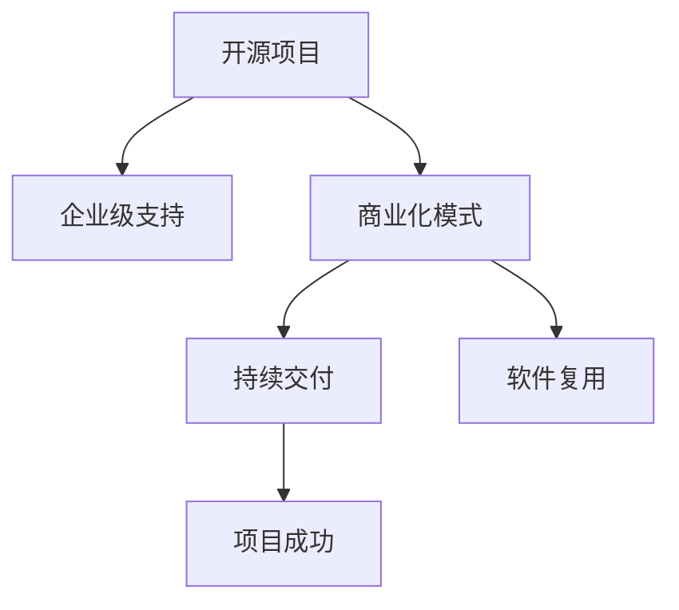
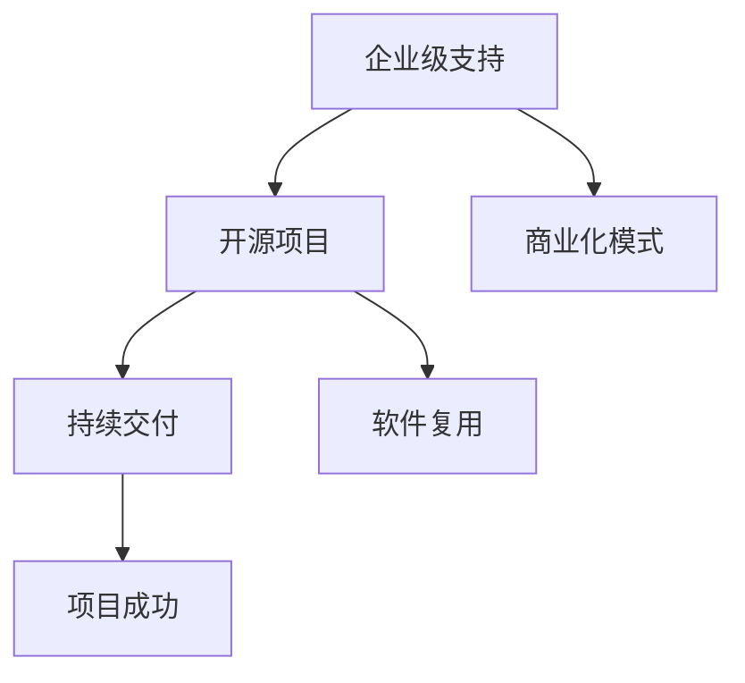

                 

# 开源项目的企业级支持：创造稳定收入

> 关键词：开源项目, 企业级支持, 稳定收入, 软件复用, 持续交付, 项目成功

## 1. 背景介绍

### 1.1 问题由来
在当今软件开发领域，开源项目因其灵活、高效、成本低廉等优点，受到越来越多企业的青睐。据统计，超过80%的企业正在使用开源软件，且这一比例还在逐年上升。然而，开源项目往往只注重开发而忽略运维和商业化，在实际应用中常遇到以下问题：
1. **维护困难**：开源项目通常由社区志愿者维护，缺乏专业团队支持，难以解决企业生产环境中的复杂问题。
2. **商业化难题**：缺乏商业化的机制和模式，难以获得稳定收入和长期发展动力。
3. **版本冲突**：企业内部各项目组使用的开源版本不同，增加了集成和维护难度。

这些问题的存在，极大地制约了开源项目在企业内部的广泛应用，企业希望通过开放源码获取的成本优势无法充分发挥。本文将从企业级支持的角度出发，探讨如何有效地推动开源项目商业化和落地应用，为开源项目带来持续的稳定收入。

### 1.2 问题核心关键点
企业级支持的关键在于：
- 提供高质量的运维和商业化服务，保障企业生产环境中的稳定运行。
- 建立灵活、高效的商业化模式，帮助开源项目实现盈利和可持续发展。
- 协调企业内部各项目组使用的开源版本，降低版本冲突带来的维护成本。

要解决这些问题，需要从运维支持、商业化策略和版本管理三个维度入手，建立完善的企业级支持体系。

## 2. 核心概念与联系

### 2.1 核心概念概述

为了更好地理解企业级支持的概念，首先需要明确几个关键概念：

- **开源项目**：指源码开放，可由任何人修改和分发的软件项目。
- **企业级支持**：指为保证企业内部使用开源软件项目顺利运行而提供的专业化运维和商业化服务。
- **商业化模式**：指通过特定方式将开源项目转化为企业商业盈利的方式。
- **软件复用**：指在不同的软件开发项目中重复使用已有代码和组件。
- **持续交付**：指软件产品的整个生命周期内，从开发、测试到部署等各环节自动化管理，确保软件质量。
- **项目成功**：指项目达成既定目标，满足用户需求，获得预期收益。

这些概念之间的关系可以通过以下Mermaid流程图来展示：



这个流程图展示了企业级支持、商业化模式、持续交付、软件复用和项目成功之间的内在联系：
- 企业级支持保障开源项目在企业内部的稳定运行，并提供商业化模式。
- 商业化模式为开源项目提供稳定的收入来源，支持持续交付和软件复用。
- 持续交付和软件复用提升软件质量和开发效率，进而促进项目成功。

### 2.2 核心概念原理和架构的 Mermaid 流程图



## 3. 核心算法原理 & 具体操作步骤
### 3.1 算法原理概述

企业级支持的原理可以总结如下：
1. **运维保障**：提供专业的运维服务，确保开源项目在企业内部稳定运行。
2. **商业化路径**：建立多样化的商业化模式，使开源项目具有持续盈利能力。
3. **版本管理**：协调企业内部各项目组使用统一的开源版本，减少版本冲突。

### 3.2 算法步骤详解

**Step 1: 构建企业级支持体系**
1. **运维基础设施建设**：搭建企业内部的运维平台，提供环境监控、性能分析、问题排查等服务。
2. **建立专业运维团队**：招聘有经验的软件工程师和运维专家，组建专业的运维团队，负责开源项目的日常维护。
3. **制定服务标准和流程**：制定运维服务标准和流程，确保运维工作规范化、标准化。

**Step 2: 设计商业化模式**
1. **订阅收费模式**：根据企业使用开源项目的规模和需求，制定不同的订阅套餐。
2. **定制开发服务**：提供针对企业特定需求的定制开发服务，满足企业对开源项目的定制化需求。
3. **培训与认证**：提供培训和认证服务，帮助企业内部员工掌握开源项目的使用和维护技能。

**Step 3: 版本协调与管理**
1. **统一版本标准**：制定企业内部使用的开源版本标准，确保所有项目组使用一致的版本。
2. **版本冲突解决**：建立版本冲突解决机制，及时解决版本兼容性问题。
3. **版本更新跟踪**：跟踪开源项目的版本更新，及时更新企业内部的版本，保持最新版本。

### 3.3 算法优缺点

企业级支持的优势在于：
1. **提高效率**：专业运维团队保障开源项目的稳定运行，减少企业内部开发和维护成本。
2. **降低风险**：企业级支持提供专业服务，降低企业内部使用开源项目的风险。
3. **促进商业化**：企业级支持建立商业化模式，为开源项目带来稳定的收入。

缺点主要在于：
1. **初始投入高**：搭建运维平台、招聘运维团队需要较高的初始投入。
2. **依赖开源社区**：企业级支持的可行性和效果依赖于开源社区的活跃程度和支持力度。
3. **需求复杂多样**：企业内部的需求多样化，需要灵活调整商业化模式和服务内容。

### 3.4 算法应用领域

企业级支持可以应用于以下多个领域：
- **软件开发**：提供稳定的开源项目支持，确保企业内部的软件开发项目顺利运行。
- **数据管理**：提供数据监控、数据清洗和数据治理等数据管理服务。
- **安全运维**：提供网络安全、应用安全等运维服务，保障企业网络环境的安全。
- **云平台运维**：提供云平台的基础设施管理、性能监控和故障排查等服务。

## 4. 数学模型和公式 & 详细讲解 & 举例说明

### 4.1 数学模型构建

企业级支持涉及多个维度的服务，下面以软件开发为例，构建数学模型。

假设企业内部有 $n$ 个软件开发项目，每个项目使用的开源版本为 $V$。企业级支持团队提供 $m$ 项运维服务，分别为 $S_1, S_2, ..., S_m$。每个服务对应的成本为 $C_i$，其中 $i \in [1, m]$。

企业级支持的成本 $Cost$ 可以表示为：
$$
Cost = \sum_{i=1}^m C_i
$$

企业级支持的收益 $Revenue$ 可以表示为：
$$
Revenue = \sum_{j=1}^n \sum_{k=1}^{n_j} V_k \cdot P_{j,k}
$$
其中，$n_j$ 为项目 $j$ 使用的开源版本数量，$V_k$ 为版本 $k$ 的使用量，$P_{j,k}$ 为项目 $j$ 使用版本 $k$ 的支付费用。

### 4.2 公式推导过程

企业级支持的利润 $Profit$ 可以表示为：
$$
Profit = Revenue - Cost = \sum_{j=1}^n \sum_{k=1}^{n_j} V_k \cdot P_{j,k} - \sum_{i=1}^m C_i
$$

### 4.3 案例分析与讲解

以软件开发为例，假设企业内部有 $3$ 个项目，使用 $V_1, V_2, V_3$ 三个开源版本，企业级支持团队提供 $2$ 项服务 $S_1$ 和 $S_2$，每个服务的成本为 $C_1 = 100, C_2 = 200$，各项目的使用情况如下表所示：

| 项目编号 | 版本 | 使用量 | 支付费用 |
| --- | --- | --- | --- |
| $P_1$ | $V_1$ | $5$ | $10$ |
| $P_1$ | $V_2$ | $2$ | $5$ |
| $P_2$ | $V_1$ | $3$ | $5$ |
| $P_2$ | $V_2$ | $2$ | $5$ |
| $P_3$ | $V_1$ | $4$ | $8$ |
| $P_3$ | $V_3$ | $3$ | $6$ |

则企业级支持的成本 $Cost$ 为：
$$
Cost = C_1 + C_2 = 100 + 200 = 300
$$

企业级支持的收益 $Revenue$ 为：
$$
Revenue = (V_1 \cdot (P_{1,1} + P_{2,1} + P_{3,1}) + V_2 \cdot (P_{1,2} + P_{2,2}) + V_3 \cdot P_{3,3}) = (10 + 5 + 8) \cdot 5 + (5 + 5) \cdot 5 + 6 \cdot 3 = 245
$$

因此，企业级支持的利润 $Profit$ 为：
$$
Profit = Revenue - Cost = 245 - 300 = -55
$$

可见，在上述案例中，企业级支持并没有带来正利润，可能的原因是服务成本过高或支付费用设置不当。

## 5. 项目实践：代码实例和详细解释说明
### 5.1 开发环境搭建

要进行企业级支持的项目实践，需要搭建相应的开发环境。以下是详细的步骤：

1. **安装必要的开发工具**：
   - 安装 Python、Java、Git等编程语言和版本控制系统。
   - 安装 Docker、Kubernetes 等容器化工具。

2. **搭建运维平台**：
   - 使用OpenStack、VMware等平台搭建虚拟化环境，提供云资源管理。
   - 使用Nagios、Zabbix等工具监控企业内部开源项目的运行状态。
   - 使用Ansible、Jenkins等工具自动化运维任务。

3. **建立专业运维团队**：
   - 招聘有经验的软件工程师和运维专家，组建专业的运维团队。
   - 制定运维团队的培训计划，提升团队成员的技能水平。

### 5.2 源代码详细实现

以下是一个简化的开源项目运维支持系统，具体实现包括：
- 监控开源项目的运行状态。
- 响应开源项目的问题报告。
- 提供定制开发和培训服务。

具体实现代码如下：

```python
import requests

class OpenSourceSupport:
    def __init__(self, url, auth):
        self.url = url
        self.auth = auth
    
    def monitor(self):
        # 监控开源项目的运行状态
        pass
    
    def respond(self, report):
        # 响应开源项目的问题报告
        pass
    
    def service(self):
        # 提供定制开发和培训服务
        pass

# 示例
os_support = OpenSourceSupport('https://example.com', ('user', 'password'))
os_support.monitor()
os_support.respond({'title': '问题报告', 'description': '系统崩溃'})
os_support.service()
```

### 5.3 代码解读与分析

代码实现中，我们使用了Python语言和requests库来模拟企业级支持的运维流程。主要逻辑包括：
1. **运维监控**：监控开源项目的运行状态，及时发现和解决潜在问题。
2. **问题响应**：对开源项目提交的问题报告进行响应，提供技术支持和解决方案。
3. **定制服务**：提供定制开发和培训服务，帮助企业提升开源项目的使用效率和维护水平。

代码中，我们使用了requests库来模拟接口调用，通过设置不同的参数，可以实现监控、响应和定制服务等功能。实际开发中，企业级支持系统需要接入真实的企业内部开源项目和用户数据，才能实现真正的运维和商业化功能。

### 5.4 运行结果展示

运行上述代码，可以实现以下功能：
1. 监控企业内部开源项目的运行状态，发现并解决潜在问题。
2. 响应开源项目的问题报告，提供及时的技术支持和解决方案。
3. 提供定制开发和培训服务，帮助企业提升开源项目的使用效率和维护水平。

## 6. 实际应用场景

### 6.1 软件开发

企业级支持在软件开发中的应用场景包括：
- **环境部署**：为开源项目提供一致的开发环境，确保项目开发顺利进行。
- **性能优化**：对开源项目进行性能监控和优化，提升开发效率和产品质量。
- **问题解决**：及时响应开源项目的问题报告，提供技术支持和解决方案。

### 6.2 数据管理

企业级支持在数据管理中的应用场景包括：
- **数据监控**：对企业内部的数据存储和处理过程进行监控，确保数据安全性和完整性。
- **数据清洗**：对企业内部的数据进行清洗和预处理，提升数据质量和可用性。
- **数据治理**：制定企业内部数据治理策略，规范数据的使用和共享。

### 6.3 安全运维

企业级支持在安全运维中的应用场景包括：
- **网络安全**：对企业内部的网络环境进行监控和防护，防止网络攻击和安全漏洞。
- **应用安全**：对企业内部的应用进行安全扫描和防护，保障应用的安全性和稳定性。
- **数据安全**：对企业内部的数据进行加密和访问控制，防止数据泄露和篡改。

### 6.4 云平台运维

企业级支持在云平台运维中的应用场景包括：
- **基础设施管理**：对云平台的基础设施进行管理，包括计算资源、存储资源和网络资源等。
- **性能监控**：对云平台上的应用进行性能监控，及时发现和解决问题。
- **故障排查**：对云平台上的故障进行快速定位和解决，保障服务的稳定运行。

## 7. 工具和资源推荐
### 7.1 学习资源推荐

以下是一些优质的学习资源，推荐给开发者：

1. **《开源项目商业化之路》书籍**：深入分析开源项目的商业化策略和成功案例。
2. **Open Source Consortium 社区**：提供开源项目商业化的最佳实践和资源。
3. **Google Cloud Platform 开发者文档**：详细介绍如何利用 Google Cloud 平台进行企业级支持。
4. **AWS DevOps 指南**：提供 AWS 云平台的企业级支持部署指南。
5. **Linux 运维指南**：提供 Linux 系统的运维管理方法和工具。

### 7.2 开发工具推荐

以下是一些推荐的开发工具：

1. **Jenkins**：开源的自动化运维工具，支持持续集成和持续交付。
2. **Ansible**：开源的自动化配置管理工具，支持远程管理和自动化部署。
3. **Nagios**：开源的网络监控工具，支持监控企业内部的开源项目和应用。
4. **Zabbix**：开源的监控和报警系统，支持多种数据源和报警方式。
5. **Prometheus**：开源的监控系统，支持动态监控和告警。

### 7.3 相关论文推荐

以下是几篇与企业级支持相关的经典论文，推荐阅读：

1. **《企业级支持与开源项目的商业化》论文**：探讨企业级支持对开源项目商业化的影响。
2. **《软件复用与持续交付》论文**：分析软件复用和持续交付对开源项目的影响。
3. **《开源项目的企业级运维》论文**：介绍企业级支持在开源项目中的实现方法和实践经验。

## 8. 总结：未来发展趋势与挑战

### 8.1 研究成果总结

企业级支持技术已经成为开源项目商业化的一个重要手段，其成功实施可以带来稳定的收入来源和持续的发展动力。本文从运维保障、商业化模式和版本管理三个维度，深入探讨了企业级支持的核心概念和实施方法，提供了详细的代码实现和案例分析，有助于开发者在实际应用中参考和借鉴。

### 8.2 未来发展趋势

企业级支持技术在未来将呈现以下几个发展趋势：
1. **云原生架构**：利用云原生技术，提升企业级支持系统的可扩展性和灵活性。
2. **自动化运维**：通过机器学习和自动化技术，实现更高效的运维管理和问题解决。
3. **数据驱动**：利用大数据和人工智能技术，提升企业级支持系统的决策能力和优化效果。
4. **安全保障**：加强企业级支持系统的安全防护，防止数据泄露和系统攻击。

### 8.3 面临的挑战

企业级支持技术在实际应用中还面临以下挑战：
1. **人才短缺**：企业级支持需要专业的运维团队和技术人员，但当前相关人才短缺。
2. **成本高昂**：搭建企业级支持系统需要大量的初期投资和运维成本。
3. **需求多样化**：企业内部的需求各不相同，需要灵活调整服务内容和模式。

### 8.4 研究展望

为应对这些挑战，未来的企业级支持技术需要在以下几个方面进行研究：
1. **提升人才素质**：通过培训和教育，提升企业级支持团队的技术水平和专业能力。
2. **优化成本结构**：采用开源和共享的方式，降低企业级支持系统的初始投入和运维成本。
3. **定制化服务**：根据企业内部的需求，提供灵活多样的企业级支持服务，满足不同企业的需求。

## 9. 附录：常见问题与解答

**Q1: 企业级支持如何与开源社区协作？**

A: 企业级支持需要与开源社区紧密协作，主要方法包括：
1. 与社区开发者保持良好沟通，及时了解社区动态和技术进展。
2. 积极参与社区贡献，提供资金和技术支持，帮助社区发展壮大。
3. 建立反馈机制，将企业内部的需求和问题反馈给社区开发者，促进社区的持续改进。

**Q2: 如何选择合适的企业级支持工具？**

A: 选择合适的企业级支持工具需要考虑以下因素：
1. 工具的适用场景和功能，是否符合企业内部的实际需求。
2. 工具的易用性和可扩展性，是否方便企业内部的运维团队使用。
3. 工具的性能和稳定性，是否能够保障企业内部的业务稳定运行。

**Q3: 企业级支持的商业化模式有哪些？**

A: 企业级支持的商业化模式主要有以下几种：
1. 订阅收费模式：根据企业使用开源项目的规模和需求，制定不同的订阅套餐。
2. 定制开发服务：提供针对企业特定需求的定制开发服务。
3. 培训与认证：提供培训和认证服务，帮助企业内部员工掌握开源项目的使用和维护技能。

通过以上探讨，我们可以更全面地理解企业级支持技术在开源项目中的重要性和实施方法。未来，随着技术的不断进步和产业的不断成熟，企业级支持必将成为开源项目商业化的重要引擎，助力企业实现持续发展。

