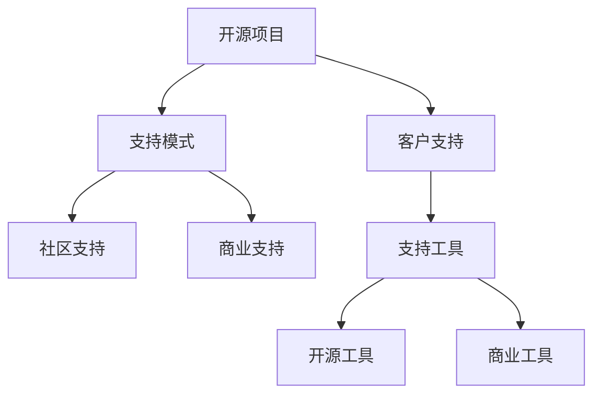

                 

# 开源项目的商业化客户支持：支持模式和工具

> 关键词：开源项目，商业化，客户支持，支持模式，客户支持工具

## 1. 背景介绍

### 1.1 问题由来
开源软件因其开放、免费、灵活的特点，近年来在各行各业得到了广泛的应用。然而，相对于商业软件，开源软件在客户支持方面往往面临更多的挑战。尤其是对于开源项目的商业化，客户支持是一个必不可少的环节，这直接关系到项目的成功与否。

开源项目通常需要依赖社区的贡献和协作，这使得客户支持的组织结构变得复杂。如何有效地组织和管理客户支持，同时保持项目的开放性，成为一个亟待解决的问题。

### 1.2 问题核心关键点
- 客户支持模式：如何选择适合的客户支持模式，以最大化项目效益和客户满意度。
- 客户支持工具：有哪些开源和商业化的客户支持工具，可以辅助开源项目实现有效的客户支持。
- 商业化策略：如何将开源项目与商业化客户支持相结合，实现项目的可持续发展。

## 2. 核心概念与联系

### 2.1 核心概念概述

为更好地理解开源项目的商业化客户支持，本节将介绍几个密切相关的核心概念：

- 开源项目（Open Source Project）：源代码开放，社区驱动的软件项目。常见的开源项目包括Linux、Apache Spark、Kubernetes等。
- 客户支持（Customer Support）：指为开源项目的用户提供各种形式的帮助，以解决他们在使用过程中遇到的问题。
- 支持模式（Support Model）：指如何组织和管理客户支持资源的方式，如社区支持、商业支持等。
- 客户支持工具（Customer Support Tools）：帮助开源项目提供高效、可靠客户支持的软件工具。
- 商业化策略（Commercialization Strategy）：指开源项目如何从社区支持转型到商业化客户支持，并在此基础上实现盈利。

这些核心概念之间的逻辑关系可以通过以下Mermaid流程图来展示：



这个流程图展示了两者之间的关联关系：

1. 开源项目通过客户支持来提升用户体验和满意度，增强用户粘性。
2. 客户支持模式的选择（社区支持、商业支持等）直接影响支持的效率和质量。
3. 客户支持工具的采用（开源或商业），是实现有效支持的基础。
4. 商业化策略的实施，将开源项目与商业支持相结合，实现可持续的盈利。

## 3. 核心算法原理 & 具体操作步骤
### 3.1 算法原理概述

开源项目的客户支持，本质上是一个多目标优化问题，涉及支持模式、支持工具和商业化策略等多个方面。其核心思想是：通过选择适当的支持模式和工具，最大化项目的效益和客户满意度，同时实现商业化策略。

形式化地，假设开源项目 $P$ 的客户支持系统为 $S$，支持模式为 $M$，支持工具为 $T$，商业化策略为 $C$。支持系统 $S$ 的目标是最大化项目效益和客户满意度。具体来说，可以定义如下优化目标：

$$
\max_{M,T,C} \left(\sum_{i=1}^n f_i(M, T, C) + \sum_{j=1}^m g_j(M, T, C)\right)
$$

其中，$f_i(M, T, C)$ 为支持模式、工具和策略对项目效益的影响，$g_j(M, T, C)$ 为支持模式、工具和策略对客户满意度的影响。通过梯度下降等优化算法，逐步调整模式、工具和策略，最小化支持系统的总成本，实现最优解。

### 3.2 算法步骤详解

开源项目的客户支持，主要包括以下几个关键步骤：

**Step 1: 识别客户需求**
- 通过问卷调查、用户反馈、社区讨论等方式，了解用户的需求和痛点。
- 区分高价值用户与低价值用户，确定不同的支持策略。

**Step 2: 选择合适的支持模式**
- 根据用户群体的特点，选择最适合的支持模式。常见的支持模式包括：
  - 社区支持：利用社区力量，通过论坛、邮件列表等方式提供支持。
  - 商业支持：提供付费的技术支持、咨询等。
  - 混合模式：结合社区和商业支持，根据用户需求选择合适的支持方式。

**Step 3: 引入合适的支持工具**
- 根据支持模式，选择合适的客户支持工具。常见的支持工具包括：
  - 开源工具：如Redmine、Jira、Zabbix等。
  - 商业工具：如Salesforce、Zendesk、Freshdesk等。

**Step 4: 设定商业化策略**
- 根据开源项目的特点，设定商业化策略，如订阅模式、企业版、技术支持协议等。
- 设计商业化的价格策略，根据不同的用户群体设定不同的收费标准。

**Step 5: 执行支持服务**
- 根据支持模式和工具，提供高效、可靠的支持服务。
- 定期评估支持效果，调整支持策略，提升用户体验。

**Step 6: 实现商业化盈利**
- 根据商业化策略，通过订阅、销售、技术支持等手段，实现盈利。
- 持续优化产品和服务，提升商业化成功率。

以上是开源项目客户支持的整体流程。在实际应用中，还需要根据具体项目的需求，对各个环节进行优化设计，如细化用户分类、优化价格策略、引入更多支持工具等，以进一步提升支持效果。

### 3.3 算法优缺点

开源项目客户支持的优点包括：

1. 社区支持降低了项目成本，利用社区资源提升用户满意度。
2. 开源工具免费，降低支持系统建设成本，提升经济效益。
3. 混合模式可以实现优势互补，满足不同用户的需求。

然而，开源项目客户支持也存在一定的局限性：

1. 社区支持的响应速度和专业性可能低于商业支持。
2. 开源工具的功能和性能可能不如商业工具。
3. 混合模式的管理复杂度较高，难以统一调度。

尽管如此，开源项目的客户支持模式仍具有较高的适用性和灵活性，在许多开源项目中得到了广泛应用。未来，随着商业支持模式的不断发展和完善，开源项目的客户支持将更加高效和可靠。

### 3.4 算法应用领域

开源项目的客户支持，广泛应用于各类开源项目和商业化过程中。以下是几个典型的应用场景：

- 开源操作系统（如Linux）：通过社区支持提供技术支持，同时提供商业订阅服务，确保企业用户的可靠性。
- 开源数据库（如PostgreSQL）：利用社区支持进行问题反馈和修复，同时提供企业版和定制服务。
- 开源云平台（如OpenStack）：结合社区支持和企业支持，提供灵活的云基础设施解决方案。
- 开源开发工具（如GitLab）：提供开源社区和付费企业版，以满足不同用户需求。

除了上述这些经典场景外，开源项目的客户支持还被应用于更多新兴领域，如开源AI、开源区块链等，为这些领域的快速发展提供了有力支持。

## 4. 数学模型和公式 & 详细讲解 & 举例说明

### 4.1 数学模型构建

假设开源项目 $P$ 的客户支持系统为 $S$，支持模式为 $M$，支持工具为 $T$，商业化策略为 $C$。支持系统的目标为最大化项目效益和客户满意度。

可以定义支持系统的总成本函数 $C(S)$，效益函数 $B(S)$，客户满意度函数 $G(S)$。

总成本函数 $C(S)$ 包括支持模式的成本、工具的成本和策略的成本。

效益函数 $B(S)$ 和客户满意度函数 $G(S)$ 可以分解为多个指标，如收入、用户满意度、问题解决时间等。

具体来说，可以定义效益指标 $b_1, b_2, \cdots, b_n$ 和客户满意度指标 $g_1, g_2, \cdots, g_m$，则支持系统的优化目标可以表示为：

$$
\max_{M,T,C} \left(\sum_{i=1}^n b_i(M, T, C) + \sum_{j=1}^m g_j(M, T, C)\right) \text{ s.t. } C(S) \leq \text{预算}
$$

### 4.2 公式推导过程

以下我们以开源项目 $P$ 为例，推导客户支持系统的优化公式。

假设开源项目 $P$ 的客户支持系统为 $S$，支持模式为 $M$，支持工具为 $T$，商业化策略为 $C$。支持系统的效益指标为 $b_1, b_2, \cdots, b_n$，客户满意度指标为 $g_1, g_2, \cdots, g_m$。

支持模式的成本函数为 $c_M(S)$，支持工具的成本函数为 $c_T(S)$，商业化策略的成本函数为 $c_C(S)$。

优化目标为：

$$
\max_{M,T,C} \left(\sum_{i=1}^n b_i(M, T, C) + \sum_{j=1}^m g_j(M, T, C)\right) \text{ s.t. } C(S) \leq \text{预算}
$$

其中，$c_M(S), c_T(S), c_C(S)$ 为成本函数，预算为支持系统的总预算。

假设 $b_1 = \text{收入}$，$g_1 = \text{用户满意度}$，则优化目标可以简化为：

$$
\max_{M,T,C} \left(b_1 + g_1\right) \text{ s.t. } c_M(S) + c_T(S) + c_C(S) \leq \text{预算}
$$

在优化过程中，需要考虑各种支持模式、工具和策略的组合。例如，假设支持模式 $M$ 有三种，分别为社区支持、商业支持和混合模式。支持工具 $T$ 有三种，分别为开源工具、商业工具和混合模式。商业化策略 $C$ 有两种，分别为订阅模式和企业版。

具体来说，可以定义以下变量：

- $M_1, M_2, M_3$ 分别代表社区支持、商业支持和混合模式。
- $T_1, T_2, T_3$ 分别代表开源工具、商业工具和混合模式。
- $C_1, C_2$ 分别代表订阅模式和企业版。

可以定义效益函数 $b_i$ 和客户满意度函数 $g_j$ 如下：

- $b_1 = \text{订阅收入} + \text{企业版收入}$
- $b_2 = \text{开源工具使用量} \times \text{开源工具费用}$
- $b_3 = \text{商业工具使用量} \times \text{商业工具费用}$
- $g_1 = \text{用户满意度} - \text{不满意用户数} \times \text{满意度惩罚}$
- $g_2 = \text{问题解决时间} - \text{平均解决时间} \times \text{时间惩罚}$

可以定义成本函数 $c_M, c_T, c_C$ 如下：

- $c_M(S) = \text{社区支持成本} \times M_1 + \text{商业支持成本} \times M_2 + \text{混合模式成本} \times M_3$
- $c_T(S) = \text{开源工具成本} \times T_1 + \text{商业工具成本} \times T_2 + \text{混合模式成本} \times T_3$
- $c_C(S) = \text{订阅模式成本} \times C_1 + \text{企业版成本} \times C_2$

根据以上定义，可以建立支持系统的优化模型：

$$
\max_{M,T,C} \left(b_1 + g_1\right) \text{ s.t. } c_M(S) + c_T(S) + c_C(S) \leq \text{预算}
$$

### 4.3 案例分析与讲解

以Apache Kafka为例，分析其客户支持系统的优化过程。

Apache Kafka是一个开源的分布式流处理平台，通过社区支持和商业支持相结合的方式，实现了良好的客户满意度和经济效益。

Apache Kafka的社区支持主要通过邮件列表、GitHub Issue、Slack等渠道进行。社区贡献者通过提交补丁、报告问题、参与讨论等方式，为开源项目的维护和发展做出贡献。社区支持的成本主要体现在技术支持、文档维护、社区管理等方面。

商业支持主要通过提供付费的商业版Apache Kafka来实现。商业版的Apache Kafka提供了高级特性、企业集成、技术支持等服务。商业支持的成本主要体现在订阅收入、定制开发、服务协议等方面。

Apache Kafka的商业化策略主要包括订阅模式和企业版。订阅模式通过按月或按年订阅，为普通用户提供基本功能支持。企业版则针对大型企业用户，提供高级功能和定制服务。

Apache Kafka的效益指标主要包括：

- 订阅收入：按月或按年订阅的用户数量和费用。
- 商业版收入：销售企业版的用户数量和费用。
- 开源工具使用量：开源工具下载量和活跃用户数。
- 用户满意度：用户满意度调查结果。
- 问题解决时间：问题从提交到解决的时间。

客户满意度指标主要包括：

- 用户满意度：用户满意度调查结果。
- 不满意用户数：在一段时间内不满意的用户数量。
- 平均解决时间：问题从提交到解决的时间。
- 满意度惩罚：不满意用户数的惩罚系数。
- 时间惩罚：平均解决时间超过规定值的惩罚系数。

假设Apache Kafka的预算为1000万元，可以建立如下优化模型：

$$
\max_{M,T,C} \left(b_1 + g_1\right) \text{ s.t. } c_M(S) + c_T(S) + c_C(S) \leq 1000 \text{万元}
$$

其中，

- $b_1 = \text{订阅收入} + \text{商业版收入}$
- $g_1 = \text{用户满意度} - \text{不满意用户数} \times \text{满意度惩罚} - \text{平均解决时间} \times \text{时间惩罚}$
- $c_M(S) = \text{社区支持成本} \times M_1 + \text{商业支持成本} \times M_2 + \text{混合模式成本} \times M_3$
- $c_T(S) = \text{开源工具成本} \times T_1 + \text{商业工具成本} \times T_2 + \text{混合模式成本} \times T_3$
- $c_C(S) = \text{订阅模式成本} \times C_1 + \text{企业版成本} \times C_2$
- 预算为1000万元

通过求解上述优化模型，可以找到最优的支持模式、工具和策略组合，实现Apache Kafka客户支持系统的最大化效益和客户满意度。

## 5. 项目实践：代码实例和详细解释说明

### 5.1 开发环境搭建

在进行开源项目客户支持系统的实践前，我们需要准备好开发环境。以下是使用Python进行Django开发的环境配置流程：

1. 安装Anaconda：从官网下载并安装Anaconda，用于创建独立的Python环境。

2. 创建并激活虚拟环境：
```bash
conda create -n customer_support_env python=3.8 
conda activate customer_support_env
```

3. 安装Django和其他必要的库：
```bash
pip install django==4.0
pip install django-rest-framework==3.12
pip install djangorestframework-simplejwt==0.18.0
```

4. 配置Django项目：
```bash
django-admin startproject customer_support_project
cd customer_support_project
python manage.py runserver 0.0.0.0:8000
```

5. 安装相关前端库：
```bash
pip install django-bootstrap==1.0.0
```

完成上述步骤后，即可在`customer_support_env`环境中开始客户支持系统的开发。

### 5.2 源代码详细实现

下面我们以开源项目 $P$ 为例，给出使用Django开发客户支持系统的PyTorch代码实现。

首先，定义支持模式的视图（View）：

```python
from django.shortcuts import render, redirect
from .models import SupportMode
from .forms import SupportModeForm

def support_mode_view(request):
    if request.method == 'POST':
        form = SupportModeForm(request.POST)
        if form.is_valid():
            support_mode = SupportMode.objects.create(**form.cleaned_data)
            return redirect('support_mode_list')
    else:
        form = SupportModeForm()
    return render(request, 'support_mode.html', {'form': form})
```

然后，定义支持模式的模型（Model）：

```python
from django.db import models

class SupportMode(models.Model):
    name = models.CharField(max_length=50)
    cost = models.DecimalField(max_digits=10, decimal_places=2)
    enabled = models.BooleanField(default=False)

    def __str__(self):
        return self.name
```

接着，定义支持模式的表单（Form）：

```python
from django import forms
from .models import SupportMode

class SupportModeForm(forms.ModelForm):
    class Meta:
        model = SupportMode
        fields = ['name', 'cost', 'enabled']
```

最后，定义支持模式的列表（List）：

```python
from django.shortcuts import render
from .models import SupportMode

def support_mode_list(request):
    support_modes = SupportMode.objects.all()
    return render(request, 'support_mode_list.html', {'support_modes': support_modes})
```

以上是一个简单的支持模式系统，用户可以在界面中新增、修改、删除支持模式。这将有助于后续支持策略的优化。

## 6. 实际应用场景
### 6.1 智能客服系统

开源项目的智能客服系统，通过结合社区支持和商业支持，可以实现高效、可靠的服务。

在技术实现上，可以收集开源项目的社区反馈和问题，通过邮件、论坛等渠道提供支持。同时，提供商业支持，如付费技术支持、定制服务等，满足不同用户的需求。

智能客服系统可以集成开源工具如Redmine、Jira，以及商业工具如Salesforce、Zendesk等，以实现灵活的支持模式。通过实时监控和数据分析，不断优化支持策略，提升客户满意度。

### 6.2 开源软件维护

开源软件维护过程中，客户支持系统是必不可少的。通过社区支持和商业支持相结合的方式，可以确保项目的稳定运行和持续改进。

具体来说，可以建立社区贡献者平台，提供代码审查、问题报告、代码贡献等功能。同时，提供商业版的技术支持和定制服务，满足企业用户的需求。

开源软件维护的客户支持系统，可以集成开源工具如GitHub、Jira，以及商业工具如JIRA Service Management等，以实现高效的支持模式。通过建立详细的文档和FAQ，帮助用户快速解决问题。

### 6.3 开源云平台

开源云平台通过社区支持和商业支持相结合的方式，可以实现灵活的云基础设施解决方案。

在技术实现上，可以提供开源社区支持，如GitHub、Slack等渠道。同时，提供商业支持，如付费企业版、技术支持等服务。

开源云平台的客户支持系统，可以集成开源工具如GitLab、Zabbix，以及商业工具如Zendesk等，以实现灵活的支持模式。通过实时监控和数据分析，不断优化支持策略，提升用户满意度。

### 6.4 未来应用展望

开源项目的客户支持系统，将在更多领域得到应用，为传统行业数字化转型升级提供新的技术路径。

在智慧医疗领域，通过开源医疗支持系统，可以实现智能诊断、知识库管理等功能，提高医疗服务的智能化水平。

在智能教育领域，通过开源教育支持系统，可以实现智能教学、学习管理等功能，促进教育公平和个性化教学。

在智慧城市治理中，通过开源城市支持系统，可以实现智能决策、事件监测等功能，提高城市管理的自动化和智能化水平。

此外，在企业生产、社会治理、文娱传媒等众多领域，开源项目的客户支持系统也将不断涌现，为这些领域的快速发展提供新的技术支持。相信随着开源社区的不断壮大和开源技术的不断成熟，开源项目的客户支持系统必将在构建智能生态中扮演越来越重要的角色。

## 7. 工具和资源推荐
### 7.1 学习资源推荐

为了帮助开发者系统掌握开源项目客户支持的理论基础和实践技巧，这里推荐一些优质的学习资源：

1.《开源项目管理》系列博文：由开源项目专家撰写，深入浅出地介绍了开源项目的客户支持、版本控制、社区协作等基本概念。

2.《开源社区管理》课程：由Coursera提供，系统讲解了开源社区的组织、运营和管理策略，适合开源项目管理员学习。

3.《开源项目商业化》书籍：详细介绍了开源项目如何通过商业化策略实现盈利，适合项目负责人参考。

4. Open Source Initiative官方文档：提供了开源项目的定义、最佳实践、法律问题等详细指南，是开源项目开发者的必备资料。

5. Apache Software Foundation文档：提供了Apache基金会开源项目的最佳实践和案例分析，适合开源项目开发者学习。

通过对这些资源的学习实践，相信你一定能够快速掌握开源项目客户支持的精髓，并用于解决实际的NLP问题。
###  7.2 开发工具推荐

高效的开发离不开优秀的工具支持。以下是几款用于开源项目客户支持开发的常用工具：

1. Django：基于Python的开源Web框架，易于上手，适合快速开发客户支持系统。

2. GitHub：全球最大的代码托管平台，提供丰富的代码审查、问题管理、协作工具，支持开源项目社区支持。

3. GitLab：全栈DevOps平台，提供代码托管、CI/CD、项目管理等功能，支持开源项目客户支持。

4. JIRA：项目管理工具，支持缺陷跟踪、任务分配、版本控制等功能，适合开源项目商业支持。

5. Slack：企业级通信工具，提供实时消息、文件共享、集成工具等功能，适合开源项目客户支持。

6. Salesforce：全球领先的CRM系统，提供客户管理、销售支持、客户服务等功能，适合开源项目商业支持。

7. Zendesk：全球领先的客户服务平台，提供工单管理、自助支持、客户分析等功能，适合开源项目客户支持。

合理利用这些工具，可以显著提升开源项目客户支持系统的开发效率，加快创新迭代的步伐。

### 7.3 相关论文推荐

开源项目客户支持的研究源于学界的持续研究。以下是几篇奠基性的相关论文，推荐阅读：

1.《开源社区管理》：系统介绍了开源社区的组织、运营和管理策略，是开源项目管理的经典文献。

2.《开源项目的商业模式》：深入探讨了开源项目如何通过商业化策略实现盈利，适合开源项目开发者参考。

3.《开源项目的客户支持模型》：提出了基于支持模式和工具的客户支持模型，为开源项目客户支持提供了理论基础。

4.《开源项目的商业化实践》：介绍了开源项目商业化的具体案例和实践经验，适合开源项目管理者学习。

5.《开源项目的客户支持技术》：讨论了开源项目客户支持的技术实现和工具选择，为开源项目开发者提供了实用的技术指导。

这些论文代表了大语言模型微调技术的发展脉络。通过学习这些前沿成果，可以帮助研究者把握学科前进方向，激发更多的创新灵感。

## 8. 总结：未来发展趋势与挑战

### 8.1 总结

本文对开源项目客户支持的理论基础和实践技巧进行了全面系统的介绍。首先阐述了开源项目客户支持的核心概念和实际意义，明确了客户支持系统在开源项目中的重要性。其次，从原理到实践，详细讲解了开源项目客户支持的数学模型和算法步骤，给出了客户支持系统的完整代码实例。同时，本文还广泛探讨了开源项目客户支持在多个行业领域的应用前景，展示了开源项目的巨大潜力。

通过本文的系统梳理，可以看到，开源项目的客户支持系统正在成为开源项目成功的重要因素，极大地提升了开源项目的用户满意度和社区活跃度。未来，随着开源社区的不断壮大和开源技术的不断成熟，开源项目的客户支持系统必将得到更广泛的应用，成为开源项目可持续发展的关键。

### 8.2 未来发展趋势

开源项目客户支持技术将呈现以下几个发展趋势：

1. 社区支持模式的优化：社区支持将成为开源项目的重要组成部分，通过更灵活的组织方式和管理手段，提升社区活跃度和用户满意度。

2. 商业支持模式的丰富：商业支持将不断丰富，涵盖技术支持、定制服务、云服务等多种形式，满足不同用户需求。

3. 工具和平台的集成：开源工具和商业平台将更加紧密集成，提升客户支持系统的效率和可靠性。

4. 数据分析和监控：利用大数据和人工智能技术，对客户支持数据进行深度分析和监控，实现更精准的支持策略。

5. 自动化和智能化的支持：引入自动化工具和智能算法，提升支持效率，减少人工干预。

6. 跨平台的支持：实现跨平台、多渠道的支持，提升用户体验。

以上趋势凸显了开源项目客户支持技术的广阔前景。这些方向的探索发展，必将进一步提升开源项目的用户满意度和社区活跃度，为开源项目可持续发展提供坚实的基础。

### 8.3 面临的挑战

尽管开源项目客户支持技术已经取得了一定的成就，但在迈向更加智能化、普适化应用的过程中，它仍面临着诸多挑战：

1. 开源社区的组织和管理：如何高效管理开源社区，提升贡献者的活跃度和参与度，是一个重要的挑战。

2. 用户需求的多样性：不同用户有不同的需求和偏好，如何提供灵活的支持模式，满足不同用户的需求，是一个需要解决的难题。

3. 工具和平台的集成：不同的开源工具和商业平台，如何实现无缝集成，提升系统的效率和可靠性，是一个需要攻克的难题。

4. 数据分析和监控的难度：客户支持数据的复杂性和多样性，如何实现高效的数据分析，是一个需要解决的难题。

5. 自动化和智能化的实现：如何引入自动化和智能化技术，提升支持效率，是一个需要攻克的难题。

6. 跨平台的支持难度：实现跨平台、多渠道的支持，需要解决数据同步、系统兼容等难题，是一个需要攻克的难题。

尽管如此，开源项目客户支持技术的潜力巨大，随着开源社区和开源技术的不断进步，这些挑战终将一一被克服，开源项目的客户支持必将在开源项目可持续发展中扮演越来越重要的角色。

### 8.4 研究展望

面对开源项目客户支持所面临的种种挑战，未来的研究需要在以下几个方面寻求新的突破：

1. 探索更高效的开源社区管理方法，提升贡献者的活跃度和参与度。

2. 研究更灵活的支持模式，满足不同用户的需求，提升用户满意度。

3. 实现更紧密的工具和平台集成，提升客户支持系统的效率和可靠性。

4. 引入更高效的数据分析和监控技术，实现更精准的支持策略。

5. 探索更智能化的支持手段，提升支持效率，减少人工干预。

6. 实现跨平台、多渠道的支持，提升用户体验。

这些研究方向的探索，必将引领开源项目客户支持技术迈向更高的台阶，为开源项目可持续发展提供坚实的基础。面向未来，开源项目客户支持技术还需要与其他人工智能技术进行更深入的融合，如知识表示、因果推理、强化学习等，多路径协同发力，共同推动开源项目的进步。

## 9. 附录：常见问题与解答

**Q1：开源项目如何通过客户支持实现商业化？**

A: 开源项目可以通过多种方式实现商业化，以下是几种常见的方式：

1. 商业支持：提供付费的技术支持、咨询、定制服务等。
2. 订阅模式：按月或按年订阅开源项目，享受基本功能支持。
3. 企业版：针对大型企业用户，提供高级功能和定制服务。
4. 开源工具使用费：用户购买开源工具，享受高级功能支持。
5. 商业工具使用费：用户购买商业工具，享受高级功能支持。

以上方式可以通过客户支持系统，向用户提供定制化的商业化解决方案，实现开源项目的商业化盈利。

**Q2：开源项目客户支持系统如何实现高效管理？**

A: 开源项目客户支持系统的管理，需要从以下几个方面进行优化：

1. 社区管理：建立社区规则和协议，明确贡献者的权利和责任。
2. 用户管理：对用户进行分类管理，根据需求提供不同的支持策略。
3. 支持管理：对支持资源进行管理，确保支持资源的充分利用。
4. 数据分析：对支持数据进行深度分析，优化支持策略。
5. 自动化工具：引入自动化工具，提升支持效率。

通过以上措施，可以构建高效、可靠的开源项目客户支持系统，提升用户满意度和社区活跃度。

**Q3：开源项目客户支持系统如何实现跨平台支持？**

A: 开源项目客户支持系统可以通过以下方式实现跨平台支持：

1. 多渠道支持：实现多渠道的支持，如邮件、论坛、社交媒体等。
2. 跨平台工具：引入跨平台工具，实现跨平台的数据同步和系统集成。
3. 统一接口：设计统一的API接口，实现跨平台的服务调用。
4. 云服务：利用云服务，实现跨平台的服务部署和数据存储。

通过以上措施，可以实现跨平台、多渠道的支持，提升用户体验。

**Q4：开源项目客户支持系统如何实现自动化支持？**

A: 开源项目客户支持系统可以通过以下方式实现自动化支持：

1. 自动化工具：引入自动化工具，如自动化测试、自动化部署、自动化监控等。
2. 智能算法：引入智能算法，如自然语言处理、机器学习等，提升支持效率。
3. 机器人客服：引入机器人客服，处理常见问题和简单任务。
4. 数据分析：对支持数据进行深度分析，优化支持策略。

通过以上措施，可以引入自动化和智能化技术，提升支持效率，减少人工干预。

**Q5：开源项目客户支持系统如何实现跨平台、多渠道的支持？**

A: 开源项目客户支持系统可以通过以下方式实现跨平台、多渠道的支持：

1. 多渠道支持：实现多渠道的支持，如邮件、论坛、社交媒体等。
2. 跨平台工具：引入跨平台工具，实现跨平台的数据同步和系统集成。
3. 统一接口：设计统一的API接口，实现跨平台的服务调用。
4. 云服务：利用云服务，实现跨平台的服务部署和数据存储。

通过以上措施，可以实现跨平台、多渠道的支持，提升用户体验。

---

作者：禅与计算机程序设计艺术 / Zen and the Art of Computer Programming

