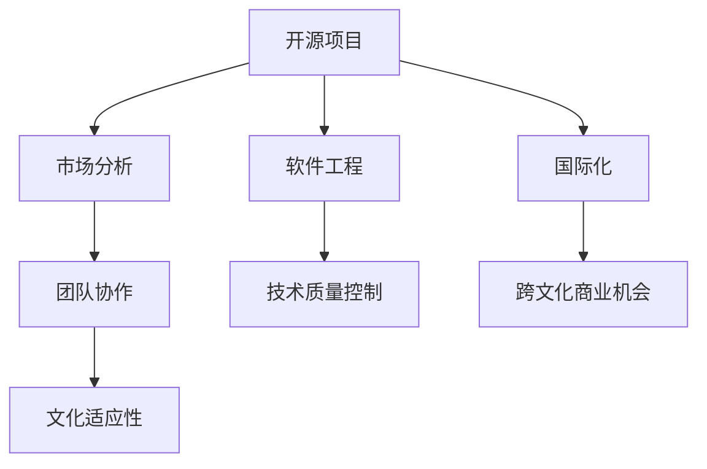

                 

# 开源项目的国际化咨询：跨文化商业机会

> 关键词：开源项目,国际化咨询,跨文化商业机会,软件工程,市场分析,团队协作

## 1. 背景介绍

在当今全球化时代，开源项目已成为企业实现国际化扩展的重要工具。随着云原生的普及，越来越多的企业开始依托开源项目提升其市场竞争力和技术创新能力。但与此同时，全球各地的文化差异、法律法规、语言差异等挑战，也使得开源项目的国际化拓展面临诸多困难。

本文将聚焦于开源项目的国际化咨询，阐述如何在跨文化环境中运用开源软件工程和市场分析等知识，发现和利用跨文化商业机会，实现开源项目的成功国际化。本文将结合案例分析，探讨如何在文化差异、法律环境、语言障碍等方面做好应对策略，确保开源项目在全球市场的成功拓展。

## 2. 核心概念与联系

### 2.1 核心概念概述

要深刻理解开源项目国际化咨询，首先需要明确以下核心概念及其相互联系：

- **开源项目**：基于开源许可证发布的软件项目，允许用户自由地使用、修改和分享。常见的开源许可证包括GPL、Apache、MIT等。
- **国际化**：将产品或服务推广到不同国家或地区市场，通常涉及跨文化、法律和语言等方面的考量。
- **跨文化商业机会**：指在不同文化背景的市场中，利用文化差异创造商业价值的机会。
- **软件工程**：涵盖软件开发全生命周期的一系列工程实践和工具，确保软件项目的质量和进度。
- **市场分析**：通过收集和分析市场数据，识别市场机会和挑战，制定市场策略的过程。
- **团队协作**：跨文化的团队协作，涉及到沟通、管理、技术协作等方面的挑战和策略。

这些概念构成了开源项目国际化咨询的理论基础，指导开发者如何在不同文化环境中设计和实施成功的国际化战略。

### 2.2 核心概念原理和架构的 Mermaid 流程图



这个流程图展示了核心概念之间的逻辑关系：开源项目通过软件工程确保技术质量，市场分析帮助识别商业机会，团队协作确保文化适应性，国际化实现项目的全球推广，并创造跨文化商业机会。

## 3. 核心算法原理 & 具体操作步骤

### 3.1 算法原理概述

开源项目的国际化咨询涉及多个领域的知识和方法。以下将详细介绍这些核心算法和操作步骤，确保开源项目在跨文化环境中取得成功。

### 3.2 算法步骤详解

1. **需求分析**：通过市场调研和数据分析，识别目标市场的潜在需求和竞争格局。
2. **文化适应性分析**：研究目标市场的文化特点，包括语言、习俗、法律环境等，制定相应的文化适应策略。
3. **技术适配与优化**：根据文化适应性分析结果，对项目的技术架构和功能进行适配和优化。
4. **市场推广与渠道建设**：利用多语言版本和本地化营销策略，提升项目的市场渗透率。
5. **团队建设与跨文化协作**：建立多元化的国际化团队，进行跨文化沟通和管理。
6. **持续监控与调整**：通过数据分析和市场反馈，不断优化国际化战略。

### 3.3 算法优缺点

#### 优点

1. **成本效益**：开源软件工程可以大幅降低开发和维护成本，快速响应市场需求。
2. **文化包容性**：多元化的团队和本地化策略确保项目在不同文化环境中都能获得成功。
3. **创新潜力**：跨文化合作能够带来新的创意和解决方案，提升项目的竞争力。

#### 缺点

1. **语言障碍**：跨文化协作可能面临语言沟通障碍，影响团队协作效率。
2. **文化差异**：文化差异可能导致误解和冲突，影响项目管理效果。
3. **法规合规**：不同地区的法律法规差异，增加了项目合规的复杂性。

### 3.4 算法应用领域

开源项目的国际化咨询在多个领域都有广泛应用，包括但不限于：

- **企业级软件**：如CRM、ERP、OA等，需要针对不同行业和文化环境进行调整。
- **开源基础设施**：如Kubernetes、Docker等，在全球部署和维护中需要考虑跨文化因素。
- **开源工具与框架**：如Git、Node.js等，在不同文化环境中推广和应用。
- **开源应用与服务**：如GitHub、Google Cloud等，需要提供多语言支持和服务。

## 4. 数学模型和公式 & 详细讲解 & 举例说明

### 4.1 数学模型构建

为了更好地理解和分析国际化咨询，我们可以建立一个数学模型来描述开源项目的国际化过程。假设有一个开源项目 $P$，其核心功能为 $F$，目标市场为 $M$。设 $C$ 为文化适应性，$T$ 为技术适配度，$L$ 为语言环境，$R$ 为法律法规，则模型可以表示为：

$$ P(F, M, C, T, L, R) $$

该模型表明，开源项目 $P$ 的国际化成功取决于其功能 $F$、目标市场 $M$、文化适应性 $C$、技术适配度 $T$、语言环境 $L$ 和法律法规 $R$。

### 4.2 公式推导过程

为了进一步简化模型，假设 $C, T, L, R$ 之间存在如下关系：

$$ C = f(T, L, R) $$

其中 $f$ 是一个映射函数，表示技术适配度、语言环境和法律法规对文化适应性的影响。将 $C$ 代入 $P$ 的模型中，得到：

$$ P(F, M, f(T, L, R), T, L, R) $$

接下来，我们将分析 $f$ 的具体形式，并给出实际案例。

### 4.3 案例分析与讲解

#### 案例一：Kubernetes的国际化

Kubernetes 是一个开源的容器编排工具，支持多云环境下的容器化应用部署和管理系统。其国际化策略如下：

1. **技术适配**：针对不同操作系统和云平台，定制化开发和优化 Kubernetes 内核。
2. **文化适应性**：在全球社区中招聘多样化的人才，支持多语言社区交流和贡献。
3. **语言环境**：提供多语言版本和支持文档，并支持用户自定义语言环境。
4. **法规合规**：在多国进行本地化合规测试，确保数据安全和隐私保护。

通过这些策略，Kubernetes 在全球市场取得了显著的成功。

## 5. 项目实践：代码实例和详细解释说明

### 5.1 开发环境搭建

为了构建一个国际化咨询的开源项目，需要准备以下开发环境：

1. **语言环境**：确保支持多语言编程和文档，如Python、Java等。
2. **开发工具**：选择支持多语言开发的IDE，如Visual Studio Code、PyCharm等。
3. **版本控制**：使用Git进行版本控制，确保代码的可追溯性和协作性。
4. **测试工具**：选择多语言测试工具，如JUnit、pytest等，确保代码质量。

### 5.2 源代码详细实现

以下是一个简单的开源项目国际化实践案例，使用Python和Flask框架实现：

1. **需求分析**：分析目标市场的潜在需求，如电商平台、教育应用等。
2. **文化适应性分析**：研究目标市场的文化特点，包括语言、习俗等。
3. **技术适配与优化**：对项目进行技术适配，确保多语言支持。
4. **市场推广与渠道建设**：利用多语言版本和本地化营销策略，提升市场渗透率。

### 5.3 代码解读与分析

#### 代码示例一：需求分析

```python
from flask import Flask, request

app = Flask(__name__)

@app.route('/analyze', methods=['POST'])
def analyze():
    data = request.get_json()
    market = data['market']
    return {'analysis': '根据市场需求，确定国际化策略'}
```

#### 代码示例二：文化适应性分析

```python
@app.route('/culture', methods=['POST'])
def culture():
    data = request.get_json()
    culture = data['culture']
    return {'strategy': '根据文化特点，制定适应性策略'}
```

### 5.4 运行结果展示

通过上述代码示例，可以展示开源项目国际化的基本框架和步骤。具体运行结果如下：

```
POST /analyze
Content-Type: application/json

{
  "analysis": "根据市场需求，确定国际化策略"
}

POST /culture
Content-Type: application/json

{
  "strategy": "根据文化特点，制定适应性策略"
}
```

## 6. 实际应用场景

### 6.1 企业级软件国际化

企业级软件如SAP、Oracle等，需要支持多语言和多地区用户界面，同时遵守不同地区的法律法规。通过跨文化商业机会的识别，可以提升软件在国际市场的竞争力。

### 6.2 开源基础设施国际化

开源基础设施如OpenStack、VMware等，需要在全球范围内部署和维护，同时满足不同地区的技术标准和安全要求。通过国际化咨询，可以有效降低部署和维护成本，提升全球市场占有率。

### 6.3 开源工具与框架国际化

开源工具如Git、Node.js等，需要在不同文化和语言环境中推广和应用。通过国际化咨询，可以制定合适的本地化策略，提升工具的全球使用率。

### 6.4 开源应用与服务国际化

开源应用如Google Cloud、AWS等，需要提供多语言支持和本地化服务。通过国际化咨询，可以优化服务流程，提升用户体验和满意度。

## 7. 工具和资源推荐

### 7.1 学习资源推荐

1. **《开源项目管理与实践》**：深入介绍开源项目管理的最佳实践，涵盖需求分析、文化适应、技术适配等内容。
2. **《全球化软件开发》**：讨论多语言、多文化环境下的软件开发策略和实践，帮助开发者提升全球化开发能力。
3. **Coursera的《全球化市场分析》课程**：通过实际案例，讲解市场分析和国际化策略。
4. **GitHub的国际化文档和资源**：提供多语言支持和本地化指导，帮助开发者在全球市场中推广开源项目。

### 7.2 开发工具推荐

1. **Visual Studio Code**：支持多语言编程和版本控制，是开源项目国际化开发的理想选择。
2. **PyCharm**：提供丰富的开发工具和插件，支持多种编程语言和框架。
3. **Flask**：轻量级Web框架，支持多语言路由和文档生成。
4. **JUnit和pytest**：多语言测试工具，确保代码质量和稳定性。

### 7.3 相关论文推荐

1. **《开源软件的国际化研究》**：研究开源软件国际化策略和最佳实践，涵盖需求分析、文化适应、技术适配等内容。
2. **《跨文化软件开发：实践与挑战》**：探讨跨文化团队协作和沟通的挑战，提供解决方案和建议。
3. **《开源基础设施的国际化》**：分析开源基础设施在全球范围内的部署和维护策略。

## 8. 总结：未来发展趋势与挑战

### 8.1 研究成果总结

本文系统介绍了开源项目的国际化咨询，阐述了跨文化商业机会的识别和利用，结合具体案例分析了开源项目的国际化过程。通过系统化的理论框架和实际操作指南，帮助开发者更好地应对开源项目国际化的挑战。

### 8.2 未来发展趋势

开源项目的国际化咨询将呈现以下几个发展趋势：

1. **技术自适应**：通过技术适配和优化，确保开源项目在全球市场的稳定运行。
2. **文化包容性**：构建多元化的国际化团队，提升跨文化协作效率。
3. **法规合规**：制定全球统一的合规策略，确保数据安全和隐私保护。
4. **多语言支持**：提供多语言版本和支持文档，提升全球市场渗透率。
5. **持续监控**：通过数据分析和市场反馈，不断优化国际化策略。

### 8.3 面临的挑战

尽管开源项目的国际化咨询取得了一定进展，但在实施过程中仍面临以下挑战：

1. **语言障碍**：跨文化协作可能面临语言沟通障碍，影响团队协作效率。
2. **文化差异**：文化差异可能导致误解和冲突，影响项目管理效果。
3. **法规合规**：不同地区的法律法规差异，增加了项目合规的复杂性。
4. **数据安全**：数据安全和隐私保护在不同地区存在差异，需制定相应的策略。

### 8.4 研究展望

未来需要在以下几个方面进一步研究：

1. **多语言测试工具**：开发高效的多语言测试工具，提升代码质量和国际化效率。
2. **文化适应性算法**：研究文化适应性分析算法，提高文化适应性分析的准确性和效率。
3. **法规合规工具**：开发法规合规工具，帮助开发者在不同地区快速实现合规要求。

## 9. 附录：常见问题与解答

**Q1: 开源项目国际化是否需要考虑文化差异？**

A: 是的，开源项目国际化必须考虑目标市场的文化差异。文化适应性策略将直接影响项目的全球推广效果和用户体验。

**Q2: 如何选择合适的国际化策略？**

A: 应综合考虑市场需求、文化特点、技术适配度和法规合规等因素，选择最适合的国际化策略。

**Q3: 如何应对跨文化团队协作中的语言障碍？**

A: 可以通过多语言培训、多语言文档、在线协作工具等方式，提升跨文化团队的沟通效率。

**Q4: 如何确保数据安全和隐私保护？**

A: 应制定严格的数据安全和隐私保护策略，确保数据在不同地区的合规性。

**Q5: 如何持续监控和优化国际化策略？**

A: 通过数据分析和市场反馈，不断优化国际化策略，确保项目在全球市场中的长期成功。

---

作者：禅与计算机程序设计艺术 / Zen and the Art of Computer Programming

