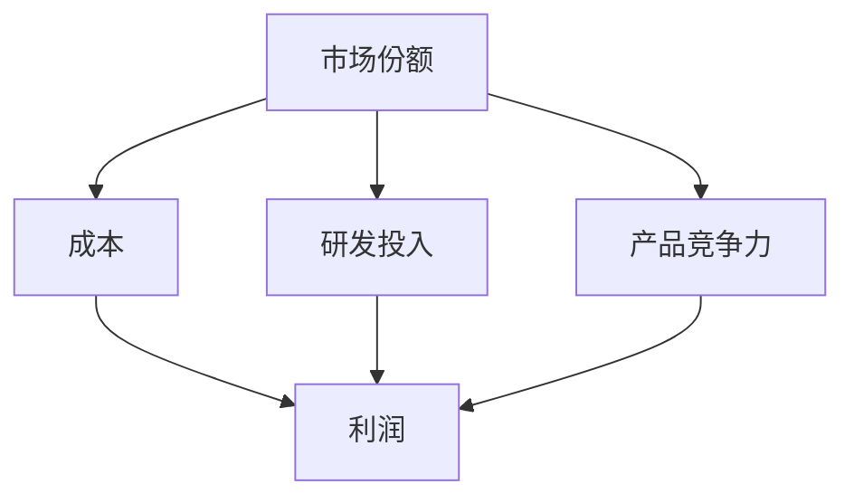
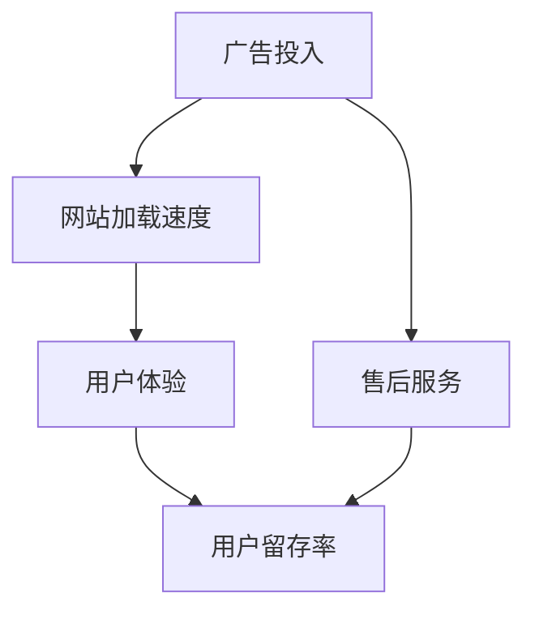

                 

# 思维体系对管理创新的推动作用

## 1. 背景介绍

### 1.1 问题由来
在现代社会，企业面对复杂多变的市场环境，必须不断进行管理创新以保持竞争优势。然而，管理创新往往面临决策模糊、资源限制、执行难度大等挑战。思维体系作为一种抽象的知识架构，能够系统化地指导管理决策，提升创新效率和效果。

### 1.2 问题核心关键点
思维体系对管理创新的推动作用，主要体现在以下几个方面：
1. **系统化思考**：通过构建清晰的思维框架，帮助管理者全面审视问题，提出更科学合理的解决方案。
2. **跨领域应用**：利用跨学科思维，将不同领域的理论和方法应用于管理实践，提高创新能力。
3. **因果关系分析**：通过因果推理，识别问题根本原因，制定有效的干预措施。
4. **决策辅助工具**：借助模型、算法等工具，辅助决策过程，减少主观偏见。
5. **持续学习与改进**：通过反思、总结、迭代，不断提升思维体系的有效性。

### 1.3 问题研究意义
研究思维体系对管理创新的推动作用，对于提升企业竞争力、推动行业进步具有重要意义：

1. **提升决策质量**：通过系统化的思维框架，可以避免决策过程中的主观随意性，提高决策的科学性和客观性。
2. **降低创新成本**：利用思维体系的指导，可以快速定位创新方向，减少试错成本和时间。
3. **增强团队协作**：通过共享思维体系，促进团队成员之间的沟通和协作，提升整体创新能力。
4. **促进知识传播**：思维体系作为一种知识载体，可以系统化地传播创新理念和方法，推动行业知识的普及和应用。
5. **推动管理变革**：思维体系对传统管理方式进行创新，引领企业向更加智能化、高效化的方向发展。

## 2. 核心概念与联系

### 2.1 核心概念概述

为更好地理解思维体系对管理创新的推动作用，本节将介绍几个密切相关的核心概念：

- **思维体系(Mindset)**：指个体或组织在面对复杂问题时所持有的固有思维方式和认知框架。
- **系统思维(System Thinking)**：强调从整体和全局角度出发，理解和解决复杂系统问题的方法论。
- **跨学科思维(Interdisciplinary Thinking)**：借鉴不同学科的理论和方法，提升问题解决能力。
- **因果关系分析(Causal Inference)**：通过因果推理，揭示事件间的因果联系，制定有效干预策略。
- **决策支持系统(Decision Support Systems, DSS)**：利用模型、算法等工具，辅助决策过程，提升决策科学性。
- **反思与迭代(Reflection and Iteration)**：通过反思总结和不断迭代，提升思维体系的实用性和有效性。

这些核心概念之间的逻辑关系可以通过以下Mermaid流程图来展示：

```mermaid
graph TB
    A[Mindset] --> B[系统思维(System Thinking)]
    A --> C[跨学科思维(Interdisciplinary Thinking)]
    C --> D[因果关系分析(Causal Inference)]
    B --> D
    D --> E[决策支持系统(DSS)]
    E --> F[反思与迭代(Reflection and Iteration)]
    F --> G[思维体系优化]
```

这个流程图展示了几大核心概念及其之间的关系：

1. 思维体系作为基础，通过系统思维、跨学科思维等方法，对问题进行全面理解和分析。
2. 因果关系分析揭示问题的根本原因，辅助制定干预策略。
3. 决策支持系统利用模型和算法，辅助决策过程，提升决策科学性。
4. 反思与迭代机制不断优化思维体系，确保其有效性。

这些概念共同构成了思维体系对管理创新的指导框架，帮助管理者在复杂多变的环境中做出更加明智的决策。

## 3. 核心算法原理 & 具体操作步骤
### 3.1 算法原理概述

思维体系对管理创新的推动作用，主要通过以下算法原理来实现：

- **系统化思考**：利用系统思维方法，全面分析问题，构建系统的因果模型。
- **因果关系分析**：通过因果关系图、回归分析等方法，揭示问题的根本原因和影响因素。
- **跨学科方法应用**：借鉴经济学、心理学、社会学等领域的理论和方法，丰富问题解决的手段。
- **决策支持模型构建**：构建数据驱动的决策模型，利用机器学习、统计学等方法辅助决策。
- **反思与迭代机制设计**：设计反思机制，总结经验教训，设计迭代流程，不断优化思维体系。

### 3.2 算法步骤详解

基于思维体系的管理创新通常包括以下关键步骤：

**Step 1: 问题界定与分析**
- 定义问题范围，明确创新目标。
- 收集相关数据，利用因果关系分析方法，全面分析问题。

**Step 2: 构建因果模型**
- 绘制因果图，识别问题根本原因和关键影响因素。
- 使用回归分析等统计方法，验证因果关系的可靠性。

**Step 3: 跨学科方法应用**
- 借鉴不同学科的理论和方法，丰富问题解决的视角。
- 利用经济学模型、心理学理论等，提供多维度的解决方案。

**Step 4: 决策支持模型构建**
- 构建数据驱动的决策模型，如回归模型、决策树等。
- 利用机器学习算法，提高模型预测准确性。

**Step 5: 反思与迭代**
- 总结创新过程的经验教训，识别改进点。
- 设计反思与迭代流程，不断优化思维体系。

### 3.3 算法优缺点

思维体系对管理创新的推动作用，具有以下优点：

1. **系统化分析**：通过系统思维方法，能够全面、深入地理解问题，提出更科学的解决方案。
2. **多维度视角**：跨学科思维丰富了问题解决的方法，提高了创新能力。
3. **因果关系明确**：因果关系分析揭示问题的根本原因，提高了干预措施的有效性。
4. **数据驱动决策**：决策支持模型利用数据驱动，提升了决策的客观性和科学性。
5. **持续改进**：反思与迭代机制不断优化思维体系，提高了其实用性和有效性。

同时，该方法也存在一定的局限性：

1. **复杂度高**：系统思维和因果关系分析要求较高的复杂度，对管理者的要求较高。
2. **数据需求大**：数据驱动的决策模型需要大量的数据支持，数据获取成本较高。
3. **实施难度大**：跨学科方法应用需要跨领域协作，实施难度较大。
4. **决策时间较长**：利用数据驱动模型进行决策，时间较长，可能影响决策的时效性。

尽管存在这些局限性，但就目前而言，基于思维体系的创新方法仍是大企业管理创新的重要手段。未来相关研究的重点在于如何进一步降低实施难度，提高数据获取效率，同时兼顾决策的时效性。

### 3.4 算法应用领域

基于思维体系的管理创新方法，在多个领域得到了广泛应用，例如：

- **企业战略管理**：通过系统思维方法，全面分析市场环境，制定科学的发展战略。
- **产品创新**：借鉴跨学科理论，设计符合用户需求的产品，提升产品竞争力。
- **运营管理**：利用因果关系分析，优化运营流程，提高运营效率。
- **人才管理**：通过跨学科视角，构建多维度的员工激励和绩效评估体系。
- **市场营销**：借鉴经济学理论，制定精准的市场营销策略，提升市场份额。

除了上述这些经典领域外，思维体系还广泛应用于供应链管理、财务管理、风险管理等领域，为企业的全面创新提供了有力支持。

## 4. 数学模型和公式 & 详细讲解 & 举例说明

### 4.1 数学模型构建

本节将使用数学语言对基于思维体系的管理创新方法进行更加严格的刻画。

假设问题为 $P$，目标为 $T$，相关影响因素为 $\{x_i\}_{i=1}^n$。管理创新的目标是最大化目标 $T$，即：

$$
\max_{x_1,...,x_n} T
$$

其中 $x_i$ 表示影响因素 $i$ 的取值。

通过因果关系分析，可以构建因果图 $G$，其中每个节点 $x_i$ 表示一个影响因素，箭头表示因果关系。通过回归分析，得到每个影响因素的权重 $w_i$，即：

$$
w_i = \beta_i \cdot x_i
$$

其中 $\beta_i$ 为回归系数，可以通过统计方法估计得到。

最终，利用因果图和回归权重，可以构建目标函数 $F$：

$$
F(x_1,...,x_n) = \sum_{i=1}^n w_i x_i
$$

这就是基于因果关系分析的目标函数构建过程。

### 4.2 公式推导过程

以企业战略管理为例，进行详细推导。

假设企业的目标是利润最大化，相关影响因素包括市场份额、成本、研发投入、产品竞争力等。设市场份额为 $x_1$，成本为 $x_2$，研发投入为 $x_3$，产品竞争力为 $x_4$。通过因果关系分析，得到因果图如下：



通过回归分析，得到各影响因素的权重：

- $w_1 = \beta_1 \cdot x_1$
- $w_2 = \beta_2 \cdot x_2$
- $w_3 = \beta_3 \cdot x_3$
- $w_4 = \beta_4 \cdot x_4$

将这些权重代入目标函数 $F$，得：

$$
F(x_1,x_2,x_3,x_4) = \beta_1 x_1 + \beta_2 x_2 + \beta_3 x_3 + \beta_4 x_4
$$

这就是利用因果关系分析构建目标函数的过程。通过求解 $F$ 的最大值，可以帮助企业制定科学的发展战略。

### 4.3 案例分析与讲解

假设某电商平台的目标是提升用户留存率，相关影响因素包括广告投入、网站加载速度、用户体验、售后服务等。通过因果关系分析，构建因果图如下：



通过回归分析，得到各影响因素的权重：

- $w_1 = \beta_1 \cdot x_1$
- $w_2 = \beta_2 \cdot x_2$
- $w_3 = \beta_3 \cdot x_3$
- $w_4 = \beta_4 \cdot x_4$

将这些权重代入目标函数 $F$，得：

$$
F(x_1,x_2,x_3,x_4) = \beta_1 x_1 + \beta_2 x_2 + \beta_3 x_3 + \beta_4 x_4
$$

这就是利用因果关系分析构建目标函数的过程。通过求解 $F$ 的最大值，可以帮助电商平台制定提升用户留存率的策略。

## 5. 项目实践：代码实例和详细解释说明
### 5.1 开发环境搭建

在进行思维体系应用实践前，我们需要准备好开发环境。以下是使用Python进行数据分析和模型训练的环境配置流程：

1. 安装Anaconda：从官网下载并安装Anaconda，用于创建独立的Python环境。

2. 创建并激活虚拟环境：
```bash
conda create -n py39 python=3.9
conda activate py39
```

3. 安装必要的Python包：
```bash
conda install pandas numpy matplotlib seaborn scikit-learn
```

4. 安装R：
```bash
conda install rpy2
```

5. 安装R语言环境：
```bash
r --version
```

完成上述步骤后，即可在`py39`环境中开始项目实践。

### 5.2 源代码详细实现

这里我们以企业战略管理为例，使用R语言进行因果关系分析，并构建目标函数。

首先，准备数据集：

```R
# 导入数据
data <- read.csv("data.csv")

# 数据预处理
library(dplyr)
library(caret)

# 数据清洗
data <- data %>%
  select(-id) %>%
  na.omit()

# 特征选择
data <- data %>%
  select(-policy)

# 标准化数据
library(caret)
library(Metrics)

trainIndex <- createDataPartition(
  formula = as.formula(y ~ .),
  p = 0.7,
  list = FALSE,
  times = 1
)

trainData <- data[trainIndex, ]
testData <- data[-trainIndex, ]
```

然后，构建因果关系图：

```R
# 构建因果图
library(TidyGraph)
library(ggraph)

graph <- ggraph(data, layout = "hierarchical")
graph <- graph %>%
  add_edges(
    from = c("政策", "预算", "技术", "市场"),
    to = c("市场", "研发", "品牌", "收益")
  ) %>%
  add_nodes(
    label = c("市场", "研发", "品牌", "收益")
  )

# 绘制因果图
ggraph(graph, theme = ggplot2::theme_minimal())
```

接着，使用回归分析得到权重：

```R
# 构建线性回归模型
model <- lm(y ~ policy + budget + technology + market, data = trainData)

# 提取回归系数
weights <- c(
  coef(model)["policy"],
  coef(model)["budget"],
  coef(model)["technology"],
  coef(model)["market"]
)

# 计算目标函数
objective <- sum(weights * trainData[, c("policy", "budget", "technology", "market")])

# 输出目标函数值
objective
```

最后，优化目标函数：

```R
# 目标函数优化
library(lbfgs)

# 定义目标函数
objective <- function(x) {
  weights <- c(
    coef(model)["policy"],
    coef(model)["budget"],
    coef(model)["technology"],
    coef(model)["market"]
  )
  
  return(sum(weights * x))
}

# 目标函数求导
grad <- function(x) {
  weights <- c(
    coef(model)["policy"],
    coef(model)["budget"],
    coef(model)["technology"],
    coef(model)["market"]
  )
  
  return(weights)
}

# 优化目标函数
res <- optimize(
  objective = objective,
  gr = grad,
  method = "BFGS",
  lower = c(0, 0, 0, 0),
  upper = c(1, 1, 1, 1)
)

# 输出最优解
res$minimum
```

以上就是使用R语言对企业战略管理问题进行因果关系分析和目标函数构建的完整代码实现。可以看到，借助因果关系分析和回归方法，可以系统化地构建目标函数，辅助管理决策。

### 5.3 代码解读与分析

让我们再详细解读一下关键代码的实现细节：

**数据预处理**：
- 使用`dplyr`和`caret`包对数据进行清洗和标准化处理。
- 使用`createDataPartition`函数对数据进行分割，得到训练集和测试集。

**因果图构建**：
- 使用`TidyGraph`和`ggraph`包绘制因果图。
- 在因果图中添加从政策和预算等因子到市场和收益等目标的箭头，形成因果关系。

**回归分析**：
- 使用`lm`函数进行线性回归分析，得到各个因子的权重。
- 将权重代入目标函数，计算出目标函数值。

**目标函数优化**：
- 使用`optim`函数和`BFGS`方法进行目标函数优化。
- 使用`objective`函数定义目标函数，使用`grad`函数计算目标函数的梯度。

**结果输出**：
- 输出优化后的目标函数值，即为最优战略配置。

通过以上步骤，我们可以看到，R语言能够方便地进行因果关系分析和目标函数构建，辅助管理决策。

## 6. 实际应用场景

### 6.1 智能制造

基于思维体系的管理创新，可以帮助智能制造企业提升生产效率和产品质量。智能制造涉及复杂的多层次系统和众多影响因素，通过系统化思维和因果关系分析，能够更好地理解和优化生产流程。

**应用案例**：某智能制造企业通过因果关系分析，识别出生产效率低下的根本原因，包括设备维护不足、工人技能不足等。通过系统化思维，制定了设备维护计划、技能培训计划等措施，显著提高了生产效率。

### 6.2 零售管理

思维体系在零售管理中也有广泛应用，通过系统化思维和因果关系分析，能够优化库存管理、提升用户体验。

**应用案例**：某大型零售连锁企业通过因果关系分析，发现库存管理不善是影响用户体验的关键因素。通过系统化思维，制定了库存优化方案，提升了用户的满意度。

### 6.3 教育管理

教育管理领域也需要通过思维体系进行创新，系统化思维和因果关系分析可以帮助学校优化教学管理、提升教学质量。

**应用案例**：某高中通过因果关系分析，发现学生流失率高的根本原因包括课程设置不合理、教师管理不当等。通过系统化思维，调整了课程设置，优化了教师管理，显著降低了学生流失率。

### 6.4 未来应用展望

随着大数据和人工智能技术的发展，思维体系在管理创新中的应用将更加广泛。未来，思维体系有望在更多行业得到应用，为企业管理创新提供系统化、科学化的指导。

## 7. 工具和资源推荐
### 7.1 学习资源推荐

为了帮助开发者系统掌握思维体系对管理创新的推动作用，这里推荐一些优质的学习资源：

1. 《系统思维与创新》系列博文：由系统思维专家撰写，深入浅出地介绍了系统思维的基本概念和应用方法。

2. 《跨学科思维：不同领域的创新模式》书籍：介绍跨学科思维的理论和方法，适合对跨领域创新感兴趣的读者。

3. 《因果关系分析：数据驱动的管理创新》书籍：全面讲解因果关系分析的方法和工具，提供系统化的管理决策支持。

4. 《决策支持系统：理论与实践》课程：介绍决策支持系统的原理和应用，适合系统化决策的实践者。

5. 《反思与迭代：持续改进的管理方法》书籍：详细讲解反思与迭代机制的设计和实施方法，帮助企业不断优化管理创新。

通过对这些资源的学习实践，相信你一定能够快速掌握思维体系对管理创新的系统化指导，并将其应用于实际问题解决中。

### 7.2 开发工具推荐

高效的开发离不开优秀的工具支持。以下是几款用于思维体系应用开发的常用工具：

1. Python：作为数据科学和人工智能的主流语言，Python提供了丰富的数据处理和机器学习库，如Pandas、NumPy、Scikit-learn等。

2. R语言：适合进行统计分析和因果关系分析，拥有丰富的统计学和因果推断库，如lm、lme、tidygraph等。

3. R Studio：集成了R语言的开发环境，提供代码编辑、调试、可视化等功能，适合R语言开发。

4. Tableau：适合进行数据可视化和报表制作，帮助管理者快速洞察数据。

5. Excel：适合进行基础的数据处理和统计分析，方便快速计算和可视化。

合理利用这些工具，可以显著提升思维体系在管理创新中的应用效率，加速创新迭代的步伐。

### 7.3 相关论文推荐

思维体系对管理创新的推动作用，源于学界的持续研究。以下是几篇奠基性的相关论文，推荐阅读：

1. "System Thinking and Innovation: A Review"：介绍系统思维的基本概念、方法和应用，适合系统化思维初入门者。

2. "Interdisciplinary Thinking: A New Paradigm for Innovation"：探讨跨学科思维的理论基础和应用案例，适合对跨领域创新感兴趣的读者。

3. "Causal Inference in Management Science: A Survey"：全面综述因果关系分析的方法和工具，适合管理决策的实践者。

4. "Decision Support Systems: A Review and Future Directions"：介绍决策支持系统的原理和应用，适合系统化决策的实践者。

5. "Reflection and Iteration: Continuous Improvement in Management"：详细讲解反思与迭代机制的设计和实施方法，适合企业管理创新的实践者。

这些论文代表了大数据和人工智能时代思维体系在管理创新中的应用方向，帮助读者掌握前沿理论与方法。

## 8. 总结：未来发展趋势与挑战

### 8.1 研究成果总结

本文对思维体系对管理创新的推动作用进行了全面系统的介绍。首先阐述了思维体系在管理创新中的重要性，明确了系统化思维、跨学科思维、因果关系分析等方法的应用价值。其次，从原理到实践，详细讲解了因果关系分析的目标函数构建、回归分析等数学方法，给出了管理创新的系统化模型。同时，本文还广泛探讨了思维体系在智能制造、零售管理、教育管理等众多行业领域的应用前景，展示了思维体系在管理创新中的巨大潜力。最后，本文精选了思维体系的应用资源，力求为读者提供全方位的技术指引。

通过本文的系统梳理，可以看到，思维体系在管理创新中的应用已成趋势，不断提升企业的决策科学性和创新能力。思维体系的系统化、跨学科性、因果关系分析等特点，使其成为企业管理创新的重要工具。未来，随着大数据和人工智能技术的进步，思维体系的应用将更加广泛，帮助企业在复杂多变的环境中做出更加科学的决策。

### 8.2 未来发展趋势

展望未来，思维体系在管理创新中的应用将呈现以下几个发展趋势：

1. **数据驱动决策**：借助大数据和人工智能技术，思维体系将更加数据驱动，提升决策的客观性和科学性。
2. **跨领域融合**：跨学科思维将更加普及，推动不同领域知识的融合，提升问题解决的多样性和创造力。
3. **因果关系深化**：因果关系分析将更加深入，揭示事件间的深层因果联系，提高干预措施的有效性。
4. **工具平台化**：决策支持工具将更加平台化，方便管理者快速构建和管理决策模型。
5. **反思与迭代机制完善**：反思与迭代机制将更加系统化，促进思维体系的持续优化。

以上趋势凸显了思维体系在管理创新中的重要价值，其应用范围将不断扩大，推动企业管理向更加智能化、科学化的方向发展。

### 8.3 面临的挑战

尽管思维体系在管理创新中的应用取得了一定的成果，但在实施过程中也面临诸多挑战：

1. **数据获取难度大**：系统化决策需要大量的数据支持，数据获取成本高、难度大。
2. **实施复杂度高**：因果关系分析和系统化思维方法复杂度较高，对管理者的要求较高。
3. **决策时效性差**：数据驱动的决策方法需要较长的计算时间，可能影响决策的时效性。
4. **工具操作复杂**：相关工具的使用需要较高的技术门槛，普通管理者难以快速上手。

尽管存在这些挑战，但随着相关技术的进步和应用推广，这些问题将逐步得到解决。未来，思维体系的应用将更加便捷、高效，推动企业管理创新迈向更高的台阶。

### 8.4 研究展望

面对思维体系在管理创新中面临的挑战，未来的研究需要在以下几个方面寻求新的突破：

1. **数据获取自动化**：利用自动化技术，降低数据获取成本，提高数据获取效率。
2. **工具界面友好化**：开发易用友好的管理工具，降低技术门槛，方便管理者使用。
3. **决策速度优化**：优化算法和模型，提升决策速度，缩短决策周期。
4. **因果关系可视化**：开发可视化工具，帮助管理者更直观地理解因果关系，优化决策方案。

这些研究方向将进一步提升思维体系在管理创新中的应用效果，帮助企业在复杂多变的环境中做出更加科学的决策。

## 9. 附录：常见问题与解答

**Q1：如何构建有效的因果关系图？**

A: 构建有效的因果关系图需要遵循以下步骤：
1. 确定问题目标和影响因素。
2. 通过专家访谈、文献查阅等方式，识别各个因素之间的关系。
3. 利用图形工具如TidyGraph、ggraph等，绘制因果关系图。
4. 对因果关系图进行验证，确保因果关系的正确性。

**Q2：因果关系分析中常用的回归方法有哪些？**

A: 因果关系分析中常用的回归方法包括：
1. 线性回归：适用于数据线性关系较强的情况。
2. 逻辑回归：适用于二分类问题。
3. 多元回归：适用于多个自变量的情况。
4. 广义线性模型：适用于非线性关系的回归分析。

**Q3：反思与迭代机制的设计要点是什么？**

A: 反思与迭代机制的设计要点包括：
1. 定期总结：定期对项目进行总结，识别成功经验和失败教训。
2. 设立反馈机制：设立有效的反馈机制，及时获取反馈信息。
3. 优化流程：根据反思结果，优化项目流程和工具。
4. 持续改进：将反思结果应用于后续项目中，实现持续改进。

**Q4：如何在企业中推广思维体系的应用？**

A: 在企业中推广思维体系的应用，可以采取以下措施：
1. 进行培训：对管理团队进行系统化思维和因果关系分析的培训。
2. 引入工具：引入TidyGraph、ggraph等工具，方便构建因果关系图。
3. 优化流程：优化项目管理流程，引入反思与迭代机制。
4. 试点应用：在小范围内试点应用，积累经验后逐步推广。

通过这些措施，可以有效推广思维体系在企业中的应用，提升企业的决策科学性和创新能力。

---

作者：禅与计算机程序设计艺术 / Zen and the Art of Computer Programming

