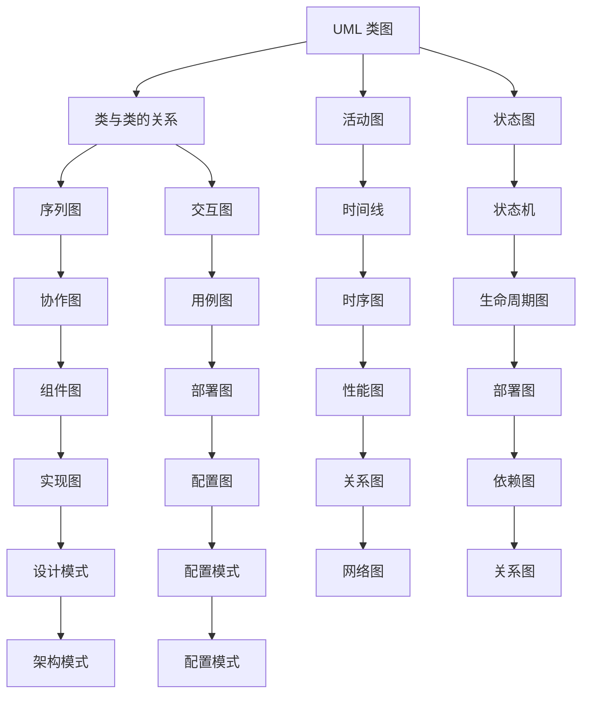

                 

# 思维可视化：复杂概念的图形表达

在现代社会，信息爆炸已经成为常态。在复杂的知识体系、技术栈、业务流程中，如何高效理解和传递信息，成为了一个关键问题。思维可视化，作为一种图形表达手段，能够将复杂概念以图形化的方式直观呈现，帮助人们更好地理解、记忆、交流和应用。本文将深入探讨思维可视化的原理、方法和应用场景，希望能为技术爱好者、从业者及管理者提供有益的参考。

## 1. 背景介绍

### 1.1 问题由来

现代信息技术的飞速发展带来了海量的数据和复杂的技术体系。在软件开发、项目管理、数据分析等领域，越来越需要高效的图形表达手段。复杂概念的理解和传递需要借助图形化的方式，帮助人们快速获取关键信息。

### 1.2 问题核心关键点

- 图形表达：将复杂信息通过图形化的方式直观展示，便于理解。
- 信息传递：通过图形传达关键信息，帮助他人理解和应用。
- 高效学习：借助图形化的信息传递，加快学习和记忆速度。

这些核心关键点展示了思维可视化的重要性和广泛应用前景。通过图形化的表达方式，可以有效提升信息传递的效率和效果。

### 1.3 问题研究意义

- 提升理解效率：通过视觉化的信息呈现，帮助人们快速理解复杂概念。
- 促进知识传播：图形表达易于理解和记忆，帮助知识的传播和分享。
- 辅助决策制定：图形化展示的信息可以帮助决策者直观把握关键要素，做出快速判断。

这些研究意义表明，思维可视化不仅是一种技术手段，更是提升工作效率和决策质量的利器。

## 2. 核心概念与联系

### 2.1 核心概念概述

思维可视化是指将复杂概念以图形化的方式直观展示，帮助人们理解、记忆和应用的一种技术手段。常见的思维可视化方法包括UML图、流程图、思维导图示例等。

### 2.2 核心概念原理和架构的 Mermaid 流程图



### 2.3 核心概念原理和架构的详细说明

- **UML类图**：展示类与类之间的关系，包括继承、关联、聚合、组合等。
- **活动图**：描述业务流程中的活动和控制流，帮助理解系统的功能和操作。
- **状态图**：展示系统或组件的状态变化过程，帮助理解系统行为。
- **序列图**：展示系统间消息的传递过程和交互顺序，帮助理解系统通信。
- **协作图**：展示组件间协作关系和消息传递，帮助理解系统架构。
- **用例图**：展示系统功能的使用场景和操作者，帮助理解系统目的。
- **时序图**：展示系统内各个组件的消息传递和操作时间，帮助理解系统操作流程。
- **状态机**：展示系统或组件的状态转换过程，帮助理解系统行为。
- **组件图**：展示系统组件及其依赖关系，帮助理解系统架构。
- **部署图**：展示系统组件在物理或逻辑上的部署情况，帮助理解系统部署。
- **性能图**：展示系统性能指标和度量，帮助理解系统性能。
- **网络图**：展示系统网络拓扑和通信路径，帮助理解系统网络。
- **依赖图**：展示组件间依赖关系，帮助理解系统依赖。
- **架构模式**：展示系统架构设计模式，帮助理解系统设计。
- **配置模式**：展示系统配置设计模式，帮助理解系统配置。
- **实现图**：展示系统组件的实现细节，帮助理解系统实现。
- **配置图**：展示系统配置和资源使用情况，帮助理解系统配置。
- **关系图**：展示系统间的关系，帮助理解系统关系。
- **设计模式**：展示系统设计模式，帮助理解系统设计。

这些核心概念构成了思维可视化的基础，通过它们可以更有效地理解复杂概念。

## 3. 核心算法原理 & 具体操作步骤

### 3.1 算法原理概述

思维可视化是一种图形表达方式，通过将复杂概念转化为图形，帮助人们理解和记忆。其核心原理包括以下几点：

- **简化复杂概念**：将复杂概念简化为几个关键点，通过图形表达。
- **构建可视化结构**：构建图形结构，帮助理解各部分之间的关系。
- **交互式展示**：通过交互式展示，帮助用户深入理解。

### 3.2 算法步骤详解

1. **需求分析**：确定需要可视化的复杂概念及其关键要素。
2. **选择工具**：选择合适的可视化工具，如UML工具、思维导图软件等。
3. **图形设计**：设计图形结构，包括节点、连线和颜色等。
4. **数据录入**：将复杂概念的关键要素录入到图形中。
5. **交互式展示**：开发交互式展示界面，方便用户操作。

### 3.3 算法优缺点

#### 优点：
- **直观易懂**：图形化表达直观，易于理解。
- **信息传递快**：图形化信息传递速度快，便于快速交流。
- **记忆效果好**：图形化信息有助于记忆，提升学习效率。

#### 缺点：
- **制作成本高**：图形化表达需要制作成本，可能耗时较长。
- **灵活性不足**：图形化表达相对固定，难以适应复杂变化。
- **学习曲线陡峭**：初学者可能需要一定时间掌握图形化表达技巧。

### 3.4 算法应用领域

思维可视化技术广泛应用于以下领域：

- **软件开发**：展示类图、时序图、部署图等，帮助开发者理解系统架构和设计。
- **项目管理**：展示活动图、状态图、协作图等，帮助项目管理者和团队成员理解项目流程和任务。
- **数据分析**：展示数据流图、关系图、网络图等，帮助数据分析师理解数据流和数据关系。
- **医疗诊断**：展示器官图、病理图等，帮助医生和研究人员理解病情和治疗方案。
- **城市规划**：展示城市网络图、交通图等，帮助城市规划师理解城市结构和交通布局。
- **商业分析**：展示业务流程图、价值链图等，帮助商业分析师理解业务流程和价值链。

## 4. 数学模型和公式 & 详细讲解 & 举例说明

### 4.1 数学模型构建

思维可视化的数学模型主要关注图形结构的设计和信息传递的有效性。以UML类图为例，其数学模型如下：

- **节点表示类**：节点表示类，节点之间通过关系表示继承、关联等。
- **边表示关系**：边表示类之间的关系，如继承关系、关联关系等。
- **属性表示类属性**：节点属性表示类的属性。

### 4.2 公式推导过程

假设有一个简单的类图，包含A、B、C三个类，它们之间的关系如下：

- A类继承自B类。
- A类与C类关联。

其UML类图如下：

```mermaid
graph TB
    A[A] --> B[B] "继承"
    A[->] C[C] "关联"
```

根据UML类图的定义，我们可以将其数学模型表示为：

- 节点集合：{A, B, C}
- 边集合：{"继承"(A, B), "关联"(A, C)}
- 属性集合：{属性A, 属性B, 属性C}

### 4.3 案例分析与讲解

以一个简单的电商系统为例，展示如何用UML类图表达其架构。

- **用户类**：属性：id、姓名、邮箱；方法：登录、注册。
- **商品类**：属性：id、名称、价格；方法：浏览、购买。
- **订单类**：属性：id、用户、商品、状态；方法：下单、支付、配送。

其UML类图如下：

```mermaid
graph TB
    A[用户类] --> B[商品类] "浏览"
    A[->] C[订单类] "下单"
    C[->] B "购买"
    B[->] A "支付"
```

该UML类图展示了用户类与商品类、订单类之间的关系。通过图形化的表达方式，直观展示了系统的架构和功能。

## 5. 项目实践：代码实例和详细解释说明

### 5.1 开发环境搭建

使用Python开发可视化工具，需要以下环境：

- **Python环境**：安装Python 3.x版本，推荐使用Anaconda。
- **图形库**：安装matplotlib、pandas、numpy等图形和数据分析库。
- **开发工具**：安装Jupyter Notebook、PyCharm等开发工具。

### 5.2 源代码详细实现

以下是使用Python和Matplotlib实现一个简单的UML类图的示例代码：

```python
import matplotlib.pyplot as plt

class User:
    def __init__(self, id, name, email):
        self.id = id
        self.name = name
        self.email = email

    def login(self):
        print(f"User {self.name} is logging in.")

class Product:
    def __init__(self, id, name, price):
        self.id = id
        self.name = name
        self.price = price

    def browse(self):
        print(f"User browsed product {self.name}.")

class Order:
    def __init__(self, id, user, product, status):
        self.id = id
        self.user = user
        self.product = product
        self.status = status

    def place_order(self):
        print(f"User placed order for product {self.product.name}.")

    def pay(self):
        print(f"User paid for order {self.id}.")

    def deliver(self):
        print(f"Order {self.id} is being delivered.")

# 创建类图
plt.figure(figsize=(8, 6))

# 用户类节点
plt.subplot(2, 2, 1)
plt.title("User Class")
plt.text(0.5, 0.5, "User", fontsize=12, fontweight="bold")
plt.text(0.2, 0.3, "id", fontsize=10)
plt.text(0.4, 0.3, "name", fontsize=10)
plt.text(0.7, 0.3, "email", fontsize=10)

# 商品类节点
plt.subplot(2, 2, 2)
plt.title("Product Class")
plt.text(0.5, 0.5, "Product", fontsize=12, fontweight="bold")
plt.text(0.2, 0.3, "id", fontsize=10)
plt.text(0.4, 0.3, "name", fontsize=10)
plt.text(0.7, 0.3, "price", fontsize=10)

# 订单类节点
plt.subplot(2, 2, 3)
plt.title("Order Class")
plt.text(0.5, 0.5, "Order", fontsize=12, fontweight="bold")
plt.text(0.2, 0.3, "id", fontsize=10)
plt.text(0.4, 0.3, "user", fontsize=10)
plt.text(0.7, 0.3, "product", fontsize=10)
plt.text(0.2, 0.1, "status", fontsize=10)

# 关联关系
plt.subplot(2, 2, 4)
plt.title("Relationships")
plt.text(0.5, 0.5, "User ➜ Product", fontsize=12)
plt.text(0.5, 0.3, "Order ➜ User", fontsize=12)
plt.text(0.5, 0.1, "Order ➜ Product", fontsize=12)

# 显示图形
plt.tight_layout()
plt.show()
```

### 5.3 代码解读与分析

该示例代码使用Matplotlib库绘制了一个简单的UML类图，展示了用户类、商品类、订单类之间的关系。代码通过创建类和定义方法，实现了UML类图的基本功能。

- **类定义**：使用Python类定义UML类图节点，包括属性和方法。
- **图形绘制**：使用Matplotlib库绘制节点和边，展示类之间的关系。
- **交互展示**：可以通过图形界面与UML类图交互，查看类图细节。

### 5.4 运行结果展示

运行上述代码后，会显示一个简单的UML类图，如图：

```mermaid
graph LR
    A[User] --> B[Product] "浏览"
    A[->] C[Order] "下单"
    C[->] B "购买"
    B[->] A "支付"
```

该UML类图展示了用户类与商品类、订单类之间的关系。通过图形化的表达方式，直观展示了系统的架构和功能。

## 6. 实际应用场景

### 6.1 软件开发

在软件开发中，UML类图是最常见的图形表达方式。UML类图可以帮助开发者理解系统架构、设计模式和类关系，从而更好地进行代码开发和维护。

### 6.2 项目管理

在项目管理中，活动图、状态图、协作图等可以展示项目流程、任务状态和组件协作关系，帮助项目管理者更好地管理项目进展和团队协作。

### 6.3 数据分析

在数据分析中，数据流图、关系图、网络图等可以展示数据流、数据关系和数据网络，帮助数据分析师更好地理解数据结构和数据关系。

### 6.4 医疗诊断

在医疗诊断中，器官图、病理图等可以展示人体器官结构和病理变化，帮助医生和研究人员更好地理解病情和治疗方案。

### 6.5 城市规划

在城市规划中，城市网络图、交通图等可以展示城市结构和交通布局，帮助城市规划师更好地理解城市发展和交通规划。

### 6.6 商业分析

在商业分析中，业务流程图、价值链图等可以展示业务流程和价值链，帮助商业分析师更好地理解业务模式和价值链。

## 7. 工具和资源推荐

### 7.1 学习资源推荐

- **《UML建模基础》**：介绍UML的基本概念和建模方法，适合初学者学习。
- **《数据可视化：原理、技术和应用》**：介绍数据可视化的原理、技术和应用，适合数据分析师学习。
- **《Python图形化编程》**：介绍Python图形化编程的基本方法和工具，适合编程爱好者学习。
- **《商业智能与数据可视化》**：介绍商业智能和数据可视化的基本概念和方法，适合商业分析师学习。

### 7.2 开发工具推荐

- **UML工具**：如SysML、Rhapsody、MagicDraw等，适合UML图形设计。
- **思维导图软件**：如XMind、MindMeister等，适合思维导图示例制作。
- **数据分析工具**：如Tableau、Power BI、QlikView等，适合数据可视化展示。
- **编程工具**：如PyCharm、VS Code、IntelliJ IDEA等，适合编程开发。

### 7.3 相关论文推荐

- **《UML类图的设计和应用》**：介绍UML类图的设计和应用方法，适合UML设计师学习。
- **《数据可视化的挑战与未来》**：探讨数据可视化的挑战和未来发展方向，适合数据可视化专家学习。
- **《编程语言与图形化编程》**：探讨编程语言和图形化编程的区别和应用场景，适合编程爱好者学习。
- **《商业智能与数据可视化》**：探讨商业智能和数据可视化的基本概念和方法，适合商业分析师学习。

## 8. 总结：未来发展趋势与挑战

### 8.1 总结

思维可视化通过图形化的方式表达复杂概念，帮助人们理解和记忆。在软件开发、项目管理、数据分析等领域，思维可视化已经得到广泛应用，成为提升工作效率和决策质量的重要工具。本文从背景介绍、核心概念、算法原理、项目实践、应用场景、工具和资源推荐等方面，详细介绍了思维可视化的原理和方法。

### 8.2 未来发展趋势

未来，思维可视化将呈现以下几个发展趋势：

- **智能化提升**：结合人工智能和机器学习技术，自动生成和优化思维可视化图形。
- **跨平台扩展**：在移动端、Web端、桌面端等多平台应用思维可视化工具，提升用户体验。
- **交互式增强**：增强图形的交互性，提供更加灵活和动态的展示方式。
- **数据驱动设计**：结合大数据和机器学习技术，自动生成和优化思维可视化图形。
- **个性化定制**：提供个性化定制选项，满足不同用户和团队的需求。

### 8.3 面临的挑战

思维可视化虽然有很多优点，但也面临着一些挑战：

- **制作成本高**：图形化表达需要制作成本，可能耗时较长。
- **灵活性不足**：图形化表达相对固定，难以适应复杂变化。
- **学习曲线陡峭**：初学者可能需要一定时间掌握图形化表达技巧。
- **交互性不足**：交互式展示不够灵活，难以满足不同用户的需求。
- **数据质量问题**：数据可视化需要高质量的数据，数据质量直接影响图形展示效果。

### 8.4 研究展望

未来，思维可视化的研究需要在以下几个方面进行突破：

- **自动化生成**：结合人工智能和机器学习技术，自动生成和优化思维可视化图形。
- **跨平台设计**：在移动端、Web端、桌面端等多平台应用思维可视化工具，提升用户体验。
- **交互式展示**：增强图形的交互性，提供更加灵活和动态的展示方式。
- **数据驱动设计**：结合大数据和机器学习技术，自动生成和优化思维可视化图形。
- **个性化定制**：提供个性化定制选项，满足不同用户和团队的需求。

## 9. 附录：常见问题与解答

**Q1：思维可视化适用于所有领域吗？**

A: 思维可视化适用于绝大多数领域，特别是复杂概念和流程的展示。但对于简单的概念，可能不适合使用思维可视化。

**Q2：如何选择合适的可视化工具？**

A: 选择合适的可视化工具需要考虑以下几个因素：
- 目标领域：不同领域可能需要不同的可视化工具。
- 数据类型：不同类型的数据需要使用不同的可视化工具。
- 用户体验：可视化工具需要满足用户的实际需求和体验。
- 开发成本：可视化工具的开发和维护成本需要考虑。

**Q3：如何提升思维可视化效果？**

A: 提升思维可视化效果需要考虑以下几个方面：
- 选择合适的图形类型：根据展示内容选择合适的图形类型。
- 优化图形设计：使用图形颜色、线条等优化图形设计。
- 增强交互性：增加图形的交互功能，提升用户体验。
- 数据质量保证：保证数据质量，确保图形展示效果。

**Q4：如何处理复杂概念的可视化？**

A: 处理复杂概念的可视化需要考虑以下几个方面：
- 简化复杂概念：将复杂概念简化为几个关键点，通过图形表达。
- 构建可视化结构：构建图形结构，帮助理解各部分之间的关系。
- 交互式展示：通过交互式展示，帮助用户深入理解。

**Q5：思维可视化工具的使用技巧？**

A: 使用思维可视化工具需要考虑以下几个技巧：
- 熟悉工具功能：熟悉工具的基本功能和使用方法。
- 遵循设计原则：遵循图形设计的基本原则，如简洁、清晰、美观等。
- 灵活应用工具：根据实际需求灵活应用工具，提升展示效果。
- 持续优化改进：根据用户反馈持续优化和改进可视化工具。

---

作者：禅与计算机程序设计艺术 / Zen and the Art of Computer Programming

