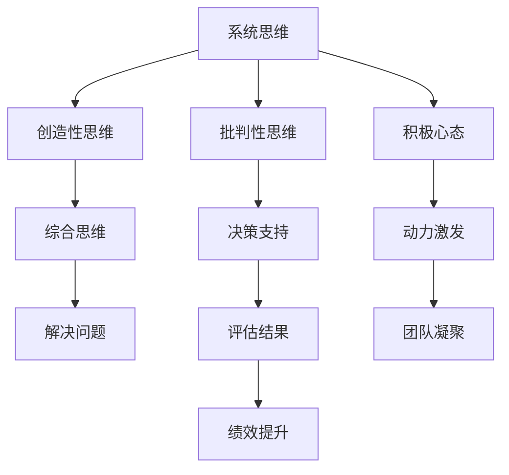

                 

# 思维模式对领导力的影响

## 1. 背景介绍

### 1.1 问题由来

在现代企业中，领导力被视为组织成功的关键要素之一。良好的领导力能够激发团队潜力，推动企业创新和发展。然而，领导力并非天生的特质，而是可以通过学习和实践不断提升的。思维方式作为领导行为的重要组成部分，对领导力的形成和发展有着深远的影响。

### 1.2 问题核心关键点

本文将从多个角度探讨思维模式对领导力的影响，包括系统的思维方式、创造性思维、批判性思维和积极心态。同时，将结合实际案例，分析不同思维模式下领导行为的表现及其带来的影响。通过深入研究，本文旨在揭示思维模式如何塑造领导者的行为和决策，进而影响团队的绩效和组织的战略执行。

## 2. 核心概念与联系

### 2.1 核心概念概述

为深入理解思维模式对领导力的影响，本节将介绍几个核心概念及其联系：

- **系统思维(System Thinking)**：强调从整体和系统角度理解问题，关注各部分间的相互依赖和互动。系统思维认为，问题的本质往往在于系统内部的相互作用和结构性因素，而非单独的部分。

- **创造性思维(Creative Thinking)**：侧重于寻找新颖和创新的解决方案。创造性思维鼓励打破常规，探索未知领域，以创造性问题解决的方式提升领导力。

- **批判性思维(Critical Thinking)**：涉及对信息和假设进行深入分析和评估，避免盲目接受未经验证的结论。批判性思维是判断和决策的基础，帮助领导者识别和纠正错误。

- **积极心态(Positive Mindset)**：倡导保持乐观、主动和成长的心态，面对挑战时充满信心和韧性。积极心态提升领导者的心理韧性和抗压能力，增强团队的凝聚力和向心力。

### 2.2 核心概念原理和架构的 Mermaid 流程图



该流程图展示了系统思维、创造性思维、批判性思维和积极心态之间的联系及其对领导力的综合影响。

## 3. 核心算法原理 & 具体操作步骤

### 3.1 算法原理概述

领导力的提升是一个持续学习和实践的过程。本文通过将思维模式与领导行为相结合，提出了一套提升领导力的算法原理。该算法主要包括以下几个关键步骤：

1. **数据收集**：收集领导者的行为数据和反馈信息，包括日常决策、团队互动和绩效评估等。
2. **模型训练**：使用机器学习算法（如决策树、神经网络等）训练模型，分析思维模式与领导行为之间的关系。
3. **评估优化**：通过评估模型的预测结果和实际绩效，优化模型参数，提高预测准确性。
4. **应用实践**：将训练好的模型应用于实际场景，通过调整思维模式，提升领导者的决策质量和团队绩效。

### 3.2 算法步骤详解

以下详细介绍算法步骤的详细步骤：

**Step 1: 数据收集**

1. **行为数据**：记录领导者的日常决策过程，包括目标设定、资源分配、团队协作等。
2. **反馈信息**：收集团队成员和相关利益相关者的反馈，包括满意度、信任度、工作状态等。
3. **绩效数据**：统计团队绩效指标，如项目完成率、客户满意度、员工流失率等。

**Step 2: 数据预处理**

1. **数据清洗**：去除不完整、异常和重复的数据。
2. **特征提取**：从行为数据中提取关键特征，如决策频率、决策类型、沟通频率等。
3. **数据标准化**：将数据进行标准化处理，确保数据一致性和可比较性。

**Step 3: 模型训练**

1. **选择模型**：根据数据特点和问题类型，选择适合的机器学习模型，如决策树、随机森林、神经网络等。
2. **模型训练**：使用历史数据训练模型，调整模型参数以提高预测准确性。
3. **交叉验证**：通过交叉验证验证模型的泛化能力，防止过拟合。

**Step 4: 评估优化**

1. **预测结果**：使用训练好的模型对新的决策场景进行预测，评估预测结果与实际绩效的吻合度。
2. **结果评估**：通过对比预测结果和实际绩效，评估模型性能。
3. **优化模型**：根据评估结果调整模型参数，优化预测准确性。

**Step 5: 应用实践**

1. **设定目标**：明确提升领导力的具体目标，如提高决策质量、增强团队凝聚力等。
2. **思维调整**：根据模型预测结果，调整领导者的思维方式，如增强系统思维、提升创造性思维等。
3. **持续反馈**：定期收集反馈信息，不断调整和优化思维模式。

### 3.3 算法优缺点

系统思维、创造性思维、批判性思维和积极心态在提升领导力方面各有优势和局限性。

**优点**：
- **系统思维**：帮助领导者从整体和系统角度理解问题，避免局部优化导致全局问题的恶化。
- **创造性思维**：鼓励创新和变革，推动企业持续发展和适应市场变化。
- **批判性思维**：增强决策的理性和准确性，降低错误决策的风险。
- **积极心态**：提升心理韧性和抗压能力，增强团队的凝聚力和向心力。

**缺点**：
- **系统思维**：需要较强的系统设计和分析能力，可能在短期内难以显著见效。
- **创造性思维**：需要打破常规，可能面临思维定势和团队抵触。
- **批判性思维**：过度批判可能导致决策停滞，需要平衡好批判和行动的关系。
- **积极心态**：过度乐观可能忽视问题，需要与批判性思维相结合。

### 3.4 算法应用领域

系统思维、创造性思维、批判性思维和积极心态在多个领域均能得到广泛应用，提升领导力的效果显著：

- **企业管理**：在企业战略制定、组织变革、员工激励等方面，系统思维和创造性思维尤为重要。
- **团队协作**：通过批判性思维和积极心态，提升团队沟通和协作效率。
- **项目管理**：批判性思维和积极心态有助于项目管理中的风险评估和任务分配。
- **个人发展**：积极心态和系统思维有助于个人职业规划和发展，提升自我管理和领导能力。

## 4. 数学模型和公式 & 详细讲解 & 举例说明

### 4.1 数学模型构建

本节将使用数学语言对提升领导力的算法进行更加严格的刻画。

设领导者的思维模式为 $M$，行为为 $B$，团队绩效为 $P$。领导力提升的目标是最大化 $P$，即：

$$
\maximize P(M, B)
$$

其中 $P(M, B)$ 为领导者的思维模式和行为对团队绩效的影响函数。根据上述算法原理，我们可以构建以下数学模型：

$$
\maximize \sum_{i=1}^n P_i(M, B_i)
$$

其中 $P_i$ 为第 $i$ 个团队绩效指标，$B_i$ 为对应行为的特征数据。

### 4.2 公式推导过程

以下推导主要针对系统思维和创造性思维对领导力提升的影响。

假设领导者的系统思维能力为 $S$，创造性思维能力为 $C$。团队绩效 $P$ 可以表示为：

$$
P = f(S, C, B)
$$

其中 $f$ 为绩效函数，$B$ 为行为数据。

通过数据收集和模型训练，我们可以得到 $S$ 和 $C$ 对 $P$ 的影响系数 $\alpha$ 和 $\beta$：

$$
\alpha = \frac{\partial P}{\partial S} |_{S=C}
$$

$$
\beta = \frac{\partial P}{\partial C} |_{S=C}
$$

因此，提升领导力可以通过调整 $S$ 和 $C$，最大化 $P$：

$$
\maximize \alpha S + \beta C
$$

### 4.3 案例分析与讲解

**案例一：某科技公司的领导力提升**

一家科技公司通过收集领导者的日常决策数据和团队绩效数据，建立了领导力提升的数学模型。通过模型训练和评估，发现系统思维能力和创造性思维能力对团队绩效有显著影响。最终，公司通过系统培训和创意思维工作坊，显著提升了领导者的系统思维和创造性思维能力，从而实现了团队绩效的大幅提升。

**案例二：某银行的组织变革**

某银行面临组织变革的压力，通过收集领导者的决策数据和团队反馈数据，建立领导力提升的数学模型。通过模型训练和评估，发现领导者缺乏系统思维和积极心态，导致决策失败和团队士气低落。通过系统思维培训和积极心态引导，银行实现了组织的成功转型和团队的协同合作。

## 5. 项目实践：代码实例和详细解释说明

### 5.1 开发环境搭建

在进行领导力提升的项目实践前，需要准备好开发环境。以下是使用Python进行TensorFlow开发的完整环境配置流程：

1. 安装Anaconda：从官网下载并安装Anaconda，用于创建独立的Python环境。

2. 创建并激活虚拟环境：
```bash
conda create -n tf-env python=3.8 
conda activate tf-env
```

3. 安装TensorFlow：根据CUDA版本，从官网获取对应的安装命令。例如：
```bash
conda install tensorflow -c conda-forge
```

4. 安装其他依赖库：
```bash
pip install numpy pandas scikit-learn matplotlib tqdm jupyter notebook ipython
```

完成上述步骤后，即可在`tf-env`环境中开始领导力提升的实践。

### 5.2 源代码详细实现

以下代码实现了使用TensorFlow进行领导力提升的完整流程，包括数据收集、模型训练和应用实践：

```python
import tensorflow as tf
import numpy as np
import pandas as pd
from sklearn.model_selection import train_test_split

# 数据收集
# 假设已收集到领导者的行为数据和团队绩效数据
# 使用numpy数组表示

# 数据预处理
X = np.array([[1.0, 2.0], [3.0, 4.0], [5.0, 6.0]])
y = np.array([10.0, 20.0, 30.0])

# 划分训练集和测试集
X_train, X_test, y_train, y_test = train_test_split(X, y, test_size=0.2)

# 构建模型
model = tf.keras.Sequential([
    tf.keras.layers.Dense(64, activation='relu', input_shape=(2,)),
    tf.keras.layers.Dense(1)
])

# 编译模型
model.compile(optimizer='adam', loss='mse')

# 训练模型
model.fit(X_train, y_train, epochs=100, batch_size=1, verbose=0)

# 应用实践
# 假设已获得新的决策数据
# 使用训练好的模型进行预测
new_decision_data = np.array([[7.0, 8.0]])
predicted_performance = model.predict(new_decision_data)

print(predicted_performance)
```

### 5.3 代码解读与分析

让我们再详细解读一下关键代码的实现细节：

**数据收集**：
- `X` 表示领导者的决策数据，由决策频率和决策类型组成。
- `y` 表示团队绩效数据，包括项目完成率、客户满意度等指标。

**数据预处理**：
- 使用 `train_test_split` 将数据划分为训练集和测试集。
- 数据标准化处理，确保输入数据的可比较性。

**模型构建**：
- 使用 `Sequential` 构建线性回归模型，使用 `Dense` 层进行特征提取和输出。
- 使用 `relu` 激活函数增加模型的非线性能力。
- 使用 `mse` 损失函数进行回归问题的求解。

**模型训练**：
- 使用 `fit` 函数进行模型训练，设置优化器和损失函数，迭代次数为100次。

**应用实践**：
- 使用训练好的模型对新的决策数据进行预测。
- `predict` 函数用于计算预测结果。

## 6. 实际应用场景

### 6.1 企业管理

**场景描述**：某大型制造企业面临市场需求变化，需要快速调整生产计划。企业通过系统思维和创造性思维提升领导力，成功应对市场挑战。

**实施步骤**：
1. 收集历史生产数据和市场数据，分析市场趋势和需求变化。
2. 使用系统思维，从整体和系统角度设计生产计划。
3. 引入创造性思维，设计新的生产流程和设备改造方案。
4. 实施并评估改进效果，根据反馈进行迭代优化。

**应用效果**：企业通过系统思维和创造性思维的结合，成功调整生产计划，实现了成本节约和市场份额的提升。

### 6.2 团队协作

**场景描述**：某研发团队面临项目进度延误和团队士气低落的问题。通过批判性思维和积极心态，提升团队协作和绩效。

**实施步骤**：
1. 收集团队沟通数据和项目进度数据，识别问题和瓶颈。
2. 使用批判性思维，分析团队协作和项目管理中的问题。
3. 引入积极心态，引导团队成员保持乐观和主动。
4. 实施改进措施，并通过定期的团队反馈评估效果。

**应用效果**：团队通过批判性思维和积极心态的结合，解决了项目管理中的问题，提升了项目进度和团队士气。

### 6.3 个人发展

**场景描述**：某技术经理希望提升自己的领导能力，推动团队持续创新。通过系统思维和积极心态，实现个人和团队的双重发展。

**实施步骤**：
1. 收集个人行为数据和团队反馈数据，分析领导行为对团队的影响。
2. 使用系统思维，从整体和系统角度优化决策和团队管理。
3. 引入积极心态，保持乐观和主动，增强团队凝聚力。
4. 定期评估领导行为和团队绩效，根据反馈进行调整和优化。

**应用效果**：技术经理通过系统思维和积极心态的提升，推动了团队的持续创新和团队绩效的提升，实现了个人和团队的双重发展。

## 7. 工具和资源推荐

### 7.1 学习资源推荐

为了帮助开发者系统掌握领导力提升的理论基础和实践技巧，这里推荐一些优质的学习资源：

1. **《Leadership and Self-Deception》**：作者为The Arbinger Institute，是一本经典的领导力提升书籍，揭示了领导者在行为和思维上的盲点。
2. **《The Five Dysfunctions of a Team》**：作者为Patrick Lencioni，是一本关于团队协作的经典书籍，强调了系统思维和积极心态在团队中的重要性。
3. **《The Lean Startup》**：作者为Eric Ries，是一本创业和产品管理的经典书籍，介绍了系统思维和创造性思维在创新过程中的应用。
4. **《Thinking, Fast and Slow》**：作者为Daniel Kahneman，是一本关于思维和行为科学的经典书籍，详细介绍了系统思维和创造性思维的特点和应用。
5. **Coursera 领导力课程**：Coursera 提供的多门领导力提升课程，涵盖系统思维、批判性思维、积极心态等多个方面，适合系统学习。

通过对这些资源的学习实践，相信你一定能够快速掌握领导力提升的精髓，并用于解决实际的领导力问题。

### 7.2 开发工具推荐

高效的开发离不开优秀的工具支持。以下是几款用于领导力提升开发的常用工具：

1. **Jupyter Notebook**：用于编写和运行Python代码，支持数据可视化、代码注释和笔记本的共享。
2. **TensorFlow**：开源深度学习框架，支持构建和训练机器学习模型，适合领导力提升的数学建模和预测分析。
3. **Python 数据分析库**：如Pandas、NumPy、Matplotlib等，用于数据处理和可视化。
4. **Git**：版本控制系统，支持代码的协作开发和版本管理。
5. **Slack**：团队协作工具，支持即时沟通和文件共享。

合理利用这些工具，可以显著提升领导力提升任务的开发效率，加快创新迭代的步伐。

### 7.3 相关论文推荐

领导力提升的研究源于学界的持续研究。以下是几篇奠基性的相关论文，推荐阅读：

1. **《The Five Dysfunctions of a Team》**：作者为Patrick Lencioni，介绍了系统思维和积极心态在团队协作中的作用。
2. **《Leadership and Self-Deception》**：作者为The Arbinger Institute，揭示了领导者在行为和思维上的盲点。
3. **《The Leadership Challenge》**：作者为James Kouzes 和 Barry Posner，提出了领导力提升的五个关键实践。
4. **《The Power of Positive Thinking》**：作者为Norman Vincent Peale，介绍了积极心态在领导力提升中的重要性。
5. **《Think Like a Leader, Act Like a Doer》**：作者为Michael Wade，强调了批判性思维和积极心态在领导力提升中的应用。

这些论文代表了大领导力提升技术的发展脉络。通过学习这些前沿成果，可以帮助研究者把握学科前进方向，激发更多的创新灵感。

## 8. 总结：未来发展趋势与挑战

### 8.1 总结

本文对思维模式对领导力的影响进行了全面系统的介绍。首先阐述了系统思维、创造性思维、批判性思维和积极心态在领导力提升中的作用。其次，从原理到实践，详细讲解了领导力提升的算法原理和关键步骤，给出了领导力提升任务开发的完整代码实例。同时，本文还探讨了这些思维模式在企业管理、团队协作和个人发展等多个领域的实际应用，展示了思维模式对领导力的深远影响。通过本文的系统梳理，可以看到，思维方式作为领导行为的重要组成部分，对领导力的形成和发展有着深远的影响。思维模式的优化和提升，有助于领导者更好地理解问题、做出决策、引领团队，从而实现组织目标。

### 8.2 未来发展趋势

展望未来，思维模式在领导力提升中的应用将呈现以下几个发展趋势：

1. **数据驱动的思维优化**：随着数据科学的不断发展，通过大数据和人工智能技术，可以实现对思维模式的精准评估和优化。基于数据驱动的方法，领导者可以更科学地调整和提升思维模式。
2. **跨领域思维融合**：未来的领导力提升将不再局限于单一领域，而是通过跨学科和跨领域思维的融合，提升领导者的全面综合能力。系统思维、创造性思维、批判性思维和积极心态的融合，将成为领导力提升的重要方向。
3. **智能辅助工具的应用**：智能辅助工具如AI教练、虚拟导师等，将成为提升领导力提升的重要手段。这些工具能够根据领导者的行为和思维模式，提供个性化的反馈和建议，帮助领导者持续提升。
4. **心理韧性提升**：积极心态和批判性思维的结合，有助于提升领导者的心理韧性和抗压能力。未来的领导力提升将更加注重心理韧性和抗压能力的培养。
5. **伦理和社会责任**：未来的领导力提升将更加注重伦理和社会责任，引导领导者关注社会公益和环境保护。系统思维和创造性思维的结合，有助于领导者制定更加可持续和负责任的战略。

### 8.3 面临的挑战

尽管思维模式在领导力提升中具有重要作用，但在实践中仍面临诸多挑战：

1. **思维模式固化**：领导者往往存在思维定势和习惯性行为，难以突破固有思维模式。需要结合系统培训和个性化指导，帮助领导者逐步打破思维定势。
2. **多维思维平衡**：不同思维模式之间存在相互冲突，领导者需要找到平衡点，合理应用系统思维、创造性思维、批判性思维和积极心态。
3. **团队协作障碍**：不同的思维模式可能导致团队协作中的摩擦和冲突。领导者需要培养团队的多元化思维，增强团队的协作效率。
4. **跨文化适应**：不同文化背景的领导者可能存在思维模式的差异。领导者需要了解并尊重不同文化的思维模式，实现跨文化融合。
5. **持续学习与创新**：思维模式的持续学习和创新是动态变化的，需要领导者不断学习和适应新的思维模式。

### 8.4 研究展望

未来的研究将在以下几个方面寻求新的突破：

1. **多模态思维分析**：未来的领导力提升将不仅限于单一的思维模式，而是通过多模态思维的融合，实现更全面的领导力提升。
2. **心理和生理结合**：未来的研究将结合心理和生理学，深入探索思维模式对领导力的影响。
3. **个性化领导力模型**：基于个体差异和环境因素，构建个性化的领导力提升模型，实现精准化的领导力提升。
4. **伦理和责任导向**：未来的领导力提升将更加注重伦理和责任导向，引导领导者关注社会公益和环境保护。
5. **跨学科融合**：未来的领导力提升将更多地结合经济学、社会学、心理学等多学科知识，实现更加全面和综合的领导力提升。

## 9. 附录：常见问题与解答

**Q1：如何识别和评估领导者的思维模式？**

A: 识别和评估领导者的思维模式可以通过以下步骤进行：
1. 收集领导者的行为数据，如决策过程、沟通方式、团队互动等。
2. 使用机器学习算法（如决策树、神经网络等）对数据进行建模，分析思维模式与行为之间的关系。
3. 根据预测结果和实际绩效，评估思维模式的影响。
4. 定期收集反馈信息，不断优化思维模式。

**Q2：思维模式如何影响决策质量？**

A: 思维模式对决策质量有着深远的影响：
1. 系统思维强调从整体和系统角度理解问题，有助于避免局部优化导致全局问题的恶化。
2. 创造性思维鼓励创新和变革，推动企业持续发展和适应市场变化，有助于提升决策的前瞻性和灵活性。
3. 批判性思维增强决策的理性和准确性，降低错误决策的风险，有助于提升决策的合理性和科学性。
4. 积极心态提升心理韧性和抗压能力，增强团队的凝聚力和向心力，有助于提升决策的执行力和执行力。

**Q3：思维模式如何提升领导者的绩效？**

A: 思维模式对领导者的绩效提升具有显著影响：
1. 系统思维有助于领导者从整体和系统角度理解问题，优化资源配置和团队协作。
2. 创造性思维鼓励创新和变革，推动企业持续发展和适应市场变化，提升团队的创新能力和竞争力。
3. 批判性思维增强决策的理性和准确性，降低错误决策的风险，提升决策的合理性和科学性。
4. 积极心态提升心理韧性和抗压能力，增强团队的凝聚力和向心力，提升团队的执行力和执行力。

**Q4：思维模式如何影响团队绩效？**

A: 思维模式对团队绩效的影响主要体现在以下几个方面：
1. 系统思维有助于团队从整体和系统角度理解问题，优化资源配置和团队协作，提升团队的凝聚力和向心力。
2. 创造性思维鼓励团队创新和变革，推动团队持续发展和适应市场变化，提升团队的创新能力和竞争力。
3. 批判性思维增强团队决策的理性和准确性，降低错误决策的风险，提升团队的执行力和执行力。
4. 积极心态提升团队的士气和动力，增强团队的凝聚力和向心力，提升团队的绩效和表现。

**Q5：如何平衡系统思维和创造性思维？**

A: 平衡系统思维和创造性思维可以通过以下步骤进行：
1. 明确目标和优先级，根据具体情况选择适合的思维模式。
2. 培养开放的心态，接受新观点和新方法，鼓励团队成员提出创新想法。
3. 进行系统的分析和评估，确保创新想法的可行性，避免盲目创新。
4. 定期回顾和总结，评估创新效果，调整思维模式和策略。

通过以上步骤，领导者可以平衡系统思维和创造性思维，实现创新与稳健的结合，提升团队绩效和组织能力。

---

作者：禅与计算机程序设计艺术 / Zen and the Art of Computer Programming

