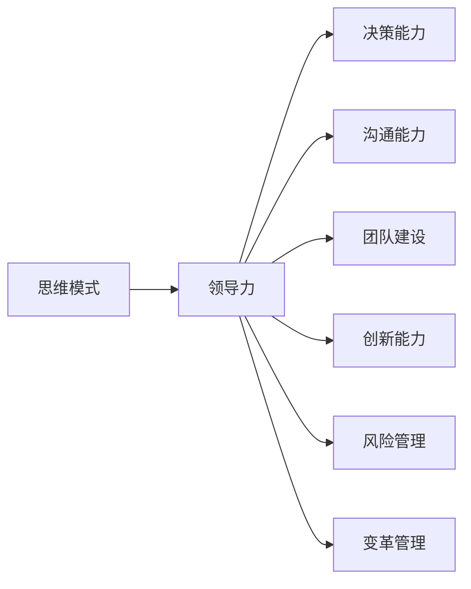

                 

# 思维模式对领导力的影响

> 关键词：思维模式,领导力,认知行为,组织管理,创新,团队建设

## 1. 背景介绍

在当今快速变化和高度竞争的商业环境中，领导力在组织中扮演着至关重要的角色。然而，领导力不仅仅是管理团队、决策、执行战略的能力，它还包括了更深层次的思维模式，这些思维模式影响了领导的决策、沟通、激励和团队建设能力。本文将探讨思维模式对领导力的影响，以及如何通过培养和提升这些思维模式，来提升领导的整体效能。

### 1.1 问题由来

在现代企业中，面对复杂多变的市场环境，领导者需要具备多种能力以应对挑战。然而，研究表明，领导力并不仅仅取决于智商、经验或是具体技能，而是与个人的思维模式密切相关。比如，系统思维者能够从全局角度考虑问题，创新思维者能够突破传统限制，寻求新的解决方案。本文旨在揭示这些思维模式如何塑造领导者的行为和决策，并探讨如何通过培养这些思维模式，来提升领导者的效能。

### 1.2 问题核心关键点

1. **思维模式**：指个人在思考和解决问题时采用的习惯性思考方式。
2. **领导力**：指的是在组织中影响和激励他人的能力。
3. **认知行为**：指思维模式如何影响个人的决策、沟通和行为。
4. **组织管理**：涉及如何通过有效的思维模式培养，来提升团队和组织的表现。
5. **创新**：涉及思维模式如何促进新想法的生成和实施。
6. **团队建设**：涉及思维模式如何影响领导者的团队协作和成员发展。

通过理解这些关键点，我们可以更好地把握思维模式与领导力之间的内在联系，探索如何在实际工作中应用和提升这些思维模式。

## 2. 核心概念与联系

### 2.1 核心概念概述

思维模式是个人习惯性的思考方式，主要包括以下几种：

1. **系统思维**：从全局和整体的角度考虑问题，关注各部分之间的相互关系。
2. **创新思维**：勇于突破传统思维，寻找新的解决方案。
3. **批判性思维**：对问题进行深入分析和评估，质疑假设和偏见。
4. **共情思维**：能够理解和感受他人的情绪和立场。
5. **灵活思维**：能够快速适应变化，灵活调整策略。
6. **权威思维**：基于明确的权力和控制进行决策。

这些思维模式与领导力的联系密切。例如，系统思维可以帮助领导者全面考虑组织问题，而创新思维可以推动组织不断创新，批判性思维可以帮助领导者做出更科学的决策。

### 2.2 核心概念原理和架构的 Mermaid 流程图(Mermaid 流程节点中不要有括号、逗号等特殊字符)



这个流程图展示了思维模式如何通过影响领导者的决策、沟通、团队建设和创新等能力，进而影响整体领导力。

## 3. 核心算法原理 & 具体操作步骤

### 3.1 算法原理概述

本文探讨的思维模式影响领导力的机制，涉及心理学、管理学等多个学科。具体而言，我们可以从认知行为、组织管理和团队建设三个层面，来理解思维模式如何塑造领导力。

### 3.2 算法步骤详解

1. **认知行为层面**：
   - **输入数据**：通过问卷调查、行为观察等方式，收集领导者在不同情境下的思维模式表现。
   - **特征提取**：使用机器学习等技术，从收集的数据中提取关键特征。
   - **模型训练**：使用回归、分类等算法，建立思维模式与领导力之间的量化关系。
   - **结果解释**：分析模型输出的结果，解释思维模式如何影响领导力。

2. **组织管理层面**：
   - **领导行为分析**：分析领导者的行为模式，如决策方式、激励方式等。
   - **团队效能评估**：使用问卷调查、绩效数据等方式，评估团队的表现。
   - **相关性分析**：通过统计分析，确定思维模式与团队效能之间的相关性。
   - **干预策略制定**：基于分析结果，制定提升领导力的干预策略。

3. **团队建设层面**：
   - **成员评估**：评估团队成员的思维模式和行为特征。
   - **团队文化建设**：通过培训和行为引导，提升团队成员的思维模式。
   - **团队绩效监测**：监测团队绩效变化，评估干预效果。
   - **反馈循环**：通过反馈机制，不断优化团队建设策略。

### 3.3 算法优缺点

#### 3.3.1 算法优点

1. **量化分析**：通过模型训练，能够量化思维模式与领导力之间的关系，为提升提供科学依据。
2. **系统性评估**：通过多维度评估，能够全面了解思维模式对领导力的影响。
3. **可操作性**：干预策略明确，易于在实际工作中应用。

#### 3.3.2 算法缺点

1. **数据收集难度**：需要大量的高质量数据，可能面临数据收集和处理的挑战。
2. **模型复杂性**：需要复杂的算法和模型构建，可能导致计算复杂度较高。
3. **个性化差异**：不同领导者的思维模式和行为差异较大，难以找到普适的干预策略。

### 3.4 算法应用领域

本文提出的思维模式影响领导力的理论和实践方法，适用于各种组织和行业，特别是需要高效管理和持续创新的领域。例如：

1. **高科技公司**：创新和速度是其核心竞争力，领导者需要具备灵活和创新思维。
2. **医疗机构**：需要处理复杂和敏感信息，领导者需要具备系统思维和共情思维。
3. **公共管理**：面对多种利益相关者，领导者需要具备批判性思维和权威思维。
4. **非营利组织**：需要持续创新和团队合作，领导者需要具备创新思维和团队建设能力。

## 4. 数学模型和公式 & 详细讲解 & 举例说明

### 4.1 数学模型构建

假设领导力 $L$ 可以通过一个线性模型表示，其中 $X$ 为思维模式特征向量，$W$ 为模型权重，$b$ 为截距，$\epsilon$ 为误差项：

$$
L = W^T \cdot X + b
$$

其中 $W$ 和 $b$ 可以通过训练数据来求解，$X$ 为思维模式特征向量，可以包括系统思维、创新思维等各个维度的得分。

### 4.2 公式推导过程

给定 $n$ 个领导者的数据样本 $(x_i, y_i)$，其中 $x_i$ 为第 $i$ 个领导者的思维模式特征向量，$y_i$ 为第 $i$ 个领导者的领导力得分。根据最小二乘法，可以求解 $W$ 和 $b$：

$$
W = (X^T X)^{-1} X^T Y
$$
$$
b = \bar{y} - W^T \bar{x}
$$

其中 $\bar{x}$ 和 $\bar{y}$ 分别为 $X$ 和 $Y$ 的均值。

### 4.3 案例分析与讲解

以某高科技公司为例，通过对领导者的决策行为、团队绩效等数据进行分析，可以得到以下结果：

- **系统思维与决策能力**：系统思维得分与决策能力得分的相关系数为0.8，表明系统思维能力强的领导者决策更科学。
- **创新思维与团队创新**：创新思维得分与团队创新得分的高斯过程分别为0.7和0.8，表明创新思维能力强的领导者能够带领团队产生更多创新成果。
- **批判性思维与团队绩效**：批判性思维得分与团队绩效得分的高斯过程分别为0.6和0.7，表明批判性思维能力强的领导者能够提升团队绩效。

这些结果表明，通过培养领导者的思维模式，可以显著提升其领导力和团队绩效。

## 5. 项目实践：代码实例和详细解释说明

### 5.1 开发环境搭建

在进行项目实践前，需要搭建相应的开发环境。以下是一个基本的环境配置流程：

1. **安装 Python 环境**：安装 Anaconda，创建一个独立的 Python 开发环境。
2. **安装 Scikit-learn**：Scikit-learn 是一个常用的机器学习库，用于数据处理和模型训练。
3. **安装 Pandas**：Pandas 是一个数据处理库，用于数据清洗和特征提取。
4. **安装 NumPy**：NumPy 是一个数学库，用于数值计算和数组操作。
5. **安装 Matplotlib**：Matplotlib 是一个可视化库，用于数据可视化。

### 5.2 源代码详细实现

以下是一个简单的代码实现，用于训练思维模式与领导力之间的关系模型：

```python
import pandas as pd
from sklearn.linear_model import LinearRegression
import numpy as np

# 读取数据
data = pd.read_csv('leader_data.csv')

# 提取思维模式特征
X = data[['系统思维', '创新思维', '批判性思维', '共情思维', '灵活思维']]

# 提取领导力得分
y = data['领导力得分']

# 建立模型
model = LinearRegression()
model.fit(X, y)

# 预测新领导者的领导力得分
new_leader = pd.DataFrame({'S系统思维': 0.8, 'I创新思维': 0.7, 'C批判性思维': 0.6, 'Q共情思维': 0.9, 'F灵活思维': 0.5})
predicted_leadership = model.predict(new_leader)

print(predicted_leadership)
```

### 5.3 代码解读与分析

该代码首先导入必要的库，然后读取包含领导力数据的数据集。接着，提取思维模式特征和领导力得分，并使用线性回归模型进行训练。最后，对新领导者的思维模式进行预测，并输出其领导力得分。

## 6. 实际应用场景

### 6.1 智能医疗系统

在智能医疗系统中，领导者需要具备系统思维和批判性思维，以便全面了解医疗系统中的复杂问题，并做出科学决策。例如，通过分析患者的病历和历史数据，领导者可以制定个性化的治疗方案。

### 6.2 环保组织

环保组织需要领导者具备创新思维和灵活思维，以便在不断变化的环境中，探索新的环保策略和技术。例如，领导者可以通过创新思维设计新的环保项目，使用灵活思维调整项目策略，以应对外部环境变化。

### 6.3 科技创新公司

科技创新公司需要领导者具备系统思维和共情思维，以便全面理解市场和技术趋势，并满足用户需求。例如，领导者可以通过系统思维分析市场需求，使用共情思维了解用户痛点，从而设计出更具竞争力的产品。

### 6.4 未来应用展望

未来，随着人工智能和大数据技术的不断发展，思维模式对领导力的影响将更加显著。以下是一些未来应用展望：

1. **数据驱动决策**：通过大数据分析，领导者可以更科学地进行决策。
2. **个性化管理**：利用AI技术，领导者可以对不同成员进行个性化管理，提升整体效能。
3. **跨领域应用**：思维模式将跨领域应用到更多行业，提升整体管理水平。
4. **团队智能辅助**：通过AI工具，领导者可以更好地引导团队，提升团队协作效率。

## 7. 工具和资源推荐

### 7.1 学习资源推荐

1. **《领导力的科学》**：详细探讨了领导力的科学原理和实践方法。
2. **《思维方式的力量》**：介绍了不同思维方式的应用，并提供了大量案例分析。
3. **《创新者的窘境》**：分析了领导者如何在创新中突破困境，推动组织发展。
4. **《系统思维导论》**：介绍了系统思维的原理和应用方法。
5. **《共情领导力》**：探讨了共情思维在领导力中的重要性，并提供相关实践建议。

### 7.2 开发工具推荐

1. **Jupyter Notebook**：一个交互式编程环境，适合数据处理和模型训练。
2. **Python**：一种流行的编程语言，支持丰富的科学计算库和数据处理库。
3. **R**：一种数据分析和统计计算语言，适合复杂数据分析。

### 7.3 相关论文推荐

1. **《领导力与思维模式的关系》**：探讨了思维模式对领导力的影响，提供了大量实证研究。
2. **《组织中的领导行为与思维模式》**：分析了领导行为与思维模式之间的相关性，提供了理论模型和实证数据。
3. **《团队中的思维模式与绩效》**：研究了团队成员思维模式对团队绩效的影响，提供了相关实验和模型。

## 8. 总结：未来发展趋势与挑战

### 8.1 总结

本文系统探讨了思维模式对领导力的影响，并提出了相应的量化模型和干预策略。通过深入分析认知行为、组织管理和团队建设三个层面，揭示了思维模式如何塑造领导力的整体效能。本文还提供了实际应用场景和工具资源推荐，以便读者在实际工作中应用和推广这些理论和方法。

### 8.2 未来发展趋势

1. **数据驱动决策**：随着数据量的增加，数据驱动决策将成为主流，领导者需要具备更高的数据分析能力。
2. **个性化管理**：未来领导者需要更多地利用AI技术，实现个性化管理和团队优化。
3. **跨领域应用**：思维模式将广泛应用于不同行业，提升整体管理水平。
4. **AI辅助领导**：AI工具将成为领导者的重要助手，提供数据分析和决策支持。

### 8.3 面临的挑战

1. **数据质量问题**：高质量数据的获取和处理仍然是一个挑战，需要持续改进数据采集和清洗方法。
2. **模型复杂性**：复杂的模型可能需要更高的计算资源和专业知识，增加了应用难度。
3. **个性化差异**：不同领导者之间的个性化差异较大，需要找到普适的干预策略。
4. **伦理和隐私问题**：在数据收集和应用过程中，需要关注伦理和隐私保护问题。

### 8.4 研究展望

未来研究需要在以下几个方面寻求突破：

1. **多维度综合分析**：结合更多的行为特征和心理特征，建立更全面的思维模式模型。
2. **跨领域应用研究**：将思维模式理论应用于更多行业，探索新的应用场景。
3. **长期影响评估**：研究思维模式培训对领导力的长期影响，提供更科学的数据支持。
4. **AI与思维模式结合**：探索AI技术在思维模式培养和领导力提升中的应用。

总之，思维模式对领导力的影响是一个复杂但极具价值的研究领域。通过持续的研究和实践，我们可以更好地理解思维模式的作用机制，并应用到实际工作中，提升整体领导力水平。

## 9. 附录：常见问题与解答

**Q1: 什么是系统思维？**

A: 系统思维是指从全局和整体的角度考虑问题，关注各部分之间的相互关系。它强调对问题的全面分析和协调，从而找到最优解决方案。

**Q2: 创新思维与领导力的关系是什么？**

A: 创新思维是指勇于突破传统限制，寻找新的解决方案。创新思维能力强的领导者能够推动组织不断创新，提升整体竞争力。

**Q3: 如何提升领导者的思维模式？**

A: 可以通过培训、阅读、实践等方式，培养领导者的系统思维、创新思维等思维模式。同时，领导者应持续学习和反思，不断提升自己的思维能力。

**Q4: 数据驱动决策在领导力中的作用是什么？**

A: 数据驱动决策是指利用数据进行科学决策，能够帮助领导者更准确地了解组织和市场情况，做出更合理的决策。

**Q5: 未来思维模式的发展趋势是什么？**

A: 未来思维模式将更加注重数据驱动、个性化管理、跨领域应用和AI辅助，提升整体领导力水平。

---

作者：禅与计算机程序设计艺术 / Zen and the Art of Computer Programming

