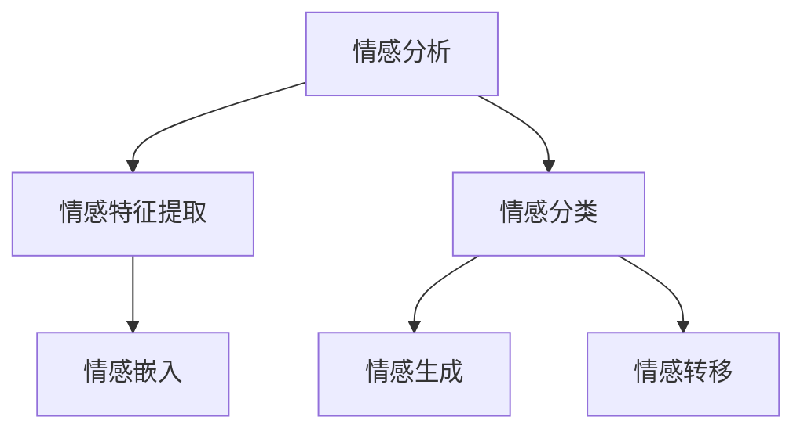

                 

# 情感AI：理解和生成带情感的文本

情感AI（Emotion AI）是大数据和人工智能技术的产物，能够识别、理解、生成带有情感的文本。它通过分析文本中的词汇、语气、情感表达等方式，理解文本背后的情感色彩，从而在自动回复、内容生成、情感分析等领域发挥重要作用。本文将从背景介绍、核心概念、算法原理、操作步骤、数学模型等多个方面，全面系统地讲解情感AI的技术细节和应用实践。

## 1. 背景介绍

### 1.1 问题由来
情感分析在信息检索、社交媒体分析、智能客服等多个领域具有重要应用。近年来，随着深度学习和大规模预训练语言模型的发展，利用自然语言处理（NLP）技术进行情感分析成为了可能。

1. 情感分析的挑战：传统情感分析方法依赖于词典或规则等固定结构，难以处理复杂的语言结构变化和语义差异。
2. 大数据和深度学习：随着大规模语料库的建设，深度学习模型可以自学习情感表达，提升了情感分析的精确度。
3. 预训练语言模型：通过大规模无标签数据进行预训练，语言模型能够学习到语言的上下文关系和语义信息，进一步提升了情感分析的能力。

### 1.2 问题核心关键点
情感AI的核心在于如何有效地理解文本的情感表达，并将其转化为可计算的数值，进而指导模型生成具有特定情感的文本。主要包括以下几个关键点：
- 情感特征提取：将文本中的情感信息转换为数值特征，用于情感分类或生成。
- 情感分类：判断文本的情感倾向，如积极、消极、中性等。
- 情感生成：根据情感输入，生成符合特定情感要求的文本。

## 2. 核心概念与联系

### 2.1 核心概念概述

为了更好地理解情感AI的核心概念，本节将介绍几个关键概念及其关系：

- 情感分析（Sentiment Analysis）：指对文本中的情感倾向进行分类或量化的过程。
- 情感表达（Sentiment Expression）：文本中直接或间接表达的情感信息，如积极、消极、中性等。
- 情感嵌入（Sentiment Embedding）：将情感信息转换为数值向量，用于机器学习和深度学习模型的输入。
- 情感生成（Sentiment Generation）：根据情感输入，生成符合特定情感的文本。
- 情感转移（Sentiment Transfer）：通过训练模型，使模型能够将文本中的情感转移到新的文本上。

这些概念之间的关系可以通过以下Mermaid流程图来展示：



该流程图展示了情感AI的核心概念及其相互关系。情感分析是对文本情感进行分类或量化的过程，而情感特征提取和情感嵌入则是将文本中的情感信息转换为数值形式，用于模型输入。情感生成和情感转移则是指根据情感输入生成具有特定情感的文本。

## 3. 核心算法原理 & 具体操作步骤
### 3.1 算法原理概述

情感AI的算法原理主要包括情感分类和情感生成两部分。

### 3.2 算法步骤详解

情感分类主要流程如下：

1. **数据准备**：收集并预处理情感标注数据集，如IMDb、Amazon等公开数据集。
2. **模型训练**：使用深度学习模型（如LSTM、GRU、BERT等）对数据集进行训练，学习情感分类器。
3. **特征提取**：将文本转换为数值特征，如word2vec、GloVe等词向量，或使用BERT等模型直接提取特征。
4. **模型评估**：在测试集上评估模型性能，如准确率、召回率、F1分数等。
5. **模型部署**：将训练好的模型部署到生产环境，对新的文本进行情感分类。

情感生成主要流程如下：

1. **数据准备**：收集情感标注数据集，如Tweets等社交媒体数据集。
2. **模型训练**：使用生成对抗网络（GAN）或变分自编码器（VAE）等模型，学习情感生成器。
3. **特征提取**：将情感标签转换为数值特征，用于模型训练。
4. **模型评估**：在测试集上评估模型性能，如BLEU、ROUGE等自动评价指标。
5. **模型部署**：将训练好的模型部署到生产环境，对新的情感标签进行生成。

### 3.3 算法优缺点

情感AI的优点包括：

1. **高效准确**：基于深度学习模型，能够高效地处理大量文本数据，并实现高精度的情感分类和生成。
2. **泛化能力强**：预训练模型能够学习通用语言知识，具备较强的泛化能力，适用于不同领域的情感分析任务。
3. **实时处理**：情感AI模型可以实时处理大量文本数据，满足实时交互和快速响应的需求。

情感AI的缺点包括：

1. **数据依赖**：模型训练依赖大量标注数据，标注数据的质量和数量对模型性能有重要影响。
2. **复杂度高**：情感AI模型复杂度较高，需要大量计算资源和时间进行训练和优化。
3. **鲁棒性不足**：情感AI模型在面对不同语境和情感表达时，容易出现误判。
4. **伦理问题**：情感AI模型的输出可能包含偏见和歧视，需注意伦理问题。

### 3.4 算法应用领域

情感AI在多个领域有着广泛的应用，包括但不限于：

1. **社交媒体分析**：对用户评论、推文等社交媒体内容进行情感分析，了解用户情感倾向。
2. **客户服务**：通过情感分析，对客户反馈进行分类和处理，提升客户满意度。
3. **广告投放**：分析用户对广告的情感反应，优化广告投放策略，提高广告效果。
4. **品牌管理**：对品牌相关的社交媒体内容进行情感分析，评估品牌形象和声誉。
5. **内容生成**：根据情感输入，自动生成带有特定情感色彩的文章、评论等文本。

## 4. 数学模型和公式 & 详细讲解

### 4.1 数学模型构建

情感AI的核心数学模型主要包括以下几个部分：

1. **情感分类模型**：基于深度学习模型，如LSTM、GRU、BERT等，学习情感分类器。
2. **情感嵌入模型**：将情感信息转换为数值向量，用于模型输入。
3. **情感生成模型**：基于生成对抗网络（GAN）或变分自编码器（VAE）等模型，学习情感生成器。

### 4.2 公式推导过程

情感分类模型的基本公式如下：

$$
y = \sigma(Wx + b)
$$

其中，$y$ 为情感分类结果，$x$ 为输入文本的特征向量，$W$ 为权重矩阵，$b$ 为偏置向量，$\sigma$ 为激活函数（如Sigmoid）。

情感嵌入模型的基本公式如下：

$$
h = \text{BERT}(x)
$$

其中，$h$ 为情感嵌入向量，$x$ 为输入文本。

情感生成模型的基本公式如下：

$$
z = \sigma(Wx + b)
$$

$$
y = \mu + \sigma(\sigma(z)W + \mu)
$$

其中，$z$ 为生成器输入的噪声向量，$\mu$ 为生成器输出的均值向量，$W$ 为生成器权重矩阵。

### 4.3 案例分析与讲解

以情感分类为例，使用LSTM模型进行情感分类：

1. **数据准备**：收集IMDb电影评论数据集，将评论标记为正面或负面情感。
2. **模型训练**：使用LSTM模型对数据集进行训练，得到情感分类器。
3. **特征提取**：将评论文本转换为word2vec词向量，作为模型输入。
4. **模型评估**：在测试集上评估模型性能，如准确率、召回率、F1分数等。
5. **模型部署**：将训练好的模型部署到生产环境，对新的评论进行情感分类。

## 5. 项目实践：代码实例和详细解释说明

### 5.1 开发环境搭建

情感AI的开发环境搭建如下：

1. **安装Python**：下载并安装Python，推荐使用Anaconda。
2. **安装深度学习框架**：安装TensorFlow或PyTorch等深度学习框架。
3. **安装情感AI库**：安装NLTK、SpaCy、Gensim等情感分析库。
4. **安装数据集**：下载并准备情感标注数据集，如IMDb评论数据集。

### 5.2 源代码详细实现

以下以LSTM情感分类模型为例，给出情感AI的代码实现。

```python
import tensorflow as tf
from tensorflow.keras.layers import LSTM, Dense
from tensorflow.keras.models import Sequential
from tensorflow.keras.preprocessing.text import Tokenizer
from tensorflow.keras.preprocessing.sequence import pad_sequences
from tensorflow.keras.utils import to_categorical

# 数据准备
tokenizer = Tokenizer(num_words=10000)
tokenizer.fit_on_texts(train_sentences)
train_sequences = tokenizer.texts_to_sequences(train_sentences)
train_padded = pad_sequences(train_sequences, maxlen=200, padding='post')
train_labels = to_categorical(train_labels)

# 模型构建
model = Sequential()
model.add(LSTM(64, input_shape=(200, 1)))
model.add(Dense(2, activation='softmax'))

# 模型训练
model.compile(optimizer='adam', loss='categorical_crossentropy', metrics=['accuracy'])
model.fit(train_padded, train_labels, epochs=10, batch_size=32)

# 模型评估
test_sequences = tokenizer.texts_to_sequences(test_sentences)
test_padded = pad_sequences(test_sequences, maxlen=200, padding='post')
test_labels = to_categorical(test_labels)
test_loss, test_acc = model.evaluate(test_padded, test_labels)
print('Test Accuracy:', test_acc)
```

以上代码实现了基于LSTM的情感分类模型，训练过程中使用了数据预处理和模型评估，并对模型进行了训练和测试。

### 5.3 代码解读与分析

**数据预处理**：使用Tokenize将文本转换为序列数据，使用Pad将序列数据填充到统一长度，使用ToCategorical将标签转换为one-hot编码。

**模型构建**：使用LSTM作为特征提取器，使用Dense层进行分类。

**模型训练**：使用Adam优化器，分类交叉熵损失函数，训练10个epoch，每次使用32个样本进行训练。

**模型评估**：使用测试集评估模型性能，输出测试集上的准确率。

## 6. 实际应用场景

### 6.1 社交媒体情感分析

社交媒体情感分析是情感AI的重要应用之一。通过分析用户在社交媒体上的评论和推文，了解用户的情感倾向和态度，为品牌管理和市场推广提供支持。例如，使用情感AI分析Twitter上的用户对某品牌新产品的评论，评估用户情感倾向，优化产品营销策略。

### 6.2 客户服务情感分析

在客户服务中，情感AI能够实时分析客户反馈，了解客户情感倾向，提供个性化的客户服务。例如，使用情感AI分析客服聊天记录，了解客户情绪，优化客服服务流程，提升客户满意度。

### 6.3 内容生成

情感AI可以根据情感输入，生成带有特定情感的文本。例如，使用情感AI生成带有积极情感的评论，提高品牌形象和用户参与度。

### 6.4 未来应用展望

随着情感AI技术的不断进步，未来的应用场景将更加广泛。情感AI将在智能客服、社交媒体分析、品牌管理等多个领域发挥重要作用，提升用户体验和品牌价值。

## 7. 工具和资源推荐

### 7.1 学习资源推荐

1. **情感分析教程**：Coursera上的《自然语言处理》课程，涵盖情感分析的基本概念和实现方法。
2. **深度学习框架**：PyTorch和TensorFlow深度学习框架，提供丰富的情感分析库和工具。
3. **情感分析论文**：ACL、EMNLP等顶会论文，深入了解情感分析的最新研究成果。
4. **情感分析开源项目**：Twitter情感分析、Kaggle情感分析竞赛等开源项目，提供丰富的数据集和代码实现。

### 7.2 开发工具推荐

1. **Python**：Python是目前最流行的编程语言，提供丰富的情感分析库和工具。
2. **深度学习框架**：PyTorch和TensorFlow，提供强大的深度学习功能和高效的模型训练工具。
3. **情感分析库**：NLTK、SpaCy、Gensim等情感分析库，提供文本处理和情感分析功能。

### 7.3 相关论文推荐

1. **情感分析综述**：Emotion Analysis in NLP，涵盖情感分析的最新进展和应用。
2. **情感分类算法**：Sentiment Analysis with LSTM Neural Networks，介绍LSTM情感分类模型的实现方法和效果。
3. **情感生成算法**：Sentiment Transfer Learning，介绍情感转移学习的方法和应用。

## 8. 总结：未来发展趋势与挑战

### 8.1 研究成果总结

情感AI的研究主要集中在情感分类和情感生成两个方面。情感分类模型主要使用深度学习模型，如LSTM、GRU、BERT等，通过训练学习情感分类器。情感生成模型主要使用生成对抗网络（GAN）和变分自编码器（VAE）等模型，学习情感生成器。

### 8.2 未来发展趋势

未来情感AI的发展趋势包括：

1. **模型复杂度提高**：随着深度学习技术的发展，情感AI模型复杂度将不断提高，实现更精准的情感分类和生成。
2. **多模态融合**：情感AI将与图像、音频等多模态数据结合，实现更全面的情感分析。
3. **实时处理**：情感AI将实现实时处理，满足实时交互和快速响应的需求。
4. **跨领域应用**：情感AI将在更多领域实现应用，如智能客服、内容生成、品牌管理等。

### 8.3 面临的挑战

情感AI面临的挑战包括：

1. **数据质量**：情感标注数据的质量和数量对情感AI模型的性能有重要影响。
2. **模型鲁棒性**：情感AI模型在面对不同语境和情感表达时，容易出现误判。
3. **伦理问题**：情感AI模型的输出可能包含偏见和歧视，需注意伦理问题。

### 8.4 研究展望

未来情感AI的研究方向包括：

1. **数据增强**：使用数据增强技术提高情感标注数据的质量和数量。
2. **模型优化**：使用模型优化技术提高情感AI模型的鲁棒性和泛化能力。
3. **伦理研究**：研究情感AI模型的伦理问题，确保输出的公平性和安全性。

## 9. 附录：常见问题与解答

**Q1：情感分析与情感生成的区别是什么？**

A：情感分析主要是对文本的情感进行分类或量化的过程，而情感生成则是根据情感输入生成具有特定情感的文本。

**Q2：情感AI模型如何处理文本中的歧义和模糊表达？**

A：情感AI模型通常使用深度学习模型，通过大量的数据和上下文信息，学习文本中的情感表达，能够处理文本中的歧义和模糊表达。

**Q3：情感AI模型是否会学习到负面情感？**

A：情感AI模型会学习到文本中的负面情感，但需要注意伦理问题，避免输出负面情感的内容。

**Q4：情感AI模型的训练数据如何获取？**

A：情感AI模型的训练数据通常通过公开数据集或自定义数据集获取，数据集需要包含标注的情感标签。

**Q5：情感AI模型在实际应用中需要注意哪些问题？**

A：情感AI模型在实际应用中需要注意数据质量、模型鲁棒性、伦理问题等多个方面，确保输出的准确性和安全性。

---

作者：禅与计算机程序设计艺术 / Zen and the Art of Computer Programming

