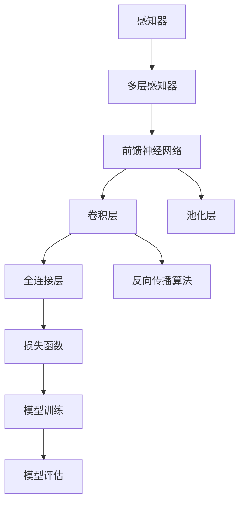

                 

# 感知器到卷积神经网络（CNN）

## 1. 背景介绍

### 1.1 问题由来
在深度学习领域，卷积神经网络（Convolutional Neural Network, CNN）是图像处理和计算机视觉任务中最常用的模型之一。然而，对于许多初学者和研究人员而言，从传统的感知器（Perceptron）模型到复杂的卷积网络，这一跨越可能显得有些突兀。为了帮助读者更好地理解这一转变，本文将详细阐述从感知器到卷积神经网络的核心概念及其演变过程。

### 1.2 问题核心关键点
卷积神经网络的发展源于对感知器模型的拓展和改进。在实际应用中，通过理解这两类模型的工作原理和关键差异，我们能够更好地把握CNN的设计理念和应用场景。

### 1.3 问题研究意义
了解从感知器到卷积神经网络的历史演进，对于掌握深度学习的基础理论和实际应用都具有重要意义：

1. 有助于理解深度学习模型间的继承和演变关系。
2. 能够更好地设计和管理复杂的卷积网络，提升模型性能。
3. 促进对计算机视觉和图像处理任务的深入理解。
4. 为学习深度学习中的其他模型（如循环神经网络RNN、注意力机制等）打下坚实基础。

## 2. 核心概念与联系

### 2.1 核心概念概述

为了更好地理解卷积神经网络，本节将介绍几个密切相关的核心概念：

- 感知器（Perceptron）：最早的神经网络模型，由AdaBoost算法提出，通过学习简单的线性阈值函数进行分类。感知器模型通常只包含一个或多个输入节点、一个输出节点，没有隐藏层。

- 多层感知器（Multilayer Perceptron, MLP）：在感知器的基础上，通过引入一个或多个隐藏层，可以处理更复杂的多变量输入-输出映射问题。

- 前馈神经网络（Feedforward Neural Network, FNN）：一种最简单的多层神经网络，由输入层、隐藏层和输出层组成，数据只能从输入层流向输出层，不存在反馈连接。

- 反向传播算法（Backpropagation）：一种基于梯度下降的优化算法，用于计算神经网络中各参数对损失函数的导数，从而更新网络参数。

- 卷积层（Convolutional Layer）：CNN中最重要的层之一，通过局部连接和权重共享，显著降低参数数量，提高模型泛化能力。

- 池化层（Pooling Layer）：用于降低特征图的空间大小，减少计算量和模型复杂度，提高模型对位置变化的鲁棒性。

- 全连接层（Fully Connected Layer）：通过将所有隐藏单元的输出连接到输出层，完成最终分类或回归任务。

这些核心概念之间的逻辑关系可以通过以下Mermaid流程图来展示：



这个流程图展示了几类核心模型及其关联关系：

1. 感知器是最简单的神经网络模型。
2. 多层感知器在其基础上增加了隐藏层，可以处理更复杂的输入输出映射。
3. 前馈神经网络是多层感知器的扩展，常用于图像分类、回归等任务。
4. 卷积层是CNN的核心，利用局部连接和权重共享，提高模型参数效率。
5. 池化层用于特征降维，增强模型鲁棒性。
6. 全连接层完成最终的分类或回归任务。
7. 反向传播算法用于模型训练，优化参数。
8. 损失函数用于评估模型预测与实际标签之间的差异。
9. 模型训练和评估是模型开发的关键步骤。

这些概念共同构成了神经网络的学习框架，使其能够处理各种复杂的非线性映射任务。通过理解这些核心概念，我们可以更好地把握神经网络的演进脉络和设计理念。

## 3. 核心算法原理 & 具体操作步骤
### 3.1 算法原理概述

卷积神经网络（CNN）的核心思想是利用局部连接和权重共享的卷积操作，对输入数据进行特征提取和表示学习。其基本原理与感知器模型相似，但在网络结构、参数更新等方面有显著改进。

CNN通常由以下几个核心组件构成：

1. 卷积层（Convolutional Layer）：通过局部连接和权重共享，提取输入数据的局部特征。
2. 池化层（Pooling Layer）：用于降低特征图的空间大小，减少计算量和模型复杂度。
3. 全连接层（Fully Connected Layer）：通过将所有隐藏单元的输出连接到输出层，完成最终的分类或回归任务。

卷积神经网络的训练过程一般包括两个阶段：前向传播和反向传播。在前向传播中，输入数据通过网络，计算出预测输出；在反向传播中，利用损失函数对网络参数进行优化。通过不断的迭代训练，模型能够逐渐学习到更准确的输入输出映射关系。

### 3.2 算法步骤详解

卷积神经网络的训练过程主要分为以下几个步骤：

**Step 1: 数据准备**
- 收集训练数据集，并将其划分为训练集、验证集和测试集。
- 将图像数据进行归一化、标准化等预处理，以便于网络学习。

**Step 2: 模型构建**
- 使用深度学习框架（如TensorFlow、PyTorch等）定义卷积神经网络结构。
- 设计网络各层结构，包括卷积层、池化层、全连接层等。

**Step 3: 模型训练**
- 设置损失函数（如交叉熵损失、均方误差等），用于评估模型预测与实际标签之间的差异。
- 使用反向传播算法（如Adam、SGD等）更新网络参数。
- 在训练集上迭代训练，每个epoch后评估模型在验证集上的性能。

**Step 4: 模型评估与测试**
- 在测试集上评估训练好的模型，计算各项指标（如准确率、召回率等）。
- 对比模型在不同数据集上的性能表现，决定是否进行模型优化。

### 3.3 算法优缺点

卷积神经网络相对于感知器模型，具有以下优点：

1. 参数共享：卷积层中的权重参数可以共享，从而大大减少了模型的总参数数量，降低过拟合风险。
2. 局部连接：卷积层中每个神经元只连接输入数据的一部分，提高了计算效率。
3. 特征提取：卷积层能够自动提取输入数据的局部特征，无需人工设计特征。
4. 平移不变性：卷积核可以平移，提高了模型对输入数据位置的鲁棒性。
5. 多层次特征表示：通过堆叠多个卷积层和池化层，可以学习到不同层次的特征表示，提高模型的泛化能力。

同时，卷积神经网络也存在一些缺点：

1. 数据依赖：需要大量标注的图像数据进行训练，数据收集成本高。
2. 模型复杂：网络结构较为复杂，参数更新过程复杂，调试难度大。
3. 计算资源需求高：卷积神经网络需要大量的计算资源，特别是在训练大模型时。
4. 网络设计：需要设计合理的卷积核大小、池化策略、层数等，设计不当可能导致过拟合或欠拟合。

尽管存在这些局限性，但卷积神经网络在图像处理、计算机视觉等领域表现出色，成为深度学习的重要组成部分。

### 3.4 算法应用领域

卷积神经网络已经在图像处理、计算机视觉、语音识别、自然语言处理等多个领域得到广泛应用：

1. 图像分类：如手写数字识别、物体识别等，通过多层的卷积和池化操作，学习图像的特征表示。
2. 目标检测：如行人检测、交通标志识别等，通过特征金字塔、RoI池化等技术，实现精确定位。
3. 语义分割：如医学图像分割、遥感图像分割等，通过像素级的特征表示，实现精确分割。
4. 语音识别：通过卷积层提取语音信号的频谱特征，再通过全连接层进行分类。
5. 自然语言处理：通过卷积神经网络进行文本分类、情感分析、命名实体识别等任务。

## 4. 数学模型和公式 & 详细讲解  
### 4.1 数学模型构建

卷积神经网络的数学模型建立在多层感知器的基础上，通过卷积、池化等操作，学习输入数据的局部特征表示。

假设输入数据为 $x \in \mathbb{R}^{m \times n \times c}$，其中 $m$ 和 $n$ 为输入数据的空间大小，$c$ 为通道数（颜色通道或特征通道）。卷积层的输入为特征图 $F \in \mathbb{R}^{k \times k \times c}$，其中 $k$ 为卷积核大小。

卷积层的输出为特征图 $G \in \mathbb{R}^{m' \times n' \times c'}$，其中 $m' = m - k + 1$，$n' = n - k + 1$，$c' = c \times r$，$r$ 为卷积核的个数。

卷积核的权重参数 $\theta$ 可以共享，每个位置只有一个参数。卷积操作的数学公式为：

$$
G_{i,j,k} = \sum_{a=0}^{c-1} \sum_{b=0}^{c-1} F_{a,b,c} * \theta_{k,i,j,a,b}
$$

其中 $*$ 表示卷积操作。

池化层用于降低特征图的空间大小，常用的池化操作包括最大池化和平均池化。最大池化的数学公式为：

$$
P_{i,j} = \max\{G_{i,j,k}\}_{k=0}^{r-1}
$$

平均池化的数学公式为：

$$
P_{i,j} = \frac{1}{r} \sum_{k=0}^{r-1} G_{i,j,k}
$$

池化层的输出为 $P \in \mathbb{R}^{m' \times n' \times c'}$。

全连接层的输入为特征图 $P$，输出为分类或回归结果。全连接层的数学公式为：

$$
Y = W * P + b
$$

其中 $W$ 为权重矩阵，$b$ 为偏置向量。

卷积神经网络的损失函数通常为交叉熵损失，其数学公式为：

$$
\mathcal{L} = -\frac{1}{N} \sum_{i=1}^N \sum_{j=1}^C y_{i,j} \log(\hat{y}_{i,j})
$$

其中 $N$ 为样本数，$C$ 为类别数，$y_{i,j}$ 为样本 $i$ 的标签，$\hat{y}_{i,j}$ 为模型预测结果。

### 4.2 公式推导过程

以卷积神经网络的反向传播算法为例，详细推导其参数更新公式。

假设输入数据为 $x$，卷积层的输出为 $G$，池化层的输出为 $P$，全连接层的输出为 $Y$。损失函数为交叉熵损失，目标为最小化损失函数 $\mathcal{L}$。

1. 前向传播计算 $P$ 和 $Y$：

$$
G = F(x, \theta) = \sum_{a=0}^{c-1} \sum_{b=0}^{c-1} x_{a,b,c} * \theta_{k,i,j,a,b}
$$

$$
P = P(G, \omega) = \max\{G_{i,j,k}\}_{k=0}^{r-1}
$$

$$
Y = Y(P, W, b) = W * P + b
$$

2. 反向传播计算各层的梯度：

$$
\frac{\partial \mathcal{L}}{\partial W} = \frac{\partial \mathcal{L}}{\partial Y} * \frac{\partial Y}{\partial P} * \frac{\partial P}{\partial G} * \frac{\partial G}{\partial x}
$$

$$
\frac{\partial \mathcal{L}}{\partial \theta} = \frac{\partial \mathcal{L}}{\partial G} * \frac{\partial G}{\partial x} * \frac{\partial x}{\partial \theta}
$$

其中 $\omega$ 为池化层的参数，$P$ 为池化层的输出。

3. 更新参数：

$$
W \leftarrow W - \eta \frac{\partial \mathcal{L}}{\partial W}
$$

$$
b \leftarrow b - \eta \frac{\partial \mathcal{L}}{\partial b}
$$

$$
\theta \leftarrow \theta - \eta \frac{\partial \mathcal{L}}{\partial \theta}
$$

其中 $\eta$ 为学习率。

通过反向传播算法，可以高效计算卷积神经网络中各参数对损失函数的导数，从而进行模型训练。在实际应用中，还需要对模型进行调参和优化，以提升模型的泛化能力和性能。

### 4.3 案例分析与讲解

以下以图像分类任务为例，详细讲解卷积神经网络的设计和训练过程。

**Step 1: 数据准备**
- 收集并预处理图像数据集，包括图像归一化、标准化、数据增强等。
- 将数据集划分为训练集、验证集和测试集。

**Step 2: 模型构建**
- 设计卷积神经网络结构，包括卷积层、池化层、全连接层等。
- 使用深度学习框架（如TensorFlow、PyTorch等）定义模型。

**Step 3: 模型训练**
- 设置损失函数（如交叉熵损失），用于评估模型预测与实际标签之间的差异。
- 使用反向传播算法（如Adam、SGD等）更新网络参数。
- 在训练集上迭代训练，每个epoch后评估模型在验证集上的性能。

**Step 4: 模型评估与测试**
- 在测试集上评估训练好的模型，计算各项指标（如准确率、召回率等）。
- 对比模型在不同数据集上的性能表现，决定是否进行模型优化。

## 5. 项目实践：代码实例和详细解释说明
### 5.1 开发环境搭建

在进行卷积神经网络实践前，我们需要准备好开发环境。以下是使用Python进行TensorFlow开发的环境配置流程：

1. 安装Anaconda：从官网下载并安装Anaconda，用于创建独立的Python环境。

2. 创建并激活虚拟环境：
```bash
conda create -n tf-env python=3.8 
conda activate tf-env
```

3. 安装TensorFlow：根据CUDA版本，从官网获取对应的安装命令。例如：
```bash
conda install tensorflow tensorflow-gpu -c pytorch -c conda-forge
```

4. 安装各类工具包：
```bash
pip install numpy pandas scikit-learn matplotlib tqdm jupyter notebook ipython
```

完成上述步骤后，即可在`tf-env`环境中开始卷积神经网络的实践。

### 5.2 源代码详细实现

下面我们以手写数字识别任务为例，给出使用TensorFlow实现卷积神经网络的代码实现。

首先，定义卷积神经网络的结构：

```python
import tensorflow as tf

class ConvNet(tf.keras.Model):
    def __init__(self):
        super(ConvNet, self).__init__()
        self.conv1 = tf.keras.layers.Conv2D(32, (3, 3), activation='relu')
        self.pool1 = tf.keras.layers.MaxPooling2D((2, 2))
        self.conv2 = tf.keras.layers.Conv2D(64, (3, 3), activation='relu')
        self.pool2 = tf.keras.layers.MaxPooling2D((2, 2))
        self.flatten = tf.keras.layers.Flatten()
        self.dense1 = tf.keras.layers.Dense(512, activation='relu')
        self.dense2 = tf.keras.layers.Dense(10, activation='softmax')
        
    def call(self, x):
        x = self.conv1(x)
        x = self.pool1(x)
        x = self.conv2(x)
        x = self.pool2(x)
        x = self.flatten(x)
        x = self.dense1(x)
        x = self.dense2(x)
        return x
```

然后，定义训练和评估函数：

```python
train_dataset = ...
val_dataset = ...
test_dataset = ...

batch_size = 32
epochs = 10

model = ConvNet()

optimizer = tf.keras.optimizers.Adam()

loss_fn = tf.keras.losses.SparseCategoricalCrossentropy()

def train_step(x, y):
    with tf.GradientTape() as tape:
        logits = model(x, training=True)
        loss = loss_fn(y, logits)
    grads = tape.gradient(loss, model.trainable_variables)
    optimizer.apply_gradients(zip(grads, model.trainable_variables))

def evaluate_step(x, y):
    logits = model(x, training=False)
    loss = loss_fn(y, logits)
    return loss

for epoch in range(epochs):
    for x, y in train_dataset:
        train_step(x, y)
    val_loss = evaluate_step(val_dataset, val_dataset.labels)
    print(f'Epoch {epoch+1}, val loss: {val_loss.numpy()}')
```

最后，启动训练流程并在测试集上评估：

```python
test_loss = evaluate_step(test_dataset, test_dataset.labels)
print(f'Test loss: {test_loss.numpy()}')
```

以上就是使用TensorFlow实现手写数字识别任务的完整代码实现。可以看到，通过TensorFlow的高层API，我们可以快速定义和训练卷积神经网络。

### 5.3 代码解读与分析

让我们再详细解读一下关键代码的实现细节：

**ConvNet类**：
- `__init__`方法：定义卷积神经网络的结构，包括卷积层、池化层、全连接层等。
- `call`方法：前向传播计算网络输出。

**训练函数train_step和评估函数evaluate_step**：
- 训练函数：对每个训练样本进行前向传播计算，反向传播更新网络参数。
- 评估函数：对每个评估样本进行前向传播计算，计算损失函数值。

**训练流程**：
- 定义训练集、验证集和测试集。
- 定义卷积神经网络模型和优化器。
- 在每个epoch内，对训练集进行迭代训练，每个batch后评估验证集上的损失。
- 在训练结束后，评估测试集上的损失。

可以看到，TensorFlow提供了丰富的API和工具，使得卷积神经网络的实现和训练变得简单高效。开发者可以将更多精力放在模型设计和优化上，而不必过多关注底层的实现细节。

当然，工业级的系统实现还需考虑更多因素，如模型压缩、混合精度训练、GPU加速等。但核心的卷积神经网络训练流程基本与此类似。

## 6. 实际应用场景
### 6.1 智能监控系统

卷积神经网络在智能监控系统中得到了广泛应用。通过实时采集视频数据，并经过预处理、特征提取和分类等操作，卷积神经网络能够自动识别异常行为，及时发出警报。

在技术实现上，可以使用预训练的卷积神经网络（如ResNet、VGG等）进行目标检测，通过特征提取和分类，实现对监控视频中感兴趣对象的识别。对于新出现的异常行为，还可以接入检索系统实时搜索相关内容，动态生成报警。如此构建的智能监控系统，能显著提升监控效率和响应速度。

### 6.2 医疗影像分析

卷积神经网络在医疗影像分析领域具有重要应用。通过预训练的卷积神经网络模型（如Inception、ResNet等），可以对医学影像进行自动分类、分割和标注，辅助医生进行诊断。

具体而言，可以使用卷积神经网络对医学影像进行图像分割，区分肿瘤、正常组织等不同区域。对于病灶检测任务，还可以结合多层次特征表示和异常检测技术，实现对病灶的精确定位和分类。

### 6.3 自动驾驶系统

卷积神经网络在自动驾驶系统中也得到了广泛应用。通过感知、决策、控制等多个环节，卷积神经网络能够实现对环境信息的准确感知和行为决策。

在感知环节，卷积神经网络可以提取道路、车辆、行人等重要信息，辅助系统进行环境感知。在决策环节，卷积神经网络可以进行交通信号识别、障碍物避让等决策任务。在控制环节，卷积神经网络可以优化车辆轨迹，进行路径规划和路径跟随。

### 6.4 未来应用展望

随着卷积神经网络的不断发展，其应用领域将不断拓展，为各个行业带来变革性影响。

在智慧医疗领域，基于卷积神经网络的医学影像分析技术，能够辅助医生进行精准诊断，提升医疗服务的智能化水平。

在智能制造领域，卷积神经网络可以用于缺陷检测、质量控制等任务，提升生产效率和产品品质。

在智能交通领域，卷积神经网络可以用于交通信号识别、自动驾驶等任务，提高交通管理的智能化水平。

此外，在智慧城市、教育、金融等领域，卷积神经网络也有广泛的应用前景，为各行各业提供智能化的解决方案。

## 7. 工具和资源推荐
### 7.1 学习资源推荐

为了帮助开发者系统掌握卷积神经网络的理论基础和实践技巧，这里推荐一些优质的学习资源：

1. 《深度学习》（Goodfellow等）：系统介绍了深度学习的基本原理和算法，包括卷积神经网络等前沿模型。
2. 《卷积神经网络：视觉感知与模式识别》（Krizhevsky等）：介绍了卷积神经网络的经典算法和实际应用，有助于理解卷积神经网络的细节和实现。
3. 《动手学深度学习》（李沐等）：基于MXNet框架，详细讲解了卷积神经网络的设计和实现，适合动手实践。
4. 《Python深度学习》（Goodfellow等）：使用TensorFlow和Keras实现卷积神经网络，涵盖实际应用和项目实践。

通过对这些资源的学习实践，相信你一定能够快速掌握卷积神经网络的理论基础和实际应用。

### 7.2 开发工具推荐

高效的开发离不开优秀的工具支持。以下是几款用于卷积神经网络开发的常用工具：

1. TensorFlow：由Google主导开发的深度学习框架，支持GPU加速，适合大规模工程应用。
2. PyTorch：基于Python的深度学习框架，灵活高效，适合快速迭代研究。
3. Keras：高层API，提供了丰富的深度学习模型和工具，易于上手。
4. MXNet：跨平台深度学习框架，支持GPU加速和分布式训练。
5. Caffe：适合图像识别任务的深度学习框架，由Berkeley Vision and Learning Center开发。

合理利用这些工具，可以显著提升卷积神经网络的开发效率，加快创新迭代的步伐。

### 7.3 相关论文推荐

卷积神经网络的发展得益于学界的持续研究。以下是几篇奠基性的相关论文，推荐阅读：

1. LeNet-5：历史上第一个卷积神经网络，用于手写数字识别任务。
2. AlexNet：第一个大规模卷积神经网络，用于图像分类任务，获得2012年ImageNet比赛的冠军。
3. VGGNet：使用小尺寸卷积核和多层卷积层，获得2014年ImageNet比赛的冠军。
4. GoogLeNet：引入了Inception模块，提高了模型的计算效率和特征表示能力。
5. ResNet：使用残差连接，解决了深层网络训练中的梯度消失问题，提升了模型的深度和泛化能力。

这些论文代表了大规模卷积神经网络的研究历程，通过学习这些前沿成果，可以帮助研究者把握卷积神经网络的演进脉络和设计理念。

## 8. 总结：未来发展趋势与挑战

### 8.1 总结

本文对卷积神经网络的核心概念和应用进行了全面系统的介绍。从感知器模型到卷积神经网络的演变，展示了深度学习技术的进步和多样性。通过理解这些核心概念和模型设计，我们能够更好地把握卷积神经网络的发展脉络和设计理念。

卷积神经网络已经在计算机视觉、图像处理、自然语言处理等多个领域得到广泛应用，成为深度学习的重要组成部分。未来，随着技术的不断进步，卷积神经网络将在更广阔的领域带来变革性影响。

### 8.2 未来发展趋势

展望未来，卷积神经网络的发展将呈现以下几个趋势：

1. 模型规模持续增大。随着算力成本的下降和数据规模的扩张，卷积神经网络的参数量还将持续增长。超大批次的训练和推理也将更加高效。

2. 多模态融合。卷积神经网络将与其他模态数据（如图像、语音、文本等）进行融合，形成多模态学习范式，提升模型的综合理解能力。

3. 自适应和可解释性。未来卷积神经网络将具备更好的自适应能力，能够根据任务需求动态调整模型结构。同时，通过引入可解释性技术，增强模型的可解释性和可信度。

4. 模型压缩和优化。在保证性能的前提下，卷积神经网络将不断优化和压缩，以降低计算资源需求，提升部署效率。

5. 联邦学习和分布式训练。面对大规模数据集和计算资源，卷积神经网络将引入联邦学习和分布式训练技术，提升模型训练的效率和效果。

以上趋势凸显了卷积神经网络的发展方向，未来必将带来更加广泛的应用场景和更强的模型性能。

### 8.3 面临的挑战

尽管卷积神经网络已经取得了显著成就，但在迈向更加智能化、普适化应用的过程中，它仍面临着诸多挑战：

1. 计算资源需求高。卷积神经网络需要大量的计算资源，特别是在训练大模型时。如何在保证性能的同时，优化资源利用效率，仍是重要课题。

2. 数据依赖性强。需要大量标注数据进行训练，数据收集成本高。如何在保证数据质量的前提下，减少标注工作量，仍是挑战。

3. 模型鲁棒性不足。对于域外数据，卷积神经网络的泛化性能往往较差。如何提高模型的鲁棒性和泛化能力，仍是研究难点。

4. 模型可解释性不足。卷积神经网络通常被视为"黑盒"模型，难以解释其内部工作机制。如何增强模型的可解释性和可控性，将是未来的研究方向。

5. 模型安全和伦理问题。卷积神经网络可能学习到有害信息和偏见，产生误导性输出。如何确保模型安全和伦理合规，将是重要的研究课题。

6. 算法复杂度高。卷积神经网络的设计和实现较为复杂，调试和优化难度大。如何在保证模型性能的前提下，简化模型设计，仍是重要课题。

这些挑战需要研究者不断探索和创新，才能推动卷积神经网络技术的进步，并应用于更广泛的应用场景。

### 8.4 研究展望

面对卷积神经网络所面临的挑战，未来的研究需要在以下几个方面寻求新的突破：

1. 探索新的卷积层设计。引入新的卷积核结构和参数优化技术，提高卷积层的表示能力。

2. 研究多层次特征表示。通过深度网络结构和多层次特征提取，提升模型的泛化能力和鲁棒性。

3. 引入可解释性技术。通过可视化、可解释性模型等技术，增强模型的可解释性和可控性。

4. 引入多模态融合技术。通过多模态学习范式，提升模型的综合理解能力和鲁棒性。

5. 研究联邦学习和分布式训练。通过分布式计算和联邦学习技术，提升模型训练效率和效果。

6. 探索自适应和在线学习。通过自适应学习和在线学习技术，提升模型的实时性和自适应能力。

这些研究方向将推动卷积神经网络技术的进一步发展，为更广泛的应用场景提供技术支持。

## 9. 附录：常见问题与解答

**Q1：卷积神经网络中，池化层的具体作用是什么？**

A: 池化层在卷积神经网络中主要用于降低特征图的空间大小，减少计算量和模型复杂度。同时，池化层还可以增强模型对输入数据位置的鲁棒性，减少过拟合风险。常用的池化操作包括最大池化和平均池化，前者选择每个区域的最大值作为池化结果，后者对每个区域取平均值作为池化结果。

**Q2：卷积神经网络中，卷积核的大小如何确定？**

A: 卷积核的大小通常根据任务需求和数据特征确定。对于较小的数据集，可以使用小尺寸卷积核（如3x3或5x5）；对于较大的数据集，可以使用大尺寸卷积核（如7x7或11x11）。在实际应用中，通常需要进行实验调参，选择最优的卷积核大小。

**Q3：卷积神经网络中，是否必须使用全连接层？**

A: 卷积神经网络中，全连接层通常用于最终的分类或回归任务。在某些特定任务中，可以通过多层次卷积和池化操作，直接输出最终的特征表示，而不必使用全连接层。例如，在图像分割任务中，可以直接输出像素级别的特征表示，实现精确定位和分类。

**Q4：卷积神经网络中，如何避免过拟合？**

A: 避免过拟合的方法包括数据增强、正则化、Dropout等。数据增强可以通过随机旋转、翻转等方式扩充训练集，提高模型的泛化能力。正则化可以通过L2正则、Dropout等方式减少模型的复杂度，防止过拟合。Dropout可以在训练过程中随机丢弃一些神经元，避免模型对特定输入的依赖。

**Q5：卷积神经网络中，如何处理类别不平衡问题？**

A: 类别不平衡问题通常会导致模型对少数类别的预测效果较差。解决类别不平衡问题的方法包括重采样、过采样、欠采样、类别权重等。重采样方法可以通过复制少数类别或删除多数类别样本，调整样本比例。过采样方法可以通过生成合成样本，增加少数类别的样本数。欠采样方法可以通过删除多数类别样本，调整样本比例。类别权重方法可以通过调整损失函数中不同类别的权重，提高少数类别的重要性。

---

作者：禅与计算机程序设计艺术 / Zen and the Art of Computer Programming

