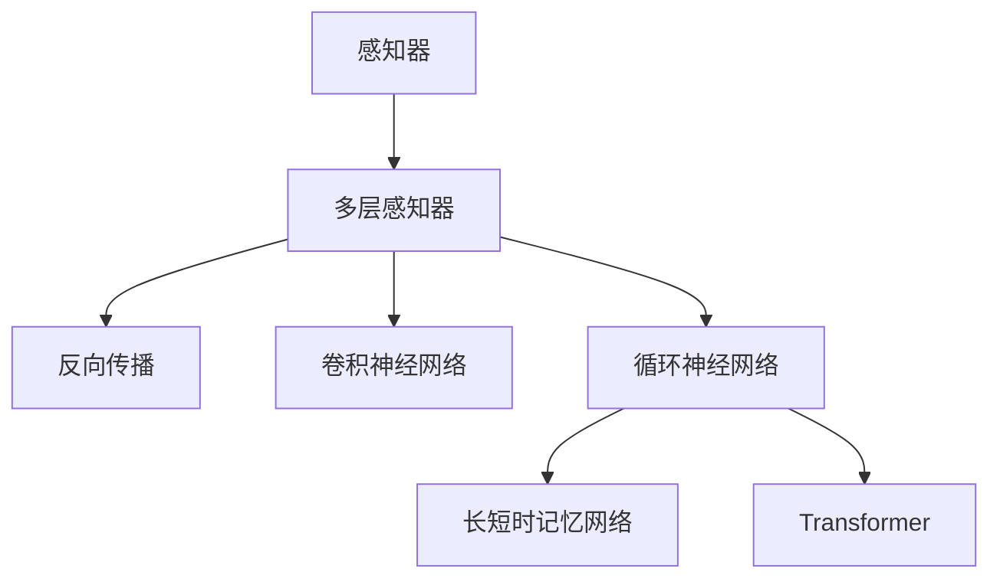

                 

## 1. 背景介绍

人工智能（AI）是一个引人入胜的领域，它能够模拟、扩展甚至超越人类智能。在AI的历史长河中，神经网络扮演了至关重要的角色，从最初的感知器（Perceptron）到现今的Transformer，神经网络的发展轨迹见证了AI技术的巨大进步。本文将追溯这一演进之路，并探讨当前神经网络技术的前沿进展，为读者提供一个全面而深入的视角。

## 2. 核心概念与联系

### 2.1 核心概念概述

**感知器**：神经网络的基础单元，由一个或多个神经元组成。早期的感知器主要用于二分类任务，其工作原理基于阈值函数（例如，Sigmoid函数），但存在局限性，如难以处理多维输入、无法处理非线性问题等。

**多层感知器（MLP）**：通过增加隐藏层，多层感知器可以处理非线性问题，显著提升了分类和回归任务的准确性。MLP由多个线性变换和激活函数构成，但训练过程容易陷入局部最优解。

**反向传播（Backpropagation）**：一种基于梯度下降的训练算法，用于更新MLP的权重和偏置。反向传播算法通过链式法则，将误差从输出层向后传播至输入层，计算每个参数对误差的影响，从而实现高效的模型训练。

**卷积神经网络（CNN）**：一种专门设计用于处理图像和视频数据的神经网络。CNN通过卷积操作和池化操作提取局部特征，减少参数量，提升计算效率。

**循环神经网络（RNN）**：处理序列数据（如文本、音频、时间序列等）的神经网络。RNN通过循环结构实现对序列信息的记忆和预测。

**长短时记忆网络（LSTM）**：一种改进的RNN，通过门控机制和记忆单元，有效解决了RNN中的梯度消失和爆炸问题。

**Transformer**：一种基于自注意力机制的神经网络，被广泛应用于机器翻译、文本生成、图像识别等任务。Transformer通过并行化的自注意力操作，显著提升了计算效率和模型表现。

这些核心概念之间的关系可通过以下Mermaid流程图来展示：



## 3. 核心算法原理 & 具体操作步骤

### 3.1 算法原理概述

神经网络通过学习输入数据与输出数据之间的映射关系，实现对未知数据的预测和分类。其核心思想是通过一系列非线性变换，将输入数据映射到高维空间，从而在复杂空间中找到数据之间的隐含结构。

### 3.2 算法步骤详解

**Step 1: 数据准备**
- 收集并预处理数据集，确保数据集的多样性和代表性。

**Step 2: 模型设计**
- 根据任务类型选择合适的网络结构，如MLP、CNN、RNN、LSTM或Transformer。
- 设计模型的超参数，如隐藏层数、神经元数量、学习率等。

**Step 3: 模型训练**
- 使用反向传播算法，通过前向传播和反向传播，计算每个参数的梯度。
- 利用优化算法（如Adam、SGD）更新模型参数。

**Step 4: 模型评估**
- 在验证集上评估模型的性能，选择最优模型。

**Step 5: 模型部署**
- 将训练好的模型部署到实际应用中，进行推理预测。

### 3.3 算法优缺点

**优点**
- 强大的泛化能力：神经网络能够学习复杂的非线性映射关系，适应广泛的数据分布。
- 高效的并行化计算：Transformer等现代架构利用自注意力机制，能够并行计算，提升计算效率。
- 自适应学习：神经网络通过反向传播算法不断调整参数，适应新数据和新任务。

**缺点**
- 过拟合风险：特别是在训练数据有限的情况下，神经网络容易出现过拟合。
- 计算资源消耗大：神经网络需要大量计算资源进行训练和推理。
- 黑盒问题：神经网络的决策过程难以解释，缺乏透明度。

### 3.4 算法应用领域

神经网络技术已被广泛应用于多个领域，包括但不限于：

- **计算机视觉**：图像分类、目标检测、图像生成、图像修复等。
- **自然语言处理**：机器翻译、情感分析、文本摘要、问答系统等。
- **语音识别**：语音识别、语音合成、语音增强等。
- **推荐系统**：个性化推荐、广告推荐、内容推荐等。
- **游戏AI**：智能游戏角色、游戏策略优化等。

## 4. 数学模型和公式 & 详细讲解

### 4.1 数学模型构建

神经网络通常由输入层、隐藏层和输出层构成。以简单的MLP为例，其数学模型可以表示为：

$$
f(x; \theta) = \sigma(W_L \sigma(W_{L-1} \sigma(\cdots \sigma(W_1 x + b_1) + b_2) + b_L)
$$

其中，$\theta$ 为模型参数，$\sigma$ 为激活函数，$W_i$ 和 $b_i$ 分别为第 $i$ 层的权重和偏置。

### 4.2 公式推导过程

以MLP为例，假设输入数据为 $x$，输出为 $y$，则损失函数 $\mathcal{L}$ 可以表示为：

$$
\mathcal{L} = \frac{1}{2N} \sum_{i=1}^{N} ||y_i - f(x_i; \theta)||^2
$$

其中，$N$ 为样本数，$y_i$ 为第 $i$ 个样本的真实标签，$f(x_i; \theta)$ 为模型预测输出。

利用反向传播算法，对模型参数 $\theta$ 求导，可以得到每个参数的梯度。然后，利用优化算法（如Adam）更新参数，最小化损失函数。

### 4.3 案例分析与讲解

以图像分类任务为例，使用LeNet-5作为卷积神经网络模型，其数学模型可以表示为：

$$
f(x; \theta) = \sigma(W_L \sigma(W_{L-1} \cdots \sigma(W_1 x + b_1) + b_2) + b_L)
$$

其中，$x$ 为输入图像，$y$ 为图像分类标签。

在LeNet-5中，前两层为卷积层，用于提取局部特征；后两层为全连接层，用于分类。训练过程包括前向传播、损失计算和反向传播。

## 5. 项目实践：代码实例和详细解释说明

### 5.1 开发环境搭建

开发环境搭建包括选择合适的编程语言（如Python）、安装所需的库（如TensorFlow、PyTorch）、配置GPU/TPU等高性能计算资源。

### 5.2 源代码详细实现

以图像分类任务为例，使用TensorFlow实现LeNet-5模型。

```python
import tensorflow as tf

# 定义LeNet-5模型
class LeNet5(tf.keras.Model):
    def __init__(self):
        super(LeNet5, self).__init__()
        self.conv1 = tf.keras.layers.Conv2D(6, 5, activation=tf.nn.relu)
        self.max_pool1 = tf.keras.layers.MaxPooling2D(2, 2)
        self.conv2 = tf.keras.layers.Conv2D(16, 5, activation=tf.nn.relu)
        self.max_pool2 = tf.keras.layers.MaxPooling2D(2, 2)
        self.flatten = tf.keras.layers.Flatten()
        self.fc1 = tf.keras.layers.Dense(120, activation=tf.nn.relu)
        self.fc2 = tf.keras.layers.Dense(84, activation=tf.nn.relu)
        self.fc3 = tf.keras.layers.Dense(10, activation=tf.nn.softmax)

    def call(self, inputs):
        x = self.conv1(inputs)
        x = self.max_pool1(x)
        x = self.conv2(x)
        x = self.max_pool2(x)
        x = self.flatten(x)
        x = self.fc1(x)
        x = self.fc2(x)
        x = self.fc3(x)
        return x

# 加载数据集
mnist = tf.keras.datasets.mnist
(x_train, y_train), (x_test, y_test) = mnist.load_data()

# 数据预处理
x_train = x_train.reshape(-1, 28, 28, 1).astype('float32') / 255.0
x_test = x_test.reshape(-1, 28, 28, 1).astype('float32') / 255.0

# 定义模型
model = LeNet5()

# 编译模型
model.compile(optimizer=tf.keras.optimizers.Adam(), 
              loss=tf.keras.losses.SparseCategoricalCrossentropy(from_logits=True),
              metrics=[tf.keras.metrics.SparseCategoricalAccuracy()])

# 训练模型
model.fit(x_train, y_train, epochs=5, validation_data=(x_test, y_test))

# 评估模型
model.evaluate(x_test, y_test)
```

### 5.3 代码解读与分析

代码实现主要分为以下几个步骤：

- 定义LeNet-5模型，包括卷积层、池化层和全连接层。
- 加载MNIST数据集，并进行数据预处理。
- 编译模型，选择Adam优化器和SparseCategoricalCrossentropy损失函数。
- 训练模型，并使用测试集进行评估。

## 6. 实际应用场景

### 6.1 计算机视觉

计算机视觉领域是神经网络技术的重要应用场景之一。神经网络能够处理和分析图像、视频等多模态数据，广泛应用于图像分类、目标检测、图像生成等任务。

### 6.2 自然语言处理

自然语言处理（NLP）是神经网络技术另一个重要应用领域。神经网络能够理解和生成自然语言，应用于机器翻译、情感分析、文本摘要等任务。

### 6.3 语音识别

语音识别技术通过神经网络实现语音信号到文本的转换。现代神经网络架构（如Transformer）被广泛应用于语音识别任务中，提升了识别精度和速度。

### 6.4 未来应用展望

随着神经网络技术的不断发展，未来的应用前景更加广阔。以下是可以预见的几个方向：

- **自适应学习**：神经网络将更加注重自适应学习能力，能够自动调整模型结构和参数，适应新的数据和任务。
- **多模态学习**：神经网络将支持多模态数据的融合和分析，提升对复杂数据的处理能力。
- **强化学习**：神经网络将与强化学习技术结合，实现更智能的决策和控制。
- **边缘计算**：神经网络将部署在边缘设备上，实现低延迟、高效率的本地计算。

## 7. 工具和资源推荐

### 7.1 学习资源推荐

1. **《深度学习》（Ian Goodfellow、Yoshua Bengio、Aaron Courville著）**：深度学习领域的经典教材，涵盖神经网络的基本原理和进阶技术。
2. **《TensorFlow官方文档》**：TensorFlow的详细文档，提供丰富的示例和代码。
3. **《PyTorch官方文档》**：PyTorch的详细文档，提供丰富的示例和代码。
4. **Coursera《深度学习专项课程》**：由Andrew Ng主讲的深度学习课程，系统介绍深度学习的基本概念和实践技巧。

### 7.2 开发工具推荐

1. **TensorFlow**：谷歌开发的深度学习框架，支持GPU加速。
2. **PyTorch**：Facebook开发的深度学习框架，支持动态图。
3. **Keras**：高层次的深度学习框架，易于使用。

### 7.3 相关论文推荐

1. **AlexNet**：ImageNet大规模视觉识别竞赛的冠军，展示了卷积神经网络的强大能力。
2. **VGGNet**：使用了大量的卷积层和池化层，提升了模型的深度和精度。
3. **ResNet**：通过残差连接解决了深度神经网络的退化问题，提升了模型的训练深度。
4. **LSTM**：通过门控机制解决了RNN的梯度消失问题，提升了序列建模能力。
5. **Transformer**：通过自注意力机制提升了计算效率和模型表现，广泛应用于机器翻译、文本生成等任务。

## 8. 总结：未来发展趋势与挑战

### 8.1 研究成果总结

神经网络技术从简单的感知器到复杂的Transformer，经历了数十年的发展。这一过程不仅推动了人工智能技术的进步，也为其他领域的技术创新提供了宝贵的经验和思路。

### 8.2 未来发展趋势

1. **深度融合**：神经网络将与其他AI技术深度融合，实现更全面、更智能的解决方案。
2. **自适应学习**：神经网络将更加注重自适应学习能力，提升对新数据和新任务的适应能力。
3. **多模态学习**：神经网络将支持多模态数据的融合和分析，提升对复杂数据的处理能力。
4. **强化学习**：神经网络将与强化学习技术结合，实现更智能的决策和控制。

### 8.3 面临的挑战

1. **计算资源消耗大**：神经网络需要大量计算资源进行训练和推理。
2. **模型复杂度高**：复杂的神经网络模型容易过拟合，难以解释。
3. **数据依赖性强**：神经网络需要大量标注数据进行训练，数据获取成本高。

### 8.4 研究展望

1. **模型压缩和优化**：研究更高效、更轻量级的神经网络架构，提升模型推理速度和资源利用率。
2. **可解释性增强**：提升神经网络的可解释性，使决策过程透明、可理解。
3. **多模态融合**：研究神经网络在多模态数据上的融合和分析能力。

## 9. 附录：常见问题与解答

**Q1: 神经网络如何避免过拟合？**

A: 神经网络可以通过以下方法避免过拟合：
- 数据增强：通过旋转、平移等操作扩充训练集。
- 正则化：使用L1/L2正则、Dropout等技术抑制过拟合。
- 早停法：在验证集性能不再提升时停止训练。

**Q2: 神经网络如何选择合适的网络结构？**

A: 神经网络选择合适的网络结构需要考虑以下几个方面：
- 任务类型：根据任务类型选择适合的网络结构，如卷积神经网络用于图像处理，循环神经网络用于序列数据。
- 数据规模：数据规模小可以选择较小的网络结构，数据规模大可以选择较深的网络结构。
- 计算资源：计算资源有限可以选择较小的网络结构，计算资源充足可以选择较大的网络结构。

**Q3: 神经网络如何优化模型参数？**

A: 神经网络可以通过以下方法优化模型参数：
- 梯度下降：通过前向传播和反向传播计算梯度，利用梯度下降算法更新参数。
- 随机梯度下降（SGD）：每次更新使用一个小批次的梯度。
- 动量优化（Momentum）：利用动量加速参数更新过程。
- Adam优化器：结合了梯度的一阶矩估计和二阶矩估计，具有较好的收敛性能。

**Q4: 神经网络如何进行模型评估？**

A: 神经网络可以通过以下方法进行模型评估：
- 训练集和验证集：在训练集上进行模型训练，在验证集上进行模型评估。
- 准确率、召回率、F1值等指标：用于评估模型的分类性能。
- ROC曲线和AUC值：用于评估模型的二分类性能。

**Q5: 神经网络如何进行模型部署？**

A: 神经网络可以通过以下方法进行模型部署：
- TensorFlow Serving：使用TensorFlow Serving进行模型部署和推理。
- TensorBoard：使用TensorBoard进行模型监控和分析。
- Kubernetes：使用Kubernetes进行模型容器化和部署。

---

作者：禅与计算机程序设计艺术 / Zen and the Art of Computer Programming

