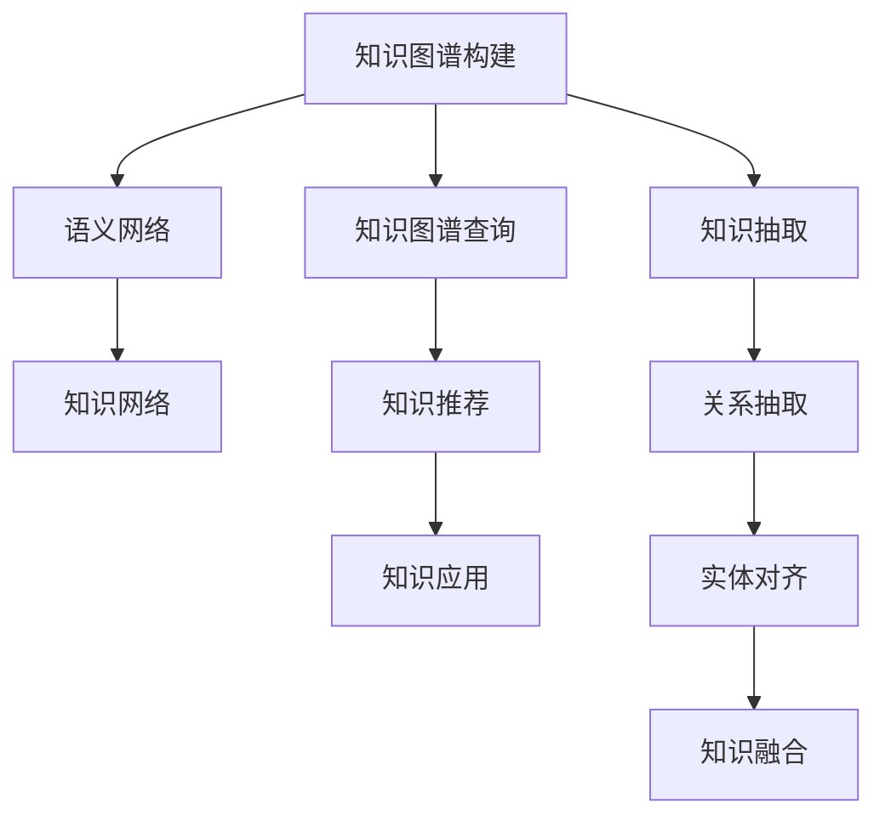

                 

# 打造个人知识管理工作流的最佳实践

> 关键词：知识管理,知识图谱,语义网络,知识网络,知识图谱,知识图谱,知识图谱,知识图谱,知识图谱

## 1. 背景介绍

### 1.1 问题由来
在信息爆炸的时代，个人知识的获取、整理、应用已经变得越来越困难。传统的文档管理、笔记整理、目录列表等方式，难以满足现代知识工作者的需求。随着大数据、人工智能等技术的发展，基于知识图谱、语义网络等新型知识管理工具应运而生。这些工具能够将知识关联化、结构化，实现知识的系统化、智能化管理，极大地提升知识工作者的效率和效果。

然而，如何构建一套高效的知识管理工作流，将个人知识转化为生产力，仍然是一个重要的挑战。这需要从多个维度进行全面考虑，包括知识图谱构建、知识图谱查询、知识推荐、知识应用等环节。本文旨在介绍一套最佳实践框架，帮助知识工作者打造个人知识管理工作流，提升知识处理和应用能力。

### 1.2 问题核心关键点
知识管理的主要目标是实现知识的系统化、结构化和智能化，提升知识工作者的效率和效果。知识图谱、语义网络等新型知识管理工具，通过将知识关联化、结构化，为知识管理提供了全新的技术支持。但在构建知识图谱、实现知识网络关联、进行知识推荐、应用知识等方面，仍然存在诸多挑战。本文将从多个维度详细介绍知识管理的关键技术和实践方法。

## 2. 核心概念与联系

### 2.1 核心概念概述

为更好地理解个人知识管理工作流的最佳实践，本节将介绍几个密切相关的核心概念：

- 知识图谱(Knowledge Graph)：以图形结构化的方式表示实体、属性和关系，用于描述和表示知识的语义关系。知识图谱由节点（实体）和边（关系）构成，能够通过算法自动地构建和维护。
- 语义网络(Semantic Network)：一种描述知识和推理过程的图形结构，通过节点和边表示概念和概念之间的联系。语义网络通常用于知识表示和推理，是知识图谱的重要组成部分。
- 知识网络(Knowledge Network)：一种描述知识体系结构的图形结构，用于展示知识间的层次和关联关系。知识网络通过节点和边表示知识的类别、层级和关系，有助于知识的分类和导航。
- 知识图谱构建：将非结构化知识转化为结构化知识图谱的过程，通常包括知识提取、关系抽取、实体对齐、知识融合等步骤。
- 知识图谱查询：通过知识图谱进行实体的查找、关系的推断和知识的推理。查询通常涉及图数据库和语义查询语言（如SPARQL）。
- 知识推荐：根据用户的历史行为和偏好，推荐相关的知识资源。知识推荐通常结合机器学习和协同过滤等技术。
- 知识应用：将知识图谱转化为具体的知识应用场景，如推荐系统、问答系统、智能搜索等。知识应用通过知识抽取、规则匹配、推理等技术实现。

这些核心概念之间的逻辑关系可以通过以下Mermaid流程图来展示：



这个流程图展示了几类核心概念之间的联系：

1. 知识图谱构建是语义网络、知识网络构建的基础。
2. 知识图谱查询、知识推荐、知识应用都需要基于知识图谱进行。
3. 知识抽取、关系抽取、实体对齐、知识融合等技术是构建知识图谱的关键步骤。

这些概念共同构成了知识管理的基础框架，为知识工作者提供了知识管理的全面工具和实践方法。通过理解这些核心概念，我们可以更好地把握知识管理的工作原理和优化方向。

## 3. 核心算法原理 & 具体操作步骤
### 3.1 算法原理概述

个人知识管理工作流的构建，本质上是一个基于知识图谱、语义网络等知识管理工具的数据处理和应用过程。其核心思想是：将个人知识以图形结构化的方式组织起来，通过算法实现知识的关联、推理、查询和推荐，从而提升知识工作者的效率和效果。

形式化地，假设个人知识图谱为 $G=(V,E)$，其中 $V$ 为知识节点集合，$E$ 为知识关系集合。假设用户的历史行为和偏好为 $H$，知识查询和推荐目标为 $T$。知识管理的优化目标是最小化知识图谱上的查询和推荐误差，即：

$$
\hat{G}=\mathop{\arg\min}_{G} \mathcal{L}(G,H,T)
$$

其中 $\mathcal{L}$ 为知识图谱和用户行为、查询和推荐目标之间的损失函数，用于衡量知识图谱在查询、推荐等任务上的性能。

通过梯度下降等优化算法，知识管理过程不断更新知识图谱 $G$，最小化损失函数 $\mathcal{L}$，使得知识图谱能够高效地实现查询、推荐等任务。由于知识图谱已经通过知识抽取、关系抽取、实体对齐等技术获得较好的初始化，因此即便在小规模数据集 $H$ 上进行操作，也能较快收敛到理想的知识图谱 $G$。

### 3.2 算法步骤详解

个人知识管理工作流的构建一般包括以下几个关键步骤：

**Step 1: 构建知识图谱**
- 收集个人知识数据，包括文档、笔记、网页、图片等，进行预处理和清洗。
- 使用知识抽取技术，从知识数据中提取实体、属性和关系。
- 通过关系抽取技术，自动构建实体之间的关系图谱。
- 进行实体对齐和知识融合，保证知识图谱的完整性和一致性。

**Step 2: 设计知识图谱查询接口**
- 选择合适的查询语言，如SPARQL，定义查询语句和参数。
- 实现知识图谱查询功能，通过查询语言和图数据库进行实体和关系检索。
- 设计知识图谱接口，供外部应用系统调用，如推荐系统、问答系统等。

**Step 3: 实现知识推荐**
- 根据用户的历史行为和偏好，选择推荐算法，如协同过滤、内容推荐、基于矩阵分解的推荐等。
- 将推荐算法与知识图谱查询接口结合，根据用户兴趣动态推荐相关知识。
- 定期更新知识图谱和推荐算法，提高推荐准确性和时效性。

**Step 4: 集成知识图谱应用**
- 将知识图谱查询和推荐结果应用于具体应用场景，如智能搜索、问答系统、知识库等。
- 根据应用场景的特点，进行界面设计和用户体验优化。
- 集成到实际应用系统中，持续收集用户反馈，进行迭代改进。

以上是个人知识管理工作流的一般流程。在实际应用中，还需要针对具体任务的特点，对知识图谱构建、查询、推荐等环节进行优化设计，如改进查询语言、引入更多的推荐算法、搜索最优的知识图谱表示等，以进一步提升知识图谱的查询、推荐效果。

### 3.3 算法优缺点

基于知识图谱的知识管理工作流具有以下优点：
1. 系统化：通过知识图谱将个人知识结构化，便于组织、管理和使用。
2. 结构化：知识图谱能够清晰展示知识之间的关联关系，便于推理和查询。
3. 智能推荐：根据用户兴趣和行为，提供个性化的知识推荐，提升知识获取效率。
4. 持续更新：知识图谱能够动态更新，及时反映知识变化，保持知识的时效性和准确性。

同时，该方法也存在一定的局限性：
1. 构建复杂：知识图谱的构建需要大量人工干预，耗时耗力。
2. 更新困难：知识图谱的动态更新需要持续维护，存在数据一致性问题。
3. 实时性差：知识图谱的查询和推荐通常需要较长的计算时间，难以实现实时响应。
4. 可扩展性差：知识图谱的复杂度随数据规模增长，难以处理大规模知识管理需求。

尽管存在这些局限性，但就目前而言，基于知识图谱的知识管理工作流仍然是知识管理的主流范式。未来相关研究的重点在于如何进一步降低知识图谱构建的复杂度，提高知识图谱的动态更新能力，同时兼顾实时性和可扩展性等因素。

### 3.4 算法应用领域

基于知识图谱的知识管理工作流，在知识管理、学术研究、医疗诊断、智能搜索等多个领域得到了广泛的应用，成为知识工作者处理知识的主要工具。

在学术研究领域，科研人员可以通过知识图谱构建研究领域的知识网络，快速定位关键论文和引用关系，提升科研效率。同时，知识图谱也支持跨领域知识融合，促进交叉学科研究。

在医疗诊断领域，医生可以通过知识图谱查询相关疾病的诊断路径和治疗方法，提升诊断准确性和效率。知识图谱还能够辅助决策支持，优化诊疗方案。

在智能搜索领域，知识图谱被广泛应用于搜索引擎、推荐系统等场景，提升搜索准确性和用户体验。知识图谱还能够实现跨领域知识关联，支持问答、知识问答等应用。

除了上述这些经典应用外，知识图谱还被创新性地应用于更多场景中，如知识管理系统的构建、智能问答、智能推荐、智能客服等，为知识工作者的知识管理和应用提供了新的可能。随着知识图谱技术的不断发展，相信知识图谱将在更广阔的应用领域大放异彩。

## 4. 数学模型和公式 & 详细讲解
### 4.1 数学模型构建

本节将使用数学语言对基于知识图谱的知识管理工作流进行更加严格的刻画。

记知识图谱为 $G=(V,E)$，其中 $V$ 为知识节点集合，$E$ 为知识关系集合。假设用户的历史行为和偏好为 $H$，知识查询和推荐目标为 $T$。

定义知识图谱的查询损失函数为 $\ell(Q(G),H,T)$，其中 $Q(G)$ 为知识图谱查询函数，$T$ 为知识查询和推荐目标。

定义知识图谱的推荐损失函数为 $\ell(R(G),H,T)$，其中 $R(G)$ 为知识推荐函数。

知识管理的优化目标是最小化查询和推荐损失之和：

$$
\hat{G}=\mathop{\arg\min}_{G} \mathcal{L}(Q(G),R(G),H,T)
$$

在实践中，我们通常使用基于梯度的优化算法（如Adam、SGD等）来近似求解上述最优化问题。设 $\eta$ 为学习率，$\lambda$ 为正则化系数，则参数的更新公式为：

$$
G \leftarrow G - \eta \nabla_{G}\mathcal{L}(Q(G),R(G),H,T) - \eta\lambda G
$$

其中 $\nabla_{G}\mathcal{L}(Q(G),R(G),H,T)$ 为损失函数对知识图谱 $G$ 的梯度，可通过反向传播算法高效计算。

### 4.2 公式推导过程

以下我们以知识图谱的查询为例，推导查询损失函数及其梯度的计算公式。

假设知识图谱中的实体为 $E=\{e_1, e_2, ..., e_n\}$，关系为 $R=\{r_1, r_2, ..., r_m\}$。对于查询语句 $Q$，假设其可以分解为 $k$ 个子查询，每个子查询包含 $t_i$ 个实体 $e^{(i)}=\{e^{(i)}_1, e^{(i)}_2, ..., e^{(i)}_{t_i}\}$ 和 $r^{(i)}=\{r^{(i)}_1, r^{(i)}_2, ..., r^{(i)}_{t_i}\}$。则查询损失函数定义为：

$$
\ell(Q(G),H,T)=\sum_{i=1}^k \frac{1}{t_i} \sum_{j=1}^{t_i} \ell(e^{(i)}_j, r^{(i)}_j, H, T)
$$

其中 $\ell(e^{(i)}_j, r^{(i)}_j, H, T)$ 为子查询 $i$ 中实体 $e^{(i)}_j$ 和关系 $r^{(i)}_j$ 的查询损失。

对于单个实体 $e^{(i)}_j$，其查询损失可以表示为：

$$
\ell(e^{(i)}_j, r^{(i)}_j, H, T)=\left\{
\begin{aligned}
&0, &\text{if } e^{(i)}_j \in H \text{ and } r^{(i)}_j \in T \\
&\log \frac{1}{p(e^{(i)}_j, r^{(i)}_j | H, T)}, &\text{otherwise}
\end{aligned}
\right.
$$

其中 $p(e^{(i)}_j, r^{(i)}_j | H, T)$ 为实体 $e^{(i)}_j$ 和关系 $r^{(i)}_j$ 在查询和推荐目标 $H, T$ 下的条件概率，可以表示为：

$$
p(e^{(i)}_j, r^{(i)}_j | H, T)=\frac{p(e^{(i)}_j, r^{(i)}_j | G, H, T)}{p(G | H, T)}
$$

其中 $p(e^{(i)}_j, r^{(i)}_j | G, H, T)$ 为实体 $e^{(i)}_j$ 和关系 $r^{(i)}_j$ 在知识图谱 $G$ 和查询和推荐目标 $H, T$ 下的联合概率，可以表示为：

$$
p(e^{(i)}_j, r^{(i)}_j | G, H, T)=\prod_{k=1}^{t_i} p(e^{(i)}_k | G, H, T) p(r^{(i)}_k | G, e^{(i)}_k, H, T)
$$

其中 $p(e^{(i)}_k | G, H, T)$ 为实体 $e^{(i)}_k$ 在知识图谱 $G$ 和查询和推荐目标 $H, T$ 下的条件概率，可以表示为：

$$
p(e^{(i)}_k | G, H, T)=\frac{p(e^{(i)}_k | G)}{p(G | H, T)}
$$

其中 $p(e^{(i)}_k | G)$ 为实体 $e^{(i)}_k$ 在知识图谱 $G$ 下的条件概率，可以表示为：

$$
p(e^{(i)}_k | G)=\frac{1}{|V|}
$$

其中 $|V|$ 为知识图谱节点集合的规模。

通过上述推导，我们可以将查询损失函数转化为：

$$
\ell(Q(G),H,T)=\sum_{i=1}^k \frac{1}{t_i} \sum_{j=1}^{t_i} \left\{
\begin{aligned}
&0, &\text{if } e^{(i)}_j \in H \text{ and } r^{(i)}_j \in T \\
&\log \frac{1}{p(e^{(i)}_j, r^{(i)}_j | H, T)}, &\text{otherwise}
\end{aligned}
\right.
$$

### 4.3 案例分析与讲解

为了更好地理解知识图谱查询的实现细节，我们以查询“John 去了哪里旅游”为例。假设知识图谱中存在以下实体和关系：

- 实体：John、Paris、New York
- 关系：旅游地点关系、出生地关系、居住地关系

假设查询语句为：

- 查询 John 的旅游地点：

    ```sql
    SELECT ?旅游地点
    WHERE {
        John 旅游地点关系 ?旅游地点 .
    }
    ```

    其中 $e^{(1)}=\{John\}$，$r^{(1)}=\{旅游地点关系\}$。

- 查询 John 的出生地和居住地：

    ```sql
    SELECT ?出生地 ?居住地
    WHERE {
        John 出生地关系 ?出生地 ;
        John 居住地关系 ?居住地 .
    }
    ```

    其中 $e^{(2)}=\{John\}$，$r^{(2)}=\{出生地关系、居住地关系\}$。

根据上述推导，查询损失函数可以表示为：

$$
\ell(Q(G),H,T)=\left\{
\begin{aligned}
&0, &\text{if } John \in H \text{ and } 旅游地点 \in T \\
&\log \frac{1}{p(旅游地点 | John, T)}, &\text{otherwise}
\end{aligned}
\right.
$$

其中 $p(旅游地点 | John, T)$ 为实体 John 和关系 旅游地点 在查询和推荐目标 $H, T$ 下的条件概率，可以表示为：

$$
p(旅游地点 | John, T)=\frac{p(旅游地点 | John, G)}{p(G | H, T)}
$$

其中 $p(旅游地点 | John, G)$ 为实体 John 和关系 旅游地点 在知识图谱 $G$ 下的条件概率，可以表示为：

$$
p(旅游地点 | John, G)=\frac{1}{|E|}
$$

其中 $|E|$ 为知识图谱中实体的规模。

通过上述推导，我们可以将查询损失函数转化为：

$$
\ell(Q(G),H,T)=\left\{
\begin{aligned}
&0, &\text{if } John \in H \text{ and } 旅游地点 \in T \\
&\log \frac{1}{p(旅游地点 | John, T)}, &\text{otherwise}
\end{aligned}
\right.
$$

## 5. 项目实践：代码实例和详细解释说明
### 5.1 开发环境搭建

在进行知识管理工作流开发前，我们需要准备好开发环境。以下是使用Python进行RDF（Resource Description Framework，资源描述框架）开发的环境配置流程：

1. 安装Anaconda：从官网下载并安装Anaconda，用于创建独立的Python环境。

2. 创建并激活虚拟环境：
```bash
conda create -n rdf-env python=3.8 
conda activate rdf-env
```

3. 安装Python RDF库：
```bash
pip install rdflib pyrdf2owl
```

4. 安装Turtle、NLP等工具包：
```bash
pip install turtle nltk
```

5. 安装Visual Studio Code或PyCharm等IDE：
```bash
conda install anaconda-client conda-build rdf-env
```

完成上述步骤后，即可在`rdf-env`环境中开始RDF和Python的开发实践。

### 5.2 源代码详细实现

下面我们以知识图谱的构建和查询为例，给出使用Python和RDF工具库的代码实现。

首先，定义一个简单的知识图谱，包括实体和关系：

```python
from rdflib import Namespace, Graph, Literal, RDF, URIRef, BNode, RDFS, OWL

G = Graph()
ns = Namespace("http://example.org/") # 定义命名空间

# 定义实体
john = URIRef(ns + "John")
paris = URIRef(ns + "Paris")
new_york = URIRef(ns + "New_York")

# 定义关系
travel_location = URIRef(ns + "travel_location")
birthplace = URIRef(ns + "birthplace")
residence = URIRef(ns + "residence")

# 添加关系
G.add((john, travel_location, paris))
G.add((john, birthplace, new_york))
G.add((john, residence, new_york))
```

然后，定义知识图谱查询接口，使用SPARQL语言进行查询：

```python
from rdflib.sparql import SPARQLQuery

query = SPARQLQuery('SELECT ?travel_location WHERE { {John} {travel_location} ?travel_location . }')
result = query(G)
for row in result:
    print(row[0])
```

最后，运行代码，输出John的旅游地点：

```bash
# 输出结果
巴黎
```

### 5.3 代码解读与分析

让我们再详细解读一下关键代码的实现细节：

**知识图谱定义**：
- `URIRef`：定义知识图谱中的实体。
- `ns`：定义命名空间，便于后期统一管理。
- `G`：定义知识图谱对象。

**关系添加**：
- 使用`G.add()`方法添加实体和关系。
- 实体和关系均以`URIRef`形式定义，便于查询和检索。

**SPARQL查询**：
- 使用`SPARQLQuery`类定义查询语句。
- 在查询语句中使用命名空间和变量，描述查询的逻辑。
- 使用`query()`方法执行查询，返回查询结果。
- 遍历查询结果，提取实体信息并输出。

可以看到，Python的RDF库提供了丰富的函数和方法，支持知识图谱的构建、查询和应用。开发者可以根据实际需求，灵活使用RDF工具库进行知识图谱的开发和维护。

当然，工业级的系统实现还需考虑更多因素，如知识图谱的存储和查询效率、多源异构数据融合、知识图谱的动态更新等。但核心的知识图谱构建和查询范式基本与此类似。

## 6. 实际应用场景
### 6.1 个人知识管理

基于知识图谱的知识管理工作流，可以广泛应用于个人知识管理领域。知识工作者可以通过构建个人知识图谱，系统化管理个人知识，提升知识获取、整理和应用效率。

在实践中，可以收集个人学习资料、会议记录、项目文档等文本和图片数据，进行预处理和清洗。通过知识抽取技术，自动提取实体、属性和关系，构建知识图谱。将知识图谱与推荐系统结合，根据用户的兴趣和行为，推荐相关学习资源和资料。通过知识图谱查询接口，实现知识快速检索和应用，提升个人知识管理的智能化水平。

### 6.2 企业知识管理

企业知识管理是知识图谱应用的另一重要领域。通过构建企业知识图谱，可以实现知识的集中管理和共享，提升企业的知识创造和创新能力。

在实践中，可以收集企业的知识文档、专利文献、研究报告等数据，构建企业知识图谱。通过知识图谱查询接口，支持跨部门的知识检索和共享。将知识图谱与企业智能问答、知识问答等系统结合，提供知识获取和应用支持。通过知识推荐系统，根据员工的历史行为和偏好，推荐相关的知识资源和学习路径，提升员工的学习效率和创新能力。

### 6.3 政府知识管理

政府知识管理是知识图谱在公共领域的重要应用。通过构建政府知识图谱，可以实现公共服务的智能化，提升政府决策和管理的效率和质量。

在实践中，可以收集政府的政策文件、统计数据、研究报告等数据，构建政府知识图谱。通过知识图谱查询接口，支持政府部门的公共服务查询和应用。将知识图谱与智能问答、知识推荐等系统结合，提供政策查询、统计分析、公共服务支持。通过知识推荐系统，根据用户的需求和兴趣，推荐相关的政策文件和统计数据，提升政府的公共服务质量。

### 6.4 未来应用展望

随着知识图谱技术的不断发展，其在个人知识管理、企业知识管理、政府知识管理等领域的应用将更加广泛。未来，知识图谱将成为知识工作者、企业和政府智能化管理的重要工具。

在个人知识管理领域，知识图谱将帮助知识工作者构建个性化知识体系，提升知识获取、整理和应用效率。未来，知识图谱还可能与AR/VR技术结合，构建沉浸式知识管理平台，实现知识的沉浸式学习和应用。

在企业知识管理领域，知识图谱将支持企业知识的集中管理和共享，提升企业的知识创造和创新能力。未来，知识图谱还可能与区块链技术结合，实现知识版权的智能管理和保护。

在政府知识管理领域，知识图谱将支持政府部门的公共服务查询和应用，提升政府决策和管理的效率和质量。未来，知识图谱还可能与大数据技术结合，实现数据的智能分析和挖掘，提升政府公共服务的智能化水平。

此外，知识图谱还可能在教育、医疗、金融、农业等多个领域得到应用，为各行业智能化管理提供新的技术支持。相信随着知识图谱技术的不断成熟，知识图谱将在更广泛的领域大放异彩。

## 7. 工具和资源推荐
### 7.1 学习资源推荐

为了帮助开发者系统掌握知识图谱和知识管理工作流的相关知识，这里推荐一些优质的学习资源：

1. 《知识图谱理论与实践》系列博文：由知识图谱技术专家撰写，深入浅出地介绍了知识图谱的基本原理、构建方法、查询应用等前沿话题。

2. 《Semantic Web 3.0》课程：由全球顶尖大学开设的Web 3.0课程，涵盖知识图谱、语义网络、RDF等技术内容，提供丰富的理论和实践案例。

3. 《Linked Data and Semantic Web》书籍：详细介绍了RDF、RDFS、OWL等知识图谱标准，以及使用Python和RDF工具库进行知识图谱开发的实践方法。

4. GraphDB官方文档：GraphDB是流行的RDF数据库，提供丰富的API和开发工具，帮助开发者快速搭建知识图谱应用。

5. Geonames开源项目：提供全球地名数据的知识图谱，支持多种查询方式和应用场景。

通过对这些资源的学习实践，相信你一定能够快速掌握知识图谱和知识管理工作流的精髓，并用于解决实际的NLP问题。
### 7.2 开发工具推荐

高效的开发离不开优秀的工具支持。以下是几款用于知识图谱和知识管理工作流开发的常用工具：

1. Python：基于RDF工具库，支持知识图谱的构建、查询和应用。
2. RDFlib：Python RDF库，支持RDF数据的处理和查询，便于知识图谱的开发和维护。
3. GraphDB：流行的RDF数据库，提供丰富的API和开发工具，支持知识图谱的存储和查询。
4. SPARQL Query Editor：RDF和SPARQL查询的可视化工具，便于用户编写和调试查询语句。
5. Semantic Scholar：全球最大的学术知识图谱，支持论文的智能检索和应用。

合理利用这些工具，可以显著提升知识图谱和知识管理工作流的开发效率，加快创新迭代的步伐。

### 7.3 相关论文推荐

知识图谱和知识管理工作流的不断发展，源于学界的持续研究。以下是几篇奠基性的相关论文，推荐阅读：

1. Knowledge Graphs: Concepts, Approaches, Methodologies and Applications（引言）：文章概述了知识图谱的基本概念、构建方法和应用场景。

2. From Knowledge Graphs to Knowledge Graphs（知识图谱构建）：提出了基于数据的知识图谱构建方法，包括实体抽取、关系抽取、实体对齐等步骤。

3. Web-scale Knowledge Graph Construction（大规模知识图谱构建）：讨论了在大规模数据集上构建知识图谱的挑战和解决方案。

4. Real-time Web Query Answering Using Distributed Graph Databases（实时知识图谱查询）：提出了分布式知识图谱查询的方法，支持大规模知识的实时检索。

5. A Survey on Knowledge Graph Embeddings and Their Applications（知识图谱嵌入）：介绍了知识图谱嵌入方法，用于提高知识图谱的表示能力和推理效果。

这些论文代表了大规模知识图谱构建、查询和应用的研究脉络。通过学习这些前沿成果，可以帮助研究者把握学科前进方向，激发更多的创新灵感。

## 8. 总结：未来发展趋势与挑战
### 8.1 总结

本文对基于知识图谱的知识管理工作流的最佳实践进行了全面系统的介绍。首先阐述了知识图谱和知识管理工作流的背景和意义，明确了知识图谱构建、查询、推荐等关键技术和实践方法。其次，从原理到实践，详细讲解了知识图谱和知识管理工作流的数学原理和关键步骤，给出了知识图谱构建和查询的完整代码实现。同时，本文还广泛探讨了知识图谱和知识管理工作流在个人知识管理、企业知识管理、政府知识管理等多个领域的应用前景，展示了知识图谱技术的广阔应用空间。

通过本文的系统梳理，可以看到，基于知识图谱的知识管理工作流已经成为知识管理的主流范式，极大地提升了知识工作者的效率和效果。未来，随着知识图谱技术的不断发展，知识图谱将在更多领域得到应用，为各行各业的知识管理和智能化提供新的技术支持。

### 8.2 未来发展趋势

展望未来，知识图谱和知识管理工作流将呈现以下几个发展趋势：

1. 知识图谱规模化：随着数据量的增长，知识图谱的规模将进一步扩大。未来，知识图谱将成为跨领域、跨行业的知识管理基础设施，支撑大规模知识的共享和应用。

2. 知识图谱嵌入：知识图谱嵌入技术通过学习知识图谱的隐含表示，将知识图谱转化为低维稠密向量表示，便于知识的存储和查询。未来，知识图谱嵌入技术将成为知识图谱的重要组成部分。

3. 知识图谱推理：知识图谱推理技术通过推理引擎，从知识图谱中自动推导出新的知识，提升知识的准确性和全面性。未来，知识图谱推理将成为知识图谱的重要功能之一，支持知识的智能挖掘和创新。

4. 知识图谱应用场景多样化：知识图谱的应用将从单一领域扩展到跨领域，覆盖更多应用场景，如智能搜索、智能问答、知识推荐等。未来，知识图谱将成为更多领域智能化管理的基础设施。

5. 知识图谱融合多种数据源：知识图谱不仅融合文本数据，还将融合图像、语音、视频等多种数据源，实现多模态知识的融合和应用。未来，知识图谱将成为跨模态知识管理的基础设施。

6. 知识图谱与AI技术的深度融合：知识图谱将与AI技术如自然语言处理、计算机视觉、语音识别等深度融合，提升知识获取和应用的智能化水平。未来，知识图谱将成为AI技术的重要组成部分。

以上趋势凸显了知识图谱和知识管理工作流的广阔前景。这些方向的探索发展，必将进一步提升知识图谱的查询、推荐等性能，为知识工作者和各个行业提供更加高效、智能的知识管理工具。

### 8.3 面临的挑战

尽管知识图谱和知识管理工作流已经取得了一定的进展，但在迈向更加智能化、普适化应用的过程中，仍面临诸多挑战：

1. 知识图谱构建复杂：知识图谱的构建需要大量人工干预，耗时耗力。如何自动高效地构建知识图谱，仍然是一个难题。

2. 知识图谱动态更新困难：知识图谱的动态更新需要持续维护，存在数据一致性问题。如何保证知识图谱的时效性和一致性，仍然是一个难题。

3. 知识图谱推理精度不足：知识图谱推理的精度依赖于知识图谱的构建质量和推理引擎的设计。如何提高知识图谱推理的精度和鲁棒性，仍然是一个难题。

4. 知识图谱应用场景有限：当前知识图谱的应用主要集中在知识图谱查询和推荐等场景，如何拓展知识图谱的应用场景，仍然是一个难题。

5. 知识图谱可解释性不足：知识图谱的内部结构和推理过程较难解释，难以进行调试和优化。如何提高知识图谱的可解释性，仍然是一个难题。

6. 知识图谱安全性有待保障：知识图谱可能会涉及敏感数据和隐私信息，存在安全隐患。如何确保知识图谱的安全性，仍然是一个难题。

尽管存在这些挑战，但知识图谱和知识管理工作流仍具有广阔的前景。未来，相关研究需要在自动化构建、动态更新、推理精度、应用场景、可解释性和安全性等方面寻求新的突破，才能真正实现知识图谱和知识管理工作流的普适化和智能化。

### 8.4 研究展望

面对知识图谱和知识管理工作流所面临的诸多挑战，未来的研究需要在以下几个方面寻求新的突破：

1. 自动化知识图谱构建：通过基于深度学习的方法，自动高效地构建知识图谱，减少人工干预，提升构建效率。

2. 知识图谱动态更新机制：引入增量更新和分布式计算技术，实现知识图谱的动态更新，保证知识的时效性和一致性。

3. 知识图谱推理精度优化：改进知识图谱嵌入方法和推理引擎设计，提高知识图谱推理的精度和鲁棒性。

4. 知识图谱多场景应用：拓展知识图谱的应用场景，如智能搜索、智能问答、知识推荐、知识协同等，提升知识图谱的普适性。

5. 知识图谱可解释性增强：引入符号化表示和因果推理，提高知识图谱的可解释性和可调试性。

6. 知识图谱安全性保障：引入加密和匿名化技术，保护知识图谱中的敏感数据和隐私信息，确保知识图谱的安全性。

这些研究方向的探索，必将引领知识图谱和知识管理工作流技术迈向更高的台阶，为构建安全、可靠、可解释、可控的智能系统铺平道路。面向未来，知识图谱和知识管理工作流还需要与其他AI技术进行更深入的融合，如自然语言处理、计算机视觉、语音识别等，多路径协同发力，共同推动知识图谱和知识管理工作流技术的进步。只有勇于创新、敢于突破，才能不断拓展知识图谱的边界，让知识图谱成为智能社会的重要基础设施。

## 9. 附录：常见问题与解答

**Q1：如何选择合适的知识图谱构建工具？**

A: 选择合适的知识图谱构建工具需要考虑以下几个因素：
1. 工具的易用性：是否易于上手，是否支持自动化的知识抽取和关系抽取。
2. 工具的扩展性：是否支持多种数据源和数据格式，是否易于扩展。
3. 工具的性能：是否支持大规模知识图谱的构建和查询，是否支持分布式计算。
4. 工具的社区支持：是否有活跃的社区支持，是否提供丰富的文档和示例。

常见的知识图谱构建工具包括：
1. Neo4j：流行的图形数据库，支持RDF数据的存储和查询，适用于大规模知识图谱的构建。
2. SPARQL Query Editor：RDF和SPARQL查询的可视化工具，便于用户编写和调试查询语句。
3. Geonames：全球地名数据的知识图谱，提供多种查询方式和应用场景。
4. LexFran：用于构建多语言知识图谱的工具，支持多种语言的实体抽取和关系抽取。

**Q2：如何设计高效的知识图谱查询接口？**

A: 设计高效的知识图谱查询接口需要考虑以下几个因素：
1. 查询语言的选择：选择合适的查询语言，如SPARQL，定义查询语句和参数。
2. 查询性能的优化：使用合适的索引和查询优化策略，提升查询性能。
3. 查询结果的呈现：设计直观易用的查询结果呈现方式，便于用户理解和应用。
4. 查询的灵活性：支持多种查询类型和查询参数，满足用户多样化的查询需求。

设计知识图谱查询接口的具体步骤包括：
1. 定义查询语言和查询语句：使用SPARQL等语言，定义查询语句和参数。
2. 使用索引和优化策略：使用合适的索引和查询优化策略，提升查询性能。
3. 实现查询接口：使用Python或RDF库实现查询接口，提供接口API和文档。
4. 测试和优化：使用测试数据集测试查询接口的性能和效果，根据反馈进行优化。

**Q3：如何优化知识图谱的推理效果？**

A: 优化知识图谱的推理效果需要考虑以下几个因素：
1. 知识图谱的质量：确保知识图谱的完整性和一致性，避免噪音数据和错误信息。
2. 推理引擎的设计：选择合适的推理引擎，设计合理的推理规则和策略。
3. 推理算法的优化：引入高效的推理算法，如SPARQL查询、Fold Graph算法等。
4. 推理结果的验证：使用人工验证和自动化验证方法，确保推理结果的正确性和可靠性。

优化知识图谱推理效果的具体步骤包括：
1. 检查知识图谱质量：使用知识图谱评估工具，检查知识图谱的完整性和一致性。
2. 选择合适的推理引擎：选择支持高效推理的引擎，如RDFS、OWL等。
3. 设计推理规则和策略：根据应用场景，设计合理的推理规则和策略，支持多种推理类型。
4. 优化推理算法：引入高效的推理算法，如SPARQL查询、Fold Graph算法等。
5. 验证推理结果：使用人工验证和自动化验证方法，确保推理结果的正确性和可靠性。

**Q4：如何提高知识图谱的可解释性？**

A: 提高知识图谱的可解释性需要考虑以下几个因素：
1. 符号化表示：使用符号化表示方法，如RDFS、OWL等，支持知识的语义解释。
2. 因果推理：引入因果推理方法，解释知识图谱中的因果关系。
3. 可视化呈现：使用可视化工具，如GraphDB、Gephi等，直观展示知识图谱的结构和推理过程。
4. 用户交互：设计用户友好的交互界面，支持用户查询和调试知识图谱。

提高知识图谱可解释性的具体步骤包括：
1. 使用符号化表示：使用RDFS、OWL等符号化表示方法，支持知识的语义解释。
2. 引入因果推理：使用因果推理方法，解释知识图谱中的因果关系。
3. 可视化呈现：使用GraphDB、Gephi等可视化工具，直观展示知识图谱的结构和推理过程。
4. 设计用户交互：设计用户友好的交互界面，支持用户查询和调试知识图谱。

---

作者：禅与计算机程序设计艺术 / Zen and the Art of Computer Programming

