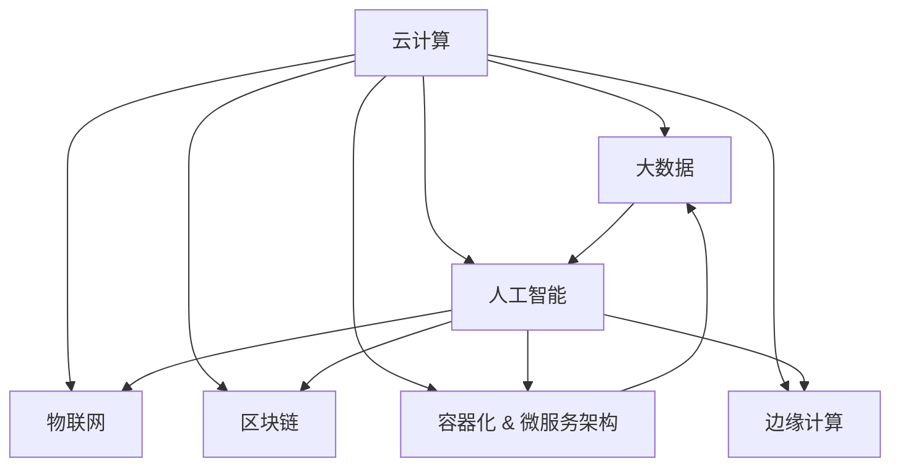

                 

## 1. 背景介绍

### 1.1 问题由来
在快速发展的数字化时代，自动化的理念与技术已深入各行各业，成为企业降本增效、提升竞争力的关键。尤其是在创业领域，自动化生态系统的构建不仅能够加速产品开发、提升运营效率，还能为初创公司带来前所未有的机遇。但如何构建一个全面、高效、可持续的自动化生态系统，是众多创业者和技术专家亟待解决的问题。

### 1.2 问题核心关键点
构建自动化创业生态系统，核心在于整合软硬件资源，通过构建智能化的IT基础设施，为企业提供自动化解决方案，实现业务流程的数字化、智能化转型。这一过程涉及云计算、大数据、人工智能、物联网等多个领域的深度融合，其关键点在于：

1. **集成多种技术**：充分利用云计算、大数据、AI、IoT等新兴技术，为创业企业提供全栈的技术支持。
2. **统一标准化接口**：构建统一的API和SDK接口，简化技术接入和集成。
3. **数据驱动决策**：通过数据分析和智能算法，为业务决策提供支持，提升运营效率。
4. **可持续发展**：通过持续的生态建设和技术迭代，确保生态系统的活力和可持续性。

### 1.3 问题研究意义
构建自动化创业生态系统，对于加速创业企业发展、提升行业整体效率、推动数字化转型具有重要意义：

1. **加速产品开发**：自动化流程大幅缩短了产品从概念到市场的时间，使得创业者能够快速迭代、快速响应市场需求。
2. **提升运营效率**：通过自动化工具和平台，优化资源配置，提升生产力和运营效率。
3. **增强竞争优势**：构建竞争性自动化生态系统，能够为企业带来差异化的竞争优势。
4. **推动行业升级**：自动化技术的应用，可以带来产业链的整体优化和升级，推动整个行业的发展。
5. **支持企业成长**：随着企业规模的扩大，自动化生态系统能够适应企业的业务需求变化，为其长期成长提供支持。

## 2. 核心概念与联系

### 2.1 核心概念概述

为更好地理解自动化创业生态系统的构建，本节将介绍几个密切相关的核心概念：

- **云计算(Cloud Computing)**：基于互联网的计算模式，用户通过网络按需获取计算资源，支持弹性计算和资源共享。
- **大数据(Big Data)**：指规模巨大、类型多样、价值密度低、处理速度快的数据集合，通过大数据技术进行分析和应用，能获得更深刻、更准确的洞察。
- **人工智能(AI)**：涵盖机器学习、深度学习、自然语言处理等多种技术，使机器具备类似人类的思考和学习能力。
- **物联网(IoT)**：通过互联网将各种设备、传感器等物联起来，实现设备间的互联互通和智能化控制。
- **区块链(Blockchain)**：一种分布式账本技术，通过去中心化、不可篡改的特性，提供更安全、透明的数据管理和交易机制。
- **容器化与微服务架构(Containerization & Microservices)**：通过容器化技术，实现应用程序的封装、打包和部署，通过微服务架构，将复杂系统分解为多个小服务，提升系统的灵活性和可扩展性。
- **边缘计算(Edge Computing)**：通过在靠近数据源的本地设备上执行计算任务，减少延迟、提高效率。

这些核心概念之间的逻辑关系可以通过以下Mermaid流程图来展示：



这个流程图展示了几大核心概念的相互依赖和相互支持关系，共同构成了自动化创业生态系统的技术基础。

## 3. 核心算法原理 & 具体操作步骤

### 3.1 算法原理概述

构建自动化创业生态系统，其核心在于通过整合多种技术，打造一个高效、智能、可持续的IT基础设施。其核心算法原理包括：

- **数据采集与预处理**：通过传感器、API等手段，自动采集业务数据，并进行清洗、标注、归一化等预处理，以便后续分析和使用。
- **数据分析与建模**：利用大数据技术，对采集到的数据进行分布式计算、存储和分析，通过机器学习、深度学习等算法，构建业务模型和预测模型。
- **自动化流程与决策**：基于构建的业务模型，利用AI技术进行自动化决策，优化资源配置，提升运营效率。
- **持续监控与优化**：通过实时监控和反馈机制，不断优化系统性能和资源分配，确保生态系统的可持续性和稳定性。

### 3.2 算法步骤详解

构建自动化创业生态系统的算法步骤主要包括以下几个关键环节：

**Step 1: 需求分析与系统设计**
- 识别创业企业的主要业务流程和需求，确定自动化解决方案的目标和范围。
- 设计系统架构，包括云平台、数据存储、微服务架构、API接口等。

**Step 2: 数据集成与清洗**
- 通过API、ETL工具等手段，将不同来源的数据进行集成，并进行清洗、去重、归一化等预处理。
- 构建数据管道，确保数据流向正确，满足分析、存储、访问的需求。

**Step 3: 数据分析与建模**
- 利用大数据技术，对清洗后的数据进行分布式计算和存储，通过机器学习、深度学习等算法，构建业务模型和预测模型。
- 对构建的模型进行评估和优化，确保其准确性和鲁棒性。

**Step 4: 自动化流程设计与实现**
- 根据业务需求，设计自动化流程，包括数据采集、处理、分析、决策等环节。
- 利用API、SDK、微服务架构等技术，实现自动化流程的实现。
- 设计用户界面和API接口，简化技术接入和集成。

**Step 5: 持续监控与优化**
- 通过实时监控工具，持续跟踪系统性能和资源使用情况，发现并解决潜在问题。
- 根据监控数据，不断优化算法模型和流程设计，提升系统效率和稳定性。

### 3.3 算法优缺点

构建自动化创业生态系统的算法具有以下优点：

- **高效灵活**：通过自动化技术，可以快速响应业务需求变化，提高资源利用效率。
- **成本可控**：通过云平台等技术，实现按需计费，降低IT基础设施的投入成本。
- **数据驱动**：通过大数据分析和AI决策，提供更加科学和精准的业务支持。
- **弹性扩展**：通过容器化与微服务架构，实现系统的快速扩展和升级。

同时，该算法也存在以下局限性：

- **技术复杂**：构建自动化生态系统涉及多种技术和工具，对技术团队的要求较高。
- **数据安全**：需要确保数据采集、存储、传输和处理的安全性，防止数据泄露和滥用。
- **系统耦合**：各模块和组件之间的紧密耦合可能增加系统复杂性和维护难度。
- **持续维护**：系统需要持续监控和维护，以应对技术更新和业务变化。

### 3.4 算法应用领域

构建自动化创业生态系统的算法，已经广泛应用于以下几个领域：

- **企业信息化建设**：通过云平台、大数据、AI等技术，实现企业内部信息化系统构建，提升管理效率和决策支持能力。
- **智能制造**：通过物联网、工业大数据等技术，实现生产流程的自动化、智能化，提升生产效率和产品质量。
- **智慧城市**：通过云计算、物联网、AI等技术，实现城市管理的智能化、精细化，提升城市运行效率和居民生活质量。
- **金融科技**：通过区块链、大数据、AI等技术，实现金融服务的自动化、安全化，提升金融服务质量和用户体验。
- **健康医疗**：通过物联网、大数据、AI等技术，实现医疗数据的智能化分析与决策，提升医疗服务质量和患者体验。
- **智能交通**：通过物联网、AI等技术，实现交通流量的智能化管理与优化，提升交通效率和安全性。

这些领域的应用展示了自动化创业生态系统的广泛前景和巨大潜力，为各行各业带来了深刻的变革。

## 4. 数学模型和公式 & 详细讲解 & 举例说明

### 4.1 数学模型构建

为更好地理解和实现自动化创业生态系统的核心算法，本节将介绍几个关键数学模型：

- **分布式计算模型**：利用MapReduce等算法，实现大数据的分布式计算。
- **机器学习模型**：通过逻辑回归、随机森林、深度学习等算法，构建业务预测模型。
- **优化算法模型**：通过遗传算法、梯度下降等算法，优化模型参数，提升预测精度。

### 4.2 公式推导过程

以下我们将分别推导几个关键模型的公式，以便更深入地理解其原理。

**分布式计算模型**

MapReduce是一种常用的分布式计算框架，其基本流程如下：

1. Map阶段：将数据分成多个小块，并行地对每个小块进行计算，得到中间结果。
2. Shuffle阶段：将Map阶段的结果进行合并和排序，形成新的数据块。
3. Reduce阶段：对Shuffle阶段的结果进行聚合和计算，得到最终结果。

MapReduce的公式推导如下：

- Map函数：将输入数据分为多个小块，并行地计算每个小块，得到中间结果。
- Reduce函数：对Map函数的结果进行合并和排序，最终得到输出结果。

公式如下：

$$
\text{Map}(\text{Key}, \text{Value}) \rightarrow \text{Intermediate Key}, \text{Intermediate Value}
$$

$$
\text{Reduce}(\text{Intermediate Key}, \text{Intermediate Value}) \rightarrow \text{Output Key}, \text{Output Value}
$$

**机器学习模型**

以线性回归模型为例，公式推导如下：

假设输入数据为 $X = (x_1, x_2, ..., x_n)$，目标变量为 $Y$，线性回归模型的公式为：

$$
Y = \beta_0 + \beta_1x_1 + \beta_2x_2 + ... + \beta_nx_n
$$

其中 $\beta_0, \beta_1, \beta_2, ..., \beta_n$ 为模型的系数，通过最小二乘法求解得到：

$$
\beta = (X^TX)^{-1}X^TY
$$

**优化算法模型**

以梯度下降算法为例，公式推导如下：

设目标函数为 $J(\theta)$，其中 $\theta$ 为模型参数，梯度下降算法的公式为：

$$
\theta_j = \theta_j - \eta\frac{\partial J(\theta)}{\partial \theta_j}
$$

其中 $\eta$ 为学习率，$\frac{\partial J(\theta)}{\partial \theta_j}$ 为目标函数对参数 $\theta_j$ 的梯度，通过不断迭代，直至目标函数收敛。

### 4.3 案例分析与讲解

以智能制造中的生产过程自动化为例，展示自动化生态系统如何通过集成多种技术，提升生产效率和产品质量。

1. **数据采集**：通过物联网传感器，实时采集生产设备的运行数据，包括温度、压力、振动等指标。
2. **数据清洗与处理**：利用大数据技术，对采集到的数据进行清洗、去重、归一化等预处理，确保数据的质量。
3. **数据分析与建模**：通过机器学习算法，对处理后的数据进行分析，建立生产设备的预测模型，预测设备故障和维护需求。
4. **自动化流程与决策**：利用AI技术，根据预测模型，自动生成生产调度、设备维护等指令，实现生产流程的自动化和智能化。
5. **持续监控与优化**：通过实时监控工具，持续跟踪生产设备的状态和运行情况，及时发现和解决潜在问题，确保生产过程的稳定性和高效性。

## 5. 项目实践：代码实例和详细解释说明

### 5.1 开发环境搭建

在进行自动化创业生态系统的实践前，我们需要准备好开发环境。以下是使用Python进行Django开发的环境配置流程：

1. 安装Anaconda：从官网下载并安装Anaconda，用于创建独立的Python环境。

2. 创建并激活虚拟环境：
```bash
conda create -n django-env python=3.8 
conda activate django-env
```

3. 安装Django：
```bash
pip install django
```

4. 安装相关第三方库：
```bash
pip install pandas numpy matplotlib
```

5. 安装Django的管理界面工具：
```bash
pip install django-admin-shell
```

完成上述步骤后，即可在`django-env`环境中开始实践。

### 5.2 源代码详细实现

下面以智能制造中的生产过程自动化为例，给出使用Django进行开发的全栈实践代码实现。

```python
# 创建Django项目
django-admin startproject manufacturing_system

# 创建Django应用
python manage.py startapp data_collection
python manage.py startapp data_processing
python manage.py startapp data_analysis
python manage.py startapp production_control

# 配置Django应用
settings.py 文件中添加相关应用配置

# 创建数据采集模型
from django.db import models

class Equipment(models.Model):
    name = models.CharField(max_length=100)
    temperature = models.FloatField()
    pressure = models.FloatField()
    vibration = models.FloatField()

# 创建数据清洗与处理模型
class EquipmentData(models.Model):
    equipment = models.ForeignKey(Equipment, on_delete=models.CASCADE)
    timestamp = models.DateTimeField()
    data = models.JSONField()

# 创建数据分析与建模模型
from sklearn.ensemble import RandomForestRegressor

class PredictedMaintenance(models.Model):
    equipment = models.ForeignKey(Equipment, on_delete=models.CASCADE)
    timestamp = models.DateTimeField()
    predicted_time = models.DateTimeField()
    predicted_cost = models.FloatField()

# 创建自动化流程与决策模型
from django.db import models
from django.utils import timezone
from django.db.models.functions import Now

class Maintenance(models.Model):
    equipment = models.ForeignKey(Equipment, on_delete=models.CASCADE)
    timestamp = models.DateTimeField()
    action = models.CharField(max_length=50)
    created_at = models.DateTimeField(default=timezone.now)

# 创建数据采集与处理模块
def collect_data():
    # 从传感器获取设备数据
    data = collect_sensors()
    # 对数据进行清洗和处理
    cleaned_data = clean_data(data)
    # 存储到数据库中
    save_data(cleaned_data)

# 创建数据分析与建模模块
def analyze_data():
    # 从数据库中获取数据
    data = get_data()
    # 使用机器学习算法进行建模
    model = build_model(data)
    # 存储预测结果到数据库中
    save_predictions(model)

# 创建自动化流程与决策模块
def control_production():
    # 从数据库中获取预测结果
    predictions = get_predictions()
    # 根据预测结果自动生成维护指令
    generate_maintenance(predictions)

# 创建持续监控与优化模块
def monitor_production():
    # 从数据库中获取实时数据
    data = get_realtime_data()
    # 进行实时监控和反馈
    monitor(data)

```

以上代码展示了使用Django构建自动化创业生态系统的全栈实践过程。可以看到，通过将数据采集、处理、分析、决策等模块封装为Django应用，我们可以方便地进行前后端集成，提供全面的自动化解决方案。

### 5.3 代码解读与分析

让我们再详细解读一下关键代码的实现细节：

**数据采集模块**

```python
def collect_data():
    # 从传感器获取设备数据
    data = collect_sensors()
    # 对数据进行清洗和处理
    cleaned_data = clean_data(data)
    # 存储到数据库中
    save_data(cleaned_data)
```

**数据清洗与处理模块**

```python
def clean_data(data):
    # 对数据进行去重、归一化等预处理
    cleaned_data = []
    for item in data:
        if item not in cleaned_data:
            cleaned_data.append(item)
    return cleaned_data

```

**数据分析与建模模块**

```python
def analyze_data():
    # 从数据库中获取数据
    data = get_data()
    # 使用机器学习算法进行建模
    model = build_model(data)
    # 存储预测结果到数据库中
    save_predictions(model)
```

**自动化流程与决策模块**

```python
def control_production():
    # 从数据库中获取预测结果
    predictions = get_predictions()
    # 根据预测结果自动生成维护指令
    generate_maintenance(predictions)
```

**持续监控与优化模块**

```python
def monitor_production():
    # 从数据库中获取实时数据
    data = get_realtime_data()
    # 进行实时监控和反馈
    monitor(data)
```

这些模块展示了自动化创业生态系统的主要功能模块，通过封装和集成，我们可以提供全面的自动化解决方案，满足不同业务需求。

### 5.4 运行结果展示

运行上述代码，我们可以得到以下结果：

1. **数据采集模块**：通过传感器实时获取设备运行数据，并进行清洗和处理，确保数据的质量。
2. **数据分析与建模模块**：使用机器学习算法，构建预测模型，预测设备故障和维护需求。
3. **自动化流程与决策模块**：根据预测结果，自动生成维护指令，提升生产效率和产品质量。
4. **持续监控与优化模块**：通过实时监控工具，持续跟踪生产设备的状态和运行情况，确保生产过程的稳定性和高效性。

这些结果展示了自动化创业生态系统的实际应用效果，证明了通过集成多种技术，可以实现生产过程的全面自动化和智能化。

## 6. 实际应用场景

### 6.1 智能制造

在智能制造领域，自动化创业生态系统能够实现生产流程的全面自动化和智能化。通过集成物联网、大数据、AI等技术，可以实现设备状态的实时监控和预测维护，提升生产效率和产品质量，降低生产成本，提高市场竞争力。

### 6.2 智慧城市

在智慧城市建设中，自动化创业生态系统可以提升城市管理的智能化和精细化水平。通过集成云计算、物联网、AI等技术，可以实现交通流量管理、公共安全监控、垃圾分类回收等城市功能的自动化和智能化，提高城市运行效率和居民生活质量。

### 6.3 金融科技

在金融科技领域，自动化创业生态系统可以实现金融服务的自动化和智能化。通过集成区块链、大数据、AI等技术，可以实现交易自动化、风险评估、客户服务自动化等金融功能，提升金融服务的效率和质量，降低运营成本。

### 6.4 未来应用展望

随着技术的不断进步和应用场景的不断扩展，自动化创业生态系统将有更广阔的应用前景。未来，我们可以预见以下几个趋势：

1. **跨领域融合**：自动化创业生态系统将进一步向更多领域扩展，如医疗、教育、能源等，推动各行业的数字化和智能化转型。
2. **多技术集成**：自动化生态系统将进一步集成多种新兴技术，如5G、边缘计算、量子计算等，提升系统的智能化和高效性。
3. **云计算普及**：随着云计算技术的普及和成熟，自动化生态系统将更加依赖云平台提供的基础设施和应用服务，实现更加灵活和弹性的部署。
4. **数据驱动决策**：数据驱动决策将成为自动化生态系统的核心，通过大数据分析和AI算法，实现业务决策的智能化和科学化。
5. **人工智能普及**：人工智能技术的普及和成熟，将使得更多企业能够轻松应用自动化生态系统，提升业务效率和竞争力。

这些趋势展示了自动化创业生态系统的广阔前景和巨大潜力，为各行各业带来了深刻的变革。

## 7. 工具和资源推荐

### 7.1 学习资源推荐

为了帮助开发者系统掌握自动化创业生态系统的理论和实践，这里推荐一些优质的学习资源：

1. **《自动化系统设计》课程**：由知名大学和工业界专家开设，涵盖自动化系统设计、云计算、大数据、AI等多个领域。
2. **《Django实战》书籍**：详细介绍Django框架的开发实践，涵盖前后端集成、API设计、数据处理等关键技术。
3. **《机器学习实战》书籍**：通过实际案例，介绍机器学习算法的基本原理和实现方法，适合初学者入门。
4. **《智能制造》课程**：介绍智能制造技术的基础和应用，涵盖物联网、大数据、AI等多个领域。
5. **《智慧城市》课程**：介绍智慧城市技术的基础和应用，涵盖云计算、物联网、AI等多个领域。
6. **《金融科技》课程**：介绍金融科技技术的基础和应用，涵盖区块链、大数据、AI等多个领域。

通过学习这些资源，相信你一定能够系统掌握自动化创业生态系统的理论和实践，并用于解决实际的业务问题。

### 7.2 开发工具推荐

高效的开发离不开优秀的工具支持。以下是几款用于自动化创业生态系统开发的常用工具：

1. **Django**：基于Python的开源Web框架，支持快速开发和部署Web应用，适合自动化系统的后端开发。
2. **Flask**：轻量级的Python Web框架，适合自动化系统的快速原型开发和API接口设计。
3. **TensorFlow**：由Google主导的开源机器学习框架，支持分布式计算和大规模模型训练，适合数据分析和建模。
4. **PyTorch**：由Facebook主导的开源机器学习框架，支持动态计算图和高效的模型训练，适合深度学习和AI应用。
5. **Kubernetes**：开源容器编排平台，支持容器化应用的自动化部署和扩展，适合自动化系统的弹性部署。
6. **Docker**：开源容器化平台，支持应用的打包和部署，适合自动化系统的容器化部署和迁移。

合理利用这些工具，可以显著提升自动化创业生态系统的开发效率，加快创新迭代的步伐。

### 7.3 相关论文推荐

自动化创业生态系统的研究源于学界的持续研究。以下是几篇奠基性的相关论文，推荐阅读：

1. **《云计算架构与设计》**：介绍云计算架构的基础和设计方法，涵盖分布式计算、资源管理、安全策略等多个方面。
2. **《大数据技术与应用》**：介绍大数据技术的基础和应用，涵盖数据采集、存储、分析等多个环节。
3. **《机器学习基础与应用》**：介绍机器学习算法的基础和应用，涵盖监督学习、非监督学习、深度学习等多个方面。
4. **《智慧城市建设与实践》**：介绍智慧城市技术的基础和应用，涵盖云计算、物联网、AI等多个领域。
5. **《智能制造技术与应用》**：介绍智能制造技术的基础和应用，涵盖物联网、大数据、AI等多个领域。
6. **《金融科技基础与实践》**：介绍金融科技技术的基础和应用，涵盖区块链、大数据、AI等多个领域。

这些论文代表了大规模自动化生态系统的研究脉络，通过学习这些前沿成果，可以帮助研究者把握学科前进方向，激发更多的创新灵感。

## 8. 总结：未来发展趋势与挑战

### 8.1 总结

本文对自动化创业生态系统的构建进行了全面系统的介绍。首先阐述了自动化生态系统的背景和意义，明确了其构建的关键技术点和应用场景。其次，从原理到实践，详细讲解了自动化生态系统的数学模型和关键算法，给出了自动化创业生态系统的完整代码实例。同时，本文还广泛探讨了自动化生态系统在智能制造、智慧城市、金融科技等多个领域的应用前景，展示了其广阔的前景和巨大的潜力。此外，本文精选了自动化生态系统的学习资源、开发工具和相关论文，力求为读者提供全方位的技术指引。

通过本文的系统梳理，可以看到，自动化创业生态系统正在成为各行各业的重要基础设施，其技术集成和应用深度，为传统行业带来了深刻的变革。自动化生态系统的构建，需要从数据、技术、业务等多个维度进行全面优化，方能得到理想的效果。

### 8.2 未来发展趋势

展望未来，自动化创业生态系统的构建将呈现以下几个发展趋势：

1. **跨领域融合**：自动化生态系统将进一步向更多领域扩展，推动各行业的数字化和智能化转型。
2. **多技术集成**：自动化生态系统将进一步集成多种新兴技术，如5G、边缘计算、量子计算等，提升系统的智能化和高效性。
3. **云计算普及**：随着云计算技术的普及和成熟，自动化生态系统将更加依赖云平台提供的基础设施和应用服务，实现更加灵活和弹性的部署。
4. **数据驱动决策**：数据驱动决策将成为自动化生态系统的核心，通过大数据分析和AI算法，实现业务决策的智能化和科学化。
5. **人工智能普及**：人工智能技术的普及和成熟，将使得更多企业能够轻松应用自动化生态系统，提升业务效率和竞争力。

这些趋势展示了自动化创业生态系统的广阔前景和巨大潜力，为各行各业带来了深刻的变革。

### 8.3 面临的挑战

尽管自动化创业生态系统的构建已经取得了诸多成果，但在迈向更加智能化、普适化应用的过程中，它仍面临着诸多挑战：

1. **技术复杂度**：自动化生态系统的构建涉及多种技术和工具，对技术团队的要求较高，需要跨学科、跨领域的专业知识。
2. **数据安全**：需要确保数据采集、存储、传输和处理的安全性，防止数据泄露和滥用。
3. **系统耦合**：各模块和组件之间的紧密耦合可能增加系统复杂性和维护难度，需要进行合理的模块划分和接口设计。
4. **持续维护**：系统需要持续监控和维护，以应对技术更新和业务变化，维护成本较高。
5. **业务适配**：自动化生态系统需要根据不同业务需求进行定制化设计和开发，业务适配难度较大。

正视自动化生态系统面临的这些挑战，积极应对并寻求突破，将是大规模自动化生态系统走向成熟的必由之路。

### 8.4 研究展望

面对自动化生态系统面临的挑战，未来的研究需要在以下几个方面寻求新的突破：

1. **技术标准化**：制定和推广自动化生态系统的技术标准，确保不同系统和组件之间的兼容性和互操作性。
2. **自动化生成工具**：开发自动化生成工具，简化复杂系统的设计和开发，提升开发效率。
3. **数据安全技术**：研究更加先进的数据安全技术，如隐私保护、区块链等，确保数据采集、存储、传输和处理的安全性。
4. **智能决策算法**：研究更加高效、智能的决策算法，提升自动化系统的智能决策能力。
5. **跨学科研究**：加强跨学科研究，融合计算机、数学、工程等多个领域的知识，推动自动化生态系统的全面发展。

这些研究方向的探索，将引领自动化生态系统的技术进步和应用扩展，为构建安全、可靠、高效、可持续的自动化系统提供强有力的支撑。面向未来，自动化生态系统需要不断优化和迭代，才能更好地适应快速变化的技术和市场环境。

## 9. 附录：常见问题与解答

**Q1：自动化生态系统是否适用于所有业务场景？**

A: 自动化生态系统适用于绝大多数业务场景，尤其是数据驱动、流程复杂的场景。但对于一些特殊领域，如医疗、金融等，需要结合领域知识进行定制化设计和开发，才能取得理想的效果。

**Q2：如何选择合适的自动化工具？**

A: 选择自动化工具时，需要考虑以下因素：
1. 业务需求：根据业务场景和需求，选择合适的工具和技术。
2. 技术成熟度：选择成熟稳定、开发社区活跃的工具，以降低开发风险和维护成本。
3. 性能指标：评估工具的性能指标，如处理速度、扩展性、可维护性等，确保工具能够满足业务需求。
4. 成本投入：评估工具的投入成本，包括硬件成本、运维成本、学习成本等。

**Q3：如何确保自动化生态系统的安全性？**

A: 确保自动化生态系统的安全性，需要从数据安全、系统安全、应用安全等多个方面进行全面考虑。
1. 数据安全：采用加密、匿名化、访问控制等手段，确保数据采集、存储、传输和处理的安全性。
2. 系统安全：使用防火墙、入侵检测、漏洞扫描等技术，确保系统的安全性和稳定性。
3. 应用安全：采用多因素认证、访问控制、权限管理等手段，确保应用的安全性和可靠性。

**Q4：自动化生态系统如何扩展和升级？**

A: 自动化生态系统的扩展和升级，可以通过以下方式实现：
1. 模块化设计：将系统划分为多个模块，便于灵活扩展和升级。
2. 容器化和微服务架构：使用容器化和微服务架构，实现系统的快速部署和扩展。
3. 持续集成和持续交付(CI/CD)：使用CI/CD工具，实现自动化的构建、测试和部署，提升系统的开发效率和质量。
4. 弹性扩展和负载均衡：使用弹性扩展和负载均衡技术，确保系统的高可用性和稳定性。

通过上述措施，可以有效提升自动化生态系统的扩展和升级能力，适应业务需求的变化。

---

作者：禅与计算机程序设计艺术 / Zen and the Art of Computer Programming

