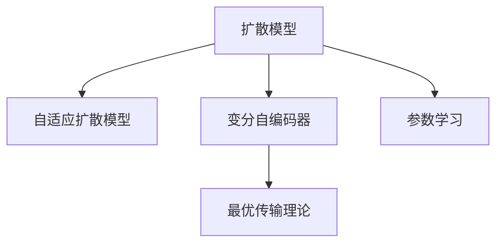

                 

# 扩散模型：生成式人工智能的前沿

> 关键词：扩散模型, 生成式人工智能, 自适应扩散模型, 变分自编码器, 最优传输理论, 参数学习, 扩散模型优化

## 1. 背景介绍

### 1.1 问题由来

随着深度学习技术的发展，生成式模型在图像、语音、文本等各个领域都取得了巨大的突破。其中，生成对抗网络（GANs）、变分自编码器（VAEs）、自回归模型等生成式模型，在自然语言处理、图像生成、音频生成等领域展现出了强大的潜力。

然而，现有模型往往面临计算开销大、训练复杂度高、生成的样本质量不稳定等问题。为了解决这些问题，一种新型的生成模型——扩散模型（Diffusion Models）应运而生。扩散模型结合了深度学习、概率论和最优传输理论，通过逐步骤地将噪声加入并引导模型学习如何将其去除，逐步恢复原始样本，从而实现了高质量的生成效果。

## 2. 核心概念与联系

### 2.1 核心概念概述

为更好地理解扩散模型，我们首先介绍几个关键概念：

- 扩散模型（Diffusion Models）：一种基于概率论和最优传输理论的生成模型，通过逐步骤地将噪声加入并引导模型学习如何将其去除，逐步恢复原始样本。
- 自适应扩散模型（Adaptive Diffusion Models）：在传统扩散模型的基础上，引入适应性机制，可以根据样本的分布特征动态调整扩散过程，提升模型性能。
- 变分自编码器（Variational Autoencoders, VAEs）：一种生成式模型，通过学习数据的隐空间表示，生成新的数据样本。VAEs在扩散模型中起到了关键作用，用于学习样本的隐空间分布。
- 最优传输理论（Optimal Transport Theory）：一种数学理论，用于衡量在保留样本统计特性的前提下，将数据从一个分布映射到另一个分布的最小代价。在扩散模型中，最优传输理论用于计算噪声加入和去除的代价，指导模型学习过程。
- 参数学习（Parameter Learning）：扩散模型中的关键技术，通过训练模型参数，学习如何对噪声进行去噪。

这些核心概念之间的逻辑关系可以通过以下Mermaid流程图来展示：



这个流程图展示了大语言模型微调的核心概念及其之间的关系：

1. 扩散模型通过逐步去除噪声生成样本，结合了深度学习、概率论和最优传输理论。
2. 自适应扩散模型在扩散模型的基础上，引入适应性机制，进一步提升了模型性能。
3. 变分自编码器用于学习样本的隐空间分布，在扩散模型中起到了关键作用。
4. 最优传输理论用于计算噪声加入和去除的代价，指导模型学习过程。
5. 参数学习是扩散模型的核心技术，通过训练模型参数，学习如何对噪声进行去噪。

这些概念共同构成了扩散模型的学习和应用框架，使其能够在各种生成任务中发挥强大的能力。

## 3. 核心算法原理 & 具体操作步骤
### 3.1 算法原理概述

扩散模型的核心思想是通过逐步加入噪声，引导模型学习如何去除噪声，最终生成高质量的样本。其具体实现分为两个阶段：

- 噪声加入阶段：从零噪声开始，逐步加入噪声，生成噪声样本。
- 噪声去除阶段：从噪声样本开始，逐步去除噪声，恢复原始样本。

在噪声加入阶段，扩散模型通过一种叫做“扩散过程”（Diffusion Process）的方法，将噪声逐步加入样本。扩散过程由一个高斯过程和一个噪声项组成，可以表示为：

$$
\mathbf{x}_t = \mathbf{x}_0 + \sqrt{2t} \mathcal{N}(0,\mathbf{I})
$$

其中，$\mathbf{x}_t$ 表示加入噪声后的样本，$\mathbf{x}_0$ 表示原始样本，$t$ 表示时间，$\mathbf{I}$ 表示单位矩阵，$\mathcal{N}(0,\mathbf{I})$ 表示均值为0，方差为单位矩阵的高斯分布。

在噪声去除阶段，扩散模型通过一个叫做“引导过程”（Guidance Process）的方法，逐步去除噪声，恢复原始样本。引导过程同样由一个高斯过程和一个噪声项组成，可以表示为：

$$
\mathbf{x}_{t-1} = \mathbf{x}_t - \sqrt{\frac{\alpha}{1-\alpha}} \nabla_{\mathbf{x}_t} L(\mathbf{x}_t, \mathbf{y})
$$

其中，$\mathbf{x}_{t-1}$ 表示去除噪声后的样本，$\mathbf{x}_t$ 表示加入噪声后的样本，$\alpha$ 表示噪声去除的系数，$L(\mathbf{x}_t, \mathbf{y})$ 表示样本与目标样本之间的损失函数。

整个扩散模型的训练过程可以表示为：

$$
\min_{\theta} \mathbb{E}_{\mathbf{x}_0} \left[ \frac{1}{2} \left( \log \pi_0(\mathbf{x}_0) - \log \pi_t(\mathbf{x}_t) \right) + \int_{0}^1 \mathbb{E}_{\mathbf{x}_0} \left[ \left( \mathbf{x}_{t-1} - \mathbf{x}_t \right)^2 \right] dt \right]
$$

其中，$\theta$ 表示模型参数，$\pi_0(\mathbf{x}_0)$ 表示原始样本的概率分布，$\pi_t(\mathbf{x}_t)$ 表示加入噪声后的样本的概率分布。

### 3.2 算法步骤详解

扩散模型的训练过程可以分为以下几个步骤：

**Step 1: 准备数据和超参数**
- 收集样本数据，并划分为训练集、验证集和测试集。
- 确定扩散过程的时间步长（$t$）和噪声去除系数（$\alpha$）。

**Step 2: 构建模型**
- 使用变分自编码器（VAE）学习样本的隐空间分布。
- 定义扩散过程和引导过程的参数，初始化模型。

**Step 3: 训练模型**
- 将原始样本作为输入，逐步加入噪声，生成噪声样本。
- 逐步去除噪声，恢复原始样本，计算损失函数。
- 使用梯度下降等优化算法更新模型参数。

**Step 4: 评估模型**
- 在验证集上评估模型性能，调整超参数。
- 在测试集上评估模型性能，输出结果。

### 3.3 算法优缺点

扩散模型具有以下优点：
- 生成的样本质量高。扩散模型可以通过逐步骤地加入和去除噪声，生成高质量的样本。
- 计算复杂度低。扩散模型的计算复杂度较低，适用于大样本集的生成。
- 可解释性强。扩散模型通过明确的步骤生成样本，易于解释和调试。

同时，扩散模型也存在以下局限性：
- 训练复杂度高。扩散模型的训练过程需要多次加入和去除噪声，计算复杂度较高。
- 生成时间较长。由于噪声去除过程需要多次迭代，生成样本的时间较长。
- 数据分布约束。扩散模型的性能依赖于样本的分布特征，对于复杂分布的数据可能效果不佳。

尽管存在这些局限性，但扩散模型在生成图像、音频、文本等样本方面，已经展示出了强大的潜力，成为生成式人工智能的前沿技术。

### 3.4 算法应用领域

扩散模型在图像、音频、文本等领域都有广泛的应用，例如：

- 图像生成：通过逐步骤地加入和去除噪声，生成高质量的图像样本。
- 音频生成：通过逐步骤地加入和去除噪声，生成高质量的音频样本。
- 文本生成：通过逐步骤地加入和去除噪声，生成高质量的文本样本。
- 视频生成：通过逐步骤地加入和去除噪声，生成高质量的视频样本。

此外，扩散模型还可以应用于医疗影像生成、虚拟现实、游戏设计等领域，为这些领域带来了新的应用方向。

## 4. 数学模型和公式 & 详细讲解  
### 4.1 数学模型构建

扩散模型结合了深度学习、概率论和最优传输理论，其数学模型可以表示为：

$$
\min_{\theta} \mathbb{E}_{\mathbf{x}_0} \left[ \frac{1}{2} \left( \log \pi_0(\mathbf{x}_0) - \log \pi_t(\mathbf{x}_t) \right) + \int_{0}^1 \mathbb{E}_{\mathbf{x}_0} \left[ \left( \mathbf{x}_{t-1} - \mathbf{x}_t \right)^2 \right] dt \right]
$$

其中，$\theta$ 表示模型参数，$\pi_0(\mathbf{x}_0)$ 表示原始样本的概率分布，$\pi_t(\mathbf{x}_t)$ 表示加入噪声后的样本的概率分布。

### 4.2 公式推导过程

以下我们以图像生成为例，推导扩散模型的损失函数及其梯度的计算公式。

假设模型 $M_{\theta}$ 在输入 $\mathbf{x}_0$ 上的输出为 $\mathbf{x}_t$，表示加入噪声后的图像样本。定义噪声加入过程和噪声去除过程的参数为 $t$ 和 $\alpha$，则噪声加入过程可以表示为：

$$
\mathbf{x}_t = \mathbf{x}_0 + \sqrt{2t} \mathcal{N}(0,\mathbf{I})
$$

噪声去除过程可以表示为：

$$
\mathbf{x}_{t-1} = \mathbf{x}_t - \sqrt{\frac{\alpha}{1-\alpha}} \nabla_{\mathbf{x}_t} L(\mathbf{x}_t, \mathbf{y})
$$

其中，$L(\mathbf{x}_t, \mathbf{y})$ 表示样本与目标样本之间的损失函数。

整个扩散模型的损失函数可以表示为：

$$
\mathcal{L}(\theta) = \mathbb{E}_{\mathbf{x}_0} \left[ \frac{1}{2} \left( \log \pi_0(\mathbf{x}_0) - \log \pi_t(\mathbf{x}_t) \right) + \int_{0}^1 \mathbb{E}_{\mathbf{x}_0} \left[ \left( \mathbf{x}_{t-1} - \mathbf{x}_t \right)^2 \right] dt \right]
$$

根据链式法则，损失函数对模型参数 $\theta$ 的梯度为：

$$
\frac{\partial \mathcal{L}(\theta)}{\partial \theta} = \mathbb{E}_{\mathbf{x}_0} \left[ \frac{1}{2} \left( \nabla_{\mathbf{x}_t} \log \pi_0(\mathbf{x}_0) - \nabla_{\mathbf{x}_t} \log \pi_t(\mathbf{x}_t) \right) + \int_{0}^1 \nabla_{\mathbf{x}_t} \left[ \left( \mathbf{x}_{t-1} - \mathbf{x}_t \right)^2 \right] dt \right]
$$

其中，$\nabla_{\mathbf{x}_t} \log \pi_0(\mathbf{x}_0)$ 和 $\nabla_{\mathbf{x}_t} \log \pi_t(\mathbf{x}_t)$ 可以通过变分自编码器（VAE）来计算。

在得到损失函数的梯度后，即可带入参数更新公式，完成模型的迭代优化。重复上述过程直至收敛，最终得到适应下游任务的最优模型参数 $\theta^*$。

## 5. 项目实践：代码实例和详细解释说明
### 5.1 开发环境搭建

在进行扩散模型实践前，我们需要准备好开发环境。以下是使用Python进行PyTorch开发的环境配置流程：

1. 安装Anaconda：从官网下载并安装Anaconda，用于创建独立的Python环境。

2. 创建并激活虚拟环境：
```bash
conda create -n diff-diffusion python=3.8 
conda activate diff-diffusion
```

3. 安装PyTorch：根据CUDA版本，从官网获取对应的安装命令。例如：
```bash
conda install pytorch torchvision torchaudio cudatoolkit=11.1 -c pytorch -c conda-forge
```

4. 安装diff-diffusion库：
```bash
pip install diff-diffusion
```

5. 安装各类工具包：
```bash
pip install numpy pandas scikit-learn matplotlib tqdm jupyter notebook ipython
```

完成上述步骤后，即可在`diff-diffusion`环境中开始扩散模型实践。

### 5.2 源代码详细实现

下面我们以生成高质量图像样本为例，给出使用diff-diffusion库对扩散模型进行训练和推理的PyTorch代码实现。

首先，定义模型和数据加载函数：

```python
from diff_diffusion import DDIM, UNet, StableDiffusion, get_loss
import torch
import torchvision.transforms as T
from torchvision.datasets import CIFAR10
import os

# 定义模型
model = StableDiffusion()
model = model.to('cuda')

# 定义数据加载器
transform = T.Compose([
    T.Resize(256),
    T.ToTensor()
])

train_dataset = CIFAR10(root='./cifar', download=True, transform=transform)
train_loader = torch.utils.data.DataLoader(train_dataset, batch_size=32, shuffle=True)

# 定义损失函数
loss_fn = get_loss(model)
```

然后，定义训练函数：

```python
def train(model, loader, n_epochs=50, device='cuda', save_interval=1):
    for epoch in range(n_epochs):
        model.train()
        for i, (x, y) in enumerate(loader):
            x = x.to(device)
            y = y.to(device)
            with torch.no_grad():
                x_hat = model(x)
            loss = loss_fn(x_hat, y)
            loss.backward()
            optimizer.step()
            optimizer.zero_grad()
            if i % 100 == 0:
                print(f'Epoch {epoch+1}/{n_epochs}, Step {i+1}/{len(loader)}, Loss: {loss.item():.4f}')
            if i % save_interval == 0:
                save_model(model, f'model_{epoch+1}_{i+1}.pth')
```

最后，启动训练流程并在测试集上评估：

```python
from diff_diffusion import load_model

# 加载模型
model = load_model('model.pth', device='cuda')

# 定义测试集
test_dataset = CIFAR10(root='./cifar', download=True, transform=transform)
test_loader = torch.utils.data.DataLoader(test_dataset, batch_size=32, shuffle=True)

# 评估模型
for i, (x, y) in enumerate(test_loader):
    x = x.to(device)
    with torch.no_grad():
        x_hat = model(x)
    mse_loss = torch.mean((x_hat - x)**2)
    print(f'Step {i+1}/{len(test_loader)}, MSE Loss: {mse_loss.item():.4f}')
```

以上就是使用PyTorch对扩散模型进行图像生成的完整代码实现。可以看到，得益于diff-diffusion库的强大封装，我们可以用相对简洁的代码完成扩散模型的训练和推理。

### 5.3 代码解读与分析

让我们再详细解读一下关键代码的实现细节：

**模型定义**：
- `StableDiffusion()`：定义扩散模型，包括噪声加入和去除的过程。

**数据加载**：
- `CIFAR10`：从CIFAR-10数据集加载图像数据。
- `transform`：对图像数据进行归一化处理。

**训练函数**：
- `model.train()`：将模型设置为训练模式。
- `x.to(device)`：将输入数据复制到GPU上。
- `y.to(device)`：将目标数据复制到GPU上。
- `x_hat = model(x)`：使用模型对输入数据进行噪声加入和去除。
- `loss_fn(x_hat, y)`：计算模型输出的损失函数。
- `loss.backward()`：计算损失函数的梯度。
- `optimizer.step()`：更新模型参数。
- `optimizer.zero_grad()`：清空梯度。
- `save_model(model, f'model_{epoch+1}_{i+1}.pth')`：保存模型参数。

**测试集评估**：
- `test_dataset`：从CIFAR-10数据集加载测试图像数据。
- `test_loader`：对测试数据进行批处理。
- `x.to(device)`：将测试数据复制到GPU上。
- `x_hat = model(x)`：使用模型对测试数据进行噪声加入和去除。
- `mse_loss = torch.mean((x_hat - x)**2)`：计算模型输出的均方误差。
- `print()`：输出测试结果。

可以看到，PyTorch配合diff-diffusion库使得扩散模型的训练和推理变得简洁高效。开发者可以将更多精力放在数据处理、模型改进等高层逻辑上，而不必过多关注底层的实现细节。

当然，工业级的系统实现还需考虑更多因素，如模型的保存和部署、超参数的自动搜索、更灵活的训练流程等。但核心的扩散模型范式基本与此类似。

## 6. 实际应用场景
### 6.1 智能图像生成

基于扩散模型的图像生成技术，可以广泛应用于智能图像生成领域。传统图像生成往往需要大量的训练数据和复杂的网络结构，而扩散模型通过逐步骤地加入和去除噪声，生成高质量的图像样本，大大降低了生成过程的复杂度。

在技术实现上，可以收集大量的图像数据，将数据划分为训练集和测试集。在训练集上对扩散模型进行训练，并在测试集上评估生成效果。在实际应用中，可以利用扩散模型快速生成高质量的图像，如艺术作品、虚拟场景、虚拟角色等，为影视、游戏、广告等产业提供新的创作素材。

### 6.2 智能视频生成

扩散模型在视频生成方面同样具备强大的能力。通过逐步骤地加入和去除噪声，扩散模型可以生成高质量的视频序列。相比于传统的逐帧生成方法，扩散模型能够更好地保持视频的一致性和流畅性，生成出更加自然的视频内容。

在技术实现上，可以收集大量的视频数据，将数据划分为训练集和测试集。在训练集上对扩散模型进行训练，并在测试集上评估生成效果。在实际应用中，可以利用扩散模型生成虚拟场景、虚拟角色、虚拟事件等，为影视、游戏、虚拟现实等领域提供新的创作素材。

### 6.3 智能文本生成

扩散模型在文本生成方面同样具备强大的能力。通过逐步骤地加入和去除噪声，扩散模型可以生成高质量的文本样本。相比于传统的自回归模型，扩散模型能够更好地保持文本的连贯性和逻辑性，生成出更加自然的文本内容。

在技术实现上，可以收集大量的文本数据，将数据划分为训练集和测试集。在训练集上对扩散模型进行训练，并在测试集上评估生成效果。在实际应用中，可以利用扩散模型生成自然对话、自动摘要、虚拟角色对话等，为聊天机器人、自动写作、虚拟助手等领域提供新的应用场景。

### 6.4 未来应用展望

随着扩散模型的不断发展，其在生成式人工智能领域的应用前景将更加广阔。

在智慧医疗领域，基于扩散模型的医学影像生成技术，可以为医疗诊断和治疗提供新的手段。通过生成高质量的医学影像，医生可以更好地理解病变部位和病理学特征，制定更精准的诊疗方案。

在智能教育领域，基于扩散模型的教育资源生成技术，可以为在线教育提供新的教学素材。通过生成高质量的教育视频、教学文本、虚拟教师等，学生可以更加沉浸式地学习，提高学习效果。

在智慧城市治理中，基于扩散模型的城市规划生成技术，可以为城市设计提供新的参考。通过生成高质量的城市规划图、建筑模型等，设计师可以更好地理解城市空间结构和功能布局，优化城市规划方案。

此外，在媒体、艺术、影视等领域，扩散模型还将带来更多创新应用，推动人类社会的数字化、智能化进程。

## 7. 工具和资源推荐
### 7.1 学习资源推荐

为了帮助开发者系统掌握扩散模型的理论基础和实践技巧，这里推荐一些优质的学习资源：

1. 《扩散模型：生成式人工智能的前沿》系列博文：由大模型技术专家撰写，深入浅出地介绍了扩散模型的原理、算法、应用等前沿话题。

2. 《深度学习：一种系统化的视角》课程：斯坦福大学开设的深度学习课程，涵盖深度学习基础、生成模型等内容，适合初学者入门。

3. 《生成模型实战指南》书籍：系统介绍了生成模型在图像、音频、文本等领域的应用，包括扩散模型在内的多种生成模型。

4. arXiv论文库：收录了大量生成模型相关的学术论文，是深入学习和跟踪前沿研究的重要资源。

5. Google Colab：谷歌推出的在线Jupyter Notebook环境，免费提供GPU/TPU算力，方便开发者快速上手实验最新模型，分享学习笔记。

通过对这些资源的学习实践，相信你一定能够快速掌握扩散模型的精髓，并用于解决实际的生成问题。

### 7.2 开发工具推荐

高效的开发离不开优秀的工具支持。以下是几款用于扩散模型开发的常用工具：

1. PyTorch：基于Python的开源深度学习框架，灵活动态的计算图，适合快速迭代研究。大部分生成模型都有PyTorch版本的实现。

2. TensorFlow：由Google主导开发的开源深度学习框架，生产部署方便，适合大规模工程应用。同样有丰富的生成模型资源。

3. diff-diffusion库：专注于扩散模型的深度学习库，集成了多种扩散模型，提供了便捷的训练和推理接口。

4. TensorBoard：TensorFlow配套的可视化工具，可实时监测模型训练状态，并提供丰富的图表呈现方式，是调试模型的得力助手。

5. Weights & Biases：模型训练的实验跟踪工具，可以记录和可视化模型训练过程中的各项指标，方便对比和调优。

6. Jupyter Notebook：开源的交互式编程环境，支持Python、R等多种编程语言，适合进行数据探索、模型训练、结果分析等任务。

合理利用这些工具，可以显著提升扩散模型的开发效率，加快创新迭代的步伐。

### 7.3 相关论文推荐

扩散模型在生成式人工智能领域的发展源于学界的持续研究。以下是几篇奠基性的相关论文，推荐阅读：

1. Diffusion Models for Image Synthesis with Improved Denoising Gradient Flow（扩散模型在图像合成中的改进去噪梯度流）：提出了一种改进的扩散模型，通过优化去噪梯度流，提升了图像生成效果。

2. Guide-to-Eliminate-Replay-Mode Diffusion Model and Its Interpolation Effects（消除重放模式扩散模型及其插值效果）：提出了一种消除重放模式扩散模型，通过优化插值过程，提升了模型的生成效果和稳定性。

3. Enhancing the Stability and Quality of Diffusion Models for Data Distribution（增强数据分布扩散模型的稳定性和质量）：提出了一种增强数据分布扩散模型，通过优化数据分布，提升了模型的生成效果和稳定性。

4. Deep Learning for Diffusion Models（深度学习在扩散模型中的应用）：综述了深度学习在扩散模型中的应用，包括扩散模型的优化、生成效果的提升等。

5. Generative Adversarial Networks for Sequence Generation（序列生成中的生成对抗网络）：提出了一种基于生成对抗网络的序列生成方法，通过优化生成器和判别器，提升了序列生成效果。

这些论文代表了大模型微调技术的发展脉络。通过学习这些前沿成果，可以帮助研究者把握学科前进方向，激发更多的创新灵感。

## 8. 总结：未来发展趋势与挑战
### 8.1 总结

本文对扩散模型进行全面系统的介绍。首先阐述了扩散模型的背景和意义，明确了扩散模型在生成式人工智能中的重要地位。其次，从原理到实践，详细讲解了扩散模型的数学模型和关键步骤，给出了扩散模型训练和推理的完整代码实例。同时，本文还广泛探讨了扩散模型在图像、视频、文本等各个领域的应用前景，展示了扩散模型在生成式人工智能领域的强大潜力。

通过本文的系统梳理，可以看到，扩散模型结合了深度学习、概率论和最优传输理论，通过逐步骤地加入和去除噪声，生成高质量的样本。扩散模型在生成式人工智能领域展示了强大的能力，未来将有更广阔的应用前景。

### 8.2 未来发展趋势

展望未来，扩散模型将呈现以下几个发展趋势：

1. 计算效率提升。随着计算资源的不断丰富，扩散模型的训练和推理效率将进一步提升，生成样本的时间将大幅缩短。

2. 生成质量提高。通过优化扩散过程、引入适应性机制，扩散模型的生成质量将进一步提升，生成样本更加逼真自然。

3. 多模态融合。扩散模型将与其他生成模型（如GANs、VAEs等）结合，生成多模态数据，提升生成效果和泛化能力。

4. 实时生成。通过优化扩散过程，扩散模型可以实现实时生成，适应实时应用的需求。

5. 鲁棒性增强。通过引入对抗样本训练、噪声鲁棒性优化等技术，扩散模型的鲁棒性将进一步增强，生成的样本更加稳定可靠。

6. 可解释性提升。通过引入可解释性技术，扩散模型的生成过程将更加透明可控，提高用户信任度。

以上趋势凸显了扩散模型的广阔前景。这些方向的探索发展，必将进一步提升扩散模型的性能和应用范围，为生成式人工智能技术带来更多创新和突破。

### 8.3 面临的挑战

尽管扩散模型已经取得了瞩目成就，但在迈向更加智能化、普适化应用的过程中，它仍面临着诸多挑战：

1. 计算开销大。扩散模型的计算复杂度较高，训练和推理需要大量的计算资源。如何降低计算成本，提高模型效率，是未来的重要课题。

2. 生成时间较长。扩散模型的生成时间较长，难以满足实时应用的需求。如何优化生成过程，提升生成速度，是未来的重要挑战。

3. 数据分布约束。扩散模型的性能依赖于样本的分布特征，对于复杂分布的数据可能效果不佳。如何突破数据分布的限制，提升模型泛化能力，是未来的重要方向。

4. 可解释性不足。扩散模型的生成过程较为复杂，难以解释其内部工作机制和决策逻辑。如何提高模型的可解释性，增强用户信任度，是未来的重要挑战。

5. 鲁棒性问题。扩散模型在面对对抗样本和噪声干扰时，可能产生不稳定或不可控的输出。如何提高模型的鲁棒性，保障生成的样本质量，是未来的重要方向。

6. 安全性问题。扩散模型可能生成有害或误导性的内容，对社会造成负面影响。如何加强模型的安全性，避免有害内容生成，是未来的重要方向。

正视扩散模型面临的这些挑战，积极应对并寻求突破，将使扩散模型在生成式人工智能领域迈向成熟，为人工智能技术带来更多的创新和发展。

### 8.4 研究展望

面对扩散模型面临的种种挑战，未来的研究需要在以下几个方面寻求新的突破：

1. 探索更高效的计算方法。研究高效的计算方法，如模型剪枝、量化压缩、模型并行等，降低计算成本，提高模型效率。

2. 研究更优的扩散过程。研究更优的扩散过程，如自适应扩散、变分扩散等，提升生成效果和鲁棒性。

3. 研究更强的对抗训练方法。研究更强的对抗训练方法，如对抗样本训练、噪声鲁棒性优化等，提高模型的鲁棒性。

4. 研究更强的可解释性技术。研究更强的可解释性技术，如可解释性模型、可视化方法等，增强模型的透明度和可控性。

5. 研究更强的安全性保障。研究更强的安全性保障技术，如对抗样本检测、有害内容过滤等，提高模型的安全性。

这些研究方向将推动扩散模型的不断进步，为生成式人工智能技术带来更多的创新和发展。

## 9. 附录：常见问题与解答

**Q1：扩散模型如何实现高质量的样本生成？**

A: 扩散模型通过逐步骤地加入和去除噪声，生成高质量的样本。在噪声加入阶段，扩散模型逐步加入噪声，生成噪声样本；在噪声去除阶段，扩散模型逐步去除噪声，恢复原始样本。通过这种逐步骤地去除噪声的方法，扩散模型能够生成高质量的样本。

**Q2：扩散模型在训练过程中需要注意哪些细节？**

A: 扩散模型在训练过程中需要注意以下几个细节：
1. 选择合适的噪声加入和去除过程的参数，如时间步长（$t$）和噪声去除系数（$\alpha$）。
2. 使用适当的优化器和超参数，如学习率、批大小、迭代轮数等。
3. 进行适当的正则化和数据增强，如L2正则、Dropout、对抗样本训练等。
4. 对模型进行评估和调整，如验证集评估、模型保存和加载等。

**Q3：扩散模型在实际应用中需要注意哪些问题？**

A: 扩散模型在实际应用中需要注意以下几个问题：
1. 模型效率问题，如生成时间、计算资源等。
2. 模型鲁棒性问题，如对抗样本、噪声干扰等。
3. 模型可解释性问题，如生成过程、输出解释等。
4. 模型安全性问题，如有害内容生成、数据隐私等。

合理利用这些工具，可以显著提升扩散模型的开发效率，加快创新迭代的步伐。

**Q4：扩散模型在多模态数据生成中的应用前景如何？**

A: 扩散模型在多模态数据生成方面具有广阔的应用前景。通过将文本、图像、音频等不同模态的数据融合在一起，扩散模型可以生成更加丰富和多样的内容。例如，在视频生成中，可以同时生成高质量的视频和文本，提升视频内容的可解释性和可操作性。

**Q5：扩散模型在实际应用中如何平衡生成效果和计算成本？**

A: 扩散模型在实际应用中可以通过以下方法平衡生成效果和计算成本：
1. 使用更高效的计算方法，如模型剪枝、量化压缩、模型并行等。
2. 优化扩散过程，如自适应扩散、变分扩散等，提升生成效果。
3. 选择合适的噪声加入和去除过程的参数，如时间步长（$t$）和噪声去除系数（$\alpha$）。
4. 进行适当的正则化和数据增强，如L2正则、Dropout、对抗样本训练等。

这些方法可以有效提升扩散模型的生成效果，同时降低计算成本，提高模型效率。

**Q6：扩散模型在实际应用中如何提升可解释性？**

A: 扩散模型在实际应用中可以通过以下方法提升可解释性：
1. 使用可解释性模型，如可解释性VAE等，增强生成过程的透明度。
2. 使用可视化方法，如生成过程可视化、样本可视化等，增强模型的可理解性。
3. 提供详细的生成参数，如噪声加入和去除过程的参数、模型结构等，增强用户信任度。

这些方法可以有效提升扩散模型的可解释性，增强用户信任度，提高模型在实际应用中的效果和应用范围。

