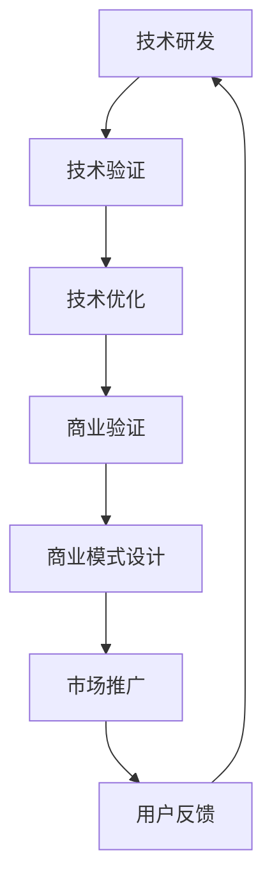

                 

# 技术分享：从技术到商业

## 1. 背景介绍

### 1.1 问题由来
当今世界，技术的进步正在快速改变着商业格局。人工智能(AI)、大数据、云计算等前沿技术的飞速发展，为各行各业带来了前所未有的变革机遇。如何在技术高速迭代和市场竞争激烈的氛围中，实现技术价值的最大化，成为了企业经营者关注的重点。本文将深入探讨从技术到商业的转化路径，分析关键技术和商业模式的结合，提供从技术创新到商业应用的全方位思考。

### 1.2 问题核心关键点
1. **技术成熟度评估**：评估技术的市场应用成熟度和技术落地难度。
2. **商业模式创新**：结合技术特点，设计创新的商业模式，探索市场空间。
3. **用户需求洞察**：深度挖掘用户需求，确定技术应用的切入点。
4. **生态系统建设**：构建技术生态系统，形成完整的解决方案。
5. **市场推广策略**：制定有效的市场推广策略，快速进入市场。

## 2. 核心概念与联系

### 2.1 核心概念概述

在探讨技术向商业转化的过程中，有几个关键概念需要理解：

- **技术成熟度**：描述技术从研发到应用成熟的过程，分为原型、概念验证、产品化等阶段。
- **商业模式**：企业通过技术实现产品或服务，获得收益的方式，包括直接销售、订阅、按需服务等多种形式。
- **用户需求**：技术应用的核心驱动力，了解和满足用户需求是成功的关键。
- **生态系统**：围绕技术构建的完整解决方案，包括产品、服务、合作伙伴、用户等。
- **市场推广**：将产品推向市场，实现用户获取和转化的策略。

### 2.2 核心概念原理和架构的 Mermaid 流程图



这个流程图展示了从技术研发到商业转化的基本流程。首先，技术研发产生新概念；经过技术验证和优化后，进入商业验证阶段；随后设计商业模式，并进行市场推广；最后根据用户反馈进行迭代优化，形成良性循环。

## 3. 核心算法原理 & 具体操作步骤

### 3.1 算法原理概述

从技术到商业的转化过程中，有几个关键算法原理需要理解：

1. **A/B测试**：通过对比实验，验证新功能和商业模式的有效性。
2. **用户体验设计**：基于用户行为和反馈，优化产品界面和交互设计。
3. **需求优先级排序**：根据用户需求重要性和市场潜力，制定产品开发优先级。
4. **用户增长模型**：利用用户获取和留存模型，优化市场推广策略。
5. **定价策略**：根据市场竞争和用户价值，制定合理的定价方案。

### 3.2 算法步骤详解

具体步骤如下：

1. **技术评估与规划**：评估技术成熟度和市场潜力，制定技术转化路线图。
2. **用户需求调研**：通过访谈、问卷等方法，深入了解用户需求和痛点。
3. **原型开发与测试**：快速开发技术原型，进行A/B测试，验证产品功能。
4. **商业模式设计**：结合技术特点和市场需求，设计适合的商业模式。
5. **市场推广策略**：制定推广计划，包括内容营销、社交媒体推广等。
6. **用户反馈与优化**：收集用户反馈，不断优化产品功能和用户体验。

### 3.3 算法优缺点

**优点**：
1. **快速迭代**：通过快速原型开发和测试，加速产品迭代和市场验证。
2. **用户驱动**：深入理解用户需求，提供更符合市场预期的产品。
3. **数据驱动**：利用A/B测试和用户反馈数据，优化产品功能和商业模式。

**缺点**：
1. **高投入**：技术研发和市场推广需要高额投入，特别是初期阶段。
2. **市场不确定性**：市场需求和技术实现之间的匹配度难以预测。
3. **竞争压力**：技术市场竞争激烈，需要快速响应和创新。

### 3.4 算法应用领域

技术到商业转化的算法广泛应用于以下几个领域：

- **云计算**：通过优化资源配置，提升计算效率和成本效益。
- **大数据分析**：通过数据挖掘，发现市场趋势和用户行为。
- **人工智能**：通过机器学习算法，提升产品和服务的智能化水平。
- **物联网(IoT)**：通过设备互联，实现智能控制和数据分析。
- **区块链**：通过分布式账本技术，提升数据安全和透明性。

## 4. 数学模型和公式 & 详细讲解 & 举例说明

### 4.1 数学模型构建

在技术转化过程中，数学模型是理解和预测市场需求的重要工具。以下是几个常见的数学模型：

1. **回归分析**：通过建立回归模型，预测市场需求和用户行为。
2. **分类算法**：通过分类模型，区分不同用户群体和需求。
3. **聚类算法**：通过聚类模型，识别用户需求共性和细分市场。
4. **推荐系统**：通过协同过滤算法，为用户推荐相关产品和服务。

### 4.2 公式推导过程

以回归分析为例，常用的线性回归模型为：

$$ y = \beta_0 + \beta_1x_1 + \beta_2x_2 + ... + \beta_nx_n + \epsilon $$

其中 $y$ 为预测目标变量，$x_i$ 为解释变量，$\beta_i$ 为回归系数，$\epsilon$ 为误差项。

### 4.3 案例分析与讲解

假设我们要预测某个市场对人工智能产品的需求量，可以将市场需求量 $y$ 作为目标变量，人工智能产品的性能指标（如算力、精度、可扩展性等）$x_i$ 作为解释变量。通过建立回归模型，可以预测不同性能指标对市场需求的影响，进而优化产品设计和定价策略。

## 5. 项目实践：代码实例和详细解释说明

### 5.1 开发环境搭建

要进行技术到商业的转化，首先需要搭建好开发环境。以下是一个典型的开发环境搭建步骤：

1. **编程语言**：选择Python、Java等常用编程语言，便于跨平台开发。
2. **开发工具**：使用Jupyter Notebook、PyCharm等IDE工具，提高开发效率。
3. **版本控制**：使用Git等版本控制工具，实现代码的共享和协作。
4. **数据库**：选择MySQL、MongoDB等数据库，存储和管理用户数据和业务数据。
5. **云计算平台**：使用AWS、Azure等云计算平台，实现资源的灵活配置和扩展。

### 5.2 源代码详细实现

以一个简单的市场需求预测项目为例，我们可以使用Python的Scikit-Learn库进行回归模型开发。

```python
from sklearn.linear_model import LinearRegression
from sklearn.model_selection import train_test_split
import pandas as pd

# 读取数据
data = pd.read_csv('market_data.csv')

# 数据预处理
X = data[['x1', 'x2', 'x3', ...]]
y = data['y']

# 划分训练集和测试集
X_train, X_test, y_train, y_test = train_test_split(X, y, test_size=0.2, random_state=42)

# 训练模型
model = LinearRegression()
model.fit(X_train, y_train)

# 预测需求
y_pred = model.predict(X_test)

# 模型评估
print('R^2:', model.score(X_test, y_test))
```

### 5.3 代码解读与分析

在这个代码示例中，我们使用线性回归模型来预测市场需求。数据读取、数据预处理、模型训练、预测和评估是关键的环节。

1. **数据读取**：使用Pandas库，读取市场数据集，提取市场需求量和其他解释变量。
2. **数据预处理**：将数据转换为适合线性回归的格式，并进行必要的归一化处理。
3. **模型训练**：使用LinearRegression模型，进行线性回归训练，得到模型参数。
4. **预测需求**：使用训练好的模型，对测试集进行预测，得到市场需求量的预测值。
5. **模型评估**：计算模型的R^2分数，评估模型的预测准确性。

### 5.4 运行结果展示

运行以上代码后，可以输出模型的R^2分数，评估模型的预测准确性。

## 6. 实际应用场景

### 6.1 智能客服系统

智能客服系统是一个典型的技术到商业转化的案例。通过人工智能技术，将自然语言处理(NLP)和机器学习算法应用于客服对话，提升客户服务体验和效率。

具体实现步骤包括：
1. **技术评估**：评估NLP和机器学习技术成熟度，选择适当的技术和工具。
2. **用户调研**：通过问卷和访谈，了解客户常见问题和需求。
3. **原型开发**：开发智能客服系统原型，进行内部测试。
4. **商业模式设计**：选择订阅制或按需服务模式，定价和收费策略。
5. **市场推广**：利用社交媒体和广告，宣传智能客服系统。
6. **用户反馈**：收集客户使用反馈，不断优化系统功能和用户体验。

### 6.2 金融风险管理

金融风险管理是一个典型的应用数据分析和机器学习的场景。通过分析市场数据，识别潜在的金融风险和投资机会，提升金融机构的决策效率和风险控制能力。

具体实现步骤包括：
1. **技术评估**：评估数据分析和机器学习技术的成熟度，选择适当的算法和工具。
2. **数据获取**：收集金融市场数据，包括股票价格、交易量、宏观经济指标等。
3. **模型开发**：建立回归模型和分类模型，预测市场走势和风险等级。
4. **商业模式设计**：选择按需服务或订阅模式，提供金融风险预警和分析服务。
5. **市场推广**：通过金融行业会议和研讨会，推广金融风险管理解决方案。
6. **用户反馈**：收集金融机构使用反馈，优化算法和模型。

### 6.3 智慧医疗系统

智慧医疗系统是一个典型的应用人工智能技术的场景。通过分析患者的医疗数据，提供个性化的医疗建议和治疗方案，提升医疗服务的质量和效率。

具体实现步骤包括：
1. **技术评估**：评估人工智能和数据分析技术的成熟度，选择适当的算法和工具。
2. **数据获取**：收集患者的医疗数据，包括病历、体检报告、实验室结果等。
3. **模型开发**：建立预测模型和分类模型，预测疾病风险和治疗效果。
4. **商业模式设计**：选择按需服务或订阅模式，提供个性化医疗建议和治疗方案。
5. **市场推广**：通过医院合作和医疗研讨会，推广智慧医疗解决方案。
6. **用户反馈**：收集患者和医生的使用反馈，优化模型和算法。

## 7. 工具和资源推荐

### 7.1 学习资源推荐

要实现技术到商业的转化，需要不断学习和积累。以下是一些推荐的学习资源：

1. **机器学习课程**：Coursera、edX等在线平台提供丰富的机器学习课程，涵盖线性回归、分类算法、聚类算法等基础知识。
2. **数据科学书籍**：《Python数据科学手册》、《R语言实战》等书籍，深入浅出地讲解数据科学基础知识。
3. **技术博客和社区**：Kaggle、GitHub等平台上有大量数据科学和机器学习的项目和案例，可以借鉴和学习。
4. **在线教程**：Udacity、Pluralsight等平台提供实战项目和教程，帮助快速上手实际项目。

### 7.2 开发工具推荐

技术到商业的转化需要高效的工具支持。以下是几款推荐的开发工具：

1. **编程语言**：Python、R、Java等常用编程语言，具有强大的数据分析和机器学习能力。
2. **数据处理工具**：Pandas、NumPy、Scikit-Learn等库，提供数据处理和模型开发的支持。
3. **可视化工具**：Matplotlib、Seaborn等库，提供数据可视化功能。
4. **云计算平台**：AWS、Google Cloud、Azure等平台，提供弹性计算和存储资源。
5. **版本控制工具**：Git、SVN等工具，提供代码版本控制和协作功能。

### 7.3 相关论文推荐

技术到商业的转化涉及多学科知识，以下是一些推荐的相关论文：

1. **机器学习应用**：《Hands-On Machine Learning with Scikit-Learn》，提供机器学习算法的实现和应用示例。
2. **数据科学实践**：《Data Science for Business》，讲解数据科学在商业决策中的应用。
3. **商业分析方法**：《Business Analytics》，介绍商业分析方法和工具。

## 8. 总结：未来发展趋势与挑战

### 8.1 研究成果总结

本文深入探讨了技术到商业转化的关键步骤和核心算法原理，提供了详细的项目实践和实际应用场景。通过实例分析，展示了技术到商业转化的完整路径和实现方法。

### 8.2 未来发展趋势

未来，技术到商业转化的趋势包括：

1. **技术融合**：技术的跨领域融合，推动更多行业应用技术的落地。
2. **数据驱动**：数据在商业决策中的作用日益重要，数据驱动的决策将成为主流。
3. **用户中心**：用户需求和体验成为技术转化的核心驱动力，用户反馈不断优化产品和服务。
4. **自动化**：自动化和人工智能技术的应用，提升商业流程的效率和准确性。
5. **区块链**：分布式账本技术的应用，提升数据透明性和安全性。

### 8.3 面临的挑战

技术到商业转化过程中，面临的挑战包括：

1. **技术成熟度**：新技术的研发和应用需要时间，如何加速技术的市场应用是一个难题。
2. **市场需求匹配**：如何准确把握市场需求，并设计符合用户预期的产品和服务。
3. **成本控制**：技术研发和市场推广需要高额投入，如何平衡成本和收益是关键。
4. **竞争压力**：技术市场竞争激烈，如何保持技术领先和市场优势。
5. **法律合规**：新技术的应用需要符合法律法规，如何规避法律风险是重要课题。

### 8.4 研究展望

未来，技术到商业转化需要在以下几个方面进行深入研究：

1. **跨领域应用**：技术在更多垂直行业的落地应用，推动产业升级和创新。
2. **用户行为分析**：深入分析用户行为数据，提供更精准的产品和服务。
3. **自动化和智能化**：自动化和智能化技术的应用，提升商业流程的效率和决策准确性。
4. **技术评估框架**：建立技术评估和转化框架，系统化评估和优化技术转化路径。
5. **伦理和隐私**：技术应用中的伦理和隐私问题，确保技术应用的公平和透明。

## 9. 附录：常见问题与解答

**Q1：技术到商业转化过程中，有哪些关键步骤？**

A: 技术到商业转化的关键步骤包括技术评估、用户调研、原型开发、商业模式设计、市场推广和用户反馈优化。每个步骤都是不可或缺的，需要系统化推进。

**Q2：如何评估技术成熟度？**

A: 评估技术成熟度需要考虑技术的关键特性、市场应用范围、竞争环境、技术壁垒等多个因素。可以采用技术成熟度评估模型（如Technology Readiness Level, TRA）进行系统评估。

**Q3：如何选择用户需求？**

A: 选择用户需求需要结合市场需求、技术实现和用户反馈进行综合评估。可以通过问卷调查、用户访谈等方式深入了解用户需求，并根据需求的重要性和紧急性进行排序。

**Q4：如何设计商业模式？**

A: 设计商业模式需要考虑技术特性、市场需求、竞争环境、成本结构等多个因素。可以采用商业模式画布（Business Model Canvas）工具，系统化设计商业模式。

**Q5：如何优化用户反馈？**

A: 优化用户反馈需要建立用户反馈机制，及时收集和分析用户反馈。可以采用A/B测试、问卷调查、用户访谈等方式收集反馈，并根据反馈不断优化产品和服务。

---

作者：禅与计算机程序设计艺术 / Zen and the Art of Computer Programming

