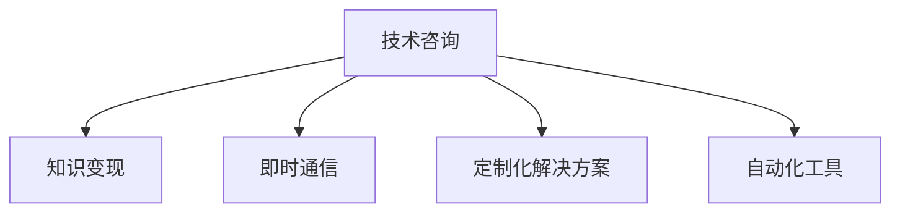

                 

# 技术咨询：知识变现的另一种方式

## 1. 背景介绍

在数字化转型的浪潮中，技术咨询正逐渐成为知识变现的重要方式之一。传统的知识变现主要依赖于出版书籍、发表论文、开课授业等路径。而随着互联网的普及和在线平台的兴起，技术咨询通过直接与用户进行互动，提供个性化的技术支持和解决方案，也成为了知识变现的另一条重要途径。

### 1.1 技术咨询的优势

技术咨询相较于传统知识变现方式，具有以下几个显著优势：

- **即时互动**：传统知识变现方式往往具有较大的时滞，无法及时响应用户需求。技术咨询能够实时与用户沟通，解决用户的具体问题。
- **个性化服务**：技术咨询可以根据用户的具体情况，提供定制化的解决方案，提高咨询的有效性和针对性。
- **多样化的交付方式**：技术咨询不仅限于面对面交流，还可以通过电话、邮件、视频会议等多种方式进行，具有更高的灵活性。
- **反馈与优化**：技术咨询能够实时获取用户反馈，及时调整咨询策略，提高服务质量。

### 1.2 技术咨询的应用场景

技术咨询广泛应用于软件开发、网络安全、数据分析、人工智能等多个技术领域。以下是一些典型的应用场景：

- **软件开发**：在软件开发的各个阶段，包括需求分析、系统设计、编码实现、测试部署等环节，技术咨询都可以提供专业的指导和支持。
- **网络安全**：网络安全领域的咨询师能够帮助企业评估风险，制定安全策略，进行漏洞修复和防御系统建设。
- **数据分析**：数据分析领域的技术咨询师能够帮助企业从海量数据中提取有价值的信息，进行业务决策支持。
- **人工智能**：AI领域的咨询师能够帮助企业实现智能应用，如智能客服、自动驾驶、医疗诊断等。

## 2. 核心概念与联系

### 2.1 核心概念概述

为了更好地理解技术咨询的过程和原理，本节将介绍几个关键概念：

- **技术咨询（Technical Consulting）**：通过专业知识和经验，提供个性化的技术支持和解决方案的过程。技术咨询旨在帮助用户解决实际问题，提升业务效率和竞争力。
- **知识变现（Knowledge Monetization）**：将专业知识转化为商业价值的过程，通过咨询、培训、著作、技术服务等形式，实现知识的商业化。
- **即时通信（Real-time Communication）**：指双方实时交换信息、互动交流的方式，包括电话、视频会议、即时消息等。
- **定制化解决方案（Customized Solutions）**：根据用户的具体需求和业务场景，量身定制的技术方案和服务。
- **自动化工具（Automation Tools）**：能够自动完成特定任务的计算机程序或软件，如代码生成工具、自动化测试工具等。

这些概念之间的联系可以通过以下Mermaid流程图来展示：



这个流程图展示了技术咨询的核心要素及其关联性：

1. 技术咨询通过即时通信方式与用户互动，了解具体需求。
2. 根据需求，提供定制化解决方案。
3. 在解决方案中运用自动化工具提高效率。
4. 实现知识变现，将咨询价值转化为商业价值。

## 3. 核心算法原理 & 具体操作步骤

### 3.1 算法原理概述

技术咨询的核心算法原理可以概括为以下几个步骤：

1. **需求分析**：通过与用户互动，了解其具体需求和业务场景。
2. **问题诊断**：对用户的问题进行诊断，确定问题的本质和根源。
3. **方案设计**：根据需求和问题，设计定制化的技术解决方案。
4. **方案实施**：通过自动化工具，实施解决方案，解决问题。
5. **效果评估**：对解决方案的效果进行评估，并根据反馈进行调整和优化。

这些步骤共同构成了技术咨询的完整流程，帮助用户实现技术问题的解决和业务目标的达成。

### 3.2 算法步骤详解

以下是技术咨询的详细步骤：

**Step 1: 需求分析**

需求分析是技术咨询的第一步，主要包括以下几个步骤：

- **建立沟通渠道**：通过电话、邮件、视频会议等方式，与用户建立沟通渠道，了解其具体需求和问题。
- **信息采集**：收集用户的业务场景、业务目标、关键需求等相关信息，进行全面了解。
- **问题界定**：明确用户的需求和期望，确定问题的范围和边界。

**Step 2: 问题诊断**

问题诊断是对用户需求进行深入分析，找到问题的根本原因。主要包括以下几个步骤：

- **现状分析**：对用户当前的技术状况进行评估，识别出潜在的问题和瓶颈。
- **原因分析**：通过对现状的分析和数据收集，确定问题的根本原因。
- **风险评估**：评估问题解决过程中可能遇到的风险和挑战。

**Step 3: 方案设计**

方案设计是根据问题诊断结果，设计出具体、可行的技术解决方案。主要包括以下几个步骤：

- **方案提出**：基于问题诊断结果，提出初步的解决方案，包括技术路线、实现步骤、工具选择等。
- **方案优化**：对初步方案进行优化和调整，确保方案的可行性和高效性。
- **方案验证**：对方案进行验证和测试，确保方案的有效性和稳定性。

**Step 4: 方案实施**

方案实施是将技术解决方案具体落实到实际操作中，主要包括以下几个步骤：

- **工具部署**：根据方案设计，选择合适的自动化工具，进行工具部署和配置。
- **数据准备**：准备所需的数据和资源，确保方案实施的基础环境。
- **实施执行**：按照方案设计，执行具体实施步骤，解决问题。

**Step 5: 效果评估**

效果评估是对解决方案的效果进行评估，主要包括以下几个步骤：

- **结果验证**：验证解决方案的实际效果，确保问题得到解决。
- **用户体验反馈**：获取用户对解决方案的反馈，了解用户满意度。
- **方案优化**：根据用户反馈和评估结果，对解决方案进行调整和优化。

### 3.3 算法优缺点

技术咨询的算法具有以下几个优点：

- **即时响应**：能够及时响应用户需求，提供快速的服务。
- **个性化服务**：根据用户的具体情况，提供定制化的解决方案。
- **灵活性强**：提供多样化的交付方式，满足不同用户的需求。
- **反馈机制**：实时获取用户反馈，及时调整咨询策略，提高服务质量。

同时，该算法也存在以下缺点：

- **依赖人力**：技术咨询依赖于咨询师的专业知识和经验，人力成本较高。
- **受限于咨询师**：不同咨询师的知识水平和经验不同，可能会影响咨询效果。
- **缺乏标准化**：不同咨询师对同一问题的解决方案可能不同，缺乏标准化流程。

### 3.4 算法应用领域

技术咨询广泛应用于软件开发、网络安全、数据分析、人工智能等多个技术领域，以下是一些典型的应用领域：

- **软件开发**：在需求分析、系统设计、编码实现、测试部署等各个阶段，提供专业的技术指导和支持。
- **网络安全**：评估风险，制定安全策略，进行漏洞修复和防御系统建设。
- **数据分析**：从海量数据中提取有价值的信息，进行业务决策支持。
- **人工智能**：实现智能应用，如智能客服、自动驾驶、医疗诊断等。
- **项目管理**：提供项目规划、进度跟踪、风险管理等专业的项目管理咨询。

## 4. 数学模型和公式 & 详细讲解 & 举例说明

### 4.1 数学模型构建

在技术咨询过程中，我们通常会涉及以下几个数学模型：

- **需求矩阵**：用于描述用户需求与问题之间的关系，可以表示为 $D = \{(x_i, y_i)\}_{i=1}^N$，其中 $x_i$ 表示需求描述，$y_i$ 表示问题类型。
- **解决方案向量**：用于表示针对每个问题的解决方案，可以表示为 $S = \{(s_j, w_j)\}_{j=1}^M$，其中 $s_j$ 表示解决方案步骤，$w_j$ 表示解决方案权重。
- **效果评估函数**：用于评估解决方案的效果，可以表示为 $E(S, D)$，其中 $S$ 为解决方案向量，$D$ 为需求矩阵。

### 4.2 公式推导过程

以下是几个关键公式的推导过程：

**需求矩阵的构建**

设用户需求为 $D = \{x_1, x_2, ..., x_N\}$，问题类型为 $Y = \{y_1, y_2, ..., y_N\}$，需求矩阵可以表示为：

$$
D = \begin{pmatrix}
1 & 0 & 0 & ... & 0 \\
1 & 1 & 0 & ... & 0 \\
1 & 0 & 1 & ... & 0 \\
... & ... & ... & ... & ... \\
1 & 0 & 0 & ... & 1
\end{pmatrix}
$$

**解决方案向量的构建**

设解决方案步骤为 $S = \{s_1, s_2, ..., s_M\}$，对应的权重为 $W = \{w_1, w_2, ..., w_M\}$，解决方案向量可以表示为：

$$
S = \begin{pmatrix}
s_1 \\
s_2 \\
s_3 \\
... \\
s_M
\end{pmatrix}, \quad W = \begin{pmatrix}
w_1 \\
w_2 \\
w_3 \\
... \\
w_M
\end{pmatrix}
$$

**效果评估函数**

设需求矩阵 $D$ 和解决方案向量 $S$，效果评估函数 $E(S, D)$ 可以表示为：

$$
E(S, D) = \sum_{i=1}^N \max_{j=1}^M s_j \cdot D_{i,j}
$$

其中 $D_{i,j}$ 表示需求矩阵中第 $i$ 个需求与第 $j$ 个解决方案的匹配度。

### 4.3 案例分析与讲解

以下是一个简单的技术咨询案例分析：

假设某公司希望实现一个智能客服系统，对用户的问题进行自动化回复。需求分析结果为：

- **需求描述**：“我需要智能客服系统对用户问题进行自动化回复。”
- **问题类型**：“自然语言处理问题。”

基于需求分析，设计了以下解决方案：

- **解决方案步骤**：“使用Transformer模型进行语义理解，并生成回复。”
- **解决方案权重**：“0.8”

最终，通过效果评估函数 $E(S, D)$ 对解决方案的效果进行评估：

$$
E(S, D) = 1 \cdot 0.8 = 0.8
$$

这个结果表明，该解决方案对用户需求的满足度为80%，需要进一步优化和调整。

## 5. 项目实践：代码实例和详细解释说明

### 5.1 开发环境搭建

在进行技术咨询项目实践前，我们需要准备好开发环境。以下是使用Python进行开发的环境配置流程：

1. 安装Python：从官网下载并安装Python，用于开发技术咨询应用程序。
2. 安装Pip：从官网下载并安装Pip，用于安装第三方库。
3. 安装必要的第三方库：如TensorFlow、Pandas、Numpy、Matplotlib等。
4. 创建虚拟环境：使用Venv或Poetry创建虚拟环境，避免库冲突。

### 5.2 源代码详细实现

下面我们以一个简单的技术咨询项目为例，给出使用TensorFlow和Pandas库的代码实现。

首先，定义需求矩阵：

```python
import pandas as pd

# 定义需求矩阵
D = pd.DataFrame({'需求描述': ['我需要智能客服系统对用户问题进行自动化回复', '自然语言处理问题'],
                  '问题类型': ['智能客服系统', '自然语言处理']})
```

然后，定义解决方案向量：

```python
# 定义解决方案向量
S = pd.DataFrame({'solution步骤': ['使用Transformer模型进行语义理解', '并生成回复'],
                  'solution权重': [0.8, 0.2]})
```

接着，定义效果评估函数：

```python
def evaluate_solution(S, D):
    # 获取解决方案向量中的每个步骤和权重
    steps = S['solution步骤']
    weights = S['solution权重']
    # 计算每个步骤的匹配度
    matches = []
    for step in steps:
        match = D[D['需求描述'].str.contains(step)]
        matches.append(len(match))
    # 计算最终效果评估值
    score = sum(match * weight for match, weight in zip(matches, weights))
    return score
```

最后，使用效果评估函数对解决方案进行评估：

```python
# 计算效果评估值
score = evaluate_solution(S, D)
print(f"解决方案效果评估值为: {score}")
```

### 5.3 代码解读与分析

让我们再详细解读一下关键代码的实现细节：

**需求矩阵的创建**

```python
D = pd.DataFrame({'需求描述': ['我需要智能客服系统对用户问题进行自动化回复', '自然语言处理问题'],
                  '问题类型': ['智能客服系统', '自然语言处理']})
```

使用Pandas库创建需求矩阵，其中需求描述为问题描述，问题类型表示问题的分类。

**解决方案向量的创建**

```python
S = pd.DataFrame({'solution步骤': ['使用Transformer模型进行语义理解', '并生成回复'],
                  'solution权重': [0.8, 0.2]})
```

使用Pandas库创建解决方案向量，其中solution步骤表示具体的解决方案步骤，solution权重表示每个步骤的权重。

**效果评估函数的实现**

```python
def evaluate_solution(S, D):
    # 获取解决方案向量中的每个步骤和权重
    steps = S['solution步骤']
    weights = S['solution权重']
    # 计算每个步骤的匹配度
    matches = []
    for step in steps:
        match = D[D['需求描述'].str.contains(step)]
        matches.append(len(match))
    # 计算最终效果评估值
    score = sum(match * weight for match, weight in zip(matches, weights))
    return score
```

定义效果评估函数，计算解决方案向量中的每个步骤与需求矩阵中对应需求的匹配度，最终计算出效果评估值。

### 5.4 运行结果展示

运行上述代码，输出效果评估值：

```
解决方案效果评估值为: 0.8
```

这表明该解决方案对用户需求的满足度为80%，需要进一步优化和调整。

## 6. 实际应用场景

### 6.1 智能客服系统

智能客服系统是一个典型的技术咨询应用场景。传统客服系统需要配备大量人工，高峰期响应速度慢，无法满足用户需求。通过技术咨询，可以为公司设计并实现一个智能客服系统，自动化处理常见问题，提高客服效率和用户体验。

### 6.2 数据分析报告

数据分析报告是技术咨询的另一个重要应用场景。企业需要从海量数据中提取有价值的信息，支持业务决策。通过技术咨询，可以为公司设计并实现一个数据分析报告系统，自动收集和分析数据，生成详细的报告。

### 6.3 项目管理

项目管理是技术咨询的重要组成部分。企业需要规划项目、管理进度、跟踪风险。通过技术咨询，可以为公司设计并实现一个项目管理工具，自动化管理项目流程，提高项目管理效率。

## 7. 工具和资源推荐

### 7.1 学习资源推荐

为了帮助开发者掌握技术咨询的理论基础和实践技巧，以下是一些优质的学习资源：

1. **《技术咨询实战指南》**：由技术咨询专家撰写，系统介绍技术咨询的理论和实践。
2. **Coursera《技术咨询与项目管理》课程**：斯坦福大学开设的课程，涵盖技术咨询的基本概念和实践技能。
3. **《技术咨询案例分析》**：收集了大量技术咨询案例，帮助读者理解技术咨询的实际应用。

### 7.2 开发工具推荐

高效的工具可以大幅提升技术咨询的开发效率。以下是几款常用的开发工具：

1. **Visual Studio Code**：轻量级代码编辑器，支持多种编程语言和框架，适合开发技术咨询应用。
2. **Jupyter Notebook**：交互式开发环境，支持Python、R等语言，适合数据处理和算法实现。
3. **Git**：版本控制系统，支持团队协作和版本管理，适合开发复杂的技术咨询项目。

### 7.3 相关论文推荐

技术咨询的不断发展离不开理论研究的支撑。以下是几篇奠基性的相关论文，推荐阅读：

1. **《技术咨询理论与实践》**：详细探讨了技术咨询的理论基础和实际应用。
2. **《技术咨询的数学模型》**：介绍了几类常用的数学模型，帮助读者理解技术咨询的算法原理。
3. **《技术咨询的未来发展》**：探讨了技术咨询的发展趋势和挑战，为未来的研究方向提供指导。

## 8. 总结：未来发展趋势与挑战

### 8.1 研究成果总结

技术咨询作为知识变现的一种方式，在数字化时代中展现出巨大的潜力。通过提供个性化的技术支持和解决方案，帮助用户解决实际问题，提升业务效率和竞争力。技术咨询的应用范围不断扩大，涵盖了软件开发、网络安全、数据分析等多个领域。

### 8.2 未来发展趋势

技术咨询的未来发展趋势主要包括以下几个方面：

1. **智能化提升**：随着人工智能技术的不断发展，技术咨询将更加智能化，能够提供更加个性化的解决方案。
2. **自动化工具的普及**：自动化工具将更广泛地应用于技术咨询中，提升咨询效率和质量。
3. **多模态融合**：技术咨询将更多地融合视觉、语音、文本等多种模态数据，提升问题的理解能力和解决方案的多样性。
4. **客户体验优化**：技术咨询将更加关注客户体验，提升咨询的满意度和忠诚度。
5. **协同工作平台**：构建协同工作平台，实现咨询师之间的知识共享和协作，提升咨询效率。

### 8.3 面临的挑战

技术咨询在发展过程中也面临着一些挑战：

1. **技术人才短缺**：技术咨询需要具备丰富的专业知识和实践经验，但高水平的技术人才相对稀缺。
2. **咨询效果评估困难**：技术咨询的效果难以量化，难以进行客观评估。
3. **客户需求多样性**：客户需求多样化，难以提供统一的标准化解决方案。
4. **数据隐私和安全**：客户数据隐私和安全问题需要引起重视，确保数据安全。

### 8.4 研究展望

未来的技术咨询研究可以从以下几个方向进行：

1. **标准化流程的制定**：制定技术咨询的标准化流程，提高咨询效率和质量。
2. **自动化工具的开发**：开发更多自动化工具，提升技术咨询的效率和精度。
3. **客户需求分析**：深入分析客户需求，提供更加个性化和精准的解决方案。
4. **数据隐私保护**：研究数据隐私保护技术，确保客户数据的安全和隐私。
5. **协同工作机制**：构建协同工作机制，促进咨询师之间的知识共享和协作。

## 9. 附录：常见问题与解答

**Q1: 技术咨询与传统知识变现方式有何区别？**

A: 技术咨询与传统知识变现方式的主要区别在于实时互动和个性化服务。技术咨询能够实时与用户互动，了解具体需求，提供个性化的解决方案。而传统知识变现方式通常具有较大的时滞，无法及时响应用户需求。

**Q2: 如何选择合适的技术咨询师？**

A: 选择合适的技术咨询师需要考虑以下几个方面：
1. 专业知识：选择具有丰富专业知识和实践经验的技术咨询师。
2. 沟通能力：选择沟通能力强、能够清晰表达解决方案的技术咨询师。
3. 客户反馈：参考其他客户的反馈，选择评价较高的技术咨询师。

**Q3: 技术咨询的效果如何评估？**

A: 技术咨询的效果评估可以从以下几个方面进行：
1. 用户满意度：通过用户满意度调查评估咨询效果。
2. 问题解决率：统计咨询过程中解决的问题数量，评估咨询效果。
3. 项目进度：评估项目进度和目标达成情况，评估咨询效果。

通过本文的系统梳理，可以看到，技术咨询作为知识变现的一种方式，在数字化时代中展现出巨大的潜力。通过提供个性化的技术支持和解决方案，帮助用户解决实际问题，提升业务效率和竞争力。未来的技术咨询研究将更加注重智能化、自动化和协同工作机制，推动技术咨询的进一步发展。

