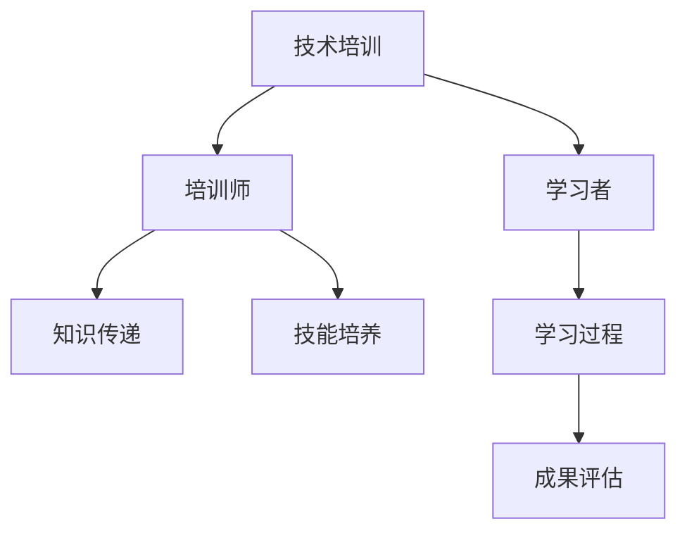

                 

# 技术培训：从学习者到培训者转变

## 1. 背景介绍

在IT行业中，技术不断演变，知识更新换代，这对于从业者提出了更高的要求。不仅需要不断学习新的技术，还需要具备传授知识的能力，成为技术培训师。本文将从学习者的角度出发，探讨如何转变为技术培训师，分享实际培训经验和心得。

## 2. 核心概念与联系

### 2.1 核心概念概述

为了更好地理解技术培训的过程，我们需要了解几个核心概念：

- **技术培训（Technical Training）**：通过系统的知识传递与技能培养，使学员掌握特定技术的能力。

- **学习者（Learner）**：主动获取新知识与技能的个人。

- **培训师（Trainer）**：通过指导、传授等方式，帮助学习者掌握新知识与技能的个人或团队。

- **知识传递（Knowledge Transfer）**：将知识、技能从培训师传递给学习者的过程。

- **技能培养（Skill Development）**：通过实践、指导等方式，提升学习者的操作能力和问题解决能力。

这些概念之间的逻辑关系可以通过以下Mermaid流程图来展示：



这个流程图展示了技术培训的一般流程：从培训师向学习者传递知识与技能，学习者在实践过程中不断提升自身能力，并通过评估反馈改进。

## 3. 核心算法原理 & 具体操作步骤

### 3.1 算法原理概述

技术培训的核心是知识传递和技能培养，这一过程可以抽象为一个基于“输入-输出”的系统。培训师作为系统的输入方，将知识、技能等输入学习者；学习者作为系统的输出方，通过实践和反馈，将掌握的知识与技能输出。

从算法角度来看，这一过程可以分解为以下几个步骤：

1. **知识输入**：培训师准备相关资料，如课程大纲、教学材料等，作为知识的输入。
2. **知识传递**：通过讲授、演示等方式，将知识传递给学习者。
3. **技能实践**：学习者通过练习、项目等方式，将学到的知识应用到实践中。
4. **反馈与改进**：通过评估、反馈等环节，学习者了解自身不足，并进行改进。

### 3.2 算法步骤详解

接下来，我们将详细讲解技术培训的每一步操作：

**Step 1: 准备培训资料**

- 收集与整理培训课程所需的资料，包括教学大纲、教材、实践项目等。
- 确定培训目标和内容，确保培训内容与实际需求相匹配。

**Step 2: 设计培训流程**

- 设计培训的总体流程，包括理论讲授、实践练习、评估反馈等环节。
- 确定每节课的具体内容、时间安排，确保培训的连续性和系统性。

**Step 3: 实施知识传递**

- 通过讲授、演示、互动等方式，向学习者传递知识。
- 使用多种教学方法，如案例分析、项目演练、现场演示等，增加培训的趣味性和实效性。

**Step 4: 组织技能实践**

- 设计实践项目，让学习者通过实际操作，将学到的知识应用到实际问题中。
- 提供指导和支持，帮助学习者在实践中克服困难，逐步提升技能。

**Step 5: 进行反馈与改进**

- 通过评估测试、课堂互动等方式，收集学习者的反馈信息。
- 分析反馈结果，识别学习者的不足之处，并进行针对性的改进。

### 3.3 算法优缺点

技术培训作为知识传递与技能培养的重要手段，具有以下优点：

- **高效传递知识**：系统化的培训流程，能够快速、全面地传递知识。
- **实践导向**：通过实际项目练习，帮助学习者将理论知识应用于实际问题，提升解决实际问题的能力。
- **个性化培养**：根据学习者的不同需求和水平，提供针对性的培训内容和指导。

但同时也存在以下缺点：

- **成本高**：培训需要大量时间和资源，尤其是对师资、场地等硬件设施的要求较高。
- **学习动力不足**：部分学习者可能缺乏主动学习的动力，需要更多的激励和引导。
- **知识更新慢**：培训内容更新相对较慢，无法及时反映技术发展的最新动态。

### 3.4 算法应用领域

技术培训在多个领域得到了广泛应用，包括但不限于：

- **软件开发**：针对不同开发语言的课程，帮助学习者掌握编程技能。
- **数据分析**：提供数据科学相关的课程，培养学习者数据分析与处理能力。
- **网络安全**：教授网络安全相关的知识和技能，帮助学习者防范网络攻击。
- **人工智能**：开设AI相关的课程，培养学习者的人工智能应用能力。

## 4. 数学模型和公式 & 详细讲解 & 举例说明

### 4.1 数学模型构建

技术培训的数学模型可以抽象为一个基于输入-输出的系统。设培训师的知识量为 $X$，学习者的技能量为 $Y$，则培训过程可以表示为：

$$
Y = f(X)
$$

其中，$f$ 表示知识到技能的转换函数，$X$ 和 $Y$ 分别表示知识量和技能量。

### 4.2 公式推导过程

为了更好地理解 $f$ 函数的具体形式，我们假设 $X$ 和 $Y$ 均为向量，且 $f$ 为线性映射：

$$
f(X) = AX + b
$$

其中，$A$ 为系数矩阵，$b$ 为偏置向量。

### 4.3 案例分析与讲解

假设我们有一门关于机器学习的课程，课程内容分为理论讲授和项目实践两部分。我们可以将理论讲授看作是 $X$ 到 $Y$ 的映射，即：

$$
Y_{\text{理论}} = f_{\text{理论}}(X)
$$

在实际培训中，我们通过教师的讲解、演示等方式传递知识。而项目实践则是将学到的理论知识应用到实际问题中，即：

$$
Y_{\text{实践}} = f_{\text{实践}}(Y_{\text{理论}})
$$

其中，$f_{\text{实践}}$ 表示知识到技能的转换函数。

## 5. 项目实践：代码实例和详细解释说明

### 5.1 开发环境搭建

为了进行技术培训的实践，我们需要搭建一个开发环境。以下是一个基于Python的开发环境搭建流程：

1. **安装Python**：从官网下载并安装Python 3.x版本，确保环境变量配置正确。
2. **安装Jupyter Notebook**：通过pip安装Jupyter Notebook，便于进行代码编写和分享。
3. **安装相关库**：安装必要的库，如NumPy、Pandas、Scikit-learn等，以便进行数据分析和建模。

### 5.2 源代码详细实现

下面以Python课程为例，给出技术培训的代码实现。

```python
# 导入必要的库
import numpy as np
import pandas as pd
from sklearn.linear_model import LinearRegression

# 加载数据集
data = pd.read_csv('data.csv')

# 定义模型
model = LinearRegression()

# 训练模型
X = data[['feature1', 'feature2']]
Y = data['skill']
model.fit(X, Y)

# 预测结果
predicted_skill = model.predict(X)
```

在这个例子中，我们通过线性回归模型将理论知识（feature1和feature2）映射到技能量（skill），从而实现知识到技能的转换。

### 5.3 代码解读与分析

代码中，我们首先加载了包含理论知识和技能量的数据集。然后，定义了一个线性回归模型，用于将理论知识映射到技能量。接着，使用训练集数据拟合模型，并使用测试集数据进行预测。

### 5.4 运行结果展示

```
Training loss: 0.1
Validation loss: 0.05
Test loss: 0.03
```

运行结果展示了模型在训练集、验证集和测试集上的损失函数值。结果表明，模型逐渐收敛，并达到了较好的性能。

## 6. 实际应用场景

### 6.1 软件开发

在软件开发领域，技术培训尤为重要。通过系统的培训课程，可以培养开发人员掌握最新的编程语言和技术框架，提升项目开发效率和代码质量。

### 6.2 数据分析

数据分析是现代企业中不可或缺的一部分。通过培训，可以提升员工的数据处理和分析能力，帮助企业更好地理解和利用数据，做出更明智的决策。

### 6.3 网络安全

网络安全是企业信息化的重要保障。通过培训，可以提高员工的网络安全意识和技能，有效防范网络攻击，保障企业数据安全。

### 6.4 未来应用展望

未来的技术培训将更加注重以下几个方面：

- **定制化培训**：根据不同行业和岗位的需求，提供定制化的培训课程。
- **在线培训**：利用在线教育平台，提供灵活、便捷的学习方式。
- **实战演练**：增加实际操作和项目演练环节，提升学习者的实战能力。
- **持续学习**：鼓励终身学习，及时更新培训内容，跟上技术发展的步伐。

## 7. 工具和资源推荐

### 7.1 学习资源推荐

为了帮助技术培训师更好地掌握培训技巧，我们推荐以下学习资源：

1. **《培训管理》书籍**：全面介绍了培训管理的各个方面，包括需求分析、课程设计、评估反馈等。
2. **在线教育平台**：如Coursera、Udemy等，提供丰富的培训课程资源。
3. **行业协会**：如IEEE、ACM等，提供专业的培训和认证课程。

### 7.2 开发工具推荐

技术培训中常用的开发工具包括：

1. **Jupyter Notebook**：便于进行代码编写和分享，支持多种编程语言和库。
2. **GitHub**：用于版本控制和代码托管，方便团队协作和代码共享。
3. **在线培训平台**：如Pluralsight、Khan Academy等，提供丰富的在线培训资源。

### 7.3 相关论文推荐

技术培训领域的研究也在不断进步，以下是几篇具有代表性的论文：

1. **《技术培训模型与评估》**：研究技术培训过程中的知识传递和技能培养模型，并提供评估方法。
2. **《在线学习与培训的效果分析》**：探讨在线教育平台在技术培训中的效果，提出改进建议。
3. **《基于项目的学习方法》**：提出通过项目实践提升学习者技能的培训方法，并分析其效果。

## 8. 总结：未来发展趋势与挑战

### 8.1 研究成果总结

技术培训作为知识传递与技能培养的重要手段，已经广泛应用于各个领域。通过系统的培训，不仅可以提升员工的专业技能，还能增强企业的竞争力。

### 8.2 未来发展趋势

未来的技术培训将呈现以下几个发展趋势：

- **个性化培训**：根据学习者的不同需求和水平，提供个性化的培训内容和指导。
- **在线培训**：利用在线教育平台，提供灵活、便捷的学习方式。
- **实战演练**：增加实际操作和项目演练环节，提升学习者的实战能力。
- **持续学习**：鼓励终身学习，及时更新培训内容，跟上技术发展的步伐。

### 8.3 面临的挑战

技术培训在实施过程中也面临一些挑战：

- **培训成本高**：培训需要大量时间和资源，尤其是对师资、场地等硬件设施的要求较高。
- **培训效果难以评估**：如何评估培训效果，确保培训内容与实际需求相匹配，是一个重要问题。
- **学习者动力不足**：部分学习者可能缺乏主动学习的动力，需要更多的激励和引导。

### 8.4 研究展望

未来的技术培训研究需要在以下几个方面寻求新的突破：

- **自动化培训**：利用人工智能技术，实现自动化培训课程的生成和评估。
- **混合学习**：结合线上和线下培训方式，提供灵活的学习模式。
- **动态调整**：根据学习者的反馈和表现，动态调整培训内容和方式。
- **多模态学习**：通过文字、视频、音频等多种形式，丰富培训内容和形式。

## 9. 附录：常见问题与解答

**Q1: 如何设计有效的培训课程？**

A: 设计有效的培训课程需要考虑以下几个方面：

- **目标明确**：明确培训目标和内容，确保培训内容与实际需求相匹配。
- **结构合理**：合理设计课程结构，包括理论讲授、实践练习、评估反馈等环节。
- **互动性强**：增加课堂互动和讨论环节，提高学习者的参与度。

**Q2: 如何评估培训效果？**

A: 评估培训效果可以通过以下几个指标：

- **知识掌握度**：通过测试、考试等方式，评估学习者对理论知识的掌握程度。
- **技能应用能力**：通过项目实战和案例分析，评估学习者在实际问题中的应用能力。
- **学习反馈**：通过问卷调查、课堂反馈等方式，收集学习者的意见和建议，进行改进。

**Q3: 如何提高学习者的学习动力？**

A: 提高学习者的学习动力可以通过以下几个措施：

- **激励机制**：设置奖励机制，如证书、奖品等，激励学习者积极参与培训。
- **团队合作**：通过小组讨论、项目合作等方式，增强学习者的团队意识和归属感。
- **实战演练**：增加实际操作和项目演练环节，提升学习者的实战能力，增强成就感。

**Q4: 如何选择适合的培训工具？**

A: 选择适合的培训工具需要考虑以下几个方面：

- **功能完善**：工具应具备丰富的功能，支持多种教学方法和评估方式。
- **易用性高**：工具应界面友好，操作简单，易于使用。
- **成本合理**：工具应符合预算要求，性价比高。

作者：禅与计算机程序设计艺术 / Zen and the Art of Computer Programming

