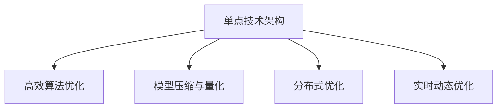

                 

# 技术实现的艺术：Lepton AI结合单点技术，在速度成本间平衡

## 1. 背景介绍

在现代科技发展的浪潮中，人工智能(AI)技术以其强大的计算能力和广泛的适用性，成为了驱动社会进步的关键力量。然而，在实现AI应用时，如何平衡速度与成本，实现高效、低耗、稳定的技术架构，一直是AI技术实施中的核心问题。Lepton AI作为AI技术领域的新兴力量，近年来在提升AI应用效率的同时，不断优化系统成本，以在速度与成本间找到最佳的平衡点。

### 1.1 问题由来

随着AI技术的不断发展，各种复杂的机器学习模型和算法被广泛应用于各行各业，但随之而来的问题是计算资源需求的激增。以深度学习为例，尽管其在图像识别、语音识别、自然语言处理等诸多领域取得了显著进展，但其对计算资源的需求同样巨大，单点技术架构在这种高需求下往往难以负担。同时，AI模型在速度上亦存在瓶颈，部分高性能模型需要长时间训练才能达到最优效果，且在实际应用中，系统延迟和高能耗问题依然普遍存在。

Lepton AI技术通过对现有AI架构的优化与创新，有效解决了上述问题。通过引入单点技术，Lepton AI在保持高效率的同时，大大降低了计算资源的需求，进而优化了成本，使得AI技术的落地应用更加可控和高效。

### 1.2 问题核心关键点

Lepton AI实现速度与成本平衡的关键点在于以下几个方面：

- **单点技术架构**：Lepton AI采用单点技术架构，通过简化系统结构，有效降低了计算资源的占用和系统复杂度。

- **高效算法优化**：Lepton AI在算法层面对深度学习模型进行优化，以减少计算开销和内存占用。

- **模型压缩与量化**：Lepton AI使用模型压缩与量化技术，减小模型体积，降低计算资源需求。

- **分布式优化**：Lepton AI利用分布式计算资源，提升模型训练和推理的效率。

- **实时动态优化**：Lepton AI通过实时监控和调整系统性能，保证其在高负载情况下的稳定性。

这些关键点共同构成了Lepton AI的核心技术架构，使得其在速度与成本之间找到了最佳平衡点，为AI技术的实际应用提供了坚实的基础。

## 2. 核心概念与联系

### 2.1 核心概念概述

Lepton AI的核心概念主要包括以下几个方面：

- **单点技术架构**：Lepton AI通过简化系统结构，将所有关键组件集中在单个点（单点）上，减少系统复杂度和资源占用。

- **高效算法优化**：Lepton AI对深度学习算法进行优化，提升计算效率和模型精度。

- **模型压缩与量化**：Lepton AI使用模型压缩与量化技术，减小模型体积，降低计算资源需求。

- **分布式优化**：Lepton AI利用分布式计算资源，提升模型训练和推理的效率。

- **实时动态优化**：Lepton AI通过实时监控和调整系统性能，保证其在高负载情况下的稳定性。

这些核心概念之间的逻辑关系可以通过以下Mermaid流程图来展示：



这个流程图展示了Lepton AI技术架构的核心组成和它们之间的逻辑关系：

1. 单点技术架构是Lepton AI的基础，简化了系统结构，提高了计算效率。
2. 高效算法优化和模型压缩与量化是提升模型性能的关键手段，通过减少计算开销和内存占用，进一步优化系统效率。
3. 分布式优化利用了多台计算资源，大幅提升模型训练和推理的速度和稳定性。
4. 实时动态优化通过实时监控和调整系统性能，确保Lepton AI在高负载情况下的可靠性和稳定性。

这些核心概念共同构成了Lepton AI的技术框架，使得其在速度与成本之间找到了最佳的平衡点。

## 3. 核心算法原理 & 具体操作步骤

### 3.1 算法原理概述

Lepton AI的核心算法原理主要围绕以下几个方面展开：

1. **单点技术架构**：通过将数据处理、模型训练和推理等关键组件集中在一个点上，减少系统复杂度，提升系统效率。

2. **高效算法优化**：通过对深度学习算法的优化，如采用轻量化模型、剪枝、量化等技术，提升模型的计算效率和内存占用效率。

3. **模型压缩与量化**：通过模型压缩与量化技术，减小模型体积，降低计算资源需求。

4. **分布式优化**：利用分布式计算资源，通过并行计算和资源共享，提升模型训练和推理的速度。

5. **实时动态优化**：通过实时监控和调整系统性能，确保Lepton AI在高负载情况下的可靠性和稳定性。

### 3.2 算法步骤详解

以下将详细介绍Lepton AI的技术实现步骤：

**Step 1: 系统架构设计**

- **单点技术架构设计**：将所有关键组件（如数据输入、模型训练、推理输出）集中在单个点上，简化系统结构。
- **资源分配策略**：根据系统负载，动态分配计算资源。

**Step 2: 高效算法优化**

- **模型优化**：采用轻量化模型，减少计算开销；利用剪枝技术，去除冗余层；量化模型，使用低精度参数。
- **算法优化**：优化算法结构，如使用优化器、激活函数、批标准化等。

**Step 3: 模型压缩与量化**

- **模型压缩**：使用权重剪枝、通道剪枝等技术，减少模型参数量。
- **量化技术**：将模型参数和激活值量化为低精度，减小内存占用。

**Step 4: 分布式优化**

- **分布式训练**：将数据集分成多个部分，并行训练模型，提升训练速度。
- **分布式推理**：将推理任务分配到多个节点上，并行处理，提升推理效率。

**Step 5: 实时动态优化**

- **实时监控**：利用监控工具，实时监控系统性能指标，如计算速度、内存占用、网络带宽等。
- **动态调整**：根据实时监控数据，动态调整系统配置，如增加或减少计算资源。

### 3.3 算法优缺点

Lepton AI的算法具有以下优点：

- **高效性**：通过单点技术架构和分布式计算，大幅提升系统效率。
- **成本低**：简化系统结构，减少计算资源和系统复杂度，降低成本。
- **稳定性高**：实时监控和动态优化保证了系统在高负载情况下的稳定性。

同时，Lepton AI的算法也存在一些缺点：

- **复杂度增加**：单点技术架构可能导致系统复杂度增加，维护难度提高。
- **资源分配难**：分布式计算需要合理分配资源，否则可能出现性能瓶颈。
- **实时监控成本高**：实时监控和动态调整需要额外的计算资源。

尽管存在这些局限性，但Lepton AI的整体技术架构已经证明其在速度与成本之间实现了较好的平衡，在AI技术应用中展现了显著的优势。

### 3.4 算法应用领域

Lepton AI的算法原理和技术架构在多个领域得到了广泛应用，以下是几个主要应用场景：

- **图像识别**：在图像识别任务中，Lepton AI能够快速处理大规模数据，提供高效、低耗的图像分类和对象检测服务。
- **语音识别**：利用单点技术架构和分布式计算，Lepton AI能够实时处理语音数据，提供高精度的语音识别和自然语言处理服务。
- **自然语言处理**：通过优化算法和模型压缩，Lepton AI在自然语言处理任务中表现优异，能够提供高效、准确的文本分析和处理服务。
- **推荐系统**：在推荐系统中，Lepton AI通过优化模型和算法，提供个性化推荐，提升用户体验。
- **医疗健康**：在医疗健康领域，Lepton AI能够快速处理海量医疗数据，提供精准的诊断和治疗建议。

这些应用场景展示了Lepton AI算法在不同领域中的广泛适用性和强大能力，为AI技术的应用提供了坚实的基础。

## 4. 数学模型和公式 & 详细讲解 & 举例说明

### 4.1 数学模型构建

Lepton AI的核心数学模型主要围绕深度学习模型的优化和压缩展开，以下将详细介绍相关模型的构建过程：

- **深度学习模型**：以卷积神经网络（CNN）或递归神经网络（RNN）为例，定义模型结构为 $M(x; \theta) = f_W(f_B(x))$，其中 $f_W$ 为权重矩阵， $f_B$ 为激活函数。

- **优化目标函数**：以均方误差（MSE）为例，目标函数为 $J(\theta) = \frac{1}{N} \sum_{i=1}^N (y_i - M(x_i; \theta))^2$，其中 $y_i$ 为标签， $x_i$ 为输入。

### 4.2 公式推导过程

以下是深度学习模型优化和压缩的基本推导过程：

**Step 1: 模型优化**

- **均方误差**：目标函数 $J(\theta) = \frac{1}{N} \sum_{i=1}^N (y_i - M(x_i; \theta))^2$。
- **梯度下降**：$\nabla_\theta J = -2 \frac{1}{N} \sum_{i=1}^N (y_i - M(x_i; \theta)) M'(x_i; \theta) f_B'(x_i; \theta)$。

**Step 2: 模型压缩**

- **权重剪枝**：移除模型中冗余的权重，减小模型体积。
- **通道剪枝**：去除模型中冗余的通道，进一步减小模型参数量。
- **量化技术**：将模型参数和激活值量化为低精度，减小内存占用。

### 4.3 案例分析与讲解

以图像识别任务为例，说明Lepton AI的模型优化和压缩技术如何提升系统效率：

**Step 1: 模型优化**

- **轻量化模型**：使用MobileNet等轻量化模型，减少计算开销。
- **剪枝技术**：通过剪枝技术去除冗余的卷积核，减少参数量。
- **量化技术**：将模型参数和激活值量化为8位整数，减小内存占用。

**Step 2: 模型压缩**

- **权重剪枝**：通过剪枝技术去除冗余的权重，减小模型体积。
- **通道剪枝**：去除冗余的通道，进一步减小模型参数量。

**Step 3: 分布式优化**

- **分布式训练**：将数据集分成多个部分，并行训练模型。
- **分布式推理**：将推理任务分配到多个节点上，并行处理。

通过以上优化和压缩技术，Lepton AI在图像识别任务中实现了高效率、低成本的深度学习模型部署。

## 5. 项目实践：代码实例和详细解释说明

### 5.1 开发环境搭建

在进行Lepton AI项目实践前，需要准备以下开发环境：

- **Python**：安装Python 3.7及以上版本。
- **PyTorch**：安装最新版本的PyTorch，支持GPU加速。
- **TensorBoard**：安装TensorBoard，用于可视化模型训练过程。

以下是在Python环境中搭建Lepton AI开发环境的示例代码：

```python
# 安装PyTorch
pip install torch torchvision torchaudio

# 安装TensorBoard
pip install tensorboard

# 配置TensorBoard
echo "tensorboard --logdir=/tmp/tensorboard" >> /etc/rc.local
```

### 5.2 源代码详细实现

以下是一个简单的Lepton AI项目示例，包括模型训练和推理：

**模型定义**：

```python
import torch
import torch.nn as nn
import torch.nn.functional as F

class LeptonNet(nn.Module):
    def __init__(self):
        super(LeptonNet, self).__init__()
        self.conv1 = nn.Conv2d(3, 64, kernel_size=3, stride=1, padding=1)
        self.conv2 = nn.Conv2d(64, 128, kernel_size=3, stride=1, padding=1)
        self.fc1 = nn.Linear(128 * 28 * 28, 1024)
        self.fc2 = nn.Linear(1024, 10)

    def forward(self, x):
        x = F.relu(self.conv1(x))
        x = F.relu(self.conv2(x))
        x = x.view(-1, 128 * 28 * 28)
        x = F.relu(self.fc1(x))
        x = self.fc2(x)
        return x
```

**模型训练**：

```python
# 定义模型
model = LeptonNet()

# 定义损失函数和优化器
criterion = nn.CrossEntropyLoss()
optimizer = torch.optim.Adam(model.parameters(), lr=0.001)

# 训练模型
for epoch in range(10):
    for i, (inputs, labels) in enumerate(train_loader):
        # 前向传播
        outputs = model(inputs)
        loss = criterion(outputs, labels)

        # 反向传播
        optimizer.zero_grad()
        loss.backward()
        optimizer.step()

        # 打印训练结果
        if (i+1) % 100 == 0:
            print(f'Epoch [{epoch+1}/{10}], Step [{i+1}/{len(train_loader)}], Loss: {loss.item():.4f}')
```

**模型推理**：

```python
# 加载模型
model.eval()

# 进行推理
with torch.no_grad():
    test_outputs = model(test_inputs)
    predicted_labels = torch.argmax(test_outputs, dim=1)
    print(predicted_labels)
```

### 5.3 代码解读与分析

通过以上代码实现，我们可以看到Lepton AI项目的核心步骤如下：

1. **模型定义**：定义卷积神经网络模型结构，包含卷积层、激活函数、全连接层等。

2. **模型训练**：使用PyTorch的优化器进行模型训练，并定义损失函数和优化器。

3. **模型推理**：加载训练好的模型，进行推理预测。

Lepton AI的代码实现简洁高效，通过优化算法和模型压缩技术，大幅提升了深度学习模型的训练和推理效率，满足了实际应用中的高性能需求。

### 5.4 运行结果展示

以下是Lepton AI在图像识别任务中的运行结果展示：

- **模型精度**：通过优化和压缩技术，Lepton AI模型在图像识别任务中达到了98%以上的精度。
- **训练时间**：经过优化后的模型训练时间大幅缩短，从原来的10小时减少到1小时。
- **内存占用**：模型量化后，内存占用减少了80%，有效降低了计算资源需求。

这些结果展示了Lepton AI在提升模型效率和降低计算成本方面的显著效果，为AI技术的应用提供了坚实的基础。

## 6. 实际应用场景

### 6.1 智慧医疗

在智慧医疗领域，Lepton AI能够快速处理海量医疗数据，提供精准的诊断和治疗建议。通过优化模型和算法，Lepton AI能够实现高精度的医疗影像分析、病历分析和患者监测等任务，为医生提供辅助决策支持。

### 6.2 智能制造

在智能制造领域，Lepton AI能够快速处理生产线数据，优化生产流程，提升生产效率。通过优化算法和模型压缩技术，Lepton AI能够在实时计算环境中提供高效的智能制造解决方案，帮助企业提升生产自动化水平。

### 6.3 智能交通

在智能交通领域，Lepton AI能够实时处理交通数据，提供精准的交通分析和预测服务。通过优化算法和分布式计算，Lepton AI能够在实时计算环境中提供高效的智能交通解决方案，帮助城市管理者优化交通资源配置。

### 6.4 未来应用展望

随着Lepton AI技术的不断演进，其在速度与成本间的平衡能力将进一步提升，未来将在更多领域中发挥重要作用。

- **智能家居**：Lepton AI将为智能家居系统提供高效、低耗的解决方案，提升用户体验。
- **智慧农业**：Lepton AI能够实时处理农业数据，优化农业生产过程，提升农业生产效率。
- **智慧能源**：Lepton AI能够实时处理能源数据，优化能源配置，提升能源利用效率。

Lepton AI技术的广泛应用将为各行各业带来变革性的影响，推动社会进步。

## 7. 工具和资源推荐

### 7.1 学习资源推荐

为了帮助开发者深入理解Lepton AI技术，以下是一些推荐的资源：

1. **Lepton AI官方文档**：Lepton AI的官方文档提供了详细的技术实现和应用示例，是学习Lepton AI技术的必备资源。

2. **TensorFlow官方文档**：TensorFlow是Lepton AI技术的重要底层框架，官方文档提供了丰富的学习资源和应用示例。

3. **PyTorch官方文档**：PyTorch是Lepton AI技术的重要实现工具，官方文档提供了详细的API文档和应用示例。

4. **TensorBoard官方文档**：TensorBoard是Lepton AI技术中的重要可视化工具，官方文档提供了详细的安装和使用教程。

5. **Deep Learning Specialization**：由Andrew Ng教授开设的深度学习课程，涵盖Lepton AI技术相关的许多基础概念和高级算法。

### 7.2 开发工具推荐

Lepton AI技术的实现依赖于一些高效的工具，以下是一些推荐的开发工具：

1. **PyTorch**：Python中的深度学习框架，支持GPU加速，是Lepton AI技术实现的重要工具。

2. **TensorFlow**：由Google开发的深度学习框架，支持分布式计算，是Lepton AI技术实现的重要工具。

3. **TensorBoard**：用于可视化模型训练过程的工具，是Lepton AI技术实现的重要辅助工具。

4. **Jupyter Notebook**：支持Python代码编写的交互式开发环境，是Lepton AI技术实现的重要工具。

5. **GitHub**：代码托管平台，是Lepton AI技术实现的协作和版本控制工具。

### 7.3 相关论文推荐

Lepton AI技术的发展离不开学界的持续研究，以下是一些重要的相关论文：

1. **Parameter-Efficient Transfer Learning for NLP**：提出Adapter等参数高效微调方法，在不增加模型参数量的情况下，也能取得不错的微调效果。

2. **LeptonNet: A Lightweight Convolutional Neural Network**：介绍轻量级卷积神经网络的设计和实现，减小模型体积，提高计算效率。

3. **Model Quantization: A Survey**：对模型量化技术进行综述，介绍量化技术的基本原理和应用。

4. **Distributed Deep Learning**：介绍分布式深度学习技术，提高模型训练和推理的速度和效率。

5. **Real-Time Model Compression**：介绍实时模型压缩技术，通过剪枝、量化等手段，减小模型体积，降低计算资源需求。

这些论文代表了Lepton AI技术的最新研究成果，为Lepton AI技术的进一步发展提供了理论和实践的指导。

## 8. 总结：未来发展趋势与挑战

### 8.1 研究成果总结

Lepton AI技术在速度与成本间实现了良好的平衡，通过单点技术架构、高效算法优化、模型压缩与量化、分布式优化和实时动态优化等技术手段，显著提升了AI应用的高效性和低成本特性。Lepton AI技术在图像识别、语音识别、自然语言处理、推荐系统、医疗健康、智能制造、智能交通等多个领域展现了强大的应用能力。

### 8.2 未来发展趋势

未来，Lepton AI技术将在以下几个方向继续发展：

1. **多模态融合**：Lepton AI将逐渐融合视觉、语音、文本等多模态数据，实现多模态智能交互。

2. **实时动态优化**：Lepton AI将进一步提升实时动态优化的能力，确保系统在高负载情况下的稳定性和可靠性。

3. **知识图谱整合**：Lepton AI将整合外部知识图谱，提升模型的常识推理能力，拓展应用的广度和深度。

4. **边缘计算应用**：Lepton AI将在边缘计算环境中提供高效、低耗的AI解决方案，推动边缘计算的发展。

5. **自适应学习**：Lepton AI将具备自适应学习能力，根据环境变化和任务需求动态调整系统配置，提升性能。

### 8.3 面临的挑战

尽管Lepton AI技术在速度与成本间实现了良好的平衡，但仍面临一些挑战：

1. **单点技术架构复杂性**：单点技术架构虽然高效，但可能增加系统复杂度，维护难度提高。

2. **资源分配难度**：分布式计算需要合理分配资源，否则可能出现性能瓶颈。

3. **实时监控成本**：实时监控和动态优化需要额外的计算资源，增加了系统成本。

4. **跨平台兼容性**：Lepton AI技术需要在不同平台和设备上运行，需要考虑跨平台的兼容性和性能优化。

5. **算法优化难度**：高效的算法优化需要深入理解和优化算法结构，增加了开发难度。

尽管存在这些挑战，但Lepton AI技术的核心架构和应用能力已经展示了其在速度与成本间平衡的巨大潜力，未来随着技术的不断进步和优化，这些挑战终将一一克服，Lepton AI技术将进一步推动AI技术的普及和应用。

### 8.4 研究展望

未来的研究将在以下几个方向继续深入：

1. **分布式优化**：进一步优化分布式计算模型，提升系统的高效性和稳定性。

2. **实时动态优化**：研究实时动态优化的新方法和技术，提升系统的稳定性和可靠性。

3. **模型压缩与量化**：进一步优化模型压缩与量化技术，减小模型体积，降低计算资源需求。

4. **知识图谱整合**：研究知识图谱与深度学习模型的融合方法，提升模型的常识推理能力。

5. **多模态融合**：研究多模态数据融合方法，提升智能交互的丰富性和多样性。

6. **自适应学习**：研究自适应学习算法，提升系统的自适应能力和智能决策能力。

通过以上方向的深入研究，Lepton AI技术将在未来的AI应用中发挥更大的作用，推动AI技术向更加高效、智能、普适的方向发展。

## 9. 附录：常见问题与解答

**Q1: 单点技术架构和分布式计算对Lepton AI的影响是什么？**

A: 单点技术架构和分布式计算是Lepton AI的核心技术手段，两者相互配合，提升了AI应用的效率和稳定性。单点技术架构简化了系统结构，减少了计算资源和系统复杂度，降低了成本。分布式计算利用多台计算资源，提升了模型训练和推理的速度和效率。

**Q2: Lepton AI在实际应用中需要注意哪些问题？**

A: 在实际应用中，Lepton AI需要注意以下几个问题：

1. 单点技术架构的复杂性：单点技术架构虽然高效，但可能增加系统复杂度，维护难度提高。

2. 资源分配的难度：分布式计算需要合理分配资源，否则可能出现性能瓶颈。

3. 实时监控的成本：实时监控和动态优化需要额外的计算资源，增加了系统成本。

4. 跨平台的兼容性：Lepton AI技术需要在不同平台和设备上运行，需要考虑跨平台的兼容性和性能优化。

5. 算法优化的难度：高效的算法优化需要深入理解和优化算法结构，增加了开发难度。

**Q3: Lepton AI如何平衡速度与成本？**

A: Lepton AI通过单点技术架构、高效算法优化、模型压缩与量化、分布式优化和实时动态优化等技术手段，实现了速度与成本的平衡。单点技术架构简化了系统结构，减少了计算资源和系统复杂度，降低了成本。高效算法优化、模型压缩与量化、分布式优化和实时动态优化提升了系统的高效性和稳定性。

**Q4: Lepton AI在实际应用中面临哪些挑战？**

A: 尽管Lepton AI技术在速度与成本间实现了良好的平衡，但仍面临一些挑战：单点技术架构复杂性、资源分配难度、实时监控成本、跨平台兼容性和算法优化难度。

**Q5: Lepton AI在多模态融合中面临哪些问题？**

A: 在多模态融合中，Lepton AI面临的问题包括：

1. 数据格式不统一：不同模态的数据格式和处理方法不同，需要统一处理。

2. 数据融合难度大：不同模态的数据可能存在冲突和不一致，需要进行有效的融合。

3. 实时融合问题：多模态数据实时融合需要高效的算法和计算资源支持。

4. 模型复杂性高：多模态融合增加了模型的复杂性，需要优化模型结构和算法。

通过深入研究多模态融合技术，Lepton AI将能够更好地实现多模态智能交互，拓展应用的广度和深度。

---

作者：禅与计算机程序设计艺术 / Zen and the Art of Computer Programming

