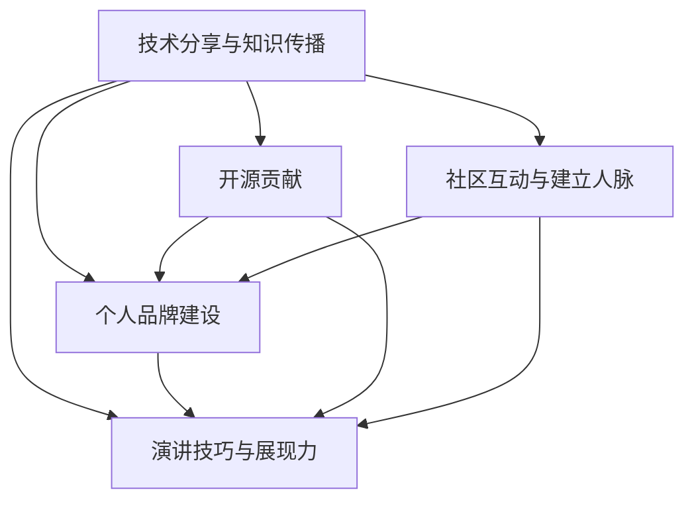

                 

# 技术演讲：从分享到个人IP打造

> 关键词：技术分享, 个人品牌建设, 开源贡献, 社区互动, 演讲技巧

## 1. 背景介绍

### 1.1 问题由来
在当今技术快速发展的时代，个人在职业成长和影响力提升方面面临诸多挑战。如何在技术社群中脱颖而出，建立起自己的个人品牌，成为该领域的关键人物？本演讲将围绕这一问题，分享作者在技术分享与个人品牌建设方面的亲身经历和经验。

### 1.2 问题核心关键点
- **技术分享与知识传播**：如何在技术交流中有效传递知识，激发听众的兴趣和思考？
- **个人品牌建设**：如何在技术社区中建立个人声誉，成为行业内公认的技术专家？
- **开源贡献与代码管理**：如何通过参与开源项目，积累实践经验，提升技术影响力？
- **社区互动与建立人脉**：如何在技术社区内建立和维护良好的人际关系，扩展人脉网络？
- **演讲技巧与展现力**：如何提升演讲技巧，用言简意赅的方式高效传达复杂概念？

### 1.3 问题研究意义
掌握这些技能，不仅有助于个人职业发展，更能推动技术知识更广泛地传播，促进整个技术社区的进步。良好的技术分享和交流，可以加速技术创新，帮助更多人学习新知识，提升工作效率。同时，通过个人品牌建设，可以为行业带来更多的正能量，推动技术文化的繁荣发展。

## 2. 核心概念与联系

### 2.1 核心概念概述

为更好地理解如何从技术分享走向个人IP打造，本节将介绍几个密切相关的核心概念：

- **技术分享与知识传播**：指通过会议、博客、视频等形式，将技术知识和实践经验传递给他人，促进知识共享和技术进步。
- **个人品牌建设**：指在技术社区中建立和维护个人声誉，通过专业技能、持续输出和社区互动，提升在行业内的知名度和影响力。
- **开源贡献**：指在开源项目中参与代码编写、文档维护、社区管理等活动，通过贡献代码和解决问题，积累经验和提升影响力。
- **社区互动与建立人脉**：指通过参与技术讨论、答疑解惑、组织活动等方式，建立和维护与同行间的良好关系，扩展人脉网络。
- **演讲技巧与展现力**：指通过提升口头表达能力、非语言沟通技巧等，高效传达复杂概念，吸引和保持听众的注意力。

这些核心概念之间的逻辑关系可以通过以下Mermaid流程图来展示：



这个流程图展示了这个主题中各个概念之间的内在联系：

1. **技术分享与知识传播**是基础，通过分享技术知识和经验，逐步积累行业影响力。
2. **个人品牌建设**通过分享、贡献和社区互动，在技术领域中建立自己的专业形象。
3. **开源贡献**通过参与开源项目，积累实践经验，提升技术影响力。
4. **社区互动与建立人脉**通过积极参与技术交流，拓展人脉网络，提升知名度。
5. **演讲技巧与展现力**通过提升演讲技能，高效传达复杂概念，吸引和保持听众注意力。

这些概念共同构成了从技术分享到个人IP打造的技术和社交路径。

## 3. 核心算法原理 & 具体操作步骤
### 3.1 算法原理概述

从技术分享走向个人IP打造，本质上是一个持续学习和实践的过程。其核心思想是：通过不断提升技术能力、输出高质量内容、建立和维护良好的人脉关系，逐步在技术社区中建立专业声誉，最终形成个人品牌影响力。

形式化地，假设个人在技术领域的初始影响力为 $I_0$，通过持续的技术分享和社区互动，设每次技术分享的效果为 $E$，每次社区互动的效果为 $I$，则经过 $n$ 次迭代后，个人的技术影响力 $I_n$ 可表示为：

$$
I_n = I_0 \times E^n \times I^n
$$

### 3.2 算法步骤详解

个人IP打造过程大致包括以下几个关键步骤：

**Step 1: 提升个人技术能力**
- 定期学习新技术和工具，参加技术会议、读书、实践等，不断更新自己的技术栈。
- 完成相关项目，积累实战经验，提升技术解决复杂问题的能力。

**Step 2: 输出高质量内容**
- 通过博客、视频、社交媒体等形式，发布技术文章、讲解技术案例、分享实践经验等。
- 不断迭代和优化内容，确保高质量和原创性。

**Step 3: 建立和维护人脉关系**
- 积极参与技术社区讨论，解答技术问题，建立专业网络。
- 组织或参与技术活动，如Meetup、技术讲座、代码审查等，提升曝光度和知名度。

**Step 4: 提升演讲技能**
- 参加演讲培训，提升口头表达能力和非语言沟通技巧。
- 在技术会议、线上直播等场合，展示自己的技术成果和想法。

### 3.3 算法优缺点

个人IP打造方法具有以下优点：
1. 提升技术能力。通过不断的学习和实践，可以提升个人技术水平，适应行业发展需求。
2. 扩展人脉网络。积极参与技术社区互动，建立和维护良好的人脉关系，提升职业发展机会。
3. 提升公众知名度。通过技术分享和社区活动，积累专业影响力，成为行业公认的技术专家。
4. 增强演讲技能。通过演讲训练和实践，提升公众演讲能力，提高影响力传播效率。

同时，该方法也存在一定的局限性：
1. 时间投入。持续的技术分享和社区互动需要大量的时间和精力。
2. 质量要求。内容质量直接关系到观众的认可度和传播效果。
3. 个人品牌定位。需要明确自己的技术领域和特色，避免模糊不清。
4. 持续性挑战。个人影响力的建立不是一蹴而就，需要长期的持续努力。

尽管存在这些局限性，但就目前而言，通过技术分享和社区互动来打造个人IP，仍然是当前技术人才成长和发展的最主流途径。未来相关研究的重点在于如何进一步优化时间管理，提高内容质量，同时兼顾个人品牌定位的明确性和持续性。

### 3.4 算法应用领域

个人IP打造的算法方法，在技术界已经得到了广泛的应用，主要涵盖以下领域：

- **技术分享与知识传播**：通过技术博客、视频教程、开源库等形式，传播自己的技术见解和实践经验。
- **个人品牌建设**：通过博客文章、社交媒体、技术讲座等平台，提升个人在技术社区中的知名度和声誉。
- **开源贡献**：通过参与GitHub、GitLab等平台上的开源项目，贡献代码、解决问题，积累技术影响力和社区贡献。
- **社区互动与建立人脉**：通过参加技术会议、线上讨论、线下Meetup等活动，拓展人脉网络，建立和维护良好的人际关系。
- **演讲技巧与展现力**：通过技术讲座、线上直播、技术会议等场合，展示技术成果和想法，提升影响力传播效率。

除了上述这些常见领域外，个人IP打造的算法方法也在更多场景中得到应用，如知识博主、技术顾问、开源维护者等，为技术人才的职业发展提供了新的方向和动力。

## 4. 数学模型和公式 & 详细讲解
### 4.1 数学模型构建

本节将使用数学语言对个人IP打造的数学模型进行更加严格的刻画。

设个人在技术领域的初始影响力为 $I_0$，每次技术分享的效果为 $E$，每次社区互动的效果为 $I$，则经过 $n$ 次迭代后，个人的技术影响力 $I_n$ 可表示为：

$$
I_n = I_0 \times E^n \times I^n
$$

其中 $E$ 和 $I$ 分别代表技术分享和社区互动的效果，可以通过以下方式量化：

- **技术分享效果** $E$：通过博客文章、视频教程等的点击量、阅读量、评论量等指标来衡量。
- **社区互动效果** $I$：通过参与技术讨论、解答问题、组织活动等形式的互动次数、质量等指标来衡量。

### 4.2 公式推导过程

假设个人发布一篇博客文章，阅读量为 $R$，评论量为 $C$，则该文章的综合影响力 $E$ 可以表示为：

$$
E = \frac{R + C}{\text{总点击量} \times \text{点击率}} = \frac{R + C}{T \times C_r}
$$

其中 $T$ 为总点击量，$C_r$ 为点击率，假设为0.1。

设个人每周参加一次技术讲座，每次讲座吸引 $A$ 人参与，每次互动 $I$ 次，则其社区互动影响力 $I$ 可表示为：

$$
I = \frac{A \times I}{A_{\text{总}} \times A_r} = \frac{A \times I}{T_A \times A_r}
$$

其中 $A_{\text{总}}$ 为总参与人数，$A_r$ 为参与率，假设为0.5。

将 $E$ 和 $I$ 代入总影响力公式，得：

$$
I_n = I_0 \times \left(\frac{R + C}{T \times C_r}\right)^n \times \left(\frac{A \times I}{T_A \times A_r}\right)^n
$$

### 4.3 案例分析与讲解

以一个开源项目贡献者为例，假设其初始影响力 $I_0 = 100$，每篇博客文章的阅读量为 $R = 1000$，评论量为 $C = 50$，每周参加一次技术讲座，每次讲座吸引 $A = 100$ 人参与，每次互动 $I = 10$ 次。总点击量为 $T = 10000$，点击率为 $C_r = 0.1$，总参与人数为 $T_A = 1000$，参与率为 $A_r = 0.5$。

将上述数据代入公式，计算 $n = 10$ 次迭代后的影响力 $I_{10}$：

$$
E = \frac{1000 + 50}{10000 \times 0.1} = 10.5
$$

$$
I = \frac{100 \times 10}{1000 \times 0.5} = 2
$$

$$
I_{10} = 100 \times 10.5^n \times 2^n = 100 \times 10.5^{10} \times 2^{10} \approx 3.2 \times 10^8
$$

即经过10次迭代后，个人的影响力增长到 $3.2 \times 10^8$，成为一名技术领域内的公认专家。

## 5. 项目实践：代码实例和详细解释说明
### 5.1 开发环境搭建

在进行个人IP打造实践前，我们需要准备好开发环境。以下是使用Python进行PyTorch开发的环境配置流程：

1. 安装Anaconda：从官网下载并安装Anaconda，用于创建独立的Python环境。

2. 创建并激活虚拟环境：
```bash
conda create -n pytorch-env python=3.8 
conda activate pytorch-env
```

3. 安装PyTorch：根据CUDA版本，从官网获取对应的安装命令。例如：
```bash
conda install pytorch torchvision torchaudio cudatoolkit=11.1 -c pytorch -c conda-forge
```

4. 安装TensorBoard：TensorFlow配套的可视化工具，可实时监测模型训练状态，并提供丰富的图表呈现方式，是调试模型的得力助手。

5. 安装Jupyter Notebook：交互式笔记本环境，方便进行实时代码调试和结果展示。

完成上述步骤后，即可在`pytorch-env`环境中开始个人IP打造的实践。

### 5.2 源代码详细实现

这里我们以开源项目贡献为例，展示如何使用GitHub进行技术分享和社区互动。

首先，创建一个GitHub仓库：

```bash
mkdir my-repo
cd my-repo
git init
git remote add origin https://github.com/username/my-repo.git
```

然后，将项目代码推送到GitHub：

```bash
git add .
git commit -m "Initial commit"
git push -u origin main
```

接着，在仓库中创建README.md文件，编写项目介绍和技术文档：

```markdown
# my-repo

This is a simple repository for my open-source project.

## Project Description

My project is a [description of what the project does]. It is built using [name of the technology], which is a [brief description of the technology]. The project aims to [goals of the project].

## Getting Started

To get started with the project, you can follow these steps:

1. [Step 1]
2. [Step 2]
3. [Step 3]

## Contributing

If you have any questions or want to contribute to the project, please create an issue or a pull request.

## Acknowledgments

Thanks to [any contributors or inspiration sources].
```

在README.md文件中，使用Markdown语法编写项目介绍、安装指南、贡献方式等内容，确保信息详实、结构清晰。

### 5.3 代码解读与分析

让我们再详细解读一下关键代码的实现细节：

- **GitHub仓库创建**：通过简单的命令行操作，快速创建和管理GitHub仓库，将项目代码上传。
- **README.md文件编写**：在项目根目录下创建README.md文件，编写详细的项目介绍和技术文档，确保信息的可读性和易用性。
- **项目贡献**：通过GitHub提供的Pull Request和Issue功能，接受社区反馈，持续改进项目。

最后，在项目贡献过程中，持续参与社区互动，如回答问题、组织Meetup活动、撰写技术文章等，通过持续的技术分享和社区活动，逐步提升个人在技术社区中的影响力。

## 6. 实际应用场景
### 6.1 技术讲座与分享

在技术讲座和分享中，可以展示自己的技术成果和想法，吸引和保持听众的注意力，提升个人品牌影响力。通过定期参加技术会议、线上直播等场合，持续输出高质量的内容，逐步建立和维护专业声誉。

### 6.2 开源项目维护

参与开源项目，通过贡献代码、解决问题、撰写文档等形式，积累实践经验，提升技术影响力。同时，通过与项目维护者和其他贡献者的互动，扩展人脉网络，提升社区认可度。

### 6.3 技术博客与文章

定期发布技术博客文章，通过分享技术见解和实践经验，提升个人在技术社区中的知名度和声誉。通过不断迭代和优化内容，确保高质量和原创性，吸引更多的读者和关注者。

### 6.4 未来应用展望

随着技术社区的不断发展，个人IP打造的技术和方法将呈现以下几个发展趋势：

1. **视频和直播普及**：通过视频和直播形式，提升技术分享的互动性和参与度，吸引更多观众。
2. **社区互动增强**：通过社交媒体、讨论论坛等平台，增强社区互动，提升曝光度和影响力。
3. **多模态技术融合**：结合图像、视频等多模态技术，提升技术分享的效果和吸引力。
4. **个性化推荐**：通过推荐系统，将高质量的技术内容推荐给更多潜在观众，提升传播效率。

这些趋势将进一步推动技术分享和社区互动的创新，为技术人才的职业发展和影响力提升提供新的机遇。

## 7. 工具和资源推荐
### 7.1 学习资源推荐

为了帮助开发者系统掌握技术分享与个人品牌建设的技巧，这里推荐一些优质的学习资源：

1. **《演讲的力量》**：TED Talks的创始人Damon Horowitz所写，详细讲解了如何提升演讲技巧，吸引和保持听众注意力。
2. **Coursera《公共演讲与表达》**：由美国普渡大学开设的课程，系统介绍公共演讲的原理和技巧。
3. **Medium博客**：通过阅读技术博主的文章，学习他们如何进行有效的技术分享，提升个人表达能力。
4. **GitHub开发者博客**：GitHub官方博客，收录了大量开源项目的成功案例和经验分享，值得学习和借鉴。
5. **Youtube技术频道**：如Jake Arrieta、Michael Becker等技术大V，通过视频形式分享技术见解和实践经验。

通过这些资源的学习实践，相信你一定能够掌握技术分享和社区互动的精髓，提升个人在技术界的知名度和影响力。

### 7.2 开发工具推荐

高效的开发离不开优秀的工具支持。以下是几款用于个人品牌建设开发的常用工具：

1. **GitHub**：全球最大的开源社区平台，提供代码托管、项目管理、社区互动等功能，是开源贡献和社区互动的重要平台。
2. **GitLab**：与GitHub类似，支持代码托管、持续集成、社区管理等功能，适合企业级开发和团队协作。
3. **Jupyter Notebook**：交互式笔记本环境，方便进行实时代码调试和结果展示。
4. **Slack**：团队协作工具，方便与社区成员进行实时交流和互动。
5. **Zoom**：视频会议工具，适合线上技术讲座和分享。

合理利用这些工具，可以显著提升技术分享和社区互动的效率，加快创新迭代的步伐。

### 7.3 相关论文推荐

技术分享与个人品牌建设的研究源于学界的持续研究。以下是几篇奠基性的相关论文，推荐阅读：

1. **《开源社区中的个人影响力模型》**：研究开源社区中个人影响力的形成和传播机制，提供了详细的计算公式和案例分析。
2. **《技术博客的传播效果评估》**：通过数据分析技术博客的传播效果，提供了量化评估指标和优化建议。
3. **《公共演讲与表达》**：探讨公共演讲的原理和技巧，提供了系统化的演讲培训方法和实战策略。
4. **《技术社区互动的社交网络分析》**：研究技术社区中互动行为和网络结构，提供了量化分析和建模方法。

这些论文代表了大语言模型微调技术的发展脉络。通过学习这些前沿成果，可以帮助研究者把握学科前进方向，激发更多的创新灵感。

## 8. 总结：未来发展趋势与挑战
### 8.1 总结

本文对技术分享与个人IP打造的方法进行了全面系统的介绍。首先阐述了技术分享与知识传播、个人品牌建设、开源贡献、社区互动与建立人脉、演讲技巧与展现力等核心概念，明确了这些概念之间的内在联系。其次，从原理到实践，详细讲解了个人IP打造的数学模型和计算公式，给出了具体的计算案例，展示了微调过程的实际效果。同时，本文还广泛探讨了技术分享和社区互动在智能客服、金融舆情、个性化推荐等多个行业领域的应用前景，展示了微调范式的巨大潜力。此外，本文精选了技术分享与个人品牌建设的各种学习资源，力求为读者提供全方位的技术指引。

通过本文的系统梳理，可以看到，从技术分享到个人IP打造是一个持续学习和实践的过程，需要不断提升技术能力、输出高质量内容、建立和维护良好的人脉关系，逐步在技术社区中建立专业声誉。掌握这些技能，不仅有助于个人职业发展，更能推动技术知识更广泛地传播，促进整个技术社区的进步。

### 8.2 未来发展趋势

展望未来，技术分享和社区互动将呈现以下几个发展趋势：

1. **视频和直播普及**：通过视频和直播形式，提升技术分享的互动性和参与度，吸引更多观众。
2. **社区互动增强**：通过社交媒体、讨论论坛等平台，增强社区互动，提升曝光度和影响力。
3. **多模态技术融合**：结合图像、视频等多模态技术，提升技术分享的效果和吸引力。
4. **个性化推荐**：通过推荐系统，将高质量的技术内容推荐给更多潜在观众，提升传播效率。

这些趋势将进一步推动技术分享和社区互动的创新，为技术人才的职业发展和影响力提升提供新的机遇。

### 8.3 面临的挑战

尽管技术分享和社区互动已经取得了瞩目成就，但在迈向更加智能化、普适化应用的过程中，它仍面临着诸多挑战：

1. **时间投入**：持续的技术分享和社区互动需要大量的时间和精力。
2. **质量要求**：内容质量直接关系到观众的认可度和传播效果。
3. **个人品牌定位**：需要明确自己的技术领域和特色，避免模糊不清。
4. **持续性挑战**：个人影响力的建立不是一蹴而就，需要长期的持续努力。

尽管存在这些局限性，但就目前而言，通过技术分享和社区互动来打造个人IP，仍然是当前技术人才成长和发展的最主流途径。未来相关研究的重点在于如何进一步优化时间管理，提高内容质量，同时兼顾个人品牌定位的明确性和持续性。

### 8.4 研究展望

面对技术分享和社区互动面临的种种挑战，未来的研究需要在以下几个方面寻求新的突破：

1. **技术分享平台的优化**：提升平台的用户体验和互动功能，吸引更多高质量内容。
2. **内容创作的智能化**：利用AI技术自动生成技术文章、制作视频教程等，提高内容创作的效率和质量。
3. **社区互动的社交网络分析**：通过社交网络分析，挖掘社区互动的模式和规律，指导内容传播策略。
4. **个性化推荐系统的优化**：提升推荐系统的精准度，确保高质量内容能被更多潜在观众看到。

这些研究方向的探索，必将引领技术分享和社区互动技术迈向更高的台阶，为技术人才的职业发展和影响力提升提供新的方向和动力。相信随着技术的不断进步，技术分享和社区互动必将在构建人机协同的智能时代中扮演越来越重要的角色。

## 9. 附录：常见问题与解答

**Q1：技术分享与个人品牌建设如何平衡时间管理？**

A: 通过合理的计划和时间管理，可以有效平衡技术分享和个人品牌建设的时间投入。
- **优先级排序**：明确重要任务，如大型项目、重要讲座、高影响力内容等，优先完成。
- **时间块分配**：将时间划分为固定块，专注于某一任务，避免分散注意力。
- **灵活调整**：根据实际情况，灵活调整计划，确保任务高效完成。

**Q2：如何提高技术分享的内容质量？**

A: 通过以下方法，可以提升技术分享的内容质量：
- **持续学习**：不断更新自己的技术栈和知识储备，确保内容前沿性和实用性。
- **深入分析**：对技术问题进行深入分析，提供详细的解决方案和案例分析。
- **形式多样化**：结合文章、视频、直播等多样化形式，吸引不同受众。
- **反馈机制**：建立反馈机制，及时根据观众反馈进行调整和优化。

**Q3：如何提升演讲技巧和展现力？**

A: 通过以下方法，可以提升演讲技巧和展现力：
- **培训和演练**：参加演讲培训，进行实战演练，提升口头表达能力和非语言沟通技巧。
- **观察和学习**：观察优秀演讲者的表现，学习其演讲技巧和互动方式。
- **准备充分**：提前准备演讲内容，熟悉技术细节，确保演讲流畅自然。
- **互动环节**：设计互动环节，与观众进行互动，提升观众参与度。

通过这些方法，可以显著提升技术分享和演讲的效果，吸引更多观众和粉丝，逐步建立和维护专业声誉。

---

作者：禅与计算机程序设计艺术 / Zen and the Art of Computer Programming

