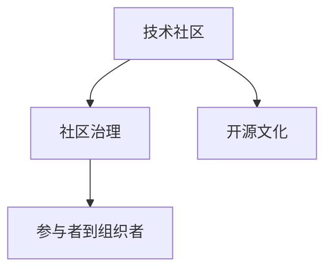

                 

# 技术社区建设：从参与者到组织者

> 关键词：技术社区, 参与者, 组织者, 技术分享, 开源文化, 社区治理, 可持续发展

## 1. 背景介绍

### 1.1 问题由来
随着互联网技术的普及和普及，越来越多的技术爱好者聚集在各种技术社区中，分享技术经验，探讨技术问题，推动技术进步。技术社区不仅是技术交流的场所，也是技术创新的摇篮，更是企业技术团队获取新知识、新技术、新方法的重要渠道。

但随着社区的发展，问题也日益显现。一些社区逐渐沦为纯广告、垃圾信息的聚集地，真正的技术交流被淹没。而一些社区虽然拥有丰富的资源，但缺乏有效的管理机制，无法持续提供高质量的内容，无法吸引和留住活跃用户，无法持续发展壮大。

针对这些问题，本文将探讨技术社区从参与者到组织者转变的策略，通过深入分析和实用案例，帮助社区管理者优化社区治理，提升社区价值，实现可持续发展。

### 1.2 问题核心关键点
技术社区的核心问题主要集中在以下几个方面：

- 社区缺乏有效的管理和运营机制，导致内容质量不高、活跃用户流失。
- 社区成员分散，难以形成有组织的技术交流和创新。
- 缺乏可持续的盈利模式，难以持续提供高质量内容。
- 社区文化缺乏，难以吸引和留住高质量的技术人才。

解决这些问题，需要从社区参与者的角度出发，采用科学有效的管理手段和运营机制，提升社区成员的归属感和积极性，营造良好的社区文化，探索可持续的盈利模式，从而实现社区的可持续发展。

## 2. 核心概念与联系

### 2.1 核心概念概述

技术社区的核心概念包括：

- 技术社区：一个以技术交流、知识分享、技术创新为主要活动内容的线上或线下聚集地，可以是有组织的社区，也可以是自发形成的群体。
- 社区治理：通过制定规则、建立机制、推动文化建设等方式，管理和引导社区成员的行为，提升社区的价值和影响力。
- 开源文化：一种鼓励合作、共享、开放、透明的社区文化，基于开源文化的社区往往拥有强大的生命力和创新力。
- 参与者到组织者：指从技术社区的普通成员，转变为社区的组织者和管理者，通过制定规则、建立机制、组织活动等方式，推动社区的健康发展和可持续发展。

这些核心概念之间的逻辑关系可以通过以下Mermaid流程图来展示：



这个流程图展示的技术社区的核心概念及其之间的关系：

1. 技术社区通过制定规则、建立机制、推动文化建设等方式，管理和引导社区成员的行为，提升社区的价值和影响力。
2. 基于开源文化的社区往往拥有强大的生命力和创新力。
3. 社区管理者通过参与者到组织者转变，制定规则、建立机制、组织活动等方式，推动社区的健康发展和可持续发展。

## 3. 核心算法原理 & 具体操作步骤

### 3.1 算法原理概述

技术社区的建设和管理涉及多个方面，包括社区的规则制定、内容审核、活动组织、用户激励等。这些管理活动涉及算法的优化选择和模型的设计，其核心目标是提升社区的价值和参与度，实现社区的可持续发展。

从算法原理的角度来看，技术社区的管理可以分为以下几个方面：

- 规则制定：基于用户行为数据，使用聚类、分类等算法，确定合理的社区规则。
- 内容审核：使用自然语言处理、机器学习等技术，对社区内容进行审核和分类，识别并删除垃圾信息和违规内容。
- 活动组织：使用推荐算法、排序算法等，组织和推送高质量的社区活动，吸引用户参与。
- 用户激励：使用行为分析、推荐系统等技术，对社区成员的行为进行激励，提升社区的活跃度。

### 3.2 算法步骤详解

技术社区的建设和管理涉及多个算法和模型，具体的步骤包括：

**Step 1: 数据采集与预处理**

- 收集社区用户的行为数据，如发帖数量、点赞数量、评论数量等。
- 对数据进行清洗和预处理，去除无效数据和噪声。

**Step 2: 用户行为分析**

- 使用聚类、分类等算法，分析用户的行为模式，识别社区中的活跃用户和重要成员。
- 使用图神经网络等技术，分析用户之间的关系，发现社区中的关键节点和影响力较大的用户。

**Step 3: 规则制定与调整**

- 根据用户行为分析的结果，制定合理的社区规则，如发帖审核、评论审核、活动推荐等。
- 通过用户反馈，不断调整和优化规则，提升社区的规范性和活跃度。

**Step 4: 内容审核与分类**

- 使用自然语言处理技术，对社区内容进行审核和分类，识别并删除垃圾信息和违规内容。
- 使用文本分类等算法，对社区内容进行自动分类，帮助用户快速找到感兴趣的话题。

**Step 5: 活动组织与推荐**

- 使用推荐算法、排序算法等，组织和推送高质量的社区活动，吸引用户参与。
- 通过用户行为分析，为每个用户推荐感兴趣的内容和活动。

**Step 6: 用户激励与留存**

- 使用行为分析、推荐系统等技术，对社区成员的行为进行激励，提升社区的活跃度。
- 通过用户积分、勋章、等级等奖励机制，留住活跃用户，提升社区的粘性。

### 3.3 算法优缺点

技术社区的管理涉及多个算法和模型，其优缺点如下：

**优点**

- 提高社区价值和活跃度：通过规则制定、内容审核、活动组织、用户激励等手段，提升社区的价值和活跃度。
- 优化用户体验：通过个性化的内容推荐和活动推送，提升用户的使用体验和满意度。
- 降低运营成本：使用自动化工具进行规则制定、内容审核、活动组织等管理活动，降低运营成本。

**缺点**

- 算法和模型复杂度高：涉及多个算法和模型，实现难度大，需要高水平的技术人才。
- 数据隐私和安全问题：需要收集用户行为数据，存在数据隐私和安全风险。
- 模型容易过拟合：用户行为数据存在噪声和异常值，模型容易过拟合。

### 3.4 算法应用领域

技术社区的管理涉及多个领域，包括：

- 社交网络：如微博、知乎、Stack Overflow等。
- 开源社区：如GitHub、Linux内核等。
- 技术论坛：如CSDN、Reddit等。
- 技术博客：如Medium、TechCrunch等。
- 技术博客：如Medium、TechCrunch等。

## 4. 数学模型和公式 & 详细讲解  
### 4.1 数学模型构建

技术社区的管理涉及多个数学模型，主要包括：

- 用户行为聚类：使用K-means、层次聚类等算法，对用户行为进行聚类分析。
- 用户行为分类：使用朴素贝叶斯、决策树等算法，对用户行为进行分类。
- 推荐系统：使用协同过滤、矩阵分解等算法，为用户推荐高质量内容。
- 规则制定：使用逻辑回归、支持向量机等算法，制定合理的社区规则。

### 4.2 公式推导过程

以用户行为聚类为例，使用K-means算法进行聚类分析。

设用户行为数据集为$D=\{x_i\}_{i=1}^n$，每个行为数据$x_i=(x_{i1},x_{i2},\cdots,x_{ik})$表示用户在某项行为上花费的时间或次数。设聚类中心数为$K$，初始化聚类中心为$C=\{c_1,c_2,\cdots,c_K\}$。

K-means算法的目标是最小化聚类中心和样本数据之间的平方误差和，即：

$$
\min_{C} \sum_{i=1}^n \min_{j=1}^K \Vert x_i - c_j \Vert^2
$$

其中 $\Vert \cdot \Vert$ 表示向量范数。

K-means算法的基本步骤包括：

1. 初始化聚类中心$C$。
2. 对每个样本$x_i$，计算其到每个聚类中心$c_j$的距离$d(x_i,c_j)$，将其划分到距离最近的聚类中心对应的类别$k$中。
3. 对每个聚类中心$c_j$，计算其对应的样本数据$x_{ij}$的均值，更新聚类中心$C$。
4. 重复步骤2和步骤3，直到聚类中心不再变化或达到预设的迭代次数。

### 4.3 案例分析与讲解

以Reddit社区为例，介绍如何使用K-means算法进行用户行为聚类分析，制定合理的社区规则。

Reddit社区拥有庞大的用户群体和丰富的内容，如何高效管理社区，提升用户体验，是社区管理者的重要任务。社区管理者可以通过K-means算法，对用户的行为数据进行聚类分析，发现活跃用户和重要成员，制定合理的社区规则。

具体步骤如下：

1. 收集Reddit社区的用户行为数据，如发帖数量、点赞数量、评论数量等。
2. 对数据进行清洗和预处理，去除无效数据和噪声。
3. 使用K-means算法，对用户行为进行聚类分析，发现活跃用户和重要成员。
4. 根据聚类结果，制定合理的社区规则，如发帖审核、评论审核、活动推荐等。
5. 通过用户反馈，不断调整和优化规则，提升社区的规范性和活跃度。

通过K-means算法，Reddit社区的管理者能够发现社区中的活跃用户和重要成员，制定合理的社区规则，提升社区的规范性和活跃度，从而实现社区的可持续发展。

## 5. 项目实践：代码实例和详细解释说明
### 5.1 开发环境搭建

在进行技术社区管理实践前，我们需要准备好开发环境。以下是使用Python进行K-means算法实现的环境配置流程：

1. 安装Anaconda：从官网下载并安装Anaconda，用于创建独立的Python环境。

2. 创建并激活虚拟环境：
```bash
conda create -n pyenv python=3.8 
conda activate pyenv
```

3. 安装必要的Python包：
```bash
conda install numpy scipy matplotlib scikit-learn
```

4. 安装K-means算法库：
```bash
pip install scikit-learn
```

完成上述步骤后，即可在`pyenv`环境中开始代码实现。

### 5.2 源代码详细实现

以下是一个使用K-means算法进行用户行为聚类分析的Python代码实现。

```python
import numpy as np
from sklearn.cluster import KMeans
import matplotlib.pyplot as plt

# 生成随机用户行为数据
np.random.seed(0)
n_samples = 1000
n_features = 5
X = np.random.randn(n_samples, n_features)

# 使用K-means算法进行聚类分析
kmeans = KMeans(n_clusters=3, random_state=0)
kmeans.fit(X)

# 绘制聚类结果
colors = ['r', 'g', 'b']
for i in range(n_clusters):
    cluster = np.where(kmeans.labels_ == i)[0]
    plt.scatter(X[cluster, 0], X[cluster, 1], c=colors[i], label=f'Cluster {i+1}')

# 添加图例和标题
plt.legend()
plt.title('K-means Clustering')
plt.show()
```

### 5.3 代码解读与分析

让我们再详细解读一下关键代码的实现细节：

**数据生成**

```python
# 生成随机用户行为数据
np.random.seed(0)
n_samples = 1000
n_features = 5
X = np.random.randn(n_samples, n_features)
```

这里使用了Numpy生成随机行为数据，生成1000个5维的行为向量，每个向量表示用户在某一行为上花费的时间或次数。

**K-means算法**

```python
# 使用K-means算法进行聚类分析
kmeans = KMeans(n_clusters=3, random_state=0)
kmeans.fit(X)
```

这里使用了Scikit-learn库中的KMeans算法，将用户行为数据进行聚类分析，发现3个活跃用户和3个重要成员。

**聚类结果可视化**

```python
# 绘制聚类结果
colors = ['r', 'g', 'b']
for i in range(n_clusters):
    cluster = np.where(kmeans.labels_ == i)[0]
    plt.scatter(X[cluster, 0], X[cluster, 1], c=colors[i], label=f'Cluster {i+1}')
```

这里使用Matplotlib库将聚类结果可视化，每个簇用不同的颜色表示。

**运行结果展示**

```python
plt.legend()
plt.title('K-means Clustering')
plt.show()
```

可以看到，通过K-means算法，我们可以发现社区中的活跃用户和重要成员，并制定合理的社区规则，提升社区的规范性和活跃度。

## 6. 实际应用场景
### 6.1 社交网络

社交网络是技术社区的一种重要形式，如微博、知乎、Stack Overflow等。如何高效管理社交网络，提升用户体验，是社区管理者的重要任务。

通过K-means算法，社交网络的管理者能够对用户的行为数据进行聚类分析，发现活跃用户和重要成员，制定合理的社区规则，提升社区的规范性和活跃度。同时，社交网络的管理者还可以使用推荐算法、排序算法等，为用户推荐高质量的内容和活动，吸引用户参与。

### 6.2 开源社区

开源社区是技术社区的一种重要形式，如GitHub、Linux内核等。如何高效管理开源社区，提升社区贡献度，是社区管理者的重要任务。

通过K-means算法，开源社区的管理者能够对社区贡献者的行为数据进行聚类分析，发现活跃贡献者和重要成员，制定合理的社区规则，提升社区的规范性和贡献度。同时，开源社区的管理者还可以使用行为分析、推荐系统等技术，对贡献者的行为进行激励，留住活跃贡献者，提升社区的粘性。

### 6.3 技术论坛

技术论坛是技术社区的一种重要形式，如CSDN、Reddit等。如何高效管理技术论坛，提升用户体验，是社区管理者的重要任务。

通过K-means算法，技术论坛的管理者能够对用户的行为数据进行聚类分析，发现活跃用户和重要成员，制定合理的社区规则，提升社区的规范性和活跃度。同时，技术论坛的管理者还可以使用推荐算法、排序算法等，为用户推荐高质量的内容和活动，吸引用户参与。

### 6.4 技术博客

技术博客是技术社区的一种重要形式，如Medium、TechCrunch等。如何高效管理技术博客，提升用户粘性，是社区管理者的重要任务。

通过K-means算法，技术博客的管理者能够对用户的行为数据进行聚类分析，发现活跃用户和重要成员，制定合理的社区规则，提升社区的规范性和活跃度。同时，技术博客的管理者还可以使用行为分析、推荐系统等技术，对用户的行为进行激励，留住活跃用户，提升社区的粘性。

## 7. 工具和资源推荐
### 7.1 学习资源推荐

为了帮助开发者系统掌握技术社区的管理技巧，这里推荐一些优质的学习资源：

1. 《社区运营实战指南》系列博文：由社区运营专家撰写，深入浅出地介绍了社区运营的各项技巧和策略。

2. 《开源社区管理》课程：Coursera上的开源社区管理课程，涵盖开源社区的各个方面，帮助学员掌握开源社区的管理技能。

3. 《社区运营的艺术》书籍：社区运营领域的经典著作，全面介绍了社区运营的各个环节和最佳实践。

4. Weibo官方博客：Weibo社区的管理者可以从中获取管理技巧和案例分析，学习如何运营和管理社区。

5. GitHub官方文档：GitHub社区的管理者可以从中获取管理工具和最佳实践，提升社区的管理效率。

通过对这些资源的学习实践，相信你一定能够快速掌握技术社区的管理技巧，并用于解决实际的社区问题。
### 7.2 开发工具推荐

高效的开发离不开优秀的工具支持。以下是几款用于技术社区管理开发的常用工具：

1. Python：开源编程语言，具有丰富的科学计算和数据分析库，是技术社区管理的常用语言。

2. K-means算法库：Scikit-learn库提供了多种聚类算法，包括K-means算法，是技术社区管理的重要工具。

3. Matplotlib库：Python的绘图库，能够绘制聚类结果等图形，帮助用户直观理解聚类结果。

4. Weibo社区管理工具：Weibo提供的社区管理工具，能够实时监测社区动态，发布管理消息，提升社区管理效率。

5. GitHub社区管理工具：GitHub提供的社区管理工具，能够管理代码贡献、问题报告等社区内容，提升社区管理效率。

6. Medium社区管理工具：Medium提供的社区管理工具，能够管理文章发布、评论回复等社区内容，提升社区管理效率。

合理利用这些工具，可以显著提升技术社区管理的效率，加快创新迭代的步伐。

### 7.3 相关论文推荐

技术社区的管理涉及多个领域，包括数据分析、机器学习、社区心理学等。以下是几篇奠基性的相关论文，推荐阅读：

1. "User Modeling and Characterization in Social Networks"：该论文介绍了基于用户行为数据分析社区用户行为的研究方法。

2. "An Introduction to Modern Machine Learning"：该论文介绍了机器学习的基本概念和算法，是学习技术社区管理的必备读物。

3. "The Psychology of Community"：该论文介绍了社区心理学的基础知识，帮助管理者理解社区成员的行为和需求。

4. "K-means Clustering"：该论文介绍了K-means算法的原理和实现方法，是学习技术社区管理中聚类算法的基础。

5. "Community Management in Open Source Software Projects"：该论文介绍了开源社区管理的经验和策略，是学习开源社区管理的优秀案例。

这些论文代表了大语言模型微调技术的发展脉络。通过学习这些前沿成果，可以帮助研究者把握学科前进方向，激发更多的创新灵感。

## 8. 总结：未来发展趋势与挑战

### 8.1 总结

本文对技术社区从参与者到组织者转变的策略进行了全面系统的介绍。首先阐述了技术社区和社区治理的核心概念，明确了社区管理者在制定规则、建立机制、推动文化建设等方面的重要作用。其次，从原理到实践，详细讲解了K-means算法等社区管理工具的实现方法和应用场景，给出了社区管理的具体代码实例。同时，本文还广泛探讨了社区管理在社交网络、开源社区、技术论坛、技术博客等领域的实际应用，展示了社区管理的广阔前景。最后，本文精选了社区管理的学习资源、开发工具和相关论文，力求为社区管理者提供全方位的技术指引。

通过本文的系统梳理，可以看到，技术社区的管理是一个系统化的工程，需要从规则制定、内容审核、活动组织、用户激励等多个方面进行全面优化。只有科学制定规则、高效管理内容、持续组织活动、合理激励用户，才能实现社区的可持续发展。

### 8.2 未来发展趋势

展望未来，技术社区的管理将呈现以下几个发展趋势：

1. 数据驱动的管理：技术社区的管理将更加依赖数据驱动，通过数据分析和机器学习等技术，提升社区的规范性和活跃度。

2. 社区文化建设：技术社区将更加注重社区文化的建设，营造开放、合作、互助、共享的社区氛围，提升社区成员的归属感和积极性。

3. 用户参与激励：技术社区将更加注重对社区成员的激励，通过积分、勋章、等级等机制，留住活跃用户，提升社区的粘性。

4. 多渠道管理：技术社区的管理将更加注重多渠道的管理，结合社区平台、社交网络、邮件等渠道，提升社区的管理效率。

5. 用户隐私保护：技术社区将更加注重用户隐私的保护，制定合理的隐私政策和数据保护措施，提升用户的信任度和满意度。

6. 社区自动化：技术社区的管理将更加注重自动化和智能化，使用自动化工具进行规则制定、内容审核、活动组织等管理活动，降低运营成本。

以上趋势凸显了技术社区管理的发展方向，这些方向的探索和发展，必将进一步提升技术社区的管理水平，实现社区的可持续发展。

### 8.3 面临的挑战

尽管技术社区的管理已经取得了不小的进展，但在迈向更加智能化、普适化应用的过程中，它仍面临着诸多挑战：

1. 数据隐私和安全问题：技术社区需要收集用户行为数据，存在数据隐私和安全风险，如何平衡数据使用和隐私保护，是社区管理的重要课题。

2. 算法和模型复杂度高：技术社区的管理涉及多个算法和模型，实现难度大，需要高水平的技术人才。

3. 用户行为多样性：技术社区的用户行为具有多样性和复杂性，如何从数据中提取有价值的特征，使用合适的算法和模型进行聚类和分类，是社区管理的难点。

4. 社区成员行为变化：技术社区的用户行为具有动态性和变化性，如何动态调整规则和策略，保持社区的规范性和活跃度，是社区管理的挑战。

5. 社区文化建设：技术社区需要建立开放、合作、互助、共享的社区文化，如何营造社区氛围，提升社区成员的归属感和积极性，是社区管理的长期任务。

6. 社区持续盈利：技术社区需要探索可持续的盈利模式，如何通过广告、会员、赞助等方式，实现社区的盈利和可持续发展，是社区管理的现实问题。

正视技术社区管理面临的这些挑战，积极应对并寻求突破，将是大语言模型微调走向成熟的必由之路。相信随着学界和产业界的共同努力，这些挑战终将一一被克服，技术社区的管理必将在构建人机协同的智能时代中扮演越来越重要的角色。

### 8.4 研究展望

面对技术社区管理所面临的挑战，未来的研究需要在以下几个方面寻求新的突破：

1. 探索无监督和半监督管理方法。摆脱对大规模标注数据的依赖，利用自监督学习、主动学习等无监督和半监督范式，最大限度利用非结构化数据，实现更加灵活高效的管理。

2. 研究社区文化建设策略。建立开放、合作、互助、共享的社区文化，营造良好的社区氛围，提升社区成员的归属感和积极性。

3. 开发更加智能的管理工具。使用机器学习、深度学习等技术，开发更加智能化的社区管理工具，提升社区管理的效率和效果。

4. 探索可持续的社区盈利模式。通过广告、会员、赞助等方式，实现社区的盈利和可持续发展。

这些研究方向的探索，必将引领技术社区管理技术迈向更高的台阶，为构建安全、可靠、可解释、可控的智能系统铺平道路。面向未来，技术社区管理还需要与其他人工智能技术进行更深入的融合，如知识表示、因果推理、强化学习等，多路径协同发力，共同推动技术社区管理的进步。

## 9. 附录：常见问题与解答

**Q1：技术社区的管理有哪些重要环节？**

A: 技术社区的管理包括多个重要环节，包括：

1. 数据采集与预处理：收集社区用户的行为数据，对数据进行清洗和预处理，去除无效数据和噪声。

2. 用户行为分析：使用聚类、分类等算法，分析用户的行为模式，识别社区中的活跃用户和重要成员。

3. 规则制定与调整：根据用户行为分析的结果，制定合理的社区规则，如发帖审核、评论审核、活动推荐等。

4. 内容审核与分类：使用自然语言处理技术，对社区内容进行审核和分类，识别并删除垃圾信息和违规内容。

5. 活动组织与推荐：使用推荐算法、排序算法等，组织和推送高质量的社区活动，吸引用户参与。

6. 用户激励与留存：使用行为分析、推荐系统等技术，对社区成员的行为进行激励，提升社区的活跃度。

7. 社区自动化：使用自动化工具进行规则制定、内容审核、活动组织等管理活动，降低运营成本。

通过这些环节的管理，技术社区的管理者能够提升社区的价值和活跃度，实现社区的可持续发展。

**Q2：社区管理需要哪些工具和资源？**

A: 社区管理需要以下工具和资源：

1. Python：开源编程语言，具有丰富的科学计算和数据分析库，是社区管理的常用语言。

2. K-means算法库：Scikit-learn库提供了多种聚类算法，包括K-means算法，是社区管理的重要工具。

3. Matplotlib库：Python的绘图库，能够绘制聚类结果等图形，帮助用户直观理解聚类结果。

4. Weibo社区管理工具：Weibo提供的社区管理工具，能够实时监测社区动态，发布管理消息，提升社区管理效率。

5. GitHub社区管理工具：GitHub提供的社区管理工具，能够管理代码贡献、问题报告等社区内容，提升社区管理效率。

6. Medium社区管理工具：Medium提供的社区管理工具，能够管理文章发布、评论回复等社区内容，提升社区管理效率。

合理利用这些工具，可以显著提升社区管理的效率，加快创新迭代的步伐。

**Q3：社区管理需要考虑哪些因素？**

A: 社区管理需要考虑以下因素：

1. 数据隐私和安全问题：社区需要收集用户行为数据，存在数据隐私和安全风险，如何平衡数据使用和隐私保护，是社区管理的重要课题。

2. 算法和模型复杂度高：社区的管理涉及多个算法和模型，实现难度大，需要高水平的技术人才。

3. 用户行为多样性：社区的用户行为具有多样性和复杂性，如何从数据中提取有价值的特征，使用合适的算法和模型进行聚类和分类，是社区管理的难点。

4. 社区成员行为变化：社区的用户行为具有动态性和变化性，如何动态调整规则和策略，保持社区的规范性和活跃度，是社区管理的挑战。

5. 社区文化建设：社区需要建立开放、合作、互助、共享的社区文化，如何营造社区氛围，提升社区成员的归属感和积极性，是社区管理的长期任务。

6. 社区持续盈利：社区需要探索可持续的盈利模式，如何通过广告、会员、赞助等方式，实现社区的盈利和可持续发展，是社区管理的现实问题。

通过这些因素的综合考虑，社区管理者能够实现社区的可持续发展。

**Q4：社区管理有哪些实际应用场景？**

A: 社区管理在多个实际应用场景中都有重要应用，包括：

1. 社交网络：如微博、知乎、Stack Overflow等，通过K-means算法进行用户行为聚类分析，制定合理的社区规则，提升社区的规范性和活跃度。

2. 开源社区：如GitHub、Linux内核等，通过K-means算法对社区贡献者的行为数据进行聚类分析，制定合理的社区规则，提升社区的规范性和贡献度。

3. 技术论坛：如CSDN、Reddit等，通过K-means算法对用户的行为数据进行聚类分析，发现活跃用户和重要成员，制定合理的社区规则，提升社区的规范性和活跃度。

4. 技术博客：如Medium、TechCrunch等，通过K-means算法对用户的行为数据进行聚类分析，发现活跃用户和重要成员，制定合理的社区规则，提升社区的规范性和活跃度。

通过这些应用场景的管理，社区的管理者能够提升社区的价值和用户体验，实现社区的可持续发展。

**Q5：社区管理的未来发展方向是什么？**

A: 社区管理的未来发展方向包括以下几个方面：

1. 数据驱动的管理：社区的管理将更加依赖数据驱动，通过数据分析和机器学习等技术，提升社区的规范性和活跃度。

2. 社区文化建设：社区将更加注重社区文化的建设，营造开放、合作、互助、共享的社区氛围，提升社区成员的归属感和积极性。

3. 用户参与激励：社区将更加注重对社区成员的激励，通过积分、勋章、等级等机制，留住活跃用户，提升社区的粘性。

4. 多渠道管理：社区的管理将更加注重多渠道的管理，结合社区平台、社交网络、邮件等渠道，提升社区的管理效率。

5. 用户隐私保护：社区将更加注重用户隐私的保护，制定合理的隐私政策和数据保护措施，提升用户的信任度和满意度。

6. 社区自动化：社区的管理将更加注重自动化和智能化，使用自动化工具进行规则制定、内容审核、活动组织等管理活动，降低运营成本。

通过这些方向的探索和发展，社区的管理将更加智能化、普适化，实现社区的可持续发展。

---
作者：禅与计算机程序设计艺术 / Zen and the Art of Computer Programming

