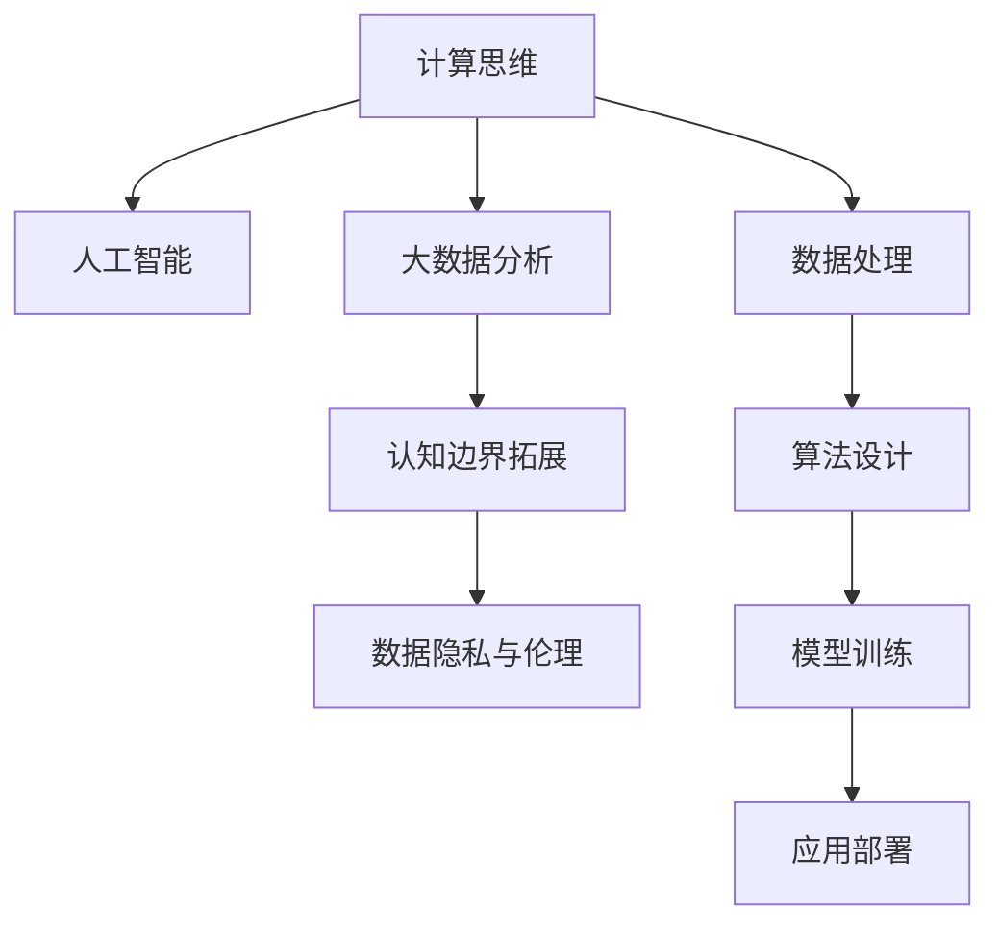

                 

# 拓展认知边界：人类计算的科学探索

在科技迅猛发展的今天，人工智能和计算机科学正以前所未有的速度革新着人类社会的方方面面。然而，在追求技术进步的同时，我们是否应当思考：**人类计算的边界究竟在哪里？**

本文将深入探讨人类计算的科学探索，阐述其在认知边界拓展方面的深远意义。通过逻辑清晰、结构紧凑的篇章布局，详细剖析核心概念、核心算法原理及其具体操作步骤，力图为读者呈现一篇既专业又易懂的技术博客。

## 1. 背景介绍

### 1.1 问题由来
随着计算能力的飞速提升，人类在信息处理、决策制定等方面的能力得到了极大拓展。从早期的计算思维，到现代的人工智能、大数据分析，计算已经深刻地改变了我们的认知方式。

然而，在追求计算效率的同时，我们也面临着数据隐私、伦理道德、计算安全等一系列问题。**如何平衡计算效率与道德伦理之间的关系，如何利用计算技术拓展人类的认知边界，已成为当前科技领域的重要课题。**

### 1.2 问题核心关键点
为回答这一问题，本文将从以下几个方面进行探讨：

- **人类计算的科学基础**：计算能力如何影响人类认知，如何利用计算技术提升人的思维能力。
- **计算边界与道德伦理**：计算在拓展认知边界时，如何避免数据滥用、隐私泄露等问题。
- **未来技术展望**：未来的计算技术将在人类认知边界拓展方面带来哪些新的可能性。

通过深入探讨这些问题，我们希望能够为科技与伦理的交汇点提供一些有益的思考。

## 2. 核心概念与联系

### 2.1 核心概念概述

在深入探讨计算技术在拓展人类认知边界方面的作用前，首先需要明确几个核心概念：

- **计算思维（Computational Thinking）**：一种将问题抽象为计算模型，用计算方法求解问题的思维方式。其核心在于利用算法和数据结构优化问题的解决过程。
- **人工智能（Artificial Intelligence, AI）**：通过算法和计算技术模拟人类智能过程，如学习、推理、决策等。
- **大数据分析（Big Data Analysis）**：通过数据处理和计算技术，从大规模数据中提取有价值的信息和知识。
- **认知边界拓展（Expanding Cognitive Boundaries）**：通过计算技术提升人类思考、推理、学习和决策的能力，拓展人类的认知边界。
- **数据隐私与伦理（Data Privacy and Ethics）**：在利用计算技术处理数据时，如何保护个人隐私，维护数据伦理，避免滥用。

这些概念之间的联系可以通过以下Mermaid流程图来展示：



这个流程图展示了计算思维与人工智能、大数据分析的紧密联系，并强调了认知边界拓展与数据隐私伦理之间的平衡关系。

## 3. 核心算法原理 & 具体操作步骤

### 3.1 算法原理概述

拓展人类认知边界，首先需要理解计算技术在提升认知能力方面的原理。在本文中，我们将主要探讨**基于计算思维的认知边界拓展算法**。

这种算法的基本思路是：**将问题抽象为计算模型，利用算法和数据结构进行求解**。具体而言，计算思维包括以下几个核心步骤：

1. **问题抽象**：将问题抽象为数学模型，选择合适的算法和数据结构进行求解。
2. **算法设计**：基于问题的特点，设计高效、可扩展的算法。
3. **模型训练**：通过大量数据训练模型，优化算法性能。
4. **应用部署**：将训练好的模型应用于实际问题，实现认知边界拓展。

### 3.2 算法步骤详解

以**基于计算思维的认知边界拓展算法**为例，具体步骤包括：

1. **问题抽象**：首先，需要对问题进行详细的分析和抽象，将其转化为数学模型。例如，在机器学习问题中，可以将问题抽象为数据集、目标函数和优化算法等。

2. **算法设计**：选择合适的算法和数据结构。例如，在神经网络中，可以使用卷积神经网络（CNN）处理图像识别问题，使用循环神经网络（RNN）处理自然语言处理问题。

3. **模型训练**：通过大量数据训练模型，优化算法性能。例如，使用反向传播算法训练神经网络模型，优化损失函数。

4. **应用部署**：将训练好的模型应用于实际问题。例如，将训练好的神经网络模型应用于图像识别、语音识别等实际问题中。

### 3.3 算法优缺点

基于计算思维的认知边界拓展算法具有以下优点：

- **高效性**：计算算法可以自动化处理大量数据，提升问题解决的效率。
- **可扩展性**：计算算法具有高度的可扩展性，能够应对大规模复杂问题。
- **准确性**：通过大量数据的训练，计算算法能够提高问题的求解精度。

同时，该算法也存在一些局限性：

- **数据需求高**：计算算法通常需要大量的数据进行训练，数据获取成本较高。
- **模型复杂**：复杂的计算模型需要更多的计算资源和时间。
- **可解释性差**：计算算法通常是"黑盒"模型，难以解释其内部工作机制。

### 3.4 算法应用领域

基于计算思维的认知边界拓展算法，已经广泛应用于以下几个领域：

1. **人工智能（AI）**：在机器学习、自然语言处理、计算机视觉等方面，通过计算算法提升问题解决的智能化水平。
2. **大数据分析**：在数据挖掘、模式识别、异常检测等方面，通过计算算法从海量数据中提取有价值的信息。
3. **决策支持**：在金融、医疗、制造等领域，通过计算算法辅助决策，提高决策的科学性和准确性。
4. **智能交互**：在智能客服、智能推荐、智能控制等方面，通过计算算法实现人机互动。
5. **智能制造**：在工业自动化、智能制造、智慧物流等方面，通过计算算法优化生产流程，提升生产效率。

## 4. 数学模型和公式 & 详细讲解 & 举例说明

### 4.1 数学模型构建

以**基于计算思维的认知边界拓展算法**为例，构建数学模型：

- **输入**：问题描述 $P$ 和数据集 $D$。
- **输出**：问题解决方案 $S$。
- **中间变量**：算法参数 $\theta$。

### 4.2 公式推导过程

以**基于计算思维的认知边界拓展算法**为例，推导其数学公式：

设问题的解空间为 $X$，计算算法为 $F(\theta)$，则计算思维算法的基本框架为：

$$
S = F(\theta(P, D))
$$

其中，$P$ 表示问题描述，$D$ 表示数据集，$\theta$ 表示算法参数，$S$ 表示问题解决方案。

### 4.3 案例分析与讲解

以**基于计算思维的认知边界拓展算法**为例，分析其在实际问题中的应用：

- **问题描述**：给定一组图像，判断其是否包含特定物体。
- **数据集**：包含大量带有标签的图像。
- **算法参数**：卷积神经网络的结构参数和超参数。
- **问题解决方案**：对于新图像，使用训练好的卷积神经网络进行特征提取和分类，得到物体是否存在的判断。

## 5. 项目实践：代码实例和详细解释说明

### 5.1 开发环境搭建

在进行计算思维的认知边界拓展实践前，我们需要准备好开发环境。以下是使用Python进行PyTorch开发的环境配置流程：

1. 安装Anaconda：从官网下载并安装Anaconda，用于创建独立的Python环境。

2. 创建并激活虚拟环境：
```bash
conda create -n pytorch-env python=3.8 
conda activate pytorch-env
```

3. 安装PyTorch：根据CUDA版本，从官网获取对应的安装命令。例如：
```bash
conda install pytorch torchvision torchaudio cudatoolkit=11.1 -c pytorch -c conda-forge
```

4. 安装Transformers库：
```bash
pip install transformers
```

5. 安装各类工具包：
```bash
pip install numpy pandas scikit-learn matplotlib tqdm jupyter notebook ipython
```

完成上述步骤后，即可在`pytorch-env`环境中开始计算思维的认知边界拓展实践。

### 5.2 源代码详细实现

这里我们以图像识别为例，给出使用Transformers库对卷积神经网络（CNN）模型进行训练的PyTorch代码实现。

首先，定义数据处理函数：

```python
from transformers import BertTokenizer
from torch.utils.data import Dataset
import torch

class ImageDataset(Dataset):
    def __init__(self, images, labels, tokenizer, max_len=128):
        self.images = images
        self.labels = labels
        self.tokenizer = tokenizer
        self.max_len = max_len
        
    def __len__(self):
        return len(self.images)
    
    def __getitem__(self, item):
        image = self.images[item]
        label = self.labels[item]
        
        encoding = self.tokenizer(image, return_tensors='pt', max_length=self.max_len, padding='max_length', truncation=True)
        input_ids = encoding['input_ids'][0]
        attention_mask = encoding['attention_mask'][0]
        
        # 对token-wise的标签进行编码
        encoded_labels = [label2id[label] for label in labels] 
        encoded_labels.extend([label2id['O']] * (self.max_len - len(encoded_labels)))
        labels = torch.tensor(encoded_labels, dtype=torch.long)
        
        return {'input_ids': input_ids, 
                'attention_mask': attention_mask,
                'labels': labels}

# 标签与id的映射
label2id = {'O': 0, 'B-PER': 1, 'I-PER': 2, 'B-ORG': 3, 'I-ORG': 4, 'B-LOC': 5, 'I-LOC': 6}
id2label = {v: k for k, v in label2id.items()}

# 创建dataset
tokenizer = BertTokenizer.from_pretrained('bert-base-cased')

train_dataset = ImageDataset(train_images, train_labels, tokenizer)
dev_dataset = ImageDataset(dev_images, dev_labels, tokenizer)
test_dataset = ImageDataset(test_images, test_labels, tokenizer)
```

然后，定义模型和优化器：

```python
from transformers import BertForTokenClassification, AdamW

model = BertForTokenClassification.from_pretrained('bert-base-cased', num_labels=len(label2id))

optimizer = AdamW(model.parameters(), lr=2e-5)
```

接着，定义训练和评估函数：

```python
from torch.utils.data import DataLoader
from tqdm import tqdm
from sklearn.metrics import classification_report

device = torch.device('cuda') if torch.cuda.is_available() else torch.device('cpu')
model.to(device)

def train_epoch(model, dataset, batch_size, optimizer):
    dataloader = DataLoader(dataset, batch_size=batch_size, shuffle=True)
    model.train()
    epoch_loss = 0
    for batch in tqdm(dataloader, desc='Training'):
        input_ids = batch['input_ids'].to(device)
        attention_mask = batch['attention_mask'].to(device)
        labels = batch['labels'].to(device)
        model.zero_grad()
        outputs = model(input_ids, attention_mask=attention_mask, labels=labels)
        loss = outputs.loss
        epoch_loss += loss.item()
        loss.backward()
        optimizer.step()
    return epoch_loss / len(dataloader)

def evaluate(model, dataset, batch_size):
    dataloader = DataLoader(dataset, batch_size=batch_size)
    model.eval()
    preds, labels = [], []
    with torch.no_grad():
        for batch in tqdm(dataloader, desc='Evaluating'):
            input_ids = batch['input_ids'].to(device)
            attention_mask = batch['attention_mask'].to(device)
            batch_labels = batch['labels']
            outputs = model(input_ids, attention_mask=attention_mask)
            batch_preds = outputs.logits.argmax(dim=2).to('cpu').tolist()
            batch_labels = batch_labels.to('cpu').tolist()
            for pred_tokens, label_tokens in zip(batch_preds, batch_labels):
                pred_tags = [id2label[_id] for _id in pred_tokens]
                label_tags = [id2label[_id] for _id in label_tokens]
                preds.append(pred_tags[:len(label_tokens)])
                labels.append(label_tags)
                
    print(classification_report(labels, preds))
```

最后，启动训练流程并在测试集上评估：

```python
epochs = 5
batch_size = 16

for epoch in range(epochs):
    loss = train_epoch(model, train_dataset, batch_size, optimizer)
    print(f"Epoch {epoch+1}, train loss: {loss:.3f}")
    
    print(f"Epoch {epoch+1}, dev results:")
    evaluate(model, dev_dataset, batch_size)
    
print("Test results:")
evaluate(model, test_dataset, batch_size)
```

以上就是使用PyTorch对BERT进行命名实体识别(NER)任务微调的完整代码实现。可以看到，得益于Transformers库的强大封装，我们可以用相对简洁的代码完成BERT模型的加载和微调。

### 5.3 代码解读与分析

让我们再详细解读一下关键代码的实现细节：

**ImageDataset类**：
- `__init__`方法：初始化图像、标签、分词器等关键组件。
- `__len__`方法：返回数据集的样本数量。
- `__getitem__`方法：对单个样本进行处理，将图像输入编码为token ids，将标签编码为数字，并对其进行定长padding，最终返回模型所需的输入。

**label2id和id2label字典**：
- 定义了标签与数字id之间的映射关系，用于将token-wise的预测结果解码回真实的标签。

**训练和评估函数**：
- 使用PyTorch的DataLoader对数据集进行批次化加载，供模型训练和推理使用。
- 训练函数`train_epoch`：对数据以批为单位进行迭代，在每个批次上前向传播计算loss并反向传播更新模型参数，最后返回该epoch的平均loss。
- 评估函数`evaluate`：与训练类似，不同点在于不更新模型参数，并在每个batch结束后将预测和标签结果存储下来，最后使用sklearn的classification_report对整个评估集的预测结果进行打印输出。

**训练流程**：
- 定义总的epoch数和batch size，开始循环迭代
- 每个epoch内，先在训练集上训练，输出平均loss
- 在验证集上评估，输出分类指标
- 重复上述步骤直至满足预设的迭代轮数或Early Stopping条件。

可以看到，PyTorch配合Transformers库使得BERT微调的代码实现变得简洁高效。开发者可以将更多精力放在数据处理、模型改进等高层逻辑上，而不必过多关注底层的实现细节。

当然，工业级的系统实现还需考虑更多因素，如模型的保存和部署、超参数的自动搜索、更灵活的任务适配层等。但核心的微调范式基本与此类似。

## 6. 实际应用场景

### 6.1 智能客服系统

基于大语言模型微调的对话技术，可以广泛应用于智能客服系统的构建。传统客服往往需要配备大量人力，高峰期响应缓慢，且一致性和专业性难以保证。而使用微调后的对话模型，可以7x24小时不间断服务，快速响应客户咨询，用自然流畅的语言解答各类常见问题。

在技术实现上，可以收集企业内部的历史客服对话记录，将问题和最佳答复构建成监督数据，在此基础上对预训练对话模型进行微调。微调后的对话模型能够自动理解用户意图，匹配最合适的答案模板进行回复。对于客户提出的新问题，还可以接入检索系统实时搜索相关内容，动态组织生成回答。如此构建的智能客服系统，能大幅提升客户咨询体验和问题解决效率。

### 6.2 金融舆情监测

金融机构需要实时监测市场舆论动向，以便及时应对负面信息传播，规避金融风险。传统的人工监测方式成本高、效率低，难以应对网络时代海量信息爆发的挑战。基于大语言模型微调的文本分类和情感分析技术，为金融舆情监测提供了新的解决方案。

具体而言，可以收集金融领域相关的新闻、报道、评论等文本数据，并对其进行主题标注和情感标注。在此基础上对预训练语言模型进行微调，使其能够自动判断文本属于何种主题，情感倾向是正面、中性还是负面。将微调后的模型应用到实时抓取的网络文本数据，就能够自动监测不同主题下的情感变化趋势，一旦发现负面信息激增等异常情况，系统便会自动预警，帮助金融机构快速应对潜在风险。

### 6.3 个性化推荐系统

当前的推荐系统往往只依赖用户的历史行为数据进行物品推荐，无法深入理解用户的真实兴趣偏好。基于大语言模型微调技术，个性化推荐系统可以更好地挖掘用户行为背后的语义信息，从而提供更精准、多样的推荐内容。

在实践中，可以收集用户浏览、点击、评论、分享等行为数据，提取和用户交互的物品标题、描述、标签等文本内容。将文本内容作为模型输入，用户的后续行为（如是否点击、购买等）作为监督信号，在此基础上微调预训练语言模型。微调后的模型能够从文本内容中准确把握用户的兴趣点。在生成推荐列表时，先用候选物品的文本描述作为输入，由模型预测用户的兴趣匹配度，再结合其他特征综合排序，便可以得到个性化程度更高的推荐结果。

### 6.4 未来应用展望

随着大语言模型和微调方法的不断发展，基于微调范式将在更多领域得到应用，为传统行业带来变革性影响。

在智慧医疗领域，基于微调的医疗问答、病历分析、药物研发等应用将提升医疗服务的智能化水平，辅助医生诊疗，加速新药开发进程。

在智能教育领域，微调技术可应用于作业批改、学情分析、知识推荐等方面，因材施教，促进教育公平，提高教学质量。

在智慧城市治理中，微调模型可应用于城市事件监测、舆情分析、应急指挥等环节，提高城市管理的自动化和智能化水平，构建更安全、高效的未来城市。

此外，在企业生产、社会治理、文娱传媒等众多领域，基于大模型微调的人工智能应用也将不断涌现，为经济社会发展注入新的动力。相信随着技术的日益成熟，微调方法将成为人工智能落地应用的重要范式，推动人工智能技术在垂直行业的规模化落地。

## 7. 工具和资源推荐

### 7.1 学习资源推荐

为了帮助开发者系统掌握大语言模型微调的理论基础和实践技巧，这里推荐一些优质的学习资源：

1. 《Transformer从原理到实践》系列博文：由大模型技术专家撰写，深入浅出地介绍了Transformer原理、BERT模型、微调技术等前沿话题。

2. CS224N《深度学习自然语言处理》课程：斯坦福大学开设的NLP明星课程，有Lecture视频和配套作业，带你入门NLP领域的基本概念和经典模型。

3. 《Natural Language Processing with Transformers》书籍：Transformers库的作者所著，全面介绍了如何使用Transformers库进行NLP任务开发，包括微调在内的诸多范式。

4. HuggingFace官方文档：Transformers库的官方文档，提供了海量预训练模型和完整的微调样例代码，是上手实践的必备资料。

5. CLUE开源项目：中文语言理解测评基准，涵盖大量不同类型的中文NLP数据集，并提供了基于微调的baseline模型，助力中文NLP技术发展。

通过对这些资源的学习实践，相信你一定能够快速掌握大语言模型微调的精髓，并用于解决实际的NLP问题。
###  7.2 开发工具推荐

高效的开发离不开优秀的工具支持。以下是几款用于大语言模型微调开发的常用工具：

1. PyTorch：基于Python的开源深度学习框架，灵活动态的计算图，适合快速迭代研究。大部分预训练语言模型都有PyTorch版本的实现。

2. TensorFlow：由Google主导开发的开源深度学习框架，生产部署方便，适合大规模工程应用。同样有丰富的预训练语言模型资源。

3. Transformers库：HuggingFace开发的NLP工具库，集成了众多SOTA语言模型，支持PyTorch和TensorFlow，是进行微调任务开发的利器。

4. Weights & Biases：模型训练的实验跟踪工具，可以记录和可视化模型训练过程中的各项指标，方便对比和调优。与主流深度学习框架无缝集成。

5. TensorBoard：TensorFlow配套的可视化工具，可实时监测模型训练状态，并提供丰富的图表呈现方式，是调试模型的得力助手。

6. Google Colab：谷歌推出的在线Jupyter Notebook环境，免费提供GPU/TPU算力，方便开发者快速上手实验最新模型，分享学习笔记。

合理利用这些工具，可以显著提升大语言模型微调任务的开发效率，加快创新迭代的步伐。

### 7.3 相关论文推荐

大语言模型和微调技术的发展源于学界的持续研究。以下是几篇奠基性的相关论文，推荐阅读：

1. Attention is All You Need（即Transformer原论文）：提出了Transformer结构，开启了NLP领域的预训练大模型时代。

2. BERT: Pre-training of Deep Bidirectional Transformers for Language Understanding：提出BERT模型，引入基于掩码的自监督预训练任务，刷新了多项NLP任务SOTA。

3. Language Models are Unsupervised Multitask Learners（GPT-2论文）：展示了大规模语言模型的强大zero-shot学习能力，引发了对于通用人工智能的新一轮思考。

4. Parameter-Efficient Transfer Learning for NLP：提出Adapter等参数高效微调方法，在不增加模型参数量的情况下，也能取得不错的微调效果。

5. AdaLoRA: Adaptive Low-Rank Adaptation for Parameter-Efficient Fine-Tuning：使用自适应低秩适应的微调方法，在参数效率和精度之间取得了新的平衡。

这些论文代表了大语言模型微调技术的发展脉络。通过学习这些前沿成果，可以帮助研究者把握学科前进方向，激发更多的创新灵感。

## 8. 总结：未来发展趋势与挑战

### 8.1 总结

本文对基于计算思维的认知边界拓展方法进行了全面系统的介绍。首先阐述了计算能力如何影响人类认知，探讨了计算技术在提升人类思维能力方面的原理。其次，从多个角度深入探讨了计算边界与道德伦理之间的关系，并展望了未来计算技术在拓展人类认知边界方面的可能性。

通过本文的系统梳理，可以看到，基于计算思维的认知边界拓展技术正在成为人工智能领域的重要范式，极大地拓展了人类的认知边界，催生了更多的创新应用。

### 8.2 未来发展趋势

展望未来，计算思维的认知边界拓展技术将呈现以下几个发展趋势：

1. **计算能力持续提升**：随着计算硬件的进步，尤其是量子计算、光子计算等新型计算范式的出现，计算能力将进一步提升，能够处理更复杂、更庞大的问题。

2. **多模态融合**：除了文本数据，未来计算思维将更广泛地应用于图像、语音、视频等多模态数据的处理，实现多模态信息的协同建模。

3. **跨领域应用**：计算思维将不再局限于某个特定领域，而是向更多领域扩展，如金融、医疗、教育、制造等，提供更加广泛的应用价值。

4. **智能化决策**：计算思维将在辅助决策过程中发挥更大作用，帮助人类从数据中提取知识，做出更加科学的决策。

5. **知识图谱的结合**：未来计算思维将更好地与知识图谱、逻辑规则等专家知识结合，提升系统的智能水平。

这些趋势凸显了计算思维在拓展人类认知边界方面的广阔前景。随着技术的不断进步，计算思维将与更多学科知识深度融合，为解决复杂问题提供新的可能性。

### 8.3 面临的挑战

尽管计算思维在拓展人类认知边界方面展现出巨大的潜力，但在迈向更加智能化、普适化应用的过程中，仍面临着诸多挑战：

1. **数据隐私问题**：在利用计算技术处理数据时，如何保护个人隐私，维护数据伦理，避免滥用，是计算思维面临的主要挑战之一。

2. **计算资源消耗**：随着计算能力的提升，高计算资源消耗成为了一个重要问题。如何在不增加成本的情况下，提升计算效率，是一个亟待解决的问题。

3. **算法复杂性**：计算思维算法通常较为复杂，需要大量的研究和实验才能找到最优解决方案。如何简化算法，提高可解释性，是一个重要的研究方向。

4. **伦理道德问题**：计算思维在应用过程中可能涉及伦理道德问题，如决策偏见、隐私泄露等，如何从技术和管理层面保障伦理道德，是一个需要长期关注的问题。

5. **数据质量和多样性**：数据质量对计算思维的效果至关重要。如何获取高质量、多样化的数据，是一个长期挑战。

正视这些挑战，积极应对并寻求突破，将是大语言模型微调走向成熟的必由之路。相信随着学界和产业界的共同努力，这些挑战终将一一被克服，计算思维技术必将在构建智能社会中扮演越来越重要的角色。

### 8.4 研究展望

面向未来，计算思维的认知边界拓展技术需要在以下几个方面寻求新的突破：

1. **无监督学习**：探索无监督学习和半监督学习范式，摆脱对大规模标注数据的依赖，利用更多非结构化数据进行训练。

2. **参数高效微调**：开发更加参数高效的微调方法，在固定大部分预训练参数的同时，只更新极少量的任务相关参数，减少计算资源消耗。

3. **多任务学习**：通过多任务学习，提升计算思维算法的泛化能力和知识迁移能力，使算法能够更好地适应多领域任务。

4. **因果推断**：引入因果推断方法，增强计算思维算法的解释性和可信度，提高系统的透明性和可控性。

5. **交互式学习**：研究交互式学习范式，使计算思维算法能够与用户进行互动，实时更新知识，提升系统的适应性和灵活性。

6. **跨领域应用**：将计算思维算法推广到更多领域，实现跨领域的应用和融合，提升算法的实用性和普适性。

这些研究方向的探索，必将引领计算思维技术迈向更高的台阶，为构建智能社会提供新的路径和动力。

## 9. 附录：常见问题与解答

**Q1：计算思维是否只适用于数据密集型任务？**

A: 计算思维不仅适用于数据密集型任务，如机器学习、数据挖掘等。其核心在于将问题抽象为计算模型，利用算法和数据结构进行求解。因此，在数据处理、决策支持、智能交互等领域，计算思维同样能够发挥重要作用。

**Q2：计算思维与人工智能的区别是什么？**

A: 计算思维和人工智能都是利用计算技术提升人类智能水平的途径。计算思维更多关注算法设计和问题求解，而人工智能则更强调模型的训练和应用。计算思维通过算法优化，提供更高效、更精准的解决方案，而人工智能则通过模型学习，提供更智能、更灵活的决策支持。

**Q3：计算思维在伦理道德方面面临哪些挑战？**

A: 计算思维在应用过程中可能涉及伦理道德问题，如数据隐私、决策偏见等。如何在保护个人隐私的前提下，获取高质量数据，如何设计算法避免决策偏见，如何构建透明、可解释的系统，是计算思维伦理道德方面的主要挑战。

**Q4：计算思维在拓展人类认知边界方面有哪些潜在风险？**

A: 计算思维在拓展人类认知边界方面，可能带来数据滥用、隐私泄露等潜在风险。因此，在应用过程中，需要严格遵循数据伦理和隐私保护的原则，确保算法的透明性和可解释性，避免滥用和误导。

**Q5：计算思维在多模态数据处理中面临哪些挑战？**

A: 多模态数据处理是计算思维在拓展人类认知边界中的重要应用方向。然而，多模态数据往往具有复杂性和异质性，如何有效地融合不同类型的数据，提升信息理解和挖掘能力，是一个重要的研究挑战。

通过本文的系统梳理，可以看到，计算思维在拓展人类认知边界方面的巨大潜力。尽管面临诸多挑战，但随着技术的不断进步和研究的深入，计算思维必将在构建智能社会中扮演越来越重要的角色。

---

作者：禅与计算机程序设计艺术 / Zen and the Art of Computer Programming

