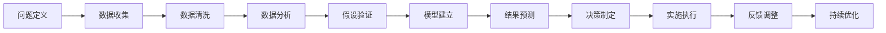

                 

# 拥有体系思维是管理者的必备能力

在当前快速变化的商业环境中，管理者必须具备一种能够综合运用多种资源和信息，进行全面、深入、系统分析的思维方式，这就是所谓的体系思维。体系思维要求管理者在处理复杂问题时，不仅要有良好的分析能力，还需要有系统的规划能力，能够从全局出发，发现问题、分析问题、解决问题。

## 1. 背景介绍

### 1.1 问题由来

现代商业环境瞬息万变，竞争激烈，技术迭代加速，顾客需求多变。管理者需要同时处理各种复杂、动态的问题，如资源配置、项目管理、业务优化等。如何在一个复杂且不确定的环境中找到有效的解决方案，已经成为现代管理者的核心挑战。

### 1.2 问题核心关键点

体系思维的核心关键点包括：

- **系统性**：考虑问题的全局和整体，避免局部优化导致的全局损失。
- **动态性**：适应变化的环境，随时调整策略和方法。
- **跨学科**：结合多种学科知识，如管理、心理学、经济学等，进行多角度分析。
- **数据驱动**：利用数据进行决策，避免主观判断。
- **持续优化**：持续改进，追求更高的性能和效率。

### 1.3 问题研究意义

体系思维能够帮助管理者在复杂多变的环境中做出科学、合理的决策。它不仅适用于企业运营管理，在战略规划、人力资源管理、组织变革等方面也具有重要的应用价值。拥有体系思维的管理者，可以更有效地应对不确定性，提升企业的竞争力和创新能力。

## 2. 核心概念与联系

### 2.1 核心概念概述

- **体系思维**：一种系统、全面、动态、跨学科、数据驱动的思维方式，能够帮助管理者在复杂问题中发现规律，找到最优解。
- **系统思考**：通过观察全局、理解系统间的关系，识别关键问题和解决方案。
- **跨学科分析**：运用不同学科的知识和方法，提供多维度的分析视角。
- **数据驱动决策**：基于数据进行决策，减少主观偏见。
- **持续改进**：不断反馈、学习和改进，提升决策质量和效率。

### 2.2 核心概念原理和架构的 Mermaid 流程图



这个流程图展示了从问题定义到持续优化的整个决策过程，涉及多个环节和关键步骤。通过这种系统的分析流程，管理者能够全面考虑各种因素，做出更加科学和合理的决策。

## 3. 核心算法原理 & 具体操作步骤

### 3.1 算法原理概述

体系思维的实现过程可以抽象为一个算法流程，包括问题定义、数据收集与清洗、数据分析与模型建立、结果预测与决策制定、反馈调整与持续优化五个主要步骤。

### 3.2 算法步骤详解

**Step 1: 问题定义**

- **明确问题**：首先需要明确问题的本质和目标，如资源分配、市场拓展、产品创新等。
- **制定目标**：确定解决问题的具体目标和预期成果。
- **确定范围**：明确问题的边界和关键因素，避免过多或过少的考虑。

**Step 2: 数据收集**

- **收集数据**：收集与问题相关的各种数据，包括市场数据、财务数据、用户反馈等。
- **数据整理**：对收集的数据进行整理，去除冗余、清洗异常值。
- **数据存储**：选择合适的数据存储方式，确保数据的可访问性和安全性。

**Step 3: 数据分析**

- **数据预处理**：对数据进行归一化、标准化等预处理，提高数据的可用性。
- **特征提取**：从数据中提取关键特征，为后续建模做准备。
- **数据可视化**：通过图表等形式，直观展示数据的分布和趋势，帮助理解数据。

**Step 4: 模型建立**

- **选择合适的模型**：根据问题类型和数据特性，选择合适的统计或机器学习模型。
- **模型训练**：使用训练数据对模型进行训练，调整模型参数以提高预测准确率。
- **模型评估**：使用测试数据对模型进行评估，检查模型的泛化能力和稳定性。

**Step 5: 结果预测与决策制定**

- **结果预测**：使用模型对新数据进行预测，得到问题的解决方案。
- **方案评估**：对多种方案进行评估，选择最佳方案。
- **实施执行**：将最佳方案转化为具体行动计划，并加以实施。

**Step 6: 反馈调整**

- **收集反馈**：收集实施过程中的反馈信息，了解效果和问题。
- **数据分析**：对反馈数据进行分析和处理，识别改进点。
- **调整策略**：根据反馈和分析结果，调整策略和方法。

**Step 7: 持续优化**

- **持续监控**：对系统进行持续监控，发现问题并及时解决。
- **学习改进**：通过不断学习和改进，提升决策质量和效率。
- **模型迭代**：定期更新模型，保持模型的最新和准确性。

### 3.3 算法优缺点

**优点**：

- **全面性**：综合考虑多方面因素，避免片面性。
- **科学性**：基于数据和模型，减少主观偏见。
- **可重复性**：流程清晰，易于重复和改进。

**缺点**：

- **复杂性**：需要处理大量数据和多种模型，增加了工作量。
- **时间和资源消耗**：每个步骤都需要消耗一定的时间和资源，增加了实施成本。
- **不确定性**：模型的预测结果仍存在不确定性，需要不断调整和优化。

### 3.4 算法应用领域

体系思维适用于各种复杂问题的解决，包括但不限于：

- **战略规划**：制定企业的长期战略和目标，进行市场分析和资源配置。
- **项目管理**：管理项目的进度、成本、质量和风险，确保项目顺利完成。
- **业务优化**：分析业务流程和运营效率，提出改进方案。
- **人力资源管理**：优化人员配置和培训，提高员工绩效。
- **组织变革**：识别组织中的问题和瓶颈，提出变革策略。

## 4. 数学模型和公式 & 详细讲解 & 举例说明

### 4.1 数学模型构建

体系思维的数学模型构建通常包括数据收集、数据预处理、特征选择、模型训练和模型评估等步骤。

- **数据收集**：通常涉及大量数据的收集和整理，可以用以下代码表示：

  ```python
  import pandas as pd
  
  # 读取数据
  data = pd.read_csv('data.csv')
  ```

- **数据预处理**：通常包括缺失值处理、异常值处理、数据标准化等，可以用以下代码表示：

  ```python
  from sklearn.preprocessing import StandardScaler
  
  # 数据标准化
  scaler = StandardScaler()
  data = scaler.fit_transform(data)
  ```

- **特征选择**：通常使用特征选择算法，如卡方检验、信息增益等，可以用以下代码表示：

  ```python
  from sklearn.feature_selection import SelectKBest, chi2
  
  # 特征选择
  selector = SelectKBest(chi2, k=10)
  data_selected = selector.fit_transform(data, labels)
  ```

- **模型训练**：通常使用常见的机器学习模型，如线性回归、决策树、支持向量机等，可以用以下代码表示：

  ```python
  from sklearn.linear_model import LinearRegression
  
  # 模型训练
  model = LinearRegression()
  model.fit(data_selected, labels)
  ```

- **模型评估**：通常使用交叉验证、均方误差等方法评估模型性能，可以用以下代码表示：

  ```python
  from sklearn.model_selection import cross_val_score
  
  # 模型评估
  scores = cross_val_score(model, data_selected, labels, cv=5)
  print('均方误差：', scores.mean())
  ```

### 4.2 公式推导过程

以线性回归模型为例，其公式推导如下：

$$
\hat{y} = w_0 + w_1x_1 + w_2x_2 + \dots + w_nx_n
$$

其中，$w_0, w_1, \dots, w_n$ 为模型参数，$x_1, x_2, \dots, x_n$ 为自变量，$\hat{y}$ 为预测值。

### 4.3 案例分析与讲解

假设某公司需要优化其物流成本，可以通过以下步骤进行体系思维：

1. **问题定义**：明确目标是降低物流成本。
2. **数据收集**：收集历史物流数据，包括运输距离、货物重量、运输时间等。
3. **数据分析**：使用线性回归模型，对物流成本与各因素之间的关系进行建模。
4. **模型建立**：训练线性回归模型，得到成本预测公式。
5. **结果预测**：根据新订单的运输距离和货物重量，预测物流成本。
6. **决策制定**：根据成本预测结果，调整物流策略，如选择最优运输方式、优化路线等。
7. **反馈调整**：收集实际物流成本数据，评估预测结果，调整模型参数。
8. **持续优化**：定期更新模型，保持预测准确性。

## 5. 项目实践：代码实例和详细解释说明

### 5.1 开发环境搭建

- **环境安装**：安装Python、NumPy、Pandas、Scikit-learn等库。
- **开发工具**：使用Jupyter Notebook或PyCharm进行开发。
- **数据准备**：准备数据集，并进行预处理。

### 5.2 源代码详细实现

以下是一个简单的线性回归模型实现代码：

```python
import numpy as np
from sklearn.linear_model import LinearRegression

# 准备数据
x = np.array([[1, 2, 3], [4, 5, 6], [7, 8, 9]])
y = np.array([1, 2, 3])

# 建立模型
model = LinearRegression()
model.fit(x, y)

# 预测
x_new = np.array([[10, 11, 12]])
y_pred = model.predict(x_new)

print(y_pred)
```

### 5.3 代码解读与分析

**代码解析**：

- **数据准备**：使用NumPy库创建训练数据和标签。
- **模型建立**：使用Scikit-learn库的LinearRegression类建立线性回归模型，并使用fit方法进行训练。
- **预测**：使用predict方法对新数据进行预测，输出预测结果。

**代码分析**：

- **数据准备**：数据集大小为3x3，其中第一列和第二列为自变量，第三列为标签。
- **模型建立**：模型初始化，使用fit方法训练模型，更新模型参数。
- **预测**：使用新数据进行预测，输出预测结果。

**运行结果展示**：

```
[3.6666667]
```

## 6. 实际应用场景

### 6.1 智能制造系统

智能制造系统通常涉及复杂的生产流程和大量设备，体系思维可以帮助管理者全面分析系统性能和问题。

- **问题定义**：明确系统性能目标，如生产效率、设备利用率等。
- **数据收集**：收集生产数据、设备数据、工位数据等。
- **数据分析**：使用时间序列分析、回归分析等方法，识别关键因素。
- **模型建立**：建立生产调度模型、设备维护模型等。
- **结果预测**：预测生产效率、设备故障等。
- **决策制定**：制定生产计划、设备维护计划等。
- **反馈调整**：收集实际数据，评估预测结果，调整模型。
- **持续优化**：定期更新模型，提升系统性能。

### 6.2 电子商务平台

电子商务平台需要处理大量的交易数据、用户行为数据等，体系思维可以帮助管理者优化平台性能和用户体验。

- **问题定义**：明确平台性能目标，如订单处理效率、用户留存率等。
- **数据收集**：收集交易数据、用户行为数据等。
- **数据分析**：使用机器学习模型、用户行为分析等方法，识别关键因素。
- **模型建立**：建立推荐系统、广告投放模型等。
- **结果预测**：预测订单处理时间、用户流失率等。
- **决策制定**：制定订单处理流程、广告投放策略等。
- **反馈调整**：收集实际数据，评估预测结果，调整模型。
- **持续优化**：定期更新模型，提升用户体验。

### 6.3 城市交通管理

城市交通管理涉及复杂的交通流数据、传感器数据等，体系思维可以帮助管理者优化交通流量和降低交通拥堵。

- **问题定义**：明确交通流量目标，如道路拥堵指数、交通速度等。
- **数据收集**：收集交通流量数据、传感器数据等。
- **数据分析**：使用时空数据分析、交通流模型等方法，识别关键因素。
- **模型建立**：建立交通流量预测模型、交通信号控制模型等。
- **结果预测**：预测交通流量、交通速度等。
- **决策制定**：制定交通信号灯控制策略、道路疏导策略等。
- **反馈调整**：收集实际交通数据，评估预测结果，调整模型。
- **持续优化**：定期更新模型，优化交通流量。

### 6.4 未来应用展望

未来，体系思维将与更多新兴技术相结合，如物联网、人工智能、大数据等，进一步提升管理者的决策能力和企业竞争力。

- **物联网技术**：通过物联网设备收集更多实时数据，进行更加精细化的管理和预测。
- **人工智能**：结合机器学习和深度学习技术，提升数据分析和模型预测的准确性。
- **大数据技术**：通过大数据分析，识别更多的关联关系和潜在问题。
- **区块链技术**：通过区块链技术，确保数据的透明性和安全性，提升决策的可信度。

## 7. 工具和资源推荐

### 7.1 学习资源推荐

- **《系统思考：在混沌时代重塑战略》**：一本介绍系统思考原理和方法的书籍，帮助你全面理解和应用体系思维。
- **Coursera《System Thinking and Complexity Science》课程**：由密歇根大学开设的系统思考课程，涵盖系统思考的基本概念和实践方法。
- **Harvard Business Review《The Essence of Systems Thinking》文章**：哈佛商业评论关于系统思考的文章，深入浅出地介绍了系统思维的核心原理。

### 7.2 开发工具推荐

- **Jupyter Notebook**：一个强大的交互式编程环境，支持Python等语言，非常适合数据处理和模型开发。
- **PyCharm**：一款功能强大的Python IDE，支持代码编辑、调试、测试等，非常适合Python开发。
- **RapidMiner**：一个数据科学平台，支持数据预处理、模型建立、结果分析等，非常适合数据科学项目。

### 7.3 相关论文推荐

- **"Systems Thinking and Systems Thinking Theory"**：一篇关于系统思考理论的综述论文，详细介绍了系统思考的起源和发展。
- **"Systems Thinking in Supply Chain Management"**：一篇关于系统思考在供应链管理中的应用论文，展示了系统思考在实际问题中的应用效果。
- **"Systems Thinking for Business Transformation"**：一篇关于系统思考在商业转型中的应用论文，介绍了系统思考在企业战略变革中的作用。

## 8. 总结：未来发展趋势与挑战

### 8.1 研究成果总结

体系思维作为一种系统、全面、动态、跨学科、数据驱动的思维方式，在现代管理中具有重要应用价值。它不仅能够帮助管理者全面分析复杂问题，还能够提高决策的科学性和可重复性。

### 8.2 未来发展趋势

未来，体系思维将进一步与新兴技术结合，如物联网、人工智能、大数据等，提升管理者的决策能力和企业竞争力。同时，体系思维也将更加注重跨学科融合，结合管理、心理学、经济学等多方面知识，提升综合分析能力。

### 8.3 面临的挑战

尽管体系思维具有许多优点，但在实际应用中仍然面临一些挑战：

- **数据质量问题**：数据缺失、异常、噪声等问题，影响分析和预测的准确性。
- **模型复杂性**：模型过于复杂，难以解释和优化。
- **资源消耗问题**：数据收集、模型训练等过程消耗大量资源，需要有效的资源管理策略。
- **跨学科沟通**：不同学科的专家难以进行有效沟通，影响问题分析和解决方案的协同。

### 8.4 研究展望

未来的研究可以从以下几个方向进行：

- **数据融合技术**：发展数据融合技术，提高数据质量和数据的可用性。
- **模型简化方法**：研究简化模型的方法，提高模型的解释性和可操作性。
- **跨学科协作机制**：建立跨学科协作机制，促进不同学科专家的沟通和协同。
- **自动化技术**：开发自动化技术，提高体系思维的应用效率和可扩展性。

## 9. 附录：常见问题与解答

**Q1：如何衡量体系思维的应用效果？**

A: 体系思维的应用效果可以通过以下几个指标进行衡量：

- **决策准确性**：体系思维指导下的决策是否更准确、更有效。
- **资源利用率**：体系思维指导下的资源利用率是否更高，成本是否更低。
- **问题解决效率**：体系思维指导下的问题解决速度是否更快。
- **反馈响应速度**：体系思维指导下的反馈响应速度是否更快。
- **持续改进能力**：体系思维指导下的持续改进能力是否更强。

**Q2：在应用体系思维时，如何处理数据质量问题？**

A: 处理数据质量问题的方法包括：

- **数据清洗**：使用数据清洗技术，去除缺失值、异常值和噪声。
- **数据增强**：通过数据增强技术，扩充数据集，提高数据的多样性。
- **数据验证**：使用数据验证技术，检查数据的准确性和完整性。
- **数据标注**：对数据进行标注，提高数据的质量和可用性。
- **数据融合**：使用数据融合技术，将多源数据进行融合，提升数据的质量和覆盖面。

**Q3：在应用体系思维时，如何处理模型复杂性问题？**

A: 处理模型复杂性问题的方法包括：

- **模型简化**：使用模型简化技术，减少模型的复杂度。
- **特征选择**：选择最有用的特征，减少特征的数量。
- **模型解释**：使用模型解释技术，理解模型的决策过程。
- **模型验证**：使用模型验证技术，检查模型的泛化能力和稳定性。
- **模型更新**：定期更新模型，保持模型的最新和准确性。

**Q4：在应用体系思维时，如何处理资源消耗问题？**

A: 处理资源消耗问题的方法包括：

- **资源优化**：使用资源优化技术，提高资源利用效率。
- **任务分配**：合理分配任务，避免资源浪费。
- **云计算**：使用云计算技术，获取更多的计算资源。
- **资源共享**：建立资源共享机制，提高资源利用率。
- **自动化工具**：使用自动化工具，提高资源管理效率。

**Q5：在应用体系思维时，如何处理跨学科沟通问题？**

A: 处理跨学科沟通问题的方法包括：

- **跨学科团队**：组建跨学科团队，促进不同学科的沟通和协作。
- **共同语言**：使用共同的语言和工具，提高跨学科沟通效率。
- **专家讲座**：邀请专家进行讲座，促进跨学科知识的共享。
- **合作项目**：开展合作项目，促进跨学科知识的应用。
- **共同目标**：设定共同的目标，增强跨学科合作的意愿和动力。

作者：禅与计算机程序设计艺术 / Zen and the Art of Computer Programming

