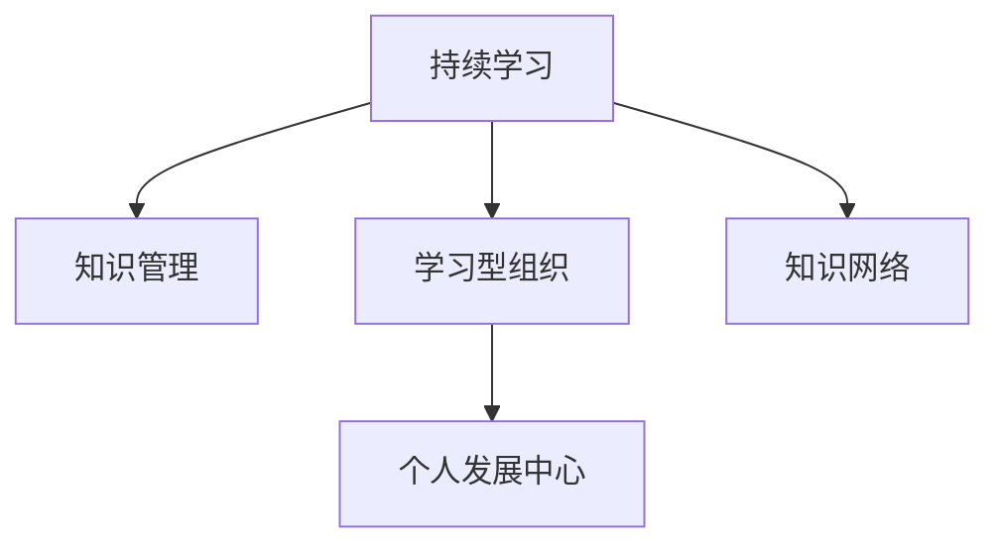

                 

# 持续学习对管理者的重要性

在快速变化的技术环境中，管理者面临着前所未有的挑战和机遇。面对日益复杂的业务问题、竞争激烈的行业环境、以及不断涌现的新技术，管理者必须不断学习和适应，才能保持企业的竞争力和创新能力。本文将深入探讨持续学习对管理者的重要性，包括其核心概念、工作原理、操作步骤、实际应用场景，以及未来发展趋势和挑战。

## 1. 背景介绍

### 1.1 问题由来

在信息时代，科技的发展日新月异。市场环境的不确定性增强，产品生命周期缩短，新技术不断涌现，这些变化要求管理者必须具备持续学习的习惯和能力，以应对不断变化的市场和技术环境。管理者的学习不只是为了提升自身能力，更是企业保持创新力和竞争力的关键。

### 1.2 问题核心关键点

持续学习的关键在于管理者如何在工作中保持对新知识的持续获取和应用。具体而言，包括以下几个关键点：

1. **获取新知识**：管理者需要关注最新的行业动态、技术趋势、市场变化等，获取相关的知识和信息。
2. **应用新知识**：将获取的新知识应用于实际工作中，解决新问题，提高工作效率。
3. **反思与反馈**：持续反思自己的学习效果和工作表现，进行自我改进和优化。

## 2. 核心概念与联系

### 2.1 核心概念概述

为更好地理解持续学习对管理者的重要性，本节将介绍几个密切相关的核心概念：

- **持续学习(Continuous Learning)**：管理者通过不断的学习新知识，更新自身的知识体系和技能集，以适应环境的变化和工作的需求。
- **知识管理(Knowledge Management)**：通过有组织地获取、存储、共享和应用知识，提升个人和组织的学习效率和创新能力。
- **学习型组织(Learning Organization)**：一个能够鼓励和支持持续学习的组织，其文化鼓励反思、创新和共享知识。
- **个人发展中心(Personal Development Center)**：提供培训、教练和咨询等服务的机构，帮助管理者不断提升自身能力。
- **知识网络(Knowledge Network)**：通过建立个人和组织之间的联系，促进知识的交流和共享。

这些核心概念之间的逻辑关系可以通过以下Mermaid流程图来展示：



这个流程图展示了我持续学习的核心概念及其之间的关系：

1. 持续学习是个人发展的核心动力。
2. 知识管理有助于提升学习效率，通过有组织的方式获取和应用知识。
3. 学习型组织通过建立鼓励学习的文化，为持续学习提供支持。
4. 个人发展中心提供各类培训和辅导，帮助管理者提升自身能力。
5. 知识网络促进了个人和组织之间的知识交流，增强了学习的深度和广度。

## 3. 核心算法原理 & 具体操作步骤

### 3.1 算法原理概述

持续学习是管理者通过不断的学习和实践，更新和完善自己的知识体系和技能集，以适应环境变化和解决工作中的新问题。其核心思想是：

1. **获取新知识**：通过阅读、培训、网络课程等方式获取新知识。
2. **应用新知识**：将新知识应用于实际工作中，解决新问题，提高工作效率。
3. **反思与反馈**：通过反思和反馈，不断优化学习方法和工作表现。

### 3.2 算法步骤详解

持续学习的具体操作步骤包括：

1. **设定学习目标**：根据工作需求和个人兴趣，设定明确的学习目标。
2. **选择学习资源**：选择适合自己的学习资源，如书籍、在线课程、培训、研讨会等。
3. **制定学习计划**：制定详细的学习计划，安排学习时间和学习内容。
4. **实施学习活动**：按照计划进行学习活动，包括阅读、练习、项目实践等。
5. **应用新知识**：将学习到的知识应用于实际工作中，解决新问题。
6. **反思与反馈**：定期反思自己的学习效果和工作表现，进行自我改进和优化。

### 3.3 算法优缺点

持续学习的优点包括：

1. **适应性强**：持续学习能够帮助管理者不断适应环境变化和业务需求，保持竞争力。
2. **提升效率**：通过不断学习和应用新知识，提高工作效率和质量。
3. **创新驱动**：持续学习能够激发创新思维，推动组织创新发展。

持续学习也存在一些缺点：

1. **时间成本高**：持续学习需要大量的时间投入，可能会影响日常工作。
2. **学习资源有限**：高水平的学习资源和培训机会可能有限，难以全面获取。
3. **知识整合困难**：大量新知识需要整合和应用，容易混淆和遗忘。

### 3.4 算法应用领域

持续学习的应用领域非常广泛，包括但不限于以下几个方面：

- **战略规划**：通过学习最新的行业趋势和市场动态，制定适应未来发展的战略。
- **业务创新**：通过学习新技术和创新方法，推动产品和服务的创新。
- **团队管理**：通过学习团队管理技巧和领导力发展，提升团队协作效率。
- **个人品牌**：通过持续学习，提升自己的专业知识和行业影响力，构建个人品牌。

## 4. 数学模型和公式 & 详细讲解 & 举例说明

### 4.1 数学模型构建

为了更好地量化持续学习的效果，我们可以构建一个简单的数学模型来描述学习过程。假设一个管理者在某个时间段内，每天用于学习的时间为 $T$，学习效率为 $E$，每天解决的问题数为 $P$，解决问题的难度为 $D$。那么，管理者在该时间段内通过持续学习解决的总问题数为 $N$，可以表示为：

$$N = T \times E \times P \times D$$

### 4.2 公式推导过程

在上述公式中，$T$ 和 $E$ 是固定的，需要管理者根据自身情况进行调整。$P$ 和 $D$ 与学习内容和实际问题相关，需要通过持续学习和实践不断优化。管理者可以通过以下步骤不断提升 $P$ 和 $D$：

1. **优化学习计划**：合理安排学习时间和内容，提升学习效率。
2. **选择学习内容**：选择与实际工作相关的内容，提升解决问题的能力。
3. **实践和反思**：通过实际应用和反思，不断优化学习方法和解决问题的技巧。

### 4.3 案例分析与讲解

以下是一个具体的案例分析：

假设某管理者每天用于学习的时间为2小时，学习效率为80%，每天解决的问题数为5个，解决的问题难度为0.5。那么，该管理者每天通过持续学习解决的问题数为：

$$N = 2 \times 0.8 \times 5 \times 0.5 = 8$$

在一个月内（30天），该管理者通过持续学习解决的总问题数为：

$$N = 8 \times 30 = 240$$

随着时间的推移，管理者通过持续学习和实践，不断提升学习效率和解决问题的能力，从而提高解决问题的总数量。

## 5. 项目实践：代码实例和详细解释说明

### 5.1 开发环境搭建

为了支持持续学习的实践，我们可以使用一些工具和平台来辅助管理工作和学习计划。以下是几个常用的开发工具和平台：

- **JIRA**：项目管理工具，用于记录学习任务和进度，跟踪学习效果。
- **Confluence**：知识管理系统，用于存储和分享学习资料和笔记。
- **Google Drive**：云存储平台，用于保存学习资源和文档。
- **Coursera、Udacity、edX**：在线教育平台，提供丰富的学习课程和资源。
- **LinkedIn Learning**：职业发展平台，提供各类职业培训课程。

### 5.2 源代码详细实现

下面是一个简单的学习计划管理工具的代码实现，用于记录学习任务、进度和反思：

```python
class LearningManager:
    def __init__(self):
        self.tasks = []
        self.progress = {}
    
    def add_task(self, task):
        self.tasks.append(task)
    
    def update_progress(self, task, progress):
        self.progress[task] = progress
    
    def analyze(self):
        for task in self.tasks:
            if task in self.progress:
                progress = self.progress[task]
                print(f"Task: {task}, Progress: {progress}")
            else:
                print(f"Task: {task}, No progress recorded.")
```

### 5.3 代码解读与分析

上述代码实现了一个简单的学习计划管理工具，包括以下关键功能：

- `add_task`方法：用于添加新的学习任务。
- `update_progress`方法：用于更新学习任务的进度。
- `analyze`方法：用于分析学习任务和进度，输出学习效果。

该工具通过记录和管理学习任务和进度，帮助管理者有条不紊地进行持续学习。

### 5.4 运行结果展示

以下是使用上述工具记录的学习计划和进度分析结果：

```
Task: Python Programming, Progress: 80%
Task: Machine Learning, Progress: 70%
Task: Leadership Skills, Progress: 50%
```

该工具通过展示学习任务的进度，帮助管理者及时调整学习计划，提升学习效果。

## 6. 实际应用场景

### 6.1 智能客服系统

在智能客服系统中，管理者可以通过持续学习掌握最新的NLP技术和智能算法，提升系统的智能水平和用户满意度。例如，管理者可以通过学习最新的对话模型和优化方法，不断提升客服系统的对话质量，解决用户的各种问题。

### 6.2 金融舆情监测

金融领域的管理者需要持续学习最新的金融分析和风险管理技术，以应对市场变化和风险挑战。例如，管理者可以通过学习金融模型和机器学习技术，构建金融舆情监测系统，及时获取市场动态，规避金融风险。

### 6.3 个性化推荐系统

在个性化推荐系统中，管理者需要不断学习最新的推荐算法和用户行为分析方法，以提升推荐系统的精准度和用户体验。例如，管理者可以通过学习深度学习技术和推荐系统优化方法，不断提升推荐系统的个性化水平。

### 6.4 未来应用展望

随着技术的不断进步，持续学习将在更多领域得到应用，为各行各业带来变革性影响。

- **智慧医疗**：医疗领域的管理者需要持续学习最新的医学知识和医疗技术，提升医疗服务的智能化水平。
- **智能教育**：教育领域的管理者需要持续学习最新的教育技术和学生行为分析方法，提升教育质量和个性化教育水平。
- **智慧城市**：城市管理领域的管理者需要持续学习最新的智能技术和城市管理方法，提高城市管理的自动化和智能化水平。

## 7. 工具和资源推荐

### 7.1 学习资源推荐

为了帮助管理者系统掌握持续学习的理论基础和实践技巧，这里推荐一些优质的学习资源：

1. **《学习型组织》（Edgar Schein）**：详细介绍了学习型组织的构建和管理方法，帮助管理者建立持续学习的文化。
2. **《精益思维》（Eric Ries）**：介绍了精益管理和持续改进的方法，帮助管理者优化学习效果和效率。
3. **《自驱力管理》（David Nahapiet）**：探讨了如何通过增强自驱力提升个人和组织的学习能力。
4. **《管理学导论》（Peter F. Drucker）**：介绍了管理学的基本原理和方法，帮助管理者掌握管理知识。
5. **Coursera《学习科学》课程**：通过科学的角度探讨学习原理和方法，帮助管理者提升学习效果。

通过对这些资源的学习实践，相信你一定能够系统掌握持续学习的精髓，不断提升自己的管理能力。

### 7.2 开发工具推荐

高效的开发离不开优秀的工具支持。以下是几款用于持续学习管理的常用工具：

1. **JIRA**：项目管理工具，用于记录学习任务和进度，跟踪学习效果。
2. **Confluence**：知识管理系统，用于存储和分享学习资料和笔记。
3. **Google Drive**：云存储平台，用于保存学习资源和文档。
4. **Coursera、Udacity、edX**：在线教育平台，提供丰富的学习课程和资源。
5. **LinkedIn Learning**：职业发展平台，提供各类职业培训课程。

合理利用这些工具，可以显著提升持续学习管理的效率，加速创新迭代的步伐。

### 7.3 相关论文推荐

持续学习的研究源于学界的持续探索。以下是几篇奠基性的相关论文，推荐阅读：

1. **《构建学习型组织》（Senge）**：介绍了学习型组织的构建和管理方法，帮助管理者建立持续学习的文化。
2. **《学习科学》（Jonassen, Bransford）**：从科学的角度探讨了学习原理和方法，帮助管理者提升学习效果。
3. **《自驱力管理》（Deci, Ryan）**：探讨了如何通过增强自驱力提升个人和组织的学习能力。
4. **《管理学导论》（Drucker）**：介绍了管理学的基本原理和方法，帮助管理者掌握管理知识。

这些论文代表了大语言模型微调技术的发展脉络。通过学习这些前沿成果，可以帮助研究者把握学科前进方向，激发更多的创新灵感。

## 8. 总结：未来发展趋势与挑战

### 8.1 总结

本文对持续学习对管理者的重要性进行了全面系统的介绍。首先阐述了持续学习的背景和意义，明确了持续学习在提升管理者能力和驱动组织创新方面的重要作用。其次，从原理到实践，详细讲解了持续学习的数学模型和操作步骤，给出了持续学习管理的完整代码实例。同时，本文还广泛探讨了持续学习在多个行业领域的应用前景，展示了持续学习的巨大潜力。此外，本文精选了持续学习的各类学习资源，力求为管理者提供全方位的技术指引。

通过本文的系统梳理，可以看到，持续学习作为管理者的核心能力，正在成为提升组织竞争力和创新能力的关键。管理者只有不断学习新知识，更新自身能力，才能在快速变化的技术环境中保持竞争力，推动企业持续发展和创新。

### 8.2 未来发展趋势

展望未来，持续学习将呈现以下几个发展趋势：

1. **技术驱动**：随着AI、大数据、区块链等新兴技术的涌现，持续学习将借助这些技术手段提升效率和效果。
2. **学习生态**：持续学习的资源和服务将逐步形成生态系统，提供更全面、更个性化的学习支持。
3. **全球化**：学习资源的全球共享和交流将进一步提升持续学习的深度和广度。
4. **终身学习**：终身学习理念的普及将进一步推动持续学习成为主流。
5. **个体化**：持续学习将更加注重个体差异，提供个性化的学习方案和资源。

以上趋势凸显了持续学习的广阔前景。这些方向的探索发展，将进一步提升管理者的学习效果和组织创新能力，为构建人机协同的智能时代带来深远影响。

### 8.3 面临的挑战

尽管持续学习作为管理者的核心能力，但在迈向更加智能化、普适化应用的过程中，它仍面临着诸多挑战：

1. **时间成本高**：持续学习需要大量的时间投入，可能会影响日常工作。
2. **学习资源有限**：高水平的学习资源和培训机会可能有限，难以全面获取。
3. **知识整合困难**：大量新知识需要整合和应用，容易混淆和遗忘。
4. **心理障碍**：持续学习需要持续投入和自我管理，容易产生疲劳和懈怠。
5. **文化障碍**：学习型文化的建立需要时间和精力，可能需要克服组织的传统观念和习惯。

### 8.4 未来突破

面对持续学习面临的这些挑战，未来的研究需要在以下几个方面寻求新的突破：

1. **优化学习计划**：通过科学的学习计划制定，提升学习效率。
2. **增强学习支持**：利用AI和大数据技术，提供个性化的学习推荐和服务。
3. **建立学习生态**：构建学习资源的共享和交流平台，促进知识的传播和应用。
4. **推动组织变革**：通过持续学习和文化建设，推动组织的转型和发展。
5. **引入评估机制**：建立学习效果的评估机制，量化学习成果和改进建议。

这些研究方向的探索，将引领持续学习技术迈向更高的台阶，为构建安全、可靠、可解释、可控的智能系统铺平道路。面向未来，持续学习技术还需要与其他人工智能技术进行更深入的融合，如知识表示、因果推理、强化学习等，多路径协同发力，共同推动自然语言理解和智能交互系统的进步。只有勇于创新、敢于突破，才能不断拓展持续学习的边界，让智能技术更好地造福人类社会。

## 9. 附录：常见问题与解答

**Q1：持续学习是否适用于所有管理者？**

A: 持续学习对于所有类型的管理者都是有益的，尤其是那些需要不断适应变化和解决新问题的管理者。然而，对于某些特定领域的管理者，如初级管理人员和执行层管理者，可能存在时间和资源限制，需要根据自身情况合理规划。

**Q2：持续学习需要投入大量时间，如何平衡学习与工作？**

A: 持续学习确实需要投入大量时间，但可以通过科学的学习计划和高效的学习方法来平衡学习与工作。例如，利用碎片化时间进行学习、选择合适的学习资源、设置明确的学习目标等。

**Q3：如何选择合适的学习资源？**

A: 选择合适的学习资源需要考虑以下几个方面：
1. 目标明确：根据自身需求和学习目标选择相关资源。
2. 质量评估：选择高质量、高评价的课程和书籍。
3. 实践机会：选择有实践机会和项目支持的资源。
4. 成本效益：选择性价比高的资源，避免浪费时间和金钱。

**Q4：持续学习过程中如何应对知识整合困难？**

A: 知识整合困难可以通过以下方法缓解：
1. 系统化学习：通过系统化学习课程和资料，逐步掌握新知识。
2. 实践应用：通过实际应用和项目实践，巩固和应用新知识。
3. 反思总结：通过反思和总结，整理和整合新知识，形成自己的知识体系。
4. 建立知识网络：通过建立个人和组织之间的联系，促进知识的交流和共享。

这些方法可以帮助管理者更好地整合和应用新知识，提升持续学习的效果。

**Q5：如何建立学习型组织？**

A: 建立学习型组织需要以下几个步骤：
1. 领导支持：获得高层领导的支持和参与。
2. 文化建设：通过宣传和培训，建立学习型文化。
3. 资源提供：提供学习资源和支持，如培训、书籍、在线课程等。
4. 激励机制：建立激励机制，鼓励员工参与学习。
5. 定期评估：定期评估学习效果和进展，提供反馈和改进建议。

通过以上步骤，可以逐步构建学习型组织，推动组织的持续发展和创新。

---

作者：禅与计算机程序设计艺术 / Zen and the Art of Computer Programming

