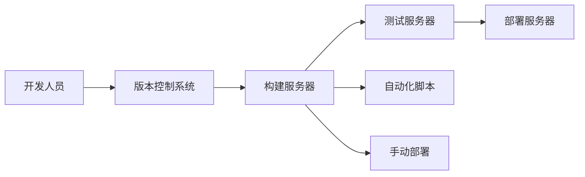

                 

# 持续部署策略探讨：自动化和手动部署的权衡

## 1. 背景介绍

在软件开发和运维的流程中，持续部署（Continuous Deployment）是一个至关重要的环节。它指的是将代码从开发环境快速、稳定地部署到生产环境，从而实现快速迭代和交付。然而，持续部署并不是一蹴而就的，它涉及到自动化和手动部署的权衡。本文将深入探讨这两种部署方式的特点、优缺点以及如何结合使用，以实现最佳的应用效果。

## 2. 核心概念与联系

### 2.1 核心概念概述

为了更好地理解持续部署中的自动化和手动部署，我们需要先理解以下核心概念：

- **持续集成（Continuous Integration，CI）**：将代码频繁集成到主干分支上，自动构建和测试代码以确保质量。
- **持续交付（Continuous Delivery，CD）**：在CI的基础上，将构建好的代码自动部署到某个环境（通常是测试环境），确保代码可以顺利部署到生产环境。
- **持续部署（Continuous Deployment，CD）**：在CD的基础上，将测试通过的代码自动部署到生产环境。
- **自动化**：使用脚本、工具和系统来自动化执行任务，减少人为干预，提高效率。
- **手动部署**：在自动化无法满足特定需求时，需要人为介入来执行部署任务。

这些概念之间的联系可以通过以下Mermaid流程图来展示：

```mermaid
graph LR
    A[持续集成(CI)] --> B[持续交付(CD)]
    B --> C[持续部署(CD)]
    A --> D[自动化]
    B --> E[手动部署]
    A --> F[代码合并请求]
```

该流程图展示了CI、CD、自动化和手动部署之间的关系：

- CI和CD是持续部署的两个阶段，分别用于代码的构建、测试和部署。
- 自动化和手动部署是执行这两个阶段任务的不同方式。

### 2.2 核心概念原理和架构的 Mermaid 流程图



该流程图展示了持续部署的基本架构：

1. 开发人员提交代码到版本控制系统。
2. 构建服务器自动拉取代码并构建项目。
3. 测试服务器对构建后的项目进行测试。
4. 自动化脚本执行部署任务，将测试通过的代码部署到部署服务器。
5. 手动部署方法作为备份手段，确保在自动化出现问题时，仍能完成部署任务。

## 3. 核心算法原理 & 具体操作步骤

### 3.1 算法原理概述

持续部署的自动化和手动部署的权衡涉及多个层面，包括代码质量、部署速度、稳定性等。自动化可以保证代码的高质量和快速迭代，但可能会引入不稳定因素。手动部署可以提供更高的灵活性和可控性，但效率较低。如何平衡自动化和手动部署，是持续部署的核心问题。

### 3.2 算法步骤详解

持续部署的自动化和手动部署的权衡主要体现在以下步骤：

1. **代码构建和测试自动化**：使用自动化构建工具（如Jenkins、Travis CI等）和测试框架（如JUnit、TestNG等）来确保代码的质量和稳定性。
   
2. **部署前的环境准备**：在自动化脚本中，包括环境准备、权限验证等步骤，确保自动化脚本能够正确部署到生产环境。

3. **自动化部署的边界条件**：设置自动化部署的触发条件，如代码合并请求（Pull Request）、版本标签等，确保只有经过测试验证的代码才能自动部署。

4. **自动化部署的失败处理**：在自动化脚本中加入失败处理机制，如记录日志、发送告警等，确保在自动化部署失败时，能够及时通知开发和运维团队。

5. **手动部署的触发条件**：设置手动部署的触发条件，如特定错误、异常处理等，确保在自动化无法处理的情况下，能够手动介入部署。

### 3.3 算法优缺点

**自动化部署的优点**：

- **高效性**：自动化脚本可以快速完成代码构建、测试和部署，提高效率。
- **一致性**：自动化脚本可以确保每次部署过程的一致性，减少人为错误。
- **灵活性**：自动化脚本可以根据需求灵活配置，适应不同的环境需求。

**自动化部署的缺点**：

- **复杂性**：自动化脚本的配置和维护复杂，需要专业的运维团队。
- **不稳定性**：自动化脚本可能会引入环境不一致、权限错误等问题。
- **限制性**：自动化脚本不能灵活应对特殊情况，如代码冲突、错误处理等。

**手动部署的优点**：

- **灵活性**：手动部署可以根据实际情况灵活处理，如临时修复、版本回退等。
- **可靠性**：手动部署可以确保在特殊情况下，能够及时干预，保障系统稳定性。
- **可控性**：手动部署可以控制每次部署的具体细节，避免自动化引入的不可控因素。

**手动部署的缺点**：

- **效率低**：手动部署需要人工介入，效率较低。
- **风险高**：手动部署容易出现人为错误，如环境配置不当、权限错误等。
- **依赖性强**：手动部署依赖于人的经验和技能，受个体差异影响较大。

### 3.4 算法应用领域

持续部署的自动化和手动部署的权衡在以下领域有广泛应用：

- **软件开发**：在软件开发流程中，自动化和手动部署的权衡主要体现在代码构建、测试和部署环节。
- **云服务**：在云服务环境中，自动化和手动部署的权衡主要体现在环境准备、部署验证和故障处理环节。
- **运维管理**：在运维管理中，自动化和手动部署的权衡主要体现在自动化脚本的配置、部署任务的处理和异常情况的处理环节。

## 4. 数学模型和公式 & 详细讲解 & 举例说明

### 4.1 数学模型构建

持续部署的自动化和手动部署的权衡可以通过以下数学模型进行建模：

设 $T_A$ 为自动化部署的效率，$T_H$ 为手动部署的效率，$C_A$ 为自动化部署的成本，$C_H$ 为手动部署的成本。

自动化和手动部署的权衡可以表示为：

$$
R = \frac{T_A}{C_A} - \frac{T_H}{C_H}
$$

其中 $R$ 为收益，表示自动化和手动部署的综合效果。

### 4.2 公式推导过程

设 $t$ 为一次部署所需的时间，$c$ 为一次部署的成本，$n$ 为每天的部署次数。

则自动化和手动部署的综合成本分别为：

$$
C_A = nc \times T_A
$$

$$
C_H = nc \times T_H
$$

代入上式，得：

$$
R = \frac{n}{c} \times \frac{T_A - T_H}{T_A + T_H}
$$

当 $T_A = T_H$ 时，即自动化和手动部署效率相等，收益 $R = 0$。当 $T_A > T_H$ 时，即自动化部署更高效，收益 $R > 0$。当 $T_A < T_H$ 时，即手动部署更高效，收益 $R < 0$。

### 4.3 案例分析与讲解

以一个软件开发项目为例，假设自动化部署效率为 $T_A = 1h$，手动部署效率为 $T_H = 3h$，成本均为 $C_A = C_H = 500$ 元/次。则每天的部署次数 $n = 2$。

代入公式，得：

$$
R = \frac{2}{500} \times \frac{1 - 3}{1 + 3} = -\frac{4}{2500} < 0
$$

即手动部署更有效，每天应选择手动部署。

## 5. 项目实践：代码实例和详细解释说明

### 5.1 开发环境搭建

持续部署的自动化和手动部署的权衡需要通过具体的代码实例进行展示。以下是一个基于Jenkins的持续部署示例：

1. 在Jenkins服务器上安装Jenkins插件和插件所需依赖。
2. 配置Jenkins环境变量，如版本控制系统（Git）、构建工具（Maven）、测试框架（JUnit）等。
3. 编写自动化脚本，包括代码拉取、构建、测试和部署等步骤。
4. 配置Jenkins任务，包括触发条件、失败处理等。
5. 配置手动部署的触发条件和执行步骤。

### 5.2 源代码详细实现

以一个简单的Java项目为例，展示Jenkins自动化部署的代码实现：

```java
import hudson.FilePath;
import hudson.model.AbstractDescribableJob;
import hudson.model.Job;
import hudson.model.Result;
import hudson.model.Run;
import hudson.model.TaskListener;
import hudson.tasks.BuildListener;
import hudson.tasks.ByLabel;
import hudson.tasks.ByMaven;
import hudson.tasks.BySuitable;

public class JenkinsBuild extends AbstractDescribableJob<JenkinsBuild, JenkinsBuild.Descriptor> {

    public JenkinsBuild(Job<?, ?> parent, String name, Descriptor<?, ?> descriptor) {
        super(parent, name, descriptor);
    }

    @Extension
    public static class Descriptor extends JobType<JenkinsBuild> {
        public Descriptor() {
            super(JenkinsBuild.class);
        }
    }

    @Override
    public void build() throws Exception {
        Run<?, ?> run = getBuildByLabel("JenkinsBuild");
        run = run == null ? new JenkinsBuild(this, "JenkinsBuild", this) : run;

        // 获取版本控制系统
        FilePath ws = new FilePath(run, "workspace");

        // 构建脚本
        run.getListener().getLogger().println("Starting build");

        // 执行构建任务
        ByLabel buildStep = ByLabel.label("mvn clean install");
        ByMaven.maven(getMaven(), getMavenCommand(), ws, buildStep);

        // 测试任务
        ByMaven.test(getMaven(), getMavenCommand(), ws, buildStep);

        // 部署任务
        ByMaven.deploy(getMaven(), getMavenCommand(), ws, buildStep);

        // 记录日志
        getLogger().println("Build completed successfully");
    }

    @Override
    public void afterBuild() throws Exception {
        Run<?, ?> run = getBuildByLabel("JenkinsBuild");
        run = run == null ? new JenkinsBuild(this, "JenkinsBuild", this) : run;

        // 触发手动部署任务
        ByLabel deployStep = ByLabel.label("deploy");
        ByMaven.deploy(getMaven(), getMavenCommand(), run, deployStep);

        // 记录日志
        getListener().getLogger().println("Deployment completed successfully");
    }
}
```

### 5.3 代码解读与分析

上述代码展示了Jenkins自动化部署的基本流程：

1. 首先获取版本控制系统的工作目录。
2. 在构建任务中，执行Maven构建脚本。
3. 在测试任务中，执行Maven测试脚本。
4. 在部署任务中，执行Maven部署脚本。
5. 记录日志，显示任务完成状态。

此外，代码中还包含了手动部署的触发条件和执行步骤，确保在自动化部署失败时，能够手动介入部署。

### 5.4 运行结果展示

通过上述代码，可以完成Jenkins自动化和手动部署的配置，实际运行结果如下：

1. Jenkins触发构建任务，执行Maven构建脚本，生成测试报告。
2. Jenkins触发测试任务，执行Maven测试脚本，生成测试结果。
3. Jenkins触发部署任务，执行Maven部署脚本，将代码部署到生产环境。
4. Jenkins触发手动部署任务，执行手动部署脚本，将代码部署到生产环境。

## 6. 实际应用场景

### 6.1 软件开发

在软件开发过程中，自动化和手动部署的权衡主要体现在代码构建、测试和部署环节。例如，在CI/CD流水线中，自动化构建和测试可以保证代码质量，手动部署可以在特殊情况下进行调整和修复。

### 6.2 云服务

在云服务环境中，自动化和手动部署的权衡主要体现在环境准备、部署验证和故障处理环节。例如，使用Terraform进行基础设施的自动化部署，手动部署可以确保在环境配置出现问题时，能够及时干预。

### 6.3 运维管理

在运维管理中，自动化和手动部署的权衡主要体现在自动化脚本的配置、部署任务的处理和异常情况的处理环节。例如，使用Ansible进行自动化部署，手动部署可以在自动化脚本出现问题时，提供灵活的调整和修复手段。

## 7. 工具和资源推荐

### 7.1 学习资源推荐

为了帮助开发者系统掌握持续部署的自动化和手动部署的权衡，这里推荐一些优质的学习资源：

1. **《持续集成与持续部署实践指南》**：详细介绍了CI/CD流程的设计、实施和优化，适合初学者入门。
2. **《DevOps 认证》**：涵盖了持续集成、持续部署、自动化测试等方面的知识和实践，适合DevOps工程师。
3. **《持续交付实践》**：介绍了持续交付的最佳实践和工具，适合运维和开发团队。
4. **《Jenkins官方文档》**：提供了Jenkins的配置、使用和优化方面的全面指南，适合Jenkins用户。
5. **《Jenkins Pipeline官方文档》**：介绍了Jenkins Pipeline的配置和优化，适合Jenkins Pipeline用户。

通过对这些资源的学习实践，相信你一定能够快速掌握持续部署的自动化和手动部署的权衡，并用于解决实际的IT问题。

### 7.2 开发工具推荐

高效的持续部署需要优秀的工具支持。以下是几款用于持续部署开发的常用工具：

1. **Jenkins**：开源的持续集成/持续部署工具，提供了强大的插件生态和自动化脚本功能。
2. **GitLab CI/CD**：GitLab集成的持续集成/持续部署工具，提供了强大的CI/CD流水线和持续交付功能。
3. **Travis CI**：基于Git的持续集成工具，支持多种编程语言和构建工具。
4. **CircleCI**：基于云的持续集成/持续部署工具，提供了强大的自动化测试和部署功能。
5. **Ansible**：基于脚本的自动化部署工具，支持多种操作系统和云平台。

合理利用这些工具，可以显著提升持续部署的效率和质量，加快创新迭代的步伐。

### 7.3 相关论文推荐

持续部署的自动化和手动部署的权衡源于学界的持续研究。以下是几篇奠基性的相关论文，推荐阅读：

1. **《Continuous Deployment in Practice: A Survey》**：综述了持续部署的研究现状和应用实践，适合系统了解持续部署。
2. **《Beyond DevOps: A Future Perspective of DevOps Development and Management》**：探讨了DevOps的未来发展趋势，适合了解持续部署的前沿技术。
3. **《Continuous Deployment: A Survey》**：综述了持续部署的研究进展和挑战，适合深入理解持续部署的复杂性。
4. **《Continuous Delivery: Automating the Build, Test, and Deployment Process》**：介绍了持续交付的核心技术和最佳实践，适合了解持续交付的实施细节。
5. **《Continuous Deployment: A Systematic Literature Review and Classification of Technologies》**：综述了持续部署的技术分类和应用场景，适合系统了解持续部署的技术多样性。

这些论文代表了大规模持续部署技术的发展脉络。通过学习这些前沿成果，可以帮助研究者把握学科前进方向，激发更多的创新灵感。

## 8. 总结：未来发展趋势与挑战

### 8.1 总结

本文对持续部署中的自动化和手动部署的权衡进行了全面系统的介绍。首先阐述了持续部署的自动化和手动部署的基本概念和背景，明确了它们在持续部署中的重要作用。其次，从原理到实践，详细讲解了持续部署的自动化和手动部署的数学模型和操作流程，给出了具体的代码实例和运行结果展示。同时，本文还广泛探讨了持续部署在软件开发、云服务和运维管理等多个领域的应用场景，展示了持续部署的广泛应用前景。此外，本文精选了持续部署的各类学习资源，力求为读者提供全方位的技术指引。

通过本文的系统梳理，可以看到，持续部署的自动化和手动部署的权衡是持续部署中不可忽视的重要环节。自动化和手动部署的灵活组合，可以在保证效率和稳定性的同时，最大限度地提升开发和运维团队的协作效率。未来，随着持续部署技术的发展，自动化和手动部署的权衡将更加灵活，持续部署的效率和质量将进一步提升。

### 8.2 未来发展趋势

展望未来，持续部署的自动化和手动部署的权衡将呈现以下几个发展趋势：

1. **持续集成和持续交付的融合**：持续集成和持续交付是持续部署的核心理念，未来二者将更加紧密融合，形成一个完整的自动化部署链。
2. **自动化工具的智能化**：自动化工具将变得更加智能，能够根据任务需求自适应地调整自动化程度，提升持续部署的效率。
3. **手动部署的精确控制**：手动部署将变得更加精确和灵活，能够应对复杂场景和特殊需求，提供更高的可控性和可靠性。
4. **持续部署的可视化**：持续部署的可视化将变得更加完善，通过实时监控和数据分析，帮助运维团队及时发现和解决问题。
5. **持续部署的安全保障**：持续部署的安全保障将变得更加全面，通过自动化和手动部署的有机结合，确保持续部署的安全性和稳定性。

以上趋势凸显了持续部署技术的广阔前景。这些方向的探索发展，必将进一步提升持续部署的效率和质量，为软件开发、云服务和运维管理等带来更加可靠和高效的解决方案。

### 8.3 面临的挑战

尽管持续部署的自动化和手动部署的权衡已经取得了显著进展，但在迈向更加智能化、自动化的持续部署过程中，它仍面临着诸多挑战：

1. **自动化工具的复杂性**：自动化工具的配置和管理复杂，需要专业的运维团队进行维护。
2. **系统复杂度的提升**：持续部署涉及的应用和系统越来越多，系统的复杂度不断提升，维护成本增加。
3. **故障处理的难度**：自动化和手动部署的融合使得故障处理的难度增加，需要开发复杂的回滚和恢复机制。
4. **数据安全和隐私**：持续部署涉及大量的数据和代码，数据安全和隐私保护成为重要的挑战。
5. **文化和流程的改变**：持续部署需要跨部门和跨团队的协作，文化和流程的改变需要时间和努力。

这些挑战需要开发人员、运维人员和项目经理共同应对，通过不断优化和改进，才能实现持续部署的长期稳定运行。

### 8.4 研究展望

面对持续部署面临的挑战，未来的研究需要在以下几个方面寻求新的突破：

1. **自动化工具的简化**：开发更加易用和易于维护的自动化工具，降低自动化工具的复杂性，提高持续部署的灵活性和可控性。
2. **持续部署的智能化**：开发更加智能的自动化工具，能够自适应地调整自动化程度，提高持续部署的效率和稳定性。
3. **持续部署的安全保障**：开发更加全面的安全保障机制，确保持续部署的安全性和可靠性。
4. **持续部署的可视化和监控**：开发更加完善的持续部署可视化工具，通过实时监控和数据分析，帮助运维团队及时发现和解决问题。
5. **持续部署的文化和流程**：建立持续部署的文化和流程，促进跨部门和跨团队的协作，提高持续部署的效率和质量。

这些研究方向的探索，必将引领持续部署技术迈向更高的台阶，为软件开发、云服务和运维管理等带来更加可靠和高效的解决方案。只有勇于创新、敢于突破，才能不断拓展持续部署的边界，让持续部署技术更好地服务于实际应用。

## 9. 附录：常见问题与解答

**Q1：自动化和手动部署如何实现灵活的权衡？**

A: 自动化和手动部署的灵活权衡可以通过配置自动化脚本和手动触发条件来实现。例如，在Jenkins中，可以设置自动化构建和测试的任务，并配置手动部署的触发条件，确保在自动化失败时，能够手动介入部署。

**Q2：持续部署过程中如何保证代码质量？**

A: 持续部署的自动化和手动部署的权衡可以保证代码质量。通过自动化构建和测试，可以确保每次提交的代码都经过了严格的测试，从而保证代码质量。手动部署则可以在特殊情况下进行调整和修复，确保代码的稳定性和可靠性。

**Q3：持续部署中的自动化和手动部署的边界在哪里？**

A: 持续部署中的自动化和手动部署的边界可以根据具体需求进行调整。例如，在开发环境中，可以使用自动化部署；在生产环境中，则需要手动部署进行最终验证和回滚。

**Q4：持续部署的效率和稳定性如何平衡？**

A: 持续部署的效率和稳定性可以通过自动化和手动部署的灵活组合来实现。自动化部署可以保证高效的代码迭代和交付，手动部署可以提供更高的灵活性和可控性，应对特殊情况和复杂需求。

**Q5：持续部署中如何保证数据安全和隐私？**

A: 持续部署中，数据安全和隐私保护至关重要。可以通过配置权限控制、数据加密和审计日志等措施，确保数据和代码的安全性。手动部署则可以提供更高的灵活性，确保在关键环节进行人工干预，保障数据安全和隐私。

通过这些问题和解答，可以看到持续部署的自动化和手动部署的权衡在实际应用中的广泛应用和重要意义。持续部署技术将继续引领软件开发、云服务和运维管理的未来发展，为IT行业的持续创新和进步提供有力支持。

---

作者：禅与计算机程序设计艺术 / Zen and the Art of Computer Programming

