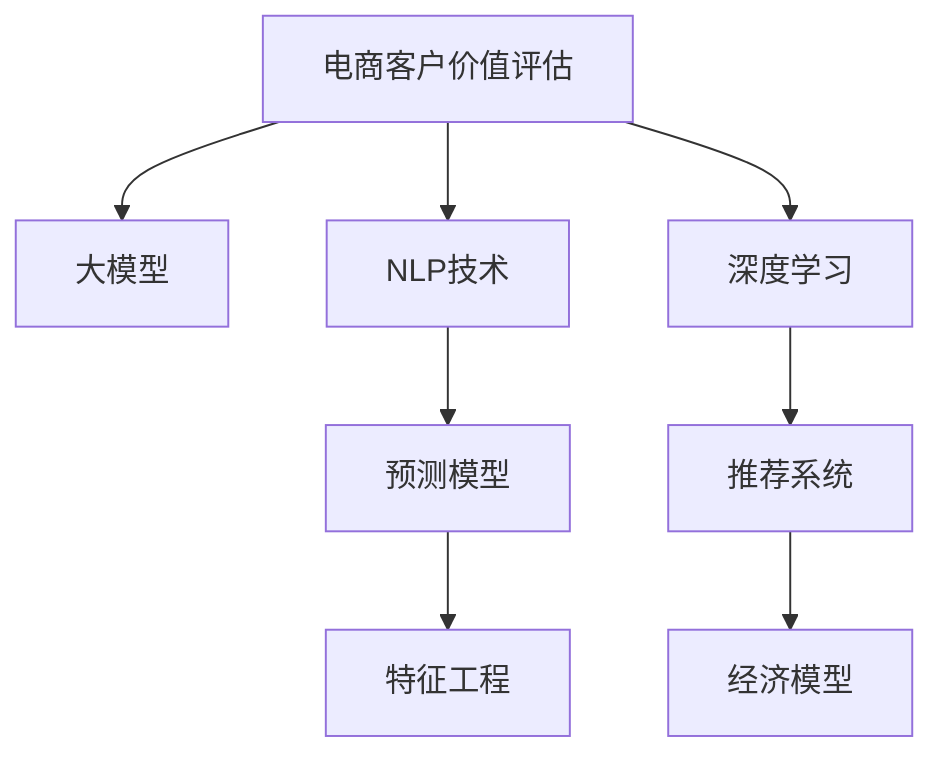

                 

# 探索基于大模型的电商智能客户价值评估系统

> 关键词：大模型,电商客户价值评估,自然语言处理(NLP),预测模型,深度学习,特征工程,推荐系统,经济模型

## 1. 背景介绍

### 1.1 问题由来
在现代电商行业，客户忠诚度和留存率对企业竞争力和盈利能力有着决定性的影响。因此，电商企业需要系统地了解和评估客户的价值，以便制定更有针对性的市场策略和个性化服务。传统的客户价值评估方法依赖人工标注数据，计算复杂且成本高昂。随着大规模预训练语言模型（Large Pre-trained Models, LLMs）的兴起，基于大模型的客户价值评估方法正在逐步取代传统方法，成为电商智能化的新趋势。

### 1.2 问题核心关键点
基于大模型的客户价值评估系统，通过在大规模的客户数据上训练语言模型，学习客户行为和特征的隐含关联，并通过预测模型输出客户的价值评分。其核心关键点包括：

- 大规模数据集：使用电商平台积累的海量客户行为数据，为模型提供丰富的语料支持。
- 大模型训练：利用深度学习框架（如TensorFlow、PyTorch）在大规模数据上训练模型，捕捉客户行为和属性的复杂关联。
- 特征提取：从客户行为数据中提取多种类型的特征，包括但不限于浏览记录、购买历史、评价反馈等。
- 预测模型：通过预测模型（如回归模型、分类模型）输出客户的价值评分。
- 实时评估：将模型部署在实时系统中，随时根据新数据动态更新客户价值评分。

## 2. 核心概念与联系

### 2.1 核心概念概述

为更好地理解基于大模型的电商客户价值评估系统，本节将介绍几个密切相关的核心概念：

- 电商客户价值评估（E-commerce Customer Value Assessment）：通过系统地评估客户的历史行为和属性，预测客户未来的购买潜力，以指导营销策略和客户服务。
- 大模型（Large Pre-trained Models, LLMs）：以自回归（如GPT）或自编码（如BERT）模型为代表的大规模预训练语言模型。通过在大规模无标签文本语料上进行预训练，学习通用的语言表示，具备强大的语言理解和生成能力。
- 自然语言处理（Natural Language Processing, NLP）：涉及语言数据的处理、分析和生成，是构建客户价值评估系统的关键技术之一。
- 预测模型（Predictive Modeling）：通过历史数据预测未来结果的模型，如回归模型、分类模型等。
- 深度学习（Deep Learning）：基于神经网络的模型，可以高效地处理大规模非结构化数据，并捕捉数据的深层特征。
- 特征工程（Feature Engineering）：在模型训练前，对原始数据进行转换和构造，提取有效的特征以提升模型性能。
- 推荐系统（Recommendation System）：利用用户行为数据，预测用户偏好并推荐商品或服务的系统。
- 经济模型（Economic Modeling）：在客户价值评估中，经济模型常用于量化客户对企业的长期价值。

这些核心概念之间的逻辑关系可以通过以下Mermaid流程图来展示：



这个流程图展示了大模型在客户价值评估系统中的核心地位，以及与NLP、预测模型、特征工程等关键技术的相互关系。

## 3. 核心算法原理 & 具体操作步骤
### 3.1 算法原理概述

基于大模型的客户价值评估，本质上是一个机器学习中的分类或回归问题。其核心思想是：使用预训练语言模型作为特征提取器，从客户的多种行为数据中提取高维特征，并通过预测模型输出客户的价值评分。

形式化地，假设客户数据集为 $D=\{(x_i,y_i)\}_{i=1}^N, x_i \in \mathcal{X}, y_i \in \mathbb{R}$，其中 $\mathcal{X}$ 为特征空间，$y_i$ 为客户价值评分。模型的优化目标是最小化预测误差：

$$
\min_{\theta} \frac{1}{N}\sum_{i=1}^N (y_i - f_{\theta}(x_i))^2
$$

其中 $f_{\theta}(x_i)$ 为模型在输入 $x_i$ 下输出的价值评分，$\theta$ 为模型参数。常用的预测模型包括线性回归、随机森林、神经网络等。

### 3.2 算法步骤详解

基于大模型的客户价值评估系统一般包括以下几个关键步骤：

**Step 1: 准备客户数据集**
- 收集电商平台的客户数据，包括浏览记录、购买历史、评价反馈等。
- 进行数据清洗，去除噪声和缺失值。
- 进行特征工程，构造多个特征向量，如点击次数、购买金额、评价评分等。

**Step 2: 选择和训练大模型**
- 选择合适的预训练语言模型，如BERT、GPT-3等。
- 在客户数据集上微调模型，训练得到价值评分预测模型。
- 设置超参数，包括学习率、批大小、迭代轮数等。

**Step 3: 特征提取**
- 对客户的历史数据进行编码，提取高维特征。
- 将提取的特征作为模型的输入。
- 对特征进行归一化、降维等预处理，以提升模型性能。

**Step 4: 模型训练与评估**
- 使用交叉验证等技术，将数据集分为训练集、验证集和测试集。
- 在训练集上训练预测模型。
- 在验证集上评估模型性能，避免过拟合。
- 在测试集上测试模型泛化能力，最终输出客户价值评分。

**Step 5: 部署与实时评估**
- 将训练好的模型部署到实时系统中。
- 根据客户的实时行为数据，动态更新客户价值评分。
- 通过可视化工具实时监控模型性能，及时调整模型参数。

以上是基于大模型的客户价值评估的一般流程。在实际应用中，还需要针对具体任务进行优化设计，如改进特征提取方法、选择更合适的预测模型、优化模型训练超参数等。

### 3.3 算法优缺点

基于大模型的客户价值评估方法具有以下优点：
1. 高维度特征表示：大模型能够学习客户数据的深层关联，提取高维度的特征表示，提升模型性能。
2. 泛化能力强：大规模预训练语言模型已经在大规模数据上学习到了丰富的语言表示，具有较强的泛化能力。
3. 自适应性强：模型能够实时处理新数据，根据客户行为动态调整价值评分，适应电商业务快速变化的需求。
4. 计算效率高：利用深度学习框架进行模型训练，计算效率高，适合大规模客户数据处理。

同时，该方法也存在一些局限性：
1. 数据质量依赖度高：客户数据的质量和完整性对模型性能有重要影响。
2. 模型复杂度高：大模型的训练和推理复杂度较高，需要高性能的计算资源。
3. 模型解释性不足：基于大模型的客户价值评估模型通常是一个"黑盒"系统，难以解释其内部决策过程。
4. 冷启动问题：对于新客户，没有历史数据，无法进行准确的价值评估。

尽管存在这些局限性，但就目前而言，基于大模型的客户价值评估方法仍是大数据驱动客户决策的优选方案。未来相关研究的方向可能集中在提高数据质量、降低计算复杂度、增强模型可解释性等方面。

### 3.4 算法应用领域

基于大模型的客户价值评估方法在电商领域已经得到了广泛的应用，覆盖了客户分群、个性化推荐、市场营销等多个环节，提升了客户体验和运营效率。

- 客户分群：通过分析客户的购买历史、浏览记录、评价反馈等数据，将客户划分为高价值、中价值和低价值群体，制定有针对性的营销策略。
- 个性化推荐：结合客户的实时行为数据，动态调整推荐算法，提升客户购买转化率。
- 市场营销：根据客户价值评分，设计精准的广告投放策略，提升广告ROI。
- 客户流失预测：预测客户的流失风险，及时采取挽留措施，降低客户流失率。

此外，该方法也被创新性地应用到供应链管理、库存优化、风险控制等电商相关的业务场景中，进一步优化电商运营的各个环节。随着预训练模型和客户价值评估方法的不断进步，相信电商智能化的进程将加速推进，为电商行业带来更加智能化的发展。

## 4. 数学模型和公式 & 详细讲解
### 4.1 数学模型构建

本节将使用数学语言对基于大模型的客户价值评估过程进行更加严格的刻画。

假设客户数据集为 $D=\{(x_i,y_i)\}_{i=1}^N, x_i \in \mathcal{X}, y_i \in \mathbb{R}$。定义模型 $M_{\theta}$ 在输入 $x_i$ 下输出的价值评分 $f_{\theta}(x_i) \in \mathbb{R}$，其中 $\theta$ 为模型参数。模型的优化目标是最小化预测误差：

$$
\min_{\theta} \frac{1}{N}\sum_{i=1}^N (y_i - f_{\theta}(x_i))^2
$$

在实践中，我们通常使用基于梯度的优化算法（如SGD、Adam等）来近似求解上述最优化问题。设 $\eta$ 为学习率，$\lambda$ 为正则化系数，则参数的更新公式为：

$$
\theta \leftarrow \theta - \eta \nabla_{\theta}\mathcal{L}(\theta) - \eta\lambda\theta
$$

其中 $\nabla_{\theta}\mathcal{L}(\theta)$ 为损失函数对参数 $\theta$ 的梯度，可通过反向传播算法高效计算。

### 4.2 公式推导过程

以下我们以线性回归模型为例，推导预测误差计算公式。

假设模型 $M_{\theta}$ 在输入 $x_i$ 下的输出为 $\hat{y}_i=M_{\theta}(x_i) \in \mathbb{R}$，则预测误差定义为：

$$
\mathcal{L}(\theta) = \frac{1}{N}\sum_{i=1}^N (y_i - \hat{y}_i)^2
$$

根据链式法则，损失函数对参数 $\theta_k$ 的梯度为：

$$
\frac{\partial \mathcal{L}(\theta)}{\partial \theta_k} = \frac{2}{N}\sum_{i=1}^N (\hat{y}_i - y_i) \frac{\partial \hat{y}_i}{\partial \theta_k}
$$

其中 $\frac{\partial \hat{y}_i}{\partial \theta_k}$ 可通过自动微分技术完成计算。

在得到损失函数的梯度后，即可带入参数更新公式，完成模型的迭代优化。重复上述过程直至收敛，最终得到适应客户价值评估的最优模型参数 $\theta^*$。

## 5. 项目实践：代码实例和详细解释说明
### 5.1 开发环境搭建

在进行客户价值评估实践前，我们需要准备好开发环境。以下是使用Python进行TensorFlow开发的环境配置流程：

1. 安装Anaconda：从官网下载并安装Anaconda，用于创建独立的Python环境。

2. 创建并激活虚拟环境：
```bash
conda create -n tf-env python=3.8 
conda activate tf-env
```

3. 安装TensorFlow：根据CUDA版本，从官网获取对应的安装命令。例如：
```bash
conda install tensorflow tensorflow-gpu=2.8.0 -c conda-forge
```

4. 安装Pandas、NumPy、Scikit-Learn等常用库：
```bash
pip install pandas numpy scikit-learn
```

5. 安装相关预训练语言模型：
```bash
pip install transformers tensorflow-datasets tensorflow-hub
```

完成上述步骤后，即可在`tf-env`环境中开始客户价值评估实践。

### 5.2 源代码详细实现

下面我们以线性回归模型为例，给出使用TensorFlow对客户价值评估模型进行训练的完整代码实现。

首先，定义客户数据集的读取和预处理函数：

```python
import pandas as pd
import numpy as np

def load_data(file_path):
    data = pd.read_csv(file_path)
    return data.drop(columns=['user_id', 'timestamp']).set_index('user_id').T

def preprocess_data(data):
    data['click_count'] = data['click_count'].astype('int')
    data['purchase_amount'] = data['purchase_amount'].astype('float')
    data['rating_score'] = data['rating_score'].astype('float')
    return data

# 加载数据
data = load_data('customer_data.csv')
preprocessed_data = preprocess_data(data)
```

然后，定义模型训练函数：

```python
import tensorflow as tf
from tensorflow.keras.models import Sequential
from tensorflow.keras.layers import Dense, Dropout

def train_model(data, epochs, batch_size):
    model = Sequential([
        Dense(128, input_shape=(3,), activation='relu'),
        Dropout(0.5),
        Dense(1, activation='linear')
    ])
    model.compile(optimizer=tf.keras.optimizers.Adam(learning_rate=0.001),
                  loss='mse')
    
    history = model.fit(data, epochs=epochs, batch_size=batch_size)
    return model, history
```

接着，定义特征提取和模型评估函数：

```python
def extract_features(data):
    features = []
    for user, row in data.items():
        features.append([row['click_count'], row['purchase_amount'], row['rating_score']])
    return np.array(features)

def evaluate_model(model, test_data):
    test_features = extract_features(test_data)
    test_labels = test_data['value_score']
    pred_labels = model.predict(test_features)
    print('R^2:', np.corrcoef(pred_labels.flatten(), test_labels.flatten())[0][1]**2)
```

最后，启动模型训练和评估流程：

```python
# 数据分割
train_data = preprocessed_data.dropna()
test_data = preprocessed_data.loc[preprocessed_data.index[~train_data.index.isin(test_data.index)]].dropna()

# 模型训练
epochs = 100
batch_size = 128
model, history = train_model(train_data, epochs, batch_size)

# 模型评估
evaluate_model(model, test_data)
```

以上就是使用TensorFlow对客户价值评估模型进行训练的完整代码实现。可以看到，TensorFlow提供了强大的框架支持，使得模型训练和评估变得简洁高效。

### 5.3 代码解读与分析

让我们再详细解读一下关键代码的实现细节：

**load_data函数**：
- 从CSV文件中加载客户数据。
- 去除用户ID和时间戳列，以时间戳为索引进行转置，方便后续处理。

**preprocess_data函数**：
- 将客户数据中的计数、金额和评分等特征转换为可用的数据类型。

**train_model函数**：
- 定义一个具有两个全连接层和一个dropout层的神经网络模型。
- 使用Adam优化器和均方误差损失函数进行模型编译。
- 使用fit方法训练模型，并返回训练历史和模型对象。

**extract_features函数**：
- 遍历客户数据，提取三个关键特征值，并将它们转换为模型需要的输入格式。

**evaluate_model函数**：
- 提取测试数据集中的特征，并使用训练好的模型进行预测。
- 计算预测值与真实值之间的相关系数，输出R^2值。

**代码启动流程**：
- 使用dropna方法去除包含缺失值的客户数据。
- 从训练数据中保留测试数据。
- 设置训练参数，调用train_model函数进行模型训练。
- 在测试数据集上调用evaluate_model函数，评估模型性能。

通过上述代码实现，可以清晰地看到如何使用TensorFlow进行客户价值评估模型的训练和评估。实际应用中，还需要进一步优化模型结构、选择合适的损失函数、调整超参数等，以达到最佳效果。

## 6. 实际应用场景
### 6.1 电商智能客服

基于大模型的客户价值评估系统在电商智能客服中有着广泛的应用。通过分析客户的浏览记录、购买历史、评价反馈等数据，系统可以准确预测客户的需求和购买意愿，实现精准推荐和主动服务。

在技术实现上，可以将客户数据集输入到训练好的价值评估模型中，输出客户价值评分。根据评分将客户划分为高价值、中价值和低价值群体，然后针对不同群体制定相应的服务策略。例如，对于高价值客户，系统可以主动发送优惠信息或个性化推荐，提升客户满意度和忠诚度。

### 6.2 个性化推荐系统

个性化推荐系统是电商业务的核心部分。利用大模型客户价值评估的结果，可以设计更加精准的推荐算法，提升客户购买转化率。

具体而言，根据客户的历史数据和实时行为，预测客户的购买意图和偏好。然后，根据预测结果动态调整推荐算法，如协同过滤、内容推荐等，推荐符合客户偏好的商品或服务。同时，可以实时更新客户的价值评分，动态调整推荐策略，实现个性化推荐。

### 6.3 客户流失预警系统

客户流失是电商企业面临的重大挑战之一。通过客户价值评估系统，可以提前识别高流失风险客户，及时采取挽留措施，降低客户流失率。

具体而言，利用客户的历史数据和行为数据，预测客户的流失概率。对于流失概率较高的客户，系统可以自动生成预警信息，并推送给相关客服人员。客服人员可以主动联系客户，了解其需求和问题，提供定制化服务，提升客户满意度和忠诚度。

### 6.4 未来应用展望

随着大模型和客户价值评估方法的不断进步，基于大模型的客户价值评估系统将在更多电商场景中得到应用，为电商业务带来革命性的变化。

在智慧供应链管理中，系统可以实时监测供应链状态，预测供需变化，优化库存管理，提升供应链效率。

在金融风险控制中，客户价值评估系统可以帮助银行和保险公司评估客户风险，设计差异化的金融产品和服务，提升客户体验。

在精准营销中，系统可以分析客户行为数据，精准识别目标客户群体，设计更有针对性的营销策略，提升营销效果。

此外，大模型客户价值评估系统在社交媒体分析、医疗健康、能源管理等众多领域也有着广阔的应用前景。相信随着技术的发展和应用的深入，大模型客户价值评估将成为推动电商智能化的重要力量。

## 7. 工具和资源推荐
### 7.1 学习资源推荐

为了帮助开发者系统掌握大模型客户价值评估的理论基础和实践技巧，这里推荐一些优质的学习资源：

1. 《深度学习入门：基于TensorFlow的实践》系列博文：由TensorFlow开发者撰写，深入浅出地介绍了TensorFlow的各个组件和应用场景。

2. 《自然语言处理实战》课程：斯坦福大学开设的NLP明星课程，涵盖NLP基础和前沿技术，并有配套的实践项目。

3. 《Python数据科学手册》书籍：详细介绍了Python在数据科学中的应用，涵盖数据预处理、特征工程、模型训练等全流程。

4. Kaggle官方文档：Kaggle数据竞赛平台提供的竞赛数据集和基线模型，适合学习和参与数据科学竞赛。

5. CS294 Deep Learning for NLP课程：Berkeley大学开设的NLP深度学习课程，涵盖从基础到高级的深度学习技术，并有丰富的实验指导。

通过对这些资源的学习实践，相信你一定能够快速掌握大模型客户价值评估的精髓，并用于解决实际的NLP问题。

### 7.2 开发工具推荐

高效的开发离不开优秀的工具支持。以下是几款用于大模型客户价值评估开发的常用工具：

1. TensorFlow：基于Python的开源深度学习框架，灵活的计算图，适合复杂模型的开发和优化。

2. PyTorch：基于Python的开源深度学习框架，动态计算图，适合快速迭代研究。

3. TensorBoard：TensorFlow配套的可视化工具，可实时监测模型训练状态，并提供丰富的图表呈现方式。

4. Weights & Biases：模型训练的实验跟踪工具，可以记录和可视化模型训练过程中的各项指标，方便对比和调优。

5. Jupyter Notebook：轻量级的数据科学和编程环境，支持Python、R等语言，适合快速实验和代码编写。

合理利用这些工具，可以显著提升客户价值评估任务的开发效率，加快创新迭代的步伐。

### 7.3 相关论文推荐

大模型客户价值评估方法的发展源于学界的持续研究。以下是几篇奠基性的相关论文，推荐阅读：

1. Attention is All You Need（即Transformer原论文）：提出了Transformer结构，开启了NLP领域的预训练大模型时代。

2. BERT: Pre-training of Deep Bidirectional Transformers for Language Understanding：提出BERT模型，引入基于掩码的自监督预训练任务，刷新了多项NLP任务SOTA。

3. Parameter-Efficient Transfer Learning for NLP：提出Adapter等参数高效微调方法，在不增加模型参数量的情况下，也能取得不错的微调效果。

4. BigQuery ML：介绍TensorFlow和BigQuery的结合使用，支持在BigQuery中直接进行机器学习模型的训练和部署。

5. Adaptive LoRA: Adaptive Low-Rank Adaptation for Parameter-Efficient Fine-Tuning：使用自适应低秩适应的微调方法，在参数效率和精度之间取得了新的平衡。

这些论文代表了大模型客户价值评估方法的发展脉络。通过学习这些前沿成果，可以帮助研究者把握学科前进方向，激发更多的创新灵感。

## 8. 总结：未来发展趋势与挑战
### 8.1 总结

本文对基于大模型的客户价值评估系统进行了全面系统的介绍。首先阐述了大模型客户价值评估系统的研究背景和意义，明确了系统在电商智能化的重要地位。其次，从原理到实践，详细讲解了客户价值评估模型的数学原理和关键步骤，给出了客户价值评估模型训练的完整代码实例。同时，本文还广泛探讨了客户价值评估系统在电商、金融、医疗等多个领域的应用前景，展示了其广阔的应用空间。

通过本文的系统梳理，可以看到，基于大模型的客户价值评估方法正在成为电商智能化的重要引擎，极大地提升了电商业务的智能化水平。随着大模型和客户价值评估方法的不断进步，相信该技术将在更多电商场景中得到应用，为电商业务带来革命性的变化。

### 8.2 未来发展趋势

展望未来，基于大模型的客户价值评估技术将呈现以下几个发展趋势：

1. 深度模型与数据融合：通过深度模型学习客户行为和属性的复杂关联，融合更多种类的数据源，实现更全面、准确的客户价值评估。

2. 联邦学习：在保护客户隐私的前提下，通过分布式数据融合，提升客户价值评估模型的泛化能力和鲁棒性。

3. 实时化与动态化：实时处理客户行为数据，动态调整客户价值评分，适应电商业务的快速变化。

4. 模型集成与融合：结合多种客户价值评估模型，通过模型集成或融合，提升模型的泛化能力和鲁棒性。

5. 跨模态学习：结合客户的多模态数据，如文本、图片、视频等，实现更加全面、准确的客户价值评估。

以上趋势凸显了大模型客户价值评估技术的广阔前景。这些方向的探索发展，必将进一步提升客户价值评估系统的性能和应用范围，为电商智能化的深入推进提供有力支持。

### 8.3 面临的挑战

尽管基于大模型的客户价值评估技术已经取得了显著成效，但在迈向更加智能化、普适化应用的过程中，它仍面临着诸多挑战：

1. 数据隐私与安全：客户数据的隐私和安全问题需要特别关注，必须遵守相关法律法规，保护客户隐私。

2. 模型复杂度：大模型的计算复杂度高，需要高性能的计算资源支持。如何降低模型复杂度，提升模型训练和推理效率，是一个重要的研究方向。

3. 冷启动问题：对于新客户，没有历史数据，无法进行准确的价值评估。如何利用推荐系统等技术，解决冷启动问题，是一个重要的研究方向。

4. 模型解释性：基于大模型的客户价值评估模型通常是一个"黑盒"系统，难以解释其内部决策过程。如何增强模型的可解释性，提升用户信任，是一个重要的研究方向。

5. 鲁棒性与稳定性：模型在面对数据噪声和异常值时，容易出现鲁棒性不足、稳定性差的问题。如何提高模型的鲁棒性和稳定性，是一个重要的研究方向。

6. 实时性和可扩展性：实时处理大规模客户数据，动态更新客户价值评分，需要高效的算法和系统架构支持。如何提升系统的实时性和可扩展性，是一个重要的研究方向。

这些挑战需要在算法、系统架构、工程实践等多方面协同努力，才能逐步克服。相信随着技术的发展和应用的深入，基于大模型的客户价值评估技术必将在更多场景中得到应用，为电商业务带来革命性的变化。

### 8.4 研究展望

面向未来，基于大模型的客户价值评估技术需要在以下几个方向进行持续的研究和探索：

1. 多任务学习：结合多种任务（如推荐、分类、回归等），通过多任务学习提升模型的性能和泛化能力。

2. 自监督学习：利用无标签数据进行自监督学习，提升模型的泛化能力和鲁棒性。

3. 模型压缩与加速：通过模型压缩和加速技术，提升模型的训练和推理效率，适应更多的应用场景。

4. 多模态融合：结合客户的多模态数据，实现更加全面、准确的客户价值评估。

5. 联邦学习与隐私保护：在保护客户隐私的前提下，通过联邦学习等技术，提升模型的泛化能力和鲁棒性。

6. 可解释性与可控性：通过可解释性和可控性研究，提升模型的可解释性和用户信任，避免误导性输出。

这些研究方向将为基于大模型的客户价值评估技术带来新的突破，推动其在更多场景中的应用和发展。面向未来，大模型客户价值评估技术必将迎来更加广阔的应用前景，为电商智能化带来深远的影响。

## 9. 附录：常见问题与解答

**Q1：电商客户价值评估的准确性如何保证？**

A: 电商客户价值评估的准确性主要依赖于数据的全面性和准确性。客户价值评估模型通常包含多种特征，包括点击次数、购买金额、评价评分等。因此，需要收集尽可能全面的客户行为数据，并进行详细的清洗和预处理，去除噪声和缺失值。此外，客户价值评估模型通常使用回归模型或分类模型，需要选择合适的损失函数，并进行充分的训练和验证，以提升模型的泛化能力和鲁棒性。

**Q2：如何处理大规模客户数据？**

A: 处理大规模客户数据通常需要高性能的计算资源和算法支持。可以采用分布式计算、GPU加速、混合精度训练等技术，提升模型训练和推理的效率。同时，可以采用特征压缩、模型剪枝、量化等技术，减小模型的存储空间和计算复杂度，提高模型的实时性和可扩展性。

**Q3：客户价值评估模型需要考虑哪些特征？**

A: 客户价值评估模型需要考虑多种特征，以全面反映客户的价值。常见的特征包括：
- 浏览次数、浏览时长、浏览路径等浏览行为特征。
- 购买金额、购买频率、购买类型等购买行为特征。
- 评价评分、评论内容、反馈情感等评价反馈特征。
- 用户属性特征，如年龄、性别、职业等。

这些特征可以综合考虑，以提升模型的预测精度和鲁棒性。

**Q4：如何提高客户价值评估模型的可解释性？**

A: 提高客户价值评估模型的可解释性，可以通过多种方法，包括：
- 特征可视化：通过可视化工具，展示模型对不同特征的关注程度和权重，帮助用户理解模型的决策过程。
- 模型分解：将模型进行分解，展示每个子模型或子组件的作用，提升模型的可解释性。
- 因果分析：通过因果推断等方法，分析模型的决策逻辑和影响因素，提升模型的可解释性和可控性。

这些方法可以帮助用户更好地理解客户价值评估模型的决策过程，提升用户信任和满意度。

**Q5：客户价值评估模型在实时场景中的应用效果如何？**

A: 客户价值评估模型在实时场景中具有广泛的应用效果。通过实时处理客户行为数据，动态更新客户价值评分，可以及时调整营销策略和服务措施，提升客户满意度和忠诚度。例如，对于流失概率较高的客户，可以自动生成预警信息，并推送给相关客服人员，提升客户挽留效果。

通过不断优化模型和系统架构，可以进一步提升客户价值评估模型的实时性和准确性，适应电商业务的快速变化。

---

作者：禅与计算机程序设计艺术 / Zen and the Art of Computer Programming

