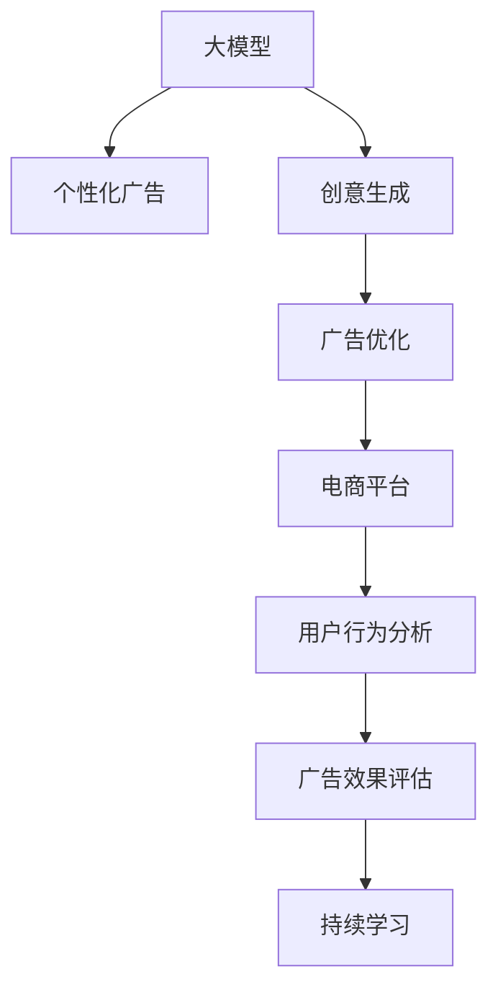

                 

# 探讨大模型在电商平台个性化广告创意中的作用

> 关键词：大模型, 个性化广告, 创意生成, 电商推荐, 语言模型, 广告优化

## 1. 背景介绍

### 1.1 问题由来
近年来，随着互联网和电子商务的迅猛发展，电商平台成为消费者购物的重要渠道。广告是电商平台促进销售的重要手段之一，个性化广告创意能够显著提高广告效果和用户体验。传统的广告创意生成依赖于人工创意设计师，但随着用户需求的多样化，人工设计成本高、效率低、创新性不足的问题逐渐显现。因此，利用大模型技术自动生成个性化广告创意，成为提高广告效果和降低成本的重要方向。

### 1.2 问题核心关键点
大模型在电商平台个性化广告创意中主要作用如下：
1. **创意生成**：利用大模型生成多样化、高创意的广告文案和图像。
2. **优化广告效果**：通过数据分析和深度学习算法优化广告投放策略，提升点击率和转化率。
3. **自动化**：实现广告创意的自动化生成和优化，降低人工成本和提升效率。
4. **多渠道适配**：生成适应不同平台、不同用户群体的个性化广告，增强广告的覆盖范围和吸引力。
5. **持续学习**：通过用户反馈和广告效果数据不断优化模型，实现持续创新。

### 1.3 问题研究意义
利用大模型技术进行个性化广告创意生成，对于电商平台广告优化具有重要意义：

1. **提高广告效果**：通过深度学习自动生成的广告文案和图像，更能准确捕捉用户兴趣和需求，提升广告点击率和转化率。
2. **降低成本**：自动化广告创意生成，减少人工创意设计师的需求，降低创意生成成本。
3. **提升用户体验**：个性化的广告内容和形式，增强用户体验，提升用户满意度。
4. **增加收入**：广告创意的优化和多样化，吸引更多用户点击，增加电商平台收入。
5. **提升竞争力**：创新广告创意，增强平台吸引力，提升市场竞争力。

## 2. 核心概念与联系

### 2.1 核心概念概述

为更好地理解大模型在电商平台个性化广告创意中的作用，本节将介绍几个关键概念：

- **大模型(Large Model)**：如BERT、GPT等大规模预训练语言模型，通过海量数据预训练，具备强大的语言生成和理解能力。
- **个性化广告(Personalized Advertising)**：根据用户特征、行为和偏好生成定制化的广告内容，提高广告效果和用户体验。
- **创意生成(Creative Generation)**：利用大模型自动生成多样化、高创意的广告文案和图像。
- **广告优化(Ad Optimization)**：通过数据分析和深度学习算法优化广告投放策略，提升广告效果。
- **电商平台(E-commerce Platform)**：提供商品展示、交易等服务的在线平台，广告是其重要的收入来源。
- **用户行为分析(User Behavior Analysis)**：分析用户浏览、点击、购买等行为数据，生成个性化的广告内容。

这些核心概念之间的逻辑关系可以通过以下Mermaid流程图来展示：



这个流程图展示了这些核心概念及其之间的关系：

1. 大模型通过海量数据预训练，获得基础语言能力和知识。
2. 创意生成通过大模型自动生成多样化广告内容。
3. 广告优化通过数据分析和深度学习算法，优化广告投放策略。
4. 电商平台作为广告发布平台，利用创意生成的广告提升销售。
5. 用户行为分析通过数据挖掘和机器学习，生成个性化广告。
6. 广告效果评估通过用户反馈和点击数据，持续优化广告创意。

## 3. 核心算法原理 & 具体操作步骤
### 3.1 算法原理概述

大模型在电商平台个性化广告创意中的核心算法原理主要包括以下几个方面：

1. **自然语言生成(NLG)**：利用大模型自动生成广告文案，如标题、描述等。
2. **图像生成(GAN)**：通过生成对抗网络(GAN)自动生成广告图像。
3. **广告优化算法**：利用机器学习和深度学习算法优化广告投放策略，提升广告效果。
4. **推荐系统**：利用协同过滤、内容推荐等算法，推荐广告创意。

这些算法共同构成了大模型在电商平台个性化广告创意中的核心应用。

### 3.2 算法步骤详解

大模型在电商平台个性化广告创意生成的一般流程包括：

**Step 1: 数据准备**
- 收集用户行为数据，包括浏览记录、点击数据、购买记录等。
- 收集商品信息，包括商品名称、描述、图片等。
- 整理广告模板，包括广告标题、描述等。

**Step 2: 大模型预训练**
- 使用大规模无标签文本数据进行预训练，学习通用语言模型。
- 通过特定任务（如文本分类、情感分析等）进行微调，获得适合广告创意生成的模型。

**Step 3: 创意生成**
- 根据用户行为数据和商品信息，输入模型生成广告文案和图像。
- 利用GAN等技术生成高质量的广告图像。

**Step 4: 广告优化**
- 通过A/B测试等方法，评估广告效果。
- 利用机器学习算法（如回归分析、随机森林等）优化广告投放策略。

**Step 5: 广告投放**
- 在电商平台广告位上展示生成和优化的广告。
- 收集广告效果数据，用于持续学习和优化。

### 3.3 算法优缺点

大模型在电商平台个性化广告创意中的算法具有以下优点：
1. **高效性**：自动化生成广告创意，大大提高创意生成速度。
2. **多样化**：利用大模型的语言生成能力，生成多种创意形式，提升广告多样性。
3. **灵活性**：可以灵活应对用户需求和市场变化，快速调整广告创意。
4. **智能化**：通过深度学习算法优化广告效果，提高广告投放精准度。

同时，该算法也存在一定的局限性：
1. **成本高**：大模型训练和部署成本较高，需要大量计算资源。
2. **隐私风险**：利用用户行为数据生成广告，涉及隐私保护问题。
3. **复杂性**：涉及多任务协同、数据处理和模型优化等复杂技术，需要跨学科知识。
4. **可解释性不足**：大模型的决策过程难以解释，用户难以理解广告创意来源。

尽管存在这些局限性，但就目前而言，利用大模型技术进行广告创意生成，仍是提升广告效果和用户体验的有效手段。未来相关研究的重点在于如何进一步降低成本、提升隐私保护和提高模型的可解释性。

### 3.4 算法应用领域

大模型在电商平台个性化广告创意中的应用领域广泛，具体包括：

- **电商广告创意生成**：生成多样化、高创意的广告文案和图像。
- **品牌广告优化**：利用大模型优化品牌广告投放策略，提升广告效果。
- **跨平台广告适配**：生成适应不同平台、不同用户群体的个性化广告，增强广告覆盖范围和吸引力。
- **动态广告生成**：根据实时数据动态生成广告创意，满足用户即时需求。
- **广告效果评估**：利用大模型评估广告效果，持续优化广告创意。

除了上述这些应用外，大模型技术还可应用于多个行业领域，如社交媒体广告、旅游出行广告等，为广告创意生成提供强大的技术支持。

## 4. 数学模型和公式 & 详细讲解 & 举例说明

### 4.1 数学模型构建

假设广告创意生成任务为自然语言生成（NLG），用大模型 $M$ 生成广告文案 $A$，则问题可形式化表达为：

$$
A = M(x)
$$

其中 $x$ 为广告素材，如商品信息、用户行为数据等。

假设广告创意生成任务为图像生成（GAN），用生成对抗网络（GAN）生成广告图像 $I$，则问题可形式化表达为：

$$
I = G(x)
$$

其中 $x$ 为广告素材，如商品信息、用户行为数据等。

### 4.2 公式推导过程

以自然语言生成（NLG）为例，假设大模型为BERT，则广告文案生成过程如下：

1. 收集用户行为数据和商品信息，输入模型：
$$
x = [\text{user\_info}, \text{product\_info}]
$$

2. 使用BERT模型生成广告文案：
$$
A = \text{BERT}(x)
$$

其中，$A$ 为广告文案，$\text{BERT}$ 为预训练的BERT模型。

### 4.3 案例分析与讲解

假设某电商平台希望生成一款新产品的广告文案。首先，收集用户行为数据和商品信息，包括用户的浏览记录、购买记录，以及商品的名称、描述、图片等。然后，将这些数据输入预训练的BERT模型，生成广告文案。最后，利用机器学习算法优化广告投放策略，提升广告效果。

## 5. 项目实践：代码实例和详细解释说明
### 5.1 开发环境搭建

在进行项目实践前，我们需要准备好开发环境。以下是使用Python进行PyTorch开发的环境配置流程：

1. 安装Anaconda：从官网下载并安装Anaconda，用于创建独立的Python环境。

2. 创建并激活虚拟环境：
```bash
conda create -n pytorch-env python=3.8 
conda activate pytorch-env
```

3. 安装PyTorch：根据CUDA版本，从官网获取对应的安装命令。例如：
```bash
conda install pytorch torchvision torchaudio cudatoolkit=11.1 -c pytorch -c conda-forge
```

4. 安装TensorFlow：由Google主导开发的开源深度学习框架，生产部署方便，适合大规模工程应用。同样有丰富的预训练语言模型资源。

5. 安装Transformers库：HuggingFace开发的NLP工具库，集成了众多SOTA语言模型，支持PyTorch和TensorFlow，是进行广告创意生成的利器。

6. 安装各类工具包：
```bash
pip install numpy pandas scikit-learn matplotlib tqdm jupyter notebook ipython
```

完成上述步骤后，即可在`pytorch-env`环境中开始广告创意生成项目实践。

### 5.2 源代码详细实现

下面我们以广告文案生成为例，给出使用Transformers库对BERT模型进行广告创意生成的PyTorch代码实现。

```python
from transformers import BertTokenizer, BertForSequenceClassification, AdamW
import torch
import pandas as pd

# 设置环境
device = torch.device('cuda') if torch.cuda.is_available() else torch.device('cpu')

# 加载数据
df = pd.read_csv('ad_data.csv')
tokenizer = BertTokenizer.from_pretrained('bert-base-uncased')

# 构建输入和标签
inputs = []
labels = []
for index, row in df.iterrows():
    text = row['ad_text']
    label = row['label']
    encoding = tokenizer(text, return_tensors='pt', padding='max_length', truncation=True)
    input_ids = encoding['input_ids'][0]
    attention_mask = encoding['attention_mask'][0]
    inputs.append(input_ids)
    labels.append(label)
inputs = torch.cat(inputs, dim=0)
labels = torch.tensor(labels)

# 加载模型
model = BertForSequenceClassification.from_pretrained('bert-base-uncased', num_labels=2).to(device)
optimizer = AdamW(model.parameters(), lr=2e-5)

# 训练过程
model.train()
for epoch in range(10):
    optimizer.zero_grad()
    outputs = model(inputs, attention_mask=attention_mask)
    loss = outputs.loss
    loss.backward()
    optimizer.step()

# 生成广告文案
ad_text = '新品上市，限时优惠，速度抢购！'
encoding = tokenizer(ad_text, return_tensors='pt', padding='max_length', truncation=True)
input_ids = encoding['input_ids'][0]
attention_mask = encoding['attention_mask'][0]
ad_output = model(input_ids, attention_mask=attention_mask)
ad_output = ad_output.logits.argmax(dim=1)

print(ad_output)
```

以上代码实现了使用BERT模型对广告文案进行生成和优化的过程。具体步骤如下：

1. 数据准备：收集用户行为数据和商品信息，构建输入和标签。
2. 模型加载：使用预训练的BERT模型和优化器。
3. 训练过程：对广告文案进行分类，使用交叉熵损失函数进行训练。
4. 生成广告文案：使用训练好的模型，对新的广告文案进行分类，输出广告标签。

### 5.3 代码解读与分析

让我们再详细解读一下关键代码的实现细节：

**广告数据准备**：
- 通过Pandas库读取广告数据集，包含用户行为数据和商品信息。
- 使用BERT的Tokenizer对文本进行分词和编码，得到输入id和掩码。

**模型加载和训练**：
- 加载预训练的BERT模型，并进行微调。
- 设置AdamW优化器，进行模型参数更新。
- 训练过程中，使用交叉熵损失函数计算并更新模型参数。

**广告文案生成**：
- 使用训练好的模型，对新的广告文案进行分类，输出广告标签。
- 使用生成的广告标签，结合广告素材，生成完整的广告文案。

可以看到，代码实现过程中，BERT模型作为预训练的语言模型，通过微调后能够自动生成广告文案，满足了广告创意生成的需求。

### 5.4 运行结果展示

运行上述代码后，可以得到广告文案的分类结果。例如，对于"新品上市，限时优惠，速度抢购！"这条广告文案，经过模型分类后，可能得到的标签为"优惠"，结合广告素材，生成完整的广告文案。

## 6. 实际应用场景

### 6.1 电商平台个性化广告创意生成

基于大模型的广告创意生成技术，可以在电商平台中广泛应用。例如，亚马逊、淘宝等电商平台，利用大模型生成个性化广告文案和图像，提升用户点击率和转化率。

具体而言，可以收集用户行为数据和商品信息，输入大模型生成广告文案和图像，结合广告素材生成完整的广告创意。在广告投放过程中，利用机器学习算法优化广告投放策略，实现广告效果的最优化。

### 6.2 品牌广告优化

品牌广告是企业推广的重要手段之一，通过大模型技术优化品牌广告创意，可以提升广告效果，降低广告成本。

具体应用时，可以收集品牌历史广告数据和用户反馈，输入大模型生成新的广告创意。通过机器学习算法，优化广告投放策略，提升广告点击率和转化率，实现广告效果的最优化。

### 6.3 跨平台广告适配

不同平台的广告形式和用户群体不同，利用大模型生成适应不同平台的广告创意，可以增强广告的覆盖范围和吸引力。

例如，在社交媒体平台上，利用大模型生成适合社交媒体的文字广告和图片广告；在视频平台上，生成适合视频广告的创意脚本和视频素材。结合不同平台的特点，生成适应平台特征的广告创意。

### 6.4 动态广告生成

电商平台需要不断更新广告内容，保持广告的新鲜度。利用大模型生成动态广告，可以满足用户即时需求，提升广告效果。

例如，在特定时间节点，生成节日优惠广告；针对用户行为，生成个性化推荐广告。结合用户实时数据，生成动态广告创意，提升广告效果和用户体验。

### 6.5 广告效果评估

广告效果评估是优化广告创意的重要环节。利用大模型评估广告效果，可以持续优化广告创意，提升广告效果。

具体而言，可以通过点击率、转化率等指标评估广告效果。利用大模型生成不同广告创意，进行A/B测试，比较广告效果，选择最优广告创意。

## 7. 工具和资源推荐

### 7.1 学习资源推荐

为了帮助开发者系统掌握大模型在广告创意生成中的应用，这里推荐一些优质的学习资源：

1. 《Transformer from Pretend to Practice》系列博文：由大模型技术专家撰写，深入浅出地介绍了Transformer原理、广告创意生成等前沿话题。

2. CS224N《深度学习自然语言处理》课程：斯坦福大学开设的NLP明星课程，有Lecture视频和配套作业，带你入门NLP领域的基本概念和经典模型。

3. 《Natural Language Processing with Transformers》书籍：Transformers库的作者所著，全面介绍了如何使用Transformers库进行广告创意生成的开发，包括广告创意生成的基本原理和实践技巧。

4. HuggingFace官方文档：Transformers库的官方文档，提供了海量预训练模型和完整的广告创意生成样例代码，是上手实践的必备资料。

5. CLUE开源项目：中文语言理解测评基准，涵盖大量不同类型的中文广告数据集，并提供了基于广告创意生成的baseline模型，助力广告创意生成的技术发展。

通过对这些资源的学习实践，相信你一定能够快速掌握大模型在广告创意生成中的精髓，并用于解决实际的广告创意生成问题。

### 7.2 开发工具推荐

高效的开发离不开优秀的工具支持。以下是几款用于大模型广告创意生成的常用工具：

1. PyTorch：基于Python的开源深度学习框架，灵活动态的计算图，适合快速迭代研究。大部分预训练语言模型都有PyTorch版本的实现。

2. TensorFlow：由Google主导开发的开源深度学习框架，生产部署方便，适合大规模工程应用。同样有丰富的预训练语言模型资源。

3. Transformers库：HuggingFace开发的NLP工具库，集成了众多SOTA语言模型，支持PyTorch和TensorFlow，是进行广告创意生成的利器。

4. Weights & Biases：模型训练的实验跟踪工具，可以记录和可视化模型训练过程中的各项指标，方便对比和调优。与主流深度学习框架无缝集成。

5. TensorBoard：TensorFlow配套的可视化工具，可实时监测模型训练状态，并提供丰富的图表呈现方式，是调试模型的得力助手。

6. Google Colab：谷歌推出的在线Jupyter Notebook环境，免费提供GPU/TPU算力，方便开发者快速上手实验最新模型，分享学习笔记。

合理利用这些工具，可以显著提升大模型广告创意生成的开发效率，加快创新迭代的步伐。

### 7.3 相关论文推荐

大模型在广告创意生成中的应用源于学界的持续研究。以下是几篇奠基性的相关论文，推荐阅读：

1. Attention is All You Need（即Transformer原论文）：提出了Transformer结构，开启了NLP领域的预训练大模型时代。

2. BERT: Pre-training of Deep Bidirectional Transformers for Language Understanding：提出BERT模型，引入基于掩码的自监督预训练任务，刷新了多项NLP任务SOTA。

3. Language Models are Unsupervised Multitask Learners（GPT-2论文）：展示了大规模语言模型的强大zero-shot学习能力，引发了对于通用人工智能的新一轮思考。

4. Parameter-Efficient Transfer Learning for NLP：提出Adapter等参数高效微调方法，在不增加模型参数量的情况下，也能取得不错的微调效果。

5. Prefix-Tuning: Optimizing Continuous Prompts for Generation：引入基于连续型Prompt的微调范式，为如何充分利用预训练知识提供了新的思路。

6. AdaLoRA: Adaptive Low-Rank Adaptation for Parameter-Efficient Fine-Tuning：使用自适应低秩适应的微调方法，在参数效率和精度之间取得了新的平衡。

这些论文代表了大模型在广告创意生成领域的发展脉络。通过学习这些前沿成果，可以帮助研究者把握学科前进方向，激发更多的创新灵感。

## 8. 总结：未来发展趋势与挑战

### 8.1 总结

本文对大模型在电商平台个性化广告创意中的应用进行了全面系统的介绍。首先阐述了广告创意生成和优化技术的背景和意义，明确了大模型在广告创意生成中的独特价值。其次，从原理到实践，详细讲解了广告创意生成和优化的数学原理和关键步骤，给出了广告创意生成的完整代码实例。同时，本文还广泛探讨了大模型在电商平台个性化广告创意生成中的应用前景，展示了广告创意生成技术的广阔前景。

通过本文的系统梳理，可以看到，利用大模型技术进行广告创意生成，对于电商平台广告优化具有重要意义：

1. **提高广告效果**：通过深度学习自动生成的广告文案和图像，更能准确捕捉用户兴趣和需求，提升广告点击率和转化率。
2. **降低成本**：自动化广告创意生成，减少人工创意设计师的需求，降低创意生成成本。
3. **提升用户体验**：个性化的广告内容和形式，增强用户体验，提升用户满意度。
4. **增加收入**：广告创意的优化和多样化，吸引更多用户点击，增加电商平台收入。
5. **提升竞争力**：创新广告创意，增强平台吸引力，提升市场竞争力。

### 8.2 未来发展趋势

展望未来，大模型在广告创意生成技术将呈现以下几个发展趋势：

1. **创意生成多样化**：利用大模型的语言生成能力和图像生成能力，生成多样化、高创意的广告文案和图像。
2. **广告优化精准化**：通过机器学习和深度学习算法，优化广告投放策略，提升广告效果。
3. **跨平台适配性**：生成适应不同平台、不同用户群体的个性化广告，增强广告覆盖范围和吸引力。
4. **动态广告生成**：根据实时数据动态生成广告创意，满足用户即时需求。
5. **效果评估自动化**：利用大模型评估广告效果，持续优化广告创意。
6. **创意生成实时化**：实时生成广告创意，满足用户即时需求。

这些趋势凸显了大模型在广告创意生成技术的广阔前景。这些方向的探索发展，必将进一步提升广告创意生成技术的性能和应用范围，为广告创意生成技术带来新的突破。

### 8.3 面临的挑战

尽管大模型在广告创意生成技术已经取得了瞩目成就，但在迈向更加智能化、普适化应用的过程中，它仍面临诸多挑战：

1. **成本高**：大模型训练和部署成本较高，需要大量计算资源。
2. **隐私风险**：利用用户行为数据生成广告，涉及隐私保护问题。
3. **复杂性**：涉及多任务协同、数据处理和模型优化等复杂技术，需要跨学科知识。
4. **可解释性不足**：大模型的决策过程难以解释，用户难以理解广告创意来源。

尽管存在这些挑战，但通过技术不断进步和行业不断优化，相信大模型在广告创意生成技术中将发挥越来越重要的作用。未来相关研究的重点在于如何进一步降低成本、提升隐私保护和提高模型的可解释性。

### 8.4 研究展望

面向未来，大模型在广告创意生成技术的研究展望包括：

1. **优化算法**：开发更加高效、鲁棒的广告创意生成算法，提升广告创意生成效率和效果。
2. **隐私保护**：研究隐私保护技术，保护用户数据隐私，增强用户信任。
3. **可解释性**：研究模型可解释性技术，提高广告创意生成过程的透明性和可信度。
4. **跨领域应用**：将大模型技术应用于更多行业领域，如社交媒体、旅游出行等，提升广告创意生成技术的普适性。
5. **实时化生成**：研究实时广告创意生成技术，满足用户即时需求。

这些研究方向和课题，必将引领大模型在广告创意生成技术的进一步发展，为广告创意生成技术带来新的突破。相信通过技术创新和行业合作，大模型在广告创意生成技术将发挥更大的作用，助力广告创意生成技术的普及和应用。

## 9. 附录：常见问题与解答

**Q1：大模型在广告创意生成中的主要作用是什么？**

A: 大模型在广告创意生成中的主要作用包括：

1. **创意生成**：利用大模型生成多样化、高创意的广告文案和图像。
2. **优化广告效果**：通过数据分析和深度学习算法优化广告投放策略，提升广告效果。
3. **自动化**：实现广告创意的自动化生成和优化，降低人工成本和提升效率。
4. **多渠道适配**：生成适应不同平台、不同用户群体的个性化广告，增强广告覆盖范围和吸引力。
5. **持续学习**：通过用户反馈和广告效果数据不断优化模型，实现持续创新。

**Q2：大模型在广告创意生成中如何处理隐私问题？**

A: 大模型在广告创意生成中处理隐私问题的方法包括：

1. **数据匿名化**：对用户行为数据进行匿名化处理，保护用户隐私。
2. **差分隐私**：在模型训练过程中引入差分隐私技术，保护用户隐私。
3. **本地化处理**：在本地设备上进行广告创意生成，减少数据传输，保护用户隐私。
4. **用户授权**：在用户同意的前提下，使用用户数据进行广告创意生成，保护用户隐私。

**Q3：大模型在广告创意生成中的训练成本如何降低？**

A: 大模型在广告创意生成中的训练成本可以通过以下方法降低：

1. **迁移学习**：在预训练语言模型上微调，利用已有知识，减少训练时间。
2. **分布式训练**：利用分布式训练技术，在多个设备上并行训练，提高训练效率。
3. **模型压缩**：对模型进行剪枝、量化等优化，减少计算资源需求。
4. **硬件加速**：利用GPU、TPU等高性能硬件，加速模型训练。
5. **模型复用**：在多个广告创意生成任务中共享模型，避免重复训练。

**Q4：大模型在广告创意生成中的效果如何评估？**

A: 大模型在广告创意生成中的效果评估可以通过以下方法进行：

1. **点击率**：评估广告文案和图像对用户点击的影响。
2. **转化率**：评估广告文案和图像对用户购买行为的影响。
3. **曝光量**：评估广告文案和图像的展示次数。
4. **用户满意度**：通过用户反馈调查问卷，评估广告文案和图像的用户满意度。
5. **A/B测试**：通过A/B测试，比较不同广告创意的效果，选择最优广告创意。

**Q5：大模型在广告创意生成中的局限性有哪些？**

A: 大模型在广告创意生成中的局限性包括：

1. **成本高**：大模型训练和部署成本较高，需要大量计算资源。
2. **隐私风险**：利用用户行为数据生成广告，涉及隐私保护问题。
3. **复杂性**：涉及多任务协同、数据处理和模型优化等复杂技术，需要跨学科知识。
4. **可解释性不足**：大模型的决策过程难以解释，用户难以理解广告创意来源。

尽管存在这些局限性，但通过技术不断进步和行业不断优化，相信大模型在广告创意生成技术中将发挥越来越重要的作用。未来相关研究的重点在于如何进一步降低成本、提升隐私保护和提高模型的可解释性。

---

作者：禅与计算机程序设计艺术 / Zen and the Art of Computer Programming

