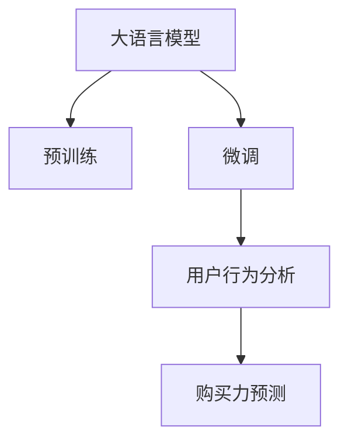

                 

# 探讨大模型在电商平台用户购买力预测中的潜力

> 关键词：
> 大语言模型,电商平台,购买力预测,深度学习,用户行为分析,数据挖掘

## 1. 背景介绍

### 1.1 问题由来
随着电子商务的迅猛发展，各大电商平台越来越依赖于精准的用户购买力预测，以便进行个性化推荐、库存管理、营销活动优化等决策。用户购买力预测可以理解用户可能产生的购买行为和消费金额，对于电商平台来说具有重要的参考价值。传统的统计学和机器学习方法在用户购买力预测上存在一些局限性，难以综合考虑复杂且动态的用户行为。因此，探索基于大模型的预测方法，成为了提升电商平台用户购买力预测精度的一个重要方向。

### 1.2 问题核心关键点
目前，基于大模型的用户购买力预测方法在电商领域中逐步崭露头角。这些大模型通常基于深度学习技术，如Transformer架构，经过大规模预训练，获取了丰富的语言表示能力。通过在大规模无标签用户行为数据上进行预训练，模型可以学习到用户在电商平台上的购买行为模式和语言习惯，再通过微调（Fine-Tuning）针对特定的购买力预测任务，从而提升预测效果。

利用大模型进行预测的主要优势包括：
- **泛化能力强**：大模型能够处理多样化的用户行为数据，不受数据量限制，适用于电商平台上的多种预测场景。
- **理解语义**：大模型能够理解自然语言，更好地捕捉用户评论、聊天、搜索等文本数据中的关键信息，提升预测准确性。
- **模型透明**：通过预训练和微调，模型可以提供可解释的输出，便于对预测结果进行理解和调整。
- **易扩展性**：大模型可以作为通用的基础模型，通过微调适配不同的电商任务。

大模型在电商平台用户购买力预测中的应用，不仅能提升电商平台的运营效率，还能帮助用户实现个性化推荐，增强购物体验。

### 1.3 问题研究意义
大模型在电商平台用户购买力预测中的潜力研究，具有以下重要意义：

1. **提升预测精度**：通过大模型的深度学习能力，可以捕获用户行为的复杂模式，减少预测误差，提升购买力预测的准确性。
2. **优化电商运营**：精准的用户购买力预测有助于电商平台进行库存管理、营销活动设计和个性化推荐，从而提高运营效率和用户体验。
3. **数据驱动决策**：电商平台可以依赖预测结果制定更科学的用户增长策略和产品推荐策略，提升市场竞争力。
4. **适应电商趋势**：电商平台面对不断变化的市场需求和用户行为，需要持续改进预测模型以适应新的挑战。

## 2. 核心概念与联系

### 2.1 核心概念概述

为了更好地理解大模型在电商平台用户购买力预测中的应用，我们将介绍几个关键概念：

- **大语言模型**：指基于Transformer架构的深度学习模型，通过在大规模无标签文本数据上进行预训练，学习通用的语言表示，具备强大的语言理解和生成能力。
- **预训练**：指在大规模无标签文本语料上，通过自监督学习任务训练模型，使其学习到语言的基础表示。
- **微调**：指在预训练模型的基础上，使用电商平台的用户行为数据，通过有监督学习优化模型在该任务上的性能。
- **用户行为分析**：通过分析用户的浏览、点击、购买等行为数据，理解用户的购买意愿和消费模式。
- **购买力预测**：预测用户在特定时间段内可能产生的消费金额，通过分析用户的购买记录、搜索记录、评价信息等数据实现。

这些概念之间的逻辑关系可以通过以下Mermaid流程图来展示：



这个流程图展示了大语言模型的核心概念及其之间的关系：

1. 大语言模型通过预训练获得基础能力。
2. 微调是对预训练模型进行任务特定的优化，使其具备电商领域内的用户行为分析能力。
3. 用户行为分析利用微调后的模型，分析用户的浏览、点击、购买等行为，理解其购买意愿。
4. 购买力预测利用用户行为分析结果，预测用户在特定时间段内的消费金额。

## 3. 核心算法原理 & 具体操作步骤
### 3.1 算法原理概述

基于大模型的电商平台用户购买力预测，本质上是一个有监督的微调过程。其核心思想是：将预训练的大语言模型视作一个强大的"特征提取器"，通过电商平台的标注数据（用户行为数据），有监督地训练模型，优化其对用户购买力预测的性能。

形式化地，假设预训练模型为 $M_{\theta}$，其中 $\theta$ 为预训练得到的模型参数。电商平台的数据集为 $D=\{(x_i, y_i)\}_{i=1}^N$，其中 $x_i$ 为用户行为数据， $y_i$ 为相应的消费金额。微调的目标是找到新的模型参数 $\hat{\theta}$，使得：

$$
\hat{\theta}=\mathop{\arg\min}_{\theta} \mathcal{L}(M_{\theta},D)
$$

其中 $\mathcal{L}$ 为针对电商平台用户购买力预测设计的损失函数，用于衡量模型预测输出与真实标签之间的差异。常见的损失函数包括均方误差（MSE）、绝对平均误差（MAE）等。

通过梯度下降等优化算法，微调过程不断更新模型参数 $\theta$，最小化损失函数 $\mathcal{L}$，使得模型输出逼近真实标签。由于 $\theta$ 已经通过预训练获得了较好的初始化，因此即便在用户行为数据集 $D$ 上进行微调，也能较快收敛到理想的模型参数 $\hat{\theta}$。

### 3.2 算法步骤详解

基于大模型的电商平台用户购买力预测一般包括以下几个关键步骤：

**Step 1: 准备预训练模型和数据集**
- 选择合适的预训练语言模型 $M_{\theta}$ 作为初始化参数，如 BERT、GPT 等。
- 准备电商平台的用户行为数据集 $D$，划分为训练集、验证集和测试集。通常要求数据与预训练数据的分布不要差异过大。

**Step 2: 添加任务适配层**
- 根据电商平台购买力预测任务，在预训练模型顶层设计合适的输出层和损失函数。
- 对于预测任务，通常在顶层添加线性回归层和均方误差损失函数。
- 对于分类任务，通常使用交叉熵损失函数。

**Step 3: 设置微调超参数**
- 选择合适的优化算法及其参数，如 AdamW、SGD 等，设置学习率、批大小、迭代轮数等。
- 设置正则化技术及强度，包括权重衰减、Dropout、Early Stopping 等。
- 确定冻结预训练参数的策略，如仅微调顶层，或全部参数都参与微调。

**Step 4: 执行梯度训练**
- 将训练集数据分批次输入模型，前向传播计算损失函数。
- 反向传播计算参数梯度，根据设定的优化算法和学习率更新模型参数。
- 周期性在验证集上评估模型性能，根据性能指标决定是否触发 Early Stopping。
- 重复上述步骤直到满足预设的迭代轮数或 Early Stopping 条件。

**Step 5: 测试和部署**
- 在测试集上评估微调后模型 $M_{\hat{\theta}}$ 的性能，对比微调前后的精度提升。
- 使用微调后的模型对新用户行为数据进行预测，集成到实际的应用系统中。
- 持续收集新的数据，定期重新微调模型，以适应数据分布的变化。

以上是基于大模型微调方法在电商平台用户购买力预测的一般流程。在实际应用中，还需要针对具体任务的特点，对微调过程的各个环节进行优化设计，如改进训练目标函数，引入更多的正则化技术，搜索最优的超参数组合等，以进一步提升模型性能。

### 3.3 算法优缺点

基于大模型的电商平台用户购买力预测方法具有以下优点：
1. **泛化能力强**：大模型通过预训练学习到了通用的语言表示，具有较强的泛化能力，适用于不同电商场景。
2. **数据灵活性**：用户行为数据形式多样，包括文本、数字、时间序列等，大模型能够灵活处理。
3. **可解释性**：大模型通过微调后的权重，提供可解释的预测结果，便于电商运营者理解和调整策略。
4. **高精度**：深度学习模型能够捕捉用户行为中的复杂模式，提升预测精度。

同时，该方法也存在一定的局限性：
1. **计算资源需求高**：预训练和微调需要大量的计算资源，对硬件要求高。
2. **模型复杂性**：大模型的参数量庞大，增加了部署和维护的复杂性。
3. **解释性不足**：大模型的预测结果难以解释，可能缺乏透明性。
4. **数据隐私问题**：用户行为数据的收集和使用可能涉及隐私问题，需要考虑数据安全和隐私保护。

尽管存在这些局限性，但就目前而言，基于大模型的微调方法仍是电商平台用户购买力预测的重要范式。未来相关研究的重点在于如何进一步降低计算资源需求，提高模型解释性，保障用户隐私等。

### 3.4 算法应用领域

基于大模型的电商平台用户购买力预测方法，已经在电商领域得到了广泛的应用，覆盖了以下主要应用场景：

1. **个性化推荐**：通过预测用户购买力，实现个性化推荐，提升用户满意度和忠诚度。
2. **库存管理**：根据用户购买力预测，优化库存配置，减少缺货和积压。
3. **营销活动优化**：根据用户购买力预测，设计更有效的营销策略和促销活动，提高转化率。
4. **价格优化**：通过分析用户购买力，调整商品定价策略，实现收益最大化。
5. **用户流失预警**：预测用户未来流失风险，提前采取措施，防止用户流失。

除了上述这些经典应用外，大模型在电商平台用户购买力预测的应用也在不断扩展，如跨平台用户行为分析、联合营销效果评估等，为电商运营带来了新的思路。随着预训练模型和微调方法的持续进步，基于大模型的电商平台用户购买力预测将进一步拓展其应用边界，为电商行业带来更多的创新和突破。

## 4. 数学模型和公式 & 详细讲解  
### 4.1 数学模型构建

本节将使用数学语言对基于大模型的电商平台用户购买力预测过程进行更加严格的刻画。

记预训练语言模型为 $M_{\theta}$，其中 $\theta$ 为模型参数。假设电商平台的数据集为 $D=\{(x_i, y_i)\}_{i=1}^N$，其中 $x_i$ 为电商平台用户行为数据， $y_i$ 为相应的消费金额。

定义模型 $M_{\theta}$ 在用户行为数据 $x$ 上的损失函数为 $\ell(M_{\theta}(x),y)$，则在数据集 $D$ 上的经验风险为：

$$
\mathcal{L}(\theta) = \frac{1}{N} \sum_{i=1}^N \ell(M_{\theta}(x_i),y_i)
$$

微调的优化目标是最小化经验风险，即找到最优参数：

$$
\theta^* = \mathop{\arg\min}_{\theta} \mathcal{L}(\theta)
$$

在实践中，我们通常使用基于梯度的优化算法（如SGD、AdamW等）来近似求解上述最优化问题。设 $\eta$ 为学习率，$\lambda$ 为正则化系数，则参数的更新公式为：

$$
\theta \leftarrow \theta - \eta \nabla_{\theta}\mathcal{L}(\theta) - \eta\lambda\theta
$$

其中 $\nabla_{\theta}\mathcal{L}(\theta)$ 为损失函数对参数 $\theta$ 的梯度，可通过反向传播算法高效计算。

### 4.2 公式推导过程

以下我们以回归任务为例，推导均方误差损失函数及其梯度的计算公式。

假设模型 $M_{\theta}$ 在输入 $x$ 上的输出为 $\hat{y}=M_{\theta}(x)$，表示模型对用户行为数据的预测值。真实标签 $y$ 为消费金额。则均方误差损失函数定义为：

$$
\ell(M_{\theta}(x),y) = \frac{1}{2}(y-\hat{y})^2
$$

将其代入经验风险公式，得：

$$
\mathcal{L}(\theta) = \frac{1}{N}\sum_{i=1}^N (y_i-\hat{y}_i)^2
$$

根据链式法则，损失函数对参数 $\theta_k$ 的梯度为：

$$
\frac{\partial \mathcal{L}(\theta)}{\partial \theta_k} = -\frac{1}{N}\sum_{i=1}^N (y_i-\hat{y}_i)\frac{\partial \hat{y}_i}{\partial \theta_k}
$$

其中 $\frac{\partial \hat{y}_i}{\partial \theta_k}$ 可进一步递归展开，利用自动微分技术完成计算。

在得到损失函数的梯度后，即可带入参数更新公式，完成模型的迭代优化。重复上述过程直至收敛，最终得到适应电商平台购买力预测任务的最优模型参数 $\theta^*$。

## 5. 项目实践：代码实例和详细解释说明
### 5.1 开发环境搭建

在进行用户购买力预测实践前，我们需要准备好开发环境。以下是使用Python进行PyTorch开发的环境配置流程：

1. 安装Anaconda：从官网下载并安装Anaconda，用于创建独立的Python环境。

2. 创建并激活虚拟环境：
```bash
conda create -n pytorch-env python=3.8 
conda activate pytorch-env
```

3. 安装PyTorch：根据CUDA版本，从官网获取对应的安装命令。例如：
```bash
conda install pytorch torchvision torchaudio cudatoolkit=11.1 -c pytorch -c conda-forge
```

4. 安装Transformers库：
```bash
pip install transformers
```

5. 安装各类工具包：
```bash
pip install numpy pandas scikit-learn matplotlib tqdm jupyter notebook ipython
```

完成上述步骤后，即可在`pytorch-env`环境中开始用户购买力预测实践。

### 5.2 源代码详细实现

下面我们以电商平台用户购买力预测任务为例，给出使用Transformers库对BERT模型进行回归训练的PyTorch代码实现。

首先，定义电商平台数据处理函数：

```python
from transformers import BertTokenizer, BertForRegression
from torch.utils.data import Dataset
import torch

class ECommerceDataset(Dataset):
    def __init__(self, features, labels, tokenizer, max_len=128):
        self.features = features
        self.labels = labels
        self.tokenizer = tokenizer
        self.max_len = max_len
        
    def __len__(self):
        return len(self.features)
    
    def __getitem__(self, item):
        feature = self.features[item]
        label = self.labels[item]
        
        encoding = self.tokenizer(feature, return_tensors='pt', max_length=self.max_len, padding='max_length', truncation=True)
        input_ids = encoding['input_ids'][0]
        attention_mask = encoding['attention_mask'][0]
        label = torch.tensor(label, dtype=torch.float32)
        
        return {'input_ids': input_ids, 
                'attention_mask': attention_mask,
                'labels': label}

# 初始化BERT模型
tokenizer = BertTokenizer.from_pretrained('bert-base-cased')
model = BertForRegression.from_pretrained('bert-base-cased')

# 准备训练数据
train_dataset = ECommerceDataset(train_features, train_labels, tokenizer)
val_dataset = ECommerceDataset(val_features, val_labels, tokenizer)
test_dataset = ECommerceDataset(test_features, test_labels, tokenizer)
```

然后，定义模型和优化器：

```python
from transformers import AdamW

optimizer = AdamW(model.parameters(), lr=2e-5)
```

接着，定义训练和评估函数：

```python
from torch.utils.data import DataLoader
from tqdm import tqdm
from sklearn.metrics import mean_squared_error

device = torch.device('cuda') if torch.cuda.is_available() else torch.device('cpu')
model.to(device)

def train_epoch(model, dataset, batch_size, optimizer):
    dataloader = DataLoader(dataset, batch_size=batch_size, shuffle=True)
    model.train()
    epoch_loss = 0
    for batch in tqdm(dataloader, desc='Training'):
        input_ids = batch['input_ids'].to(device)
        attention_mask = batch['attention_mask'].to(device)
        labels = batch['labels'].to(device)
        model.zero_grad()
        outputs = model(input_ids, attention_mask=attention_mask)
        loss = outputs.loss
        epoch_loss += loss.item()
        loss.backward()
        optimizer.step()
    return epoch_loss / len(dataloader)

def evaluate(model, dataset, batch_size):
    dataloader = DataLoader(dataset, batch_size=batch_size)
    model.eval()
    epoch_loss = 0
    epoch_mse = 0
    with torch.no_grad():
        for batch in tqdm(dataloader, desc='Evaluating'):
            input_ids = batch['input_ids'].to(device)
            attention_mask = batch['attention_mask'].to(device)
            labels = batch['labels'].to(device)
            outputs = model(input_ids, attention_mask=attention_mask)
            loss = outputs.loss
            epoch_loss += loss.item()
            epoch_mse += mean_squared_error(labels, outputs.predictions).item()
        
    return epoch_loss / len(dataloader), epoch_mse / len(dataloader)
```

最后，启动训练流程并在测试集上评估：

```python
epochs = 5
batch_size = 16

for epoch in range(epochs):
    loss, mse = train_epoch(model, train_dataset, batch_size, optimizer)
    print(f"Epoch {epoch+1}, train loss: {loss:.3f}")
    
    print(f"Epoch {epoch+1}, val results:")
    loss, mse = evaluate(model, val_dataset, batch_size)
    print(f"Validation MSE: {mse:.3f}")
    
print("Test results:")
loss, mse = evaluate(model, test_dataset, batch_size)
print(f"Test MSE: {mse:.3f}")
```

以上就是使用PyTorch对BERT进行电商平台用户购买力预测任务回归训练的完整代码实现。可以看到，得益于Transformers库的强大封装，我们可以用相对简洁的代码完成BERT模型的加载和回归训练。

### 5.3 代码解读与分析

让我们再详细解读一下关键代码的实现细节：

**ECommerceDataset类**：
- `__init__`方法：初始化输入特征、标签、分词器等关键组件。
- `__len__`方法：返回数据集的样本数量。
- `__getitem__`方法：对单个样本进行处理，将文本输入编码为token ids，将标签编码成float，并进行定长padding，最终返回模型所需的输入。

**BertForRegression模型**：
- 使用BertForRegression从预训练模型中提取用户行为数据的特征表示。

**AdamW优化器**：
- 定义AdamW优化器，用于更新模型参数，收敛速度较快。

**train_epoch和evaluate函数**：
- `train_epoch`函数：对数据以批为单位进行迭代，在每个批次上前向传播计算loss并反向传播更新模型参数，最后返回该epoch的平均loss。
- `evaluate`函数：与训练类似，不同点在于不更新模型参数，并在每个batch结束后将预测和标签结果存储下来，最后使用sklearn的mean_squared_error计算评估指标。

**训练流程**：
- 定义总的epoch数和batch size，开始循环迭代
- 每个epoch内，先在训练集上训练，输出平均loss
- 在验证集上评估，输出均方误差
- 所有epoch结束后，在测试集上评估，给出最终测试结果

可以看到，PyTorch配合Transformers库使得BERT回归训练的代码实现变得简洁高效。开发者可以将更多精力放在数据处理、模型改进等高层逻辑上，而不必过多关注底层的实现细节。

当然，工业级的系统实现还需考虑更多因素，如模型的保存和部署、超参数的自动搜索、更灵活的任务适配层等。但核心的微调范式基本与此类似。

## 6. 实际应用场景
### 6.1 电商搜索排序优化

基于大模型预测用户购买力的方法，可以应用于电商平台的搜索排序优化。传统的搜索排序算法依赖于简单的关键词匹配，难以捕捉用户行为中的复杂模式。通过预训练-微调的大模型，可以分析用户的浏览、点击、购买等行为，预测用户的购买力，从而实现更加个性化和精准的搜索排序。

在技术实现上，可以收集用户在电商平台上的历史行为数据，包括浏览记录、点击记录、购买记录等，将这些数据作为微调模型训练的监督信号。模型通过微调后，可以预测用户对每个搜索结果的兴趣和购买意愿，进而优化搜索排序算法，提升用户体验和转化率。

### 6.2 价格策略调整

电商平台可以根据用户购买力预测结果，调整商品价格策略，实现收益最大化。传统的价格优化算法往往忽视用户行为中的情感和语义信息，难以做出更符合用户心理预期的调整。而使用大模型进行预测，能够捕捉用户对价格变化的敏感度，帮助电商平台制定更加科学合理的价格策略。

在实际操作中，可以收集用户对商品价格的评价信息，结合购买力预测结果，构建价格敏感度模型。根据模型预测的敏感度，动态调整商品价格，实现利润最大化。

### 6.3 个性化推荐

大模型在电商平台用户购买力预测中的应用，还可以扩展到个性化推荐场景。通过预测用户的购买力，电商平台可以更好地理解用户的偏好和需求，实现更加精准的推荐。

在推荐系统设计上，可以根据预测的购买力，将用户划分为高、中、低购买力三类。针对不同类别的用户，设计不同的推荐策略。例如，对高购买力用户，推荐高价值商品；对中购买力用户，推荐性价比高的商品；对低购买力用户，推荐价格适中的商品。

### 6.4 用户流失预警

电商平台的流失用户可能给公司带来较大的经济损失。通过用户购买力预测，电商平台可以及时识别出可能流失的用户，并采取措施防止其流失。

具体而言，可以构建用户流失预测模型，分析用户购买力变化趋势，预测用户流失概率。对于流失概率较高的用户，可以采取定向营销、会员优惠等措施，挽回用户。

### 6.5 新用户获取

电商平台通过精准预测新用户的购买力，可以更有针对性地设计营销活动，吸引新用户。例如，针对潜在的高购买力用户，设计特别的优惠活动，提升转化率。

## 7. 工具和资源推荐
### 7.1 学习资源推荐

为了帮助开发者系统掌握大模型在电商平台用户购买力预测的应用，这里推荐一些优质的学习资源：

1. 《深度学习实战》系列博文：由深度学习专家撰写，介绍了深度学习在电商平台中的应用，包括用户行为分析和预测。

2. 《深度学习与自然语言处理》课程：由斯坦福大学开设的NLP明星课程，包含深度学习在NLP中的多种应用，对电商平台用户行为预测具有参考价值。

3. 《深度学习与电商应用》书籍：系统介绍了深度学习在电商平台中的应用，包括个性化推荐、搜索排序优化等。

4. Kaggle电商数据集：包含了电商平台的多种用户行为数据，适合进行用户购买力预测的实践和竞赛。

5. GitHub深度学习项目：收集了多种深度学习项目代码，包括电商平台推荐系统的实现，可供学习和参考。

通过对这些资源的学习实践，相信你一定能够快速掌握大模型在电商平台用户购买力预测中的应用，并用于解决实际的电商问题。

### 7.2 开发工具推荐

高效的开发离不开优秀的工具支持。以下是几款用于电商平台用户购买力预测开发的常用工具：

1. PyTorch：基于Python的开源深度学习框架，灵活动态的计算图，适合快速迭代研究。

2. TensorFlow：由Google主导开发的开源深度学习框架，生产部署方便，适合大规模工程应用。

3. Transformers库：HuggingFace开发的NLP工具库，集成了众多SOTA语言模型，支持PyTorch和TensorFlow，是进行电商任务开发的利器。

4. Weights & Biases：模型训练的实验跟踪工具，可以记录和可视化模型训练过程中的各项指标，方便对比和调优。

5. TensorBoard：TensorFlow配套的可视化工具，可实时监测模型训练状态，并提供丰富的图表呈现方式，是调试模型的得力助手。

6. Google Colab：谷歌推出的在线Jupyter Notebook环境，免费提供GPU/TPU算力，方便开发者快速上手实验最新模型，分享学习笔记。

合理利用这些工具，可以显著提升电商平台用户购买力预测的开发效率，加快创新迭代的步伐。

### 7.3 相关论文推荐

大模型在电商平台用户购买力预测中的应用，得益于深度学习领域的持续研究。以下是几篇奠基性的相关论文，推荐阅读：

1. Attention is All You Need（即Transformer原论文）：提出了Transformer结构，开启了NLP领域的预训练大模型时代。

2. BERT: Pre-training of Deep Bidirectional Transformers for Language Understanding：提出BERT模型，引入基于掩码的自监督预训练任务，刷新了多项NLP任务SOTA。

3. Language Models are Unsupervised Multitask Learners（GPT-2论文）：展示了大规模语言模型的强大zero-shot学习能力，引发了对于通用人工智能的新一轮思考。

4. Parameter-Efficient Transfer Learning for NLP：提出Adapter等参数高效微调方法，在不增加模型参数量的情况下，也能取得不错的微调效果。

5. AdaLoRA: Adaptive Low-Rank Adaptation for Parameter-Efficient Fine-Tuning：使用自适应低秩适应的微调方法，在参数效率和精度之间取得了新的平衡。

这些论文代表了大模型在电商平台用户购买力预测中的应用方向。通过学习这些前沿成果，可以帮助研究者把握学科前进方向，激发更多的创新灵感。

## 8. 总结：未来发展趋势与挑战

### 8.1 总结

本文对基于大模型的电商平台用户购买力预测方法进行了全面系统的介绍。首先阐述了大模型和微调技术的研究背景和意义，明确了微调在电商平台用户购买力预测中的独特价值。其次，从原理到实践，详细讲解了用户购买力预测的数学原理和关键步骤，给出了预测任务开发的完整代码实例。同时，本文还广泛探讨了预测方法在电商平台上的多个应用场景，展示了微调方法的广阔前景。

通过本文的系统梳理，可以看到，基于大模型的用户购买力预测方法具有强大的泛化能力和灵活性，适用于电商平台上的多种预测任务。大模型不仅能够处理文本数据，还能综合利用多种类型的数据，提升预测准确性。未来，随着预训练模型和微调方法的不断进步，基于大模型的电商平台用户购买力预测将进一步拓展其应用边界，为电商行业带来更多的创新和突破。

### 8.2 未来发展趋势

展望未来，大模型在电商平台用户购买力预测中的应用将呈现以下几个发展趋势：

1. **更高效的学习算法**：未来将出现更高效的学习算法，如自适应学习率调度、联邦学习等，以适应电商场景中的实时数据流。

2. **多任务学习和联合预测**：电商平台上的用户行为数据往往包含多种任务，如搜索、排序、推荐等。未来的大模型将能够进行多任务学习，联合预测多种相关任务，提升预测效果。

3. **实时化和在线化预测**：电商平台需要实时预测用户购买力，支持动态调整运营策略。未来的大模型将具备实时预测能力，支持在线化部署。

4. **多模态信息融合**：电商平台上的用户行为数据往往包含文本、图像、视频等多种模态。未来的大模型将能够更好地融合多种模态信息，提升预测精度。

5. **数据隐私保护**：电商平台上的用户数据涉及隐私保护问题，未来的大模型将采用更强的隐私保护技术，保障用户数据的安全性。

6. **个性化和多样化**：电商平台上的用户行为千差万别，未来的大模型将能够提供更加个性化和多样化的预测结果，满足不同用户的需求。

以上趋势凸显了大模型在电商平台用户购买力预测中的潜力。这些方向的探索发展，必将进一步提升预测模型的精度和灵活性，为电商平台提供更有力的决策支持。

### 8.3 面临的挑战

尽管大模型在电商平台用户购买力预测中具有巨大的潜力，但在实际应用中仍面临诸多挑战：

1. **数据质量**：电商平台的标注数据质量往往参差不齐，标注成本高，数据分布可能存在偏差。如何提高数据质量，消除数据偏见，是一个重要问题。

2. **模型鲁棒性**：大模型在面对电商数据中的一些异常数据时，容易过拟合，泛化能力下降。如何提高模型的鲁棒性，避免过拟合，是亟待解决的问题。

3. **计算资源**：大模型在电商平台上的应用需要大量的计算资源，硬件成本高。如何降低计算成本，提高模型效率，是一个关键挑战。

4. **模型解释性**：大模型在电商平台上的应用往往需要解释其预测结果，以便进行调试和优化。然而，大模型的预测结果难以解释，缺乏透明性。如何提高模型的可解释性，是提升用户信任度的重要手段。

5. **隐私保护**：电商平台上的用户数据涉及隐私保护问题，如何在使用数据的同时保障用户隐私，是一个重要的法律和技术问题。

6. **多场景适配**：电商平台上的不同场景和任务可能需要不同的预测模型，如何在统一的架构下适配多种任务，是一个技术挑战。

尽管存在这些挑战，但通过学术界和产业界的共同努力，相信大模型在电商平台用户购买力预测中的应用将逐步成熟，为电商平台提供更加科学、精准的决策支持。

### 8.4 研究展望

未来的大模型在电商平台用户购买力预测研究，可以从以下几个方向进行探索：

1. **无监督学习和半监督学习**：探索不依赖标注数据的学习方法，利用未标注数据提升模型性能。

2. **跨领域迁移学习**：研究如何将大模型应用于不同领域的电商平台用户购买力预测，提升模型的通用性。

3. **因果推断与可解释性**：引入因果推断技术，提升模型的因果解释能力，增强用户对预测结果的信任度。

4. **联邦学习与联合预测**：探索联邦学习技术，实现分布式数据上的模型训练，提升模型性能和隐私保护。

5. **多模态信息融合**：研究如何将文本、图像、视频等多种模态信息融合，提升预测精度。

6. **数据增强与模型鲁棒性**：研究如何通过数据增强和模型鲁棒性优化，提升模型的泛化能力。

7. **个性化推荐与用户行为分析**：研究如何将用户购买力预测与个性化推荐系统结合，提升推荐效果。

通过这些方向的探索，相信大模型在电商平台用户购买力预测中的应用将更加广泛，为电商平台带来更多创新和突破。

