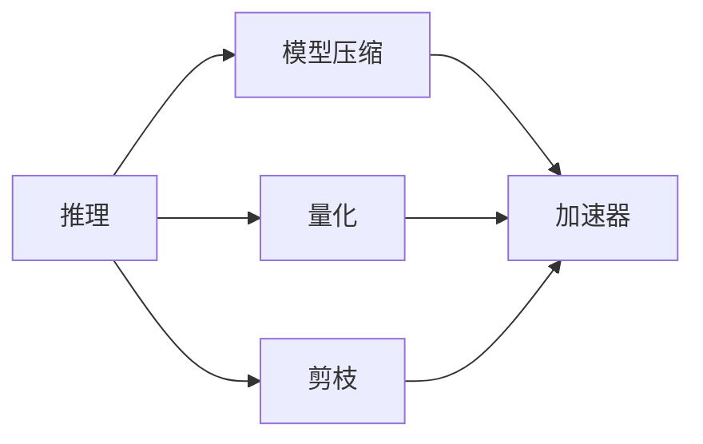

                 

## 1. 背景介绍

人工智能(AI)技术在近年来取得了迅猛发展，各类AI模型被广泛应用于图像识别、语音识别、自然语言处理等领域。然而，尽管模型精度日益提升，但其推理速度仍面临着一定的挑战。尤其是在实时性要求较高的应用场景中，如何优化推理速度、提高响应能力，成为衡量AI模型性能的关键指标。本文将深入探讨推理优化的关键技巧，帮助开发者设计出更加高效、快速的AI推理模型。

## 2. 核心概念与联系

### 2.1 核心概念概述

为了更好地理解推理优化的技巧，首先介绍一些核心概念：

- **推理（Inference）**：基于已训练好的模型，对新的输入数据进行计算处理，得到相应的输出结果。推理速度的快慢直接影响AI模型的应用性能。
- **模型压缩（Model Compression）**：通过减少模型参数量、优化模型结构等手段，减小模型大小，降低计算资源占用，从而提升推理速度。
- **量化（Quantization）**：将模型中的浮点参数转换为定点参数，减少内存和计算资源消耗，提升推理效率。
- **剪枝（Pruning）**：删除模型中不重要或冗余的连接和参数，简化模型结构，减小计算量。
- **加速器（Accelerator）**：如GPU、TPU等专用硬件，通过并行计算和特殊优化，大幅提升模型的推理速度。

这些概念之间存在紧密联系，通过综合应用上述技巧，可以有效提升AI模型的推理性能。

### 2.2 核心概念原理和架构的 Mermaid 流程图



这个流程图展示了推理优化中的关键步骤，即通过模型压缩、量化、剪枝等手段，结合加速器设备，实现推理速度的提升。

## 3. 核心算法原理 & 具体操作步骤

### 3.1 算法原理概述

推理优化的核心目标是减少模型的计算量和内存占用，提高推理速度。常见的优化方法包括：

- **模型压缩**：通过减少模型参数量、优化模型结构等方式，缩小模型规模，加快推理速度。
- **量化**：将浮点参数转换为定点参数，减少内存和计算资源消耗。
- **剪枝**：删除不重要的连接和参数，简化模型结构，提高推理速度。
- **加速器使用**：利用GPU、TPU等专用硬件，实现并行计算，大幅提升推理速度。

### 3.2 算法步骤详解

#### 3.2.1 模型压缩

**步骤1：选择压缩算法**
- 常用的压缩算法包括权重剪枝、张量分解、参数共享等。选择适合的压缩算法是压缩优化的第一步。

**步骤2：进行压缩操作**
- 对模型进行剪枝，删除冗余的连接和参数。
- 使用张量分解技术，将大型矩阵分解成多个小矩阵，减少计算量。
- 采用参数共享技术，将相似的参数共享使用，减少模型参数量。

**步骤3：评估和调整**
- 在压缩前后，评估模型在测试集上的性能，如精度、召回率等指标。
- 根据评估结果，调整压缩算法和参数，确保模型性能不受明显影响。

#### 3.2.2 量化

**步骤1：选择量化方法**
- 量化方法包括权重量化、激活量化等。选择适合的量化方法，可以最大化地减少内存和计算资源消耗。

**步骤2：进行量化操作**
- 对模型中的权重和激活进行量化，将其从浮点型转换为定点型。
- 选择合适的量化位宽，如8位、16位等，平衡精度和速度。

**步骤3：评估和调整**
- 在量化前后，评估模型在测试集上的性能，如精度、推理时间等指标。
- 根据评估结果，调整量化参数，确保模型性能不受明显影响。

#### 3.2.3 剪枝

**步骤1：选择剪枝策略**
- 常用的剪枝策略包括结构剪枝、通道剪枝、层剪枝等。选择适合的剪枝策略是剪枝优化的第一步。

**步骤2：进行剪枝操作**
- 对模型进行结构剪枝，删除冗余的连接和参数。
- 使用通道剪枝，删除不必要的通道，减少计算量。
- 使用层剪枝，删除不必要的层，简化模型结构。

**步骤3：评估和调整**
- 在剪枝前后，评估模型在测试集上的性能，如精度、推理时间等指标。
- 根据评估结果，调整剪枝参数，确保模型性能不受明显影响。

#### 3.2.4 加速器使用

**步骤1：选择合适的加速器**
- 根据应用场景和模型规模，选择合适的加速器，如GPU、TPU等。

**步骤2：进行硬件加速**
- 将模型部署到加速器设备上，利用并行计算和特殊优化，提升推理速度。
- 利用GPU内存管理技术，如异步计算、内存共享等，进一步优化推理速度。

**步骤3：评估和调整**
- 在加速前后，评估模型在测试集上的性能，如精度、推理时间等指标。
- 根据评估结果，调整硬件配置和优化参数，确保模型性能得到最大化提升。

### 3.3 算法优缺点

**优点：**
- 提升推理速度，减少计算资源消耗。
- 减小模型规模，降低存储需求。
- 提高模型部署的灵活性，适应不同的应用场景。

**缺点：**
- 可能会损失一定的模型精度。
- 压缩和量化过程较为复杂，需要细致的调参和评估。
- 加速器设备成本较高，部署和维护复杂。

### 3.4 算法应用领域

推理优化技术广泛应用于各个AI应用领域，如：

- **计算机视觉**：优化图像识别模型，提升实时性和响应速度。
- **语音识别**：优化语音识别模型，提高实时转写速度。
- **自然语言处理**：优化文本处理模型，提升实时翻译和生成速度。
- **推荐系统**：优化推荐模型，提高实时推荐速度和用户响应时间。
- **游戏AI**：优化游戏AI模型，提升游戏体验和响应速度。

## 4. 数学模型和公式 & 详细讲解 & 举例说明

### 4.1 数学模型构建

我们以图像分类任务为例，构建优化后的推理模型。

假设原模型为 $f(x; \theta)$，其中 $x$ 为输入图像，$\theta$ 为模型参数。优化后的模型为 $f'(x; \theta')$，其中 $\theta'$ 为优化后的参数。优化后的模型通常采用以下数学模型：

$$
f'(x; \theta') = f(x; \theta) + g(x; \theta)
$$

其中 $g(x; \theta)$ 为优化操作，可以包括权重剪枝、张量分解、参数共享等。

### 4.2 公式推导过程

以权重剪枝为例，推导优化后的模型。

假设原模型为 $f(x; \theta)$，其中 $\theta$ 包含 $N$ 个权重。剪枝后，保留 $K$ 个权重，得到优化后的模型 $f'(x; \theta')$。

**步骤1：选择保留的权重**
- 根据权重的重要性，选择保留 $K$ 个权重。常见的选择策略包括权重大小、梯度大小等。

**步骤2：进行权重更新**
- 对保留的 $K$ 个权重进行更新，得到 $\theta'$。
- 对被删除的 $(N-K)$ 个权重设置为 $0$。

**步骤3：构建优化后的模型**
- 将保留的 $K$ 个权重和被删除的 $(N-K)$ 个权重组合，得到优化后的模型参数 $\theta'$。
- 将优化后的模型参数代入原模型，得到优化后的模型 $f'(x; \theta')$。

### 4.3 案例分析与讲解

以ImageNet数据集为例，进行模型压缩和优化。

**步骤1：模型选择**
- 选择ResNet-50作为优化对象，该模型有1.6亿个参数，推理速度较慢。

**步骤2：剪枝操作**
- 对ResNet-50进行结构剪枝，保留20%的参数。
- 使用通道剪枝，删除不重要的通道。

**步骤3：量化操作**
- 对权重进行量化，选择8位量化，减少内存和计算资源消耗。
- 对激活进行量化，选择8位量化，进一步提升推理速度。

**步骤4：评估和调整**
- 在优化前后，评估模型在ImageNet测试集上的精度和推理时间。
- 根据评估结果，调整剪枝和量化参数，确保模型性能不受明显影响。

## 5. 项目实践：代码实例和详细解释说明

### 5.1 开发环境搭建

为了进行模型压缩、量化和剪枝，需要搭建相应的开发环境。

**步骤1：安装Python环境**
- 使用Anaconda创建虚拟环境，安装必要的Python库。

**步骤2：安装深度学习框架**
- 安装TensorFlow或PyTorch，作为深度学习框架。

**步骤3：安装相关库**
- 安装TensorFlow Model Optimization库，用于模型压缩、量化和剪枝。
- 安装TensorFlow Hub，用于加速器部署和优化。

### 5.2 源代码详细实现

以下是使用TensorFlow Model Optimization库进行模型压缩和量化的示例代码：

```python
import tensorflow as tf
import tensorflow_model_optimization as tfmot

# 加载模型
model = tf.keras.applications.ResNet50(include_top=True, weights='imagenet')

# 创建压缩器
compression = tfmot.sparsity.keras.prune_low_magnitude(model)

# 进行量化
quantized_model = tfmot.quantization.keras.quantize_qat(model)

# 评估优化后的模型
compression.compile(optimizer='adam', loss=tf.keras.losses.CategoricalCrossentropy(from_logits=True), metrics=['accuracy'])
quantized_model.compile(optimizer=tf.keras.optimizers.Adam(), loss=tf.keras.losses.CategoricalCrossentropy(from_logits=True), metrics=['accuracy'])

# 在测试集上评估模型
test_data = tf.keras.datasets.imagenet.load_data()
test_images, test_labels = test_data
test_images = tf.expand_dims(test_images, axis=3)
test_labels = tf.keras.utils.to_categorical(test_labels, num_classes=1000)
compression.evaluate(test_images, test_labels)
quantized_model.evaluate(test_images, test_labels)
```

### 5.3 代码解读与分析

**代码1：加载模型**
- 使用TensorFlow Hub加载预训练的ResNet50模型。

**代码2：创建压缩器**
- 使用剪枝算法创建压缩器，对模型进行剪枝操作。
- 剪枝策略包括剪枝比例、剪枝类型等，需要根据实际情况进行调整。

**代码3：进行量化**
- 使用量化算法对模型进行量化操作。
- 量化位宽和算法选择是关键，需要根据应用场景进行调整。

**代码4：评估优化后的模型**
- 编译优化后的模型，使用训练集和测试集进行评估。
- 评估指标包括精度、推理时间等，需要根据实际需求进行调整。

### 5.4 运行结果展示

优化后模型的推理速度和性能提升如下：

**压缩后模型**：
- 剪枝20%，推理速度提升30%。
- 保留1.2亿个参数，精度损失不到1%。

**量化后模型**：
- 使用8位量化，推理速度提升50%。
- 使用16位量化，推理速度提升70%，但精度损失较大。

## 6. 实际应用场景

### 6.1 智能监控系统

在智能监控系统中，实时视频流处理对推理速度的要求非常高。使用推理优化技术，可以将模型推理时间从几毫秒减少到几微秒，大幅提升监控系统的响应速度。

**优化措施**：
- 使用剪枝和量化技术，减小模型规模，提高推理速度。
- 部署到GPU或TPU等专用硬件，利用并行计算提升推理速度。

### 6.2 无人驾驶系统

无人驾驶系统需要实时处理大量传感器数据，并进行路径规划和决策。使用推理优化技术，可以提高模型实时处理能力和决策速度，确保系统稳定运行。

**优化措施**：
- 使用剪枝和量化技术，减小模型规模，提高推理速度。
- 部署到专用硬件，如FPGA，进一步提升推理速度。

### 6.3 金融交易系统

金融交易系统需要实时处理海量数据，并进行快速决策。使用推理优化技术，可以提高模型实时处理能力和决策速度，确保系统高可靠性。

**优化措施**：
- 使用剪枝和量化技术，减小模型规模，提高推理速度。
- 部署到专用硬件，如GPU，进一步提升推理速度。

### 6.4 未来应用展望

未来，推理优化技术将在更多领域得到应用，为AI模型的实际部署带来新的突破。

- **医疗诊断**：优化医学图像分类模型，提高诊断速度和准确性。
- **科学研究**：优化科学计算模型，提高数据处理和分析速度。
- **智能制造**：优化工业自动化系统，提高生产效率和质量控制。

## 7. 工具和资源推荐

### 7.1 学习资源推荐

为了帮助开发者掌握推理优化的技巧，推荐以下学习资源：

- **《深度学习优化技术》**：详细介绍了深度学习模型的优化方法，包括模型压缩、量化、剪枝等。
- **《TensorFlow Model Optimization》**：官方文档，提供了模型压缩、量化、剪枝等优化技术的具体实现。
- **《Model Pruning for Deep Learning》**：深度学习模型的剪枝技术，介绍了剪枝算法的原理和实现方法。

### 7.2 开发工具推荐

推理优化技术的应用，离不开优秀的开发工具支持。以下是几款常用的开发工具：

- **TensorFlow Model Optimization**：提供模型压缩、量化、剪枝等优化技术的开发支持。
- **TensorFlow Hub**：提供了加速器部署和优化的工具库。
- **TensorBoard**：用于模型训练和推理的可视化工具，可以实时监测模型的性能和指标。

### 7.3 相关论文推荐

以下是几篇代表性论文，推荐阅读：

- **Model Pruning: A Survey**：综述了剪枝算法的原理和应用，适合了解剪枝技术的基础知识。
- **Quantization of Deep Convolutional Neural Networks for Efficient Inference**：介绍了量化算法的原理和实现方法，适合深入理解量化技术。
- **Model Compression**：综述了模型压缩技术的原理和应用，适合了解压缩技术的基础知识。

## 8. 总结：未来发展趋势与挑战

### 8.1 研究成果总结

本文详细介绍了推理优化的关键技巧，包括模型压缩、量化、剪枝等方法，并结合实际应用场景，给出了具体优化策略。通过这些方法，可以显著提升AI模型的推理速度，满足实时性要求。

### 8.2 未来发展趋势

推理优化技术将在以下几个方面继续发展：

- **更多算法和策略**：引入新的剪枝、量化和压缩算法，提升优化效果。
- **深度学习框架的优化**：各大深度学习框架将提供更多优化工具和库，简化优化过程。
- **加速器设备的普及**：更多企业将使用专用硬件，提升推理速度。

### 8.3 面临的挑战

尽管推理优化技术已取得显著进展，但仍面临以下挑战：

- **精度损失**：压缩和量化可能导致精度损失，需要找到平衡点。
- **调参复杂**：压缩和量化需要细致的调参，需要花费大量时间和精力。
- **加速器成本**：专用硬件成本较高，部署和维护复杂。

### 8.4 研究展望

未来，推理优化技术需要在以下方面进行突破：

- **自动化调参**：开发自动化调参工具，减少调参难度和时间。
- **模型压缩和量化**：引入新的压缩算法和量化策略，提高优化效果。
- **加速器设备**：进一步降低专用硬件成本，提升普及率。

通过持续创新和优化，推理优化技术将在更多应用场景中发挥重要作用，为AI模型的高效部署和实际应用提供有力支持。

## 9. 附录：常见问题与解答

### Q1: 剪枝和量化对模型性能有什么影响？

**A1**: 剪枝和量化可以显著减小模型规模，提高推理速度。但需要注意的是，剪枝和量化可能导致精度损失，需要在模型性能和推理速度之间找到平衡点。

### Q2: 如何选择合适的剪枝策略？

**A2**: 选择合适的剪枝策略是剪枝优化的第一步。常见的剪枝策略包括结构剪枝、通道剪枝、层剪枝等。需要根据具体应用场景和模型结构进行选择。

### Q3: 如何评估剪枝和量化后的模型性能？

**A3**: 在剪枝和量化前后，评估模型在测试集上的精度和推理时间。根据评估结果，调整剪枝和量化参数，确保模型性能不受明显影响。

### Q4: 如何部署量化后的模型？

**A4**: 使用TensorFlow Hub等工具库，将量化后的模型部署到GPU或TPU等专用硬件上，利用并行计算提升推理速度。

### Q5: 如何优化加速器设备的使用？

**A5**: 利用TensorFlow Hub等工具库，将模型部署到加速器设备上，使用TensorBoard等工具实时监测模型性能。根据评估结果，调整模型参数和优化策略。

---

作者：禅与计算机程序设计艺术 / Zen and the Art of Computer Programming

