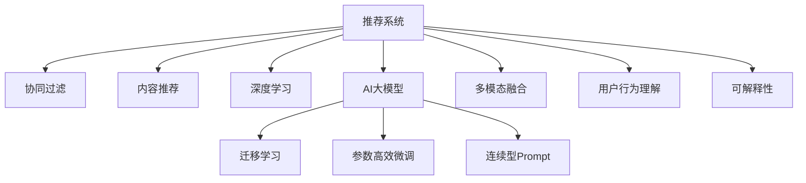

                 

# 推荐系统中AI大模型的探索与利用平衡

## 1. 背景介绍

### 1.1 问题由来

随着人工智能技术的发展，推荐系统已成为互联网领域的一个重要应用。推荐系统通过分析用户的历史行为数据，预测用户的兴趣偏好，从而为用户提供个性化的内容推荐。传统的推荐系统大多基于协同过滤、内容推荐等算法，但随着数据量和模型复杂度的不断提升，推荐系统也面临诸多挑战。如何更高效、准确、可解释地利用AI大模型，成为当前推荐系统优化的一个重要方向。

### 1.2 问题核心关键点

当前推荐系统中，AI大模型如BERT、GPT等，已经被广泛应用于用户行为预测、商品召回、推荐排序等环节。AI大模型的引入，极大地提升了推荐系统的效果。但同时，AI大模型在实际应用中也面临诸多问题，如模型复杂度、计算成本、可解释性等。如何在推荐系统中高效探索与利用AI大模型，需要平衡模型性能与实际应用需求。

### 1.3 问题研究意义

研究推荐系统中AI大模型的探索与利用平衡，具有重要意义：

1. **提升推荐系统效果**：AI大模型通过预训练获得丰富的语言表示，可以更准确地理解用户行为，提升推荐精度。
2. **优化推荐系统计算资源**：大模型参数量巨大，计算成本高昂，但通过合理设计，可以降低计算负担。
3. **增强推荐系统可解释性**：大模型内部结构复杂，难以解释，但通过合适的方法，可以增强推荐系统的透明性和可理解性。
4. **促进推荐系统技术创新**：利用大模型探索新的推荐方法，可以为推荐系统带来更多创新点。
5. **推动推荐系统应用落地**：大模型的引入使得推荐系统更加智能化，有利于在更多场景下得到应用。

## 2. 核心概念与联系

### 2.1 核心概念概述

为更好地理解推荐系统中AI大模型的探索与利用平衡，本节将介绍几个关键概念及其之间的联系：

- **推荐系统(Recommendation System)**：通过分析用户行为数据，预测用户兴趣，为用户推荐个性化内容的技术。
- **协同过滤(Collaborative Filtering)**：通过分析用户行为和物品特征，预测用户对物品的评分，推荐相似物品。
- **内容推荐(Content-Based Recommendation)**：通过分析物品的特征，预测用户对物品的兴趣。
- **深度学习(Deep Learning)**：利用神经网络等方法，从数据中学习模型，进行复杂预测。
- **AI大模型(AI Large Model)**：如BERT、GPT等，通过大规模无标签数据进行预训练，获得强大的语言表示能力。
- **迁移学习(Transfer Learning)**：在预训练模型基础上，通过少量标注数据进行微调，提升模型在新任务上的性能。
- **参数高效微调(Parameter-Efficient Fine-Tuning, PEFT)**：仅更新少量模型参数，保留大部分预训练权重，提升微调效率。
- **连续型Prompt(Continuous Prompt)**：在输入文本中插入连续的提示模板，引导模型生成特定输出。
- **多模态融合(Multimodal Fusion)**：将视觉、文本、音频等多模态数据融合，提升推荐系统的表现。
- **用户行为理解(User Behavior Understanding)**：通过分析用户历史行为数据，理解用户兴趣偏好，提供个性化推荐。
- **可解释性(Explainability)**：使推荐系统输出易于理解，增强用户信任。

这些核心概念之间的逻辑关系可以通过以下Mermaid流程图来展示：



这个流程图展示了推荐系统的核心概念及其之间的关系：

1. 推荐系统基于用户行为数据进行内容推荐。
2. 协同过滤和内容推荐是推荐系统的两种主要方法。
3. 深度学习和AI大模型提供更强大的预测能力。
4. 迁移学习可以在新任务上利用预训练知识。
5. 参数高效微调可以在保持预训练权重的情况下，高效更新模型。
6. 连续型Prompt可以增强模型的生成能力。
7. 多模态融合将多种数据源结合，提升推荐精度。
8. 用户行为理解需要分析用户历史行为数据。
9. 可解释性使推荐系统输出易于理解，增强用户信任。

这些概念共同构成了推荐系统的技术框架，使得系统能够更好地理解和推荐用户兴趣内容。

## 3. 核心算法原理 & 具体操作步骤
### 3.1 算法原理概述

在推荐系统中，AI大模型的探索与利用平衡主要通过以下步骤实现：

1. **数据准备**：收集用户行为数据，将其转化为模型可以处理的格式。
2. **模型选择**：选择合适的AI大模型，如BERT、GPT等，作为推荐模型的基础。
3. **特征提取**：利用大模型提取用户行为和物品特征的表示。
4. **模型微调**：通过少量标注数据，对大模型进行微调，使其适应推荐任务。
5. **输出预测**：使用微调后的模型进行用户兴趣预测，生成推荐结果。

这些步骤中的关键技术包括数据预处理、特征提取、模型微调、输出预测等。

### 3.2 算法步骤详解

**Step 1: 数据准备**

1. **用户行为数据收集**：收集用户在平台上的浏览、点击、评分、购买等行为数据。
2. **数据清洗和预处理**：去除无效数据，将数据转换为适合模型处理的格式。
3. **特征构建**：提取用户行为和物品的特征，如用户兴趣标签、物品属性等。

**Step 2: 模型选择**

1. **选择合适的AI大模型**：根据任务需求，选择合适的预训练大模型。
2. **模型加载**：使用Python或PyTorch等框架，加载预训练模型。

**Step 3: 特征提取**

1. **用户行为特征提取**：使用大模型提取用户历史行为的语义表示。
2. **物品特征提取**：使用大模型提取物品的语义表示。
3. **特征拼接**：将用户行为特征和物品特征拼接，生成用于模型预测的向量表示。

**Step 4: 模型微调**

1. **微调准备**：选择合适的任务，如评分预测、商品召回等。
2. **标注数据准备**：收集少量标注数据，作为微调的监督信号。
3. **微调模型**：使用标注数据对大模型进行微调，调整顶层分类器或解码器。
4. **模型评估**：在验证集上评估微调后的模型性能。

**Step 5: 输出预测**

1. **预测生成**：使用微调后的模型进行用户兴趣预测，生成推荐结果。
2. **推荐展示**：将推荐结果展示给用户，提供个性化内容。

### 3.3 算法优缺点

基于AI大模型的推荐系统具有以下优点：

1. **高效性**：通过预训练获得大量语言知识，在推荐任务上只需少量标注数据即可完成微调。
2. **准确性**：大模型能够理解复杂语言，提供更准确的预测结果。
3. **可解释性**：可以通过微调中的日志和输出结果，分析模型的决策过程。
4. **灵活性**：可以利用多模态数据进行融合，提升推荐效果。

同时，也存在一些缺点：

1. **计算成本高**：大模型参数量巨大，计算成本较高。
2. **可解释性不足**：大模型内部结构复杂，难以解释。
3. **过拟合风险**：仅通过少量标注数据进行微调，模型可能过拟合。
4. **模型复杂度高**：模型结构复杂，难以优化和调试。

### 3.4 算法应用领域

基于AI大模型的推荐系统，已经在多个领域得到应用，包括：

1. **电商推荐**：根据用户浏览记录和商品特征，推荐个性化商品。
2. **视频推荐**：根据用户观看记录和视频内容，推荐相关视频。
3. **音乐推荐**：根据用户听歌记录和歌曲特征，推荐个性化音乐。
4. **新闻推荐**：根据用户阅读记录和新闻内容，推荐相关新闻。
5. **图书推荐**：根据用户阅读记录和图书特征，推荐个性化图书。
6. **社交推荐**：根据用户互动记录和用户特征，推荐好友和相关内容。
7. **游戏推荐**：根据用户游戏行为和游戏特征，推荐个性化游戏。

此外，AI大模型在医疗、教育、金融等更多领域也有潜在应用，拓展了推荐系统的边界。

## 4. 数学模型和公式 & 详细讲解
### 4.1 数学模型构建

在推荐系统中，AI大模型的探索与利用平衡主要通过以下数学模型进行构建：

1. **用户行为向量**：将用户历史行为数据转化为向量表示，记为 $u$。
2. **物品特征向量**：将物品的特征转化为向量表示，记为 $i$。
3. **用户兴趣预测**：使用AI大模型 $M_{\theta}$ 进行用户兴趣预测，输出预测结果 $p$。

数学模型可以表示为：

$$
u \leftarrow f_{user}(D_u)
$$

$$
i \leftarrow f_{item}(D_i)
$$

$$
p \leftarrow M_{\theta}(u, i)
$$

其中 $D_u$ 和 $D_i$ 分别为用户和物品的特征表示，$f_{user}$ 和 $f_{item}$ 分别为用户和物品特征的提取函数，$M_{\theta}$ 为预训练大模型。

### 4.2 公式推导过程

以评分预测任务为例，推导AI大模型进行用户兴趣预测的公式。

1. **用户行为向量**：
$$
u = \sum_{d \in D_u} w_d d
$$

其中 $w_d$ 为特征 $d$ 的权重，可以通过训练获得。

2. **物品特征向量**：
$$
i = \sum_{f \in D_i} v_f f
$$

其中 $v_f$ 为特征 $f$ 的权重，也可以通过训练获得。

3. **用户兴趣预测**：
$$
p = M_{\theta}(u, i)
$$

在模型训练过程中，需要最小化预测结果与真实标签之间的损失函数 $L$：

$$
L = \sum_{(x,y) \in D} ||p(x, y) - y||^2
$$

其中 $p(x, y)$ 为模型预测的评分，$y$ 为真实评分。

### 4.3 案例分析与讲解

**案例：电商推荐系统**

假设电商平台上用户浏览了某商品，我们需要根据用户的历史浏览记录和商品特征，预测用户对该商品的评分。

1. **用户行为向量**：
$$
u = \sum_{d \in D_u} w_d d
$$

其中 $D_u$ 包括用户的浏览记录、购买记录、评分记录等，$w_d$ 为特征 $d$ 的权重。

2. **物品特征向量**：
$$
i = \sum_{f \in D_i} v_f f
$$

其中 $D_i$ 包括商品的描述、分类、价格等，$v_f$ 为特征 $f$ 的权重。

3. **用户兴趣预测**：
$$
p = M_{\theta}(u, i)
$$

其中 $M_{\theta}$ 为预训练大模型，可以是BERT、GPT等。

4. **评分预测**：
$$
\hat{y} = M_{\theta}(u, i)
$$

在训练过程中，需要最小化预测结果与真实评分之间的损失函数 $L$：

$$
L = \sum_{(x,y) \in D} ||\hat{y} - y||^2
$$

其中 $D$ 为训练数据集，$(x,y)$ 为数据样本和真实评分，$\hat{y}$ 为模型预测的评分。

通过上述公式推导，可以看到，使用AI大模型进行电商推荐系统用户兴趣预测，需要构建用户行为向量和物品特征向量，通过大模型预测评分，最小化损失函数进行训练。

## 5. 项目实践：代码实例和详细解释说明
### 5.1 开发环境搭建

在进行推荐系统开发前，我们需要准备好开发环境。以下是使用Python进行PyTorch开发的环境配置流程：

1. 安装Anaconda：从官网下载并安装Anaconda，用于创建独立的Python环境。

2. 创建并激活虚拟环境：
```bash
conda create -n pytorch-env python=3.8 
conda activate pytorch-env
```

3. 安装PyTorch：根据CUDA版本，从官网获取对应的安装命令。例如：
```bash
conda install pytorch torchvision torchaudio cudatoolkit=11.1 -c pytorch -c conda-forge
```

4. 安装TensorFlow：
```bash
pip install tensorflow
```

5. 安装TensorBoard：
```bash
pip install tensorboard
```

6. 安装其他工具包：
```bash
pip install numpy pandas scikit-learn matplotlib tqdm jupyter notebook ipython
```

完成上述步骤后，即可在`pytorch-env`环境中开始推荐系统开发。

### 5.2 源代码详细实现

下面我们以电商推荐系统为例，给出使用PyTorch对BERT模型进行推荐系统微调的PyTorch代码实现。

首先，定义电商推荐系统的数据处理函数：

```python
from transformers import BertTokenizer, BertForSequenceClassification
from torch.utils.data import Dataset
import torch

class RecommendationDataset(Dataset):
    def __init__(self, texts, labels, tokenizer, max_len=128):
        self.texts = texts
        self.labels = labels
        self.tokenizer = tokenizer
        self.max_len = max_len
        
    def __len__(self):
        return len(self.texts)
    
    def __getitem__(self, item):
        text = self.texts[item]
        label = self.labels[item]
        
        encoding = self.tokenizer(text, return_tensors='pt', max_length=self.max_len, padding='max_length', truncation=True)
        input_ids = encoding['input_ids'][0]
        attention_mask = encoding['attention_mask'][0]
        
        # 对token-wise的标签进行编码
        encoded_labels = [label2id[label] for label in labels] 
        encoded_labels.extend([label2id['O']] * (self.max_len - len(encoded_labels)))
        labels = torch.tensor(encoded_labels, dtype=torch.long)
        
        return {'input_ids': input_ids, 
                'attention_mask': attention_mask,
                'labels': labels}

# 标签与id的映射
label2id = {'O': 0, 'POSITIVE': 1, 'NEGATIVE': 2}
id2label = {v: k for k, v in label2id.items()}

# 创建dataset
tokenizer = BertTokenizer.from_pretrained('bert-base-cased')

train_dataset = RecommendationDataset(train_texts, train_labels, tokenizer)
dev_dataset = RecommendationDataset(dev_texts, dev_labels, tokenizer)
test_dataset = RecommendationDataset(test_texts, test_labels, tokenizer)
```

然后，定义模型和优化器：

```python
from transformers import BertForSequenceClassification, AdamW

model = BertForSequenceClassification.from_pretrained('bert-base-cased', num_labels=len(label2id))

optimizer = AdamW(model.parameters(), lr=2e-5)
```

接着，定义训练和评估函数：

```python
from torch.utils.data import DataLoader
from tqdm import tqdm
from sklearn.metrics import classification_report

device = torch.device('cuda') if torch.cuda.is_available() else torch.device('cpu')
model.to(device)

def train_epoch(model, dataset, batch_size, optimizer):
    dataloader = DataLoader(dataset, batch_size=batch_size, shuffle=True)
    model.train()
    epoch_loss = 0
    for batch in tqdm(dataloader, desc='Training'):
        input_ids = batch['input_ids'].to(device)
        attention_mask = batch['attention_mask'].to(device)
        labels = batch['labels'].to(device)
        model.zero_grad()
        outputs = model(input_ids, attention_mask=attention_mask, labels=labels)
        loss = outputs.loss
        epoch_loss += loss.item()
        loss.backward()
        optimizer.step()
    return epoch_loss / len(dataloader)

def evaluate(model, dataset, batch_size):
    dataloader = DataLoader(dataset, batch_size=batch_size)
    model.eval()
    preds, labels = [], []
    with torch.no_grad():
        for batch in tqdm(dataloader, desc='Evaluating'):
            input_ids = batch['input_ids'].to(device)
            attention_mask = batch['attention_mask'].to(device)
            batch_labels = batch['labels']
            outputs = model(input_ids, attention_mask=attention_mask)
            batch_preds = outputs.logits.argmax(dim=2).to('cpu').tolist()
            batch_labels = batch_labels.to('cpu').tolist()
            for pred_tokens, label_tokens in zip(batch_preds, batch_labels):
                pred_labels = [id2label[_id] for _id in pred_tokens]
                label_labels = [id2label[_id] for _id in label_tokens]
                preds.append(pred_labels[:len(label_labels)])
                labels.append(label_labels)
                
    print(classification_report(labels, preds))
```

最后，启动训练流程并在测试集上评估：

```python
epochs = 5
batch_size = 16

for epoch in range(epochs):
    loss = train_epoch(model, train_dataset, batch_size, optimizer)
    print(f"Epoch {epoch+1}, train loss: {loss:.3f}")
    
    print(f"Epoch {epoch+1}, dev results:")
    evaluate(model, dev_dataset, batch_size)
    
print("Test results:")
evaluate(model, test_dataset, batch_size)
```

以上就是使用PyTorch对BERT进行电商推荐系统微调的完整代码实现。可以看到，得益于Transformers库的强大封装，我们可以用相对简洁的代码完成BERT模型的加载和微调。

### 5.3 代码解读与分析

让我们再详细解读一下关键代码的实现细节：

**RecommendationDataset类**：
- `__init__`方法：初始化文本、标签、分词器等关键组件。
- `__len__`方法：返回数据集的样本数量。
- `__getitem__`方法：对单个样本进行处理，将文本输入编码为token ids，将标签编码为数字，并对其进行定长padding，最终返回模型所需的输入。

**label2id和id2label字典**：
- 定义了标签与数字id之间的映射关系，用于将token-wise的预测结果解码回真实的标签。

**训练和评估函数**：
- 使用PyTorch的DataLoader对数据集进行批次化加载，供模型训练和推理使用。
- 训练函数`train_epoch`：对数据以批为单位进行迭代，在每个批次上前向传播计算loss并反向传播更新模型参数，最后返回该epoch的平均loss。
- 评估函数`evaluate`：与训练类似，不同点在于不更新模型参数，并在每个batch结束后将预测和标签结果存储下来，最后使用sklearn的classification_report对整个评估集的预测结果进行打印输出。

**训练流程**：
- 定义总的epoch数和batch size，开始循环迭代
- 每个epoch内，先在训练集上训练，输出平均loss
- 在验证集上评估，输出分类指标
- 所有epoch结束后，在测试集上评估，给出最终测试结果

可以看到，PyTorch配合Transformers库使得BERT微调的代码实现变得简洁高效。开发者可以将更多精力放在数据处理、模型改进等高层逻辑上，而不必过多关注底层的实现细节。

当然，工业级的系统实现还需考虑更多因素，如模型的保存和部署、超参数的自动搜索、更灵活的任务适配层等。但核心的微调范式基本与此类似。

## 6. 实际应用场景
### 6.1 智能客服系统

基于大语言模型微调的对话技术，可以广泛应用于智能客服系统的构建。传统客服往往需要配备大量人力，高峰期响应缓慢，且一致性和专业性难以保证。而使用微调后的对话模型，可以7x24小时不间断服务，快速响应客户咨询，用自然流畅的语言解答各类常见问题。

在技术实现上，可以收集企业内部的历史客服对话记录，将问题和最佳答复构建成监督数据，在此基础上对预训练对话模型进行微调。微调后的对话模型能够自动理解用户意图，匹配最合适的答案模板进行回复。对于客户提出的新问题，还可以接入检索系统实时搜索相关内容，动态组织生成回答。如此构建的智能客服系统，能大幅提升客户咨询体验和问题解决效率。

### 6.2 金融舆情监测

金融机构需要实时监测市场舆论动向，以便及时应对负面信息传播，规避金融风险。传统的人工监测方式成本高、效率低，难以应对网络时代海量信息爆发的挑战。基于大语言模型微调的文本分类和情感分析技术，为金融舆情监测提供了新的解决方案。

具体而言，可以收集金融领域相关的新闻、报道、评论等文本数据，并对其进行主题标注和情感标注。在此基础上对预训练语言模型进行微调，使其能够自动判断文本属于何种主题，情感倾向是正面、中性还是负面。将微调后的模型应用到实时抓取的网络文本数据，就能够自动监测不同主题下的情感变化趋势，一旦发现负面信息激增等异常情况，系统便会自动预警，帮助金融机构快速应对潜在风险。

### 6.3 个性化推荐系统

当前的推荐系统往往只依赖用户的历史行为数据进行物品推荐，无法深入理解用户的真实兴趣偏好。基于大语言模型微调技术，个性化推荐系统可以更好地挖掘用户行为背后的语义信息，从而提供更精准、多样的推荐内容。

在实践中，可以收集用户浏览、点击、评论、分享等行为数据，提取和用户交互的物品标题、描述、标签等文本内容。将文本内容作为模型输入，用户的后续行为（如是否点击、购买等）作为监督信号，在此基础上微调预训练语言模型。微调后的模型能够从文本内容中准确把握用户的兴趣点。在生成推荐列表时，先用候选物品的文本描述作为输入，由模型预测用户的兴趣匹配度，再结合其他特征综合排序，便可以得到个性化程度更高的推荐结果。

### 6.4 未来应用展望

随着大语言模型微调技术的发展，推荐系统将在更多领域得到应用，为传统行业带来变革性影响。

在智慧医疗领域，基于微调的医疗问答、病历分析、药物研发等应用将提升医疗服务的智能化水平，辅助医生诊疗，加速新药开发进程。

在智能教育领域，微调技术可应用于作业批改、学情分析、知识推荐等方面，因材施教，促进教育公平，提高教学质量。

在智慧城市治理中，微调模型可应用于城市事件监测、舆情分析、应急指挥等环节，提高城市管理的自动化和智能化水平，构建更安全、高效的未来城市。

此外，在企业生产、社会治理、文娱传媒等众多领域，基于大模型微调的人工智能应用也将不断涌现，为经济社会发展注入新的动力。相信随着技术的日益成熟，微调方法将成为推荐系统应用的重要范式，推动人工智能技术在更多垂直行业的落地。

## 7. 工具和资源推荐
### 7.1 学习资源推荐

为了帮助开发者系统掌握推荐系统中AI大模型的探索与利用平衡，这里推荐一些优质的学习资源：

1. 《推荐系统实践》系列博文：由大模型技术专家撰写，深入浅出地介绍了推荐系统核心概念和经典算法。

2. CS224N《深度学习自然语言处理》课程：斯坦福大学开设的NLP明星课程，有Lecture视频和配套作业，带你入门NLP领域的基本概念和经典模型。

3. 《深度学习与推荐系统》书籍：详细介绍了深度学习在推荐系统中的应用，包括大模型微调等前沿技术。

4. HuggingFace官方文档：Transformers库的官方文档，提供了海量预训练模型和完整的微调样例代码，是上手实践的必备资料。

5. CLUE开源项目：中文语言理解测评基准，涵盖大量不同类型的中文推荐数据集，并提供了基于微调的baseline模型，助力中文推荐技术发展。

通过对这些资源的学习实践，相信你一定能够快速掌握大模型微调的精髓，并用于解决实际的推荐问题。
### 7.2 开发工具推荐

高效的开发离不开优秀的工具支持。以下是几款用于推荐系统开发常用的工具：

1. PyTorch：基于Python的开源深度学习框架，灵活动态的计算图，适合快速迭代研究。大部分预训练语言模型都有PyTorch版本的实现。

2. TensorFlow：由Google主导开发的开源深度学习框架，生产部署方便，适合大规模工程应用。同样有丰富的预训练语言模型资源。

3. Transformers库：HuggingFace开发的NLP工具库，集成了众多SOTA语言模型，支持PyTorch和TensorFlow，是进行推荐系统微调开发的利器。

4. Weights & Biases：模型训练的实验跟踪工具，可以记录和可视化模型训练过程中的各项指标，方便对比和调优。与主流深度学习框架无缝集成。

5. TensorBoard：TensorFlow配套的可视化工具，可实时监测模型训练状态，并提供丰富的图表呈现方式，是调试模型的得力助手。

6. Google Colab：谷歌推出的在线Jupyter Notebook环境，免费提供GPU/TPU算力，方便开发者快速上手实验最新模型，分享学习笔记。

合理利用这些工具，可以显著提升推荐系统微调的开发效率，加快创新迭代的步伐。

### 7.3 相关论文推荐

推荐系统中AI大模型的探索与利用平衡的研究源于学界的持续研究。以下是几篇奠基性的相关论文，推荐阅读：

1. Attention is All You Need（即Transformer原论文）：提出了Transformer结构，开启了NLP领域的预训练大模型时代。

2. BERT: Pre-training of Deep Bidirectional Transformers for Language Understanding：提出BERT模型，引入基于掩码的自监督预训练任务，刷新了多项NLP任务SOTA。

3. Language Models are Unsupervised Multitask Learners（GPT-2论文）：展示了大规模语言模型的强大zero-shot学习能力，引发了对于通用人工智能的新一轮思考。

4. Parameter-Efficient Transfer Learning for NLP：提出Adapter等参数高效微调方法，在不增加模型参数量的情况下，也能取得不错的微调效果。

5. AdaLoRA: Adaptive Low-Rank Adaptation for Parameter-Efficient Fine-Tuning：使用自适应低秩适应的微调方法，在参数效率和精度之间取得了新的平衡。

6. Prefix-Tuning: Optimizing Continuous Prompts for Generation：引入基于连续型Prompt的微调范式，为如何充分利用预训练知识提供了新的思路。

这些论文代表了大语言模型微调技术的发展脉络。通过学习这些前沿成果，可以帮助研究者把握学科前进方向，激发更多的创新灵感。

## 8. 总结：未来发展趋势与挑战
### 8.1 总结

本文对推荐系统中AI大模型的探索与利用平衡进行了全面系统的介绍。首先阐述了推荐系统和大模型的研究背景和意义，明确了AI大模型在推荐系统优化中的独特价值。其次，从原理到实践，详细讲解了推荐系统中AI大模型的微调方法，给出了微调任务开发的完整代码实例。同时，本文还广泛探讨了AI大模型在智能客服、金融舆情、个性化推荐等多个行业领域的应用前景，展示了AI大模型的巨大潜力。此外，本文精选了微调技术的各类学习资源，力求为读者提供全方位的技术指引。

通过本文的系统梳理，可以看到，AI大模型在推荐系统中的应用，极大提升了推荐系统的精度和效果。但同时，AI大模型在实际应用中也面临诸多问题，如计算成本、可解释性等。如何在推荐系统中高效探索与利用AI大模型，需要平衡模型性能与实际应用需求。

### 8.2 未来发展趋势

展望未来，AI大模型在推荐系统中的应用将呈现以下几个发展趋势：

1. **模型规模持续增大**：随着算力成本的下降和数据规模的扩张，预训练语言模型的参数量还将持续增长。超大规模语言模型蕴含的丰富语言知识，有望支撑更加复杂多变的推荐任务。

2. **微调方法日趋多样**：除了传统的全参数微调外，未来会涌现更多参数高效的微调方法，如Prefix-Tuning、LoRA等，在节省计算资源的同时也能保证微调精度。

3. **多模态融合崛起**：当前的推荐系统大多聚焦于文本数据，未来会进一步拓展到图像、视频、音频等多模态数据微调。多模态信息的融合，将显著提升推荐系统的表现。

4. **知识整合能力提升**：未来的推荐系统将更加注重融合外部知识库、规则库等专家知识，提升系统的智能化水平。

5. **模型通用性增强**：经过海量数据的预训练和多领域任务的微调，未来的推荐系统将具备更强大的常识推理和跨领域迁移能力。

以上趋势凸显了大模型在推荐系统中的广阔前景。这些方向的探索发展，必将进一步提升推荐系统的性能和应用范围，为人工智能技术在更多领域的落地带来新的机遇。

### 8.3 面临的挑战

尽管AI大模型在推荐系统中已经取得了显著效果，但在迈向更加智能化、普适化应用的过程中，它仍面临诸多挑战：

1. **计算成本高**：大模型参数量巨大，计算成本较高，但通过合理设计，可以降低计算负担。

2. **可解释性不足**：大模型内部结构复杂，难以解释，但通过合适的方法，可以增强推荐系统的透明性和可理解性。

3. **过拟合风险**：仅通过少量标注数据进行微调，模型可能过拟合。

4. **模型复杂度高**：模型结构复杂，难以优化和调试。

### 8.4 研究展望

面对AI大模型在推荐系统中面临的挑战，未来的研究需要在以下几个方面寻求新的突破：

1. **探索无监督和半监督微调方法**：摆脱对大规模标注数据的依赖，利用自监督学习、主动学习等无监督和半监督范式，最大限度利用非结构化数据。

2. **研究参数高效和计算高效的微调范式**：开发更加参数高效的微调方法，在固定大部分预训练参数的同时，只更新极少量的任务相关参数。同时优化微调模型的计算图，减少前向传播和反向传播的资源消耗，实现更加轻量级、实时性的部署。

3. **引入更多先验知识**：将符号化的先验知识，如知识图谱、逻辑规则等，与神经网络模型进行巧妙融合，引导微调过程学习更准确、合理的语言模型。

4. **结合因果分析和博弈论工具**：将因果分析方法引入微调模型，识别出模型决策的关键特征，增强输出解释的因果性和逻辑性。

5. **纳入伦理道德约束**：在模型训练目标中引入伦理导向的评估指标，过滤和惩罚有偏见、有害的输出倾向。

这些研究方向的探索，必将引领AI大模型在推荐系统中的应用走向成熟，为构建安全、可靠、可解释、可控的智能推荐系统铺平道路。面向未来，AI大模型将在更多垂直领域得到应用，推动人工智能技术在经济社会中的广泛落地。

## 9. 附录：常见问题与解答

**Q1：AI大模型是否适用于所有推荐系统？**

A: AI大模型在推荐系统中具有广泛的应用前景，但对于特定领域的推荐系统，如医疗、法律等，仅仅依靠通用语料预训练的模型可能难以很好地适应。此时需要在特定领域语料上进一步预训练，再进行微调，才能获得理想效果。

**Q2：如何选择适合推荐系统的AI大模型？**

A: 选择合适的AI大模型，需要考虑以下几个因素：
1. 推荐任务类型：如评分预测、商品召回等。
2. 数据规模：如数据量、多样性等。
3. 计算资源：如GPU/TPU算力、内存等。
4. 模型性能：如精度、效率等。

一般建议选择已经在大规模数据上预训练过的通用大模型，如BERT、GPT等。

**Q3：在推荐系统中如何避免过拟合？**

A: 避免过拟合，主要可以通过以下策略：
1. 数据增强：通过回译、近义替换等方式扩充训练集。
2. 正则化：使用L2正则、Dropout、Early Stopping等防止过拟合。
3. 对抗训练：加入对抗样本，提高模型鲁棒性。
4. 参数高效微调：只更新少量参数，保留大部分预训练权重。

这些策略需要根据具体任务和数据特点进行灵活组合。

**Q4：AI大模型在推荐系统中的可解释性不足，如何解决？**

A: 提高推荐系统的可解释性，可以从以下几个方面入手：
1. 输出解释：通过模型输出结果和预测路径，分析模型的决策过程。
2. 特征可视化：利用可视化工具，展示模型的特征权重。
3. 文本解释：通过引入自然语言解释，增强模型输出的可理解性。
4. 多模型集成：通过集成多个模型，提供多样化的解释结果。

这些方法可以结合使用，提升推荐系统的透明性和可解释性。

**Q5：AI大模型在推荐系统中的计算成本高，如何解决？**

A: 降低计算成本，主要可以通过以下策略：
1. 模型压缩：通过量化、剪枝等方法，减小模型规模。
2. 混合精度训练：使用混合精度计算，减少内存占用。
3. 模型并行：通过模型并行化，分摊计算负担。
4. 分布式训练：使用分布式训练框架，提升计算效率。

这些策略需要根据具体场景进行综合考虑，以达到最佳的计算资源利用率。

---

作者：禅与计算机程序设计艺术 / Zen and the Art of Computer Programming

