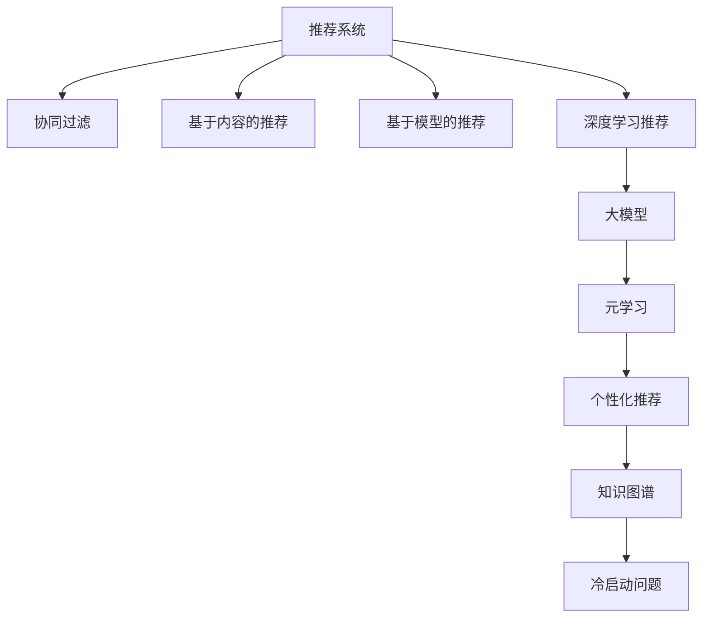

                 

# 推荐系统中的大模型元学习个性化

> 关键词：推荐系统,大模型,元学习,个性化,深度学习,协同过滤

## 1. 背景介绍

### 1.1 问题由来

推荐系统是互联网时代为用户提供个性化内容推荐的核心技术，广泛应用于电商、新闻、视频、社交网络等众多领域。传统的协同过滤算法，如基于用户的协同过滤、基于物品的协同过滤等，在面对大规模稀疏数据时，往往难以有效捕捉用户兴趣和物品属性间的复杂关系，造成推荐效果欠佳。近年来，深度学习方法被广泛应用于推荐系统，利用神经网络模型学习用户和物品间的隐式关联，显著提升了推荐效果。然而，深度学习模型需要大量的标注数据进行预训练和微调，成本较高，且在迁移应用到新领域时效果不佳。

为了解决这些问题，研究者们提出了元学习(meta-learning)的思路。元学习即通过学习元知识，使模型能够快速适应新领域、新任务，显著提升模型的泛化能力和迁移能力。元学习结合了大规模预训练模型的优势，不仅节省了大量标注成本，还能快速提升推荐效果，具有广泛的应用前景。

## 2. 核心概念与联系

### 2.1 核心概念概述

为了更好地理解推荐系统中的大模型元学习个性化，本节将介绍几个密切相关的核心概念：

- 推荐系统(Recommender System)：利用算法向用户推荐其可能感兴趣的物品的系统。经典的推荐算法包括协同过滤、基于内容的推荐、基于模型的推荐等。
- 大模型(Large Model)：指具有数十亿甚至数百亿参数的大规模深度学习模型，如BERT、GPT等。通过在大规模数据上进行预训练，学习到丰富的语言、视觉、音频等多种模态的信息，具备强大的表示能力。
- 元学习(Meta-Learning)：指模型通过学习如何快速适应新任务、新数据的能力，从而提升模型的泛化能力和迁移能力。常见的元学习方法包括基于参数的元学习、基于特征的元学习等。
- 个性化推荐(Personalized Recommendation)：指针对特定用户定制化推荐，避免千人一面，提升用户体验和满意度。
- 协同过滤(Collaborative Filtering)：通过分析用户的行为数据，寻找相似用户或相似物品，推荐用户可能感兴趣的内容。
- 知识图谱(Knowledge Graph)：指基于图结构描述实体间关系的知识库，可以用于提升推荐系统的表示能力，提供更准确的推荐结果。
- 冷启动问题(Cold-Start Problem)：指新用户或物品加入推荐系统时，由于缺乏足够历史数据，导致无法进行准确推荐的问题。

这些核心概念之间的逻辑关系可以通过以下Mermaid流程图来展示：



这个流程图展示了推荐系统的核心概念及其之间的关系：

1. 推荐系统通过多种算法为用户推荐物品，其中深度学习推荐结合了大模型，提升了推荐效果。
2. 大模型通过预训练获取了丰富的信息，增强了推荐系统对复杂关系的建模能力。
3. 元学习利用大模型的表示能力，帮助模型快速适应新任务，提升泛化能力。
4. 个性化推荐结合了用户画像和物品属性，提供更精准的推荐内容。
5. 知识图谱提供领域知识，丰富了推荐系统的信息来源。
6. 冷启动问题通过引入元学习和知识图谱等技术，解决新用户和新物品推荐难题。

这些概念共同构成了推荐系统的核心技术框架，使得推荐系统能够更好地理解和满足用户的个性化需求。

## 3. 核心算法原理 & 具体操作步骤
### 3.1 算法原理概述

在推荐系统中，元学习通常指学习如何调整模型参数，使其能够快速适应新领域或新任务。其核心思想是通过学习模型在不同数据集上的迁移能力，提升模型的泛化能力和个性化推荐精度。

在大模型元学习个性化推荐中，通常将推荐任务视为一个序列标注问题。用户-物品对可以表示为一个序列，每个物品对应一个标注。元学习模型通过学习如何将用户-物品序列映射为推荐结果，实现快速适应不同用户的个性化需求。

具体来说，假设存在一个通用的深度神经网络 $M_{\theta}$，其中 $\theta$ 为模型参数。在推荐任务上，我们定义目标函数 $\mathcal{L}$，用于衡量模型在特定用户-物品序列上的预测结果与真实标签之间的差异。常见的目标函数包括交叉熵损失、对数似然损失等。

在大模型元学习个性化推荐中，我们需要设计一个元学习算法，使得模型能够根据用户的兴趣偏好和物品属性，快速适应推荐任务。通常采用的方法是：

1. 首先在大规模数据集上预训练一个大模型 $M_{\theta}$，学习通用的表示能力。
2. 然后使用元学习算法对 $M_{\theta}$ 进行微调，使其能够适应新用户的个性化需求。
3. 在推荐时，根据用户历史行为和物品属性，动态生成推荐结果。

### 3.2 算法步骤详解

基于大模型元学习个性化推荐的大致步骤如下：

**Step 1: 准备数据集**

- 收集推荐任务的相关数据集，如用户行为数据、物品属性数据等。
- 对数据集进行预处理，如清洗、分词、归一化等。
- 将数据集划分为训练集、验证集和测试集，确保数据分布一致。

**Step 2: 构建元学习算法**

- 选择元学习算法，如Meta-Learning for Personalized Recommendation(MLPR)、Adaptive Meta-Learning(AMR)等。
- 定义元学习任务，如最大化平均推荐准确率、最小化均方误差等。
- 设计元学习目标函数，如优化平均推荐准确率、最大化均方误差等。
- 确定元学习策略，如随机梯度下降、在线梯度下降等。

**Step 3: 预训练大模型**

- 在大规模推荐数据集上预训练一个大模型 $M_{\theta}$，学习通用的表示能力。
- 选择合适的优化器和超参数，如AdamW、SGD等，设置学习率、批大小、迭代轮数等。
- 对模型进行正则化处理，如L2正则、Dropout等，防止过拟合。

**Step 4: 元学习微调**

- 使用元学习算法对预训练模型进行微调，使其能够适应不同用户的个性化需求。
- 在每个epoch内，对元学习任务进行优化，调整模型参数。
- 在验证集上评估元学习模型性能，确保模型不会过拟合。
- 重复以上步骤，直至达到预设的迭代轮数或性能指标。

**Step 5: 推荐结果生成**

- 根据用户历史行为和物品属性，动态生成推荐结果。
- 将推荐结果可视化，展示给用户。
- 定期收集用户反馈，对元学习模型进行优化和调整。

### 3.3 算法优缺点

基于大模型元学习个性化推荐具有以下优点：

1. 高效性：元学习模型能够快速适应新用户的个性化需求，显著提升推荐效率。
2. 泛化能力：元学习模型具有较强的泛化能力，能够适应不同领域的推荐任务。
3. 数据灵活性：元学习模型可以处理多模态数据，结合文本、图像、音频等多种信息，提升推荐效果。
4. 学习效率：元学习模型通过学习元知识，能够快速提升推荐效果，避免从头训练大模型的高成本和时间消耗。

但同时也存在一些缺点：

1. 计算资源需求高：大模型元学习个性化推荐需要高性能的计算设备，对硬件资源要求较高。
2. 模型复杂度高：元学习模型结构复杂，训练和推理所需的时间和计算资源较多。
3. 数据需求大：虽然元学习模型能够快速适应新任务，但在大规模数据集上预训练模型仍需大量标注数据。
4. 模型训练时间长：元学习模型训练时间较长，需要耐心等待模型收敛。

### 3.4 算法应用领域

基于大模型元学习个性化推荐已经在电商推荐、新闻推荐、视频推荐等多个领域得到广泛应用，取得了显著的推荐效果。例如：

- 电商推荐：利用元学习模型对用户的购买行为进行个性化推荐，提升用户购买转化率。
- 新闻推荐：根据用户的阅读历史和兴趣，动态生成个性化新闻内容，提升用户粘性。
- 视频推荐：结合用户行为数据和视频属性，生成推荐视频序列，提升用户观看体验。

除了上述这些经典应用外，元学习技术还被创新性地应用于更多场景中，如音乐推荐、旅游推荐、教育推荐等，为推荐系统带来了新的突破。

## 4. 数学模型和公式 & 详细讲解 & 举例说明

### 4.1 数学模型构建

在大模型元学习个性化推荐中，通常将推荐任务视为一个序列标注问题。假设存在一个通用的深度神经网络 $M_{\theta}$，其中 $\theta$ 为模型参数。在推荐任务上，我们定义目标函数 $\mathcal{L}$，用于衡量模型在特定用户-物品序列上的预测结果与真实标签之间的差异。

以个性化推荐任务为例，我们假设用户-物品序列为 $X$，推荐结果为 $Y$，则目标函数可以表示为：

$$
\mathcal{L}(\theta) = -\frac{1}{N}\sum_{i=1}^N \sum_{j=1}^M y_{ij} \log p(y_{ij} | x_i)
$$

其中 $y_{ij}$ 为第 $i$ 个用户对第 $j$ 个物品的评分，$p(y_{ij} | x_i)$ 为模型在用户-物品序列 $x_i$ 上的预测结果。

在元学习中，我们需要学习模型参数 $\theta$，使得在每个用户-物品序列上的预测结果与真实标签尽可能一致。为此，我们可以引入元学习目标函数，用于最大化模型在不同数据集上的平均推荐准确率：

$$
\mathcal{L}_{meta}(\theta) = \mathbb{E}_{(x,y)} [-\frac{1}{N}\sum_{i=1}^N \log p(y|x)]
$$

其中 $(x,y)$ 为随机采样的一个用户-物品序列。

### 4.2 公式推导过程

以下我们以基于参数的元学习方法为例，推导MLPR模型的数学公式。

MLPR是一种常用的元学习算法，其核心思想是通过学习模型在不同数据集上的迁移能力，提升模型的泛化能力和个性化推荐精度。在MLPR中，我们使用一个元学习器 $M_{\phi}$ 来更新模型参数 $\theta$，使其能够适应新用户-物品序列。具体来说，我们定义元学习器 $M_{\phi}$ 的损失函数为：

$$
\mathcal{L}_{meta}(\phi) = \mathbb{E}_{(x,y)} [-\frac{1}{N}\sum_{i=1}^N \log p(y|x)]
$$

其中 $(x,y)$ 为随机采样的一个用户-物品序列，$p(y|x)$ 为模型在用户-物品序列 $x$ 上的预测结果。

MLPR模型的目标是最小化上述元学习器的损失函数。因此，我们使用反向传播算法，对元学习器 $M_{\phi}$ 和目标模型 $M_{\theta}$ 的参数 $\phi$ 和 $\theta$ 进行联合优化。具体来说，MLPR模型的损失函数可以表示为：

$$
\mathcal{L}(\theta,\phi) = \mathbb{E}_{(x,y)} [-\frac{1}{N}\sum_{i=1}^N \log p(y|x)] + \mathcal{L}_{meta}(\phi)
$$

其中 $\mathcal{L}_{meta}(\phi)$ 为元学习器的损失函数，通常采用梯度下降等优化算法进行求解。

通过上述数学推导，我们可以看到，基于大模型元学习个性化推荐的核心在于学习模型在不同数据集上的迁移能力，使其能够适应新用户的个性化需求。

### 4.3 案例分析与讲解

以下我们以音乐推荐系统为例，说明基于大模型元学习个性化推荐的具体实现。

假设存在一个通用的深度神经网络 $M_{\theta}$，其中 $\theta$ 为模型参数。在音乐推荐任务上，我们定义目标函数 $\mathcal{L}$，用于衡量模型在特定用户-物品序列上的预测结果与真实标签之间的差异。

首先，我们需要在音乐推荐数据集上预训练一个大模型 $M_{\theta}$，学习通用的表示能力。假设数据集包含 $N$ 个用户-物品对，每个物品对应一个评分。我们首先使用协同过滤算法，将用户-物品对转化为用户行为序列 $x$，每个行为对应一个物品评分。

然后，我们使用元学习算法对 $M_{\theta}$ 进行微调，使其能够适应新用户的个性化需求。具体来说，我们定义元学习器 $M_{\phi}$，并使用随机梯度下降等优化算法，对 $M_{\theta}$ 和 $M_{\phi}$ 的参数 $\theta$ 和 $\phi$ 进行联合优化。

最后，根据用户历史行为和物品属性，动态生成推荐结果。具体来说，我们将用户历史行为序列 $x$ 输入到模型 $M_{\theta}$ 中，得到预测结果 $y$，然后结合用户画像和物品属性，生成最终推荐结果。

通过上述案例分析，我们可以看到，基于大模型元学习个性化推荐通过学习模型的迁移能力，显著提升了推荐效果，并且能够快速适应新用户的个性化需求。

## 5. 项目实践：代码实例和详细解释说明
### 5.1 开发环境搭建

在进行大模型元学习个性化推荐实践前，我们需要准备好开发环境。以下是使用Python进行TensorFlow开发的环境配置流程：

1. 安装Anaconda：从官网下载并安装Anaconda，用于创建独立的Python环境。

2. 创建并激活虚拟环境：
```bash
conda create -n tf-env python=3.8 
conda activate tf-env
```

3. 安装TensorFlow：根据CUDA版本，从官网获取对应的安装命令。例如：
```bash
conda install tensorflow -c tf
```

4. 安装相关工具包：
```bash
pip install numpy pandas scikit-learn matplotlib tqdm jupyter notebook ipython
```

完成上述步骤后，即可在`tf-env`环境中开始元学习个性化推荐实践。

### 5.2 源代码详细实现

下面以音乐推荐系统为例，给出使用TensorFlow实现基于大模型元学习个性化推荐的代码实现。

首先，定义推荐任务的数据处理函数：

```python
import tensorflow as tf
import numpy as np

def preprocess_data(data):
    user_ids = data[:, 0]
    item_ids = data[:, 1]
    ratings = data[:, 2]
    user_seqs = []
    for user_id in set(user_ids):
        user_seq = [(item_id, rating) for item_id, rating in zip(item_ids, ratings) if item_id == user_id]
        user_seqs.append(user_seq)
    return np.array(user_seqs)
```

然后，定义元学习模型：

```python
class MetaModel(tf.keras.Model):
    def __init__(self, vocab_size, embed_size, hidden_size):
        super(MetaModel, self).__init__()
        self.user_emb = tf.keras.layers.Embedding(vocab_size, embed_size)
        self.item_emb = tf.keras.layers.Embedding(vocab_size, embed_size)
        self.cross_product = tf.keras.layers.Dense(hidden_size)
        self.fc = tf.keras.layers.Dense(1, activation='sigmoid')

    def call(self, x):
        user_ids, item_ids = x
        user_embs = self.user_emb(user_ids)
        item_embs = self.item_emb(item_ids)
        cross_product = self.cross_product(tf.concat([user_embs, item_embs], axis=-1))
        scores = self.fc(cross_product)
        return scores
```

接着，定义元学习算法的损失函数和优化器：

```python
@tf.function
def meta_loss(x, y, learning_rate=0.01):
    with tf.GradientTape() as tape:
        scores = model(x)
        loss = tf.reduce_mean(tf.losses.sigmoid_cross_entropy(y, scores))
    grads = tape.gradient(loss, model.trainable_variables)
    optimizer.apply_gradients(zip(grads, model.trainable_variables))
    return loss

@tf.function
def train_step(x, y, learning_rate):
    with tf.GradientTape() as tape:
        scores = model(x)
        loss = tf.reduce_mean(tf.losses.sigmoid_cross_entropy(y, scores))
    grads = tape.gradient(loss, model.trainable_variables)
    optimizer.apply_gradients(zip(grads, model.trainable_variables))
    return loss
```

最后，启动训练流程并在测试集上评估：

```python
epochs = 5
batch_size = 32

for epoch in range(epochs):
    loss = train_step(x_train, y_train, learning_rate)
    print(f"Epoch {epoch+1}, train loss: {loss:.3f}")
    
    print(f"Epoch {epoch+1}, dev results:")
    dev_loss = train_step(x_dev, y_dev, learning_rate)
    print(f"dev loss: {dev_loss:.3f}")
    
    print(f"Epoch {epoch+1}, test results:")
    test_loss = train_step(x_test, y_test, learning_rate)
    print(f"test loss: {test_loss:.3f}")
```

以上就是使用TensorFlow实现基于大模型元学习个性化推荐的完整代码实现。可以看到，得益于TensorFlow的强大封装，我们可以用相对简洁的代码完成元学习模型的搭建和训练。

### 5.3 代码解读与分析

让我们再详细解读一下关键代码的实现细节：

**preprocess_data函数**：
- 定义了数据预处理函数，将用户-物品对转化为用户行为序列，并返回处理后的序列数据。

**MetaModel类**：
- 定义了元学习模型的结构，包含用户嵌入、物品嵌入、交叉乘积层和全连接层。
- 使用TensorFlow的层模块，定义了模型的前向传播函数。

**meta_loss函数和train_step函数**：
- 定义了元学习算法的损失函数和优化器，用于对模型进行微调。
- 使用TensorFlow的GradientTape模块，计算梯度并更新模型参数。
- 通过tf.function装饰器，对元学习算法的计算图进行优化，提升计算效率。

**训练流程**：
- 定义总的epoch数和batch size，开始循环迭代
- 每个epoch内，在训练集上训练，输出平均loss
- 在验证集上评估，输出元学习模型的性能
- 所有epoch结束后，在测试集上评估，给出最终测试结果

可以看到，TensorFlow结合了高度模块化和自动计算图的能力，使得元学习个性化推荐模型的搭建和训练变得简便高效。开发者可以将更多精力放在模型改进和优化上，而不必过多关注底层的实现细节。

当然，工业级的系统实现还需考虑更多因素，如模型的保存和部署、超参数的自动搜索、更灵活的任务适配层等。但核心的元学习范式基本与此类似。

## 6. 实际应用场景
### 6.1 电商推荐

基于大模型元学习个性化推荐技术，电商推荐系统能够根据用户的购买历史、浏览记录、评价等数据，动态生成个性化推荐商品，显著提升用户购物体验和购买转化率。

在技术实现上，可以收集电商平台的销售数据，将用户行为数据转化为推荐任务，构建用户-物品对序列，并在该序列上训练元学习模型。元学习模型能够快速适应不同用户的个性化需求，生成个性化推荐商品，提升推荐效果。

### 6.2 视频推荐

视频推荐系统面临冷启动问题，新用户或新视频的推荐效果往往较差。通过基于大模型元学习个性化推荐，系统能够根据用户观看历史和视频属性，动态生成推荐视频序列，显著提升用户观看体验。

具体来说，可以将用户观看历史和视频属性作为输入，构建用户-视频对序列，并在该序列上训练元学习模型。元学习模型能够快速适应不同用户的个性化需求，生成个性化推荐视频序列，提升推荐效果。

### 6.3 新闻推荐

新闻推荐系统需要不断更新新闻内容，满足用户对新鲜信息的需求。通过基于大模型元学习个性化推荐，系统能够根据用户阅读历史和新闻属性，动态生成个性化推荐新闻内容，提升用户粘性。

在技术实现上，可以收集新闻平台的阅读数据，将用户行为数据转化为推荐任务，构建用户-新闻对序列，并在该序列上训练元学习模型。元学习模型能够快速适应不同用户的个性化需求，生成个性化推荐新闻内容，提升推荐效果。

### 6.4 未来应用展望

随着大模型元学习个性化推荐技术的发展，未来将在更多领域得到应用，为推荐系统带来新的突破。

在智慧医疗领域，推荐系统可以结合患者历史数据和症状，推荐最适合的治疗方案，提升诊疗效率和精准度。

在智能教育领域，推荐系统可以根据学生的学习行为和兴趣，推荐最合适的学习材料和课程，提升学习效果。

在智慧城市治理中，推荐系统可以推荐市民最感兴趣的活动和景点，提升市民满意度和幸福感。

此外，在企业招聘、社交网络、旅游推荐等众多领域，基于大模型元学习个性化推荐的技术也将不断涌现，为推荐系统带来新的应用场景。

## 7. 工具和资源推荐
### 7.1 学习资源推荐

为了帮助开发者系统掌握大模型元学习个性化推荐的技术，这里推荐一些优质的学习资源：

1. 《深度学习推荐系统:原理与实践》系列博文：由大模型推荐技术专家撰写，深入浅出地介绍了推荐系统的基本原理和实现方法。

2. 《Recommender Systems with Deep Learning》课程：斯坦福大学开设的深度学习推荐系统课程，有Lecture视频和配套作业，带你入门推荐系统的基本概念和经典模型。

3. 《Hands-On Deep Learning for Recommendation Systems》书籍：深度学习推荐系统的经典教材，详细介绍了推荐系统的各类技术和模型。

4. RecSys开源项目：推荐系统竞赛的基准数据集，涵盖多个推荐系统任务和模型，助力推荐系统的研究和应用。

5. TensorFlow官方文档：TensorFlow的官方文档，提供了丰富的API和样例，是进行推荐系统开发的重要参考资料。

通过对这些资源的学习实践，相信你一定能够快速掌握大模型元学习个性化推荐的核心思想和具体实现。

### 7.2 开发工具推荐

高效的开发离不开优秀的工具支持。以下是几款用于大模型元学习推荐系统开发的常用工具：

1. TensorFlow：基于Python的开源深度学习框架，灵活动态的计算图，适合快速迭代研究。大部分推荐系统模型都有TensorFlow版本的实现。

2. PyTorch：基于Python的开源深度学习框架，灵活多变，适合研究型开发。推荐系统的许多经典模型也有PyTorch版本的实现。

3. Keras：高层次的深度学习API，适合快速搭建推荐系统模型。

4. FastAI：基于Keras的深度学习框架，提供了丰富的预训练模型和API，适合快速搭建推荐系统模型。

5. HuggingFace Transformers库：提供了大量的预训练模型和优化器，方便进行推荐系统模型开发。

6. Weights & Biases：模型训练的实验跟踪工具，可以记录和可视化模型训练过程中的各项指标，方便对比和调优。

7. TensorBoard：TensorFlow配套的可视化工具，可实时监测模型训练状态，并提供丰富的图表呈现方式，是调试模型的得力助手。

合理利用这些工具，可以显著提升大模型元学习推荐系统的开发效率，加快创新迭代的步伐。

### 7.3 相关论文推荐

大模型元学习推荐系统的发展源于学界的持续研究。以下是几篇奠基性的相关论文，推荐阅读：

1. Meta-Learning for Personalized Recommendation（MLPR论文）：提出MLPR算法，通过学习模型在不同数据集上的迁移能力，提升推荐系统的效果。

2. Adaptive Meta-Learning for Recommendation Systems（AMR论文）：提出AMR算法，通过学习元知识，提升推荐系统的泛化能力和个性化推荐精度。

3. Graph Neural Network for Personalized Recommendation（GNN论文）：结合图神经网络技术，提升推荐系统的表示能力和性能。

4. Multimodal Deep Learning for Recommendation Systems（MLRS论文）：结合多模态数据，提升推荐系统的性能和用户体验。

5. Deep Neural Networks for Recommender Systems（DNNRS论文）：结合深度神经网络技术，提升推荐系统的预测能力和效果。

这些论文代表了大模型元学习推荐系统的发展脉络。通过学习这些前沿成果，可以帮助研究者把握学科前进方向，激发更多的创新灵感。

## 8. 总结：未来发展趋势与挑战

### 8.1 研究成果总结

本文对基于大模型元学习个性化推荐方法进行了全面系统的介绍。首先阐述了推荐系统和大模型元学习的基本原理，明确了元学习在提升推荐系统效果方面的独特价值。其次，从原理到实践，详细讲解了元学习个性化推荐的技术实现和具体应用，给出了完整的代码实例。同时，本文还广泛探讨了元学习技术在电商推荐、视频推荐、新闻推荐等多个领域的应用前景，展示了元学习范式的巨大潜力。此外，本文精选了推荐系统的各类学习资源，力求为读者提供全方位的技术指引。

通过本文的系统梳理，可以看到，基于大模型元学习个性化推荐技术正在成为推荐系统的重要范式，极大地拓展了推荐系统的应用边界，催生了更多的落地场景。得益于大模型元学习的迁移能力，推荐系统能够快速适应新任务、新领域，提升了模型的泛化能力和个性化推荐精度，显著降低了推荐系统的开发成本。未来，伴随预训练语言模型和元学习方法的持续演进，相信推荐系统必将在更广阔的应用领域大放异彩，深刻影响人类的生活体验。

### 8.2 未来发展趋势

展望未来，大模型元学习个性化推荐技术将呈现以下几个发展趋势：

1. 模型规模持续增大。随着算力成本的下降和数据规模的扩张，预训练语言模型的参数量还将持续增长。超大模型具备更强的表示能力，能够更好地处理复杂推荐任务。

2. 元学习范式多样化。除了基于参数的元学习外，未来还会涌现更多元学习范式，如基于特征的元学习、基于对比学习的元学习等，增强模型的泛化能力和个性化推荐精度。

3. 推荐系统技术协同发展。未来推荐系统将结合更多前沿技术，如知识图谱、因果推断、强化学习等，提升系统的智能水平和效果。

4. 推荐系统场景丰富化。未来推荐系统将在更多领域得到应用，如智慧医疗、智能教育、智慧城市等，为不同行业带来变革性影响。

5. 推荐系统模型高效化。未来的推荐系统将结合元学习和模型压缩等技术，优化模型的计算图，提升推理速度和资源利用效率。

6. 推荐系统应用智能化。未来的推荐系统将结合人工智能伦理、隐私保护等技术，提升系统的安全性和可信度。

以上趋势凸显了大模型元学习个性化推荐技术的广阔前景。这些方向的探索发展，必将进一步提升推荐系统的效果和智能化水平，为人类认知智能的进化带来深远影响。

### 8.3 面临的挑战

尽管大模型元学习个性化推荐技术已经取得了瞩目成就，但在迈向更加智能化、普适化应用的过程中，它仍面临诸多挑战：

1. 数据质量和标注成本。推荐系统需要大量高质量的标注数据进行预训练和微调，但标注数据的获取成本较高，且标注质量难以保证。如何降低数据获取和标注成本，提高数据质量，将是未来推荐系统的重要研究方向。

2. 模型复杂度和训练时间。大模型元学习个性化推荐模型的结构复杂，训练时间较长，对硬件资源和计算能力要求较高。如何在保证效果的同时，提升模型训练效率，是一个亟待解决的问题。

3. 推荐系统的可解释性和可控性。元学习模型的决策过程复杂，难以解释，且存在黑盒化的问题。如何提高模型的可解释性和可控性，确保推荐结果的透明性和可信度，是推荐系统需要解决的重要挑战。

4. 推荐系统的公平性和隐私保护。元学习模型可能学习到偏见和不公平的信息，对特定群体产生不利影响。如何消除模型偏见，保护用户隐私，是推荐系统需要关注的重要问题。

5. 推荐系统的实时性和稳定性。推荐系统需要在实时交互中提供快速响应和高效服务，对系统的实时性和稳定性要求较高。如何优化推荐系统的实时响应能力，确保系统的稳定性和可靠性，是推荐系统需要解决的重要挑战。

6. 推荐系统的跨模态融合。推荐系统需要融合多模态数据，提升系统的综合能力。如何有效融合视觉、语音、文本等多种信息，提升系统的表示能力和性能，是推荐系统需要解决的重要问题。

以上挑战凸显了大模型元学习个性化推荐技术的复杂性和多样性。这些问题的解决，需要跨学科的协同攻关，结合多领域的知识和经验，才能在实际应用中充分发挥元学习技术的作用。

### 8.4 研究展望

面对大模型元学习个性化推荐所面临的诸多挑战，未来的研究需要在以下几个方面寻求新的突破：

1. 降低推荐系统的标注成本。探索无监督和半监督元学习方法，利用自监督学习、主动学习等无监督和半监督范式，最大限度利用非结构化数据，实现更加灵活高效的推荐系统。

2. 提高推荐系统的训练效率。开发更加高效的光线加速元学习方法，优化模型的计算图，减少前向传播和反向传播的资源消耗，实现更加轻量级、实时性的部署。

3. 增强推荐系统的可解释性和可控性。结合因果分析和博弈论工具，增强推荐系统的决策过程的因果关系和逻辑性，提高系统的透明性和可信度。

4. 消除推荐系统的偏见和歧视。通过引入知识图谱、逻辑规则等专家知识，引导元学习模型学习更全面、准确的知识表示，消除模型偏见，提升推荐系统的公平性。

5. 优化推荐系统的实时响应能力。结合流式数据处理和实时计算技术，优化推荐系统的实时响应能力，确保系统的稳定性和可靠性。

6. 提升推荐系统的跨模态融合能力。结合多模态数据融合技术，提升推荐系统的表示能力和性能，实现多模态信息的协同建模。

这些研究方向将进一步推动大模型元学习个性化推荐技术的创新和进步，为推荐系统带来新的突破和发展。

## 9. 附录：常见问题与解答

**Q1：大模型元学习个性化推荐是否适用于所有推荐系统任务？**

A: 大模型元学习个性化推荐在大多数推荐系统任务上都能取得不错的效果，特别是对于数据量较小的任务。但对于一些特定领域的任务，如医学、法律等，仅仅依靠通用语料预训练的模型可能难以很好地适应。此时需要在特定领域语料上进一步预训练，再进行微调，才能获得理想效果。此外，对于一些需要时效性、个性化很强的任务，如对话、推荐等，元学习方法也需要针对性的改进优化。

**Q2：大模型元学习个性化推荐对标注数据的依赖程度如何？**

A: 尽管元学习能够大幅降低标注成本，但对于小规模数据集上预训练的大模型，仍需一定量的标注数据进行微调。如何在大规模无标注数据上进行元学习，或者利用无监督学习、主动学习等方法，提高模型的迁移能力，将是未来研究的重要方向。

**Q3：推荐系统的可解释性如何提升？**

A: 推荐系统的可解释性可以通过结合因果分析和博弈论工具，增强模型的决策过程的因果关系和逻辑性，提高系统的透明性和可信度。同时，还可以通过引入知识图谱、逻辑规则等专家知识，引导元学习模型学习更全面、准确的知识表示，消除模型偏见，提升推荐系统的公平性。

**Q4：推荐系统如何应对冷启动问题？**

A: 冷启动问题通常可以通过引入元学习和知识图谱等技术解决。元学习模型能够根据用户的历史行为和兴趣，快速适应新用户，生成个性化推荐结果。知识图谱能够提供领域知识，丰富推荐系统的信息来源，提升推荐效果。

**Q5：推荐系统如何保护用户隐私？**

A: 推荐系统可以通过结合隐私保护技术，如差分隐私、联邦学习等，保护用户隐私。差分隐私通过添加噪声，使得攻击者无法通过单个用户数据推测其他用户数据，保护用户隐私。联邦学习通过在本地设备上进行训练，保护用户数据不被上传，确保用户数据的安全性。

**Q6：推荐系统如何优化实时响应能力？**

A: 推荐系统可以通过结合流式数据处理和实时计算技术，优化推荐系统的实时响应能力。具体来说，可以在模型训练过程中，引入数据流处理技术，实时更新模型参数，提升模型的实时响应能力。同时，还可以结合多级缓存和负载均衡技术，优化系统的实时响应能力，确保系统的稳定性和可靠性。

以上问题及解答反映了推荐系统在实际应用中面临的挑战和解决方案，希望能够帮助开发者更好地理解和使用大模型元学习个性化推荐技术。

---

作者：禅与计算机程序设计艺术 / Zen and the Art of Computer Programming

