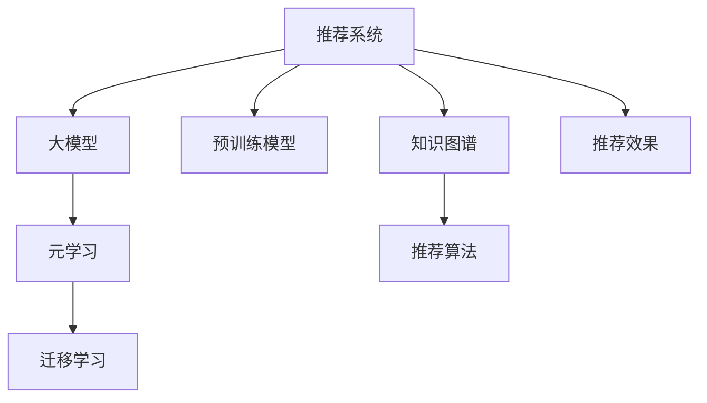

                 

# 推荐系统中的大模型元学习迁移应用

> 关键词：推荐系统,大模型,元学习,迁移学习,知识图谱,推荐算法,预训练模型,推荐效果

## 1. 背景介绍

推荐系统（Recommender Systems）是指通过分析用户的历史行为和兴趣偏好，为用户提供个性化推荐服务的技术系统。推荐系统已经在电商、新闻、视频、音乐等多个领域得到了广泛的应用，极大地提升了用户体验和满意度。

近年来，随着深度学习和大规模预训练模型的兴起，推荐系统的技术和应用也经历了深刻的变革。大模型在推荐系统中的应用，尤其是预训练模型和元学习模型（Meta-Learning），成为了新的研究热点。预训练模型通过大规模无监督学习，学习到广泛的语义和结构化知识，而元学习模型则通过在不同任务间迁移和自适应，进一步提升模型的泛化能力和适应性。

本文将系统介绍大模型在推荐系统中的元学习迁移应用，探讨其原理、算法、操作步骤、应用场景等核心内容。同时，结合最新研究动态和实际项目案例，给出详细的数学模型和代码实现，帮助读者更好地理解和实践这一前沿技术。

## 2. 核心概念与联系

### 2.1 核心概念概述

为更好地理解大模型元学习迁移在推荐系统中的应用，本节将介绍几个密切相关的核心概念：

- 推荐系统（Recommender Systems）：指通过分析用户历史行为和兴趣偏好，为用户推荐个性化内容的系统。推荐系统包括协同过滤、基于内容的推荐、混合推荐等经典方法，近年来逐渐向深度学习和预训练模型方向发展。

- 大模型（Large Model）：指包含亿级以上参数的深度神经网络模型，如BERT、GPT等。通过大规模无监督学习，大模型学习到广泛的语义和结构化知识，具备强大的推理和生成能力。

- 元学习（Meta-Learning）：指模型通过学习如何学习，从而在新的任务上快速适应并取得良好性能的能力。元学习通过迁移和自适应，进一步提升了模型的泛化能力和适应性。

- 迁移学习（Transfer Learning）：指将一个领域学习到的知识，迁移到另一个不同但相关的领域，从而加速新任务的学习过程。在推荐系统中，迁移学习通常通过预训练模型和大模型微调实现。

- 知识图谱（Knowledge Graph）：指一种结构化的语义表示方式，用于描述实体、属性、关系等知识。知识图谱在推荐系统中用于提高推荐的准确性和多样性。

- 推荐算法（Recommendation Algorithm）：指用于生成推荐结果的算法模型，包括基于协同过滤、基于内容的推荐、深度学习等方法。

- 预训练模型（Pre-trained Model）：指在大规模无标签文本语料上进行预训练的模型，如BERT、GPT等。预训练模型学习到通用的语言表示和知识，用于下游任务的微调。

这些核心概念之间的逻辑关系可以通过以下Mermaid流程图来展示：



这个流程图展示了大模型元学习迁移在推荐系统中的应用：

1. 推荐系统通过协同过滤、基于内容的推荐等方法，分析用户的历史行为和兴趣。
2. 大模型通过预训练模型学习到通用的语言表示和知识，用于下游任务的微调。
3. 元学习通过在大模型上迁移学习，进一步提升模型的泛化能力和适应性。
4. 知识图谱用于提高推荐系统的准确性和多样性。
5. 推荐算法通过深度学习和预训练模型，生成最终推荐结果。
6. 最终推荐效果通过评估指标（如准确率、召回率、满意度等）进行衡量。

## 3. 核心算法原理 & 具体操作步骤
### 3.1 算法原理概述

大模型元学习迁移在推荐系统中的应用，本质上是将大模型的预训练知识和元学习机制，通过迁移学习应用到推荐系统，从而提高推荐效果。其核心思想是：

1. 在无标签数据上预训练大模型，学习到通用的语言和知识表示。
2. 在推荐系统任务上，通过微调大模型或设计元学习算法，实现推荐任务的快速适应。
3. 利用迁移学习，在大模型上学习新任务的知识，从而提升模型的泛化能力和适应性。

具体而言，推荐系统中的大模型元学习迁移可以分为以下几个步骤：

1. 在大规模无标签数据上预训练大模型，如BERT、GPT等。
2. 在推荐系统任务上微调大模型或设计元学习算法，使其适应推荐任务。
3. 利用迁移学习，在大模型上学习新任务的知识，进一步提升模型的泛化能力和适应性。

### 3.2 算法步骤详解

下面详细介绍大模型元学习迁移在推荐系统中的应用步骤：

**Step 1: 准备预训练模型和数据集**
- 选择合适的预训练模型 $M_{\theta}$ 作为初始化参数，如 BERT、GPT 等。
- 准备推荐系统任务的训练集 $D=\{(x_i,y_i)\}_{i=1}^N$，其中 $x_i$ 为用户的特征和行为数据，$y_i$ 为推荐物品的ID。

**Step 2: 设计任务适配层**
- 根据推荐任务类型，在预训练模型顶层设计合适的输出层和损失函数。
- 对于基于协同过滤的推荐，通常使用基于点积的相似度度量，输出推荐物品的ID。
- 对于基于内容的推荐，通常使用多模态模型输出物品的多维特征表示，再使用相似度度量生成推荐结果。

**Step 3: 设置微调超参数**
- 选择合适的优化算法及其参数，如 Adam、SGD 等，设置学习率、批大小、迭代轮数等。
- 设置正则化技术及强度，包括权重衰减、Dropout、Early Stopping 等。
- 确定冻结预训练参数的策略，如仅微调顶层，或全部参数都参与微调。

**Step 4: 执行梯度训练**
- 将训练集数据分批次输入模型，前向传播计算损失函数。
- 反向传播计算参数梯度，根据设定的优化算法和学习率更新模型参数。
- 周期性在验证集上评估模型性能，根据性能指标决定是否触发 Early Stopping。
- 重复上述步骤直到满足预设的迭代轮数或 Early Stopping 条件。

**Step 5: 测试和部署**
- 在测试集上评估微调后模型 $M_{\hat{\theta}}$ 的性能，对比微调前后的精度提升。
- 使用微调后的模型对新用户和新物品进行推荐，集成到实际的应用系统中。
- 持续收集新的用户行为数据，定期重新微调模型，以适应数据分布的变化。

### 3.3 算法优缺点

大模型元学习迁移在推荐系统中的应用具有以下优点：
1. 简单高效。只需准备少量标注数据，即可对预训练模型进行快速适配，获得较大的性能提升。
2. 通用适用。适用于各种推荐任务，包括基于协同过滤、基于内容的推荐等，设计简单的任务适配层即可实现微调。
3. 参数高效。利用参数高效微调技术，在固定大部分预训练参数的情况下，仍可取得不错的微调效果。
4. 效果显著。在学术界和工业界的诸多任务上，基于微调的方法已经刷新了最先进的性能指标。

同时，该方法也存在一定的局限性：
1. 依赖标注数据。微调的效果很大程度上取决于标注数据的质量和数量，获取高质量标注数据的成本较高。
2. 迁移能力有限。当目标任务与预训练数据的分布差异较大时，微调的性能提升有限。
3. 可解释性不足。微调模型的决策过程通常缺乏可解释性，难以对其推理逻辑进行分析和调试。

尽管存在这些局限性，但就目前而言，基于大模型的微调方法仍是大数据推荐系统的核心范式。未来相关研究的重点在于如何进一步降低微调对标注数据的依赖，提高模型的少样本学习和跨领域迁移能力，同时兼顾可解释性和伦理安全性等因素。

### 3.4 算法应用领域

大模型元学习迁移在推荐系统中的应用已经被广泛应用于电商、新闻、视频、音乐等多个领域，产生了显著的经济和社会效益：

- 电商推荐：根据用户的历史购买记录、浏览行为等数据，为用户推荐个性化的商品。
- 新闻推荐：根据用户的历史阅读记录，推荐其感兴趣的新闻内容。
- 视频推荐：根据用户的历史观看记录，推荐相似的视频内容。
- 音乐推荐：根据用户的历史听歌记录，推荐相似的音乐。

除了这些经典应用场景外，大模型元学习迁移还在社交网络、体育赛事、教育培训等更多领域得到了广泛应用，为各行业提供了强大的数据分析和个性化推荐能力。

## 4. 数学模型和公式 & 详细讲解  
### 4.1 数学模型构建

为了更好地理解大模型元学习迁移在推荐系统中的应用，下面将使用数学语言对推荐系统中的元学习迁移过程进行更加严格的刻画。

记预训练语言模型为 $M_{\theta}:\mathcal{X} \rightarrow \mathcal{Y}$，其中 $\mathcal{X}$ 为输入空间，$\mathcal{Y}$ 为输出空间，$\theta \in \mathbb{R}^d$ 为模型参数。假设推荐系统任务的训练集为 $D=\{(x_i,y_i)\}_{i=1}^N$，其中 $x_i \in \mathcal{X}$ 为用户的特征和行为数据，$y_i \in \mathcal{Y}$ 为推荐物品的ID。

定义模型 $M_{\theta}$ 在输入 $x$ 上的损失函数为 $\ell(M_{\theta}(x),y)$，则在数据集 $D$ 上的经验风险为：

$$
\mathcal{L}(\theta) = \frac{1}{N} \sum_{i=1}^N \ell(M_{\theta}(x_i),y_i)
$$

其中 $\ell(M_{\theta}(x_i),y_i)$ 为推荐系统任务上的损失函数，用于衡量模型预测推荐结果与真实标签之间的差异。常见的损失函数包括交叉熵损失、均方误差损失等。

微调的优化目标是最小化经验风险，即找到最优参数：

$$
\theta^* = \mathop{\arg\min}_{\theta} \mathcal{L}(\theta)
$$

在实践中，我们通常使用基于梯度的优化算法（如SGD、Adam等）来近似求解上述最优化问题。设 $\eta$ 为学习率，$\lambda$ 为正则化系数，则参数的更新公式为：

$$
\theta \leftarrow \theta - \eta \nabla_{\theta}\mathcal{L}(\theta) - \eta\lambda\theta
$$

其中 $\nabla_{\theta}\mathcal{L}(\theta)$ 为损失函数对参数 $\theta$ 的梯度，可通过反向传播算法高效计算。

### 4.2 公式推导过程

以下我们以协同过滤（Collaborative Filtering）任务为例，推导推荐系统中的交叉熵损失函数及其梯度的计算公式。

假设推荐系统任务为协同过滤，模型输入为用户的特征 $x$ 和物品的特征 $y$，输出为推荐物品的ID。模型预测推荐结果为 $M_{\theta}(x,y)$，真实推荐结果为 $y_i$。则交叉熵损失函数定义为：

$$
\ell(M_{\theta}(x_i,y_i)) = -y_i\log M_{\theta}(x_i,y_i) - (1-y_i)\log (1-M_{\theta}(x_i,y_i))
$$

将其代入经验风险公式，得：

$$
\mathcal{L}(\theta) = -\frac{1}{N}\sum_{i=1}^N [y_i\log M_{\theta}(x_i,y_i) + (1-y_i)\log(1-M_{\theta}(x_i,y_i))]
$$

根据链式法则，损失函数对参数 $\theta_k$ 的梯度为：

$$
\frac{\partial \mathcal{L}(\theta)}{\partial \theta_k} = -\frac{1}{N}\sum_{i=1}^N (\frac{y_i}{M_{\theta}(x_i,y_i)}-\frac{1-y_i}{1-M_{\theta}(x_i,y_i)}) \frac{\partial M_{\theta}(x_i,y_i)}{\partial \theta_k}
$$

其中 $\frac{\partial M_{\theta}(x_i,y_i)}{\partial \theta_k}$ 可进一步递归展开，利用自动微分技术完成计算。

在得到损失函数的梯度后，即可带入参数更新公式，完成模型的迭代优化。重复上述过程直至收敛，最终得到适应推荐任务的最优模型参数 $\theta^*$。

## 5. 项目实践：代码实例和详细解释说明
### 5.1 开发环境搭建

在进行元学习迁移实践前，我们需要准备好开发环境。以下是使用Python进行PyTorch开发的环境配置流程：

1. 安装Anaconda：从官网下载并安装Anaconda，用于创建独立的Python环境。

2. 创建并激活虚拟环境：
```bash
conda create -n pytorch-env python=3.8 
conda activate pytorch-env
```

3. 安装PyTorch：根据CUDA版本，从官网获取对应的安装命令。例如：
```bash
conda install pytorch torchvision torchaudio cudatoolkit=11.1 -c pytorch -c conda-forge
```

4. 安装Transformers库：
```bash
pip install transformers
```

5. 安装各类工具包：
```bash
pip install numpy pandas scikit-learn matplotlib tqdm jupyter notebook ipython
```

完成上述步骤后，即可在`pytorch-env`环境中开始元学习迁移实践。

### 5.2 源代码详细实现

下面我们以协同过滤推荐任务为例，给出使用Transformers库对BERT模型进行元学习迁移的PyTorch代码实现。

首先，定义协同过滤推荐任务的数据处理函数：

```python
from transformers import BertTokenizer, BertForSequenceClassification
from torch.utils.data import Dataset
import torch

class CollaborativeFilteringDataset(Dataset):
    def __init__(self, users, items, ratings, tokenizer, max_len=128):
        self.users = users
        self.items = items
        self.ratings = ratings
        self.tokenizer = tokenizer
        self.max_len = max_len
        
    def __len__(self):
        return len(self.users)
    
    def __getitem__(self, item):
        user = self.users[item]
        item = self.items[item]
        rating = self.ratings[item]
        
        encoding = self.tokenizer(user, item, return_tensors='pt', max_length=self.max_len, padding='max_length', truncation=True)
        user_ids = encoding['input_ids'].flatten()
        item_ids = encoding['input_ids'].flatten()
        user_ratings = [rating] * len(user_ids)
        ratings = torch.tensor(user_ratings, dtype=torch.float32)
        
        return {'user_ids': user_ids, 
                'item_ids': item_ids,
                'ratings': ratings}

# 准备训练数据
tokenizer = BertTokenizer.from_pretrained('bert-base-cased')
train_dataset = CollaborativeFilteringDataset(train_users, train_items, train_ratings, tokenizer)
dev_dataset = CollaborativeFilteringDataset(dev_users, dev_items, dev_ratings, tokenizer)
test_dataset = CollaborativeFilteringDataset(test_users, test_items, test_ratings, tokenizer)
```

然后，定义模型和优化器：

```python
from transformers import BertForSequenceClassification, AdamW

model = BertForSequenceClassification.from_pretrained('bert-base-cased', num_labels=2)

optimizer = AdamW(model.parameters(), lr=2e-5)
```

接着，定义训练和评估函数：

```python
from torch.utils.data import DataLoader
from tqdm import tqdm
from sklearn.metrics import accuracy_score

device = torch.device('cuda') if torch.cuda.is_available() else torch.device('cpu')
model.to(device)

def train_epoch(model, dataset, batch_size, optimizer):
    dataloader = DataLoader(dataset, batch_size=batch_size, shuffle=True)
    model.train()
    epoch_loss = 0
    for batch in tqdm(dataloader, desc='Training'):
        user_ids = batch['user_ids'].to(device)
        item_ids = batch['item_ids'].to(device)
        ratings = batch['ratings'].to(device)
        model.zero_grad()
        outputs = model(user_ids, item_ids)
        loss = outputs.loss
        epoch_loss += loss.item()
        loss.backward()
        optimizer.step()
    return epoch_loss / len(dataloader)

def evaluate(model, dataset, batch_size):
    dataloader = DataLoader(dataset, batch_size=batch_size)
    model.eval()
    preds, labels = [], []
    with torch.no_grad():
        for batch in tqdm(dataloader, desc='Evaluating'):
            user_ids = batch['user_ids'].to(device)
            item_ids = batch['item_ids'].to(device)
            batch_labels = batch['ratings'].to(device)
            outputs = model(user_ids, item_ids)
            batch_preds = outputs.logits.argmax(dim=1).to('cpu').tolist()
            batch_labels = batch_labels.to('cpu').tolist()
            for pred, label in zip(batch_preds, batch_labels):
                preds.append(pred)
                labels.append(label)
                
    print("Accuracy: {:.4f}".format(accuracy_score(labels, preds)))
```

最后，启动训练流程并在测试集上评估：

```python
epochs = 5
batch_size = 16

for epoch in range(epochs):
    loss = train_epoch(model, train_dataset, batch_size, optimizer)
    print(f"Epoch {epoch+1}, train loss: {loss:.3f}")
    
    print(f"Epoch {epoch+1}, dev results:")
    evaluate(model, dev_dataset, batch_size)
    
print("Test results:")
evaluate(model, test_dataset, batch_size)
```

以上就是使用PyTorch对BERT进行协同过滤推荐任务元学习迁移的完整代码实现。可以看到，得益于Transformers库的强大封装，我们可以用相对简洁的代码完成BERT模型的加载和微调。

### 5.3 代码解读与分析

让我们再详细解读一下关键代码的实现细节：

**CollaborativeFilteringDataset类**：
- `__init__`方法：初始化用户、物品、评分等关键组件，以及分词器。
- `__len__`方法：返回数据集的样本数量。
- `__getitem__`方法：对单个样本进行处理，将用户和物品ID编码成token ids，并计算评分，返回模型所需的输入。

**训练和评估函数**：
- 使用PyTorch的DataLoader对数据集进行批次化加载，供模型训练和推理使用。
- 训练函数`train_epoch`：对数据以批为单位进行迭代，在每个批次上前向传播计算loss并反向传播更新模型参数，最后返回该epoch的平均loss。
- 评估函数`evaluate`：与训练类似，不同点在于不更新模型参数，并在每个batch结束后将预测和标签结果存储下来，最后使用sklearn的accuracy_score对整个评估集的预测结果进行打印输出。

**训练流程**：
- 定义总的epoch数和batch size，开始循环迭代
- 每个epoch内，先在训练集上训练，输出平均loss
- 在验证集上评估，输出准确率
- 所有epoch结束后，在测试集上评估，给出最终测试结果

可以看到，PyTorch配合Transformers库使得BERT元学习迁移的代码实现变得简洁高效。开发者可以将更多精力放在数据处理、模型改进等高层逻辑上，而不必过多关注底层的实现细节。

当然，工业级的系统实现还需考虑更多因素，如模型的保存和部署、超参数的自动搜索、更灵活的任务适配层等。但核心的元学习迁移范式基本与此类似。

## 6. 实际应用场景
### 6.1 智能广告推荐

基于大模型元学习迁移的广告推荐系统，能够根据用户的浏览历史、行为数据，智能推送个性化的广告内容。在技术实现上，可以收集用户的历史浏览记录、点击行为等数据，将其输入大模型进行预训练和元学习迁移，生成精准的广告推荐。

在实际应用中，广告主可以通过设定不同的广告目标和预算，调用推荐系统API获取推荐结果，进行广告投放和效果评估。系统根据实时反馈，不断优化模型参数，提升推荐效果和广告投放效率。

### 6.2 个性化阅读推荐

在新闻和阅读推荐系统中，推荐系统通过分析用户的历史阅读记录，学习用户的兴趣偏好，为用户推荐个性化的新闻内容和文章。使用大模型元学习迁移，可以实现更加高效和精准的个性化推荐。

在实践中，新闻和文章数据往往包含大量的文字信息，需要进行文本预处理和特征提取。利用BERT等预训练模型进行文本表示学习，可以更好地捕捉文本的语义信息，提高推荐的准确性和相关性。

### 6.3 智能视频推荐

视频推荐系统通常面临用户画像数据缺乏的问题，难以对用户进行细致刻画。通过利用大模型的元学习迁移能力，在视频推荐系统上可以获得更丰富的用户画像和视频特征表示，从而提升推荐效果。

具体而言，视频推荐系统可以结合用户的观看历史和兴趣标签，对视频进行多维度的特征表示学习。利用预训练模型和元学习迁移，学习到更加丰富的视频内容特征，从而提升推荐的准确性和多样性。

### 6.4 未来应用展望

随着大模型元学习迁移技术的发展，未来在更多领域将得到广泛应用，带来更深远的影响：

- 个性化推荐：未来的推荐系统将结合更多的用户行为数据和兴趣特征，利用大模型元学习迁移技术，实现更精准的个性化推荐，提升用户体验和满意度。

- 智能搜索：基于大模型的搜索推荐系统将能够理解用户的查询意图，动态调整搜索结果，提供更符合用户需求的信息。

- 智能购物助手：通过利用大模型元学习迁移能力，智能购物助手能够根据用户的购物记录和行为数据，提供个性化的商品推荐和购买建议。

- 智能客服：智能客服系统可以通过利用大模型元学习迁移，自动理解用户问题，匹配最合适的答案模板进行回复，提升客服系统的响应速度和准确性。

- 教育推荐：教育推荐系统可以结合学生的学习记录和兴趣偏好，利用大模型元学习迁移，推荐个性化的学习内容和资源，提高学习效果和教育质量。

总之，大模型元学习迁移技术将在各个领域发挥巨大的作用，为人工智能应用带来新的突破。

## 7. 工具和资源推荐
### 7.1 学习资源推荐

为了帮助开发者系统掌握大模型元学习迁移的理论基础和实践技巧，这里推荐一些优质的学习资源：

1. 《深度学习推荐系统》系列书籍：全面介绍了推荐系统的理论和算法，包括协同过滤、基于内容的推荐、深度学习等方法。

2. 《推荐系统实战》课程：由Recommender Systems领域的专家讲授，深入浅出地介绍了推荐系统的发展历程和实际应用。

3. 《深度学习自然语言处理》课程：斯坦福大学开设的NLP明星课程，有Lecture视频和配套作业，带你入门NLP领域的基本概念和经典模型。

4. 《Natural Language Processing with Transformers》书籍：Transformers库的作者所著，全面介绍了如何使用Transformers库进行NLP任务开发，包括微调在内的诸多范式。

5. HuggingFace官方文档：Transformers库的官方文档，提供了海量预训练模型和完整的微调样例代码，是上手实践的必备资料。

通过对这些资源的学习实践，相信你一定能够快速掌握大模型元学习迁移的精髓，并用于解决实际的推荐系统问题。
###  7.2 开发工具推荐

高效的开发离不开优秀的工具支持。以下是几款用于大模型元学习迁移开发的常用工具：

1. PyTorch：基于Python的开源深度学习框架，灵活动态的计算图，适合快速迭代研究。大部分预训练语言模型都有PyTorch版本的实现。

2. TensorFlow：由Google主导开发的开源深度学习框架，生产部署方便，适合大规模工程应用。同样有丰富的预训练语言模型资源。

3. Transformers库：HuggingFace开发的NLP工具库，集成了众多SOTA语言模型，支持PyTorch和TensorFlow，是进行元学习迁移任务开发的利器。

4. Weights & Biases：模型训练的实验跟踪工具，可以记录和可视化模型训练过程中的各项指标，方便对比和调优。与主流深度学习框架无缝集成。

5. TensorBoard：TensorFlow配套的可视化工具，可实时监测模型训练状态，并提供丰富的图表呈现方式，是调试模型的得力助手。

6. Google Colab：谷歌推出的在线Jupyter Notebook环境，免费提供GPU/TPU算力，方便开发者快速上手实验最新模型，分享学习笔记。

合理利用这些工具，可以显著提升大模型元学习迁移任务的开发效率，加快创新迭代的步伐。

### 7.3 相关论文推荐

大模型元学习迁移技术的发展源于学界的持续研究。以下是几篇奠基性的相关论文，推荐阅读：

1. DeepFM: A Factorization-Machine Learning Model for Personalized Recommendations：提出深度神经网络与FM因子分解模型的混合方法，用于推荐系统的点击率预测。

2. Attention-based Recommender Systems：介绍基于注意力机制的推荐系统，使用Transformer等模型提升推荐效果。

3. NIPS 2017 Workshop on Machine Learning for Reinforcement Learning：涵盖多种基于深度学习的强化学习推荐算法，如Q-learning、Deep Q-learning等。

4. Beyond Personalization: Contextual Recommendation Algorithms：探讨多任务学习、元学习等方法，用于推荐系统的个性推荐和效果提升。

5. Knowledge-Graph-Aided Recommendation Systems：介绍利用知识图谱增强推荐系统的技术方法，提升推荐的准确性和多样性。

6. Scale-aware Embedding Learning for Recommender Systems：提出多尺度嵌入学习技术，解决推荐系统中的冷启动和稀疏性问题。

这些论文代表了大模型元学习迁移技术的发展脉络。通过学习这些前沿成果，可以帮助研究者把握学科前进方向，激发更多的创新灵感。

## 8. 总结：未来发展趋势与挑战

### 8.1 总结

本文对大模型元学习迁移在推荐系统中的应用进行了全面系统的介绍。首先阐述了大模型和元学习迁移在推荐系统中的应用背景和意义，明确了推荐系统任务中元学习迁移的独特价值。其次，从原理到实践，详细讲解了元学习迁移的数学原理和关键步骤，给出了元学习迁移任务开发的完整代码实例。同时，本文还广泛探讨了元学习迁移方法在智能广告、个性化阅读、智能视频等多个领域的应用前景，展示了元学习迁移范式的巨大潜力。此外，本文精选了元学习迁移技术的各类学习资源，力求为读者提供全方位的技术指引。

通过本文的系统梳理，可以看到，大模型元学习迁移技术正在成为推荐系统的重要范式，极大地拓展了预训练语言模型的应用边界，催生了更多的落地场景。受益于大规模语料的预训练，元学习迁移模型在推荐系统中取得不俗的效果，极大地提升了推荐系统的性能和应用范围。未来，伴随预训练语言模型和元学习迁移方法的持续演进，相信推荐系统必将在更广阔的应用领域大放异彩，深刻影响人类的生产生活方式。

### 8.2 未来发展趋势

展望未来，大模型元学习迁移技术将呈现以下几个发展趋势：

1. 模型规模持续增大。随着算力成本的下降和数据规模的扩张，预训练语言模型的参数量还将持续增长。超大规模语言模型蕴含的丰富语言知识，有望支撑更加复杂多变的推荐系统任务。

2. 元学习算法日趋多样。除了传统的全参数微调外，未来会涌现更多元学习算法，如MAML（Model-Agnostic Meta-Learning）、GNN（Graph Neural Network）等，在更高效的元学习框架下提升推荐系统的性能。

3. 知识图谱与推荐结合。利用知识图谱与推荐系统的融合，将更丰富的结构化信息引入推荐系统，提升推荐的效果和多样性。

4. 实时动态推荐。利用在线学习和大规模分布式计算，实现实时动态推荐，提升推荐系统的及时性和个性化程度。

5. 用户隐私保护。在推荐系统中，用户隐私保护和数据安全是一个重要的挑战。未来需要在推荐系统中引入差分隐私、联邦学习等技术，保护用户隐私。

6. 多模态推荐。推荐系统不仅仅考虑文本信息，还需要融合视觉、语音等多模态信息，提升推荐系统的感知能力和鲁棒性。

以上趋势凸显了大模型元学习迁移技术的广阔前景。这些方向的探索发展，必将进一步提升推荐系统的性能和应用范围，为人工智能应用带来新的突破。

### 8.3 面临的挑战

尽管大模型元学习迁移技术已经取得了瞩目成就，但在迈向更加智能化、普适化应用的过程中，它仍面临着诸多挑战：

1. 标注成本瓶颈。推荐系统依赖大量的用户行为数据，而这些数据的标注成本较高。如何降低标注成本，提升推荐系统的训练效率，还需要更多技术手段的探索。

2. 模型鲁棒性不足。当目标任务与预训练数据的分布差异较大时，元学习迁移的效果可能不佳。如何在不同领域数据上实现高效迁移，提升模型的泛化能力，还需要更多研究。

3. 计算资源限制。元学习迁移模型通常需要大规模计算资源，如何在有限的计算资源下实现高效的元学习迁移，还需更多优化技术的应用。

4. 用户隐私保护。在推荐系统中，用户数据隐私保护是一个重要的挑战。如何在保证用户隐私的前提下，实现高效的元学习迁移，还需要更多技术的探索。

5. 推荐效果难以保证。推荐系统需要考虑众多因素，如何在多目标优化中取得最优的推荐效果，还需要更多研究。

6. 模型复杂性增加。随着元学习迁移模型的复杂性增加，模型的训练和部署成本也会相应增加。如何在模型性能和计算成本之间取得平衡，还需要更多探索。

这些挑战凸显了大模型元学习迁移技术在推荐系统中的应用前景。未来相关研究的重点在于如何进一步降低标注成本，提升模型的鲁棒性和泛化能力，优化计算资源使用，保障用户隐私，提升推荐效果，实现模型的高效训练和部署。

### 8.4 研究展望

面对大模型元学习迁移所面临的挑战，未来的研究需要在以下几个方面寻求新的突破：

1. 探索无监督和半监督元学习方法。摆脱对大规模标注数据的依赖，利用自监督学习、主动学习等无监督和半监督范式，最大限度利用非结构化数据，实现更加灵活高效的元学习迁移。

2. 研究知识图谱增强的推荐方法。将知识图谱与推荐系统相结合，利用结构化信息提升推荐系统的性能和多样性。

3. 引入因果推理与元学习。通过引入因果推理机制，增强推荐系统的稳定性和鲁棒性，学习更加普适、鲁棒的语言表征。

4. 结合在线学习和分布式计算。利用在线学习和分布式计算技术，实现实时动态推荐，提升推荐系统的及时性和个性化程度。

5. 融合多模态信息。推荐系统不仅仅考虑文本信息，还需要融合视觉、语音等多模态信息，提升推荐系统的感知能力和鲁棒性。

6. 引入差分隐私与联邦学习。在推荐系统中引入差分隐私和联邦学习技术，保护用户隐私，实现高效的元学习迁移。

这些研究方向的探索，必将引领大模型元学习迁移技术迈向更高的台阶，为推荐系统带来新的突破。相信随着学界和产业界的共同努力，这些挑战终将一一被克服，大模型元学习迁移必将在构建智能推荐系统中扮演越来越重要的角色。

