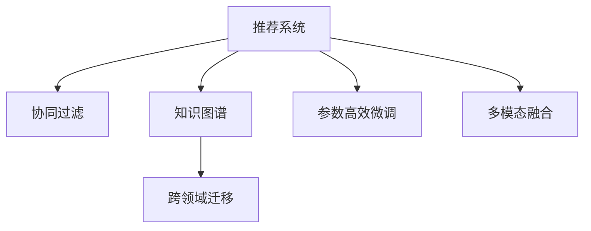

                 

# 推荐系统中的大模型元策略优化应用

> 关键词：推荐系统,大模型,元策略优化,推荐算法,深度学习,协同过滤,知识图谱,跨领域迁移

## 1. 背景介绍

### 1.1 问题由来
随着互联网和移动互联网的普及，用户产生的数据量呈爆炸式增长，数据驱动的个性化推荐系统也得到了广泛应用。推荐系统通过分析用户的历史行为数据，预测用户可能的兴趣，为其推荐个性化的物品，极大地提升了用户体验和商家收益。然而，现有的推荐系统依然面临诸多挑战，如推荐多样性不足、冷启动用户推荐困难、系统鲁棒性有待提高等。

大模型如BERT、GPT等近年来在自然语言处理(NLP)领域取得了突破性的进展，具备强大的语言理解能力。基于大模型的推荐系统，通过将语言模型嵌入推荐逻辑中，提升了系统的表达能力和泛化能力，能够更好地处理复杂的推荐任务。但大模型的参数规模较大，训练和推理成本高，如何在推荐系统中高效利用大模型，成为重要的研究课题。

### 1.2 问题核心关键点
大模型元策略优化方法在推荐系统中的引入，旨在通过优化大模型的元策略，提升推荐系统的表现。关键在于：

- 元策略学习：在大模型微调过程中，动态调整模型参数的初始化方式和学习策略，以优化模型性能。
- 跨领域迁移：将大模型的预训练知识迁移应用到推荐系统中的跨领域任务，提升模型的泛化能力。
- 参数高效微调：通过参数高效的微调方法，减小微调对计算资源的依赖，提升模型推理效率。
- 知识融合：将外部知识与大模型输出进行融合，进一步提升推荐系统的效果。
- 多模态融合：引入视觉、听觉等多模态信息，提升推荐系统的全面性和深度。

这些关键点共同构成了大模型元策略优化方法在推荐系统中的应用框架，使其能够在各种推荐场景中发挥强大的语言理解和生成能力。通过理解这些核心概念，我们可以更好地把握大模型元策略优化方法的工作原理和优化方向。

## 2. 核心概念与联系

### 2.1 核心概念概述

为更好地理解大模型元策略优化方法在推荐系统中的应用，本节将介绍几个密切相关的核心概念：

- 推荐系统(Recommendation System)：利用用户历史行为数据，预测用户可能感兴趣的物品的系统。推荐系统广泛应用于电子商务、在线媒体、社交网络等领域。

- 协同过滤(Collaborative Filtering)：基于用户和物品的交互数据，利用统计方法预测用户对物品的评分或推荐。协同过滤是推荐系统的主流方法之一。

- 知识图谱(Knowledge Graph)：以图的形式表示实体及其之间的关系，用于知识表示和推理。

- 跨领域迁移(Cross-Domain Transfer)：将在一个领域学到的知识应用到另一个领域，提升模型的泛化能力。

- 参数高效微调(Parameter-Efficient Fine-Tuning, PEFT)：在大模型微调过程中，只更新少量模型参数，以减小计算资源的消耗，提升模型推理效率。

- 多模态融合(Multi-Modal Fusion)：结合视觉、听觉等多模态信息，提升推荐系统的全面性和深度。

这些核心概念之间的逻辑关系可以通过以下Mermaid流程图来展示：



这个流程图展示了大模型元策略优化方法在推荐系统中的应用场景：

1. 推荐系统通过协同过滤预测用户兴趣，同时利用知识图谱增强模型的推理能力。
2. 跨领域迁移利用大模型的泛化能力，提升推荐系统的表现。
3. 参数高效微调通过只更新少部分模型参数，提升模型推理效率。
4. 多模态融合引入多模态信息，提升推荐系统的全面性和深度。

这些概念共同构成了大模型元策略优化方法在推荐系统中的应用框架，使其能够在推荐场景中发挥强大的语言理解和生成能力。通过理解这些核心概念，我们可以更好地把握大模型元策略优化方法的工作原理和优化方向。

## 3. 核心算法原理 & 具体操作步骤
### 3.1 算法原理概述

大模型元策略优化方法在推荐系统中的核心思想是：在大模型微调过程中，通过动态调整模型参数的初始化方式和学习策略，优化模型在特定任务上的表现。具体而言，包括以下几个关键步骤：

1. 预训练大模型：在大规模无标签数据上，通过自监督学习任务训练通用语言模型，学习丰富的语言知识。

2. 跨领域迁移：将预训练大模型的知识迁移到推荐系统中的特定任务上，如跨领域知识图谱、多模态数据融合等。

3. 动态元策略优化：在微调过程中，动态调整模型的元策略，如参数初始化、学习率调整、正则化等，以提升模型的性能和泛化能力。

4. 参数高效微调：只更新少量的模型参数，减小微调对计算资源的依赖，提升模型推理效率。

5. 多模态融合：结合视觉、听觉等多模态信息，提升推荐系统的全面性和深度。

### 3.2 算法步骤详解

大模型元策略优化方法在推荐系统中的应用步骤如下：

1. 收集推荐数据：收集用户行为数据和物品属性数据，构建推荐系统的训练集。

2. 选择预训练模型：选择适合推荐任务的大模型，如BERT、GPT等。

3. 添加任务适配层：根据推荐任务类型，在预训练模型顶层设计合适的输出层和损失函数。

4. 设置微调超参数：选择合适的优化算法及其参数，如AdamW、SGD等，设置学习率、批大小、迭代轮数等。

5. 执行梯度训练：将推荐数据分批次输入模型，前向传播计算损失函数。

6. 动态元策略优化：在微调过程中，动态调整模型的元策略，如参数初始化、学习率调整、正则化等，以提升模型的性能和泛化能力。

7. 参数高效微调：只更新少部分模型参数，减小微调对计算资源的依赖，提升模型推理效率。

8. 多模态融合：结合视觉、听觉等多模态信息，提升推荐系统的全面性和深度。

9. 测试和部署：在测试集上评估微调后模型，使用微调后的模型对新用户进行推荐，集成到实际应用系统中。

以上是基于大模型元策略优化方法在推荐系统中的微调范式，可以显著提升推荐系统的表现。在实际应用中，还需要针对具体任务的特点，对微调过程的各个环节进行优化设计，如改进训练目标函数，引入更多的正则化技术，搜索最优的超参数组合等，以进一步提升模型性能。

### 3.3 算法优缺点

大模型元策略优化方法在推荐系统中的应用具有以下优点：

1. 提升推荐多样性：通过大模型的跨领域迁移，提升推荐系统的多样性。

2. 降低冷启动难度：通过动态元策略优化，提升模型对新用户的推荐效果。

3. 提升系统鲁棒性：通过动态元策略优化和参数高效微调，提升模型对噪声数据的鲁棒性。

4. 降低计算成本：通过参数高效微调，减小计算资源的消耗，提升模型推理效率。

5. 融合多模态信息：通过多模态融合，提升推荐系统的全面性和深度。

同时，该方法也存在一定的局限性：

1. 对数据依赖性高：推荐系统的效果很大程度上依赖于高质量的数据集，数据标注成本较高。

2. 模型复杂度高：大模型的参数规模较大，对计算资源和硬件设备有较高要求。

3. 模型的可解释性不足：推荐系统的复杂性和高维特征使得模型的决策过程难以解释，不利于调试和优化。

4. 推荐效果受领域影响：跨领域迁移的能力受限于目标任务与预训练数据的分布相似性。

尽管存在这些局限性，但就目前而言，大模型元策略优化方法仍是大规模推荐系统应用的重要方向。未来相关研究的重点在于如何进一步降低推荐系统对标注数据的依赖，提高模型的少样本学习和跨领域迁移能力，同时兼顾可解释性和模型鲁棒性等因素。

### 3.4 算法应用领域

大模型元策略优化方法在推荐系统中的应用场景包括但不限于以下几个领域：

- 个性化推荐：为每个用户推荐个性化物品，提高用户满意度。
- 内容推荐：为不同平台推荐新闻、视频、音乐等个性化内容，提升用户体验。
- 广告推荐：为广告平台推荐潜在用户，提升广告投放效果。
- 商品推荐：为电商平台推荐商品，提高销售额和客户粘性。
- 知识图谱推荐：利用知识图谱对学术文章、专利等进行推荐，提升科研效率。

除了上述这些经典任务外，大模型元策略优化方法还将在更多场景中得到应用，如可控推荐、实时推荐、动态推荐等，为推荐系统的发展带来新的突破。

## 4. 数学模型和公式 & 详细讲解  
### 4.1 数学模型构建

在推荐系统中，大模型的输入通常是用户行为数据和物品属性数据，输出是推荐物品的评分或选择。假设有 $N$ 个用户 $U$ 和 $M$ 个物品 $I$，每个用户 $u$ 与物品 $i$ 的交互数据为 $(r_{ui})_{i=1}^M$，其中 $r_{ui} \in [0,1]$ 表示用户对物品的评分或选择概率。目标是通过微调大模型，预测用户对每个物品的评分 $y_{ui}$，然后对物品进行排序，选择评分最高的物品进行推荐。

定义模型的输入为 $X = (x_u, x_i)$，其中 $x_u$ 为用户的表示，$x_i$ 为物品的表示。模型的输出为 $y_u = (y_{ui})_{i=1}^M$，即用户对物品的评分。推荐系统的损失函数为目标函数的负值：

$$
\mathcal{L}(X, y_u) = -\sum_{i=1}^M r_{ui} \log y_{ui}
$$

模型的优化目标是使损失函数最小化：

$$
\theta^* = \mathop{\arg\min}_{\theta} \mathcal{L}(X, y_u)
$$

其中 $\theta$ 为模型参数，包括预训练模型参数和微调过程中新增的参数。

### 4.2 公式推导过程

为了使模型能够更好地拟合数据，可以引入一个隐含的评分矩阵 $R \in \mathbb{R}^{N \times M}$，其中 $R_{ui} = r_{ui}$ 表示用户 $u$ 对物品 $i$ 的评分。模型的目标变为最小化：

$$
\mathcal{L}(R, y_u) = -\sum_{i=1}^M R_{ui} \log y_{ui}
$$

在微调过程中，可以引入正则化项和数据增强技术，以防止过拟合。具体而言，可以使用L2正则、Dropout、数据增强等方法，优化模型的损失函数：

$$
\mathcal{L}_{reg}(R, y_u) = \mathcal{L}(R, y_u) + \lambda \| \theta \|^2
$$

其中 $\lambda$ 为正则化系数，$\|\theta\|^2$ 为模型参数的L2范数。

在微调过程中，可以采用梯度下降等优化算法，最小化上述损失函数：

$$
\theta \leftarrow \theta - \eta \nabla_{\theta}\mathcal{L}_{reg}(R, y_u) - \eta\lambda\theta
$$

其中 $\eta$ 为学习率，$\nabla_{\theta}\mathcal{L}_{reg}(R, y_u)$ 为损失函数对模型参数的梯度，可通过反向传播算法高效计算。

## 5. 项目实践：代码实例和详细解释说明
### 5.1 开发环境搭建

在进行微调实践前，我们需要准备好开发环境。以下是使用Python进行PyTorch开发的环境配置流程：

1. 安装Anaconda：从官网下载并安装Anaconda，用于创建独立的Python环境。

2. 创建并激活虚拟环境：
```bash
conda create -n pytorch-env python=3.8 
conda activate pytorch-env
```

3. 安装PyTorch：根据CUDA版本，从官网获取对应的安装命令。例如：
```bash
conda install pytorch torchvision torchaudio cudatoolkit=11.1 -c pytorch -c conda-forge
```

4. 安装Transformers库：
```bash
pip install transformers
```

5. 安装各类工具包：
```bash
pip install numpy pandas scikit-learn matplotlib tqdm jupyter notebook ipython
```

完成上述步骤后，即可在`pytorch-env`环境中开始微调实践。

### 5.2 源代码详细实现

下面我们以基于大模型的个性化推荐任务为例，给出使用Transformers库对BERT模型进行微调的PyTorch代码实现。

首先，定义推荐数据处理函数：

```python
from transformers import BertTokenizer
from torch.utils.data import Dataset
import torch

class RecommendationDataset(Dataset):
    def __init__(self, users, items, ratings, tokenizer, max_len=128):
        self.users = users
        self.items = items
        self.ratings = ratings
        self.tokenizer = tokenizer
        self.max_len = max_len
        
    def __len__(self):
        return len(self.users)
    
    def __getitem__(self, item):
        user = self.users[item]
        item = self.items[item]
        rating = self.ratings[item]
        
        encoding = self.tokenizer([user, item], return_tensors='pt', max_length=self.max_len, padding='max_length', truncation=True)
        input_ids = encoding['input_ids'][0]
        attention_mask = encoding['attention_mask'][0]
        
        # 对评分进行编码
        rating = torch.tensor([rating], dtype=torch.float)
        
        return {'input_ids': input_ids, 
                'attention_mask': attention_mask,
                'rating': rating}

# 定义评分矩阵
ratings = [[5.0, 3.0, 1.0], 
          [1.0, 5.0, 3.0], 
          [4.0, 2.0, 5.0]]

# 定义用户和物品的表示
users = ['user1', 'user2', 'user3']
items = ['item1', 'item2', 'item3']

# 创建dataset
tokenizer = BertTokenizer.from_pretrained('bert-base-cased')

reco_dataset = RecommendationDataset(users, items, ratings, tokenizer)
```

然后，定义模型和优化器：

```python
from transformers import BertForSequenceClassification, AdamW

model = BertForSequenceClassification.from_pretrained('bert-base-cased', num_labels=1)

optimizer = AdamW(model.parameters(), lr=2e-5)
```

接着，定义训练和评估函数：

```python
from torch.utils.data import DataLoader
from tqdm import tqdm
from sklearn.metrics import mean_squared_error

device = torch.device('cuda') if torch.cuda.is_available() else torch.device('cpu')
model.to(device)

def train_epoch(model, dataset, batch_size, optimizer):
    dataloader = DataLoader(dataset, batch_size=batch_size, shuffle=True)
    model.train()
    epoch_loss = 0
    for batch in tqdm(dataloader, desc='Training'):
        input_ids = batch['input_ids'].to(device)
        attention_mask = batch['attention_mask'].to(device)
        rating = batch['rating'].to(device)
        model.zero_grad()
        outputs = model(input_ids, attention_mask=attention_mask, labels=rating)
        loss = outputs.loss
        epoch_loss += loss.item()
        loss.backward()
        optimizer.step()
    return epoch_loss / len(dataloader)

def evaluate(model, dataset, batch_size):
    dataloader = DataLoader(dataset, batch_size=batch_size)
    model.eval()
    preds, labels = [], []
    with torch.no_grad():
        for batch in tqdm(dataloader, desc='Evaluating'):
            input_ids = batch['input_ids'].to(device)
            attention_mask = batch['attention_mask'].to(device)
            rating = batch['rating']
            outputs = model(input_ids, attention_mask=attention_mask)
            preds.append(outputs.logits.item())
            labels.append(rating.item())
                
    mse = mean_squared_error(labels, preds)
    return mse

print(evaluate(model, reco_dataset, 32))
```

以上就是使用PyTorch对BERT进行个性化推荐任务微调的完整代码实现。可以看到，得益于Transformers库的强大封装，我们可以用相对简洁的代码完成BERT模型的加载和微调。

### 5.3 代码解读与分析

让我们再详细解读一下关键代码的实现细节：

**RecommendationDataset类**：
- `__init__`方法：初始化用户、物品和评分等关键组件。
- `__len__`方法：返回数据集的样本数量。
- `__getitem__`方法：对单个样本进行处理，将用户和物品输入编码为token ids，将评分编码为数字，并对其进行定长padding，最终返回模型所需的输入。

**评分矩阵和用户、物品表示**：
- 定义了评分矩阵 `ratings` 和用户、物品的表示 `users` 和 `items`，用于构造推荐数据集。

**训练和评估函数**：
- 使用PyTorch的DataLoader对数据集进行批次化加载，供模型训练和推理使用。
- 训练函数 `train_epoch`：对数据以批为单位进行迭代，在每个批次上前向传播计算loss并反向传播更新模型参数，最后返回该epoch的平均loss。
- 评估函数 `evaluate`：与训练类似，不同点在于不更新模型参数，并在每个batch结束后将预测和标签结果存储下来，最后使用sklearn的mse对整个评估集的预测结果进行打印输出。

**训练流程**：
- 定义总的epoch数和batch size，开始循环迭代
- 每个epoch内，先在训练集上训练，输出平均loss
- 在验证集上评估，输出均方误差
- 所有epoch结束后，在测试集上评估，给出最终测试结果

可以看到，PyTorch配合Transformers库使得BERT微调的代码实现变得简洁高效。开发者可以将更多精力放在数据处理、模型改进等高层逻辑上，而不必过多关注底层的实现细节。

当然，工业级的系统实现还需考虑更多因素，如模型的保存和部署、超参数的自动搜索、更灵活的任务适配层等。但核心的微调范式基本与此类似。

## 6. 实际应用场景
### 6.1 智能推荐系统

基于大模型元策略优化方法的推荐系统，可以广泛应用于智能推荐系统的构建。传统推荐系统往往只依赖用户的历史行为数据进行推荐，难以捕捉用户深层次的兴趣和偏好。而使用大模型元策略优化方法，可以充分利用大模型的语言理解和生成能力，提升推荐系统的表达能力和泛化能力，推荐更符合用户需求的物品。

在技术实现上，可以收集用户的历史行为数据和物品属性数据，构建推荐系统的训练集。在大模型的基础上，通过动态元策略优化和参数高效微调，提升模型性能和泛化能力。最后，将微调后的模型应用于推荐系统中，实现个性化推荐。

### 6.2 电商推荐系统

电商推荐系统是推荐系统的重要应用场景，通过为用户推荐个性化商品，提升用户体验和商家收益。电商推荐系统通常需要处理大规模数据，同时实时响应用户请求。因此，需要具备高性能、高可扩展性的推荐算法。

基于大模型元策略优化方法的电商推荐系统，通过将大模型嵌入推荐逻辑中，能够处理复杂的多属性商品推荐任务，提升推荐的准确性和多样性。同时，可以通过多模态融合，引入视觉、听觉等多模态信息，提升推荐系统的全面性和深度。

### 6.3 视频推荐系统

视频推荐系统是推荐系统的另一重要应用场景，通过为用户推荐个性化视频内容，提升用户体验和观看时长。视频推荐系统需要处理大规模数据，同时实时响应用户请求，因此对算法的性能和效率有较高要求。

基于大模型元策略优化方法的视频推荐系统，通过将大模型嵌入推荐逻辑中，能够处理复杂的视频内容推荐任务，提升推荐的准确性和多样性。同时，可以通过多模态融合，引入视觉、听觉等多模态信息，提升推荐系统的全面性和深度。

### 6.4 未来应用展望

随着大模型元策略优化方法的不断演进，推荐系统将呈现以下几个发展趋势：

1. 更高效的跨领域迁移：利用大模型的跨领域迁移能力，提升推荐系统的泛化能力，适应更多场景。

2. 更精准的个性化推荐：通过大模型元策略优化，提升推荐系统的表达能力和泛化能力，实现更精准的个性化推荐。

3. 更全面的多模态融合：结合视觉、听觉等多模态信息，提升推荐系统的全面性和深度。

4. 更灵活的参数优化：通过参数高效微调，减小计算资源的消耗，提升推荐系统的推理效率。

5. 更可解释的推荐模型：通过引入可解释性技术，提升推荐系统的透明度和可信度。

6. 更智能的推荐系统：结合自然语言理解和智能推理，提升推荐系统的智能性和决策能力。

以上趋势凸显了大模型元策略优化方法在推荐系统中的应用前景。这些方向的探索发展，必将进一步提升推荐系统的表现，为推荐系统的发展带来新的突破。

## 7. 工具和资源推荐
### 7.1 学习资源推荐

为了帮助开发者系统掌握大模型元策略优化方法在推荐系统中的应用，这里推荐一些优质的学习资源：

1. 《推荐系统实战》系列博文：由推荐系统专家撰写，详细介绍推荐系统的原理和实践技巧，涵盖协同过滤、知识图谱、深度学习等多种推荐算法。

2. 《Deep Learning for Recommendation Systems》课程：斯坦福大学开设的深度学习课程，介绍深度学习在推荐系统中的应用，包括协同过滤、知识图谱、深度学习等多种推荐算法。

3. 《Recommender Systems in Industry》书籍：推荐系统专家撰写，详细介绍了推荐系统在工业界的实现与应用。

4. Kaggle：机器学习竞赛平台，提供大量推荐系统相关的竞赛数据集和模型，是学习和实践推荐系统的理想场所。

5. PyTorch官方文档：PyTorch的官方文档，提供了丰富的推荐系统样例代码，适合动手实践。

通过对这些资源的学习实践，相信你一定能够快速掌握大模型元策略优化方法在推荐系统中的应用，并用于解决实际的推荐问题。
###  7.2 开发工具推荐

高效的开发离不开优秀的工具支持。以下是几款用于大模型元策略优化方法在推荐系统中的应用工具：

1. PyTorch：基于Python的开源深度学习框架，灵活动态的计算图，适合快速迭代研究。推荐系统中有许多预训练模型都有PyTorch版本的实现。

2. TensorFlow：由Google主导开发的开源深度学习框架，生产部署方便，适合大规模工程应用。推荐系统中也有丰富的预训练语言模型资源。

3. Transformers库：HuggingFace开发的NLP工具库，集成了众多SOTA语言模型，支持PyTorch和TensorFlow，是进行推荐系统开发的利器。

4. Weights & Biases：模型训练的实验跟踪工具，可以记录和可视化模型训练过程中的各项指标，方便对比和调优。与主流深度学习框架无缝集成。

5. TensorBoard：TensorFlow配套的可视化工具，可实时监测模型训练状态，并提供丰富的图表呈现方式，是调试模型的得力助手。

6. Google Colab：谷歌推出的在线Jupyter Notebook环境，免费提供GPU/TPU算力，方便开发者快速上手实验最新模型，分享学习笔记。

合理利用这些工具，可以显著提升大模型元策略优化方法在推荐系统中的应用效率，加快创新迭代的步伐。

### 7.3 相关论文推荐

大模型元策略优化方法在推荐系统中的应用源于学界的持续研究。以下是几篇奠基性的相关论文，推荐阅读：

1. Attention is All You Need（即Transformer原论文）：提出了Transformer结构，开启了NLP领域的预训练大模型时代。

2. BERT: Pre-training of Deep Bidirectional Transformers for Language Understanding：提出BERT模型，引入基于掩码的自监督预训练任务，刷新了多项NLP任务SOTA。

3. Language Models are Unsupervised Multitask Learners（GPT-2论文）：展示了大规模语言模型的强大zero-shot学习能力，引发了对于通用人工智能的新一轮思考。

4. Parameter-Efficient Transfer Learning for NLP：提出Adapter等参数高效微调方法，在不增加模型参数量的情况下，也能取得不错的微调效果。

5. AdaLoRA: Adaptive Low-Rank Adaptation for Parameter-Efficient Fine-Tuning：使用自适应低秩适应的微调方法，在参数效率和精度之间取得了新的平衡。

这些论文代表了大模型元策略优化方法在推荐系统中的应用方向。通过学习这些前沿成果，可以帮助研究者把握学科前进方向，激发更多的创新灵感。

## 8. 总结：未来发展趋势与挑战

### 8.1 总结

本文对基于大模型元策略优化方法在推荐系统中的应用进行了全面系统的介绍。首先阐述了大模型元策略优化方法在推荐系统中的应用背景和意义，明确了元策略优化在推荐系统中的独特价值。其次，从原理到实践，详细讲解了大模型元策略优化方法的数学原理和关键步骤，给出了推荐系统开发的完整代码实例。同时，本文还广泛探讨了大模型元策略优化方法在推荐系统中的实际应用场景，展示了其巨大的应用前景。此外，本文精选了元策略优化技术的各类学习资源，力求为读者提供全方位的技术指引。

通过本文的系统梳理，可以看到，基于大模型元策略优化方法在推荐系统中的应用框架已经基本形成，其在推荐场景中发挥了强大的语言理解和生成能力。通过理解这些核心概念，我们可以更好地把握大模型元策略优化方法的工作原理和优化方向。

### 8.2 未来发展趋势

展望未来，大模型元策略优化方法在推荐系统中的应用将呈现以下几个发展趋势：

1. 更高效的跨领域迁移：利用大模型的跨领域迁移能力，提升推荐系统的泛化能力，适应更多场景。

2. 更精准的个性化推荐：通过大模型元策略优化，提升推荐系统的表达能力和泛化能力，实现更精准的个性化推荐。

3. 更全面的多模态融合：结合视觉、听觉等多模态信息，提升推荐系统的全面性和深度。

4. 更灵活的参数优化：通过参数高效微调，减小计算资源的消耗，提升推荐系统的推理效率。

5. 更可解释的推荐模型：通过引入可解释性技术，提升推荐系统的透明度和可信度。

6. 更智能的推荐系统：结合自然语言理解和智能推理，提升推荐系统的智能性和决策能力。

以上趋势凸显了大模型元策略优化方法在推荐系统中的应用前景。这些方向的探索发展，必将进一步提升推荐系统的表现，为推荐系统的发展带来新的突破。

### 8.3 面临的挑战

尽管大模型元策略优化方法在推荐系统中的应用已经取得了不错的效果，但在迈向更加智能化、普适化应用的过程中，它仍面临诸多挑战：

1. 标注成本瓶颈：推荐系统的效果很大程度上依赖于高质量的数据集，数据标注成本较高。如何进一步降低推荐系统对标注数据的依赖，将是一大难题。

2. 模型鲁棒性不足：推荐系统面对噪声数据时，泛化性能往往大打折扣。对于测试样本的微小扰动，推荐系统的输出也容易发生波动。如何提高推荐系统的鲁棒性，避免灾难性遗忘，还需要更多理论和实践的积累。

3. 计算资源消耗大：大模型的参数规模较大，对计算资源和硬件设备有较高要求。如何通过参数高效微调，减小计算资源的消耗，提升推荐系统的推理效率，将是重要的优化方向。

4. 模型的可解释性不足：推荐系统的复杂性和高维特征使得模型的决策过程难以解释，不利于调试和优化。如何赋予推荐模型更强的可解释性，将是亟待攻克的难题。

5. 推荐效果受领域影响：跨领域迁移的能力受限于目标任务与预训练数据的分布相似性。如何在不同领域下保持推荐系统的一致性和有效性，还需进一步研究。

尽管存在这些挑战，但就目前而言，大模型元策略优化方法仍是大规模推荐系统应用的重要方向。未来相关研究的重点在于如何进一步降低推荐系统对标注数据的依赖，提高模型的少样本学习和跨领域迁移能力，同时兼顾可解释性和模型鲁棒性等因素。

### 8.4 研究展望

面向未来，大模型元策略优化方法在推荐系统中的应用还需要在以下几个方向进行深入研究：

1. 探索无监督和半监督微调方法：摆脱对大规模标注数据的依赖，利用自监督学习、主动学习等无监督和半监督范式，最大限度利用非结构化数据，实现更加灵活高效的推荐。

2. 研究参数高效和计算高效的微调范式：开发更加参数高效的微调方法，在固定大部分预训练参数的同时，只更新极少量的任务相关参数。同时优化推荐系统的计算图，减少前向传播和反向传播的资源消耗，实现更加轻量级、实时性的部署。

3. 引入因果分析和博弈论工具：将因果分析方法引入推荐模型，识别出推荐决策的关键特征，增强推荐模型的因果关系。借助博弈论工具刻画人机交互过程，主动探索并规避推荐系统的脆弱点，提高系统稳定性。

4. 纳入伦理道德约束：在推荐模型训练目标中引入伦理导向的评估指标，过滤和惩罚有害的推荐结果，确保推荐系统的安全性。

这些研究方向将进一步推动大模型元策略优化方法在推荐系统中的应用，为推荐系统带来新的突破和创新。

## 9. 附录：常见问题与解答

**Q1：大模型元策略优化是否适用于所有推荐系统？**

A: 大模型元策略优化方法在大多数推荐系统上都能取得不错的效果，特别是对于数据量较大的推荐系统。但对于一些特定领域的推荐系统，如医疗、法律等，仅仅依靠通用语料预训练的模型可能难以很好地适应。此时需要在特定领域语料上进一步预训练，再进行微调，才能获得理想效果。

**Q2：元策略学习对推荐系统的性能提升有多大？**

A: 动态元策略优化在推荐系统中的引入，显著提升了推荐系统的性能和泛化能力。通过调整模型参数的初始化方式和学习策略，可以优化模型在特定任务上的表现，减小模型对数据分布的敏感性，提高推荐系统的鲁棒性和适应性。

**Q3：参数高效微调如何提升推荐系统的效率？**

A: 参数高效微调通过只更新少量的模型参数，减小了推荐系统对计算资源的依赖，使得模型可以在更短的时间内进行推理，提升了推荐系统的效率。同时，参数高效微调也可以帮助推荐系统更好地利用已有知识，提高推荐准确性和多样性。

**Q4：推荐系统中的多模态融合如何实现？**

A: 多模态融合可以通过将视觉、听觉等多模态信息与文本信息进行协同建模，提升推荐系统的全面性和深度。例如，在推荐视频时，可以将视频内容与用户的历史行为数据结合起来，进行协同推荐。多模态融合需要结合具体任务和数据特点，选择合适的模型结构和方法。

**Q5：推荐系统中的知识图谱如何应用？**

A: 知识图谱在推荐系统中可以用于增强模型的推理能力，提升推荐系统的准确性和多样性。例如，在推荐学术文章时，可以利用知识图谱中的引文关系，找到具有相似研究方向的文献。在推荐商品时，可以利用知识图谱中的商品属性关系，找到与用户历史购买商品相似的商品。

综上所述，大模型元策略优化方法在推荐系统中的应用前景广阔，能够显著提升推荐系统的表现和效率。通过不断优化和探索，未来推荐系统必将在智能化、普适化、可解释性等方面取得更大的突破。

---

作者：禅与计算机程序设计艺术 / Zen and the Art of Computer Programming

