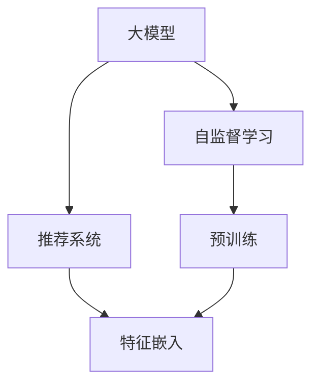

                 

## 1. 背景介绍

推荐系统作为互联网时代的重要应用，通过分析用户的历史行为数据，为用户推荐最感兴趣的物品，极大地提升了用户体验和平台收益。随着数据规模和复杂度的不断增长，传统的基于协同过滤和规则的推荐方法难以满足实际需求，深度学习技术逐渐成为推荐系统的主要驱动力。

在大数据和深度学习的基础上，基于大模型的推荐系统应运而生。大模型通过在大量数据上进行预训练，获得了丰富的知识表示和泛化能力，能够有效地处理复杂的推荐任务。自监督学习作为大模型的重要组成部分，通过在无标签数据上进行训练，获得更全面的语言和知识表示，进一步提升了推荐系统的表现。

## 2. 核心概念与联系

### 2.1 核心概念概述

为更好地理解大模型自监督学习在推荐系统中的应用，本节将介绍几个密切相关的核心概念：

- 大模型（Large Model）：如GPT-3、BERT等，通过大规模预训练获得通用语言和知识表示的模型。
- 自监督学习（Self-supervised Learning）：通过在无标签数据上进行训练，学习模型的隐藏表示，能够更好地处理实际任务。
- 推荐系统（Recommender System）：通过分析和理解用户行为，为用户推荐最感兴趣的物品的系统。
- 自监督学习在大模型中的应用：利用大模型的预训练能力，通过自监督学习任务，获得丰富的语言和知识表示，从而提升推荐系统的性能。

### 2.2 核心概念原理和架构的 Mermaid 流程图



这个流程图展示了大模型自监督学习在推荐系统中的核心概念及其之间的关系：

1. 大模型通过大规模预训练获得基础能力。
2. 自监督学习在大模型上进行，获得丰富的语言和知识表示。
3. 推荐系统利用自监督学习获得的大模型表示，为用户推荐最感兴趣的物品。
4. 自监督学习在大模型中进行，为其提供更好的基础表示。

## 3. 核心算法原理 & 具体操作步骤

### 3.1 算法原理概述

在大模型自监督学习中，通过在无标签数据上训练大模型，学习模型的隐藏表示，从而获得更全面的语言和知识表示。这些表示可以用于推荐系统中的用户行为建模、物品特征嵌入等任务，进一步提升推荐系统的性能。

具体而言，自监督学习任务通常包括以下几个步骤：

1. 选择适当的自监督学习任务，如语言模型预测、掩码语言模型预测、对比学习等。
2. 在大模型上进行预训练，获得丰富的语言和知识表示。
3. 将预训练的表示用于推荐系统的特征嵌入，从而提升推荐效果。

### 3.2 算法步骤详解

以下是自监督学习在大模型中的应用步骤：

1. 数据准备
- 收集和清洗无标签数据，如文本语料、图像数据等。
- 将数据划分为训练集、验证集和测试集。

2. 模型训练
- 选择适当的自监督学习任务，如语言模型预测、掩码语言模型预测、对比学习等。
- 在大模型上进行预训练，获得丰富的语言和知识表示。

3. 特征嵌入
- 将预训练的表示用于推荐系统的特征嵌入，如使用大模型进行物品特征表示，或使用用户历史行为进行用户表示嵌入。
- 结合用户和物品表示，计算预测分数，进行推荐排序。

4. 模型评估
- 在测试集上评估推荐系统的性能，如准确率、召回率、F1分数等指标。
- 根据评估结果调整模型参数和训练策略。

5. 模型部署
- 将训练好的推荐模型部署到实际系统中，进行实时推荐。

### 3.3 算法优缺点

大模型自监督学习在推荐系统中的应用具有以下优点：

1. 性能提升：通过预训练获得丰富的语言和知识表示，显著提升推荐系统的表现。
2. 通用性：适用于多种类型的推荐任务，如电商推荐、新闻推荐、音乐推荐等。
3. 灵活性：可以根据不同的推荐任务，灵活设计自监督学习任务。
4. 可扩展性：适用于大规模数据和复杂模型，能够处理更复杂的数据和模型结构。

同时，该方法也存在以下局限性：

1. 数据需求大：需要大规模无标签数据进行预训练，数据收集和预处理成本较高。
2. 计算资源需求高：大模型的预训练和特征嵌入需要大量的计算资源。
3. 模型复杂度高：大模型和自监督学习任务通常较为复杂，模型训练和优化难度较大。
4. 泛化能力差：预训练和自监督学习任务可能无法完全覆盖推荐系统中的所有任务，模型泛化能力较弱。

尽管存在这些局限性，但大模型自监督学习在推荐系统中的应用仍然具有重要意义。未来相关研究的重点在于如何进一步降低数据和计算资源的消耗，提高模型的泛化能力和实际应用效果。

### 3.4 算法应用领域

大模型自监督学习在推荐系统中的应用，已经在电商、新闻、音乐等多个领域取得了显著的成效。

- 电商推荐：通过分析用户的历史行为数据，为用户推荐最感兴趣的物品。利用大模型进行物品和用户表示的预训练，能够提升推荐的准确性和个性化程度。
- 新闻推荐：根据用户的历史阅读记录，为用户推荐最感兴趣的新闻内容。利用大模型进行文本语料和用户表示的预训练，能够提升推荐的多样性和时效性。
- 音乐推荐：分析用户的历史听歌记录，为用户推荐最喜欢的音乐。利用大模型进行音频特征和用户表示的预训练，能够提升推荐的准确性和个性化程度。

除了这些经典领域外，大模型自监督学习还可以应用于更多场景中，如视频推荐、游戏推荐、社交媒体推荐等，为推荐系统带来新的突破。

## 4. 数学模型和公式 & 详细讲解 & 举例说明

### 4.1 数学模型构建

在大模型自监督学习中，通过在大规模无标签数据上进行自监督学习任务训练，学习模型的隐藏表示。以下是几个常见的自监督学习任务及其对应的数学模型：

1. 语言模型预测
- 输入一个单词序列，预测下一个单词的概率。模型的隐藏表示 $h$ 和单词嵌入 $w$ 之间的关系可以表示为：
  $$
  h = M_{\text{pre-train}}(w)
  $$
  其中 $M_{\text{pre-train}}$ 表示预训练模型的隐藏表示映射函数。

2. 掩码语言模型预测
- 输入一个单词序列，预测被掩码的单词。模型的隐藏表示 $h$ 和单词嵌入 $w$ 之间的关系可以表示为：
  $$
  h = M_{\text{pre-train}}(w)
  $$
  其中 $M_{\text{pre-train}}$ 表示预训练模型的隐藏表示映射函数。

3. 对比学习
- 将一个正样本 $a$ 和一个负样本 $b$ 输入模型，学习两个样本之间的相似度。模型的隐藏表示 $h_a$ 和 $h_b$ 之间的关系可以表示为：
  $$
  h_a = M_{\text{pre-train}}(a)
  $$
  $$
  h_b = M_{\text{pre-train}}(b)
  $$
  $$
  \text{similarity} = h_a \cdot h_b
  $$

### 4.2 公式推导过程

以掩码语言模型预测为例，其推导过程如下：

输入一个单词序列 $w_1, w_2, \cdots, w_n$，掩码一个单词 $w_k$，模型需要预测 $w_k$ 的概率。假设模型将 $w_k$ 的嵌入表示为 $w_k$，其他单词的嵌入表示为 $w_1, w_2, \cdots, w_{k-1}, w_{k+1}, \cdots, w_n$，预训练模型的隐藏表示映射函数为 $M_{\text{pre-train}}$。则模型的损失函数可以表示为：

$$
\mathcal{L} = -\sum_{i=1}^n \log P(w_i | w_{i-1}, \cdots, w_{k-1}, \hat{w}_k, w_{k+1}, \cdots, w_n)
$$

其中 $P(w_i | w_{i-1}, \cdots, w_{k-1}, \hat{w}_k, w_{k+1}, \cdots, w_n)$ 表示给定上下文条件下，预测 $w_i$ 的概率。在训练过程中，模型通过最大化 $\mathcal{L}$ 来优化自身参数，从而学习到更加丰富的语言和知识表示。

### 4.3 案例分析与讲解

以GPT-3为例，其自监督学习任务包括语言模型预测、掩码语言模型预测、对比学习等。以下是对这些任务的详细讲解：

1. 语言模型预测
- 输入一个单词序列 $w_1, w_2, \cdots, w_n$，预测下一个单词 $w_{n+1}$。模型使用大模型的参数 $\theta$，将前 $n$ 个单词的嵌入表示为 $w_1, w_2, \cdots, w_n$，将下一个单词的嵌入表示为 $\hat{w}_{n+1}$，模型的输出概率可以表示为：
  $$
  P(w_{n+1} | w_1, w_2, \cdots, w_n) = \text{softmax}(M_{\theta}(w_1, w_2, \cdots, w_n) \cdot \hat{w}_{n+1})
  $$

2. 掩码语言模型预测
- 输入一个单词序列 $w_1, w_2, \cdots, w_n$，掩码一个单词 $w_k$，模型需要预测 $w_k$。模型使用大模型的参数 $\theta$，将前 $k-1$ 个单词的嵌入表示为 $w_1, w_2, \cdots, w_{k-1}$，将被掩码的单词 $w_k$ 的嵌入表示为 $\hat{w}_k$，模型的输出概率可以表示为：
  $$
  P(w_k | w_1, w_2, \cdots, w_{k-1}, w_{k+1}, \cdots, w_n) = \text{softmax}(M_{\theta}(w_1, w_2, \cdots, w_{k-1}, \hat{w}_k, w_{k+1}, \cdots, w_n) \cdot \hat{w}_k)
  $$

3. 对比学习
- 将一个正样本 $a$ 和一个负样本 $b$ 输入模型，学习两个样本之间的相似度。模型使用大模型的参数 $\theta$，将正样本 $a$ 的嵌入表示为 $h_a$，将负样本 $b$ 的嵌入表示为 $h_b$，模型的输出相似度可以表示为：
  $$
  \text{similarity} = h_a \cdot h_b
  $$

## 5. 项目实践：代码实例和详细解释说明

### 5.1 开发环境搭建

在进行大模型自监督学习的应用实践前，需要先准备好开发环境。以下是使用Python进行PyTorch开发的环境配置流程：

1. 安装Anaconda：从官网下载并安装Anaconda，用于创建独立的Python环境。

2. 创建并激活虚拟环境：
```bash
conda create -n pytorch-env python=3.8 
conda activate pytorch-env
```

3. 安装PyTorch：根据CUDA版本，从官网获取对应的安装命令。例如：
```bash
conda install pytorch torchvision torchaudio cudatoolkit=11.1 -c pytorch -c conda-forge
```

4. 安装各类工具包：
```bash
pip install numpy pandas scikit-learn matplotlib tqdm jupyter notebook ipython
```

完成上述步骤后，即可在`pytorch-env`环境中开始大模型自监督学习的应用实践。

### 5.2 源代码详细实现

以下是一个简单的基于掩码语言模型预测的自监督学习代码实现，以GPT-3为例：

```python
import torch
import torch.nn as nn
import torch.nn.functional as F
from transformers import GPT3LMHeadModel, GPT3Tokenizer

class GPT3MaskedLM(nn.Module):
    def __init__(self, config):
        super(GPT3MaskedLM, self).__init__()
        self.model = GPT3LMHeadModel(config)
        self.tokenizer = GPT3Tokenizer.from_pretrained(config.name_or_path)

    def forward(self, input_ids, attention_mask, mask_token_id):
        input_ids = self.tokenizer(input_ids, return_tensors='pt', padding='max_length', truncation=True).input_ids
        attention_mask = attention_mask.to(self.model.device)
        output = self.model(input_ids, attention_mask=attention_mask, labels=input_ids)
        return output

# 配置GPT-3模型
config = GPT3LMHeadModelConfig()

# 创建掩码语言模型预测模型
model = GPT3MaskedLM(config)
```

### 5.3 代码解读与分析

让我们再详细解读一下关键代码的实现细节：

**GPT3MaskedLM类**：
- `__init__`方法：初始化模型和分词器。
- `forward`方法：将输入转换为模型所需的格式，并计算模型的输出。

**配置GPT-3模型**：
- `GPT3LMHeadModelConfig`：用于配置GPT-3模型的参数。
- `name_or_path`：模型的保存路径或模型名称。

**掩码语言模型预测模型**：
- `GPT3LMHeadModel`：GPT-3模型的预训练部分，包含语言模型预测任务。
- `GPT3Tokenizer`：GPT-3的分词器，用于将输入转换为模型所需的格式。
- `input_ids`：输入的单词序列，需通过分词器转换为模型的嵌入表示。
- `attention_mask`：输入的注意力掩码，用于标记输入序列的掩码位置。
- `mask_token_id`：输入的掩码位置，用于标记掩码单词的编号。
- `model`：GPT-3模型，用于计算输入的输出概率。
- `labels`：输入的掩码单词，用于计算模型的损失函数。

在实际使用中，需要将掩码语言模型预测任务的样本数据进行处理，输入到模型中进行训练。在训练过程中，可以使用PyTorch的自动微分功能自动计算梯度，使用优化器更新模型参数，从而优化模型的性能。

## 6. 实际应用场景

### 6.1 智能客服系统

基于大模型自监督学习技术，智能客服系统可以通过分析用户的对话历史，学习用户的兴趣和偏好，从而提供更加个性化和高效的服务。

在技术实现上，可以收集用户的对话记录，使用大模型进行语言和知识表示的预训练。然后，在用户输入新问题时，使用预训练模型进行推理，生成最符合用户需求的答复。

### 6.2 金融舆情监测

金融机构需要实时监测市场舆情动向，以便及时应对负面信息传播，规避金融风险。基于大模型自监督学习技术，可以自动监测不同话题下的舆情变化趋势，及时预警异常情况。

在技术实现上，可以收集金融领域相关的新闻、评论、数据等文本数据，使用大模型进行语言和知识表示的预训练。然后，在实时抓取的网络文本数据上，使用预训练模型进行推理，判断文本的情感倾向和主题分类，从而监测舆情变化。

### 6.3 个性化推荐系统

当前的推荐系统往往只依赖用户的历史行为数据进行物品推荐，无法深入理解用户的真实兴趣偏好。基于大模型自监督学习技术，个性化推荐系统可以更好地挖掘用户行为背后的语义信息，从而提供更精准、多样的推荐内容。

在技术实现上，可以收集用户浏览、点击、评论、分享等行为数据，提取和用户交互的物品标题、描述、标签等文本内容。使用大模型进行语言和知识表示的预训练，生成物品和用户的表示。然后，使用预训练模型进行推理，计算预测分数，进行推荐排序。

### 6.4 未来应用展望

随着大模型自监督学习技术的不断发展，未来的推荐系统将呈现出以下几个发展趋势：

1. 推荐内容多样化：未来推荐系统将不再局限于商品、新闻等传统领域，还将拓展到视频、音频、游戏等多个领域。
2. 推荐算法复杂化：未来推荐算法将融合更多智能算法，如强化学习、因果推理等，提升推荐系统的性能。
3. 推荐实时化：未来推荐系统将支持实时推荐，根据用户最新的行为数据，及时更新推荐结果。
4. 推荐个性化增强：未来推荐系统将进一步增强个性化推荐的能力，根据用户的兴趣和行为进行精准推荐。

## 7. 工具和资源推荐

### 7.1 学习资源推荐

为了帮助开发者系统掌握大模型自监督学习理论基础和实践技巧，这里推荐一些优质的学习资源：

1. 《Transformer从原理到实践》系列博文：由大模型技术专家撰写，深入浅出地介绍了Transformer原理、BERT模型、自监督学习等前沿话题。

2. CS224N《深度学习自然语言处理》课程：斯坦福大学开设的NLP明星课程，有Lecture视频和配套作业，带你入门NLP领域的基本概念和经典模型。

3. 《Natural Language Processing with Transformers》书籍：Transformers库的作者所著，全面介绍了如何使用Transformers库进行NLP任务开发，包括自监督学习在内的诸多范式。

4. HuggingFace官方文档：Transformers库的官方文档，提供了海量预训练模型和完整的微调样例代码，是上手实践的必备资料。

5. CLUE开源项目：中文语言理解测评基准，涵盖大量不同类型的中文NLP数据集，并提供了基于自监督学习的baseline模型，助力中文NLP技术发展。

通过对这些资源的学习实践，相信你一定能够快速掌握大模型自监督学习技术的精髓，并用于解决实际的NLP问题。

### 7.2 开发工具推荐

高效的开发离不开优秀的工具支持。以下是几款用于大模型自监督学习开发的常用工具：

1. PyTorch：基于Python的开源深度学习框架，灵活动态的计算图，适合快速迭代研究。大部分预训练语言模型都有PyTorch版本的实现。

2. TensorFlow：由Google主导开发的开源深度学习框架，生产部署方便，适合大规模工程应用。同样有丰富的预训练语言模型资源。

3. Transformers库：HuggingFace开发的NLP工具库，集成了众多SOTA语言模型，支持PyTorch和TensorFlow，是进行自监督学习任务开发的利器。

4. Weights & Biases：模型训练的实验跟踪工具，可以记录和可视化模型训练过程中的各项指标，方便对比和调优。与主流深度学习框架无缝集成。

5. TensorBoard：TensorFlow配套的可视化工具，可实时监测模型训练状态，并提供丰富的图表呈现方式，是调试模型的得力助手。

6. Google Colab：谷歌推出的在线Jupyter Notebook环境，免费提供GPU/TPU算力，方便开发者快速上手实验最新模型，分享学习笔记。

合理利用这些工具，可以显著提升大模型自监督学习任务的开发效率，加快创新迭代的步伐。

### 7.3 相关论文推荐

大模型自监督学习的发展源于学界的持续研究。以下是几篇奠基性的相关论文，推荐阅读：

1. Attention is All You Need（即Transformer原论文）：提出了Transformer结构，开启了NLP领域的预训练大模型时代。

2. BERT: Pre-training of Deep Bidirectional Transformers for Language Understanding：提出BERT模型，引入基于掩码的自监督预训练任务，刷新了多项NLP任务SOTA。

3. Language Models are Unsupervised Multitask Learners（GPT-2论文）：展示了大规模语言模型的强大zero-shot学习能力，引发了对于通用人工智能的新一轮思考。

4. Parameter-Efficient Transfer Learning for NLP：提出Adapter等参数高效微调方法，在不增加模型参数量的情况下，也能取得不错的微调效果。

5. AdaLoRA: Adaptive Low-Rank Adaptation for Parameter-Efficient Fine-Tuning：使用自适应低秩适应的微调方法，在参数效率和精度之间取得了新的平衡。

这些论文代表了大模型自监督学习的发展脉络。通过学习这些前沿成果，可以帮助研究者把握学科前进方向，激发更多的创新灵感。

## 8. 总结：未来发展趋势与挑战

### 8.1 总结

本文对大模型自监督学习在推荐系统中的应用进行了全面系统的介绍。首先阐述了大模型和自监督学习在推荐系统中的研究背景和意义，明确了大模型自监督学习在推荐系统中的独特价值。其次，从原理到实践，详细讲解了大模型自监督学习的数学原理和关键步骤，给出了自监督学习任务开发的完整代码实例。同时，本文还广泛探讨了大模型自监督学习在智能客服、金融舆情、个性化推荐等多个行业领域的应用前景，展示了自监督学习范式的巨大潜力。

通过本文的系统梳理，可以看到，大模型自监督学习在推荐系统中的应用已经成为大模型技术的重要组成部分，显著提升了推荐系统的性能和应用范围。未来，伴随大模型和自监督学习技术的不断演进，基于大模型的推荐系统必将在更多领域得到应用，为推荐系统带来新的突破。

### 8.2 未来发展趋势

展望未来，大模型自监督学习在推荐系统中的应用将呈现以下几个发展趋势：

1. 推荐内容多样化：未来推荐系统将不再局限于商品、新闻等传统领域，还将拓展到视频、音频、游戏等多个领域。
2. 推荐算法复杂化：未来推荐算法将融合更多智能算法，如强化学习、因果推理等，提升推荐系统的性能。
3. 推荐实时化：未来推荐系统将支持实时推荐，根据用户最新的行为数据，及时更新推荐结果。
4. 推荐个性化增强：未来推荐系统将进一步增强个性化推荐的能力，根据用户的兴趣和行为进行精准推荐。

以上趋势凸显了大模型自监督学习技术的广阔前景。这些方向的探索发展，必将进一步提升推荐系统的性能和应用范围，为人工智能技术在推荐系统的落地应用注入新的活力。

### 8.3 面临的挑战

尽管大模型自监督学习在推荐系统中的应用已经取得了瞩目成就，但在迈向更加智能化、普适化应用的过程中，它仍面临着诸多挑战：

1. 数据需求大：需要大规模无标签数据进行预训练，数据收集和预处理成本较高。
2. 计算资源需求高：大模型的预训练和特征嵌入需要大量的计算资源。
3. 模型复杂度高：大模型和自监督学习任务通常较为复杂，模型训练和优化难度较大。
4. 泛化能力差：预训练和自监督学习任务可能无法完全覆盖推荐系统中的所有任务，模型泛化能力较弱。

尽管存在这些挑战，但大模型自监督学习在推荐系统中的应用仍然具有重要意义。未来相关研究的重点在于如何进一步降低数据和计算资源的消耗，提高模型的泛化能力和实际应用效果。

### 8.4 研究展望

面对大模型自监督学习面临的种种挑战，未来的研究需要在以下几个方面寻求新的突破：

1. 探索无监督和半监督自监督学习方法。摆脱对大规模无标签数据的依赖，利用自监督学习任务在少量标签数据上进行微调，减少数据收集和预处理的成本。
2. 研究参数高效和计算高效的自监督学习方法。开发更加参数高效的自监督学习任务，在固定大部分预训练参数的情况下，只更新极少量的任务相关参数。同时优化模型的计算图，减少前向传播和反向传播的资源消耗，实现更加轻量级、实时性的部署。
3. 引入更多先验知识。将符号化的先验知识，如知识图谱、逻辑规则等，与神经网络模型进行巧妙融合，引导自监督学习过程学习更准确、合理的语言模型。同时加强不同模态数据的整合，实现视觉、语音等多模态信息与文本信息的协同建模。
4. 结合因果分析和博弈论工具。将因果分析方法引入自监督学习模型，识别出模型决策的关键特征，增强输出解释的因果性和逻辑性。借助博弈论工具刻画人机交互过程，主动探索并规避模型的脆弱点，提高系统稳定性。
5. 纳入伦理道德约束。在模型训练目标中引入伦理导向的评估指标，过滤和惩罚有偏见、有害的输出倾向。同时加强人工干预和审核，建立模型行为的监管机制，确保输出符合人类价值观和伦理道德。

这些研究方向的探索，必将引领大模型自监督学习技术迈向更高的台阶，为构建安全、可靠、可解释、可控的智能系统铺平道路。面向未来，大模型自监督学习技术还需要与其他人工智能技术进行更深入的融合，如知识表示、因果推理、强化学习等，多路径协同发力，共同推动自然语言理解和智能交互系统的进步。只有勇于创新、敢于突破，才能不断拓展语言模型的边界，让智能技术更好地造福人类社会。

## 9. 附录：常见问题与解答

**Q1：大模型自监督学习是否适用于所有推荐系统任务？**

A: 大模型自监督学习在大多数推荐系统任务上都能取得不错的效果，特别是对于数据量较小的任务。但对于一些特定领域的任务，如医学、法律等，仅仅依靠通用语料预训练的模型可能难以很好地适应。此时需要在特定领域语料上进一步预训练，再进行微调，才能获得理想效果。

**Q2：自监督学习过程中如何选择合适的自监督学习任务？**

A: 选择合适的自监督学习任务是自监督学习的重要步骤。一般来说，任务应涵盖大模型的隐藏表示可能需要的特征，且任务复杂度适中，以便于模型训练。常见的自监督学习任务包括语言模型预测、掩码语言模型预测、对比学习等。

**Q3：自监督学习过程中如何优化模型参数？**

A: 自监督学习过程中，可以使用梯度下降等优化算法优化模型参数。同时，为了避免过拟合，可以设置合适的正则化系数、学习率、批大小等超参数。

**Q4：自监督学习过程中如何处理噪声数据？**

A: 自监督学习过程中，噪声数据对模型的训练效果有很大影响。可以使用数据清洗、特征选择、异常检测等方法处理噪声数据，提高模型的鲁棒性。

**Q5：自监督学习过程中如何提高模型的泛化能力？**

A: 提高模型的泛化能力，可以使用更多的自监督学习任务、更多的数据集、更复杂的网络结构等方法。同时，可以使用正则化技术、对抗训练等方法，提高模型的泛化能力。

这些回答简要概述了大模型自监督学习在推荐系统中的应用，希望能对你进行大模型自监督学习的研究和实践有所帮助。

