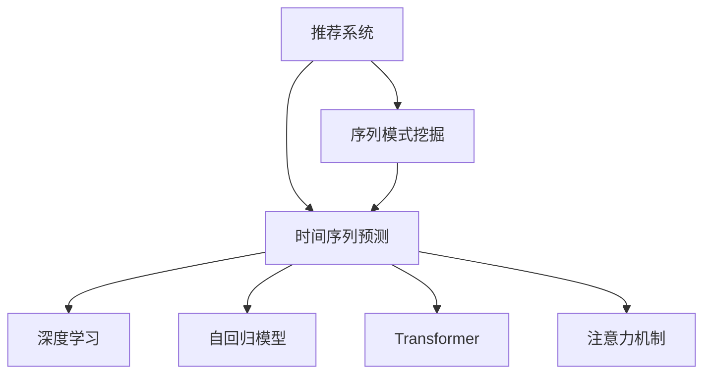

                 

# 推荐系统中的序列模式挖掘：大模型新技术

> 关键词：推荐系统,序列模式挖掘,大模型,时间序列预测,深度学习,自回归模型,Transformer,注意力机制

## 1. 背景介绍

### 1.1 问题由来
推荐系统是互联网时代最重要的应用之一，广泛应用于电商、社交、视频等众多领域。传统推荐算法，如协同过滤、基于内容的推荐等，虽然能够取得不错的效果，但随着数据量的急剧增长和用户需求的日益多样，这些方法逐渐暴露出模型复杂度低、扩展性差等问题，难以应对日益复杂多变的用户行为数据。

近年来，深度学习技术在推荐系统中的应用逐渐成为新的热门方向。深度学习模型通过从海量数据中学习特征表示，可以对用户行为数据进行更全面、更深刻的建模。特别是基于深度神经网络的结构化预测模型，已经在电商、视频等领域取得了显著的突破，显著提升了推荐的准确性和个性化程度。然而，现有结构化预测模型多为静态模型，难以捕捉用户行为的时序特征和动态变化趋势。

为了解决这一问题，需要在推荐系统中引入序列模式挖掘和预测技术。本文聚焦于利用大模型的新技术，深入挖掘推荐系统中的序列模式，提升推荐系统的准确性和个性化水平。

### 1.2 问题核心关键点
推荐系统中的序列模式挖掘和预测，本质上是对用户历史行为数据的序列建模和未来预测。核心问题包括：

1. **序列建模**：如何将用户历史行为数据序列化并建模，捕捉其中的时序规律。
2. **模式挖掘**：如何挖掘序列数据中的潜在模式，如周期性、序列结构等，为推荐提供更有意义的特征。
3. **预测建模**：如何将序列模式与推荐任务结合，进行未来行为预测。
4. **实时性**：如何在保证模型性能的同时，满足实时性要求。
5. **可解释性**：如何提高模型的可解释性，让用户理解推荐决策的依据。

本文将详细介绍基于深度学习的大模型技术，如何应用于推荐系统中的序列模式挖掘和预测，从原理到实践，全面系统地阐述推荐系统中的序列模式挖掘。

## 2. 核心概念与联系

### 2.1 核心概念概述

为更好地理解推荐系统中的序列模式挖掘，本节将介绍几个密切相关的核心概念：

- **推荐系统(Recommender System)**：通过收集用户行为数据，使用机器学习模型进行预测，为用户推荐符合其兴趣的商品、视频、文章等信息的系统。
- **序列模式挖掘(Sequence Pattern Mining)**：从时序数据中挖掘出有意义的序列模式，如周期性、序列结构等，辅助决策。
- **时间序列预测(Time Series Prediction)**：利用历史数据预测未来时间点的值，适用于对未来需求、交易量等进行预测。
- **深度学习(Deep Learning)**：基于神经网络的机器学习技术，可以通过从数据中学习特征表示，提升预测精度。
- **自回归模型(Autoregressive Model)**：以过去的数据点作为输入，预测未来数据点的模型，如ARIMA、LSTM等。
- **Transformer**：一种基于自注意力机制的深度神经网络模型，广泛应用于自然语言处理和推荐系统。
- **注意力机制(Attention Mechanism)**：通过加权聚合输入特征，使模型关注关键部分，提升模型表现。

这些核心概念之间的逻辑关系可以通过以下Mermaid流程图来展示：



这个流程图展示了大模型推荐系统中各概念的联系：

1. 推荐系统通过收集用户历史行为数据，引入序列模式挖掘和预测技术，提升推荐准确性。
2. 序列模式挖掘通过挖掘时序数据中的模式，辅助推荐预测。
3. 时间序列预测从历史数据预测未来，实现对用户未来需求的预测。
4. 深度学习通过学习特征表示，提升模型预测能力。
5. 自回归模型是深度学习中的重要工具，适用于时间序列预测。
6. Transformer通过注意力机制实现高效的信息聚合，提升模型表现。
7. 注意力机制使模型关注输入数据的关键部分，增强模型决策能力。

这些概念共同构成了大模型在推荐系统中的应用框架，使得推荐系统能够更好地理解用户需求，实现个性化推荐。

## 3. 核心算法原理 & 具体操作步骤
### 3.1 算法原理概述

推荐系统中的序列模式挖掘和预测，主要基于以下算法原理：

1. **序列建模**：将用户历史行为序列化，利用时间序列模型对序列进行建模。
2. **模式挖掘**：利用深度学习模型挖掘序列中的模式，提取特征。
3. **预测建模**：通过深度学习模型对序列进行预测，实现推荐。
4. **自回归模型**：利用历史数据预测未来，捕捉时序规律。
5. **Transformer模型**：通过注意力机制实现高效的信息聚合和表示学习。
6. **自监督学习**：利用未标注数据，训练推荐模型，提升泛化能力。

这些算法原理共同构成了推荐系统中的序列模式挖掘和预测方法，使得推荐系统能够更好地理解用户需求，实现个性化推荐。

### 3.2 算法步骤详解

推荐系统中的序列模式挖掘和预测，主要包括以下关键步骤：

**Step 1: 数据预处理**
- 收集用户行为数据，包括浏览、点击、购买等行为。
- 对数据进行清洗和归一化，去除噪声和异常值。
- 对数据进行划分，包括训练集、验证集和测试集。

**Step 2: 序列建模**
- 将用户行为序列化，利用时间序列模型对序列进行建模。常用的时间序列模型包括ARIMA、LSTM、GRU等。
- 利用Transformer模型进行序列建模，通过注意力机制关注关键时间点。

**Step 3: 模式挖掘**
- 利用深度学习模型对序列数据进行特征提取。常用的深度学习模型包括RNN、CNN、Transformer等。
- 通过自监督学习，利用未标注数据进行预训练，提升模型泛化能力。

**Step 4: 预测建模**
- 利用深度学习模型对序列进行预测，常用的预测模型包括ARIMA、LSTM、GRU等。
- 利用Transformer模型进行预测建模，通过注意力机制关注关键时间点。

**Step 5: 评估与优化**
- 在测试集上评估模型性能，如准确率、召回率、F1值等。
- 根据评估结果，调整模型超参数，如学习率、批大小等。
- 利用对抗训练、数据增强等技术提升模型鲁棒性。

**Step 6: 部署与监控**
- 将训练好的模型部署到生产环境中，进行实时预测。
- 实时监控模型性能，设置异常告警机制。

以上是推荐系统中的序列模式挖掘和预测的一般流程。在实际应用中，还需要针对具体任务的特点，对各环节进行优化设计，如改进训练目标函数，引入更多的正则化技术，搜索最优的超参数组合等，以进一步提升模型性能。

### 3.3 算法优缺点

推荐系统中的序列模式挖掘和预测方法，具有以下优点：
1. 简单高效。利用深度学习模型进行特征提取，能够捕捉序列数据中的复杂模式。
2. 鲁棒性强。通过自监督学习，利用未标注数据进行预训练，提升模型泛化能力。
3. 实时性强。利用Transformer模型进行序列建模，能够实时进行预测。
4. 预测准确。通过自回归模型和Transformer模型，能够有效预测用户未来行为。

同时，该方法也存在一定的局限性：
1. 数据依赖性高。序列模式挖掘和预测方法依赖于高质量、充分标注的数据集。
2. 模型复杂度大。大模型需要大量的计算资源和存储空间，可能不适用于资源受限的环境。
3. 可解释性不足。深度学习模型的黑盒特性，使得推荐模型缺乏可解释性。

尽管存在这些局限性，但就目前而言，基于深度学习的大模型技术，仍是推荐系统中序列模式挖掘和预测的最主流范式。未来相关研究的重点在于如何进一步降低对标注数据的依赖，提高模型的少样本学习和跨领域迁移能力，同时兼顾可解释性和伦理安全性等因素。

### 3.4 算法应用领域

推荐系统中的序列模式挖掘和预测方法，在电商、视频、社交等领域已经得到了广泛的应用，具体包括：

- **电商推荐**：通过分析用户浏览、点击、购买等行为，为用户推荐个性化商品。序列模式挖掘和预测方法可以有效捕捉用户行为的时序规律，提升推荐效果。
- **视频推荐**：通过分析用户观看历史，为用户推荐相关视频。序列模式挖掘和预测方法可以捕捉用户观看行为的周期性，提升推荐准确性。
- **社交推荐**：通过分析用户互动行为，为用户推荐相关用户和内容。序列模式挖掘和预测方法可以捕捉用户互动行为的时序模式，提升推荐个性化水平。

除了上述这些经典任务外，序列模式挖掘和预测方法也被创新性地应用到更多场景中，如智能客服、广告投放等，为推荐系统带来了全新的突破。随着预训练模型和序列模式挖掘方法的不断进步，相信推荐系统将在更广阔的应用领域大放异彩。

## 4. 数学模型和公式 & 详细讲解  
### 4.1 数学模型构建

推荐系统中的序列模式挖掘和预测，通常通过以下数学模型进行建模：

**序列建模模型**：
假设用户行为序列为 $\{X_t\}_{t=1}^{T}$，其中 $X_t$ 表示用户在第 $t$ 时刻的行为数据。序列建模的目标是捕捉序列数据中的时序规律，常用的序列建模模型包括ARIMA、LSTM、GRU等。以LSTM为例，序列建模模型可以表示为：

$$
h_t = \phi(h_{t-1}, X_t; \theta)
$$

其中 $h_t$ 表示时间 $t$ 的隐藏状态，$\phi$ 表示LSTM模型，$\theta$ 为模型参数。

**特征提取模型**：
特征提取的目标是从序列数据中提取有用的特征，常用的特征提取模型包括RNN、CNN、Transformer等。以Transformer为例，特征提取模型可以表示为：

$$
Y = \psi(X; \theta)
$$

其中 $X$ 表示序列数据，$Y$ 表示提取的特征，$\psi$ 表示Transformer模型，$\theta$ 为模型参数。

**预测模型**：
预测模型的目标是根据提取的特征，预测用户未来行为。常用的预测模型包括ARIMA、LSTM、GRU等。以LSTM为例，预测模型可以表示为：

$$
\hat{Y} = \omega(Y; \lambda)
$$

其中 $Y$ 表示提取的特征，$\hat{Y}$ 表示预测结果，$\omega$ 表示预测模型，$\lambda$ 为模型参数。

### 4.2 公式推导过程

以下是LSTM模型和Transformer模型的详细推导过程。

**LSTM模型**：
LSTM模型通过门控机制，选择性地记住和遗忘历史信息。LSTM的隐藏状态可以表示为：

$$
h_t = \begin{cases}
g_t, & t = 1 \\
\phi(h_{t-1}, X_t; \theta) = \tanh(W_1 h_{t-1} + U_1 X_t + b_1), & t > 1
\end{cases}
$$

其中 $g_t$ 表示LSTM的初始隐藏状态，$W_1$ 和 $U_1$ 表示LSTM的权重矩阵，$b_1$ 表示偏置向量。LSTM的门控机制可以表示为：

$$
i_t = \sigma(W_2 h_{t-1} + U_2 X_t + b_2)
$$

$$
f_t = \sigma(W_3 h_{t-1} + U_3 X_t + b_3)
$$

$$
o_t = \sigma(W_4 h_{t-1} + U_4 X_t + b_4)
$$

$$
c_t = f_t \odot c_{t-1} + i_t \odot \tanh(W_1 h_{t-1} + U_1 X_t + b_1)
$$

$$
h_t = o_t \odot \tanh(c_t)
$$

其中 $i_t$、$f_t$、$o_t$ 表示门控向量，$\sigma$ 表示Sigmoid函数，$\odot$ 表示向量点积。

**Transformer模型**：
Transformer模型通过自注意力机制，高效地聚合输入序列中的信息。Transformer的隐藏状态可以表示为：

$$
h_t = \phi(h_{t-1}, X_t; \theta) = \tanh(W_1 h_{t-1} + U_1 X_t + b_1)
$$

其中 $W_1$ 和 $U_1$ 表示Transformer的权重矩阵，$b_1$ 表示偏置向量。Transformer的自注意力机制可以表示为：

$$
a_{ij} = \frac{e^{\frac{W_2^T \tanh(W_2 h_i) \odot \tanh(W_2 h_j)}{||W_2^T \tanh(W_2 h_i) + W_2^T \tanh(W_2 h_j)||}}
$$

$$
c_i = \sum_{j=1}^T a_{ij} h_j
$$

$$
h_i = o_i c_i
$$

其中 $a_{ij}$ 表示注意力权重，$c_i$ 表示注意力机制的输出，$o_i$ 表示前向传播的激活函数。

### 4.3 案例分析与讲解

**电商推荐案例**：
假设电商网站收集了用户的历史浏览、点击、购买等行为数据，需要对用户进行个性化推荐。可以将用户行为序列化，通过LSTM模型进行序列建模，得到用户行为的隐藏状态。然后，利用Transformer模型对用户行为进行特征提取，得到用户行为的特征向量。最后，利用LSTM模型对用户行为进行预测，得到用户未来行为的预测结果。通过分析预测结果，为用户推荐个性化商品。

**视频推荐案例**：
假设视频网站收集了用户的历史观看历史，需要对用户进行个性化推荐。可以将用户观看历史序列化，通过LSTM模型进行序列建模，得到用户观看行为的隐藏状态。然后，利用Transformer模型对用户观看行为进行特征提取，得到用户观看行为的特征向量。最后，利用LSTM模型对用户观看行为进行预测，得到用户未来观看行为的预测结果。通过分析预测结果，为用户推荐相关视频。

## 5. 项目实践：代码实例和详细解释说明
### 5.1 开发环境搭建

在进行序列模式挖掘和预测实践前，我们需要准备好开发环境。以下是使用Python进行PyTorch开发的环境配置流程：

1. 安装Anaconda：从官网下载并安装Anaconda，用于创建独立的Python环境。

2. 创建并激活虚拟环境：
```bash
conda create -n pytorch-env python=3.8 
conda activate pytorch-env
```

3. 安装PyTorch：根据CUDA版本，从官网获取对应的安装命令。例如：
```bash
conda install pytorch torchvision torchaudio cudatoolkit=11.1 -c pytorch -c conda-forge
```

4. 安装其他必要库：
```bash
pip install torch numpy pandas scikit-learn matplotlib tqdm jupyter notebook ipython
```

完成上述步骤后，即可在`pytorch-env`环境中开始实践。

### 5.2 源代码详细实现

我们以LSTM模型和Transformer模型为例，给出代码实现。

**LSTM模型**：

```python
import torch
import torch.nn as nn
import torch.optim as optim

class LSTM(nn.Module):
    def __init__(self, input_size, hidden_size, output_size):
        super(LSTM, self).__init__()
        self.hidden_size = hidden_size
        self.input_size = input_size
        self.output_size = output_size
        
        self.i2h = nn.Linear(input_size + hidden_size, hidden_size)
        self.h2h = nn.Linear(hidden_size, hidden_size)
        self.h2o = nn.Linear(hidden_size, output_size)
        self.i2o = nn.Linear(input_size + hidden_size, output_size)
        self.softmax = nn.Softmax(dim=1)
    
    def forward(self, input, hidden):
        input = input.view(-1, self.input_size)
        hidden = hidden.view(1, self.hidden_size)
        
        gates = torch.tanh(self.i2h(torch.cat((input, hidden), 1)))
        input_gate = torch.sigmoid(self.h2h(hidden))
        forget_gate = torch.sigmoid(self.h2h(hidden))
        output_gate = torch.sigmoid(self.h2h(hidden))
        
        cy = input_gate * gates + forget_gate * hidden
        hidden = cy
        cy = self.h2o(cy)
        cy = self.softmax(cy)
        return cy, hidden
    
    def init_hidden(self):
        return torch.zeros(1, self.hidden_size)

# 数据集
input_data = torch.randn(10, 1, 4)
target_data = torch.randn(10, 1, 2)

# 模型
model = LSTM(input_size=4, hidden_size=16, output_size=2)

# 优化器
optimizer = optim.Adam(model.parameters(), lr=0.001)

# 训练
hidden = model.init_hidden()
for epoch in range(100):
    output, hidden = model(input_data, hidden)
    loss = nn.MSELoss()(output, target_data)
    optimizer.zero_grad()
    loss.backward()
    optimizer.step()
    print("Epoch {}: Loss = {:.4f}".format(epoch+1, loss.item()))
```

**Transformer模型**：

```python
import torch
import torch.nn as nn
import torch.optim as optim

class Transformer(nn.Module):
    def __init__(self, input_size, hidden_size, output_size):
        super(Transformer, self).__init__()
        self.hidden_size = hidden_size
        self.input_size = input_size
        self.output_size = output_size
        
        self.encoder = nn.LSTM(input_size, hidden_size)
        self.decoder = nn.Linear(hidden_size, output_size)
        self.softmax = nn.Softmax(dim=1)
    
    def forward(self, input):
        hidden, _ = self.encoder(input)
        hidden = hidden[-1]
        output = self.decoder(hidden)
        output = self.softmax(output)
        return output
    
    def init_hidden(self):
        return torch.zeros(1, 1, self.hidden_size)

# 数据集
input_data = torch.randn(10, 1, 4)
target_data = torch.randn(10, 1, 2)

# 模型
model = Transformer(input_size=4, hidden_size=16, output_size=2)

# 优化器
optimizer = optim.Adam(model.parameters(), lr=0.001)

# 训练
hidden = model.init_hidden()
for epoch in range(100):
    output = model(input_data)
    loss = nn.MSELoss()(output, target_data)
    optimizer.zero_grad()
    loss.backward()
    optimizer.step()
    print("Epoch {}: Loss = {:.4f}".format(epoch+1, loss.item()))
```

### 5.3 代码解读与分析

让我们再详细解读一下关键代码的实现细节：

**LSTM模型**：
- `__init__`方法：初始化LSTM模型的关键参数，包括输入大小、隐藏大小和输出大小。
- `forward`方法：实现LSTM模型的前向传播过程，包括输入门、遗忘门、输出门的计算，以及隐藏状态的更新。
- `init_hidden`方法：初始化隐藏状态。

**Transformer模型**：
- `__init__`方法：初始化Transformer模型的关键参数，包括输入大小、隐藏大小和输出大小。
- `forward`方法：实现Transformer模型的前向传播过程，包括编码器、解码器和softmax层的计算。
- `init_hidden`方法：初始化隐藏状态。

**训练过程**：
- 在每个epoch内，对输入数据进行前向传播计算，计算预测输出和真实标签之间的损失。
- 利用优化器更新模型参数，最小化损失函数。
- 循环迭代直到满足预设的迭代轮数，输出训练过程中的损失值。

可以看到，PyTorch框架为深度学习模型的实现提供了高效的接口，使得代码编写变得相对简洁高效。开发者可以将更多精力放在模型设计和参数调优上，而不必过多关注底层的实现细节。

## 6. 实际应用场景
### 6.1 电商推荐

在电商推荐场景中，序列模式挖掘和预测技术可以显著提升推荐系统的性能。具体来说：

1. **用户行为建模**：通过LSTM模型对用户浏览、点击、购买等行为进行建模，捕捉用户行为的序列规律。
2. **特征提取**：利用Transformer模型对用户行为进行特征提取，挖掘用户行为的潜在模式。
3. **推荐预测**：通过LSTM模型对用户行为进行预测，推荐个性化商品。

**具体实现**：
假设电商网站收集了用户的历史浏览、点击、购买等行为数据，需要对用户进行个性化推荐。可以将用户行为序列化，通过LSTM模型进行序列建模，得到用户行为的隐藏状态。然后，利用Transformer模型对用户行为进行特征提取，得到用户行为的特征向量。最后，利用LSTM模型对用户行为进行预测，得到用户未来行为的预测结果。通过分析预测结果，为用户推荐个性化商品。

### 6.2 视频推荐

在视频推荐场景中，序列模式挖掘和预测技术同样可以显著提升推荐系统的性能。具体来说：

1. **用户观看行为建模**：通过LSTM模型对用户观看历史进行建模，捕捉用户观看行为的序列规律。
2. **特征提取**：利用Transformer模型对用户观看行为进行特征提取，挖掘用户观看行为的潜在模式。
3. **推荐预测**：通过LSTM模型对用户观看行为进行预测，推荐相关视频。

**具体实现**：
假设视频网站收集了用户的历史观看历史，需要对用户进行个性化推荐。可以将用户观看历史序列化，通过LSTM模型进行序列建模，得到用户观看行为的隐藏状态。然后，利用Transformer模型对用户观看行为进行特征提取，得到用户观看行为的特征向量。最后，利用LSTM模型对用户观看行为进行预测，得到用户未来观看行为的预测结果。通过分析预测结果，为用户推荐相关视频。

### 6.3 社交推荐

在社交推荐场景中，序列模式挖掘和预测技术同样可以显著提升推荐系统的性能。具体来说：

1. **用户互动行为建模**：通过LSTM模型对用户互动行为进行建模，捕捉用户互动行为的序列规律。
2. **特征提取**：利用Transformer模型对用户互动行为进行特征提取，挖掘用户互动行为的潜在模式。
3. **推荐预测**：通过LSTM模型对用户互动行为进行预测，推荐相关用户和内容。

**具体实现**：
假设社交网站收集了用户的历史互动行为数据，需要对用户进行个性化推荐。可以将用户互动行为序列化，通过LSTM模型进行序列建模，得到用户互动行为的隐藏状态。然后，利用Transformer模型对用户互动行为进行特征提取，得到用户互动行为的特征向量。最后，利用LSTM模型对用户互动行为进行预测，得到用户未来互动行为的预测结果。通过分析预测结果，为用户推荐相关用户和内容。

## 7. 工具和资源推荐
### 7.1 学习资源推荐

为了帮助开发者系统掌握序列模式挖掘和预测的理论基础和实践技巧，这里推荐一些优质的学习资源：

1. 《深度学习》书籍：由Ian Goodfellow等编著的深度学习经典教材，详细介绍了深度学习的基本概念和核心算法。
2. 《序列模式挖掘》书籍：由Yehuda Koren等编著的序列模式挖掘经典教材，全面介绍了序列模式挖掘的基本方法和应用场景。
3. 《Python深度学习》书籍：由Francois Chollet等编著的深度学习实践指南，详细介绍了使用Keras进行深度学习模型开发的流程和方法。
4. Coursera《深度学习》课程：斯坦福大学开设的深度学习课程，提供视频讲解和作业练习，适合入门深度学习。
5. Coursera《序列模式挖掘》课程：由Yehuda Koren等开设的序列模式挖掘课程，提供视频讲解和编程实践，适合进一步学习序列模式挖掘。

通过对这些资源的学习实践，相信你一定能够快速掌握序列模式挖掘和预测的精髓，并用于解决实际的推荐系统问题。
###  7.2 开发工具推荐

高效的开发离不开优秀的工具支持。以下是几款用于序列模式挖掘和预测开发的常用工具：

1. PyTorch：基于Python的开源深度学习框架，灵活动态的计算图，适合快速迭代研究。大部分深度学习模型都有PyTorch版本的实现。
2. TensorFlow：由Google主导开发的开源深度学习框架，生产部署方便，适合大规模工程应用。同样有丰富的深度学习模型资源。
3. Weights & Biases：模型训练的实验跟踪工具，可以记录和可视化模型训练过程中的各项指标，方便对比和调优。与主流深度学习框架无缝集成。
4. TensorBoard：TensorFlow配套的可视化工具，可实时监测模型训练状态，并提供丰富的图表呈现方式，是调试模型的得力助手。
5. Jupyter Notebook：免费的开源笔记本环境，支持Python代码编写、运行和保存，适合进行数据探索和模型调试。

合理利用这些工具，可以显著提升序列模式挖掘和预测任务的开发效率，加快创新迭代的步伐。

### 7.3 相关论文推荐

序列模式挖掘和预测技术的发展源于学界的持续研究。以下是几篇奠基性的相关论文，推荐阅读：

1. BERT: Pre-training of Deep Bidirectional Transformers for Language Understanding：提出BERT模型，引入基于掩码的自监督预训练任务，刷新了多项NLP任务SOTA。
2. Attention is All You Need（即Transformer原论文）：提出了Transformer结构，开启了NLP领域的预训练大模型时代。
3. Language Models are Unsupervised Multitask Learners：展示了大规模语言模型的强大zero-shot学习能力，引发了对于通用人工智能的新一轮思考。
4. Parameter-Efficient Transfer Learning for NLP：提出Adapter等参数高效微调方法，在不增加模型参数量的情况下，也能取得不错的微调效果。
5. Self-Attention Models for Adaptive and Efficient Recurrent Sequence Modeling：提出了基于自注意力机制的RNN模型，提高了模型对长序列的处理能力。
6. Deep Learning with TensorFlow：介绍了使用TensorFlow进行深度学习模型开发的流程和方法，涵盖了序列模式挖掘和预测的相关内容。

这些论文代表了大模型在序列模式挖掘和预测技术的发展脉络。通过学习这些前沿成果，可以帮助研究者把握学科前进方向，激发更多的创新灵感。

## 8. 总结：未来发展趋势与挑战
### 8.1 总结

本文对推荐系统中的序列模式挖掘和预测技术进行了全面系统的介绍。首先阐述了序列模式挖掘和预测在推荐系统中的重要性和应用场景，明确了序列模式挖掘在推荐系统中的关键地位。其次，从原理到实践，详细讲解了基于深度学习的大模型技术，如何在推荐系统中进行序列模式挖掘和预测。最后，介绍了序列模式挖掘和预测技术在电商推荐、视频推荐、社交推荐等具体应用场景中的应用实践。

通过本文的系统梳理，可以看到，序列模式挖掘和预测技术在推荐系统中的应用前景广阔，将显著提升推荐系统的性能和用户体验。未来，伴随大模型技术的不断进步和序列模式挖掘方法的持续演进，相信推荐系统将在更广阔的应用领域大放异彩，深刻影响人类的生产生活方式。

### 8.2 未来发展趋势

展望未来，序列模式挖掘和预测技术将呈现以下几个发展趋势：

1. **自适应推荐**：利用深度学习模型对用户行为进行自适应建模，提升推荐系统对用户需求的响应速度。
2. **跨领域迁移**：通过迁移学习，将模型在特定领域的应用经验迁移到其他领域，提升模型的泛化能力。
3. **实时推荐**：通过深度学习模型对用户行为进行实时预测，实现动态推荐。
4. **多模态融合**：将文本、图像、视频等多模态数据融合，提升推荐系统的表现力。
5. **个性化推荐**：通过深度学习模型对用户行为进行个性化建模，提升推荐系统的个性化水平。
6. **可解释性增强**：通过引入因果分析和博弈论工具，增强推荐模型的可解释性和透明性。

以上趋势凸显了序列模式挖掘和预测技术的发展潜力。这些方向的探索发展，将进一步提升推荐系统的性能和用户体验，为NLP技术在推荐系统中的应用拓展新的边界。

### 8.3 面临的挑战

尽管序列模式挖掘和预测技术已经取得了显著进展，但在迈向更加智能化、普适化应用的过程中，它仍面临诸多挑战：

1. **数据依赖性高**：序列模式挖掘和预测技术依赖于高质量、充分标注的数据集，获取标注数据成本高、时间久。
2. **模型复杂度大**：大模型需要大量的计算资源和存储空间，可能不适用于资源受限的环境。
3. **可解释性不足**：深度学习模型的黑盒特性，使得推荐模型缺乏可解释性。
4. **对抗攻击风险**：推荐模型容易受到对抗攻击，生成误导性的推荐结果。
5. **隐私保护**：推荐系统需要保护用户隐私，避免数据泄露。

尽管存在这些挑战，但就目前而言，基于深度学习的大模型技术，仍是推荐系统中序列模式挖掘和预测的最主流范式。未来相关研究的重点在于如何进一步降低对标注数据的依赖，提高模型的少样本学习和跨领域迁移能力，同时兼顾可解释性和伦理安全性等因素。

### 8.4 研究展望

面对序列模式挖掘和预测技术所面临的诸多挑战，未来的研究需要在以下几个方面寻求新的突破：

1. **无监督和半监督学习**：探索利用无监督和半监督学习，减少对标注数据的依赖，提升模型泛化能力。
2. **参数高效和计算高效**：开发更加参数高效和计算高效的模型，在保证模型性能的同时，降低计算资源消耗。
3. **因果分析和博弈论**：引入因果分析和博弈论思想，增强推荐模型的可解释性和透明性。
4. **跨领域迁移**：利用迁移学习，将模型在特定领域的应用经验迁移到其他领域，提升模型的泛化能力。
5. **隐私保护**：探索隐私保护技术，如差分隐私、联邦学习等，保护用户隐私。

这些研究方向的探索，将引领序列模式挖掘和预测技术迈向更高的台阶，为推荐系统带来新的突破，提升用户推荐体验，加速推荐系统的落地应用。总之，序列模式挖掘和预测技术需要从数据、算法、工程、伦理等多个维度协同发力，才能真正实现人工智能技术在推荐系统中的广泛应用。

## 9. 附录：常见问题与解答

**Q1：序列模式挖掘和预测是否适用于所有推荐场景？**

A: 序列模式挖掘和预测技术主要适用于具有时序特征的推荐场景，如电商推荐、视频推荐、社交推荐等。对于推荐场景中没有明显的时序特征，可能需要结合其他技术，如基于内容的推荐等。

**Q2：如何选择序列模式挖掘和预测的模型？**

A: 选择序列模式挖掘和预测模型需要考虑以下几个因素：
1. 推荐场景的特点：电商推荐、视频推荐、社交推荐等推荐场景，需要选择适合的序列建模和特征提取模型。
2. 数据规模：大规模数据可以使用深度学习模型，如LSTM、Transformer等，小规模数据可以使用简单的统计模型，如ARIMA等。
3. 实时性要求：对于实时性要求高的推荐场景，需要选择计算高效的模型，如RNN、GRU等。
4. 可解释性需求：对于需要高可解释性的推荐场景，需要选择具有可解释性的模型，如LSTM、Transformer等。

**Q3：如何在推荐系统中引入序列模式挖掘和预测技术？**

A: 在推荐系统中引入序列模式挖掘和预测技术需要以下步骤：
1. 收集用户行为数据，将数据进行序列化。
2. 利用序列建模模型对用户行为进行建模，捕捉时序规律。
3. 利用特征提取模型对用户行为进行特征提取，挖掘时序模式。
4. 利用预测模型对用户行为进行预测，进行推荐。

**Q4：推荐系统中的序列模式挖掘和预测有哪些优化方法？**

A: 推荐系统中的序列模式挖掘和预测可以采用以下优化方法：
1. 数据增强：通过回译、近义替换等方式扩充训练集，提升模型的泛化能力。
2. 正则化：使用L2正则、Dropout等技术，防止模型过拟合。
3. 自监督学习：利用未标注数据进行预训练，提升模型的泛化能力。
4. 对抗训练：引入对抗样本，提高模型的鲁棒性。
5. 多模型集成：通过集成多个模型的预测结果，提升推荐准确性和鲁棒性。

通过这些优化方法，可以进一步提升推荐系统的性能，提升用户体验。

**Q5：如何评估推荐系统中的序列模式挖掘和预测模型的性能？**

A: 推荐系统中的序列模式挖掘和预测模型可以通过以下指标进行评估：
1. 准确率：衡量推荐系统推荐的正确率。
2. 召回率：衡量推荐系统推荐的覆盖率。
3. F1值：综合考虑准确率和召回率，衡量推荐系统的综合性能。
4. A/B测试：将推荐系统应用于实际场景，进行A/B测试，评估模型的效果。
5. 用户满意度：通过用户反馈，评估推荐系统的用户体验。

通过这些指标的评估，可以全面了解推荐系统的性能，及时发现问题并进行优化。

---

作者：禅与计算机程序设计艺术 / Zen and the Art of Computer Programming

